# P101：8-中国人寿保费预测（EDA数据探索） - 程序大本营 - BV1KL411z7WA

大家需要注意的一点是啊，需要注意的一点是，咱们在这个地方我们为什么要使用标准化，咱们为什么要使用这个规划操作，为什么我们线性回归里边可以不使用呢，你想咱们普通的这个线性回归它可以不使用。

是不是看它可以不使用咱们的归一化，对不对，你看它不使用归一化，是不是也能够求解出来呀，咱们的随机梯度下降，是不是必须得使用咱们的这个归一化呀，不归一化，你求解出来的结果是不是就完全不对呀，必须得归一化。

那我们说了，为什么要进行归一化呢，因为咱们的量纲是不是不一样呀，看到了吗，你看这个量纲是不一样的，你比如说这个第一列，第二列，第三列，第四列，当你看到第四列的时候，你就发现咱们第四列的数据是不是嗯。

它的数量级是不是以千为单位进行计算呀，这个是不是两位数，这个是不是三位数，我们第四列是不是四位数呀，对不对，所以说它的波动情况是不一样的，所以我们必须要进行标准化，当我们在使用随机梯度下降的时候。

咱们都要使用相应的规划操作来进行处理好。

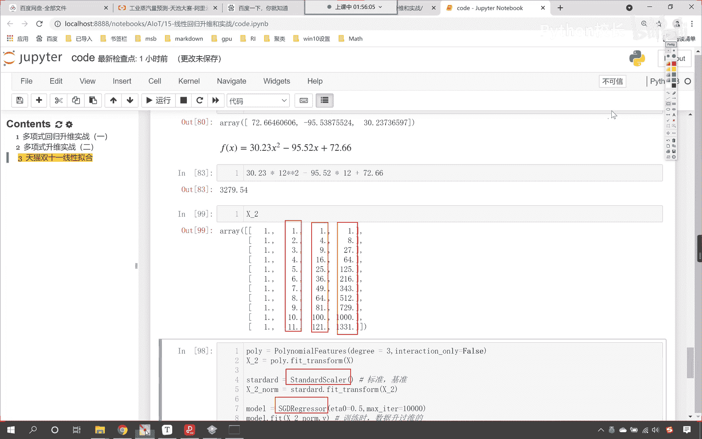

那么咱们最后呢我们再看一个啊。

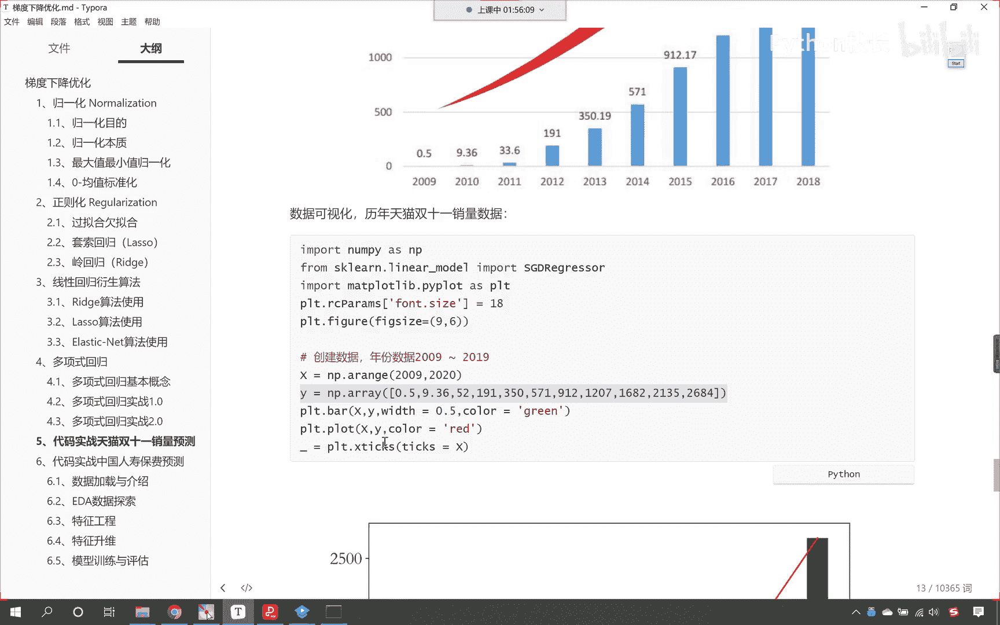

大家看这个呢就是代码实战实战，咱们中国人寿的保费预测，那么这个里边儿呢咱们就讲解其中的一部分。

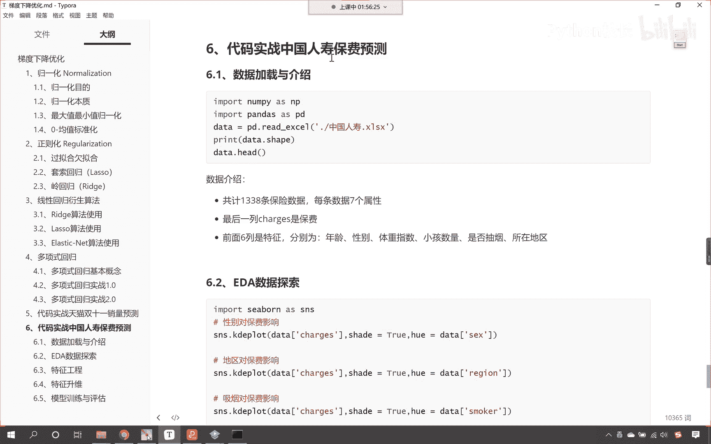

那么我们就将这个eda数据探索。

咱把这一步讲解一下，因为我们之前咱们讲c bn的时候呃，已经过去很长时间了。

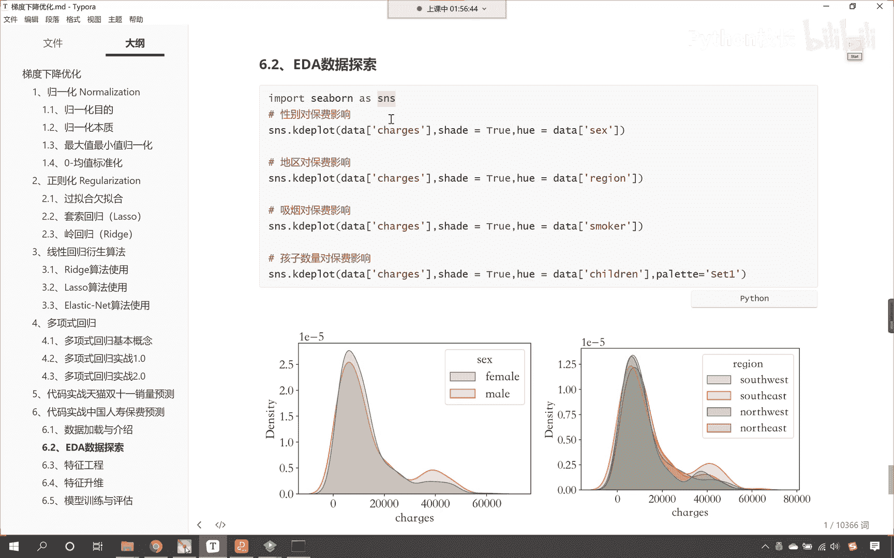

咱们使用cbn，咱们将这个数据可视化。

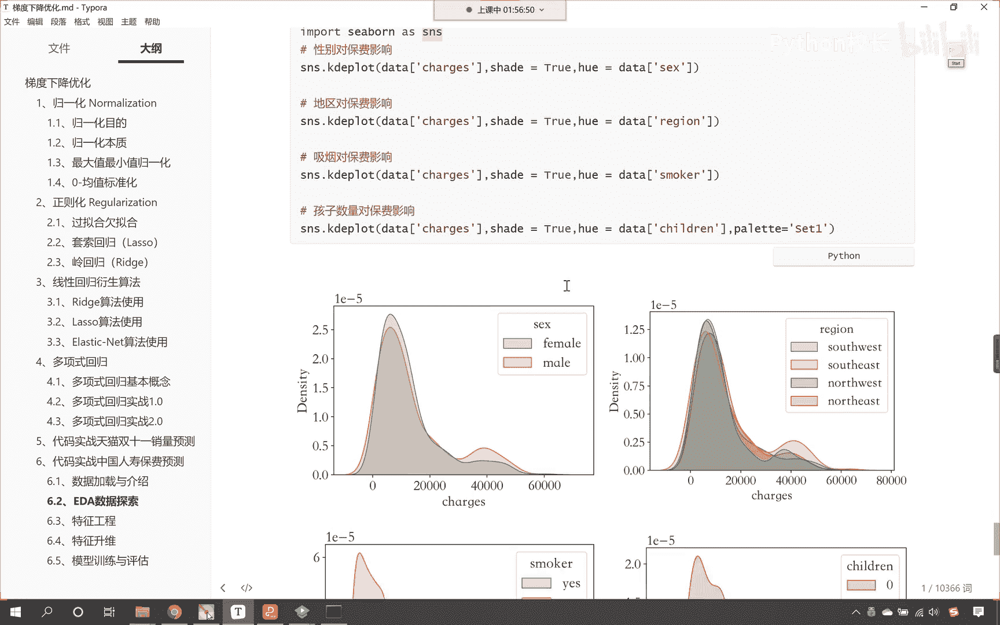

我们呢做一个操作，把这个讲完之后，咱们今天课后作业呢就是代码实战，咱们中国人寿的这个保费的预测来。

那么这个数据呢我已经上传到百度网盘中了。

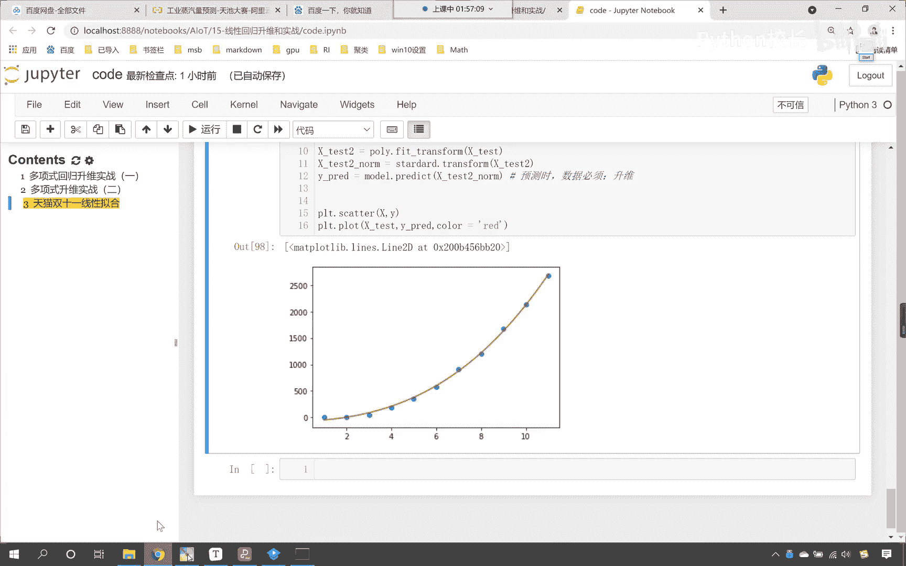

在咱们的这个课件当中，15，你看这个中国人寿的数据是不是已经有了呀，现在呢咱把这个数据啊。

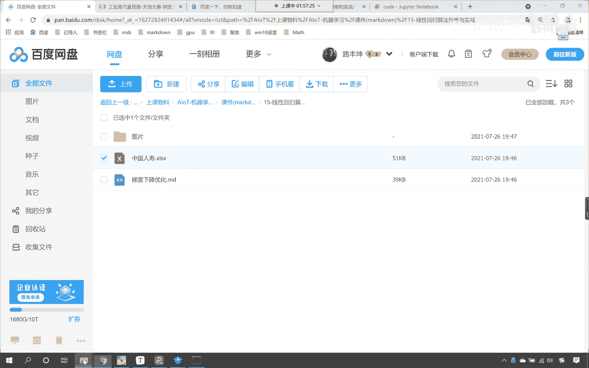

现在咱们把这个数据，放到咱们当前代码下剪切一下，放到15，咱们在这来一个粘贴，ok在当前目录下有数据了，那么我们就可以在代码当中。

把这个数据给它加载进来，现在呢咱们再来一个三级标题，这个呢就是中国人寿它的保费预测，你想不同的人买保险，不同的地区买保险，那他的这个保费是不一样的，是不是不同的汽车上保险，它的保费一样吗。

是不是你奥迪和奥拓啊是吧，上保险那是不一样的，对不对，那你越贵的车，你所说要买保险的时候，你的这个保险费用是不是就越高呀，对不对，好，那么咱们现在呢把这个数据，我们给它加载进来啊。

咱们import pandas as pd执行一下这个代码，然后呢咱们import seb as sn s执行一下好，现在的话咱们导包已经完成了，那么我们就加载数据，那就是pd。read excel。

在当前路径下有中国人寿得到的数据，咱们起名叫data，查看一下咱们data的前几条数据来，各位小伙伴，你就看到咱们这个数据了，是不是啊，看到这个数据了吧，那这个数据咱们简单介绍一下最后一列。

最后一列是什么，是不是就是咱们买保险的时候，你该交多少钱呀，这个就是保费叫chinese，你看那我们前面前面的这些数据，是不是都影响着最后你的这个买保险的时候，你该交多少钱，是不是你想这个刚出生的婴儿。

那么他如果要买保险，他的保险费用就低一些，80岁的老人买保险是吧，那你的那你的费用保险费用是吧，肯定就高，因为到了80岁是不是更容易生病呀，刚出生的小孩儿各方各方面的照顾，各方面的营养都比较大。

是不是不容易生病呀，好所以说你看年龄是不是影响保费性别，是不是也影响肥胖，这个就是体重指数啊，这个children就是你家里边有几个孩子，有小孩也影响你的保费是吧，如果你的小孩太多或太少是吧。

都会是否吸烟，是不是也影响呀，你要不吸烟的话，是不是更加健康，还有一个region，region就是地区，有的时候这个地区对它是不是也有一定的影响，也有一定的影响呀，对不对，你看你是这个东南还是西南。

还是还是咱们东部沿海，那对于这个保费都有一定的影响，是不是好，那么这些指标是不是都影响着咱们的保费呀，那咱们现在就问一下，说这个性别对于保费有影响吗，你认为性别对于保费有没有影响。

你认为地区对保费有没有影响，有没有影响，咱们得需要分析一下，我们不能根据咱们的直觉做出决定，对不对，那咱们就画图画一下好，咱们就使用咱们的sn s，咱们调用它的kd plot。

这个kd 1 plot画出来的图呢，就是它的概率分布啊，就是它的概率分分布，你看这个图画出来的是什么，在这儿呢咱们进行一个说明啊，这个呢就是概率分布曲线，我们要看性别，对于咱们的保费有没有影响。

咱们是不是把性别男女的数据画出来，看对照一下，咱们就知道是否有是否有影响了，对不对，那咱们就绘制一下要绘制的数据，就是咱们data当中的charges，这个就是咱们的保费，我们就看一下它不同的因素。

对于保费是否有有影响，she的就是给他一个阴影，s h a d e啊，she给它一个阴影，来一个true，咱们的hill就是根据什么来进行划分，那就是data中括号，咱们将性别放到这儿。

这个时候你看我一执行，大家现在来看，咱们现在所画出来的是不是就是性别呀，看到了吧，就是性别，你看female是不是女性，male是不是男性，现在我们就发现咱们的概率分布曲线这两条线。

这个男的和女的这两条线，它的吻合程度是不是95%呀，你看它的吻合程度，是不是可以达到95%，它们的走势是不是都是一样的，所以说就在保险这一块儿是吧，收费多少跟你是男的是女的有影响吗，没有影响，对不对。

也就是说画出来这个图之后，我们就发现你是男的还是女的，跟你这个唉保费是吧，它的区分程度不大，看到了吧，区分没啥区分，没啥区别，是不是我们这个叫没啥区别，你想一个特征，如果对于它的保费影响特别大。

应该是什么样的情况呢，咱们假设说啊，你看啊男的买保险特别便宜，你看它的曲线走势你要注意啊，咱们说90%，你看它的曲线走势，是不是95%的吻合呀，看到了吧，95%的吻合，看到了吧。

你看这个走势是不是95%吻合，因为你看面积就知道了啊，你看面积是不是95%的一个吻合呀，所以说性别这个是可以忽略的，因为呢你性别是男和女，对于你交保费的多少没什么这个区别，性没有特别大的差异。

我们就知道，就是我们交保险是不是为了防止意外啊，对不对，你想出事故的时候，难道男的和女的她她有特别大的一个区分吗，对不对，你统计一下是吧，我们的保险可能是为了保意外，或者说保卫或者说保生病。

咱们发生交通事故，难道男的就比女的死亡率要高很多吗，或者说生病的时候，这男的就比女的高很多，或者说女的比男的高很多，那不一定是不是因为男的女的只是性别，在上帝眼里，你都是人，你都要得病。

你出交通事故的概率是一样的，所以说呢咱们就哎看到这个图，咱们就知道这男的和女的是吧，哎都一样啊，哎现在你看我们就知道有女司机是不是好，那么咱们看了这个性别的概率密度了。

来咱们复制一下ctrl v什么样的特征在这儿呢，我告诉你什么样的特征是好特征啊，啊叫什么样的特征，它是好特征呢，看什么样的特征是好特征，就是它的区别度怎么样大啊，区别度大，区别度特别明显。

哎这就是好特征，那比如说咱们现在呢我们看一下抽烟啊，你看咱们看一下smoker，你看我这时候一执行来，各位小伙伴，你看抽烟和不抽烟影响是不是特别大，看到了吗，这个黄色的看到了吗。

你这个这个这个黄色的就是不抽烟的，如果要不抽烟的话，怎么样，你买保险的时候，这个费用是不是就会低一些，你如果要是抽烟的话，你就能够发现你买保险的时候，收费是不是可能会很高呀，看到了吧。

就是这个下面蓝色的这个图，这个特征它就是好特征，看到了这个特征它呢就是好特征，我们可以根据抽烟不抽烟，咱们就简单的嗯嗯就是在买保险的，卖保险的时候是吧，定价的时候，那我们就会有一个非常大的一个趋势。

什么呀，就是如果你抽烟的话，o我想都不用想，你的保险这个收费就要高一些，因为你抽烟的话，你换疾病的概率是不是就更高，你要不抽烟的话是吧，不抽烟不喝酒是吧，那怎么样你的健康呀，那收保险的时候。

这个费用我要降得低一些，这样的话我是不是可以让更多不抽烟的人，是不是买保险啊，保险公司它会有一定的策略，知道吗，所以说你看是否抽烟，对于咱们最后这个保费的嗯，对于咱们最后这个保险费用是吧。

它有一定的影响是吧，你看你第一个抽烟怎么样，你的保险费用是不是就是16884，你不抽烟，第二个不抽烟，是不是就是1724，对不对，好，那么我们再看一个特征啊，看ctrl c，咱们来一个ctrl v。

那我们看一下咱们的region r e g i o n，这个region就是咱们所说的区域，看看啊，region就是咱们所说的地区是吧，这个有这个西南是吧，东南，然后西北东北。

咱们现在就能够发现我们统计区域的时候，咱们又没有按照省来进行划分，那我们按照非常这个粗糙的东南西南东北西北，咱们发现这四条线和咱们刚才的性别，是不是很像呀，他们是不是也比较吻合，看到了吗。

他们是不是也比较吻合，所以那这个特征呢它对于我们看这个特征，也就是说区域它对于咱们的保费是吧，它的影响怎么样不明显啊，它影响不明显，也就是说它没有一个很好的区分度，看它没有一个很好的区分度。

所以说唉那他这个这个保险呢，就嗯这个特征对于我们来说就不重要啊，不重要不重要，那就是可有可无，根据奥卡姆剃刀原则，如果它不重要，咱们就怎么样呀，就可以把这个特征删除掉，然后那我们再看一下吧。

好咱们再看一下，就是说你家里边有没有小孩，对他有影响吗，咱们看一下children，是不是我们知道这个children呢，是不是就代表咱们的小孩儿呀，看到了，你看这个小孩儿呢就表示没有小孩，一个小孩。

两个小孩，三个小孩，四个小孩，五个小孩，有的是不是特别能生呀，对不对呀，那咱们看到这个曲线之后，咱们就发现这个是否有小孩儿，那有小孩儿其实就代表着家庭，对不对，那我们这个呢是有一定区分度的啊。

也就是说在在卖保险的时候，那你家里边没有小孩儿和你有小孩儿，两个小孩，三个小孩儿，他呢是有一定影响的，所以说这个特征它呢有一定的区分度，看有一定的区分度，你发现这个规律是不一样的，看到了吗。

这个规律它是你看这个高和矮是不一样的，所以说呢有一定区分度，咱们呢建议把这个留下，那建议把这个特征呢我们就留下，你像上面咱们的这个地区呀，还有咱们的性别呀，一看他们就特别像相似度特别高的时候。

那我们可以把这个特征删除掉，好，那么到这里咱们是不是就可以通过画图来观察，哪一些属性是好的特征。

哪一些是不是可以删除掉呀，好那么我们在这儿呢。

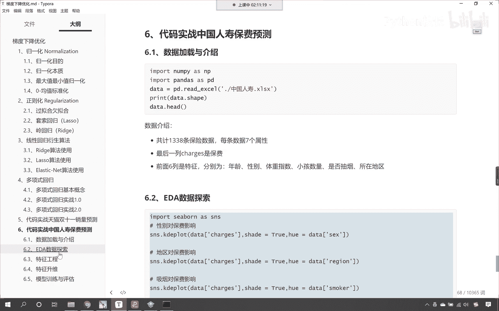

就各位就给各位小伙伴讲了一下，咱们的这个叫嗯这个呢就叫做e d a数据探索，这个e d a呢就叫做这个叫explore data analysis，eda的三个英语单词，它翻译成中文就叫做数据探索。

d呢是data a呢是analysis，这个e呢是explore explore。

就有探索的意思，就探索数据分析好。

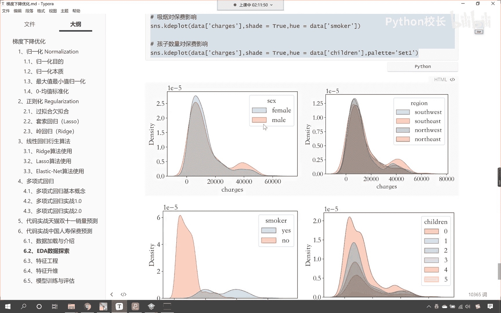

那么大家呢根据我们探索的一个结果，我们进行相应的特征工程，比如说该删除的删除，该进行转换的。

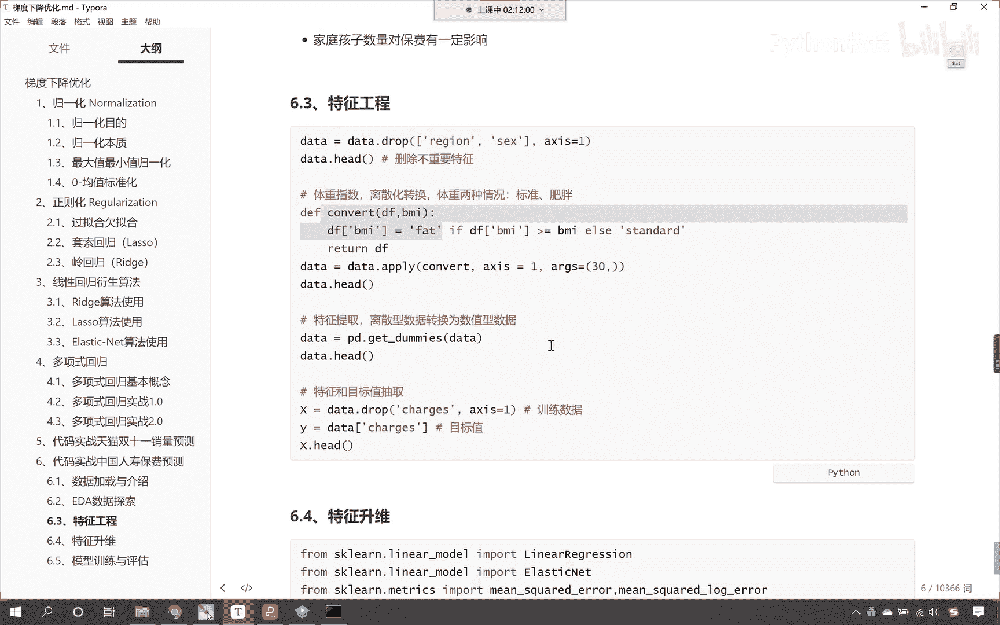

我们进行转换，该将离散型数据转换成这个数值型数据的。

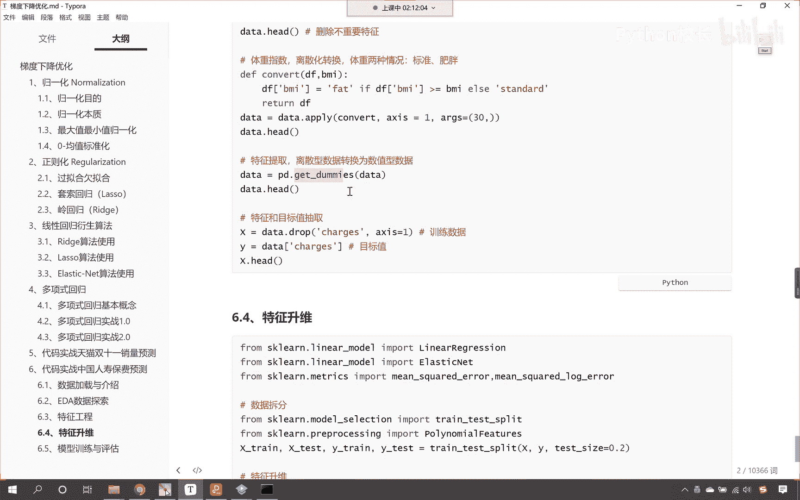

我们都要进行一个转换，在咱们的代码当中，你能够看到咱们的数据呢。

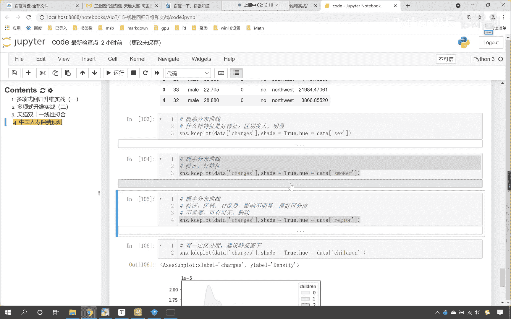

你看我们的children是字符串这个bmi看到了bmi，它是不是代表咱们是否肥胖呀，这叫体重指数，是不是像咱们的性别呀，region呀，这两列可以删除剩下的这些列是吧，咱们进行相应的数据处理。

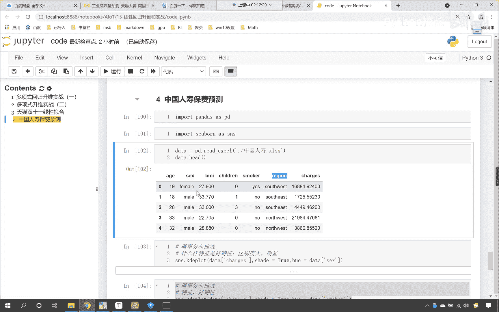

这就是咱们课件当中所说到的这个特征工程。

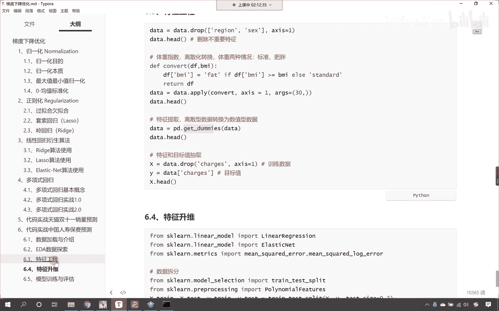

那特征工程之之后呢，我们进行特征升维，是不是啊，咱们进行一个特征升维操作好，那么然后呢进行模型的评估。

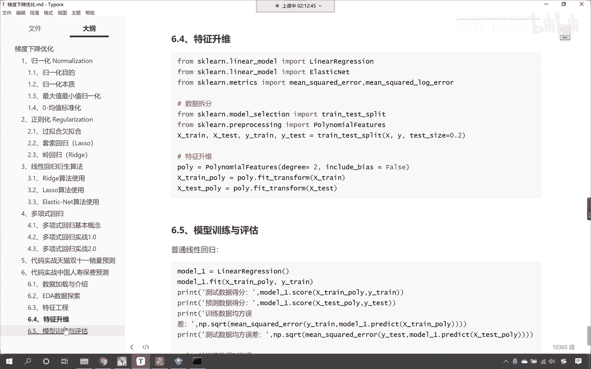

那我们今天晚上的作业呢。

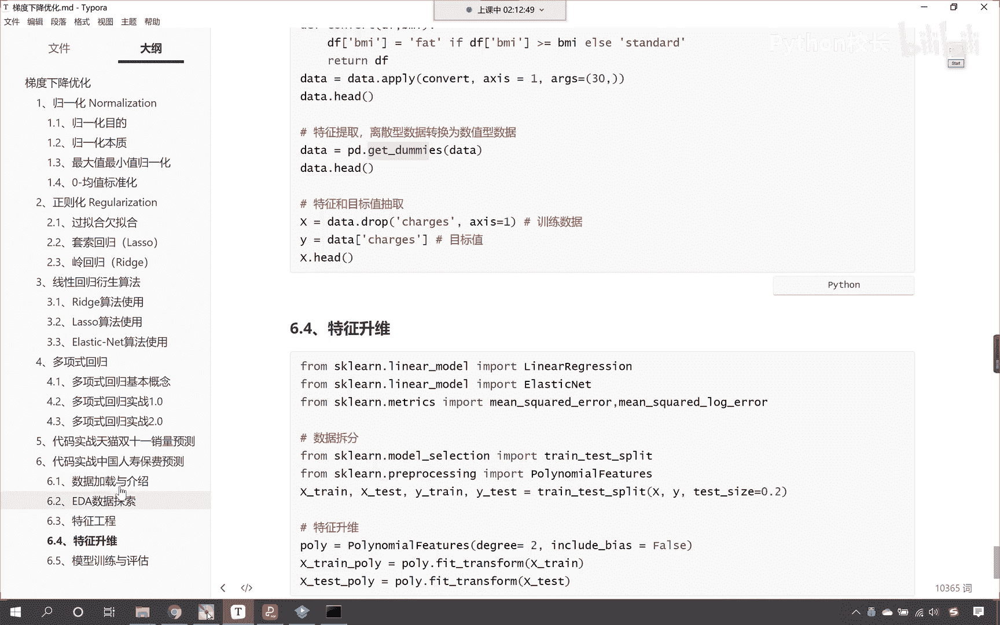

咱们就是用咱们之前所学到的方法，把咱们这个中国人寿的保费跟哪些因素有关，咱们进行一个建模运算。

