# P109：3-逻辑回归OVR建模与概率预测 - 程序大本营 - BV1KL411z7WA

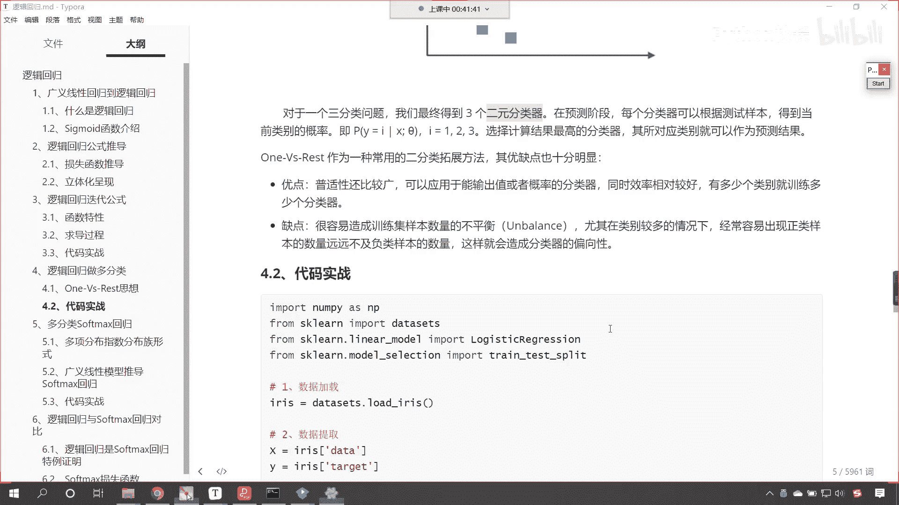

现在呢咱们回到代码当中好，那么我们看一下o vs它的使用啊。

创建一个代码，给这个代码改个名叫做code，现在呢我们导一下包，import numpy as np from，呃，然后呢我们from sk learn。

从linear model当中咱们导入logistic regression，同时呢from sk learn，咱们import data sets，执行一下这个代码，咱们在选中它。

在第一行代码的上面插入一行，来一个三级标题，那我们这个三级标题呢，唉就是咱们o就叫做one vs rest，这个呢就是咱们的举例说明，好那么我们导包了，然后咱们就加载数据，那就是data sets。

点咱们漏的一个eris，这个就是原为花里边给一个参数，return x y，我们让它等于true，这个就表示加载数据的时候，不用为我返回其他的这个详细介绍信息，说明信息直接返回x y就可以了。

咱们接收一下xy，那有了这个数据之后，咱们的from sk learn model selection，从这个当中咱们导入train test split，这个方法的作用，它呢就是拆分数据。

它呢会随机打乱顺序，知道吗，它会随随机打乱顺序，那我们现在呢就调用train test split，将咱们的数据xy放进去，默认情况下它有一个参数叫test size，这个呢会是给一个0。2的比例。

那这个是什么意思呢，也就是说咱们测试数据的比例是0。2，也就是20%，我们一共有150个数据，袁惟花这个数据是150个数据，它呢是分三类，我们把它叫做150个样本，它呢有三个类别，原为花是一种植物是吧。

我们不太关心它的三个类别到底是什么，那对于植物学家而言，他们研究之后发现是吧，因为生长环境不一样，就导致呢这个同一种植物，不同的环境下慢慢进行了呃，这个演进慢慢进行了演化是吧，最后呢类别不一样了。

但是呢它依然是同根同源的，就像我们人和大猩猩是吧，现在看起来完全不一样了，是不是，但是呢你这个几百万年以前是吧，我们都是同根同源的好，那么拆分之后呢，咱们就接收一下啊，那就是x下划线串x下划线test。

它先将x拆分成两份，y呢也拆分成两份y下划线test，现在呢咱们展示一下这个数据，那就是display x下划线串点ship，我们查看一下它的形状，那x下划线test也调用一下它的sh。

那么再来一个display，接下来呢我们看一下目标值，外出点sh，y下划线test。ship执行这个代码。

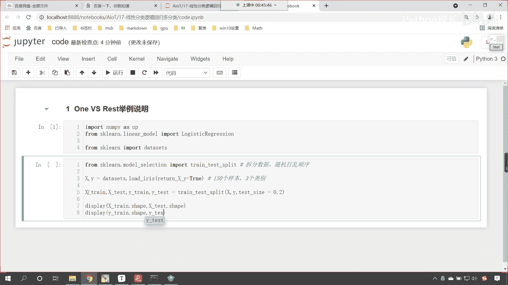

各位小伙伴你就能够看到是吧，总数据是150个，拆分之后一个变成了120，另一个变成了30，对不对，这说明咱们数据拆分是没问题的啊，好那么咱们train test split。

split里边还有一个参数叫random state，这个是一个随机数的状态，那我们如果要给1024的话，这个时候呢咱们随机产生的数据，它所产生的数据就是固定的，我给你举一个例子啊。

看一下咱们x train，看一下它的前五个数据，这个时候你看一执行看啊，固定的状态，无论我执行多少次，上面咱们是不是说这个train test split，它可以随机打乱顺序啊，现在呢我给了1024。

那么他在打乱顺序的时候，只能按照这种规则来打乱顺序，你看五点，大家看这个数据，5。4，5。4，6。1，6。4，5。6，5。8，我再执行一次啊，你看啊，光标放到这，现在是三，我再执行一次，是不是变成四了。

变成四之后，你发现是不是还是5。4，6。1，6。4，5。6，5。8呀。

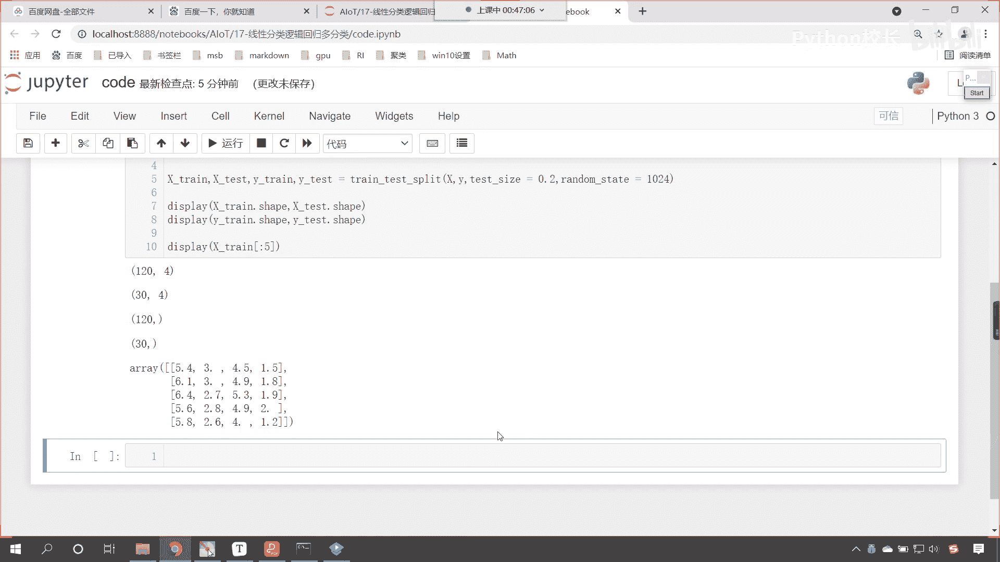

一模一样，如果说我们要不给这个参数，那么它每次划分就都会不一样。

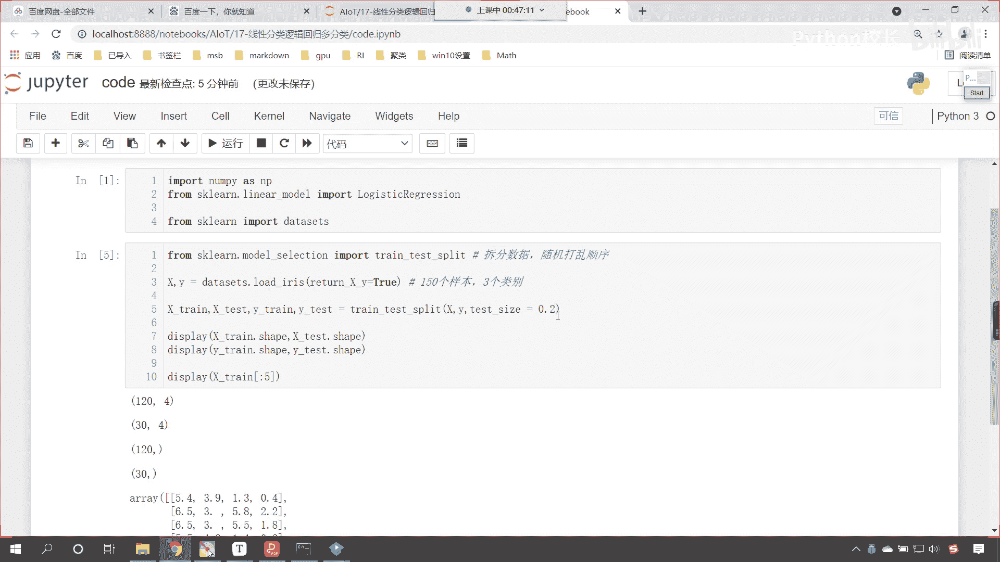

你看这次划分是不是5。4。

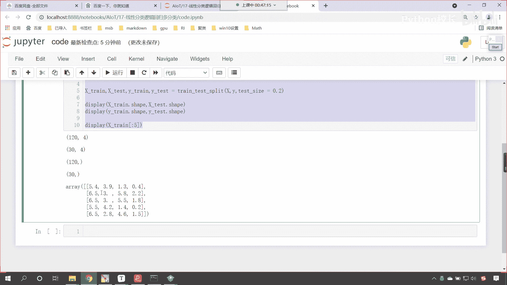

6。5，6。5，5。5，6。5呀，我再执行一次啊，看啊大家注意观察啊，现在是五，咱们再执行一次，它是不是就变成六了，现在你看这个是不是就变成5。7了，是不是啊，所以说为了我的代码和你的代码统一。

咱们呢给random state给一个固定的值，你知道这个参数它的作用是什么，就可以了啊，咱们在这儿呢进行一个参数的说明，那么我们的test size是咱们测试数据的比例嗯，测试数据的比例。

下面这个random state是咱们的这个呃，随机打乱顺序，那随机打乱顺序它呢就固定了，这个时候呢我写的代码和你写的代码，咱们的结果就是一样的了，并且呢每一次执行也都一样了。

来双击合起来，咱们在上方呢给它插入一行四级标题，这个呢就是加载数据。

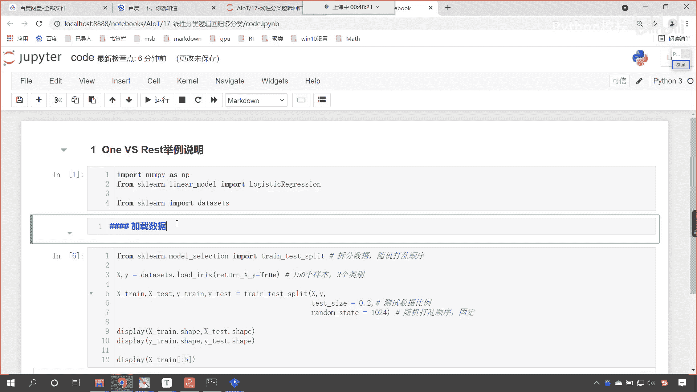

那么我们所加载的数据呢，咱们查看一下咱们的外看。

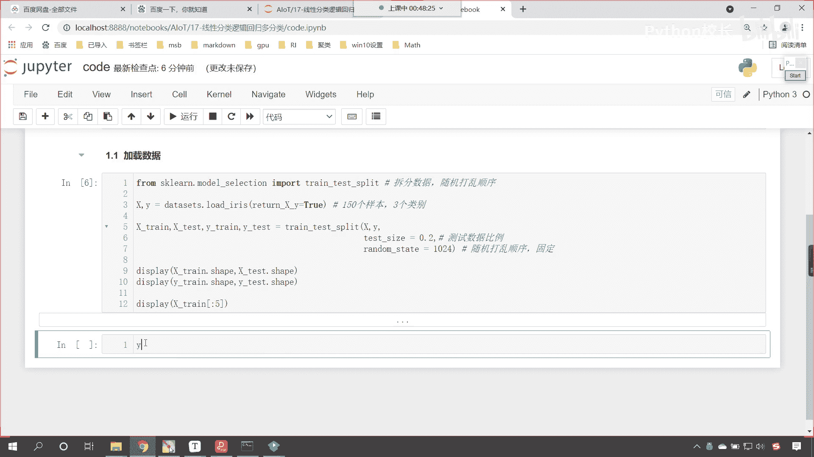

查看一下咱们的y，这个时候就能够发现确实是三分类问题，是不是那之所以是类别零，是不是由于它的特征决定的是吧，之所以是类别，一也是由它的特征决定的类别。

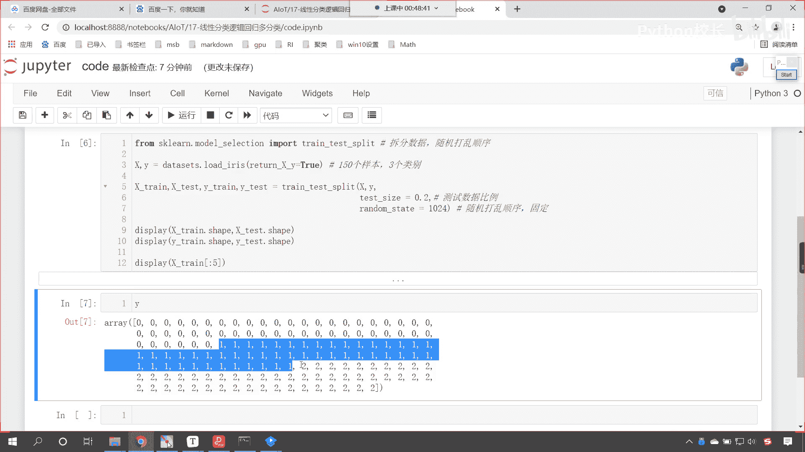

二也是由它的特征决定的好，那么咱们现在呢我们就使用逻辑斯蒂回归来。

对于我们这个数据咱们进行一个建模，好现在呢咱们就建模，咱们使用o vr来进行建模，那我们就生成咱们的模型，model就等于logistic regression，这个里边儿咱们现在呢就要给相应的参数了。

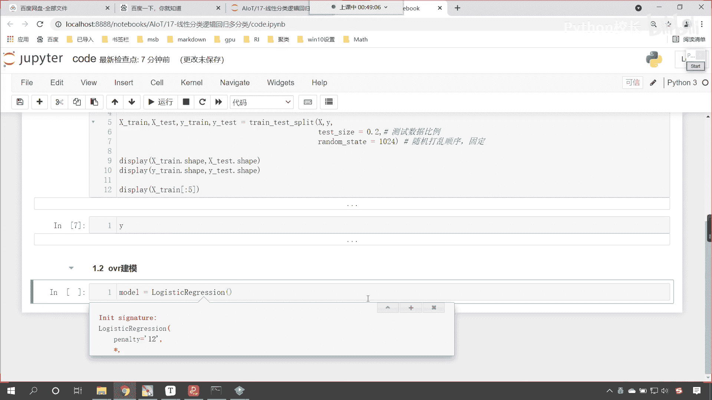

唉大家现在能够看到这个penalty，是不是就是惩罚的意思呀，你能够看到这个是l2 ，对不对，大家要注意啊，这个是l2 ，而不是12，这个这个就是惩罚项，之前咱们讲线性回归的时候，咱们是不是讲过领回归。

咱们是不是讲过螺丝回归呀，还记得螺丝回归弹性网络，对于我们天池工业蒸汽量是吧，这个分数的提升是不是非常有帮助呀，好那么l2 呢嗯就是咱们第二范数是吧，嗯这就是第二范数，它所提供的一个正则项是吧。

它可以将咱们的系数进行缩小，从而防止过拟合好，那么我们看一下咱们的，看一下咱们其中一个参数叫做music class，这个mute呢就有多的意思，这个class呢就有这个类别的意思。

那默认情况下这个参数是auto，是不是，对不对，那你默认情况下是auto，那我们现在要使用ovr这种形式，那我们看一下，我们往下滑，看一下它对于music class这个参数是如何说明的，来我们往下滑。

大家看是不是在这里呀，看到了吗，在这里在这个当中你能够看到一个叫auto auto，就是默认的默认的话就是你不用指定，我根据你传入的数据来决定，到底是这个二分类还是多分类，那o vr呢咱们就强制指定了。

它必须得是这个one vs rest这种形式来进行划分，还有一种形式叫mutational，mutational，就有多项式的意思。

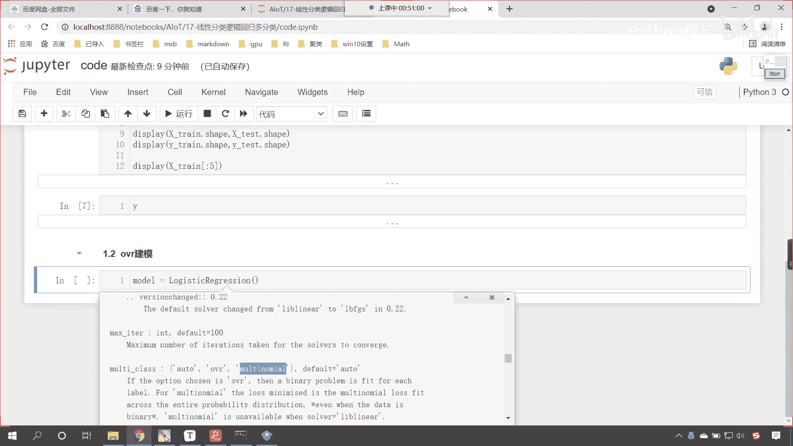

就有多分类的意思，现在呢我们要验证的就是咱们的o vr这种情况，所以说这个参数咱们给他o v r，然后咱们就使用模型进行训练，咱们将x train放进去，y下划线train放进去。

这个时候大家看咱们模型就建好了，模型建好之后呢，咱们看一下这个模型它的情况啊，model点咱们predict我们预测一下，那就是x test y下划线test啊，这个预测一下。

预测的话不需要y test预测的结果，咱们接受一下，那就是p r e d，那就是y下划线p r e d好，那么这个就是咱们的预测结果，这个时候呢咱们第四play一下。

将咱们的y下划线test这个是不是真实值呀，对不对，我们查看一下它的前十个，那预测值呢是y下划线p r e d，咱们也查看它的前十个。

这个时候你看我一直行，大家看前十个是不是一模一样呀，正确是不是，那准确率怎么样呀，准确率咱们是不是可以使用sc叫做model调用model，点死sc查看一下它的分数，那咱们把相应的数据放进去。

想要求它的sc是不是把数据放进去，真实答案放进去啊，数据就是x test，真实答案就是咱们y和它对应的y test，这个时候咱们打印输出一下啊，看我print一下，咱们不仅打印。

不仅把它的准确率打印输出一下，同时咱们在这个地方呢再来一个这个文本，这个呢就是咱们逻辑回归看，这就是咱们逻辑回归ovr是吧，这种这种实现方式，我们的准确率冒号是多少，你看一直讲大家看准确率是0。966。

那么除了直接调用car这种方式求准确率，我们呢再导一个包，from sk 6，咱们从metrics下导一个包，叫做accuracy score，看咱们倒一个包，大家看导包，我根据快捷键提示多了一个c。

把这个c删掉，再来执行，看导包就导进来了，那a什么是accuracy car呢，什么又是matrix呢，matrix就有评估的意思啊，这个matrix就有评估，评估的话就是对模型评估。

那iqc score呢翻译成中文，这个就是准确率分数啊，这就是准确率分数，那咱们现在呢就使用准确率分数。

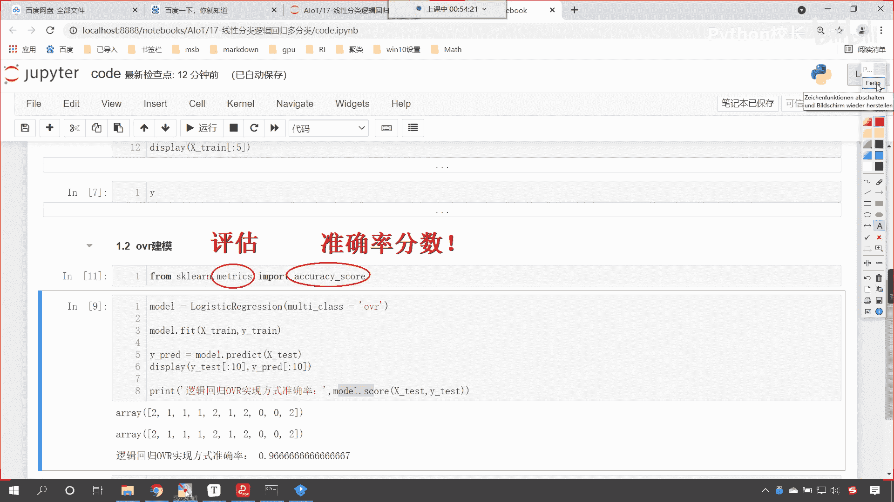

我们来算一下它的准确率，那就调用这个方法，这个方法里边儿给什么参数呀，光标放放进去，shift tab，你来看一看我们该传什么样的参数，我们是不是传一个外处传一个y predict呀。

外出是不是就是咱们的y test，这个是不是保留下来测试数据的准确值呀，那y predict呢，是不是就是咱们计算出来的y predict呀。

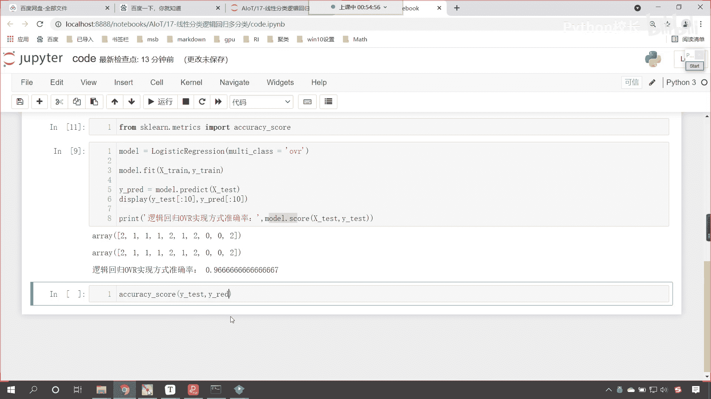

你看我一执行这个准确率是多少，0。9666和上面一样不一样，是不是看和上面一样。

嗯那接下来呢我们再自己算一下啊，这个每次咱们在调用模型方法的时候，我们都感觉这个好神奇呀，是不是看到了吧，直接一运算出来一个结果，是不是一训练一预测是吧，一定要用高出来一个结果。

我们调用accuracy这个方法也能出来一个结果，他俩一样，他俩也必然一样，对不对，那这到底怎么算的呀。

嗯既然我们上面已经有了y predict，咱们已经有了咱们的这个test。

那我们自己算一下好不好，这怎么算呢，准确率准确率是不是就是比较它俩是否相同呀，你要全部相同的话，是不是就是全部正确，全部正确，那你是不是就是100分，是不是就是百分之百是吧，咱们比较一下呗。

那就是y下划线predict等等，咱们的y下划线test，你看这个不就是咱们的运算吗，是不是他俩一比较。

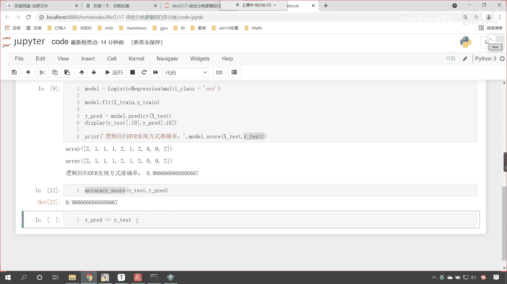

这个时候你就发现看到了吧，得到的值是不是true和false呀，然后呢咱们小括号括起来啊，咱们怎么样呀，看啊求一下它的me，你看我一执行诶，我滴乖乖，各位小伙伴，看我们求解出来的结果是不是0。966。

和上面一样呀，现在你明白accuracy这个方法，它里边到底是写了什么了吧，你知道这个方法里面是怎么写的吗，看啊就这个方法里面，这个方法里面它的原理就是这一行代码，知道吗，就是比较。

那现在有小伙伴可能不太清楚，说老师为啥你求命直接就出来了，看咱们得到的结果是true false，这不是数呀，那我告诉你，在咱们代码当中，python代码当中，这个true呢它就相当于一。

咱们的false呢它就相当于零，看到了吗，false就相当于零，那我们如何求准确率，是不是如何求准确率呀，你想是不是就相当于求一个和，然后再除以它的总数呀，我们的总数训练数据，测试数据是不是30个。

对不对，哎你看我一直行，咱们得到的结果是不是0。966啊，对不对，咱们得到的结果是0。966，咱们有的同学全是true。

是不是咱们说了，来咱们的jericho sy，你的random state也是1024吗，random state是不是也是1024，来在讨论区回答一下啊。

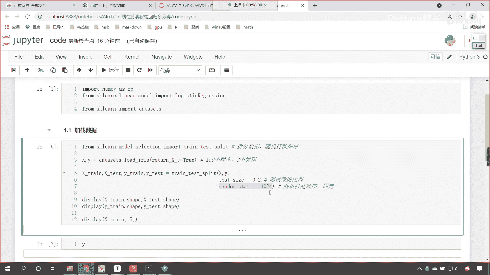

那我们在进行随机数生成的时候，看咱们在进行随机数生成的时候，因为我们的电脑也是不一样的，知道吗，因为我们的电脑也是不一样的，所以说就是在相同的电脑上，咱们固定了1024，那么它的这个操作才是这个腰嗯。

得到的结果才是一样的。

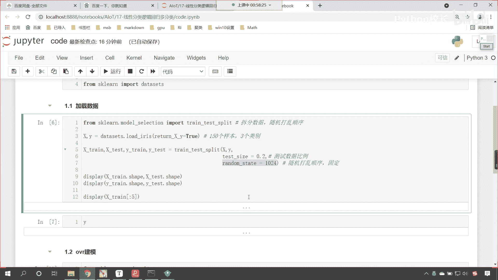

这个跟l2 是吧，这个跟你是否设置l2 ，它是这个没关系的，默认情况下你能够看到它都是设置l2 的，知道吗，看到了吗，默认情况下都是设置l2 ，你不写，那它也是l2 正则化。

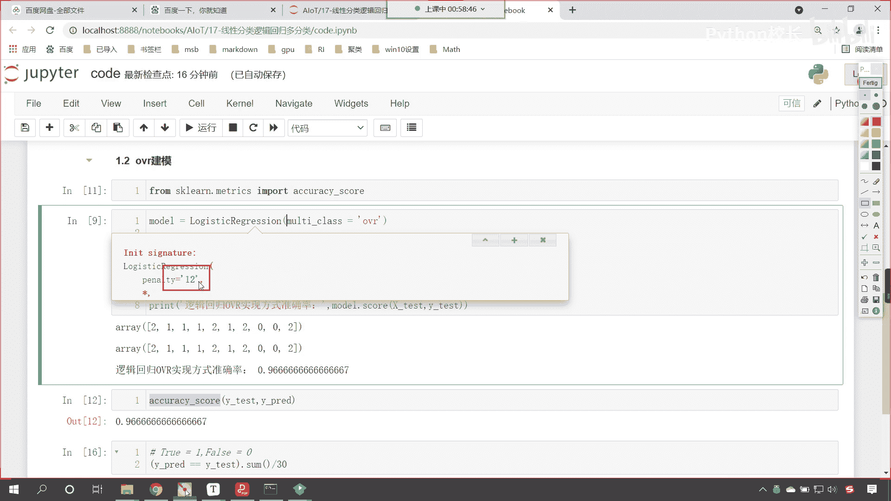

所以说咱们这个随机数是吧，train test split，它是受咱们数据划分的一些影响。

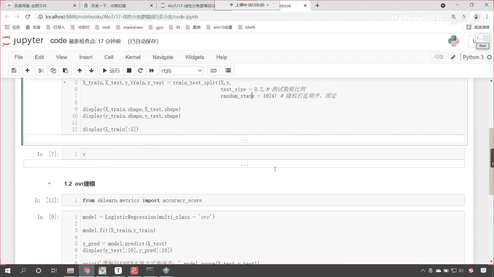

数据不同，咱们得到的结果肯定是不一样的。

无论它怎么不一样，但是它的原理都是一样的啊。

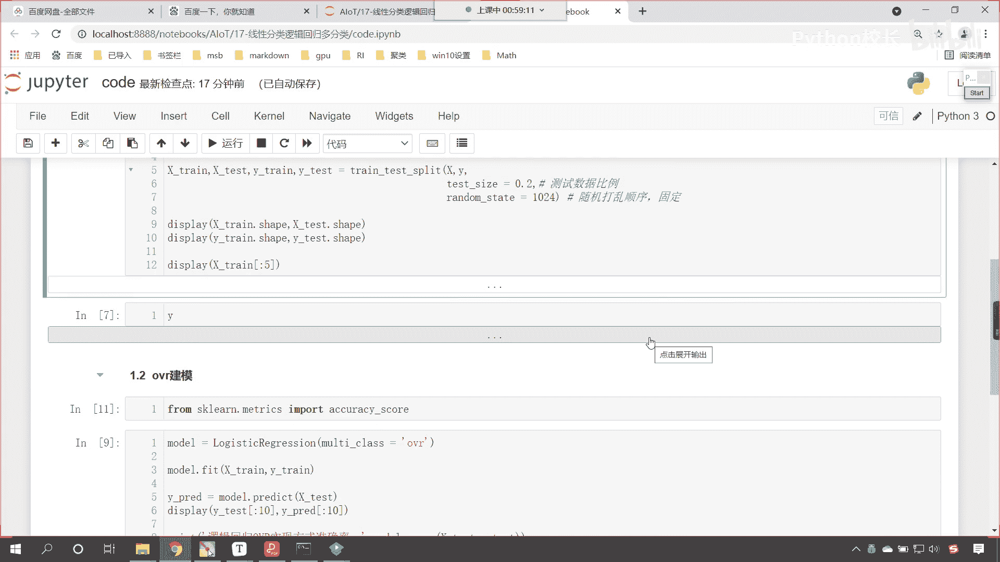

好那么咱们建模了。

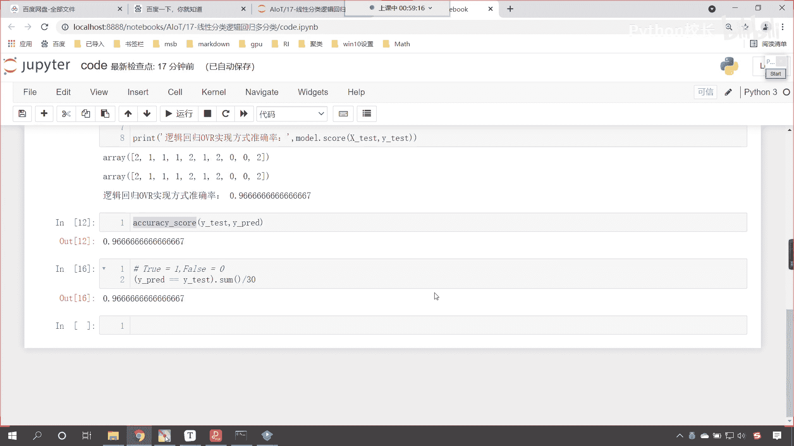

接下来呢咱们就使用这个模型，咱们就进行概率的一个预测啊，大家看看咱们进行概率预测。

好，那么咱们就使用model model，点调用它的方法叫predict probe，我们将x下划线test放进去得到的结果，p r o b a杠来，咱们打印输出一下它的前十个好不好看，我一直行。

你在你的大脑当中想象一下，咱们probe这个数据它是几维的，它有几例，看你想一下咱们这个数据有几列嗯，咱们呢这个数据是几维的，看你想一下咱们这个数据是几维的，一旦我这么问的时候是吧。

咱们有很多这个小伙伴肯定就猜出来了嗯，你既然问了是几列是吧，那这个几列跟什么有关呢，这个几列呢跟咱们的类别有关，我们是不是有三个类别呀，那你既然有三个类别，那么它就有三个概率，是不是一个类别嗯是吧。

那一个类别是不是就占一类呀，你投票的时候是吧，他就有一个概率。

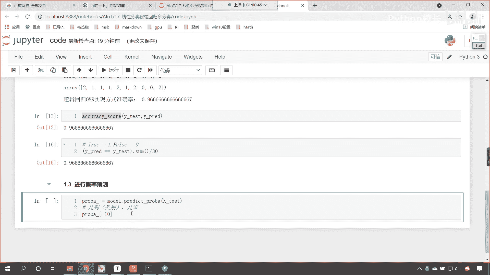

几维呢，二维啊，你看我一直行，现在你能够看到咱们这个数据是不是就有了，看到了吗，这个数据就有了，好咱们这个数据呢它属于是科学计数法，咱们给他设置一下np点，set print options。

super press，咱们给他来一个true。

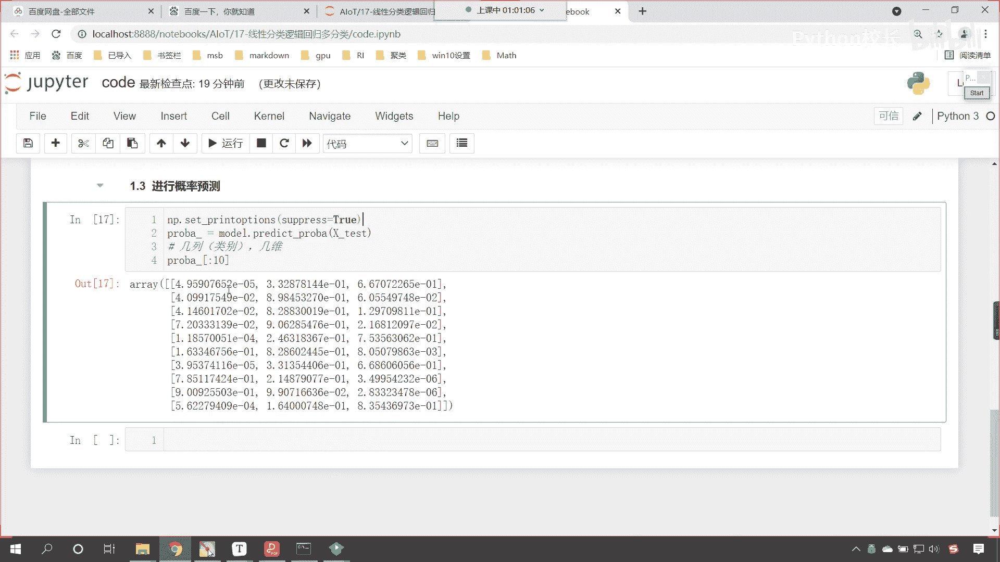

这个时候你看过一执行好，大家看是不是有三列数据啊对吧。

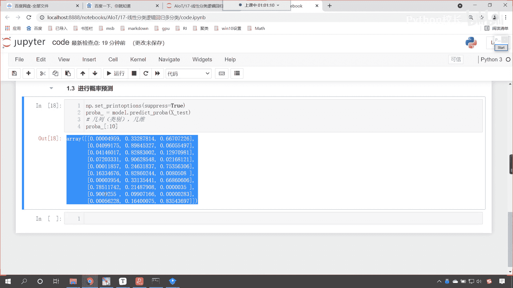

那请问这个概率是如何得到的呢对吧，咱们的概率是怎么得到的呀。

你想一下概率是如何算的，对不对啊，这为什么是你看我们在上面插入一行，咱们将咱们的真实值y predict输出它的前十个。

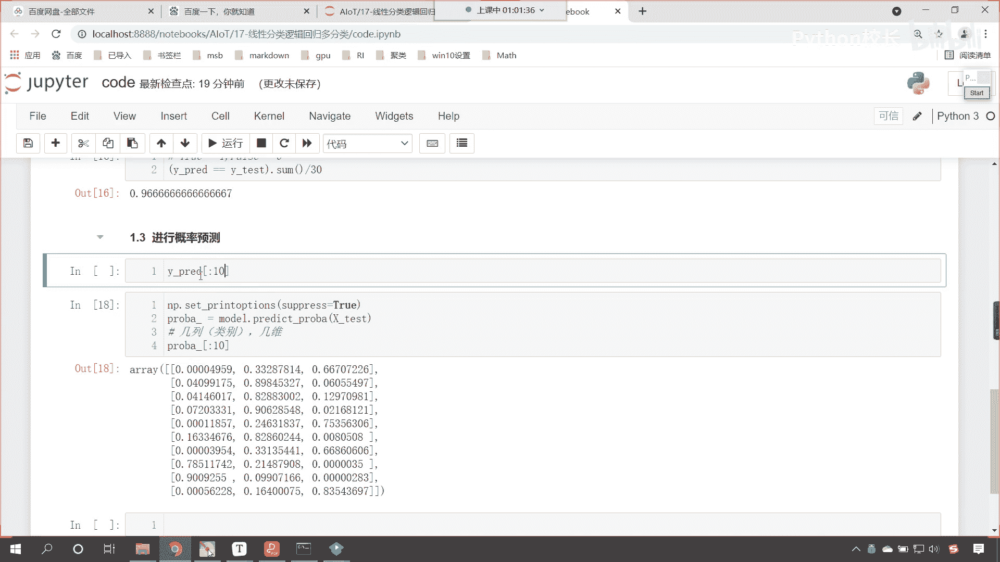

这为什么第一个类别是二呢，看到了吧，你为啥第一个类别是二，因为咱们概率当中0。667，它是不是最大呀，为什么，第二个类别是一，看到了，为什么它是一，因为咱们第二个样本当中，它的概率是不是0。898呀。

啊对不对，那咱们再看一下倒数第二个，为什么这个是零呢，对不对，我们看倒数第二个，你看这个的概率是多少，是不是0。90992呀，是不是还是比大小呀，谁大，那么我们划归类别的时候。

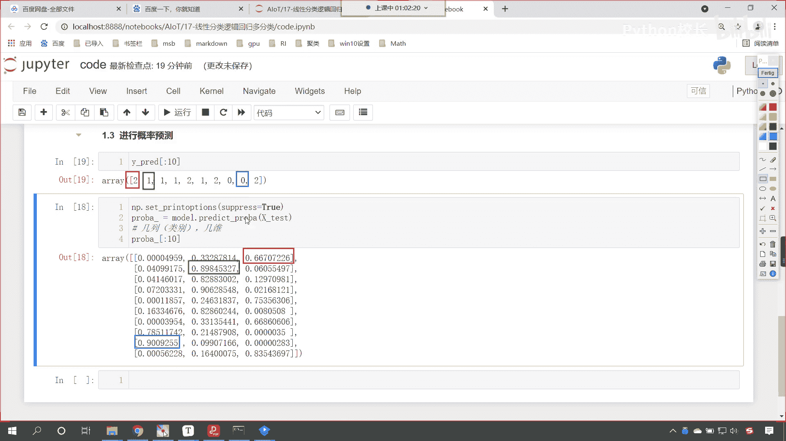