# P110：4-代码实现逻辑回归OVR概率计算 - 程序大本营 - BV1KL411z7WA

来接下来呢我们就自己手动算一下。

那这个概率是如何出来的，是不是啊，咱们来一个四级标题，这个时候呢就是概率的手动计算好，那么到底怎么算出来的呀，咱们说这个ovr，看我们的ovr，它是不是依然是看这个vr，是不是依然是sigmoid的。

对不对，依然是sigmoid，是不是，那咱们现在呢就定义一下咱们的sigmoid函数，好不好，那就是d e f4 个mod的小括号，这个当中给一个参数z，那有了这个参数z之后，咱们就return一下。

一除以小括号一加上np点，ex p是不是给他一个负z就可以了，看这个是不是就是咱们sigma的函数，对不对，有了西格玛y的函数之后，咱们从模型当中获得。

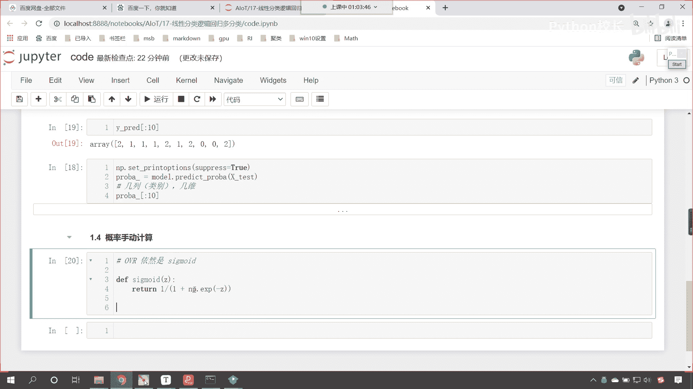

看我们可以从模型当中获得什么呢。

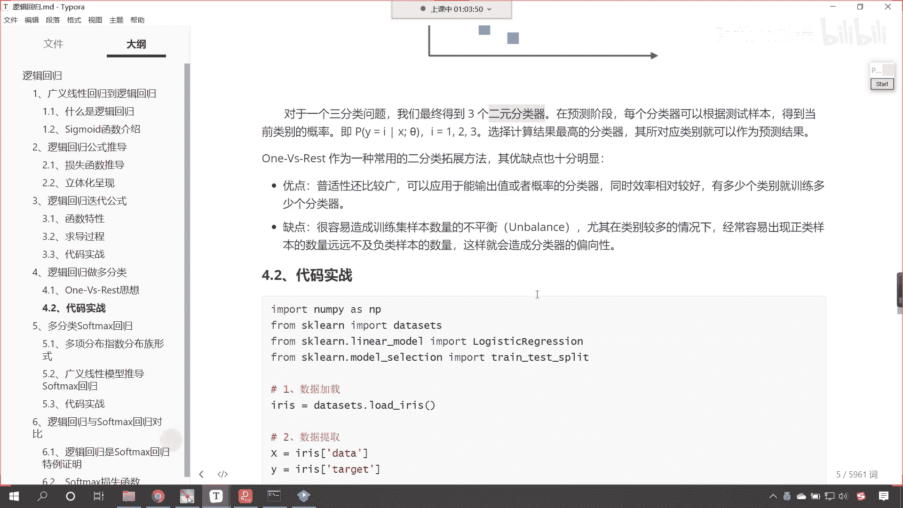

刚才咱们在介绍的时候，我们说这条线上面这条线，还有这条线是不是有三条线。

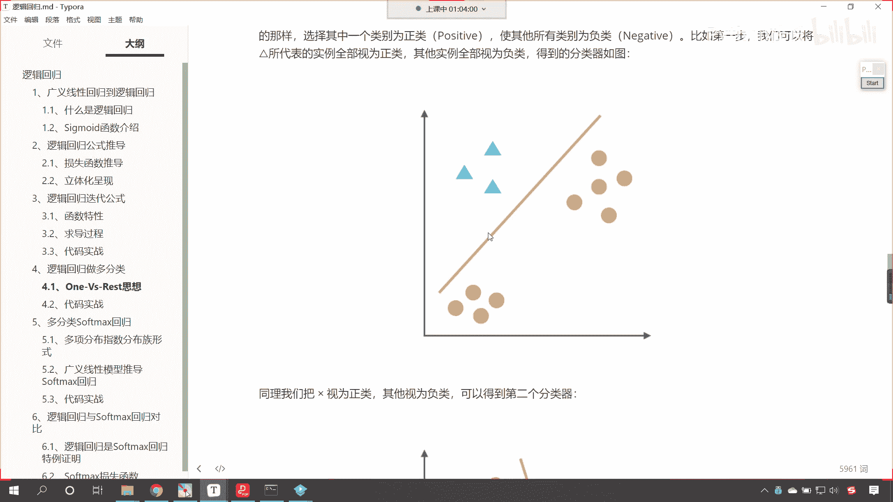

这三条线是不是就相当于三个方程。

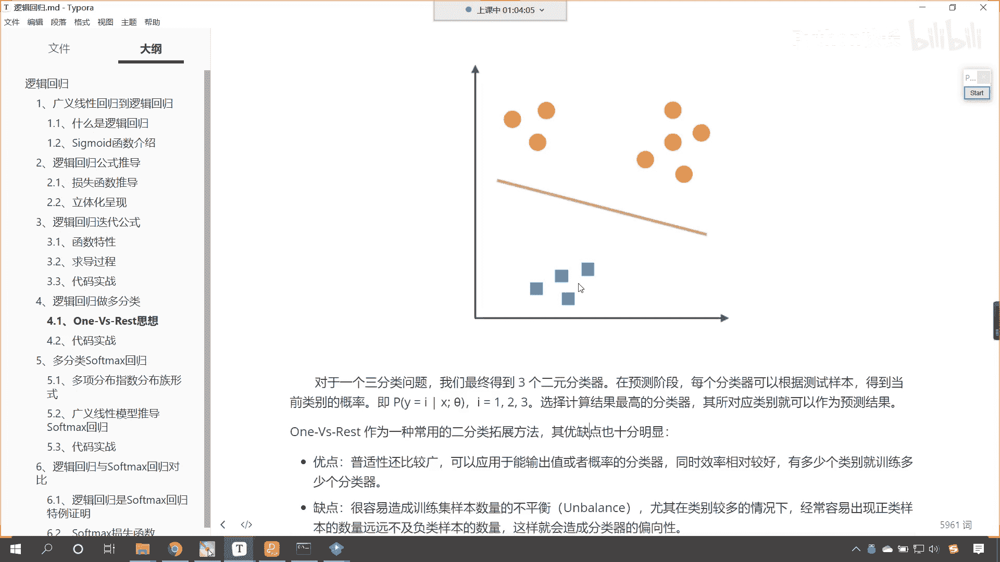

每一个方程是不是都有系数和截距呀。

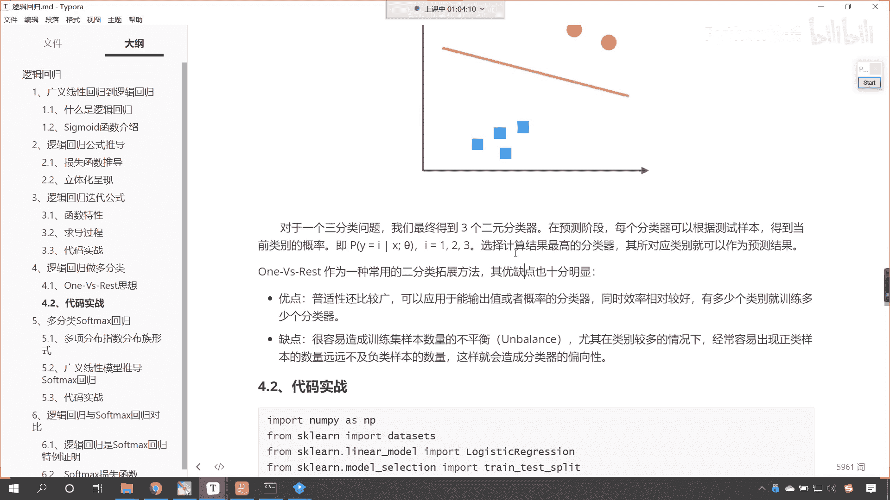

对不对，所以回到代码当中。

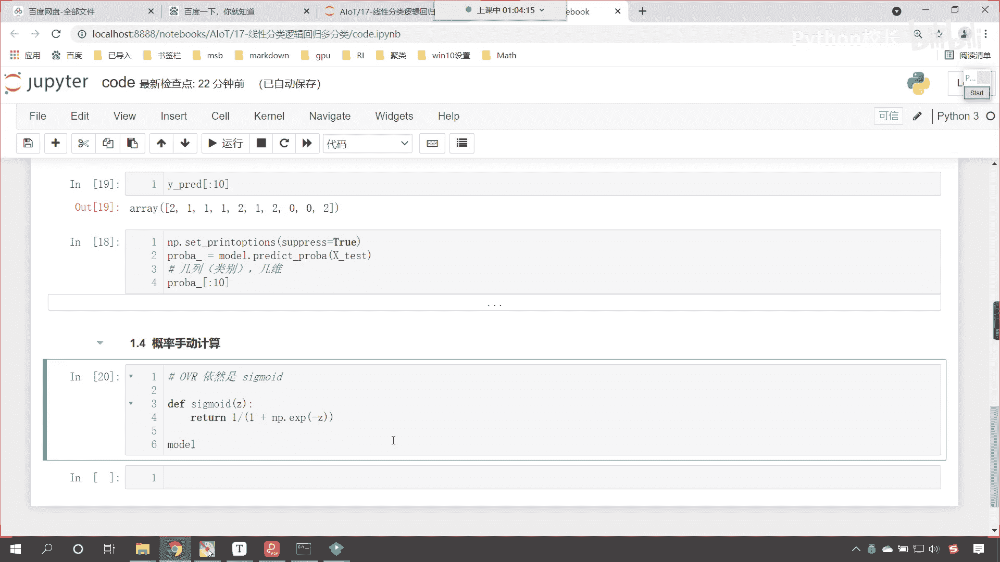

我给你看一下，那就是model。intercept，这个是不是就是咱们的截距呀，看到了吧，这个呢就是截距，你看我一执行，我们有几个结局，一个两个三个对应上了吧，三个结局没问题吧，截距呢咱们接收一下。

我们就叫做b盖，看啊，哎就叫做b盖，这个b呢就是咱们bias这个英语单词的缩写啊，啊这个英语单词翻译成中文就有偏差的意思，那偏差呢就相当于截距好，看到这个截距是三个了。

那咱们model当中是不是还有扣这个扣if是什么，call if是不是就是咱们的方程的系数呀，看这个就是方程的系数，那么请问咱们得到的形状是什么等等，在咱们输出之前。

咱们要先为各位显示一下咱们数据的形状啊，看咱们数据的形状，我们数据的形状是150和四，那这150表示什么，150表示150个样本，那这四表示什么，这四是不是表示啥。

看这四是不是表示每个样本它的特征和属性呀，我们就是从这150个样本当中，根据它的四个属性，咱们是不是进行了建模，进行了方程的计算，对不对，那这四个属性是什么呢，分别是咱们花萼的长和宽嗯。

以及呢还有咱们花瓣它的长和宽，咱们说既然是植物，它的类别不同区别在哪里啊，就在它的外在特征，是不是啊，那你想一下我们model。coif，如果我们要执行输出的话，它的形状会是什么样的。

你在大脑当中想一下，你看我执行跟你想的一样不一样啊，来各位小伙伴，你能够看到咱们得到的这个形状，得到的这个数据的形状，你能够看到它是几行几列呀，它是不是三行，它是不是四列呀，对不对，你看它是三行四列。

那这三行表示什么，这四列又表示什么，嗯把这个搞明白了，机器学习哎你就明白他是怎么回事了，很多时候我们在学习的时候呢，其实就是数据的形状是吧，哎我们有小伙伴在群里边儿回复了，是不是啊，非常正确啊。

这个三行呢就代表咱们刚才讲原理。

看到的这三条线看到了吗，你一条线代表一个方程。

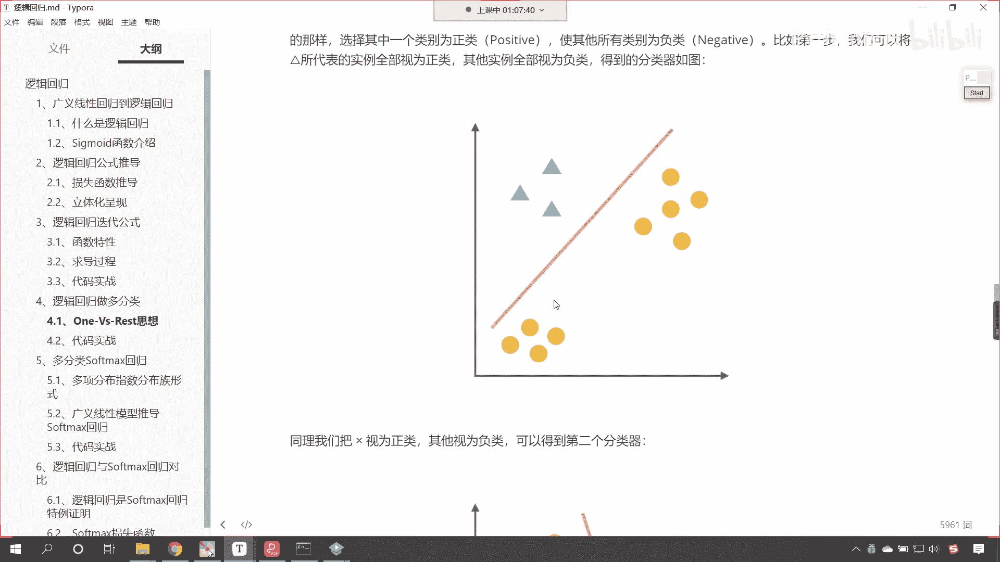

是不是啊，所以说这三行呢就表示咱们的三个分类器，那三个分类器说得非常高大上是吧，其实呢就是咱们的线性其实就是咱们的方程，那我们的大家看咱们的四列，这个系列表示什么呀。

四列呢它表示每个方程是不是有四个系数呀，但为啥每个方程有四个系数呀。

再往上看咱们的数据系数的多少由谁来决定，是不是由咱们的系数来决定呀，是不是由咱们的属性来决定呀，那么我上面的数据当中，咱是不是有四个属性，所以它就对应四个系数，现在你明白这是怎么回事了吧。

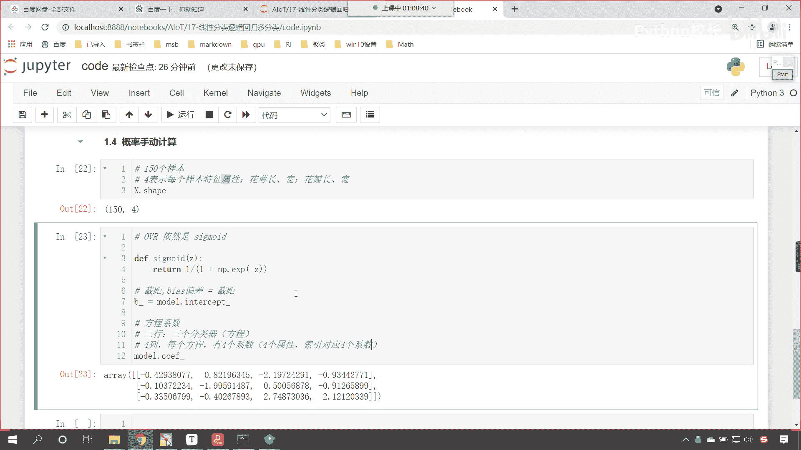

我们也接收一下，咱们这个起个名叫w盖，看啊起个名叫w盖好，那么咱们就嗯d play一下，咱们将w杠放进去，将b杠放进去，一直行好，那么咱们的数据就咱们的系数，方程的系数就准备好了，有了方程的系数。

那咱们接下来呢我们就开始进行相应的操作，我们上面咱们计算概率的时候，你看我计算的是谁的概率呀，上面咱们进行概率预测，咱们是不是预测的测试数据的概率呀，看这个是测试数据的概率求解出来了，0。

0004959，怎么算出来的这个值啊。

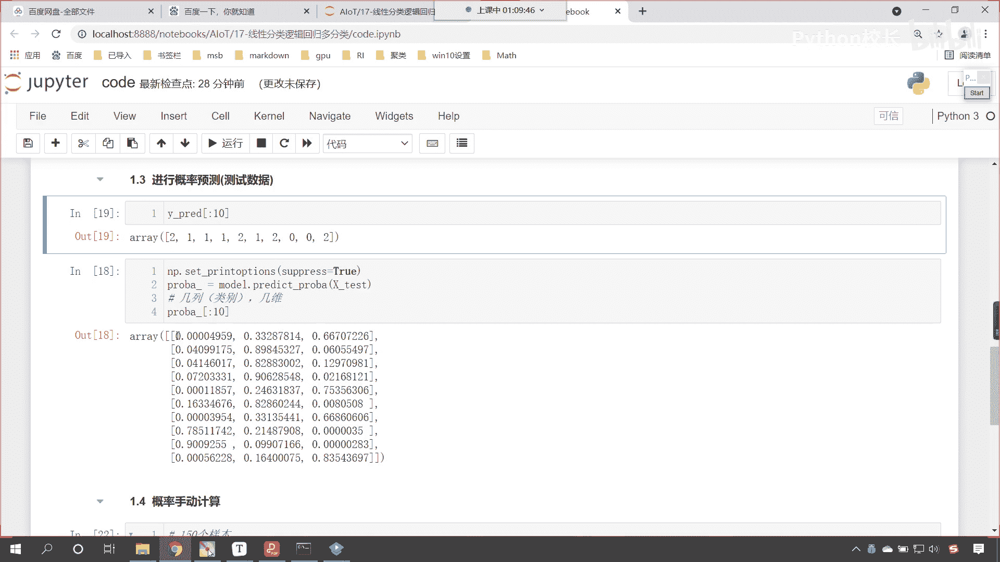

来我们下面呢就算一下哈，那既然是有方程了，我们又有x下划线test这个数据。

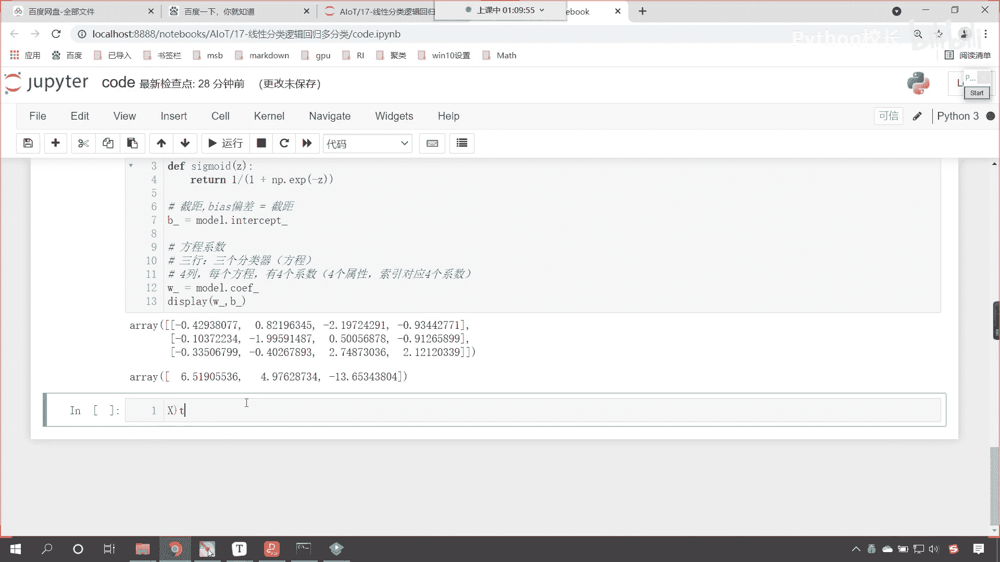

那咱们是不是就可以使用方程来进行相应的，这个计算呀，对不对，那咱们现在呢就进行相应的计算啊，我们是不是就让咱们的方程和咱们的系数。

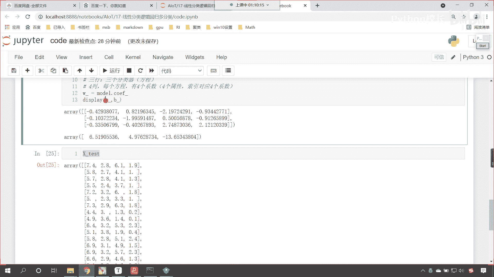

进行一个乘法呀，这个时候咱们看一下它的形状是多少啊，看啊它的形状是不是30和四呀，w杠的形状是多少，看一下它的sh少一个点儿，咱们来一个点，这个时候你看我们就能够看到它是不是三和四。

那这个时候能直接进行矩阵乘法吗，看x。test，咱们点dot。

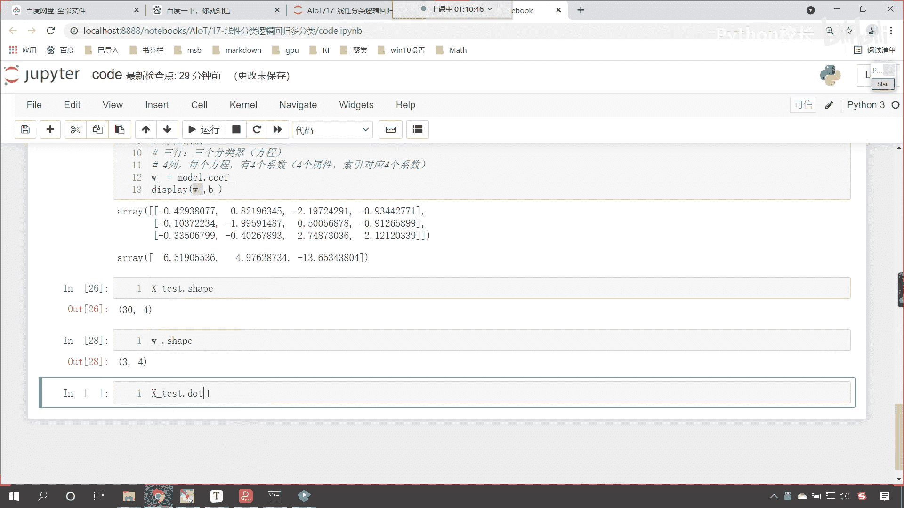

看我们将系数w杠放进去，你看一执行，这个时候是不是就报错了呀，为啥，咱们在进行矩阵运算的时候，它呢是行乘一列，看是行乘一列，你x test当中这一行有几个数据，是不是这一行当中有四个数据。

看看咱们display一下x下划线test中括号冒号，咱们就查看它的前十个w杠呢查看所有，看有了这个之后，我如果要进行矩阵运算，你想是不是这一行乘以这一列，这一行当中几个数，它是不是有四个数。

而咱们这一列当中有几个，看它是不是有四个，这一列当中是不是只有三个，你三和四是不是数量不对应呀，驴唇不对马嘴是吧，这个时候呢哎你就尿不到一壶里边，所以说就报错了，那怎么办呢，咱们呢对它进行一个转置啊。

看怎么转置呢，就是点t就是行变成列。

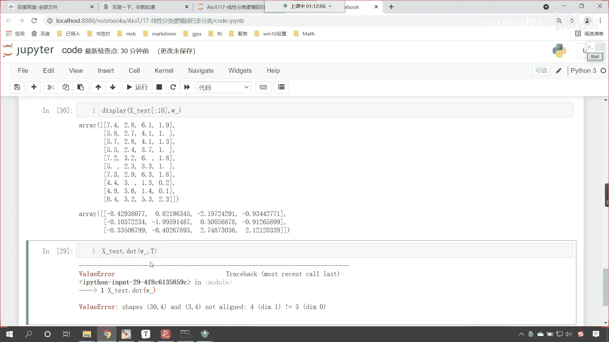

这个时候你看我一执行，诶大家看此时是不是就搞定了呀。

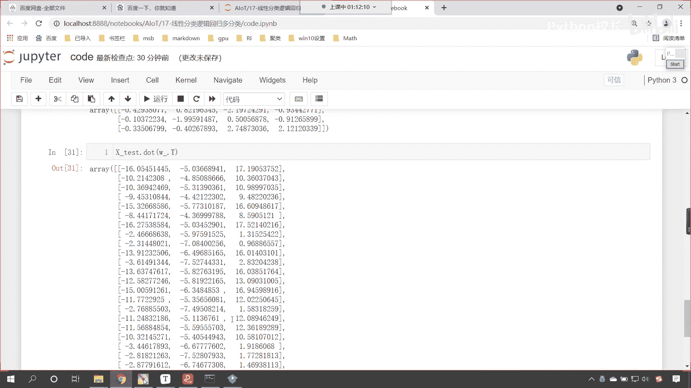

看到了吧，我们的行变成列，现在你看是不是就搞定了，行变成列之后呢，看那你第一个方程求解出来的结果是这个，第二个求解出来是这个，第三个求解出来是这个是不是好，那么转置之后呢，咱们再加上咱们的b盖。

那我们的b盖是不是就相当于截距呀，对不对，好，那么执行你看也没问题了吧，所以说咱们一步一步是吧，对它进行了操作，那这个是不是就是我们手动计算出来的，一个线性回归的预测值呀，那这个线性回归的预测值呢。

咱们起个名儿啊，咱们起个名，这个呢就是y predict杠呃，就叫做这个y predict嗯，杠self s e l f，这个就表示我们自己计算出来的啊，叫外盖self盖predict。

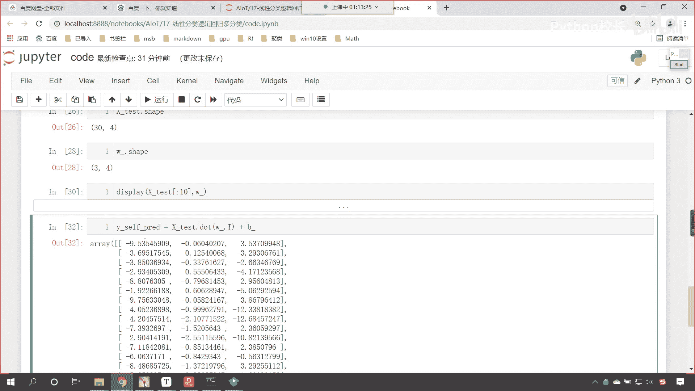

那有了这个预测值了，咱们需要把预测值对它进行转换，那是不是这个时候就用到sigmoid函数的转换了，来咱们此时呢就调用一下西格mod小括号，将咱们求解出来的这个值放进去，那大家看啊。

此时咱们就会得到一个概率p。

来执行一下这个代码，大家看结果出来了，我们算出来的概率，看咱们算出来的概率，0。0007224。

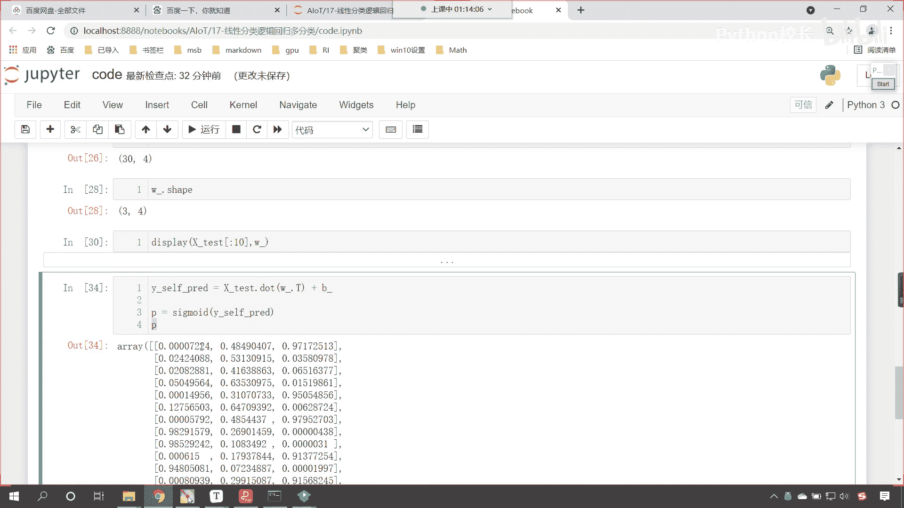

和上面算出来的概率，你看一样吗，0。0004959，咱们发现这个是不是不一样呀，看到了吧，这个不一样，这个如果要不一样的话，那为什么会不一样呢，看到了为什么不一样，你看这个是0。00072，这个是0。

48，这个是0。97，对不对，我们上面那个算出来的算出来的是多少，0。33，0。66，0。0004959。

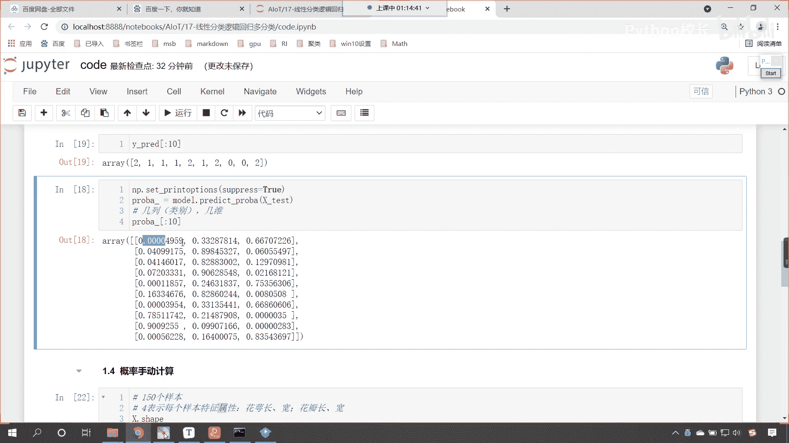

这是为什么呀，为啥不一样呢，看到这该怎么解决呀，咱们也算出来一个概率，但是呢不一样，我们现在呢往上走。

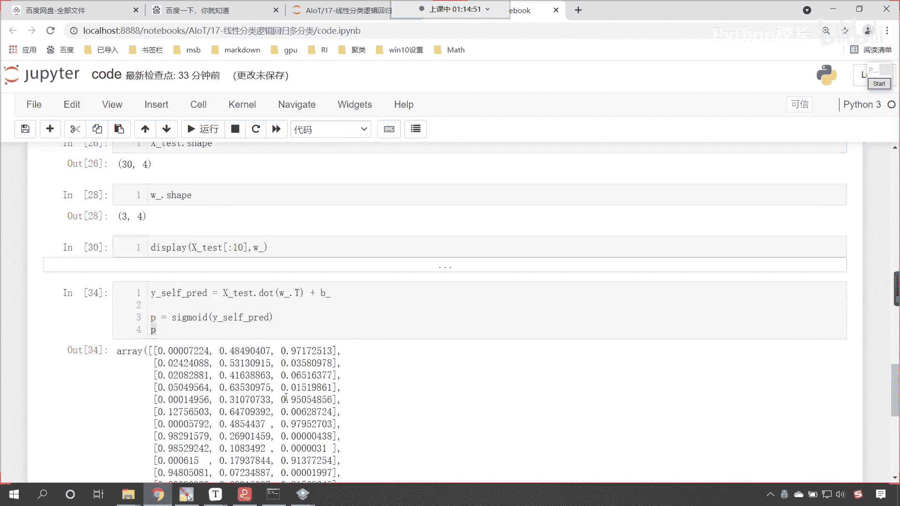

咱们就找见这个方法叫predict probe，我们看它里边有没有具体的说明。

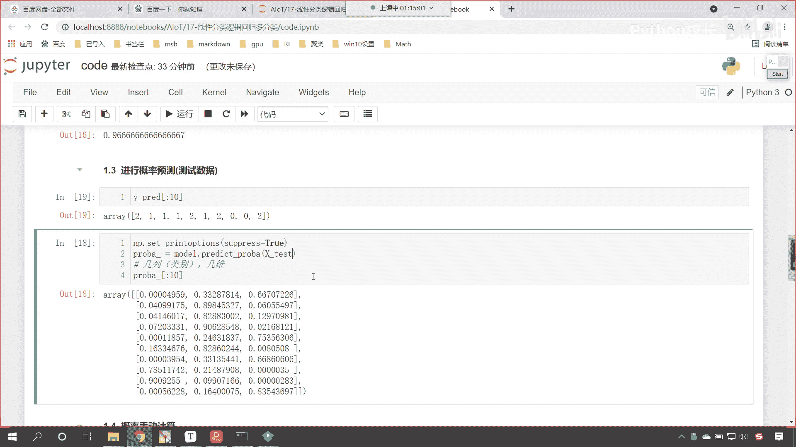

shift tab点开这个加号，咱们仔细看它的详细说明，诶，大家看啊看啊，如果我们要使用one s one vs rest，咱们要使用这种模式去实现的话。

咱们看一下这个probability是怎么calculate，怎么计算的啊，看这个it will be positively using the logistic faction。

是不是使用了咱们逻辑斯蒂这个方法呀，logistic function它表示的就是咱们sigmoid的函数，我们已经用了add，你看有一个add叫normalize。

this value across all the classes进行了一个什么，进行了一个归一化，因为我们现在使用了，咱们现在使用了这个logistic，我们还没有进行看。

咱们还没有进行normalize，所以说就有点不一样，知道吗，在这儿呢咱们也进行一个说明啊，logist tik它其实就表示sigmoid啊，这个就表示sigmoid的函数好换一个颜色啊。

红色的里边呢它就表示西格mod，那么我们绿色框当中这个表示的是什么呢，表示的是归一化，那么规划呢咱们呢这个规划之后，他们的概率和概率和是一，规划之后这个概率和是一，我们一起来看一下。

你看啊这三个数加起来，你口算一下和是不是等于一呀，看看这三个数是不是一来我们求一下和，咱们就调用sum，让它等于一，这个时候你看我一执行得到的结果全是幺，111，是不是就说明他们最后一围它的和是多少。

看啊，就你这个三个数加起来等于一，这三个数加起来也等于一，这就是它进行的归一化。

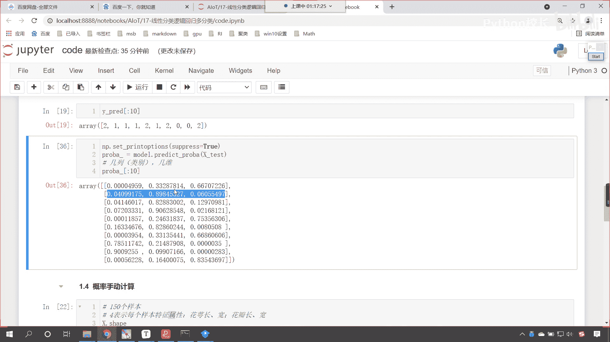

而我们下面咱们得到的这个概率，你看他们加和是一吗，是不是明显不是呀，那么我们现在呢就对它进行一个归一化好不好，那p呢就等于啊p除以p。sum，让它等于一，这一步操作呢我们就进行了归一化，那这种归一化呢。

咱们的和哎它就是一，为啥要把它变成这种形式呢，因为这个是概率嘛，对不对，你想一下这个是概率，那一共分三类，你这三类我在猜的时候，咱们的概率和是不是得等于一呀，所以经过这个转换，咱们再执行一下。

看咱们经过这个转换之后，嗯现在呢我们来看一下咱们这个操作啊，嗯他说couldn't是吧，那来我们看一下咱们这个操作啊，那我们经过计算之后呢，大家看这个啊，不行了，是不是因为这个形状不匹配。

无法进行广播机制，嗯咱们对对，这儿呢给它改变一个形状啊，在这点那就是reshape-1和一，这个时候你看我再来执行，得到的结果和原来是不是就一模一样了，那我们为了对比，咱们在这儿呢print输出一下啊。

来一个单引号，这个呢就是我们手动计算的概率太多了，咱们查看它的前十个，查看它的前五个吧，然后再来一个print打印输出一下，咱们算法计算的概率，冒号算法计算的概率上面。

咱们是不是用probe杠接收了一下呀，冒号也查看它的前五个。

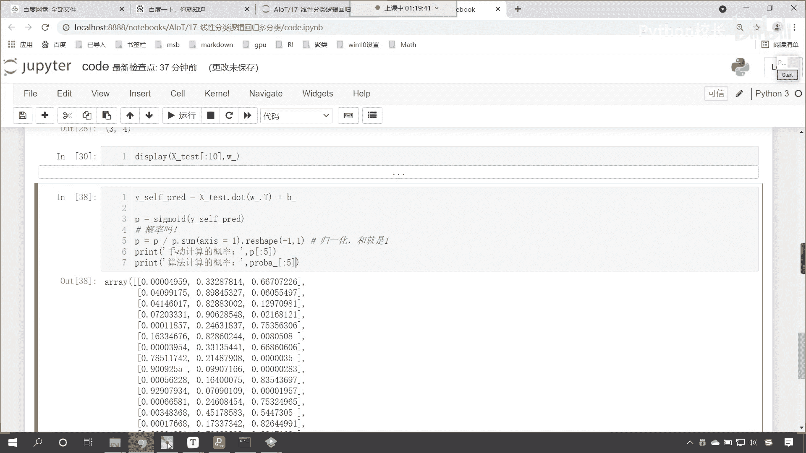

你看我一直行，咱们大家看啊，这个print输出的时候没有换行，咱们在这儿来一个反斜杠n，这样的话他就换行了，这儿呢也来一个反斜杠n，这个时候你看我一执行来，你比较一下一样不一样。

小数点后的小数点保留后八位，看到了吧，是不是一模一样，看到了吧，一模一样，0。66707226，0。6670726，是不是完全一样，如果要完全一样，是不是啊，如果有完全一样。

你是不是就表示是不是就知道了，咱们逻辑回归使用vv，使用o vr，它是如何进行计算，如何进行概率的划分了吧，是不是看咱们输出之后呢，他就因为输出之后这个概率和呢它就是一了。

呃咱们这种搞法和咱们的soft max它呢，是有区别的啊，有区别啊，我们刚才有小伙伴在讨论区里边儿，问了一个问题是吧，说这么操作的话，和咱们soft max它呢是有区别的，我们先把这个讲完。

一会儿呢我们就介绍soft max它是怎么操作的，好不好来。

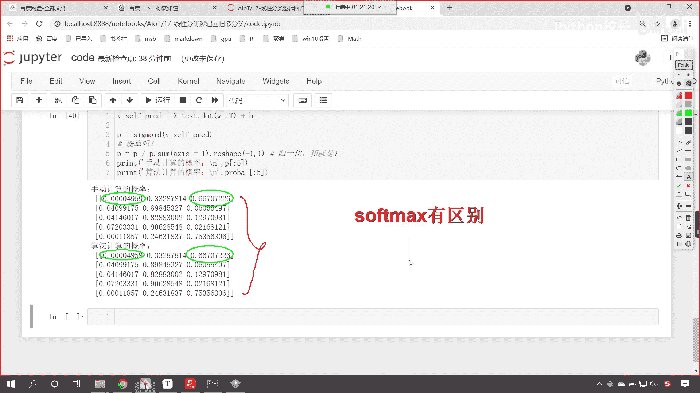