# P114：1-支持向量机SVM概念 - 程序大本营 - BV1KL411z7WA

我们就开始我们的课程。

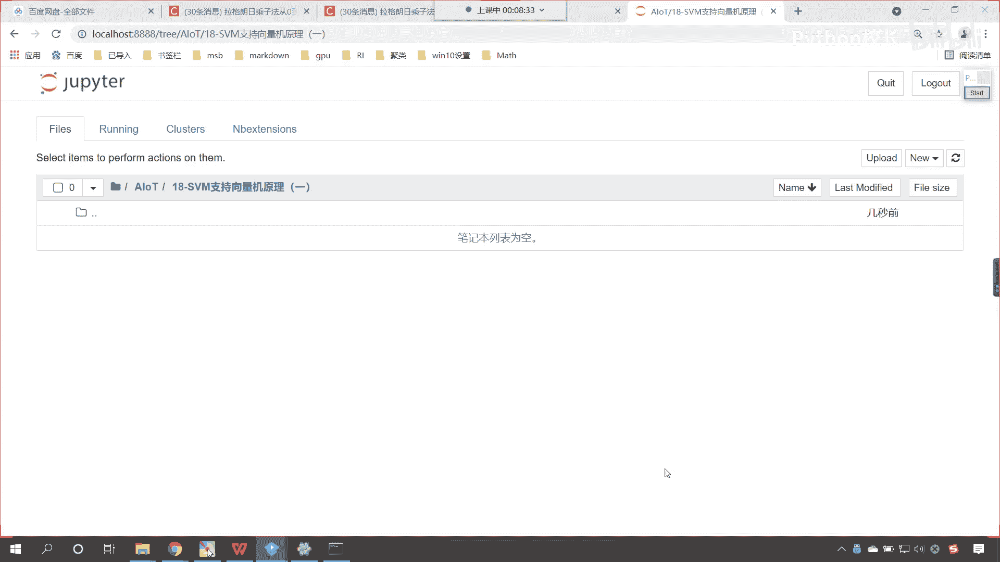

上两节课呢我们看了一下逻辑回归，那这个逻辑斯蒂回归呢，它其实也是在线性回归当中的，对不对，那既然是线性回归当中的，它，其实呢嗯拟合出来的也是这个线性的一个方程，只不过呢我们根据这个线性方程。

咱们根据sigmoid的函数，或者说呢我们根据soft max函数，咱们将线性方程转换成了概率，转换成了概率，这个时候就不得了了，概率呢其实就是比大小，那比大小的话我们就可以进行分类了。

所以说你看这就是一个非常巧妙的转变是吧，那我们变成了概率，咱们就有这个线性回归，咱们就变道了分类问题，你想一下咱们所生活在这个世界上，我们所有的问题，是不是都可以把它变成，最基础的回归问题和分类问题啊。

那回归问题就是它的函数方程是怎样的，它是怎样的一个走势，是怎样的一个趋势，是不是，那我们的那咱们的分类问题呢，唉就是把它分成男和女，对不对，比如说我们把它这个植物分成不同的类别。

咱把这个动物也分成不同的类别，这个就是分类问题好，那么分类问题呢，咱们往往就是根据概率来进行划分，今天呢咱们继续向前进一步，咱们看一下这个支持向量机。

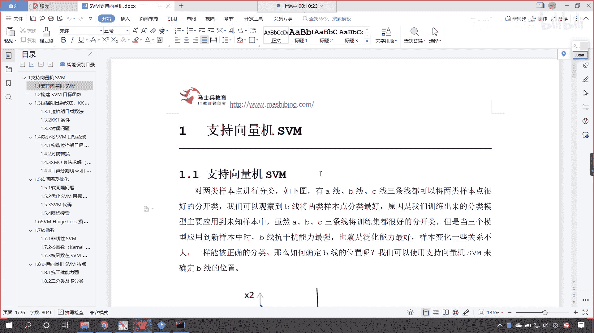

在咱们看之前呢，来我们呢先给大家看一下咱们百度网盘当中的。

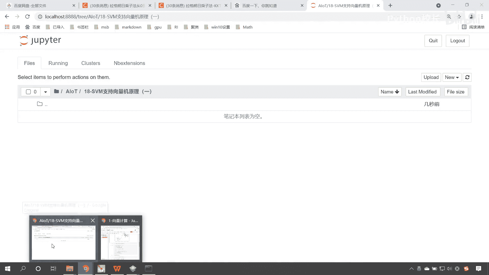

我们的作业好，大家看啊，咱们17个线性分类，逻辑4d回归多分类，我们的答案呢已经为各位小伙伴，已经为各位小伙伴准备好，并且呢进行了相应的上传，那你就参考我的视频，以及咱们上课所学的知识点。

你就可以把咱们这个作业来完成好，那么。

嗯逻辑斯蒂回归呢，哎咱们就告一段落，那接下来我们看一下这什么是支持向量机对吧，那啥是支持向量机呢，它的缩写就叫做svm，那这肯定是三个英语单词的缩写，对不对啊。

这叫做support vector machine，翻译成中文就叫做支持向量机，那这个s呢就是support啊，它呢s u p p o r t叫support v呢是vector m呢是machine。

那大家看这个support它指的是什么意思啊。

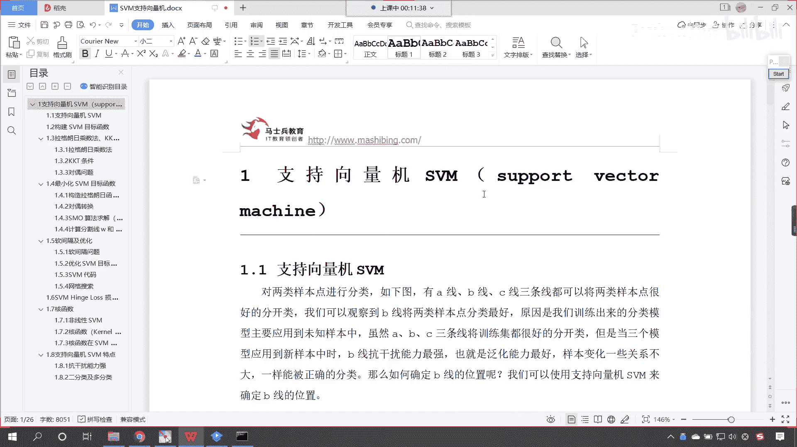

哎咱们回车一下啊，你看这个support指的是什么意思呀，它呢指的是支持的意思，这个vector指的是什么意思啊，向量这个machine指的是什么意思啊，机器如果我们要把这三个英语单词进行翻译。

那么它就是支持向量机，那首先咱们说一下什么是machine，这什么是机器呀，这里讲的机器呢就是咱们的分类器，咱们在机器学习当中，咱们需要把任务是吧，我们需要完成一个分类任务。

或者说咱们需要完成一个回归任务，那么我们把训练出来的这个模型，咱们把它叫做机器，你知道机器可以干嘛吗，咱们人制造出来各种各样复杂的机器，是不是就是帮助我们人类完成任务呀，在机器学习当中。

咱们造出来的这个机器是什么呢，哎咱们造出来这个机器就是对应的算法，那vector就是向量，那什么是向量呢，这个呢是咱们线性代数当中的一个概念啊，那这个support就是支持的意思。

待会儿下面有具体的这个图形，那我们再看具体图形的时候，那我告诉你什么是这个支持向量，这个支持向量，你可以把它当成特定的一个数据来。

那我们一起来看一下咱们支持向量机它的概念。

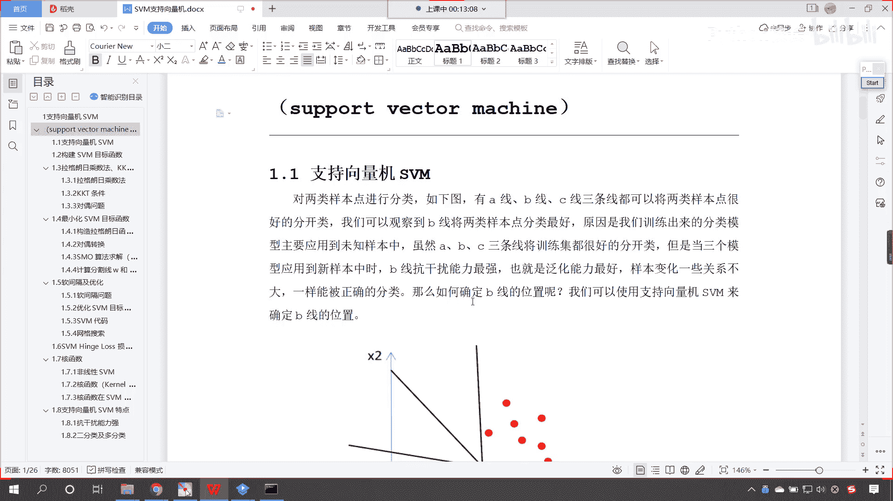

大家现在呢能看到下面这个图形，那这个图形呢有两类点，一个是红色的，一个是蓝色的，现在呢我想要把这两类点对它进行一个划分，那嗯我们如果想要把红色的点和蓝色的点，进行划分，你想一下是不是会有多种方案呀。

你就能够看到咱们的a线，b线和c线，是不是都可以将这两类点进行分开呀，没问题吧，对不对好，那么咱们现在的问题是哪一条线，它划分的最合适，划分的最完美呢，哎那我们呃讨论区里边儿有小伙伴已经回复了。

那你看根据我们的经验，咱们也知道咱们的b线b这条线，它划分的是不是最好呀，因为他划分的最开，虽然咱们的a线和c线也能划分开，但是我们能够看到这两处，红色的点和咱们蓝色的点，它们的规律呢。

你看他们最大的间隔是不是就是咱们b这条线，因为那红色的这些点，距离b这条线的距离是不是比较远，蓝色的点距离b这条线距离是不是也比较远，那我们今天要学习的支持向量机呢，唉他要做的事情就是以最优的方式。

将咱们红色的点和蓝色的点来把它进行拆分，所以这里边呢就有一个分割的原则呢，咱们是间隔最大化，那为什么间隔最大化他最优秀呢，因为呢我们对于这两类点进行了划分，咱们不仅仅希望把这两类点给它拆分开。

咱们还期望着如果有其他的一些点，比如说啊咱们给你举一个例子，比如说看比如说在这个地方啊，比如说在这个地方有一个点，那我们给他换一个颜色啊，比如说咱们给它换成黑色的，你看啊在这个地方是吧，出现了一个点。

请问这个黑色的点它属于是哪个类别呢，你看这个黑色的点儿它属于哪个类别呀，你看按照咱们的规律来讲，按照咱们最优的这条线b来划分的话，你想b它是不是在这条线的上方呀，那么那么咱们黑色的这个点。

是不是应该被划归到咱们红色的区域呀，对不对，但是如果说我要选择c这条线啊，但是如果说你要选择c这条线，作为咱们分类的这个学习器，那么你看黑色的这个点，是不是在c这条线的下面，它既然在c这条线的下面。

那么黑色的这个点，是不是应该被划归到咱们蓝色的区域呀，那很显然，这个和咱们数据的规律是不是不相符呀，所以说c这条线它呢就嗯不是最好的，那这样也就印证了b这条线，你看它不仅仅可以把当前的这些点很好地划分。

咱们b这条线是不是还可以将未知的点进行，很好的划分呀，未知的点就是咱们给的这个黑色的点啊，因为我们的机器学习，咱们不仅仅是要预测咱们当前的数据，我们机器学习更重要的作用，咱们呢是希望预测未来的数据。

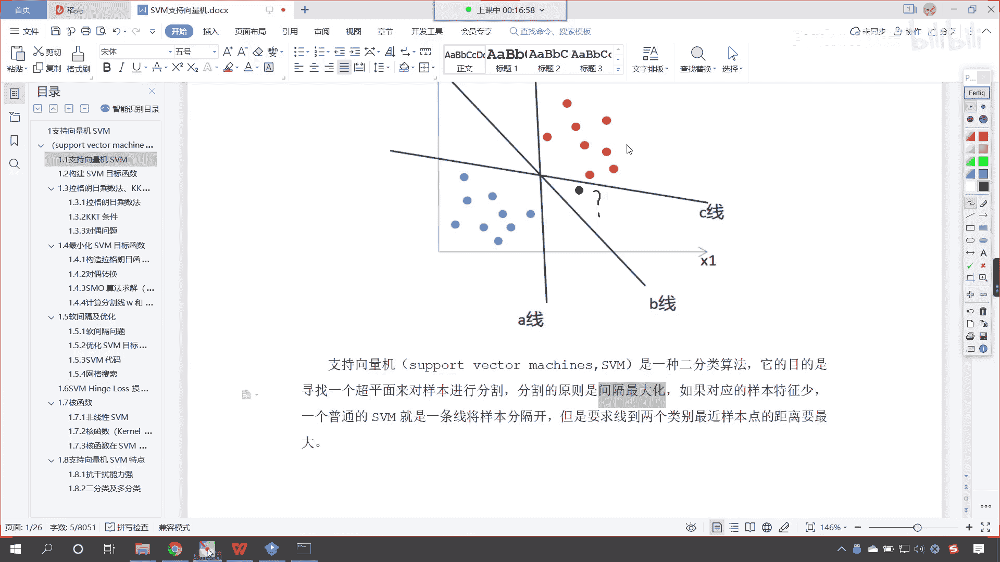

所以说呢咱们分割的原则呢，就是让它间隔最大化，那支持向量机呢它的作用，支持向量机呢，它就是要去找咱们最大的这个间隔，如果咱们对应的样本特征少一个，普通的svm就是一条线将咱们的样本进行隔开。

但是要求咱们的线到两个类别，最近样本点的距离，我们需要让它最大，也就是说你看b这条线是不是距离，咱们红色的点和蓝色的点，你看他们的距离是不是同时都是最大的呀，好那么我们继续往下看啊，大家现在就能够看到。

你看刚才呢我们是abc 3条线，现在的话我们就筛选了其中最嗯，这个划分最合适的b这条线，那我们就能够看到b这条线，你看b这条线呢，就是我们根据支持向量找到的分隔线，刚才我们介绍了这个支持向量是什么。

那在这里呢咱们有了具体的案例，那我给各位介绍一下这什么是支持向量，那在咱们这些点当中，大家看红色的点当中有p一和p2 ，蓝色点当中是吧，我们选择了一个p3 ，那我们之所以能够找到中间这条。

中间这条分割线，咱们呢其实就是根据这个p一点，p2 点，以及呢根据咱们的p3 点，咱们进行划分的，为什么呀，因为这个p一点和p2 点，属于是咱们红色区域的边界点儿。

你看我们其他的红色的点儿是不是都靠上呀，那只有这个p一和p2 点，它是不是离咱们中间这条分割线是不是最近呀，同样的道理，你看咱们蓝色的区域，蓝色区域咱们的p3 这个点它是不是距离嗯。

它是不是最外侧的这个点呀，它是不是距离咱们b这条线最近啊，对不对，那么我们就将p1 p2 p3 ，我们就将这样的点，咱们把它称为支持向量，你看为啥把它叫做支持向量，那正是因为这几个点是不是就确定了。

咱们中间这条，类别的划分线呀，对不对，你看它就确定了中间咱们b线，所以说呢，那现在呢咱们已经知道什么是知识向量了，也就是说咱们s v m这个算法在寻找，在寻找这个最佳，最佳的这个分裂分裂线的时候呢。

它会从这两处点当中寻找支持向量，有了支持向量了，咱们就可以根据支持向量来构建，中间这条黑色的线。

所以说呢嗯这个支持向量呢，这个支持向量机，svm算法就是寻找一个最优的决策边界，咱们上图当中的两条虚线来确定咱们的分类线，b，那什么是决策边界呢。

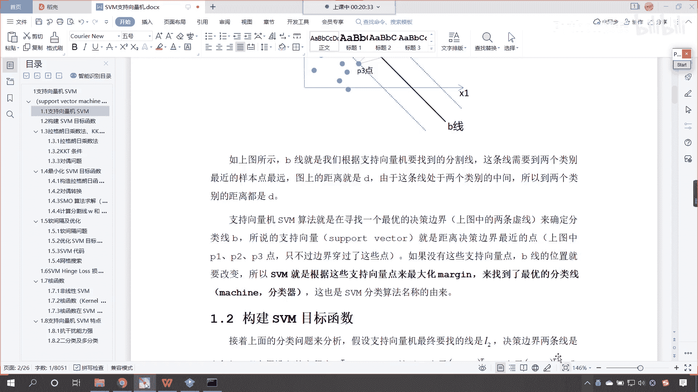

现在你就能够看到咱们这个地方呢有两条虚线，看到了吧，这个地方有两条虚线，这两条虚线就是咱们的分类边界，那么这个分类边界是如何确定的呀。

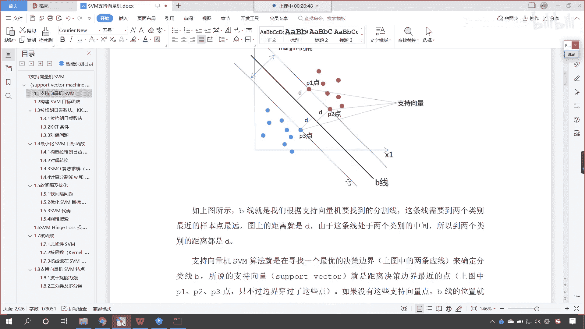

就是根据支持向量来确定的，所以啊咱们所说的支持向量呢，就是距离决策边界最近的点，那也就是上图当中的p1 p2 p3 ，只不过这个边界穿过了这些底，因为它是边界嘛，所以说他正好在咱们边界这条线上。

如果没有这些支持向量点，咱们b线的位置呢，哎它就要改变了，所以咱们支持向量机呢，就是根据这些支持向量来最大化咱们的margin，这什么是mugin呢。

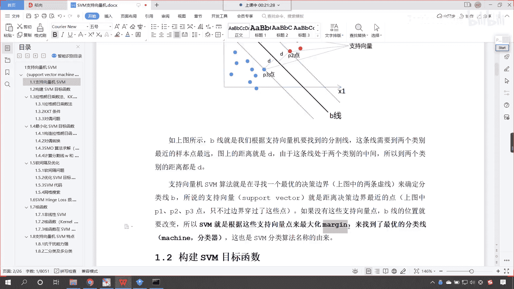

marin就是咱们的距离啊，mugin就是咱们的这个边界，那我们只有最大化了这个边界。

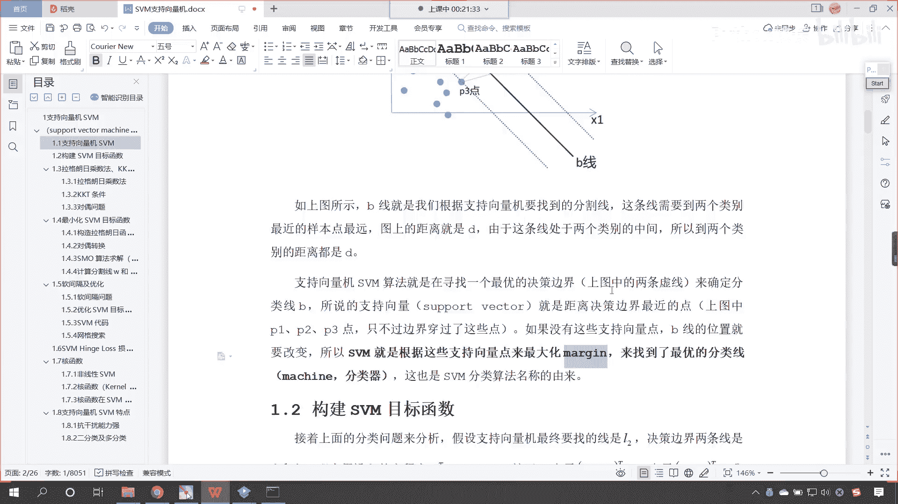

那咱们找到最优的分类线，我们把这个分类线就叫做machine，这个也就是咱们支持向量机这个算法的由来，上面你看我们是不是进行了介绍呀。

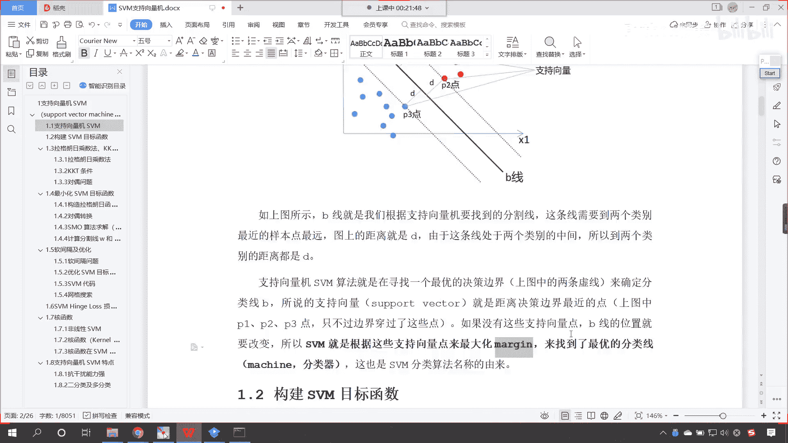

叫support vector machine是吧。

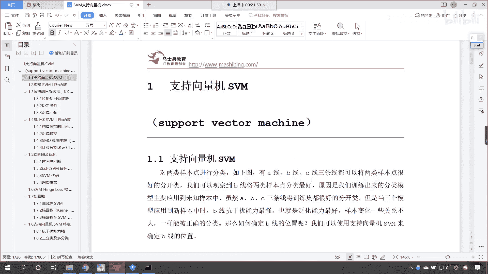

支持向量机，现在你知道它是怎么一回事儿了吧。

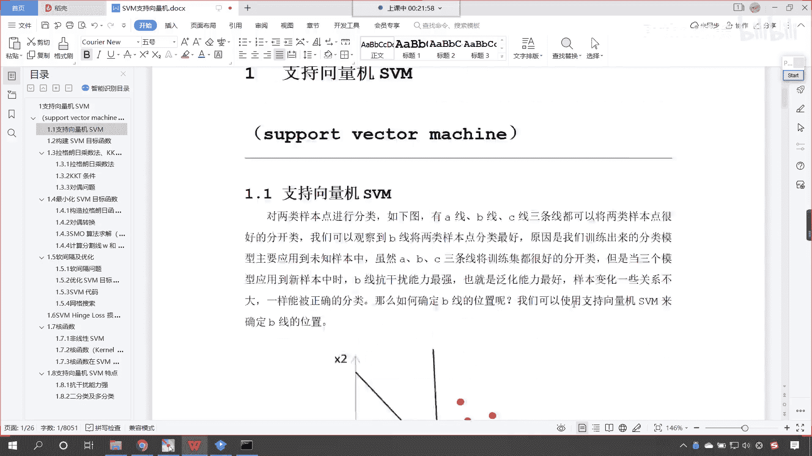

那通过咱们这个图形，那我们就发现嗯，咱们中间这条黑色的b线确实以最优的方式，是不是，将红色的点和咱们蓝色的点进行了一个分割呀。

所以说这个支持向量机呢，自从这个算法一出来，那这个算法呢，就在全世界范围内风靡了很长时间，直到是吧，这个前几年这个深度学习人工神经网络的兴起，那这个支持向量机它的风头呢，哎他才会这个稍微就稍微过去一点。

但是呢，支向量机它依然是非常优秀的一个算法哈，就是在解决很多问题的时候，我们使用支持向量机就可以得到很好的答案，那我们知道这个现在正在兴起，方性胃癌的是这个深度神经网络人工智能，对不对呀，那这些算法呢。

它其实是用于解决超级复杂的问题是吧，那对于我们一般的问题，咱们使用支持向量机。

这就足够了好。