# P124：5-KKT条件介绍 - 程序大本营 - BV1KL411z7WA

来各位小伙伴，咱们接下来呢我们继续往下看啊。

回到咱们的课件当中，刚才呢咱们介绍了不同核函数的使用，那接下来呢我们就沿着咱们支持向量机，沿着咱们上一节课的算法，咱们呢继续向下去推进，那我们已经知道这个拉格朗日乘子法了，对不对。

它可以对咱们的等式约束进行方程的转换，那把之前的等式约束转化成不等式约束啊，转转化成这个没有约束的这个优化问题，那我们所提供的这个博客呢，咱们也进行了详细的讲解，咱们这一节课呢。

咱们就不再进行这个拉格朗日乘子法，他的这个说明了，现在呢我们看一下，我们把这个问题难度给它加大，现在我们要面对的问题是不等式约束，很多时候呢它是不等式约束嗯。

比如说咱们不等式约束的这个公式，它就是这样的，现在你能够看到我们想要求fx的最小值，它有什么样的一个约束呢，s t是不是hx小于等于零呀，翻译成咱们的大白话，也就是说在hx小于等于零的前提下。

咱们找函数fx的最小值，对不对，那么针对于上市呢，它显然是一个不等式约束，因为这是小于等于它呢是不等号，咱们呢就不能使用拉格朗日乘子法，为啥呀，因为拉格朗日乘子法它针对的是等式约束啊。

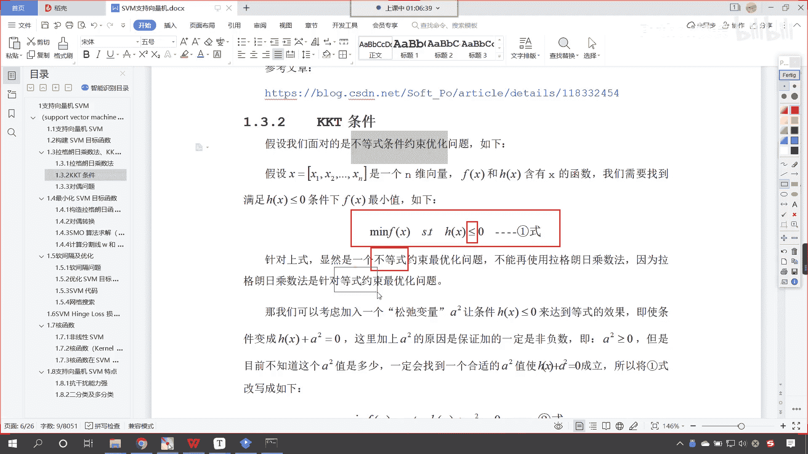

我往上划给你看一下啊，看啊拉格朗日乘子法标准的一个使用，应该是这样的，你现在就能够看到，你看到了吧，h x等于零，那对于等于零的情况是不是就简单多了呀，对不对呀，你看hx等于零，这个就简单多了。

那它简单，所以说我们就可以使用拉格朗日乘子法，把它转换，我们给它引入一个拉格朗日乘子，这个其实就是系数原来的这个方程，原来的这个表示呢就可以写成下边儿，写成下边，你就发现是不是就简单多了呀，对不对。

因为这个最小化看l x拉姆达，它呢是没有约束条件的，这就是一个方程，你根据梯度下降进行一步一步的更新，那么你那么你就可以找到咱们最优解，注意啊。

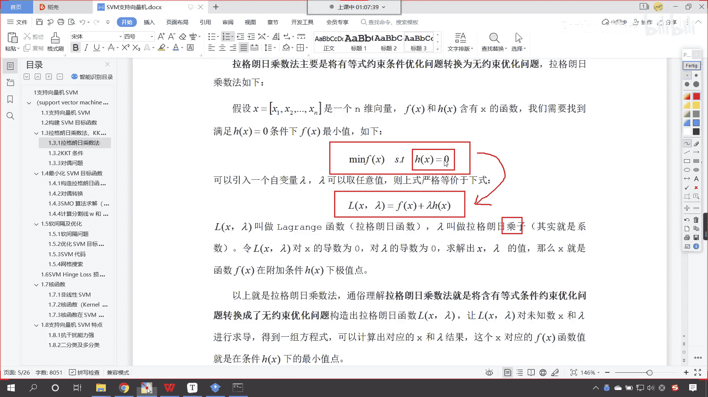

这是等号的，而我们的问题往往比较复杂是吧。

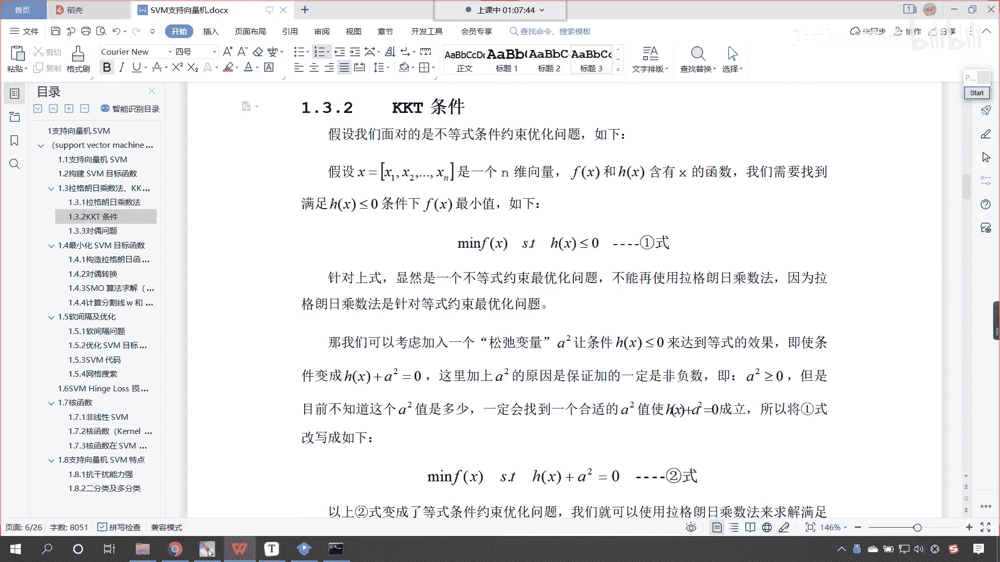

那我们是hx小于等于零，小于等于零。

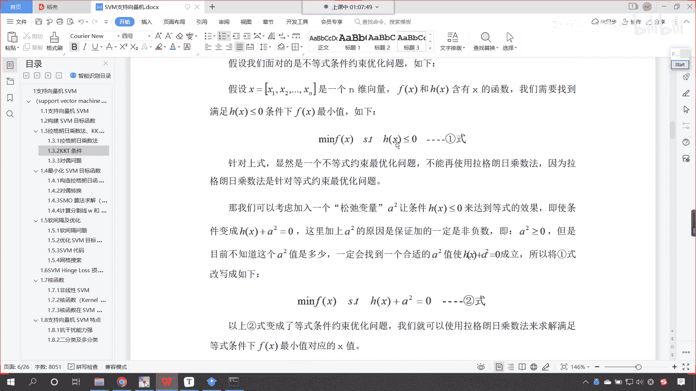

很显然和上面不一样，对不对呀，那该怎么办呢，兵来将挡，水来土掩是吧，咱们呢可以加入一个松弛变量阿尔法的平方，你这不是小于等于零吗，对不对，我让你加上一个数，你想hx只要小于等于零。

我是不是可以加上一个正的数，是不是把它变成零呀，可以不可以，没问题吧，最基本的加减法是吧，加上这个阿尔法的原因呢，就是保证它是非负数，咱们的阿尔法的平方呢，就是a的平方是大于等于零的是吧。

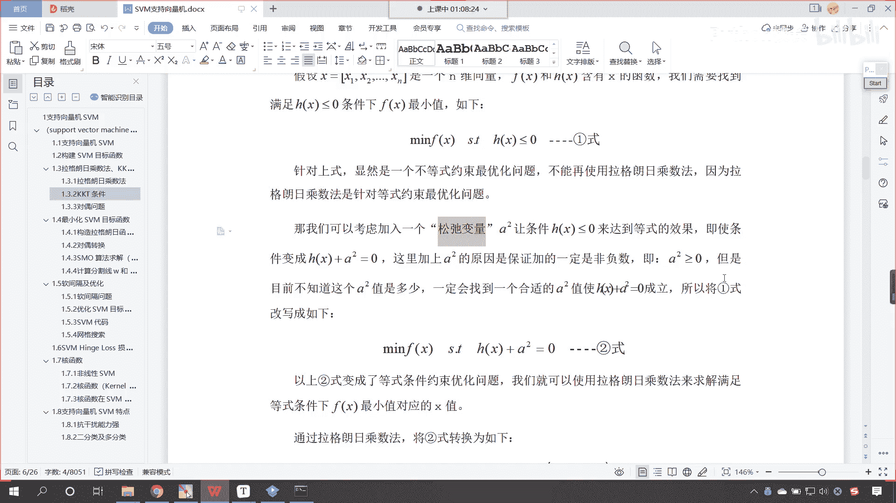

现在呢我们还不知道阿尔法的值是多少，但是没关系，我们是不是一定可以找到一个合适的呀，对不对，你看一定可以找到一个合适的阿尔法的平方，使咱们这个方程成立，对不对，一定存在嗯，没错吧，好那么就像你一样。

你学好了咱们的课程，掌握了相应的知识技术，你一定可以找一个高薪的工作，对不对，你要相信自己，是不是啊，所以说我们数学当中呢，这是基本的一个推理，那你看我们把这个方程给它转化成这样了。

现在你就能够看到这里边是不是有一个等号了。

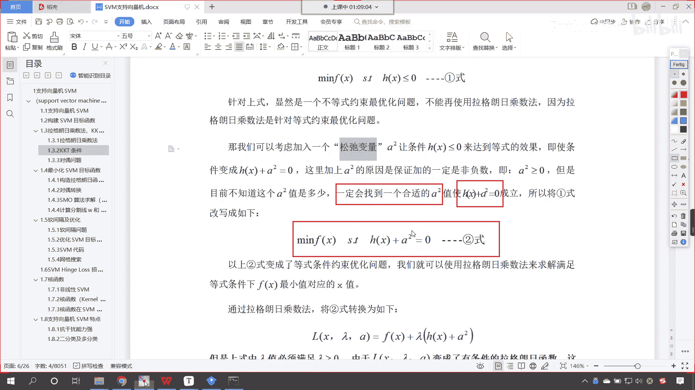

咱们是不是就可以使用拉格朗日乘子法，对它进行转化呀。

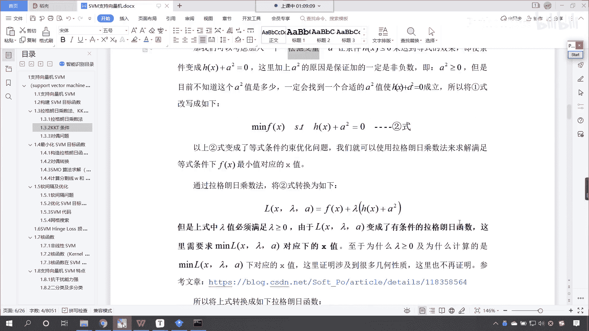

看到了吗，那我们进行转化哎，大家看我们就到这一步了，是不是啊，我们把上面那个方程是不是写成了，拉姆达hx加上阿尔法的平方好。

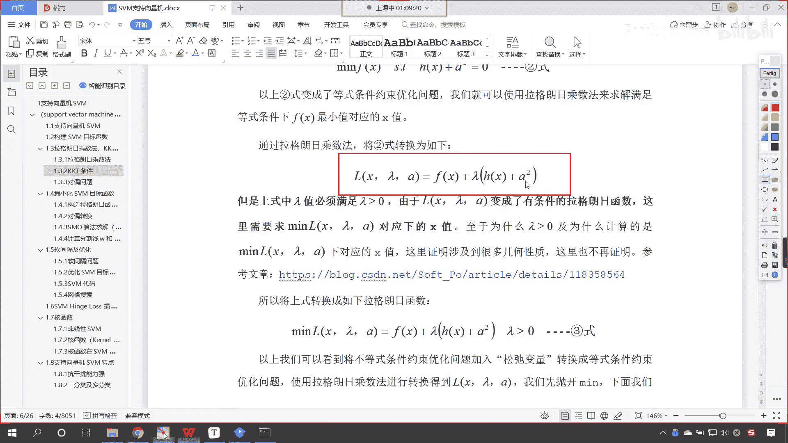

那么从上一步到这一步能看懂的小伙伴，我们呢在咱们的讨论区里边儿，咱们就扣一个996好不好，嗯看从这一步是吧，到这一步能够看明白的是吧，我们就扣一波六六，扣一波996啊，好。

因为这个其实就是拉格朗日乘子法，它的一个使用好。

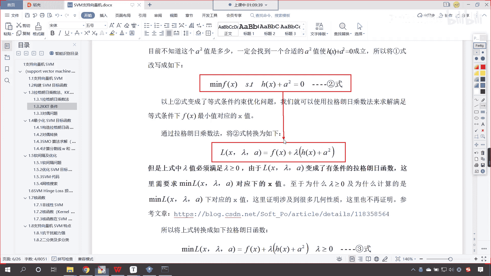

那么接下来呢咱们继续往下看，那么咱们上市当中的拉姆达，它必须得满足拉姆达大于等于零，那为什么它必须得是大于等于零呢，看到了吧，为什么他必须得大于等于零呢对吧，那么呃我呢又写了一个博客是吧。

咱们一起来看一下啊，这为什么这个拉姆达必须得大于等于零来。

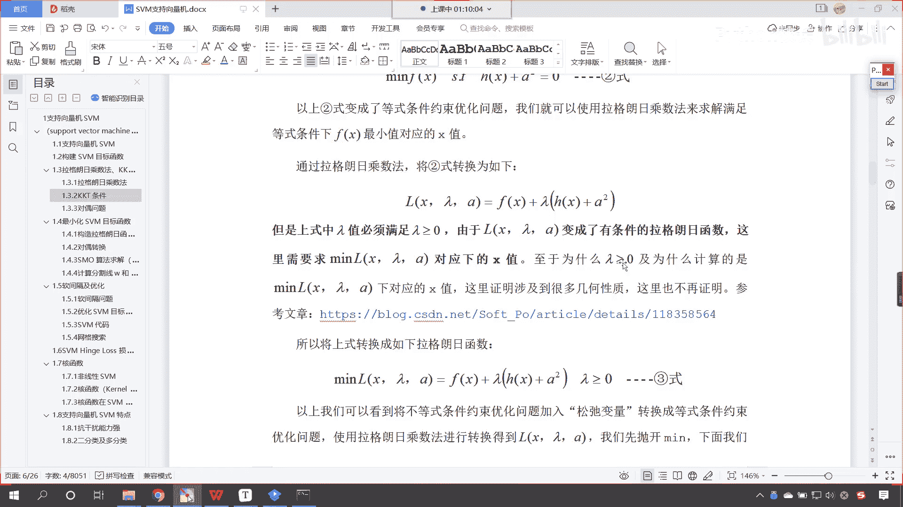

现在咱们就进入咱们的浏览器是吧。

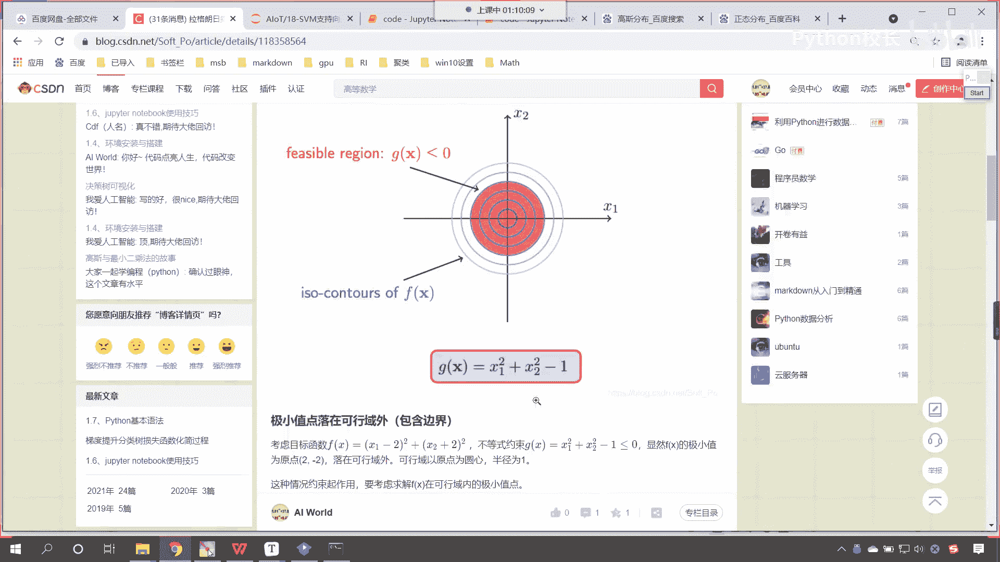

我们一起来看一下啊，我把这个网址给各位小伙伴发过去，大家也可以在自己的电脑上打开同步。

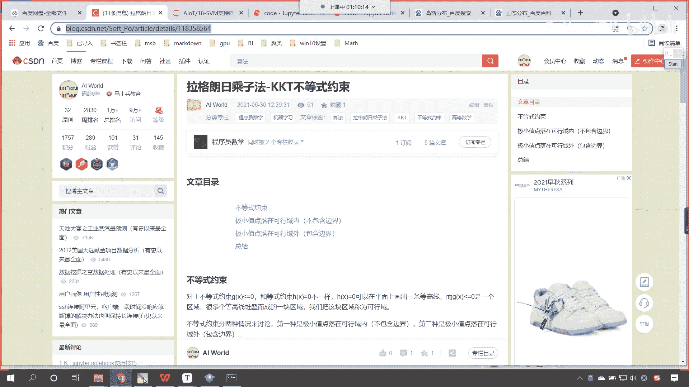

咱们看一下好。

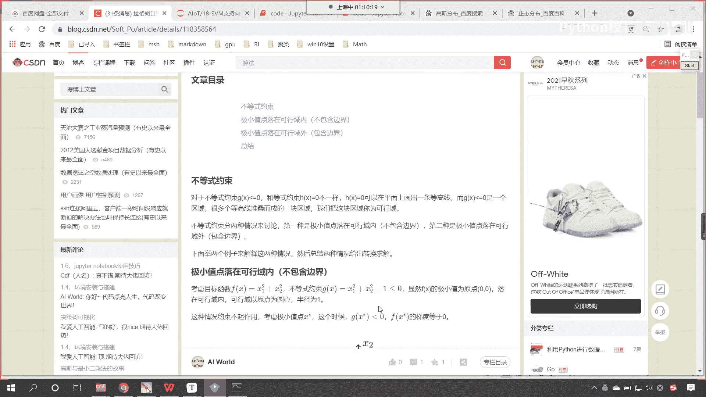

那么这个里边呢为了让大家能够理解，为了让大家能够理解咱们的这个kk t条件。

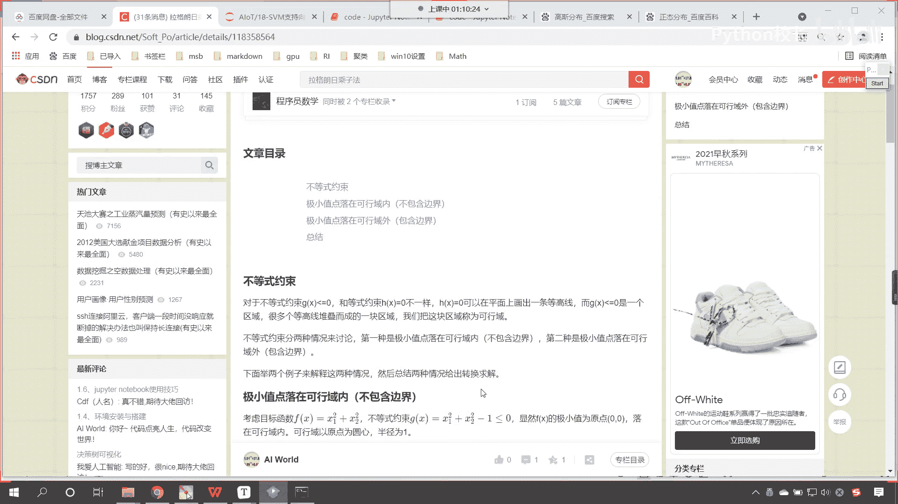

你看啊，我们现在讲的是什么。

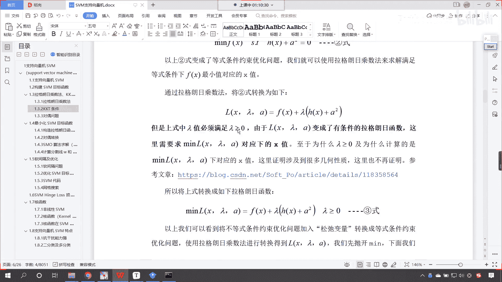

咱们现在讲的这个主题叫k k t条件，一看到这个k k t条件，我们就懵逼了是吧，不知道他在不知道他要讲什么，这啥是k k t呀，这kk t呢是三个外国人名字的缩写，他们发现了这样的一个数学公式。

所以说我们就把它叫做了kk t条件，这个呢就是为了解决咱们不等式约束，而提出的一个条件。

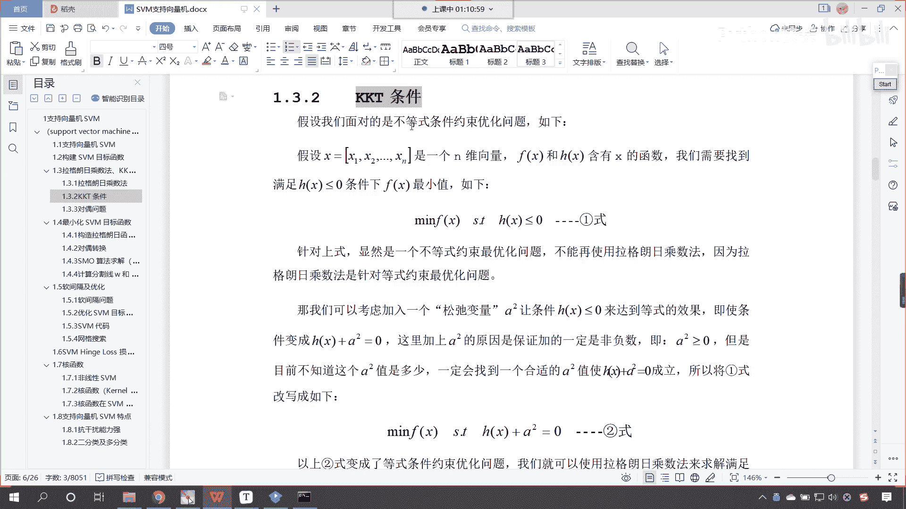

那我们一起来看一下这个到底是何方神圣是吧。

它到底是怎样的一个转换，那首先呢我们介绍一下不等式约束，哈哈这个对于咱们gx小于等于零，看这个和等式约束hx等于零，他俩呢是不一样的啊，刚为啥说不一样，因为如果要是等于零。

咱们是不是可以在平面上画出一条等高线呀，对不对，可以画出一条等高线，而gx小于等于零，是一个区域，这里你要注意咱们所说的这个gx，还有咱们上一节课所讲的h x等于零，这个都是我们的约束条件，哎注意啊。

咱们要统一这个咱们要统一一下，统一一下共识，这个呢就是约束条件，看到了吗，这个就是约束条件，约束条件，我写方程是不是想写成什么就可以写成什么呀，那么咱们的h x等于零，它呢是一个等高啊。

它是一个这个等高线，上一节课咱们在讲拉格朗日乘子法的时候，是不是画了很多等高线呀对吧，忘记的同学翻看一下咱们上一节课的内容啊，而gx小于等于零，你看到了吧，它是小于等于零，那么它呢就是一个区域嗯。

你可以这样认为这个小于等于零是吧，他是不是有多条线组成呀，你线越来越多，线越来越密，那么它是不是就是一个区域了是吧，很多个等高线堆叠而成的一个区域，我们把这样的区域在数学上有专有的一个名词，叫做可行域。

也就是说你想要找最优解，那么你就从这个范围内来找是吧，你想要找最小值，那么你的这个所找的这个数据就在这个范围，就在这个可行域内好，那么接下来呢咱们再来看啊，我们的不等式约束，咱们呢分两种情况。

咱们来讨论一下，这第一种情况呢就是极小值落在可行域内啊，这啥叫极小值落在可行域内呢，下面我们会具体介绍，第二种情况呢就是极小值点落在可行域外，就是包含边界，那你看一个是可行域内，另一个是可行域外是吧。

那这个可行域内，可行域外我不知道是怎样的一个情况是吧，是怎样的一个描述呢。

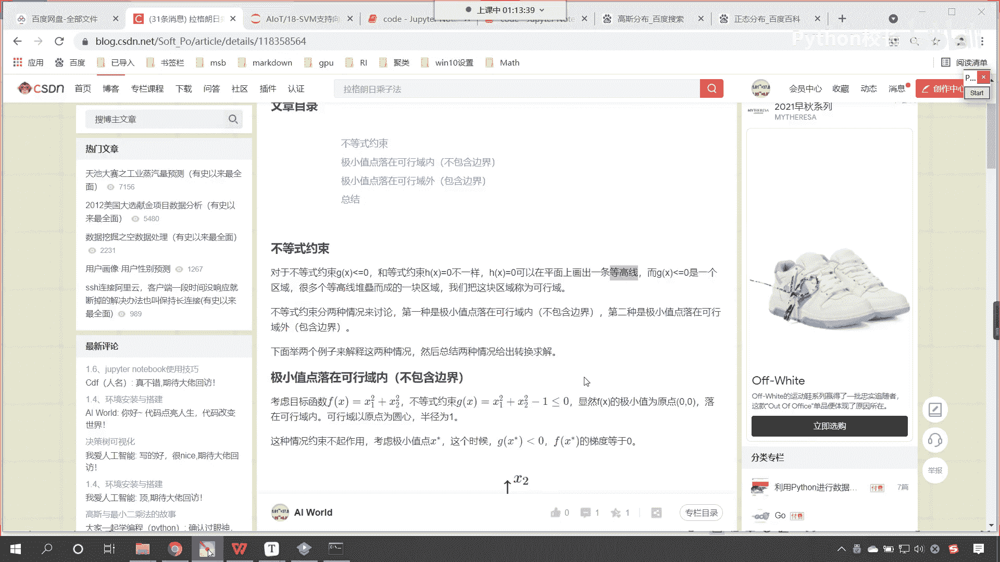

来咱们先看啊，极小值点落在可行域内，那我们就给两个方程，大家看啊，现在咱们要求发函数fx，这个等于x一加x2 的平方，我们想要求它的什么，想要求它的最小值，箭头向下划表示求最小值。

那你的这个x一和x2 ，你的范围是什么样的一个范围，唉，接下来你就能够看到这个gx，是不是对它就进行了一个约束，看到了吧，咱们进行了一个什么样的约束，那就是x一加x2 减一小于等于零。

看这是不是就是一个不等式约束呀对吧，也就是说在这个范围内，在这个可行域内，我们找目标函数的最小值，你想你看一下咱们这个图，这个显然fx的极小值是不是远点零和零呀。

看到了一看就知道是不是当x一等于零的时候，x2 也等于零的时候，它是不是最小，是不是极小，那这个时候我们这个点儿你想一下看这个圆点，它其实是不就是在咱们的正中心呀，那此时你看这个圆点儿。

是不是在咱们的可行域内看，这就是也就是说我们在gx小于等于零，在它的这个范围内，这个范围内我们可以把它认为成红色的这个圈，看到了吧，红色的这个红色的这个区域，就是咱们不等式约束。

因为我们知道如果它等于等于，如果gx等于零，那它是不是半径是一的一个圆呀，如果咱们gx小于等于零，你想一下他是不是就是咱们的这个红色的，这个红色的这个区域呀，对不对，看他对应咱们红色的区域。

现在呢我们把它关联一下，看哎就是这个对应红色的区域，嗯咱们红色的区域啊，红色的区域哎，就是咱们的约束，也就是说你在这个区域内找最小值，找哪个函数的最小值呀，就找fx就等于x一加x2 的平方。

那你想一下这种情况，咱们的约束起作用吗，看到了吧，思考一下这种情况，这个约束起作用吗，看到了吧，约束不起作用没用是吧，因为呢你有这个约束，我求解出来的最小值是不是零零，没有这个约束。

我求解出来的最小值是不是也是零零呀，你想我就告诉你一个方程，就是fx等于x一的平方加x2 的平方，它的最小值是多少，你告诉我看它的最小值是多少，是不是就是零零呀，对不对，是不是就是零呀，对不对。

因为两个数的平方想要求它的最小，那自然是每一个数是不是都是平方呀，所以你看这个时候，咱们所给的这个约束还起作用吗，是不是就没有作用了呀，对不对，你看这个时候这个约束，那你想一下，为什么它不起作用了。

为什么不起作用了，是不是就是因为咱们咱们这个极小值点，它是不是落在了可行域内呀，对不对，你看这个可行域就是咱们红色区域是吧，而我们的最小值点又刚好落在这个可行域内，就是说你有它和没有它结果一样。

那这个约束呢就不起作用，这个约束呢就是多余，所以说如果我们令咱们的极小值点是这个，你看x右上角加一个星号，这个就表示那个极小值点，此时它就是零和零，这个时候呢咱们的j x0 小于零。

这个a fx星号它的梯度呢等于零是吧，那你像我们如果想要求解这个函数的最小值，咱们是不是求导令导数等于零，令导数等于零，你就会发现x一等于零，x2 也等于零，这就是他所说的啊。

这就是他所说的他的梯度等于零，而咱们的gx小于零，看到了吧，这个gx小于零，嗯最后呢你看他的结论是这样的，我们假设说这个f，我们假设说这个x右上角的星号，它呢表示极小值，也就是说我们找到了啊。

这就是答案了啊，那么这个答案对于我们的约束而言，你看是不是小于零，对于咱们的函数fx而言，它的梯度是不是一定是等于零的呀，对不对，因为你到到这个到这个零点了，是不是看它的梯度呢一定是等于零的。

你看咱们的函数看到了吗，函数f x是咱们蓝色的这条线，看到了一个圈，一个圈在转圈，是不是最小值，当它等于零的时候变成一个点了，那么这个函数也就消失，所以这个时候它的梯度是零好，那么现在各位小伙伴。

你理解什么叫极小值点落在可行域内了吗，这个就叫极小值，点落在可行域内，那极小值点它落在可行域内，好那么我们明白咱们画了个图，各位小伙伴，如果对于我们刚才所讲解的内容理解了。

那么你就在咱们的讨论区呢扣一个1024啊，好那么我们接下来呢咱们再看啊。

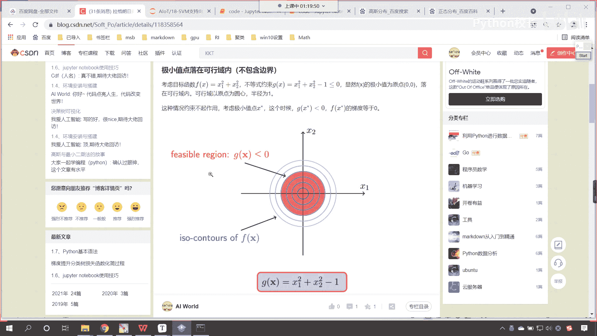

那接下来咱们再看几小时落在可行域外，那想要展示它落在可行域外，那么我们就更改一下咱们的函数，你看我在更改函数的时候呢，这个fx就等于x一减二嗯，这个x2 加二，那你想这个是不是也是一个圆呀，对不对。

你看它也是一个圆，那么对于我们这个圆而言，对于我们这个圆而言，现在你就能够发现蓝色的这个区域看到了吧，蓝色的这个圈是不是就是表示咱们这个方程，f x等于x一减二的平方，加上x2 加二的平方呀。

那么不等式约束呢，加x2 的平方减一小于等于零，显然fx的极小值为圆点，这个为为底，看为点二和-2，你想这个时候它是不是落在可行域外啊，可行域以原点为圆，心半径为一，你想一下是不是因为你的可行遇到。

因为我们可行域的这个范围呢，它是这样的一个这个范围，看到了吧，可行域的范围它是这样的一个范围，是不是看到了可行域的范围是这样的一个范围，对不对呀，那你看fx的最小值，你知道它是多少吗，肯定是零，是不是。

那么它的最小值看就是咱们这个圆心，其实你你计算那这个值肯定是零，看到一计算f x这个值肯定是零嗯，但是呢我们现在有了约束了，说你x一的平方加x2 的平方减一小于等于零，也就是说在这个红色的区域。

你找一个点，把这个点的坐标带到这个方程当中，让它求解出来的值最小，看到了吧，唉这个是咱们的方程，就是说你这个方程是吧，你比如说我我如果要把零零带进去看，咱们如果要把零零带进去，我们求得的结果。

是不是就是二的平方加二的平方等于八呀，对不对，那如果说我要把一和零带进去呢，可能把一零带进去，这个是一是吧，你看这个一和零是不是也在这个可行域内呀，对吧，你看一和零也在可行域内，那一带进去是吧。

零带进去二的平方，四一-2-1平方是不是等于五，加起来是不是等于五呀，所以说你看咱们的这个数据看在这儿呢，为了让大家能够清楚和明白，如果我的x1 ，你看如果我给一个零和零，咱们带进去。

我们得到的结果是不是八呀，看到了吗，你看这个零零是不是在咱们的可行域内啊对吧，这零肯定是满足这个嗯条件的，然后咱们再给一个一零，你看我计算出来的结果等于多少啊，是不是就是五呀。

那很显然那零零和这个一零哪个点更小呀，是不是这个一零这个点儿，代入到咱们的目标函数当中，它是不是更小呀，你看你就把它带进去计算一下它的值，把这个也带进去计算一下它的值，我们就找呀找呀。

是不是总能够找到一个最小值呀，你想是不是能够找到一个最小值，一定是存在的对吧，就是说满足这个条件，咱们就找x一和x21 定存在一个最小值，是不是，大家注意啊，不是二和-2，知道吗，这个时候不是二和-2。

我们我们把二和-2带进去会怎么样，得到的结果是多少，看咱把二和-2带进去得到的结果是不是零呀，对不对，零是不是这个时候是肯定是绝对值最小，但是看，但是你的二和-2，满足咱们上面的这个约束条件吗。

看到了吧，你看你这个二和二是吧，这个时候呢它就不是一个解，为啥它满足上面的吗，是不是取不到呀，对不对呀，你看不满足啊，所以说他就你二和二虽然是咱们方程的最小，如果没有约束的话，那二和-2是不是最优解。

现在是有约束，这个时候呢你就取不到二和-2了，所以说它就不在红色的这个区域范围内，我们刚才有小伙伴说了是吧，这个高中数学你看和咱们这个是不是很像呀，你知道一个人的智力在什么时候是巅峰状态吗。

那就是高三是吧，高中时代那个时候你的智力是最最生猛的对吧，你如果学完了进入大学是吧，你马上考四级，你一定能过，所以说只要你高中是好好学的，现在你学我们的机器学习，学咱们的深度学习都没问题。

咱们中国人是世界上数学功底最高的，知道吗，数学底蕴最最好的是吧，因为我们经过了这么多年的这个训练，好那么大家看啊，这种情况咱们的约束是不是就起作用了，看到了吧，约束起作用了吧，你的这个目标函数。

是不是就不能随随便便的去取值了，这个时候叫约束起作用，要考虑求解fx在可行域内的极小值是吧，就是红色区域，你找一下你的最小值是多少是吧，那么对于fx而言，看对于咱们这个目标函数而言。

咱们要沿着负梯度的方向走，我们才能够走到极小值点，看就是下面咱们蓝色的这个图，看蓝色的这个箭头，看什么叫负梯度呢，看到这就是这个fx，因为这个蓝色的这个圈儿它越画越大，越画越大，它的它的梯度呢是朝外的。

看咱们来一个蓝色的啊，看你比如说这个地方的梯度是多少，看这个地方的法线是多少，它是不是向外的呀，对不对，你看这个地方和它垂直，和它的切线垂直是不是向外，对不对，那他的这个嗯他的这个负梯度呢。

就是我们怎么样把它变小看了，咱们把它变小变小的话，那么就是负梯度，那这个时候呢就是方向相反啊，这个时候就是方向相反，那现在你就能够看到对于fx，咱们要沿着fx的负梯度方向走，咱们不是要去求它的最小值吗。

对不对，看我们要求fx的最小值，那这个时候梯度下降，咱们做的是不是一个减法对吧，我们减法，那只要咱们进行减法，你想一下是不是就是负梯度的方向上来走呀，每走一步负梯度就是向下走，是不是。

那这个时候gx它的区域呢是嗯发散的，如咱们红色的箭头看到了吧，对于我们的这个不等式约束，它呢是向外发散的，看到它是向外发散，那么显然当咱们走到极小点儿的时候，gx的梯度和fx负梯度它是方向就相同了。

那你看哪个是我们的最小值点，咱们现在呢画一个绿色的，你就能够发现你看这个方这个位置是吧，这个点标出来这个点，你想它是不是我们的最小值呀，那这个点有一个什么特点呢，如果我们要对这两个进行求导。

咱们对于fx求导，对于对gx求导，那他俩是不是方向相同呀，对不对，就是说fx的负梯度，它的方向是不是相同，对不对，哎所以说看啊，所以说对于这个点啊，所以说对于咱们这个点儿，对于这个点。

那这个梯度方向同向了，那么我们如何用数学公式来表示呢，哎大家看这个就是咱们这个数学公式，你仔细来看啊，这个倒三角这个是不是表示求导呀是吧，德尔塔x fx你看注意啊，因为我们在表示求导的时候。

它的这个蓝色的，也就是咱们对于我们的这个函数，咱们是不是求了一下它的负的梯度呀对吧，所以说fx这你看这个地方有一个什么，是不是有一个负号，看到了吧，有一个负号，这个就表示负梯度等于什么。

拉姆达德尔塔x gx，这个gx它是不是就表示咱们的约束条件，我们俩不一定相等呀，就是蓝色的线和红色的这个箭头它不一定相等，我们给它个系数，这个系数是不是就是朗姆达对吧，你让它乘以一个特定的数。

它是不是就一定会相同呀，因为他们俩方向相同呀，所以这个时候你乘一个拉姆达，那么一定有一个合适的朗姆达，是不是让他相等呀，这个时候咱们这个拉姆达有一个要求，这个lambda得怎么样得大于里程，看到了吗。

为什么呀，因为我们蓝色的箭头和这个红色的箭头，这两个向量它们是同向的，那么既然是同向的，那如果说我们想要将咱们这个两条线，把它缩放到一样的，那我们就只能要求咱们的朗姆达怎么样，必须得大于零，是吧。

因为咱们的负的德尔塔fx和咱们的德尔塔g x，它俩是同向的，你既然是同向的，那么你的拉姆达就必须得大于零。

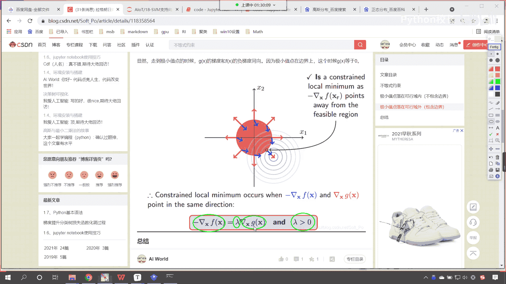

你看这就是咱们课程当中所讲到的是吧，这个拉姆达大于等于零，它的原因所在。

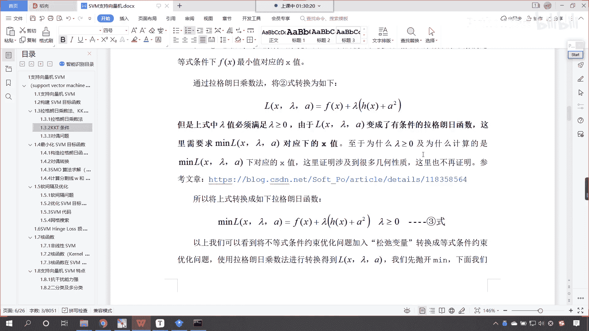

那我们再看一下，咱们看一下总结。

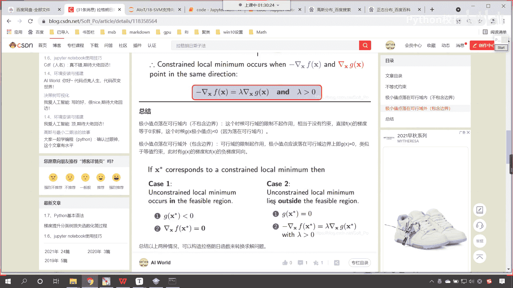

刚才呢我们介绍了极小值点落在可行域内。

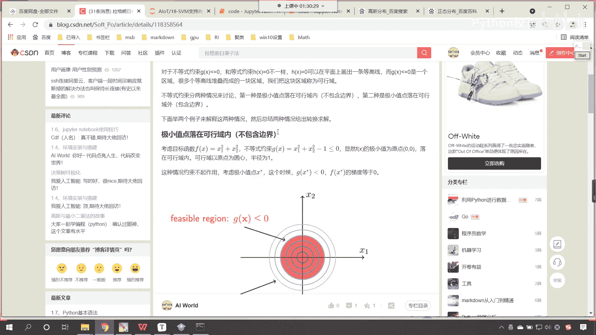

这个时候约束不起作用，另一种情况是极小值落在可行域外，这种情况呢，咱们的红色区域的这个约束它是起作用的。

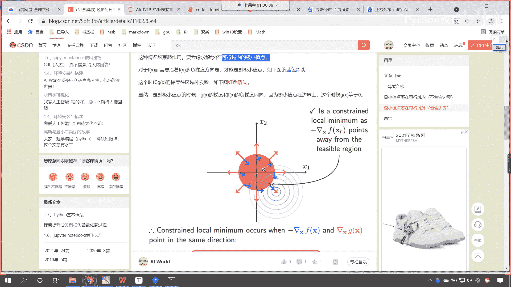

那我们看一下总结啊，唉大家看啊，极小值落在可行域内，不包含边界，这个时候可行域它的限制不起作用，有它和没有它是一样的，那咱们想要求最小值，是不是直接求fx的梯度等于零，这个时候是不是就得到一个结果了呀。

第二种情况是极小值落在可行域外，就是包含边界，反正呢你就两种情况，一种是可行域内，另一种是不是可行域外啊，可行域的限制这个时候就起作用了，咱们极小值点应该落在可行域边界上看，如果你要落在这个可行域外。

那么这个时候呢，你想要求的最小值一定是落在可行域的边界上，对不对，你想一下是不是根据咱们这个图，根据咱们画出来，这个图一定落在可行域的边界上。

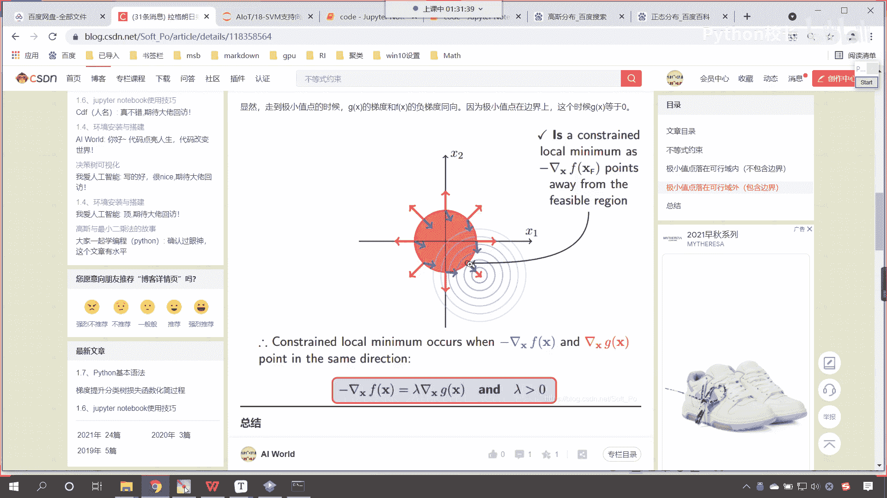

没错吧，所以说看这句话啊，这个极小值点应该落在可行域的边界上，g gx等于零好。

那么这一步很关键，来各位小伙伴对于我们第二种情况，几小时落在可行域外，你理解了，在我们的讨论区扣一个1024啊，为什么极小值是吧，它会落在可行域的边界上，我们画出来这个图形。

你根据图形你就有一个直观的认识和了解，类似于等值约束，看到了吧，看类似于等值约束，那只要它是等值约束，是不是就可以使用拉格朗日乘子法呀，此时gx的梯度和fx的负梯度方向相同。

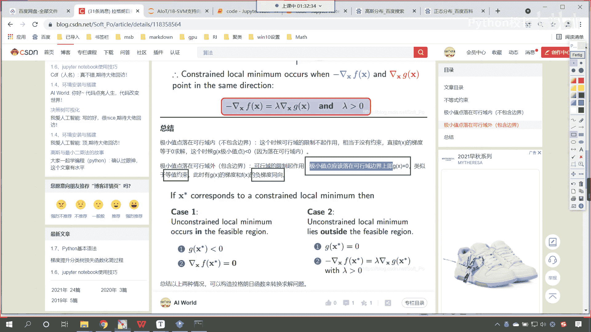

那么两种情况咱们进行一个总结，这个case一哎就是落在可行域内，这个k2 呢就是落在可行域外，那么这个时候呢你看我们如何求解这个方程呢，那这个时候你只需要求fx函数，它的导数，令它等于零。

这个时候求解即可，那第二种情况呢落在可行域外，咱们呢这个时候你看这个方程就出来了，看此时这个方程就出来了，这个gx我们说x上面带一个星号，是不是就表示它的最优解呀，看这个时候它等于零。

等于零是不是就表示落在边界上呀，看到了吧，等于零就表示落在边界上，然后呢负的fx它的导数等于拉姆达gx的导数，那这个时候就有一个约束，是不是拉姆达大于零呀，看到了吧，兰姆达大于零。

以上两种情况可以构造拉格朗日乘数法来转换，求解咱们的问题，那么对于不等式约束，咱们需要满足三个条件，满足这三个条件的解，那么我们的x型号就是极小值，那么这三个条件呢就是咱们著名的k k t条件。

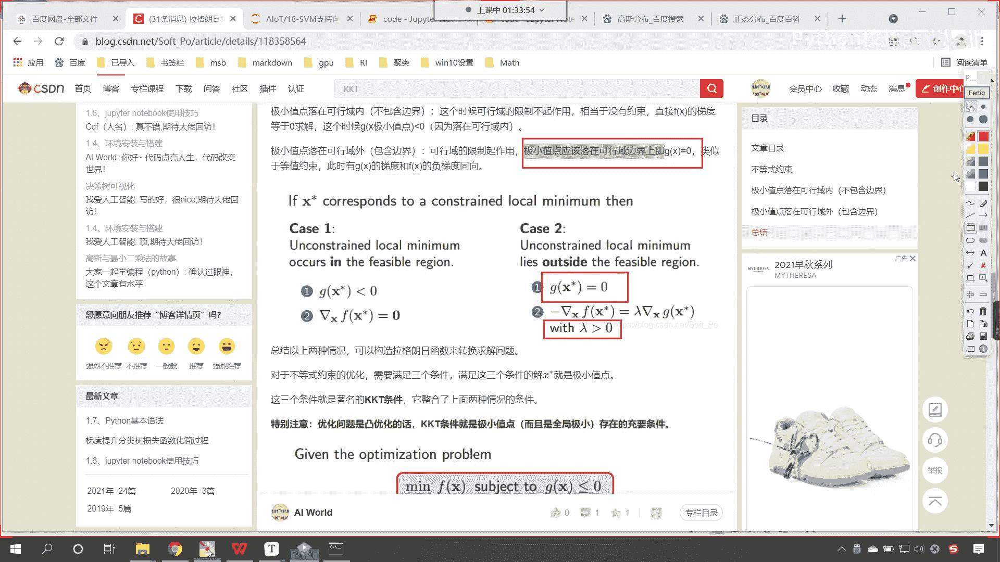

看，那么这个kk d条件它就整合了上面的两种情况，无论你落在可行域内也好，还是落在可行域外也好。

那么我们对它进行整合之后，看咱们现在呢进行，然后咱们现在就进行这样的一个操作，各位小伙伴，你就能够看到，你看到啊，这个是不是咱们的不等式约束呀，看到了吧，不等式约束我们对它进行转换。

很显然这个转换就是从上到下看，从上到下，如果要按照拉格朗日乘子法，这肯定是不行的，对不对，因为你上面是什么，是不等式约束，而拉格朗日乘子法要求必须得是等号对吧，那我们如果要能转换。

咱们得需要条件什么样的条件呢，哎就是咱们这个条件看到了吧，哎就是这个条件就是你的损失函数等于零，然后呢你的lambda呢得大于等于零，你lambda乘以g x它得怎么样，他得等于零，零看得等于零。

那为什么这个兰姆达乘以gx必须得等于零呀，你这个地方因为你朗姆达大于零，是不是就要求咱们gx必须得等于零呀，看到了吧，上面咱们也说了。

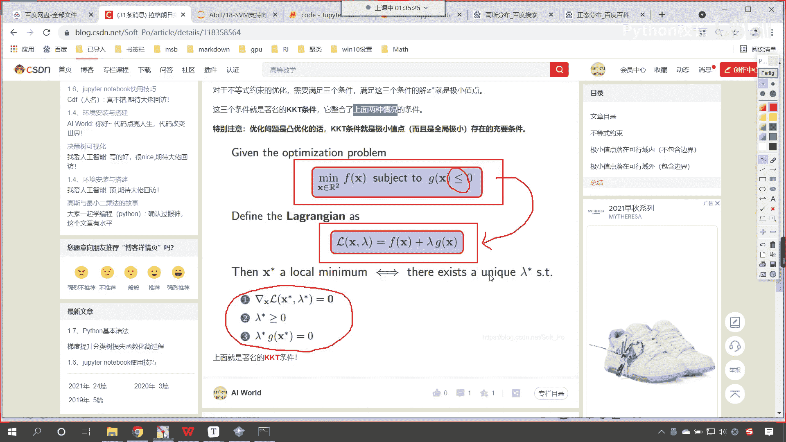

看上面咱们也说了，如果说这如果说这个gx等于零，是不是就是表示咱们的这个最优解，是不是就落在了可行域的边界上呀，看到了吧，可行遇到边界上，对不对，所以说呢这就是著名的kk t条件。

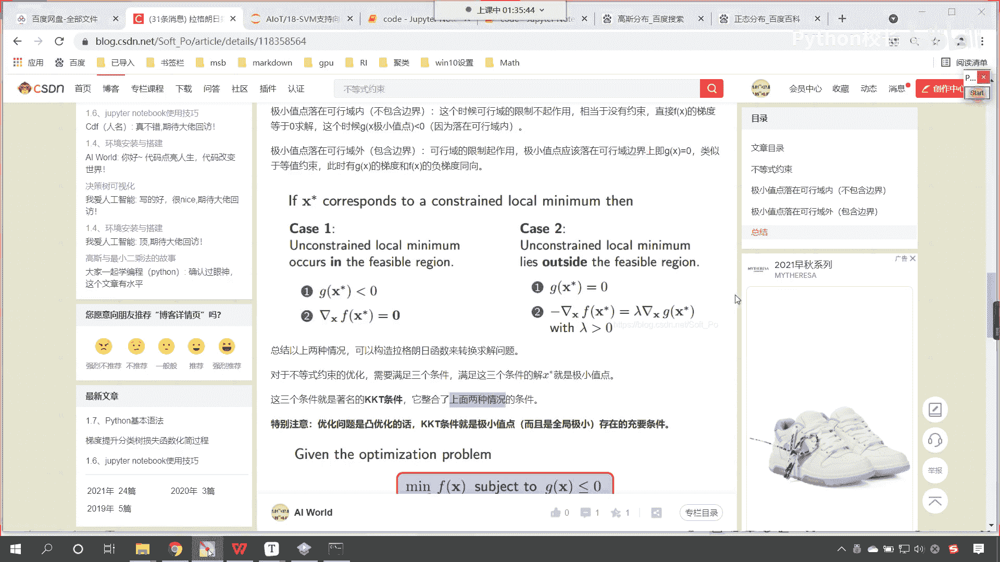

也就是说，我们将不等式约束使用拉格朗日乘子法，对它进行一个转换，那么这里边是有相应条件的，满足这个条件我们就可以转化求解出来。

