# P125：6-SVR支持向量机回归核函数差异 - 程序大本营 - BV1KL411z7WA

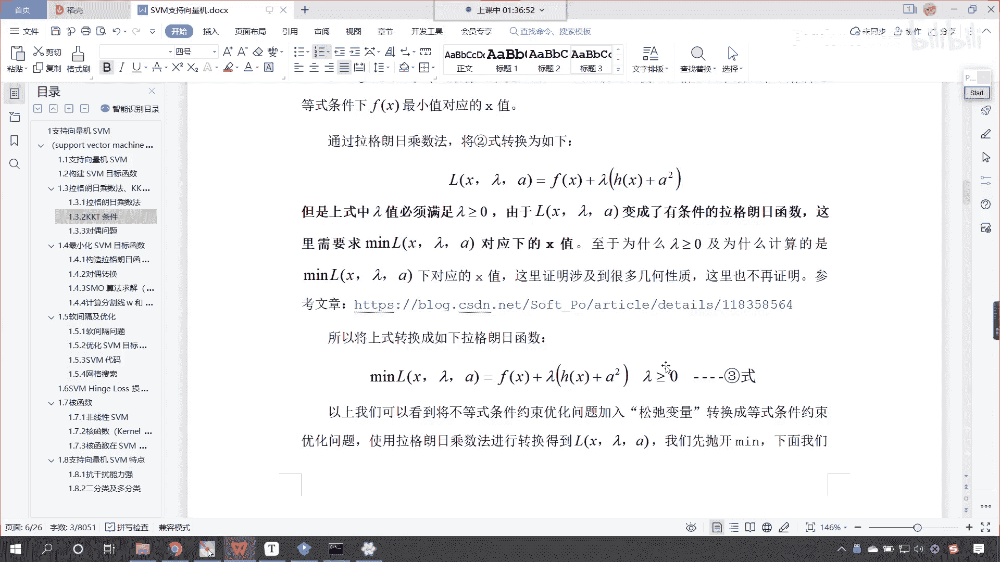

来现在呢回到咱们的代码当中，呃，咱们在这儿呢我们进行了。

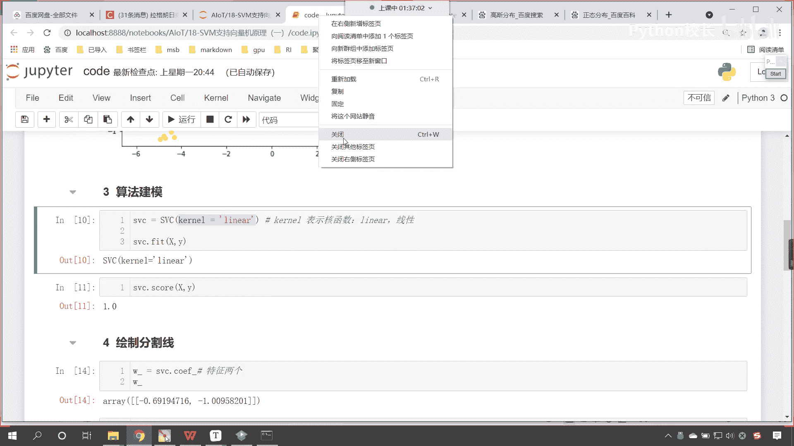

刚才呢咱们这个svc，它它呢属于是一个分类问题，那我们的分类和函数当中，它有线性的，它有多项式的，还有高斯核函数，那么我们今天开课讲到了，我们说咱们的知识向量机，它既可以解决分类问题。

是不是也可以解决回归问题啊，来现在的话咱们呢嗯来一个这个标题，咱们看一下支持向量机s，支持向量机，我们看一下它的这个回归问题，那么我们导一下包啊，咱们import numpy as np。

然后咱们from sk learn，点svm，咱们导一下包，import我们叫做s vr，咱们呢把这个给它导进来，导进来之后呢，我们再import mat plot lib。piplot，画图工具呢。

咱们给它导进来，那执行一下这个代码，那接下来呢我们就去加载数据啊，咱们就创建，咱们就创建一个数据，那我们创建这个数据呢，咱们首先给一个x x就等于np点，我们来一个x。lin space小括号。

我们让他从零逗号，咱们让他到十是吧，我们把它分成多少份呢，咱们把它分成，咱把它分成50份，这个x就有了，然后呢再给一个y y呢，就等于np。sin x，那这个prt咱们plot一下。

这个咱们画一下它的散点图，scatter xy放进去执行，现在你就能够看到咱们得到的这个形状，它是不是一个这样的形状呀，看到了吧，此时咱们得到的一个形状就是这样的一个形状，好，那么我们给它范围呢。

咱们给他一个完整的正弦波啊，我们让他二倍的n p点派，我们把它分成50分，哎，大家看这就是一个比较完整的正弦波，那我们所生成的y呢，大家看咱们嗯这样它是这个图形了啊，咱们现在呢不给它增加啊。

咱们现在呢不给它增加这个盐了啊。

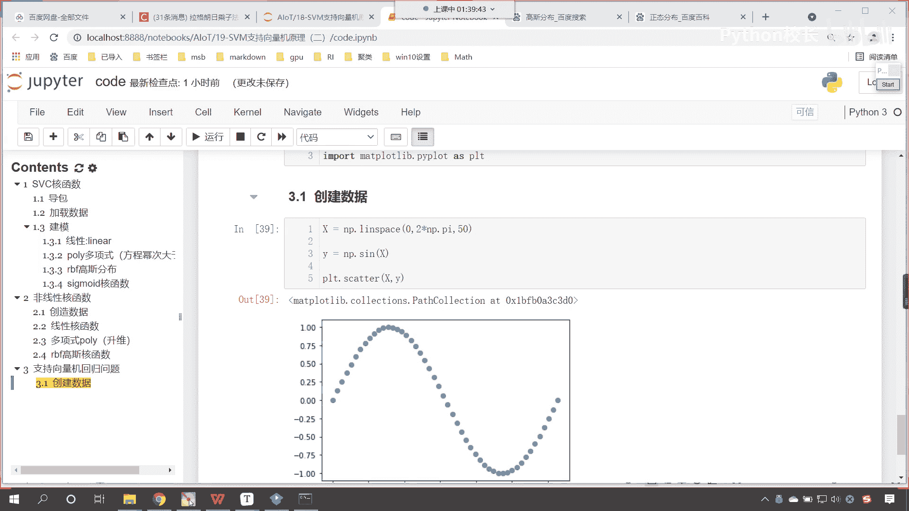

好那么数据准备好了，此时呢咱们的x形状呢得需要转变一下，因为x它的形状是一维的，咱们在这儿呢进行一个reshape，-1和一，这个时候你看打印的数据，输出的显示的数据还是一样的。

但是这个时候这个x它变成二维了，好那么建模了，接下来呢创建了数据，接下来呢我们就进行建模，那这个时候呢咱们s vr就等于s vr，那我们给一个核函数kernel，我们让它等于linear。

你想一下我们给的这个核函数，让它是linear，你想咱们能够预测出来吗，那调用s v r。feat，咱们将x和y传进去，然后s vr点调用predict，我们进行一个预测，咱们将x放进去，返回的结果。

我们就叫歪盖，那这个时候咱们就画图，先将原数据的散点图画出来，然后呢plt。plot，咱们将x放进去，我们将y盖放进去，这个是不是咱们的预测值呀，我们给一个color，咱们来一个注释，那这个呢就是绘制。

那这个就是绘制我们的预测结果，你想一下我们上面这个数据，它是不是一个正弦波，对不对，你看它是一个正弦波，那么它预测出来的效果会是怎样的呢，哎你看这个时候我一直行，哎，各位小伙伴就能够看到。

咱们得到的数据是不是就是红色的这条线呀，那么很显然这个是不行的，对不对，看到了吧，很显然这个是不行的，那与拟合出来这条线呢，不能满足咱们数据的一个走势。

对不对呀，这个时候你能够发现，咱们是不是出现了一个粉红色呀，看到了吧，为什么出现一个粉红色呀，因为我们数据y的形状啊。

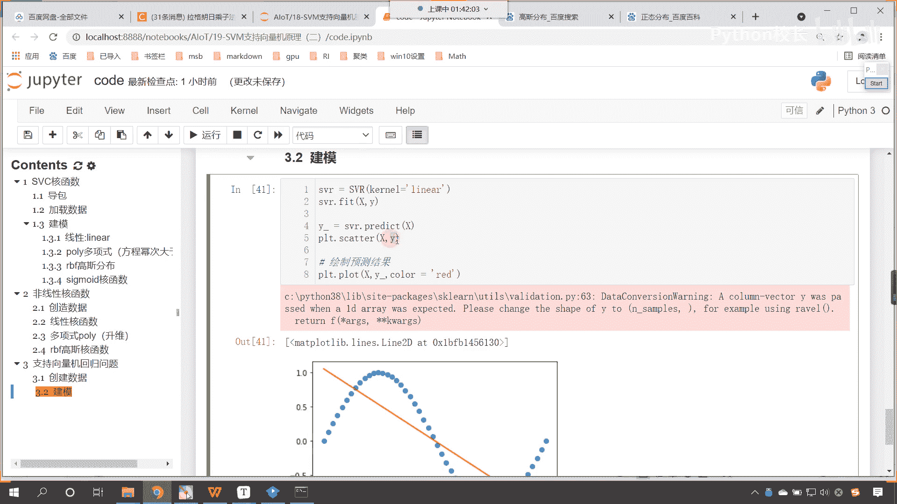

因为咱们数据y的形状，咱们上面调用np。sin之后，它其实呢这个y它也是一个二维的，我给你看一下啊，咱们输出一下这个y啊，你看看到了吗，为啥说它是二维的，是不是一个中括号，两个中括号呀，对不对。

那正是因为它的存在，看到了吗，y是吧，please change the shape of y two n samples，是不是让咱们调，是不是让咱们进行转换呀，for example。

说还给你举了个例子，你可以使用ral这个方法，看到了吧，友好不友好，那咱们就在进行feat的时候，咱们就点看ra v e l调用rebel，看到了吧，这个时候就相当于把它变成一维，那此时我在执行。

你看还有那个粉红色的提示了吗，是不是就没了呀，其实你不管那个粉红色的提示也能运行啊，看到粉红色往往感觉不舒服，我就要把它去掉，所以说呢仔细读那个英文，你能够找到解决的办法好，那么这个就不好。

是不是来咱们在上面插入一行，这个来一个四级标题，这个呢就是咱们的线性，那这个就是线性的这个核函数，不太好，那接下来呢我们再来看，再来一个四级标题，咱们的使用polly多项式和函数。

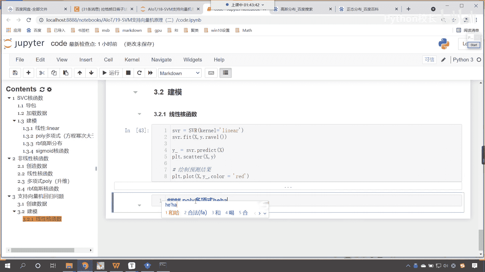

好那么上面那个代码咱们呢复制一下，在这来一个粘贴，我们把linear改成polly，默认情况下这个degree等于三。

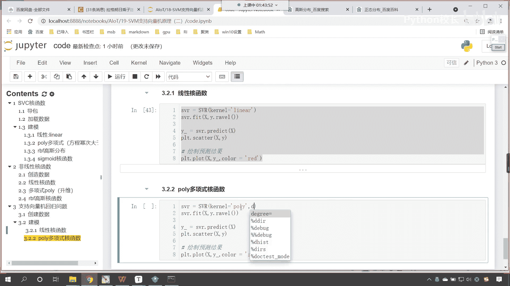

咱们先给一个三，我们执行一下看怎么样，你看效果好不好不好，那我们给一个二呢，你看执行一下这个效果是不是也不好，看到了吧，因为它就你想咱们这个正弦函数，它是多项式函数吗，很显然不是，对不对。

所以说你使用多项式去拟合，这样的规律也行不通对吧，那接下来咱们继续看是吧，咱们使用r b f是吧，这个叫什么呀，看这叫做镜像机啊，这个镜像机它呢也是高斯核函数。

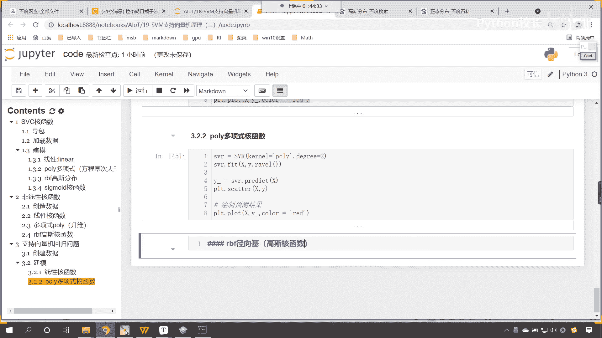

这啥叫镜像机呢，来看咱们和函数它的这个介绍，这看看咱们和函数它所对应的公式，你现在有没有发现啊，看到了吧，x i减x g平方，这个平方是不是就有圆，是不是就有半径的意思呀，看到了吧。

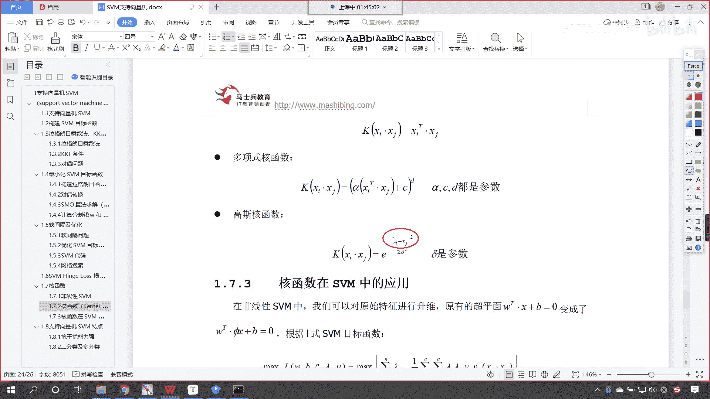

看它对应着什么，x是不是减mu的平方呀。

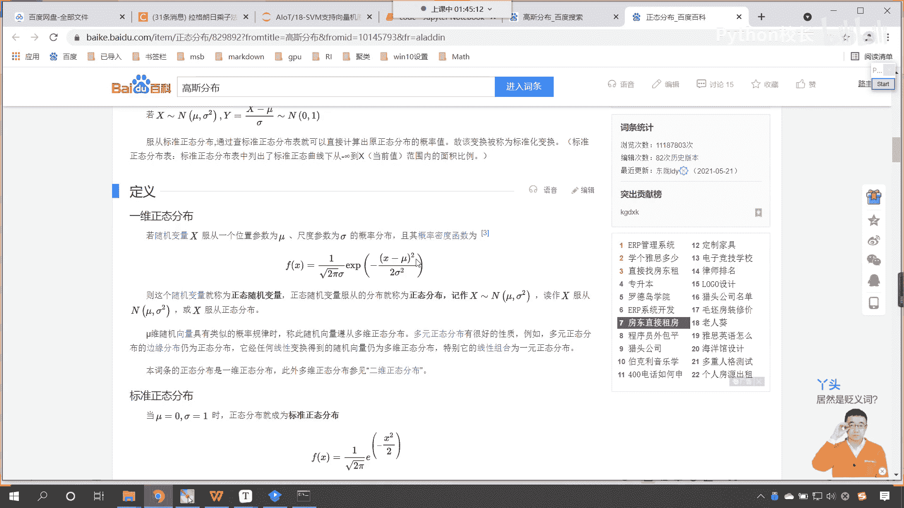

看到了吧，所以说我们的这个算法它也叫什么，也叫镜像机，上面这个复制一下，咱们粘贴过来，把polly呢改成r b f，这个时候degree这个参数对它就没有用了啊。

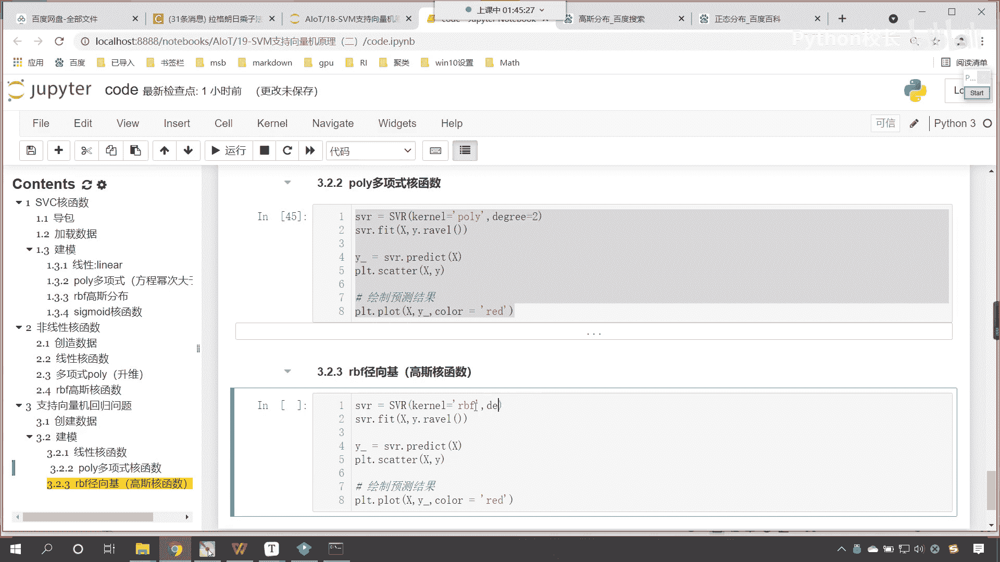

shift tab，咱们把它打开，我们往下走，是不是就能够找到咱们的这个kernel，是不是就能够找到咱们这个kernel呀，对不对，你看常用的就这几项来执行一下。

后面还有一个precommunicate，这个一般没用啊，知道吧，这个常用的就是咱们这四个是吧，premicate，你把它这个kernel写上，它没啥作用，来这个时候你看我一执行诶。

大家现在就能够看到，是不是就比较吻合了呀，咱们曲线的规律是不是也就拟合出来了，看到了吧，那我们现在呢我们再来啊，咱们将数据给它变得稍微复杂一点，哈哈我们这个np点派之后呢，咱们再乘以二，再乘以二。

这个时候你就发现你看这个数据规律，是不是就变成这样了，然后呢样本点咱们给他多一些啊，看到了吧。

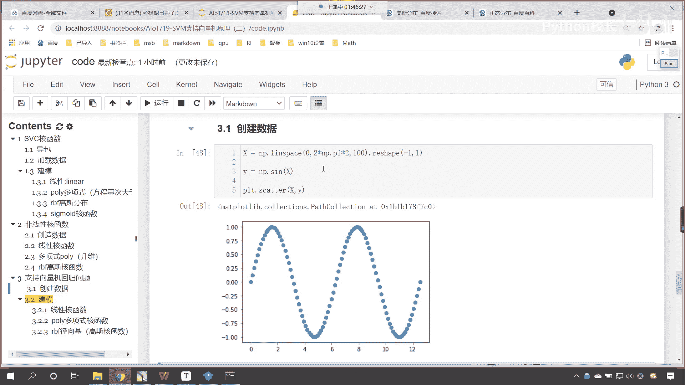

这个时候是不是就是两个正弦波呀，对不对，那两个正弦波咱们再来看一下。

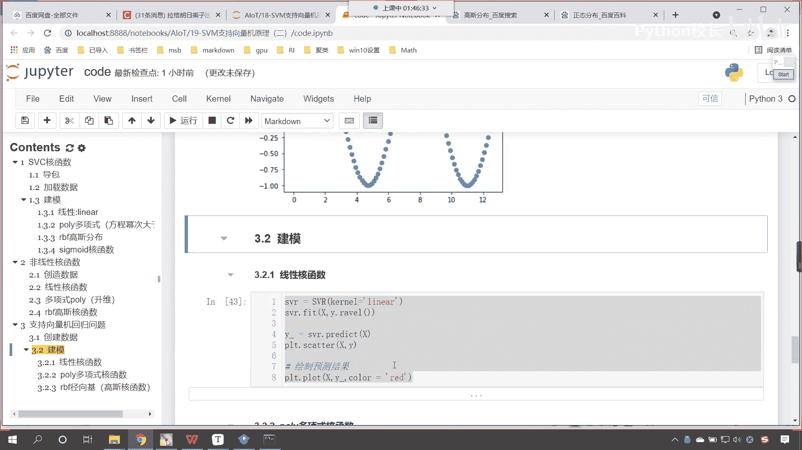

把上面这个代码复制一下，我们在下面插入一行ctrl v，这个时候咱们再来执行，唉，大家看两个正弦波，咱们这个rbf，是不是依然能够很好的进行拟合呀，看到了吧，依然能够很好的能够进行拟合啊。

嗯一般情况下这个r b f在进行分类的时候，如果说我们的数据它的分布是正态分布，那么咱们使用r b f效果比较好，那在进行回归的时候啊，在咱们进行回归的时候啊，咱们这个数据呢，那你就能够看到这条线是吧。

是拐来拐去的，是不是啊，那所以我们使用r b f这个它也叫镜像机嗯，看了它也叫镜像机，那么咱们就可以沿着它的啊，这个上下看来进行一个拟合，这个时候效果也比较好，那么对于数据我们往往是黑盒。

我们看不到数据内部是怎样的一种结构，那么我们最简单的办法咱们就是尝试。

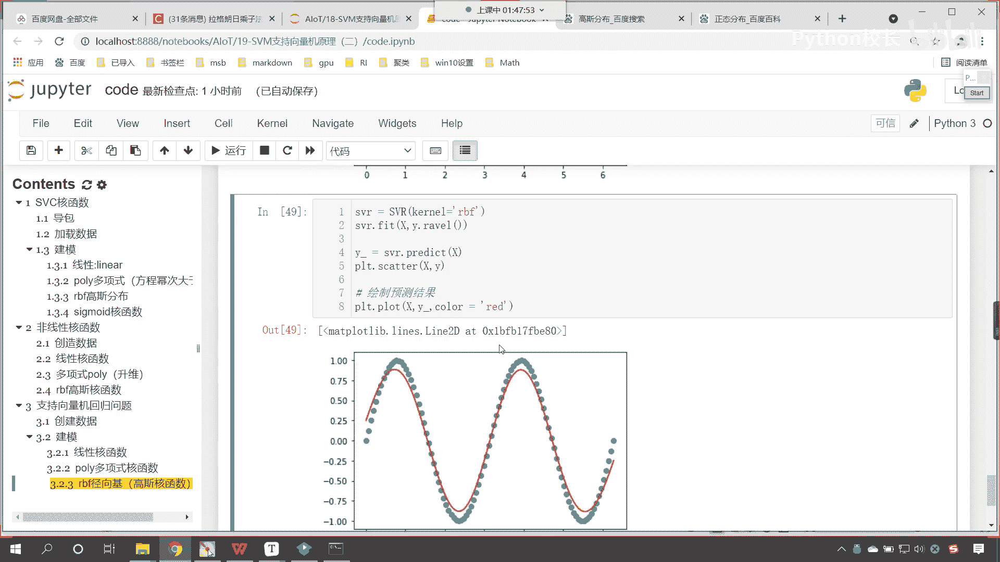

你比如说对于我们这个数据是吧。

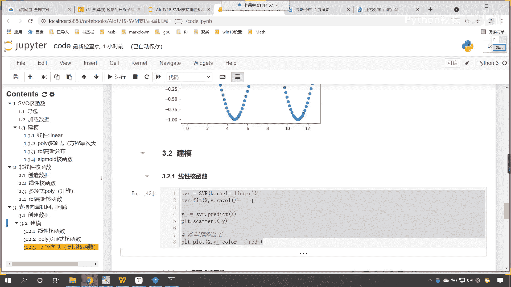

对于我们给的这个正弦波这个数据，那我们一开始不知道用哪种效果好。

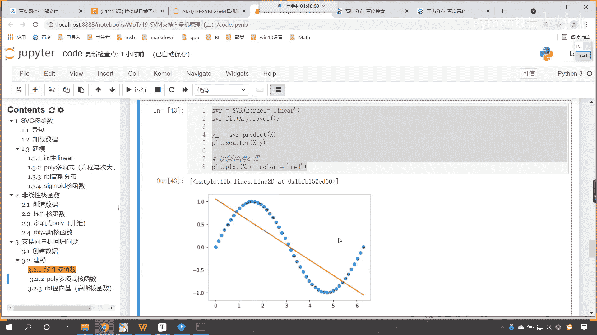

所以咱们就进行了一一的选择。

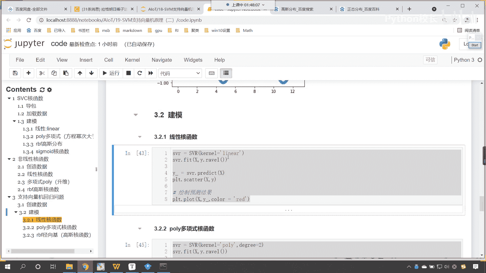

使用线性使用多项式使用镜像机，最后咱们就发现。

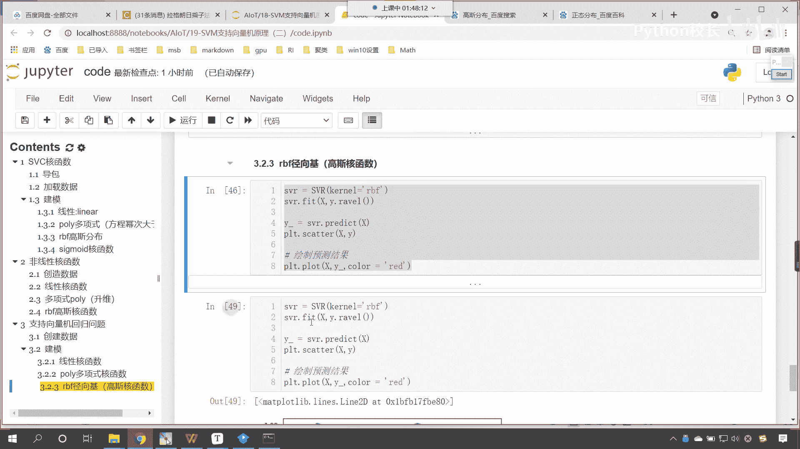

这个镜像机的这个效果是最好的，也就是高斯核函数这个效果是最好的。

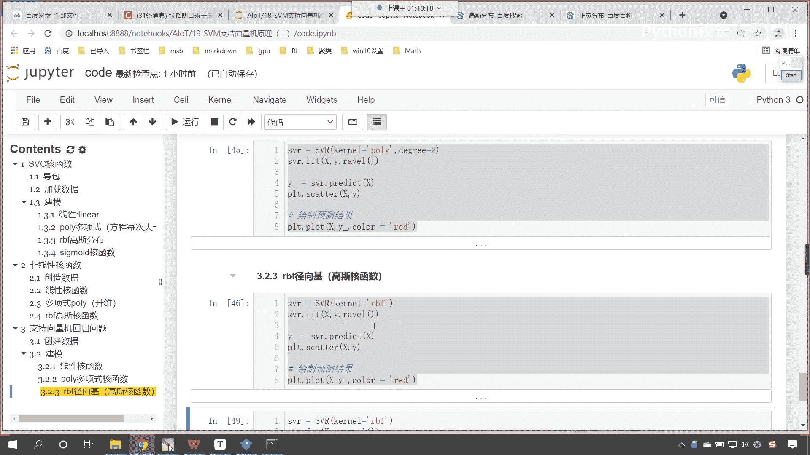

那么当然我们给的数据比较简单，所以咱们是不是可以画图画出来啊，以后如果说你的数据以后，如果说你的数据复杂，你没有办法画出来，那么我们可以使用模型的评价指标来进行对比，得分高。

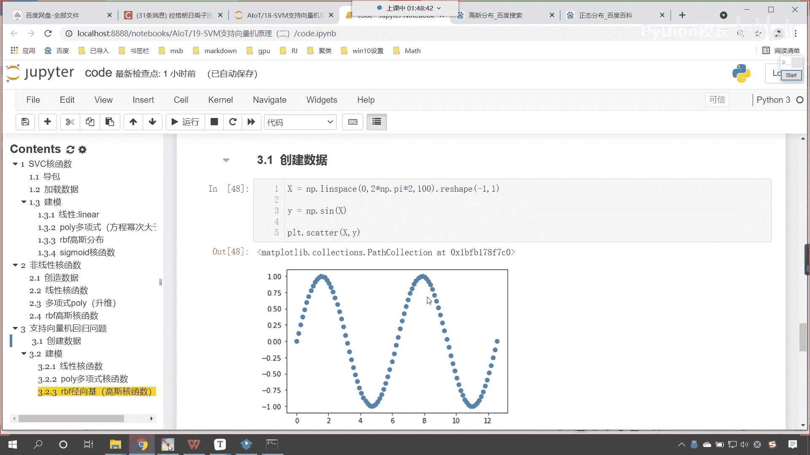