# P127：1-SVM支持向量机原理可视化 - 程序大本营 - BV1KL411z7WA

好，那么首先呢我们看一下支持向量机，它的可视化啊，我们通过一个小案例，咱们再来研究一下，咱们支持向量机它到底是如何进行操作的。

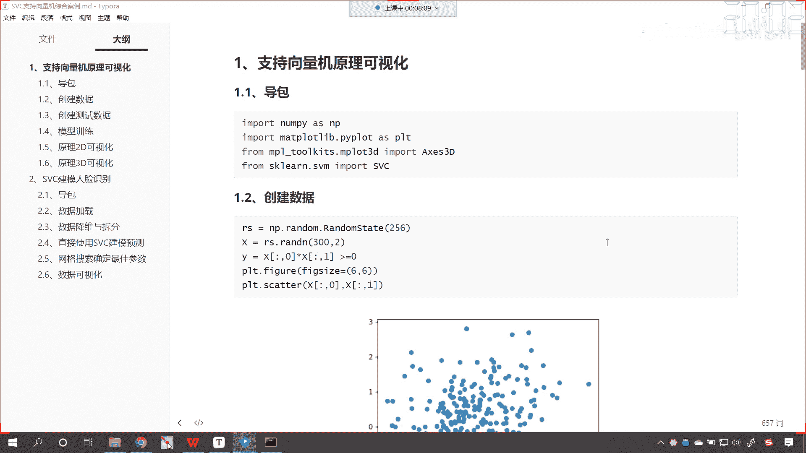

好那么咱们现在呢就回到我们的代码当中，那么今天呢是我们的第20节课程，那我相应的文件夹已经创建好了，咱们进入进去，那么大家看这里边我提前准备了一个数据，这个数据在哪儿呢，在咱们的百度网盘当中。

唉你就能够看到看到了吧，在这儿呢好，那么以及呢今天晚上的作业，还有呢一个这个比较大的数据，这个是人脸识别的数据，300多兆，所以说你需要提前下载，那咱们现在呢就开始来。

我们现在呢创建一个python文件，给它起个名叫就叫做code，现在的话我们导一下包，import numpy as np，然后from sk learn，从s vm下面咱们导一个包。

咱们将svc导进来，然后呢我们将画图工具导进来，import mat plot lib，那么咱把画图工具导进来，那么待会儿呢我们还要绘制三维的可视化图形，所以说我们从m这个npl two kids。

它里边有一个m的3d，3d执行一下代码，那么我们在它上面插入一行，咱们来一个三级标题，那这个呢就是svm支持向量机，它的一个原理可视化嗯，咱们通过可视化呢来对它进行一个研究，那接下来呢我们就创建数据。

哎大家看啊，咱们创建数据，那我们这个数据的创建呢，咱们刷新一下啊，重新加载重新加载，那我们就可以出现咱们的这个左侧，出现咱们的目录了，好那么我们创建数据，这个时候呢咱们就给一个x x就等于np点。

我们现在呢给它一个种子啊，np。random，咱们给一个random state，我们给他一个256，那这个种子是怎么回事呢，有了这个种子，咱们生成的这个数据它是不是就是固定的呀。

因为我们random是随机数是吧，这个是一个种子啊，这是一个种子，那么我们生成的随机数字它呢就固定了，如果我们要不写默认情况下，它每次生成的这个数据呢都是变化的，好那么我们就使用rs。

咱们呢调用其中的run这个方法，咱们呢给它生成一些数据，那咱们就生成300个点儿，我们生成两个，这个时候呢咱们就接收一下x就等于他，那我们run呢是一个正态分布，它生成的数据就有正有负。

现在咱们把这个数据给它画出来，那就是pot点，scanner x中括号冒号零，然后x中括号冒号，咱们给个一零，就表示它的第一列，一就表示第二列，这个时候你看我一执行这个图形，是不是就画出来了。

你能够看到咱们的范围，是不是就是从纵坐标是-三到正三，横坐标是不是也是从-三到正三呀，图片的尺寸咱们给它调整一下，我们把宽度高度都给它调整成六和六，这个时候你看我一执行画出来。

这个图形是不是就是一个方块呀，你能够看到咱们这个数据，如果说我们要按照象限来对它进行划分的话，你来告诉我咱们这个是不是就分为一三象限，是不是又分为二四象限呀，对不对，看到了吧，1234象限是不是。

那么我们现在这样，咱们将这个一第一象限和第三象限它是一类，这第二第二象限和第四象限是一类，你能告诉我，这一三象限和二四象限有什么样的特征吗，一三象限是不是都是正的，这个这个一三象限，第一象限是正的。

第三象限是不是都是负的呀对吧，二四象限是不是一正一负好，那么我们就可以根据这个符号来创建咱们的y，看咱们的目标值y我们呢就让它等于诶，大家看啊，这个时候呢，咱们就让这个咱们来一个这个列表生成式啊。

那就是来一个中括号x中括号冒号零，我们让它乘以x中括号冒号一，你首先有一个乘法，看到了吧，有一个乘法，你想一下第一象限和第三象限乘完之后，它是不是就是一个正数呀，对不对，这第二和第四象限乘完之后。

它是不是就是一个负数呀，对不对，所以说那么我们就可以这样来操作，叫for i in啊，叫for i in，他前面呢咱们来一个判断，叫做if i如果要大于零啊，如果咱们这个a大于零。

咱们怎么样else怎么样好，那这个如果要大于零的话，咱们就把它设置成一else的话，咱们就把它设置成零，看这个是一个列表生成式，同时呢我们是不是又给了一个判断呀，那我们判断的到底正不正确呢。

咱们画图的时候，我们给一个颜色，这个参数叫c这个c呢就是咱们上面的类别，看这个y是我们的目标值，咱们现在呢就嗯就让一三象限，我们让一三象限让它是一，咱们让二四象限，我们呢让它是类别零。

这个时候呢咱们把得到的这个y放进去，这个时候你看我一执行，现在你就能够看到结果是不是就出来了，你看现在有没有分开看，一三象限是不是就连成一片了，这二四象限是不是也连成一片了。

看到了二四象限是不是就变成一类了，所以说我们上面咱们这个列表生成式，以及我们对于列表生成式取得的这个，数据i进行的判断，没有问题，你能够看到啊，通过这一行代码你就知道python的强大了。

如果这个用java写，如果这个用c语言写，那这个没有十行代码下不来，所以说python一行代码就能搞定，现在的话咱们就创建数据了，好大家看看咱们是从-三到正三，纵坐标也是从-三到正三。

那么我们呢就用算法支持向量机，来对于这个数据咱们进行一个学习，那么它会学到什么样的规律呢，就是一三象限的数据它要分开，二四象限的数据它是不是也要分开啊，好那么创建数据了，接下来呢咱们就再来一个四级标题。

接下来呢咱们就建模进行学习，好那么我们声明一个s vc，这个时候咱们就给一个s vc，那我们给它一个核函数，咱们让它是rbf，这个r b f就叫做镜像机，那么我们使用咱们的这个呃算法，咱们呢进行训练。

我们feat一下xy，看这个时候咱们的算法就学到了相应的规律，那我们说了这个规律是什么样的呀，看到了吧，这个规律是啥样的，是不是这个一三象限啊，一三象限是一个类别，对不对，二四象限另一个类别对不对，好。

那么学算法学好了，接下来呢我们再来一个四级标题，那么我们呢创建，接下来呢咱们就创建咱们的测试数据，那么我们的测试数据呢咱们给的稍微多一点，我们给一个x1 ，我们让它等于np点，大家看啊。

咱们来一个line in space，我们让他从-三到正三，咱们把它分成20份，然后呢再来一个x2 ，这个x2 呢也来一个np。lin space，我们也让他从-三到正三，咱把它分成18份。

那这个时候这个x一和x2 ，大家看它是一维的，现在呢咱们使用之前介绍过的，介绍过的一个方法叫mesh grade，咱们对它进行一个嗯，咱们对它进行一个这个合并啊，你看看这个np。m是grade。

那么我们现在呢就将x一和x2 作为参数呢，放进去x1 x2 ，那么它在进行mesh grade之后，那这个数据会变成什么样的呢，咱们接收一下x1 x2 ，那这个时候呢大家看啊。

咱们上面这个数据我们display一下，那就是x一点ship，x2 点sh，合并完之后经过咱们的mesh grade，这个叫网格交叉，是不是咱们呢再来查看一下它的形状，那就是display。

那就是x一点sh x2 点ship，这个时候你看我一执行，现在你就能够发现这x1 x2 经过mesh grade，是不是就变成了18和18呀，看到了吧，它就变成了18和18，那么这个数据长什么样呢。

看了这个数据长什么样呢，我画图给你画出来啊，咱们p l t。sc，咱们呢将x一放进去，我们将x2 放进去，这个时候你看我一直行，咱们得到的数据大家看长这个样，看到了吧，得到的数据长这个样。

那如果说我要把它分成五份，下边这个分成三份，你看我一直行，咱们是不是你看这是几行几列呀，是不是三行五列，我们把它划分的越细，大家想它是不是分的就越密呀，你看也就相当于x一呢是咱们的这个水平的。

x2 呢是咱们的数值的，这个分成200份，这个分成180份，这个时候你看我一执行咱们得到的数据是吧。

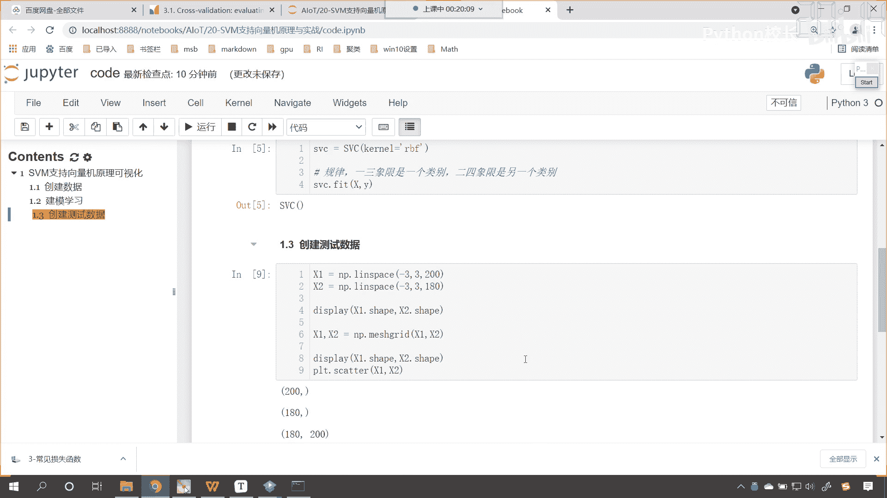

其实我们画出来的是散点图啊，但是呢这个散点图太密集了，导致看导致它看起来是不是就像一个。

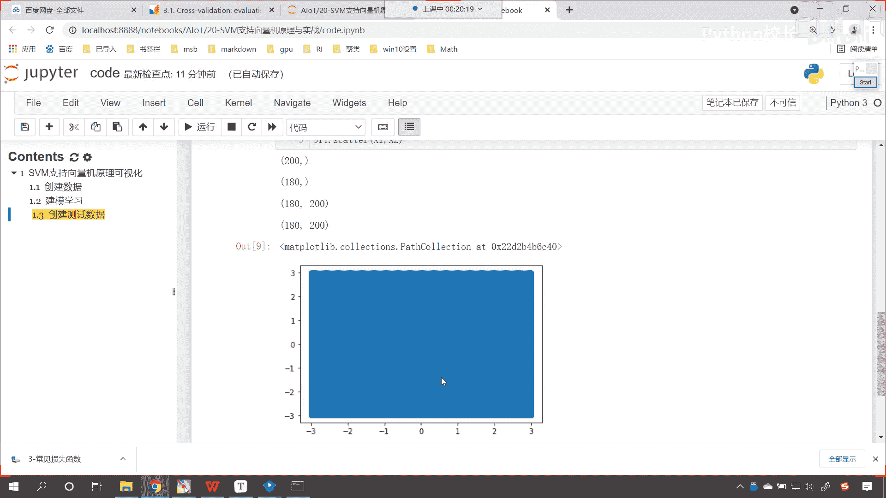

是不是就像一个面呀，你看我再调小一些是吧，你比如说我把这上面这个调整成50，下边这个调整成40，你还能够看到它的间隔。

看能不能看到它的间隔呀，看到了吧。

能看到间隔是不是啊，所以说这个多和少只是这个数量的一个不同，那么我们操作完这个之后呢，咱们不是有了x一和x2 吗，接下来呢咱们np。cocoinnate，咱们对它进行一个这个吉连啊，来一个中括号。

那x一呢是二维的，咱们来一个rival，rival就相当于把它放平变成一维的，那么我们的x2 呢，它也是这个二维的这个contact culate，这个方法要求咱们的数据有一个形状。

现在呢咱们调用column stack，我们调用这个方法，那这个column stack这个方法咱们之前也介绍过，这个是不是列的合并呀，对不对，那我们就给他一个列的合并，那列的合并x一和x2 。

咱们都对它进行平铺，平铺就是ral，其实就是把它变成一维的，就是这个从前往后一直向后录啊，就是这个意思好，那么得到的这个数据呢，咱们起个名就叫x test。

得到的这个x test他呢就作为咱们的测试数据啊，这个就作为我们的测试数据，你知道为什么把它当成测试数据吗，你看它的范围是不是从-三到正三，x2 是不是也是从-三到正三上面，咱们画的这个图。

你看我们给的这些，我们给的这个图当中这300个点，它的范围是不是也是从-三到正三，是不是从-三到正三呀，所以我们的测试数据呢，咱们在这个范围内，我们给了更多是吧，那就是200 180。

这个时候呢就是36000个数据，那这个时候呢这个数据合并了，那我们呢就把这个图画出来啊，display咱们现在呢知道它的形状是什么了，我们就没有必要去看了，那咱们现在呢在绘制scatter的时候。

咱们调用test中括号冒号零，这就是第一维，相当于横坐标x下划线test中括号冒号一，这个就相当于纵坐标，这个时候你看过一执行。

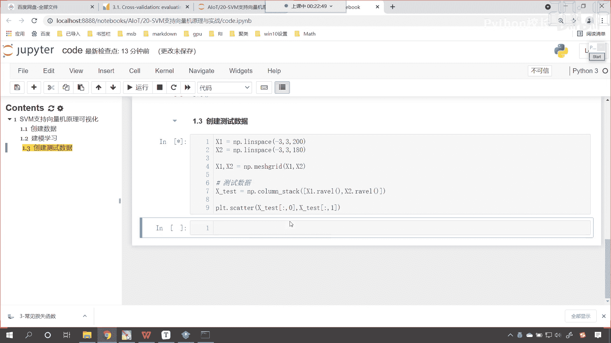

你看这个图形是不是也出来了，这就说明咱们的数据，测试数据的这个合并没有问题好。

那么有了咱们测试数据了，咱们接下来是不是就应该使用咱们的算法，对它进行一个预测了对吧，上面咱们已经声明了算法，那接下来呢咱们就算法预测好，那么这个时候呢咱们就s v c点。

咱们就调用predict这个方法，我们将x下划线test放进去，咱们会得到一个预测值，我们起个名叫y杠predict，预测的准确不准确呀，咱们现在呢画图画出来啊，plt。scanner。

看看它能不能把我们这36000个测试数据，大家注意啊，咱们是36000个测试点，这个点儿呢密密麻麻的，是不是，那我们训练咱们训练的时候，咱们虽然只学习了300个数据，那我们测试的时候。

咱们即使给36000个数据是吧，只要规律学到了，是不是这个预测出来都不会有问题啊，那我们看一下，有没有将这36000个点预测准确，那我们还得需要把这36000个点画出来，然后呢给他啊着上颜色。

那这个颜色呢，c就等于咱们算法预测出来的predict。

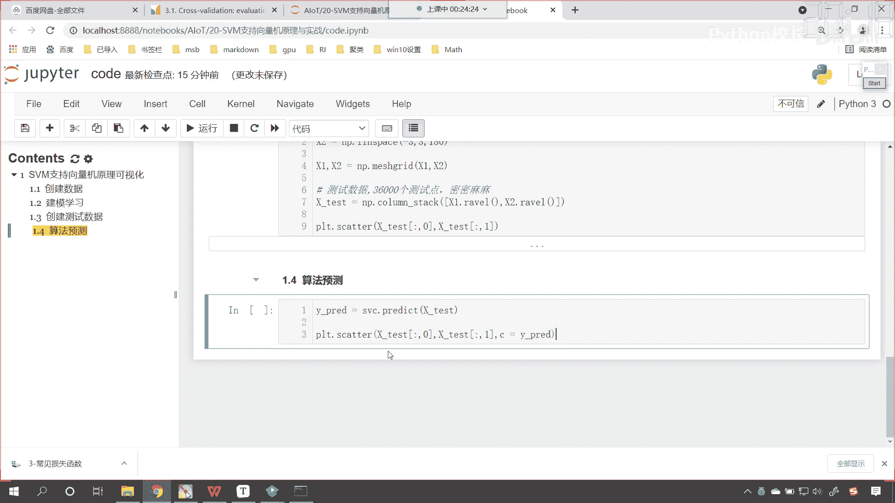

这个时候你看我一直行，现在你能发现看到了吧，一三象限和二四象限，咱们这个算法规律是不是就找到了呀，看到了吧，我们的算法呢将这么多的数据，36000个数据对它进行了一个分类，看到了吧，对它进行了一个分类。

这个一三象限，你看联通的这个是不是就是黄色呀，这个二四象限是不是就是紫色呀，那么我们画出来这个图。

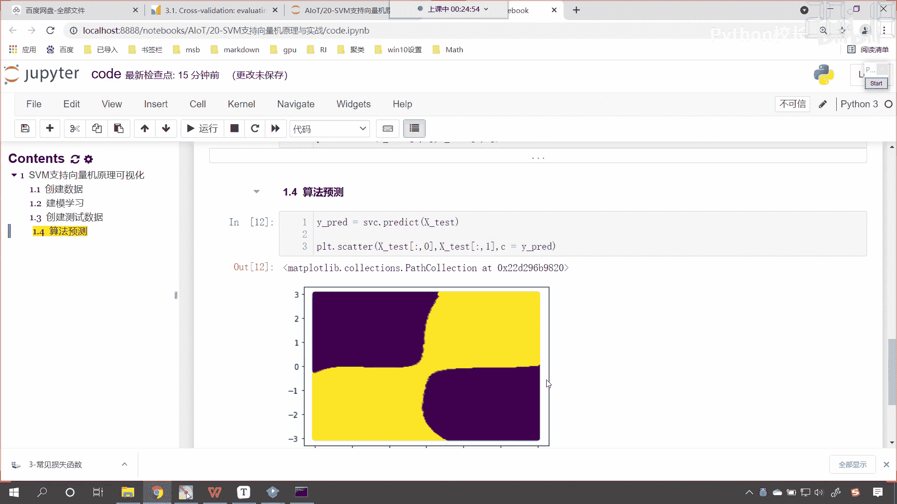

这个当然不规则啊，因为我们给的数据，你来看，你看我们给的这个数据是不是也不足够多呀，看到了吗，我们给了300个数据，因为我们的数据呢，大家看它是一个正态分布的数据，那也就意味着那有很多数据。

它是不是在零附近呀，看到了吧，在零附近进行了一个汇聚，你就像咱们所画出来的这个图，你能够明显的看到一三象限，是不是连成一片了呀。

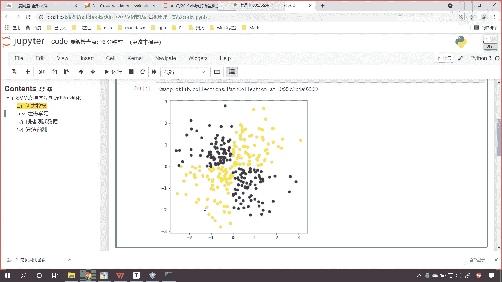

对不对，所以咱们的算法预测出来的，一个大致的规律是吧。

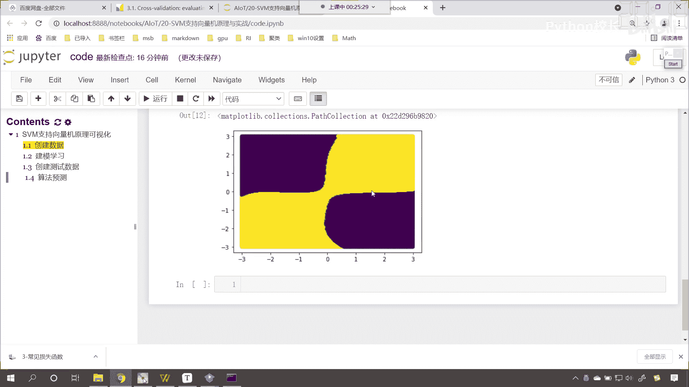

那这个时候呢，哎就说明咱们的算法把这个学会了。

那么接下来呢我们就要看一下，这到底是个怎样的一个规律呢是吧。

咱们的核函数是r b f。

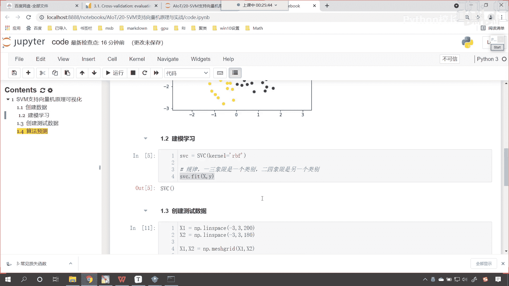

这个r b f叫镜像机，那么它到底是怎样的一个原理呢。

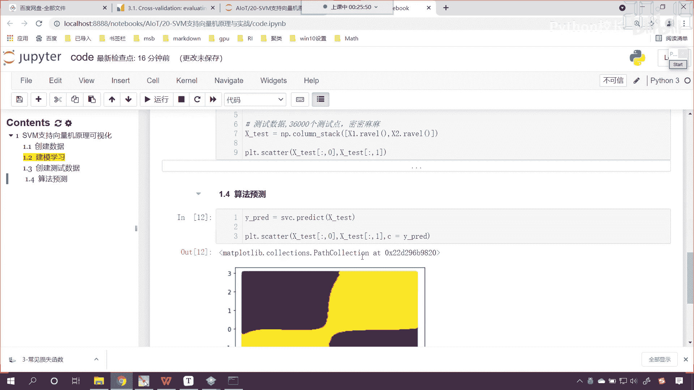

来接下来呢咱们进行算法原理的可视化啊。

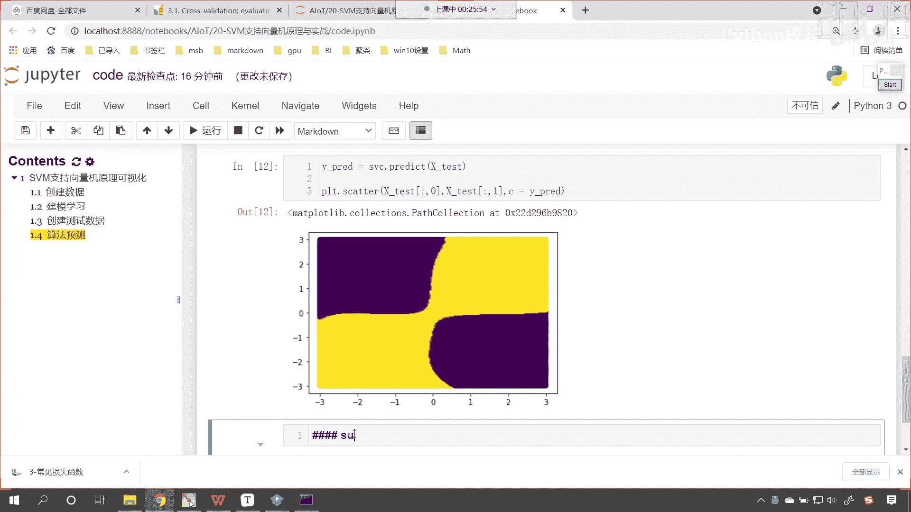

算法原理可视化好。

那么我们有我们有很多点。

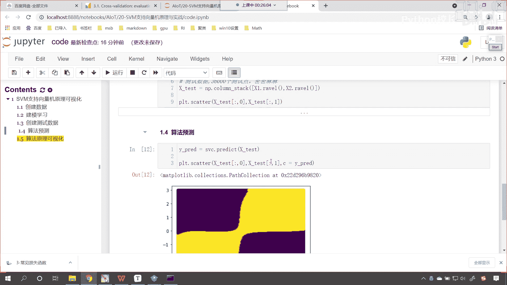

对不对呀，咱们有这个3万多个点，36000多个点，那么我们知道咱们的支持下算机支持向量机，它对于数据的划分，看svc它对于数据的划分，咱们知道这个两个特征，平面上它是不是通过一条直线来划分两类呀。

我们上一节课当中，咱们是不是把线性的支持向量机，我们给它画出来了，对不对，那如果要是高维呢，那如果要是高维，它怎么进行划分呢，我们把这个叫做超平面，那啥是超平面呀，我们在二维当中，我们把这个叫做直线。

三维当中，想要把两类点划分开来，是不是就得用一个面给它切一刀呀，就像我们切西瓜一样，就像我们切蛋糕一样，是不是我们可以一刀下去，是不是一分为二，那么我们支持向量机在对数据进行划分的时候。

咱们呢一个平面下去，把数据呢就分成了左右两边，所以说呢这里边就有一个超平面，那既然有超平面，你想一下咱们不同的点儿，咱们距离这个超平面儿啊，它距离超平面，是不是不同呀，对不对。

那么我们知道咱们在使用支持向量机，对于数据进行划分的时候，我们是不是有支持向量呀，支持向量是不是就是啊这个临界点呀，那知识向量肯定离咱们的这个超平面最近，对不对好，那么现在呢我们插入一行里边呢。

它就有知识下载机里边就有这样的一个参数，叫做decision function。

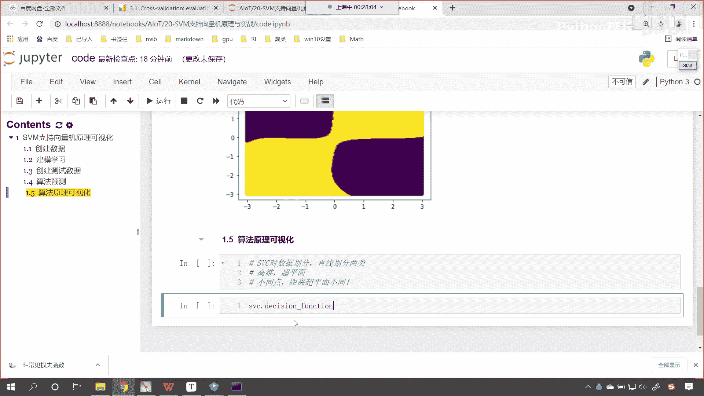

这个参数是干嘛用的，evaluates the decision，evaluate就是计算计算，咱们的decision就是距离from the samples in x，看到了吧，它呢就是计算距离的。

那我们就算一下距离，咱把距离画出来，这个时候就是x test，那我们就会得到一个距离地，那么我们有多少个数据，咱们是不是就有多少个距离呀，咱们现在呢有36000个距离。

那这些距离我给你看一下它长什么样啊，你看一执行，大家看这就是算出来的距离，那这个距离呢我给你查一下啊，它的最大值是多少，你看我一执行2。98，那距离的最小值是多少，me，你看我一直行是负的3。38。

唉这个距离为什么会有正负呢，你想一下这个距离为什么会有正和负呢，是不是因为咱们的这个超平面，把咱们的数据分成了上和下呀对吧，如果我们把上面的距离当成正，那么我们为了区分下面的这些点儿。

到咱们超平面的距离是不是就是负的呀，哎所以说它有正负之分啊，好有了距离，接下来咱们就绘制图吧，那就是p t。counter，看啊咱们就调用c o n counter f，那这个是什么呢。

这个呢是咱们的轮廓面，我们也把它叫做等高线啊，这个叫什么，这个叫做轮廓，你看这叫做轮廓嗯，我们先画轮廓线吧，咱们调用一个counter，那咱们把数据放进去x1 x1 ，然后呢x2 。

接下来呢咱把距离放进去，那就是d这个时候这个d是一维的，而咱们的x1 x2 ，是不是咱们上面my是grade生成的呀，它的形状是什么样的形状呀，我们刚才也打印输出了，他是不是200和180呀。

而咱们的d呢，你看一执行这个时候就报错了，因为这个形状不对啊，看到了input z must be 2 d，咱们得到的是1d，那怎么办，是不是reshape形状改变呀。

这个时候咱们点r e s h a p e reshape，给一个200，给一个180，这个时候你看过一执行，啊这个弄反了，是不是x是100和280，那我们调整一下啊，那就是180，后面这个是200。

这个时候你看过一执行，现在你就能够发现这一三象限和二四象限，你看它的颜色是不一样的啊，我们尺寸给它调整成方形的p l t一点figure，咱们呢给他来一个figure size，我们让它是六和六。

现在你就能够看到嗯，大家来看啊，你看我们一三象限的看到了吧，这个一三象限的中心看到了吧，颜色是不是一样的呀，那颜色一样说明什么问题，我们把这个叫什么，我们把这个叫等高线哈。

那你就能够发现这个等高线看到了吧，如果等高线颜色一样，说明什么，说明它们的距离相同，知道吧，距离相同，这就说明你看到了吗，一三象限是不是就被划归到一类了，这个二四象限你看它的颜色是相同的，你有没有发现。

咱们越靠近咱们的这个零点的时候，那我们就发现这个颜色是不是很接近呀，看到了吧，在零这，你看它的上边和下边颜色是不是比较接近，看到了吧，嗯你知道为什么颜色接近吗，因为边界的地方是不是分不开呀，分不开的话。

你的颜色就接近，也就是说我们能够把样本给它分开，咱们距离超平面是不是越远，那它是不是就越能够划分得开啊对吧，交界处是吧，它的颜色就类似了哈，好大家看这个是咱们的轮廓线，接下来我们把这个代码复制一下。

咱们在这来一个粘贴，我们counter来一个f，那这个线呢它就变成轮廓面了啊，你看我一直行。

来，各位小伙伴，你就能够看到，这回是不是就看得更加清楚和明白了，看到了吧，那我们就是就是这一块儿是吧，看到了黄色这个区域和这和这个黄色区域，它们呢是一类嗯，距离等高面呢唉也是相同的，那这个紫紫色的是吧。

也是一类好，那么我们现在呢你要想象一下是吧，咱们黄色是向上凸起来的，咱们这个黑色呢是向下凹进去的。

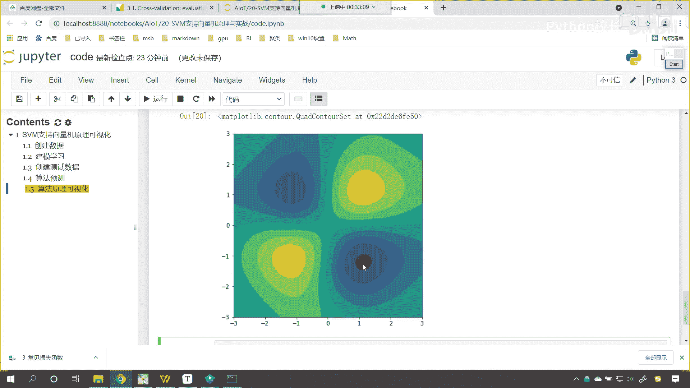

因为距离不是有正有负吗，那平那这个超平面，我们就认为是咱们这个现在这个面是吧。

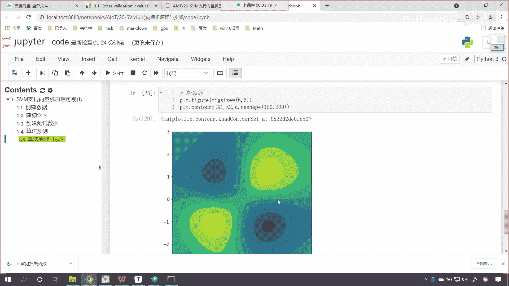

那一个就是凸起来，另一个就是凹进去的，那我们在平面上不好演示。

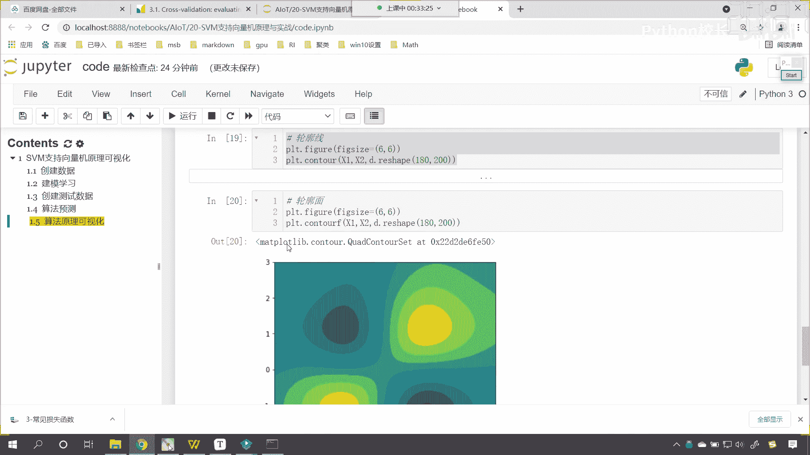

接下来咱们画一个三维的哈，来一个四级标题，那这个呢就是3d显示，3d显示咱们的距离好，那么这个时候呢嗯咱们就p l t点，我们设置一下它的尺寸，plt。figure。

这个当中呢咱们给一个figure size，12和九，然后呢prt一点sub plot，在这个当中呢我们给一个一行一列第一个，然后呢给他一个projection，projection就表示项目。

那我们用3d来绘制，那么我们就会得到一个子视图，这个时候你看过一执行，看到一个三维的是不是就出来了，然后呢我们就调用axis，咱们就调用它的current f这个方法。

那你想此时我们是不是就可以绘制面了，x一放进去，x2 放进去，d放进去，d就是咱们的距离来一个reshape，那么我们呢就给他一个这个180 200，然后呢你看我一执行诶。

现在你有没有发现咱们黄色的是不是向上凸的。

咱们这个紫色的是不是向下凸的。

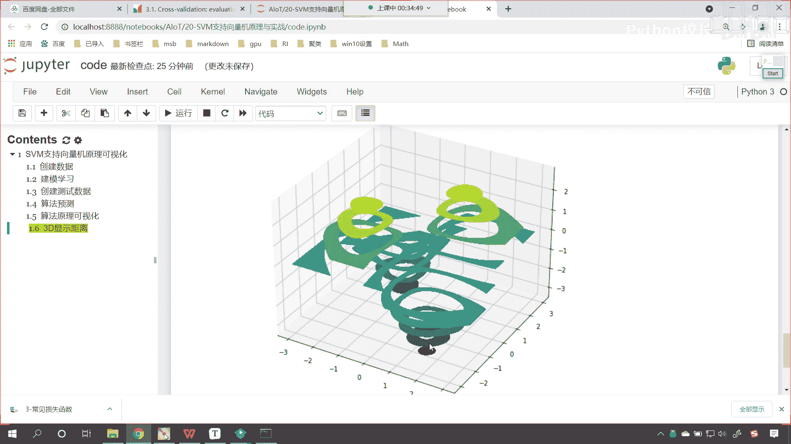

那我们调整一下它的视角啊，咱们给一个40。

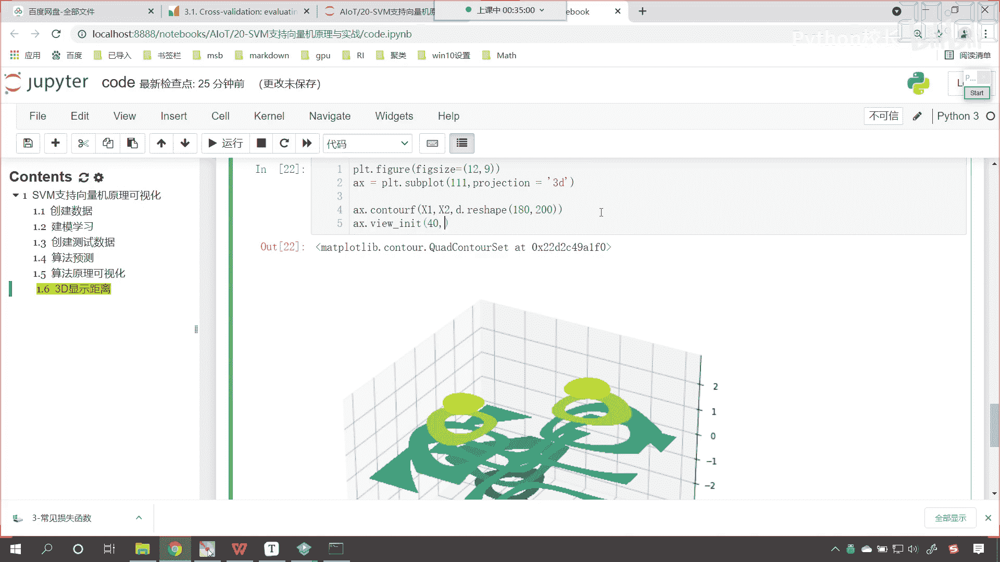

咱们给一个-60，这个时候你看过一执行哎，现在你来看啊。

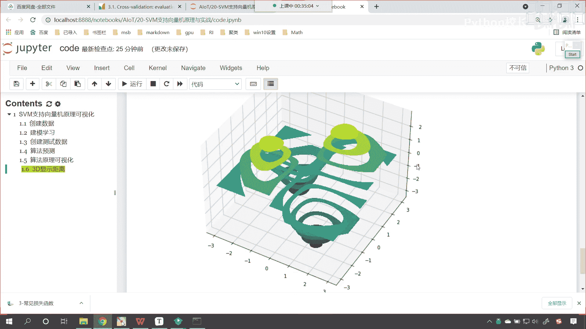

那这些数值都可以调啊，比如说我们给一个50嗯。

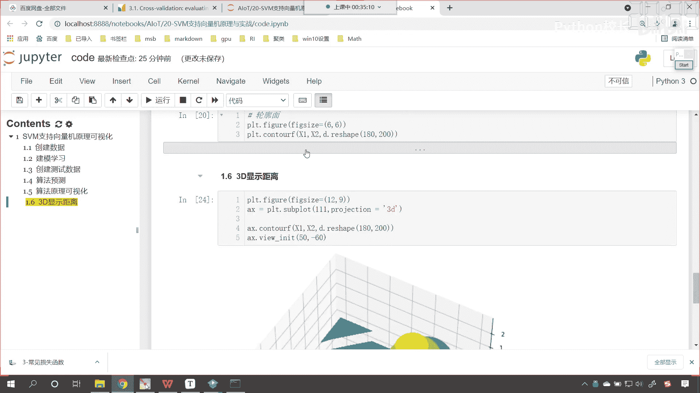

现在你来看你能够看出来通过这个立体的图形。

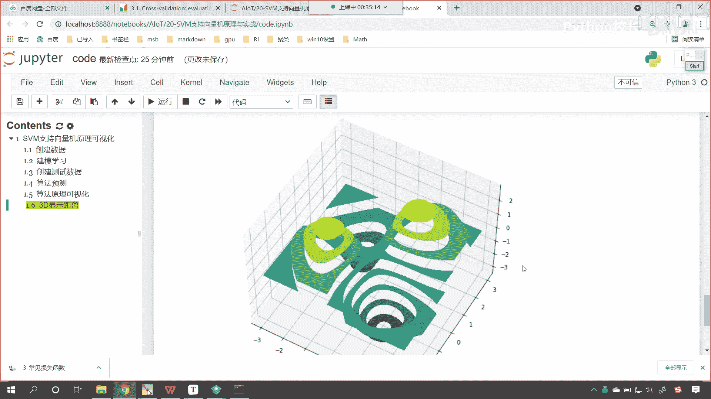

你能够看出来一三象限是不是被抬起来了呀，这二四象限是不是被降下去了呀，对不对，那么我们这个分离超平面是不是就在中间呀，看到了吧，咱们的分离超平面就在中间，所以通过咱们这个画图看。

通过咱们这个画图，你现在明白，那么我们支持向量机是如何将咱们平面上，这个数据给它分开了吧，看了吧，因为我们所创建的数据是x，目标值是y，你现在能够看到，你看你现在能够看到，它其实是在一个平面当中呢。

对不对，那在平面当中的，你想如果想要把它分开，你看这怎么分呀，我们一条线肯定分不开，看到了吧，线性的，你看你这样分能行吗，左边是一类，右边是一类，不能行，对不对呀，你无论怎么画，你都分不开。

那这个支持向量机它是怎么办的呢，它通过它的各种各样的核函数，想通过它各种各样的核函数，其实是将咱们的数据进行了一个变化，将咱们的数据呢进行了一个升维，那为什么咱们黄色的点儿。

为什么咱们黄色的点它跑到上面了呢。

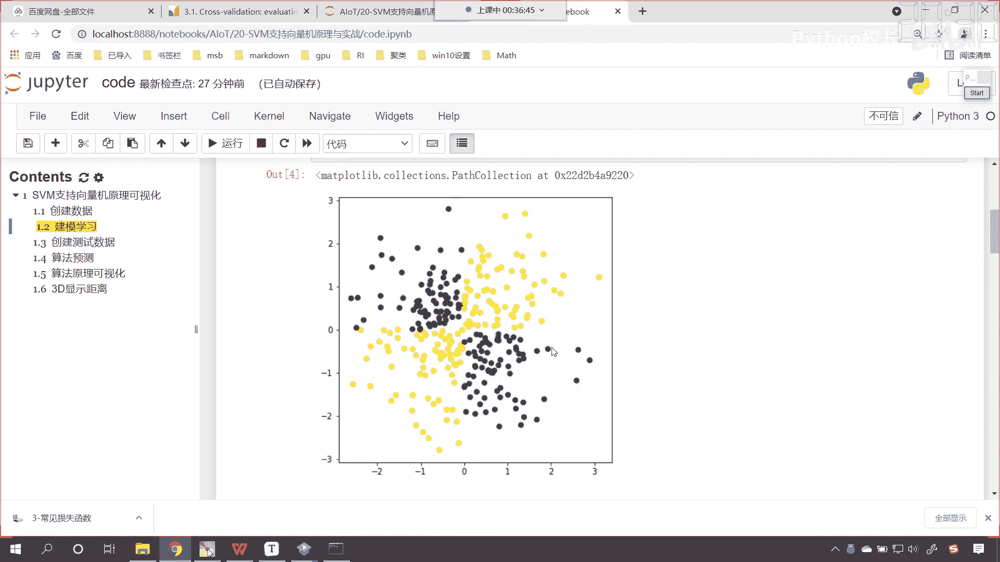

你想一下为什么黄色的点儿跑到上面了呢，看到了为啥他跑到上面了，是不是因为一三象限的数据相乘，它是一个正数呀，所以它是不是就跑到上面了，二四象限的数据相乘是不是一个负数，它是不是就向下凹进去了呀。

这个就是咱们可视化的一个原理啊。

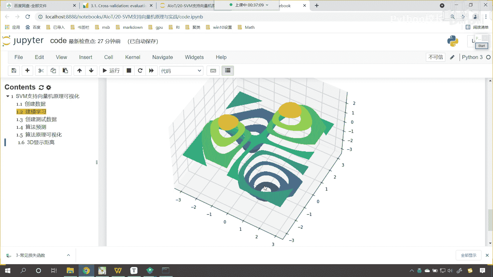

大家现在明白了吗，看明白咱们图形的，是不是知道咱们这个知识向量机。

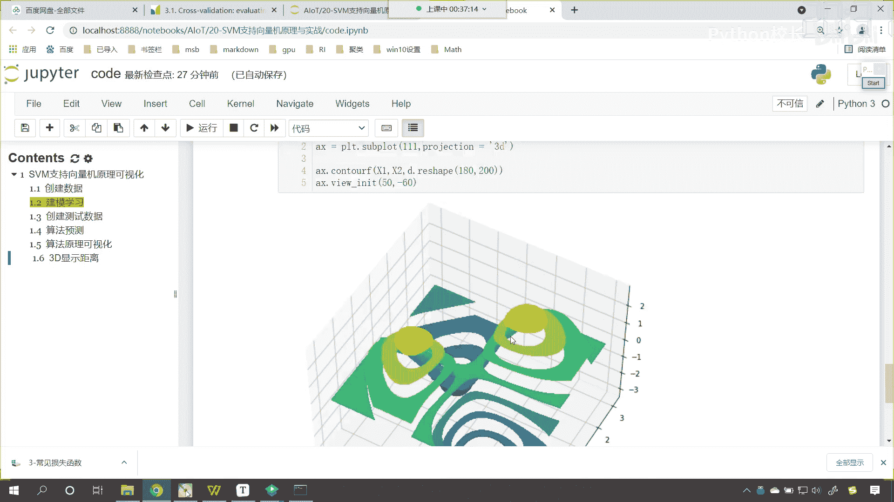

如何将咱们这些点划分成了两类的。

