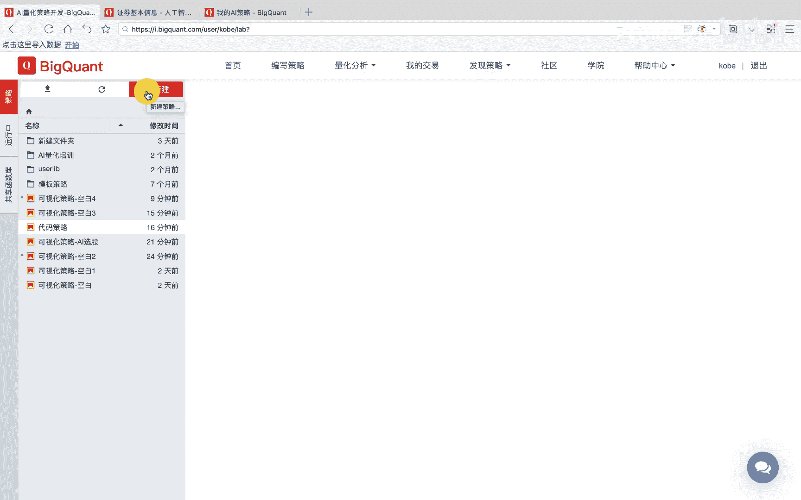
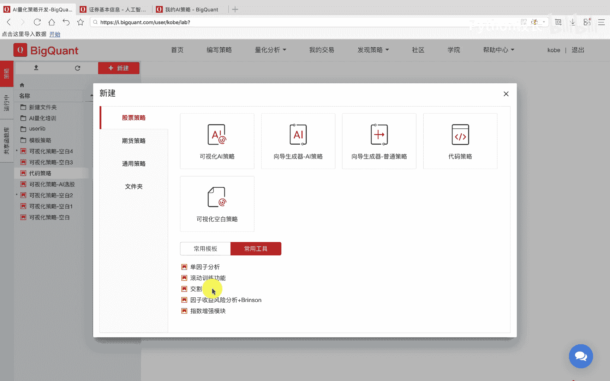
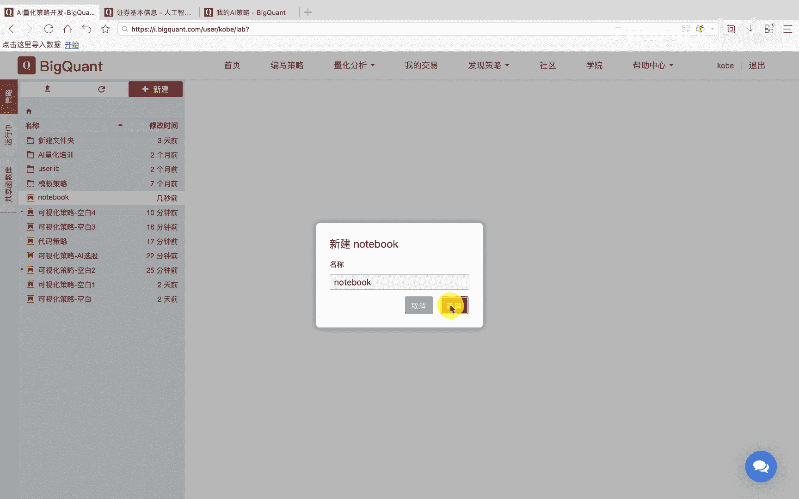
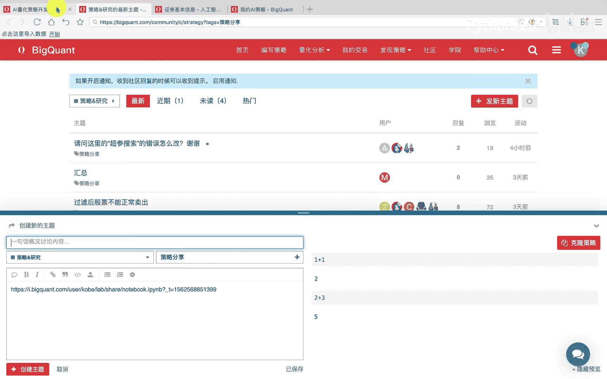

# P13：2.2.2-BigStudio及notebook实操 - 程序大本营 - BV1KL411z7WA

最后我们点击编写策略按钮，进入策略开发环境，绕编写策略环境后，我们可以看到左侧有三个导航栏，我们点击策略导航栏，可以看到我们自己的策略文件夹列表，我们可以通过点击上传文件。

来实现自有ipad文件或是csv数据文件的上传，我们也可以右键一个文件点击下载，实现策略或者数据文件的下载，我们还可以进行对某一个文件的复制粘贴，剪切删除等操作，以及重命名和克隆。

克隆即代表着复制和粘贴，我们可以通过点击刷新文件夹列表，来实现该文件夹的刷新，右侧的新建按钮，我们可以实现策略或是文件夹的新建，我们点击该按钮。

可以看到，我们可以创建一个股票策略，期货策略，通用策略或创建一个文件夹，我们点击测股票策略，可以看到这里提供了很多的策略模板，例如可视化ai策略向导是生成器代码策略，可视化空白策略等。

下方提供了常见的策略模板，以及常用的策略工具，例如单因子分析，交割单分析等，这里我们首先点击通用策略。

新建一个空白的notebook，我们点击新建，这里我们保持该策略的该notebook的名称为notebook。

新建后，我们可以看到在notebook中，代码excel单元的最小单位进行存储和管理，我们可以通过点击这个cell，可以看到上方提供了向上插入或向下插入单元，以及删除单元，剪切单元。

复制和粘贴单元以及上下移动单元，这些功能按钮，我们在单元中填入所需要执行的代码，例如，我们输入1+1，点击control和回车按钮，或点击右侧的运行按钮，此时服务器会在后台进行运行代码，并返回运行结果。

可以看到返回了一个运行结果为二，我们可以在不同的cell单元中输入不同的代码，并点击运行全部按钮，可以看到，平台会依次运行从上到下的cell，并返回对应的结果，我们可以通过点击保存按钮。

对guy notebook文件进行保存，当我们运行中，也可以选择终止按钮，来终止某一个cell单元的运行，点击重启内核按钮，可以实现策略的中断和重启动，点击克隆策略。

可以实现notebook的复制和粘贴，点击右侧的策略链接，可以查看到该策略的链接，我们可以复制该链接，并在社区中发帖，将我们的策略发布到社区平台上，此外我们可以点击分享按钮。

