# P132：6-SVM支持向量机网格搜索参数优化 - 程序大本营 - BV1KL411z7WA

好那么刚才呢我们看了一大段的这个代码，接下来呢我们就看一下咱们的应用好不好，来，现在呢咱们就回到代码当中。

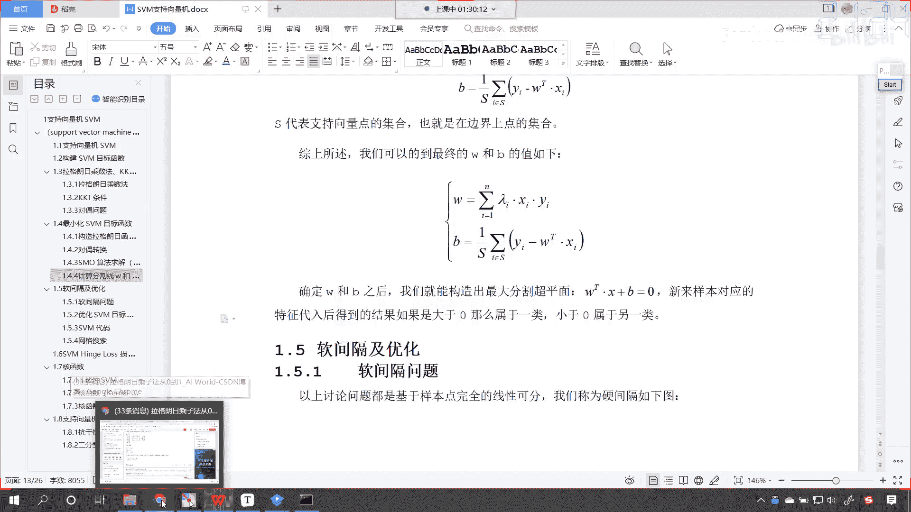

好那么我们把这个该合起来的给它合起来，在下面呢咱们给它插一个，插入一行好，那么插入一行上面的这个呢。

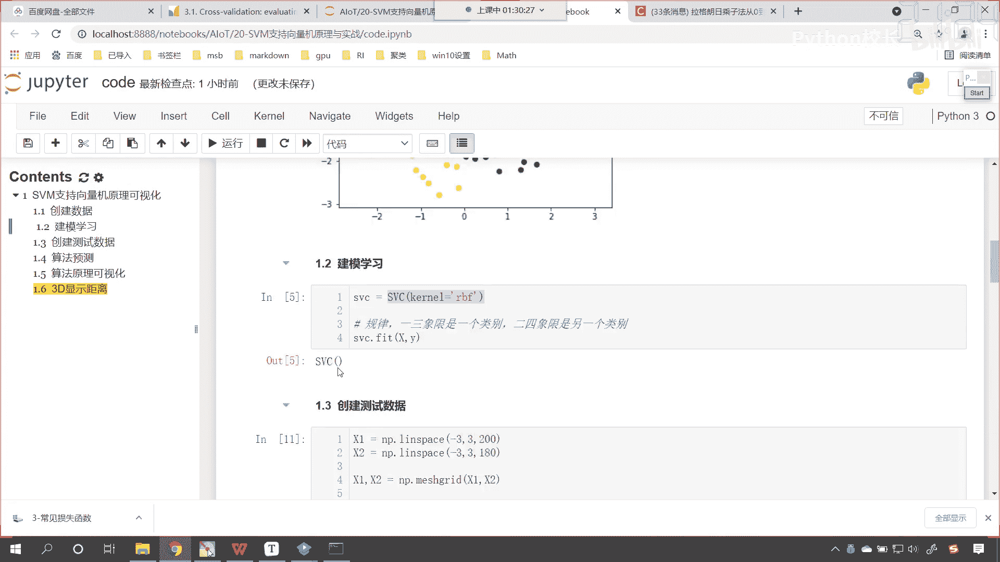

咱们就可以关闭掉了啊，哎一关闭全关闭了是吧。

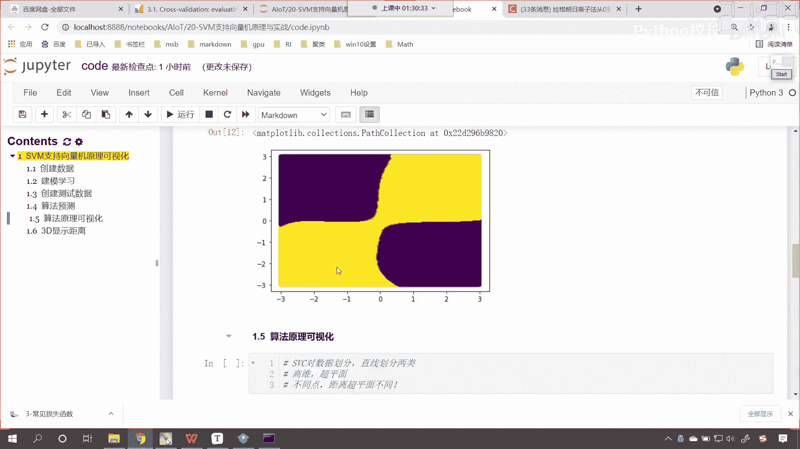

我们往下滑，咱们再来一个三级标题好，那么嗯接下来呢我们就看一下咱们这个s v，s v c它的参数优化，那我们就看一下参数优化好，那么，现在呢我们就使用咱们这个数据啊。

好那么咱们当前目录下有两个文件，一个是测试数据。

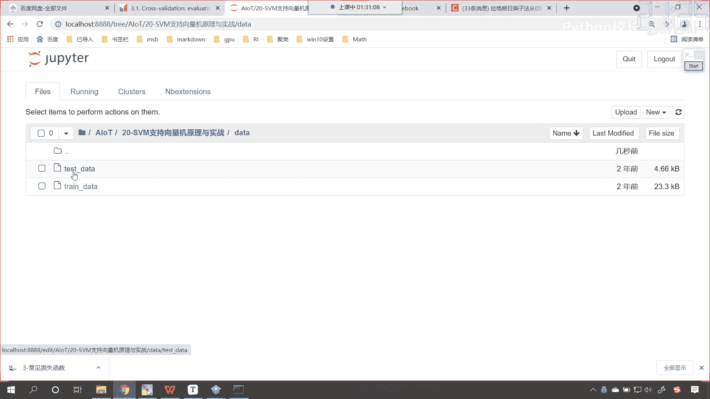

另一个是训练数据，那么现在呢咱们先把数据给它加载进来。

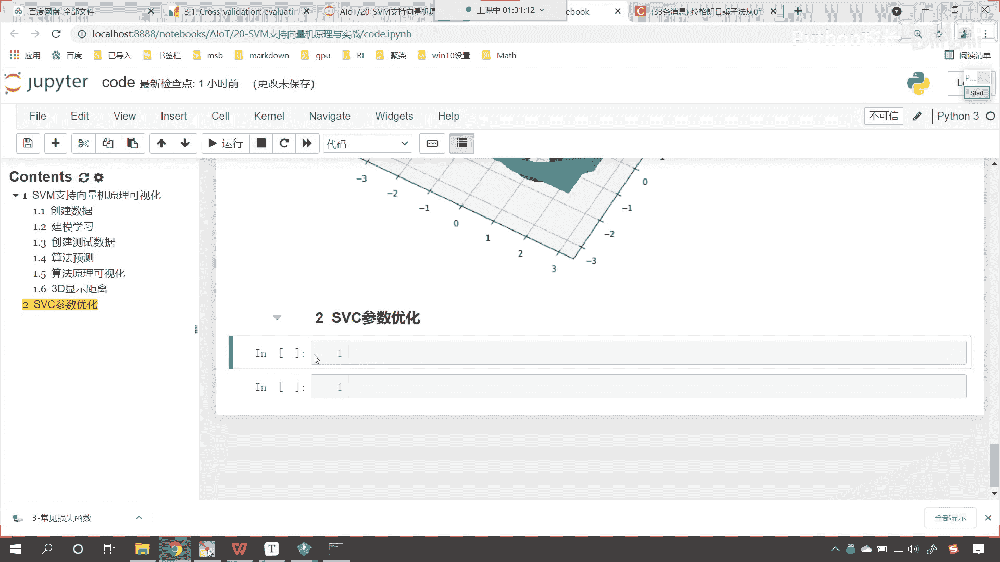

咱们的数据呢这个时候呢我们就得需要啊，这个时候呢咱们就得需要这个写一个方法，这个方法呢这个用来嗯加载咱们的数据，并且返回好，那么我们各位小伙伴，大家呢就复制一下就可以了。

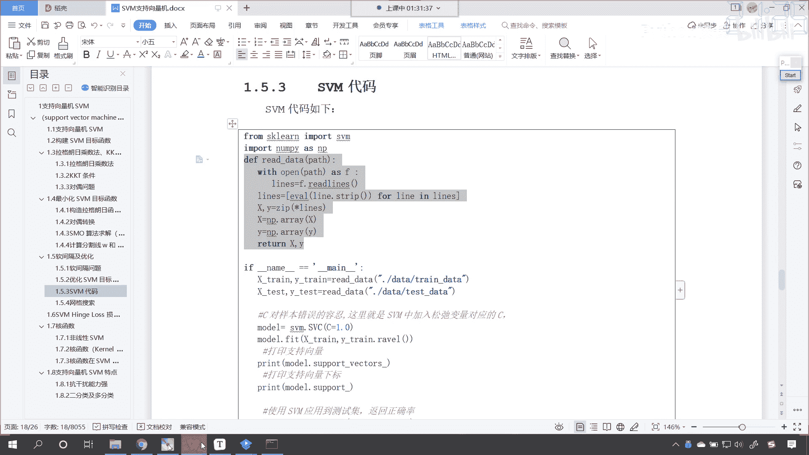

来回到咱们的代码当中，首先呢我们导一下包，咱们import numpy as np from sk learn s vm，咱们import svc执行一下代码，然后呢我们就定义一个函数。

那么这个函数的作用呢，啊这个函数的作用它呢就是获取里面的数据，现在你能够发现，咱们这个里边是不是有很多都是红色的呀，我告诉你为什么啊，选中他shift tab，咱们给他来一个缩进。

然后呢这个line这一行是吧，也给他来一个shift tab缩进，这个之所以它会飘红，就是因为它缩进的这个不太标准，那么我们选中再来一个tab，你看统一是不是缩进了。

然后这个line第三行呢它是在位置里边儿，咱们也来一个缩进，那对于这个方法咱们进行一个介绍，这个方法呢就是读取数据，那我们只要给他传一个文件的路径，咱们使用open python当中的这个io操作。

把这个文件内容打开，你这个文件里面的内容，无论是什么是吧。

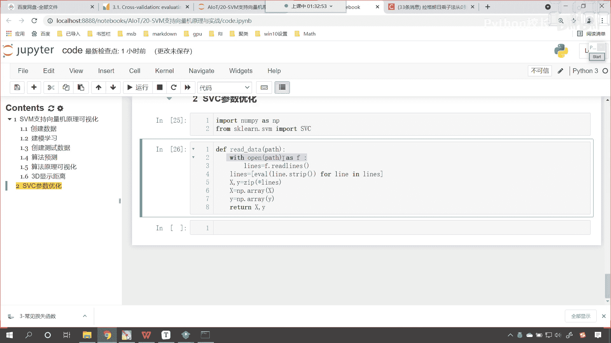

无论是图片也好，还是文本也好，还是你没有后缀也好，你看咱们给的这个txt data，train data是不是没有后缀呀。

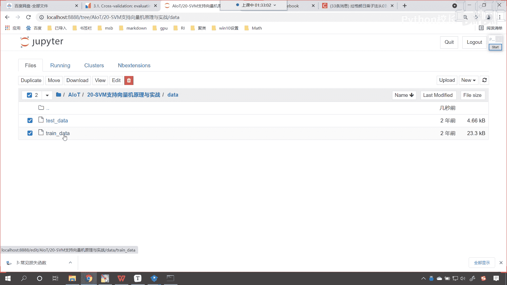

你看我能不能打开啊，默认情况下咱们是使用什么打开的呀。

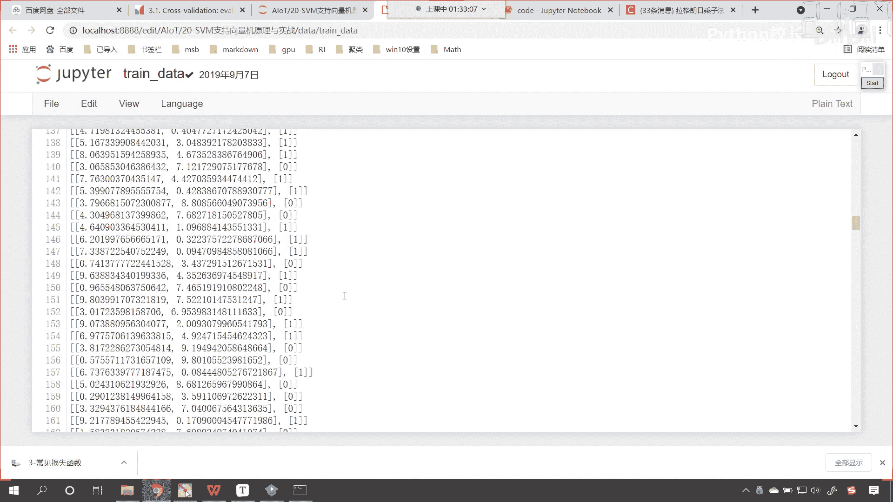

看默认情况下，我们是不是使用咱们的txt就把它打开了。

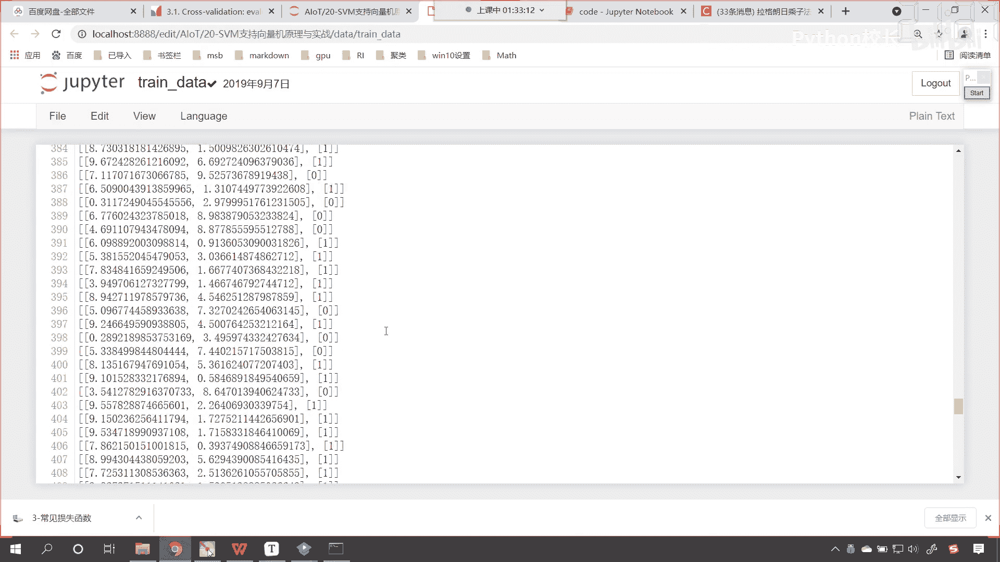

它也是可以打开的，打开之后你看我们这个是不是对应的数据啊，这最后一列是它的目标值，知道吗，最后一列是它的目标值，那么它的数据是一行一行的。

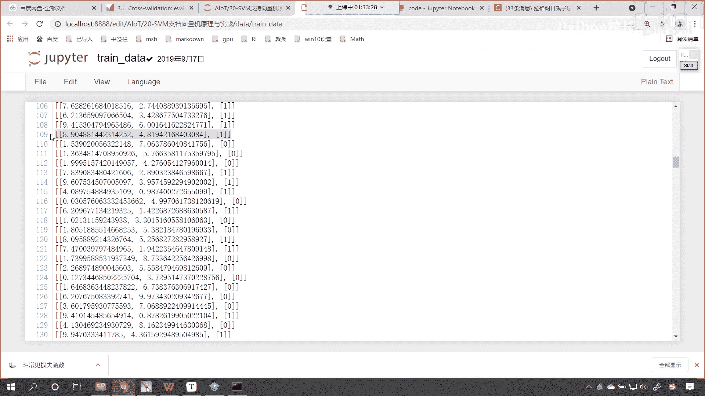

看到了吧，一行代表一个样本，一行代表一个样本，所以我们就要把他所有的行给它，怎么样呀，给它读取进来，这个读取进来之后呢，咱们就列表生成式啊，列表生成式，那有了这个列表生成式之后呢。

咱们将他将他的这个line呢，给它进行一个这个strip，就是把它的左右两边的这个空格，我们给它去掉，去掉之后呢，咱们来一个这个zip啊，来一个zip，这个时候咱们就批量的取出x和y了。

取出x和y之后呢，咱们将这个数据给它转换成南派数组，下面这个你看它就简单了啊，下面这个它就简单了好，那么现在呢我们执行一下，这个时候你看它就不飘红了，复制一下。

这个呢是咱们python基础当中相应的知识点，大家嗯这个如果要不明白是吧，那我们看一看咱们的python基础哈，来现在咱们就调用这个方法，咱们将当前目录下有一个data data。

下面有一个train是吧，咱们就获取train这个文件，那么我们得到的数据咱们接收一下就叫x tra，然后目标值呢我们就叫外传好，这个时候我执行一下这个代码，现在呢我给你看一下咱们数据是什么样的啊。

咱们display一下嗯，这个时候我们看一下咱们x穿点ship是吧，它是500个数据，那我们的目标之外呢，调用np。uni q，我们将y train放进去嗯，这个时候你就能够看到它是零一。

是不是就分两类呀，那训练数据得到了，咱们接下来read data，点反斜杠贝塔，下面再来一个反斜杠test data，这个就是咱们的测试数据，那就是x test y下划线test，这个时候我执行一下。

咱们对它进行一个输出，看一下咱们的x test它是多少数据。

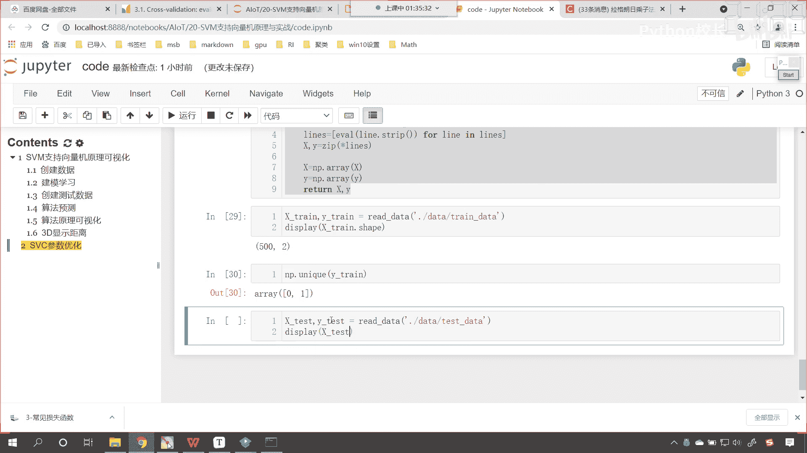

它是100个，对不对呀，那么我们就用咱们的这个声明。

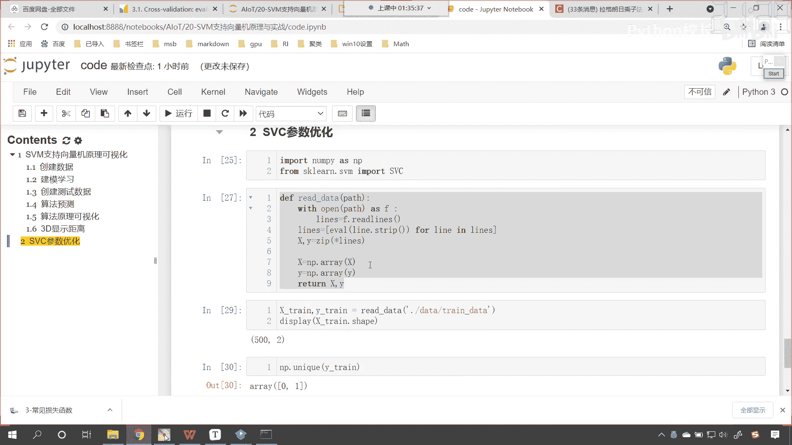

咱们的算法s vc就等于s v c是吧，声明算法之后呢，咱们就s v c。feat x下划线串y下划线串，那么s vc点死sc咱们x下划线test y下划线test，咱们看一下哎，大家现在就能够看到。

你看我们的准确率是不是一下子就到一点了，看到了吧，这个准确率一下子就到一点了啊，这是不是说明它很好呀，看到了吧，准确率一下子就到一点了，现在我们就能够发现，你看又告诉我们什么，是不是又有一个粉红色的呀。

该怎么办，咱们家这个外衬呢对它进行ril啊，那这个revel了，test呢也得ril唉，执行现在你看准确率很高，是不是一点，也就是说100个数据，咱们是不是全部给猜对了呀，对不对好，那么那你全部猜对了。

这个时候，你想我们还需要优化咱们的这个参数吗，那我们里边呢有一个参数叫c，这个c呢就是咱们的惩罚项，默认情况下它是一点，看默认情况下这个乘方像是一点，还有咱们的这个kernel呢，它是r b f。

我们知道这些值是不是都可以调整呀，对不对，你看这些值都是可以调整的啊，那么假如说我这个c给个十，你看一下会怎么样是吧，他依然是一点，那假如说我这个c呢给一个0。001，咱们看一下唉。

现在你就发现你就能够看到，你看这个时候得到的结果是不是0。56呀，那么在这里呢咱们就默认情况下是一看到了吧，得到的结果是不是一点，那我们呢给他一个合适的c，同时呢咱们看一下它的这个kernel。

看r b f，那我给一个linear行不行呢，你看我一执行给linear行，咱们给一个polly呢，看一下行不行，也可以，咱们给一个sigmoid，我们看一下嗯，这个sig少一个g是吧，执行一下。

看sigmoid得到的结果是不是就是0。83，对不对好，那么sigmoid的情况下，我们给个十呢，0。82是不是啊，那我们给一个四呢，0。81，咱们调小零点点一呢，看这个时候是不是0。98呀。

看现在这样啊，看我们这样来操作，你看给他，我们现在呢给他指明它的核函数是sigmid，那么我们给c多少，他的分数比较高呢，这个是不是就是一个问题啊，那我们现在呢，对于对于咱们的参数进行一个优化。

我们导一下包，这个时候呢就from sklearn，嗯嗯咱们就从model selection当中，咱们选一个叫grade search cv，这个grade search就有网格搜索。

这个cv呢就有交叉验证，好，那么我们就声明咱们的这个这个jc啊，叫grade search cv，这啥是网格搜索呢，当我们想要呃，想要搜索他多个不同的参数的时候，咱们就可以使用网格搜索。

一个一个进行训练，一个一个进行验证好，那么这个great search咱们就声明了，第一个参数是estimator，那咱们就声明一个estimator，那这个estimator。

咱们是不是要找支持向量机当中，它的最优参数呀，我们是不是要找支持向量机当中，它的最优参数呀，所以我们就声明支持向量机，那我们把svc放进去，你知道咱们的svc当中，我们是不是给不同的c。

它的效果是不是不同，对不对，那这个c应该给多少呀，这个c是不是可以是0。1，是不是也可以是0。5，是不是还可以是一，是不是还可以十呀，它是不是有很多，你想我一个一个去写，是不是就比较麻烦呀。

那咱们现在怎么办，咱们就使用grade search cv，让它呢批量的从咱们的参数当中来找最优的，那great search cv，它的第二个参数它叫做parram grade啊。

它还有一个参数叫paragrade，那我们就给他一个parram grade，这些呢这个parram parram grade就是我们的参数，那么这个参数呢是以字典的形式呈现的。

那我们就声明一个params来一个字典，我们svc当中还有哪些参数呢，是不是有一个大写的c，大写的c就是它的乘法项嗯，它的大小可以影响我们的准确率，咱们现在呢我们给一个叫log space。

我们让他从-3，我们让它到三，我们把它分成这个，咱们把它分成50份，你知道你还记得log space这个函数吗，来我复制一下，在下面呢我给你演示一下啊。

你看一执行看咱们是不是生成这么多数据啊，到这儿之后你就有点看不懂了，是不是没关系啊，咱们现在呢把它变得简单一些啊。

比如说我给六个啊，嗯你看如果我要给六个的话，大家看咱们得到的这个结果是吧，最后依然也是嗯，我看看啊，因为我们的幂次是这个十的多少次幂，是不是啊，那么呃我们就嗯看啊，给五个看一下啊。

我们给七个呢嗯执行一下，哎现在你就能够发现，这个时候你看咱们这个log space，你就能够看出来它是不是怎么划分了呀，咱们打印输出呢设置一下啊，set print options super。

我们给他来一个true，这个时候你就能够看到log space，是怎么样的一个划分，它是不是一个等差数列呀，看到了吧，十倍十倍十倍十倍十倍十倍，是不是一个等差数列呀，你看因为我是从-3~3是吧。

那我给七它正好是吧，因为-3-2-10123正好是七个，那如果我要给更多呢啊，它是一个等比数列啊，刚才给说错了啊，等比数列你看我要给十个，这也是一个等比数列，是不是啊，所以咱们上面就从-3~3。

就是最小就是1‰，最大就是1000，咱把它分成多少份，50份，我们呢就让咱们的grade search cv去找，那现在呢咱们把parrom放进去，jc就有了，然后咱们jc。

feet x train训练数据放进去，测试数据呢就是y下划线test，那这个时候呢你看我一执行看一下，咱们这个外传y test，我们看一下某一个地方给报错了，是不是啊。

好我们看一下他报了一个什么样的错啊，found number five的位置，number of 5101000，那肯定是咱们数据不太对了啊，那现在呢我们看一下咱们的插入一行。

看一下咱们的x train它的形状是多少啊，sheep是吧，它是500和二，咱们的外派哦，我说呢看这个y是不是应该叫y train呀，对不对呀，咱们变量给写错了啊。

再来执行，现在你就发现这个时候是不是就没问题了，但是咱们现在发现，是不是有一堆粉红色的提示呀，还是因为这个外外圈没有进行这个ral啊。

咱们来一个ral，这个时候你看我一直想，现在你看是不是就没问题了，对不对，那么我们从这50个c当中。

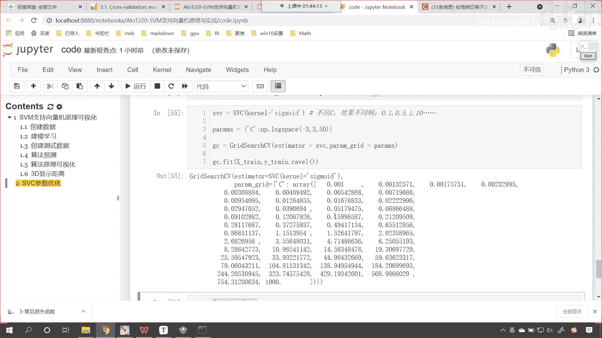

有没有选一个合适的来，咱们下面看一下，叫jc点，咱们best parrams，这个时候你就能够发现我们选的c是多少，是不是0。212呀。

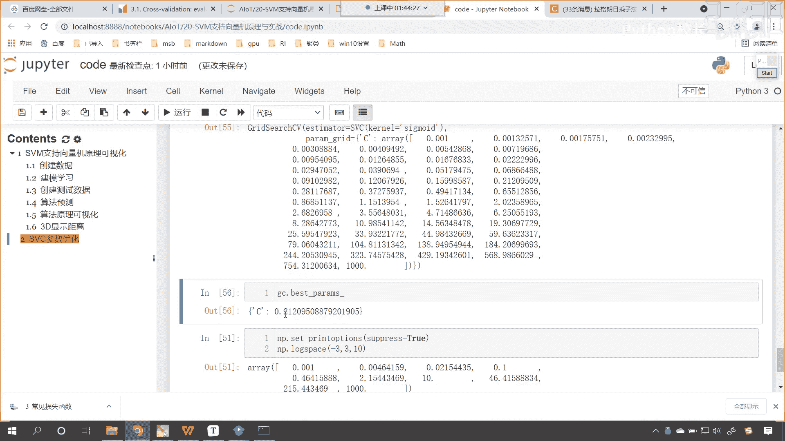

看到了吧，0。212，你想如果要是你选的话。

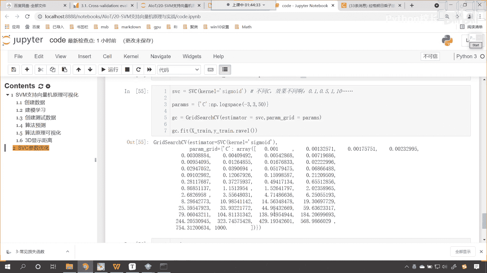

你是不是就得for循环一个一个找呀。

对不对，这个时候呢我们就使用jc，让它一次性快速的帮我们找到了。

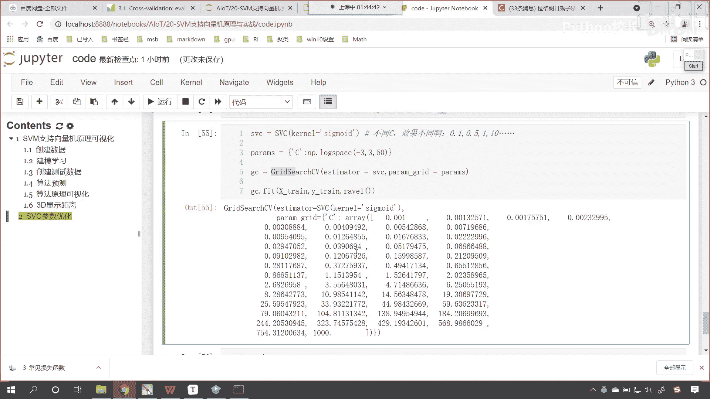

其实呢它里边也是进行了封装，也是进行了for循环，明白吗，好那么我们grade search cv当中还有一个参数叫cv，看我们说这个cv叫什么，grade search是不是叫做这个网格呀。

搜索cv呢叫交叉验证，默认情况下这个cv呢它是三，我们可以把它调整，咱们看一下这个cv默认值是多少啊，我们往下滑，各位小伙伴，你就能够看到看这个它是一个int类型的数值，是不是啊。

这个to use default 5，默认情况下是五，那么我们对它也进行一个讲解啊，这什么是交叉验证呢啊这什么是交叉验证呢，你看它也有一个说明，看这个cv叫什么啊。

看叫做cross validation，交叉验证，那这个五呢就表示五fold，fold呢就有折的意思，就有部分的意思，什么意思呀，来我们进入sk learn它的官方文档。

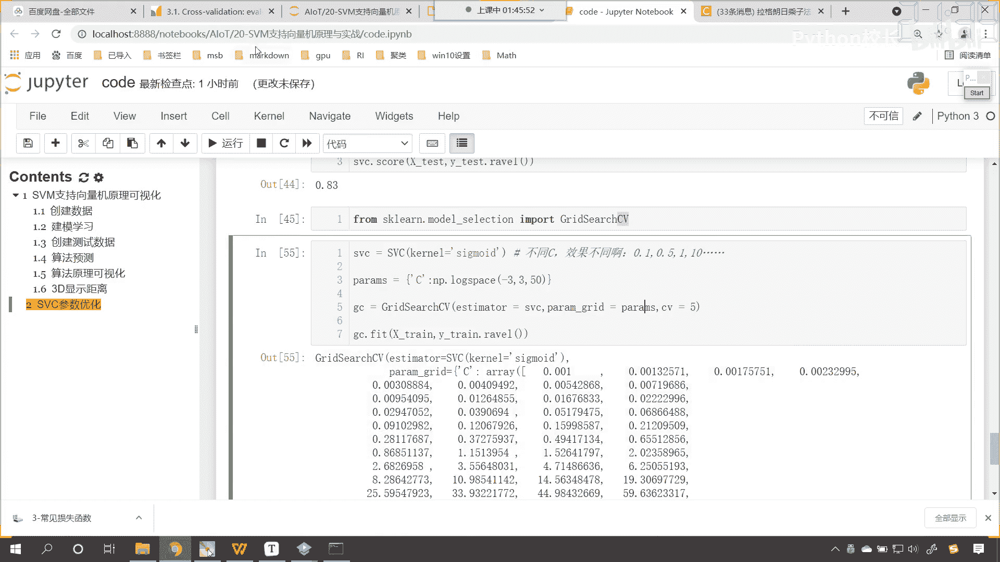

大家看啊，这个是sk learn的官方文档。

在这个里边就介绍了什么叫做key folder啊，什么叫做key folder呢，什么叫key folder，cross validation呢，我们将数据给它分成几份，看到了吧，folder 1。

folder 2，folder 3，是不是一直到folder 5，你如果k等于五，是不是就把数据分成五份啊，那分成五份怎么办，那么split 1，split 2，split 3，split 4。

split 5，咱们呢把其中的四份拿出来作为训练数据，留的一份作为咱们的预测数据，然后把第二份拿出来作为测试数据，剩下的作为训练啊，这个三呢作为咱们的测试，四作为测试五作为测试，最后我们求平均。

你想一下，如果我们要按照这种方式来对于数据进行操作，那么咱们算法，是不是就将所有的数据进行了训练，我们是不是也将所有的数据进行了测试呀，这个时候我们所求得的平均值，是不是更加准确呀对吧。

因为我全部对你进行了这个拆分是吧，folder 1，folder，二，folder 3，咱们都进行了，看到了吧，这是测试数据，这个绿色的就是训练数据是吧，那训练完一遍，所有的数据都进行了预测是吧。

那这个时候平均值是不是就更加稳呀，更加具有说明。

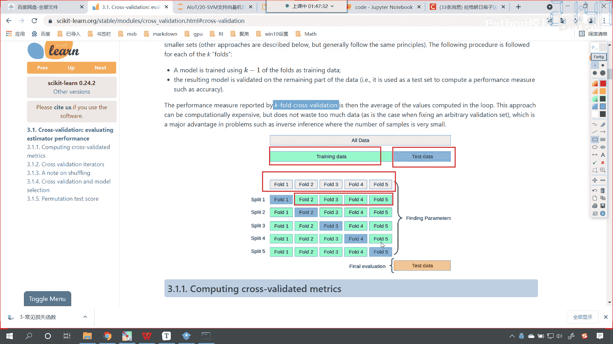

更加具有说服力啊，对不对，所以他是这样的啊，来的cv，现在你明白是怎么一回事了，来各位小伙伴，我们在直播间的小伙伴呢，如果你明白了cv表示什么，你呢就在讨论区里边扣一波666，好不好，好。

那么这就是咱们的cv啊，这个值你可以调明白吗，唉所以我们一执行是吧，那我们就得到了好，那么对于这个网格交叉呢，我们还可以再给一个参数啊，比如说咱们再给一个参数，好，比如说呢嗯咱们给一个tol。

看这个t l默认情况下是不是零点，0。001啊，咱们还可以逗号是吧，我们给一个tol，然后来一个冒号中括号，你看它是0。001逗号零点，咱们给一个0。01，然后呢我们给一个0。01，逗号再给一个0。

1是吧，逗号再给一个一，现在你就能够发现，你看我这个t o l是咱们的容忍度，也就是说咱们算法的精确度，我是不是给了一个两个三个四个，我是不是给了五个呀，看到了我给了五个啊，那么c它有多少个。

c它是不是有50个，那我这现在有两个参数我该怎么选呀，是不是得让这个c和这个t l，是不是得让他俩交叉呀，对不对，就是说你首先呢固定咱们的t o t o l，让它是0。001，然后从这50个当中是吧。

选最优的，然后再固定咱们的0。001，也让他选最优的，所有的这个参数，它们grade交叉以后，那我们找最优的看，我告诉你什么是格瑞的啊，看行行，啥是gay的，看一二，这个是不是就是gay呀。

你还记得咱们刚才在讲咱们数据可视化的时候，我们是不是有一个方法叫mesh grade。

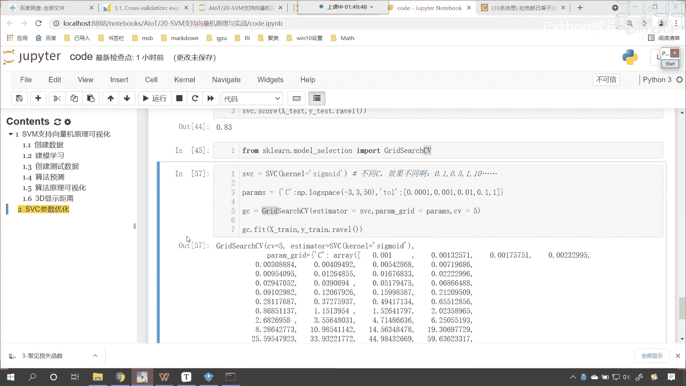

看到了吗，咱们有一个方法叫什么，是不是叫my是grade，这啥是grade，是不是就是行和列进行了一个交叉呀。

对不对，所以说呢咱们这个s v c数据可视化。

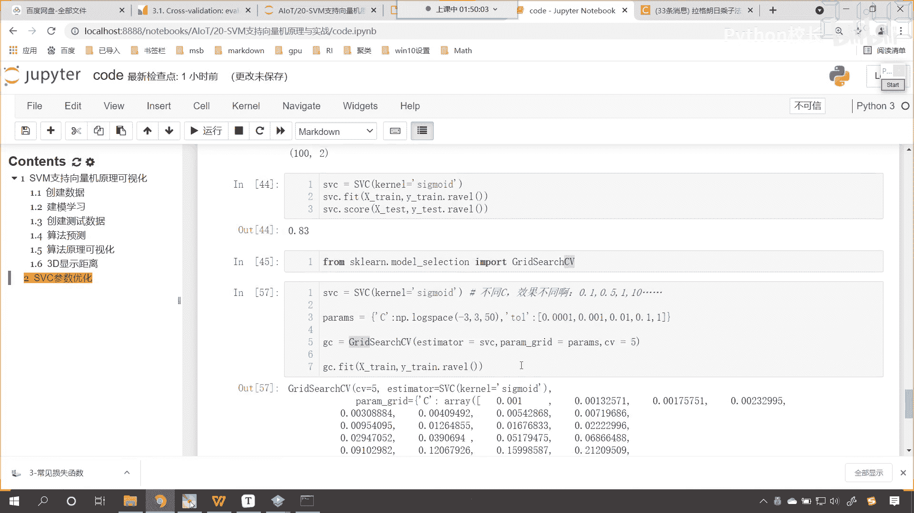

这是吧，我们如果要给t l是吧，他也他就是这么个意思啊，咱们现在呢看一下，我们这个代码运行花多长时间啊，看一下这个tol他筛选出来的这个数据是多少，现在呢我们是50个，后面是五个。

所以它要进行多少次迭代呢，250次迭代，那我这个代码呢非常强悍是吧，6。76。7秒就计算完成了，现在咱们再看最合适的这个嗯，最合适的这个参数看到了吧，现在是不是0。001，看到了0。001。

你知道默认情况下这个值是多少，我给你看一下默认情况下它是不是1‰啊，现在嗯我筛选出来的最优条件是多少，是不是0。001好，那么我们就可以直接使用jc点，咱们调用pray，咱们调用。

我们看一下筛选出来这个最优的这个算法，他的得分是多少啊，那就是x test y下划线test。ril，哎，不要忘了ravel r a v e l，这个时候你看我一执行0。98，看到了吧。

我们这个jc当中封装的这个s vc，是不是sigma的，我们刚才进行对比了，看到了吧，如果我们要不进行条件筛选，咱们不进行条件筛选，我们的准确率是多少，看是不是0。83，我们经过一顿操作猛如虎。

咱们进行了条件筛选筛选之后，那么它的分数是多少，0。98，这个是不是有一个大幅度的提升呀，如果你有更多的参数，那么你就在params当中去添加就行了，注意咱们这个c是随便写的吗。

我们这个tol我们是随便写的吗，当然不是，我们要调整支持向量机，它里边儿有哪些可以调整的参数，看这个c是啥意思是吧，这个c呢是咱们的往下看，c是咱们的一个正则化的一个一个参数啊，c是正则化的一个参数。

现在呢大家有这样的一个问题了是吧，那我们就接着这个问题。

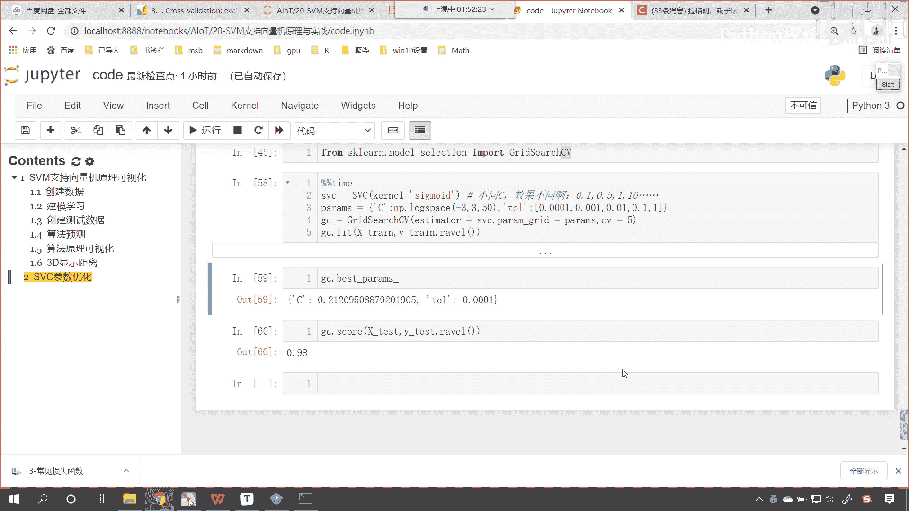