# P135：2-SVM支持向量机LFW数据建模与参数选择 - 程序大本营 - BV1KL411z7WA

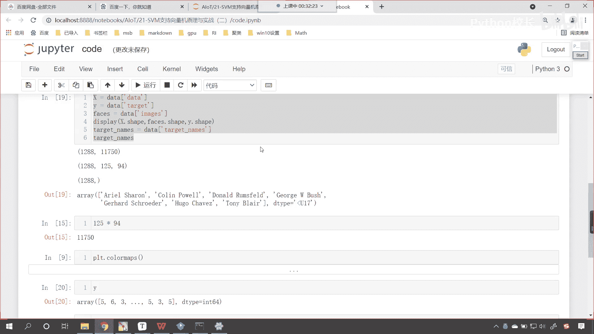

你看我们启动的这个代码当中，咱们是不是没有咱们的这个这个标题呀，那我们重新刷新一下啊，看啊重新刷新一下唉。

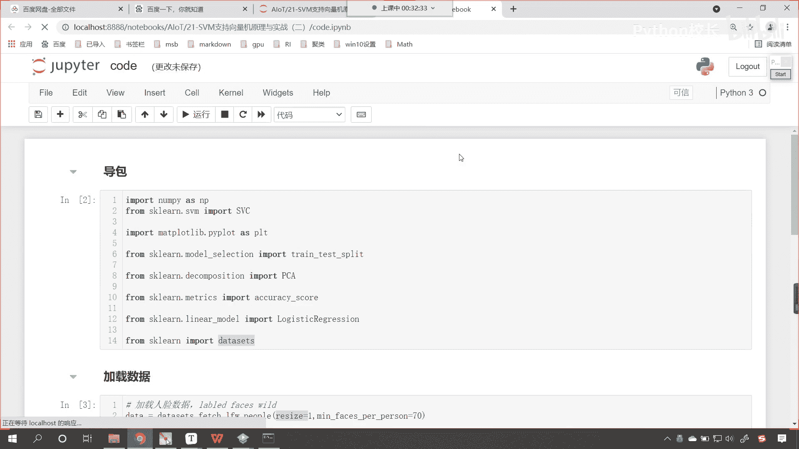

这个时候你看是不是就有了，我们点一下，这第一个呢是导包。

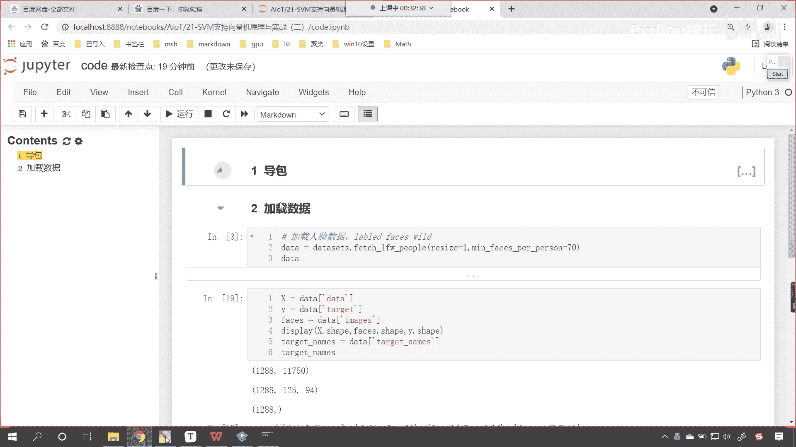

第二个呢是加载数据，是不是好，那么数据加载了，接下来我们继续啊，来接下来呢我们就进行，咱们就进行建模，好，那么建模的话咱们来一个s v c，那这个s v c呢大家看啊，咱们起名就叫s v c。

那啊我们呢给他一个c，那个c呢咱们给一点，咱们就使用s v c点我们feat一下，你想此时咱们的数据是不是还没有进行拆分呀，那我们直接在这个地方进行拆分。

咱们调用train test split x和y放进去，这是我们的数据，对不对，那有了这个数据之后呢，咱们现在呢就x下划线，train x下划线test，y下划线，train y下划线test。

那声明了这个模型之后呢，咱们就x下划线春y下划线串，然后呢我们看一下这个算法的准确率怎么样，咱们来一个sc，那就是x下划线test y下划线test，此时呢我们记录一下，咱们这个代码。

大概花多长时间就能训练完两个百分二time，那么它可以记录下面这四行代码花多长时间，此时我执行一下，咱们现在呢也都记一下十啊，他如果说要超过两分钟的话，那么我们就给它停下来啊。

你现在能够看到这个星号是不是一直在啊，对不对，好那么我们就有耐心等一分钟，现在在这个代码正在执行的过程当中，我呢轻轻的问你一个问题，你呢仔细的思考一下，为什么这个代码运行时间是吧。

为什么这个代码运行时间它会这个感觉挺长的，是不是啊，为什么他会比较长呢，你想一下，为什么咱们这段代码运行的时间比较长，那我们有小伙伴非常耿直的就回答了，说是计算能力，当然跟计算能力肯定是有一定关系是吧。

我的电脑性能是很强的啊，我的是i9 处理器，是不是艾灸啊，这可是艾灸是吧，一般我们的学生是吧，都没有我配置这么高啊，好那么我告诉你，为什么你想一下咱们的数据x是吧。

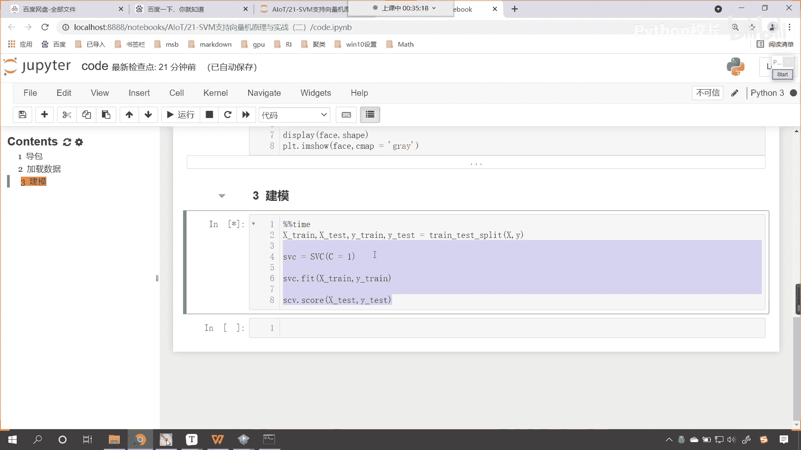

你想一下咱们的数据x，它是什么样的一个结构呀，1288个样本，对不对啊，1000啊，这是11750个，你知道这11750个它表示什么吗，你知道这个11750个表示什么吗，这个是不是表示咱们的特征呀。

对不对，你看啊，它呢就表示咱们的像素，这个像素呢也叫特征，所以说我们的像素特征这么多是吧，这就是造成咱们训练时间这么长的原因是吧，因为呢它的特征太多了，所以说呢这个训练时间就会很长。

之前我统计过这个时间呢，大概就得是十几分钟是吧，嗯所以说他大概得十几分钟。

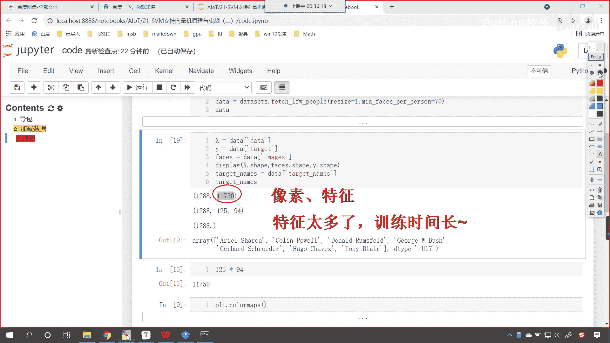

那你看现在还没结束，咱们怎么办，咱们给它暂停一下啊，你看我们给它中断一下啊，这个时候中断一下，好那么我们发现是吧，你看这个时候是不是就有点卡顿了，咱们点中断是不是也中断不了呀，那这个也没关系啊。

咱们选择这个kernel和函数是吧，我们把这个给他保存一下啊，咱们ko和函数restart and clear out，我们怎么样呀，把这个内核给它重启一下，咱们刚才介绍了这个代码。

如果要不进行处理和操作，那么他花的时间呢就太长了。

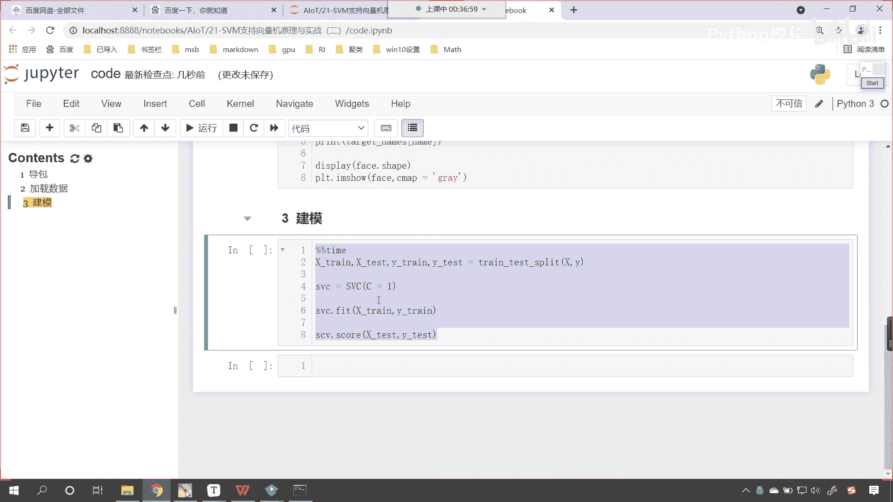

咱们怎么对这个数据进行处理呢，你往上看，你看我在导包的时候，我导了一个什么呀，我是不是导了一个pca呀对吧，这个pc咱们之前就用到过，那我把所有的都清空了，这个那这个代码呢咱们就重新执行一下，看。

那我执行代码呢我可以怎样呀。

执行代码我可以选择save save里边有一个run 2，那这个run 2呢。

它可以一次性将上面所有的代码全部执行出来，哎那么我们刚才呢就走了这样的一个捷径啊。

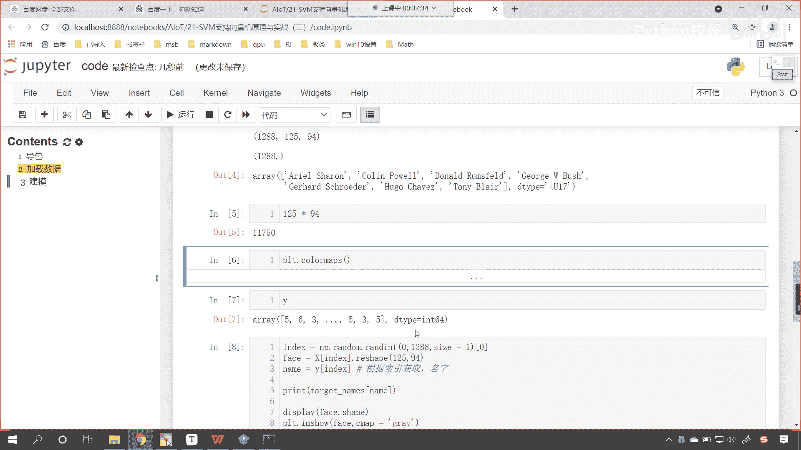

好那么接下来呢咱们继续啊。

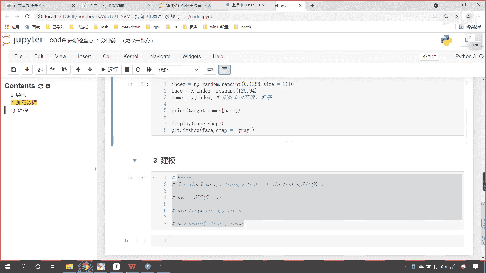

这个建模这个地方咱们使用原始数据，这就相当于走不通，对不对呀，好那么接下来呢我们进行数据，咱们要进行数据的一个降维了，那降维咱们就使用p c a，那我们就声明一个pca是吧。

然后呢这个pca咱们给多大权重呢，n components，咱们给0。95，那我们给0。95，然后呢pca点咱们调用fit transform，将咱们原来的数据我们给它放进去，原来的数据是x。

那么这个转换之后呢，咱们接收一下叫x下划线pca，那我们打印输出一下咱们这个数据啊，咱们display一下，先把我们原数据打印输出，然后呢咱们将降维之后的数据形状展示一下，此时呢我们运行一下啊。

那同样呢这个降维运算。

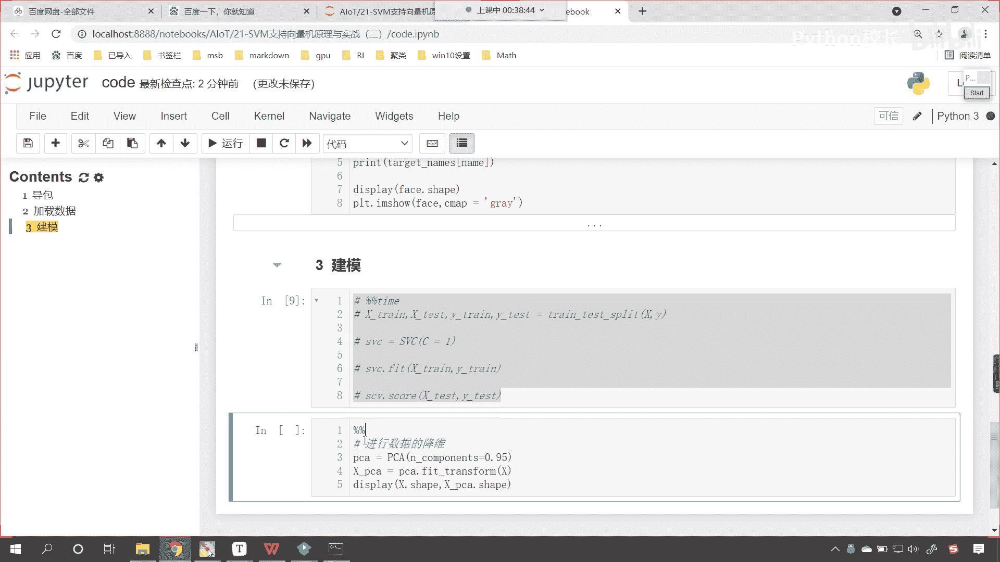

咱们也给他记录一下时间，两个百分号time，此时我执行这个它会花一点时间，但是呢它就不像上面那么长了，现在你就能够看到，你看咱们大概是不是用了六秒呀，这个数据是不是就搞定了。

你看现在你能够发现我降维之后是吧，我把重要性95%的是吧，全留下来了，也就是说我留下来这些，它的重要程度呢和原来相比，那你比如说原来这11750个，咱们假设说啊看它的这个特征重要性。

咱们假设说原来是100，那么我经过降维之后，它就变成了224，那咱们这个呢它的重要性就是95，所以你想我们从100变道95，这个是不是相当于主成分都还在呀，对不对，你看到了吧，主成分都还在。

但是呢我们的特征可是明显少了很多啊，啊看到了吧，这特征就少很多了，原来是11750个，现在就变成了224个是吧，那这个时候呢来咱们再来看一下咱们的这个嗯，这个数据的情况啊。

那我们把上面这个代码咱们复制一下，在这个地方呢咱们粘贴过来。

然后我们全选来一个ctrl加反斜杠，这个时候就解开了，那我们在进行数据拆分的时候，咱们呢就拆分咱们降维之后的数据，在这儿呢咱们使用一个说明啊，这个呢就是降维之后的数据啊，这就是降维之后的数据。

那我一执行这个代码，现在你来看他说这个s v c is not defined是吧，看一下是咱们第几行啊，看name s cv是吧，哦我明白了，看看看这个地方，咱们上面起的名字是不是都叫s v c啊。

这是不是不小心我们写成了s c v啊，这个就是嗯这个嗯嗯打字的时候给错了啊，来咱们再来执行一下这个代码，现在你就能够发现看看看看我运行时间是多长，是不是就是173ms对吧，咱们准确率是不是就是0。

79呀，比刚才是不是就快多了呀，快不快是吧，这比刚才就快多了啊，对吧好，那么现在呢还有一个问题，就是咱们这个这个模型是跑通了是吧，那么我们希望筛选合适的一个参数对吧。

我们希望这个参数呢给它筛选的合适一些，你看这个c咱们之前在课程当中讲到，他是不是就表示惩罚项呀对吧，那么他越大越怎么样。

看这个c越大越怎么样，好来回到咱们这个地方啊。

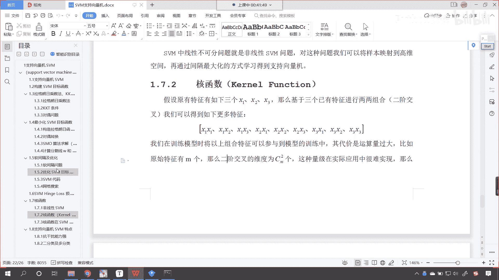

昨天我们在讲软间隔的时候，咱们这块是不是就有了一个c呀，看到了吧，其中c呢是一个大于零的常数嗯，那么我们这个c呢看它无穷大的时候，那咱们这个可c呢必然无穷小。

这样的话s v m就变成了一个完全线性可分的，s v m，那么它就会过拟合啊，就是说你这个c越大是吧，它就会过拟合，这个c越小，咱们的条件呢就越宽松，我们把这个叫惩罚项看啊。

这个c呢它是一个惩罚项，shift tab，咱们点开这个加号，你看往下滑，啥叫惩罚呢，看我们看一下啊，这个看the penalty，看到了吧。

the panel这个penalty这个英语单词它呢就有成就，有惩罚的意思，就有这个正则的意思，看他呢是一个regular来regular ization parameter，那么它的强度呢。

the strength of the regularization is inverse，proption to see，也就是说inverse有反比的意思，啥意思呀，也就是说你的c越大，惩罚就越小。

c越小，惩罚就越大，那惩罚越大是吧，那也就意味着。

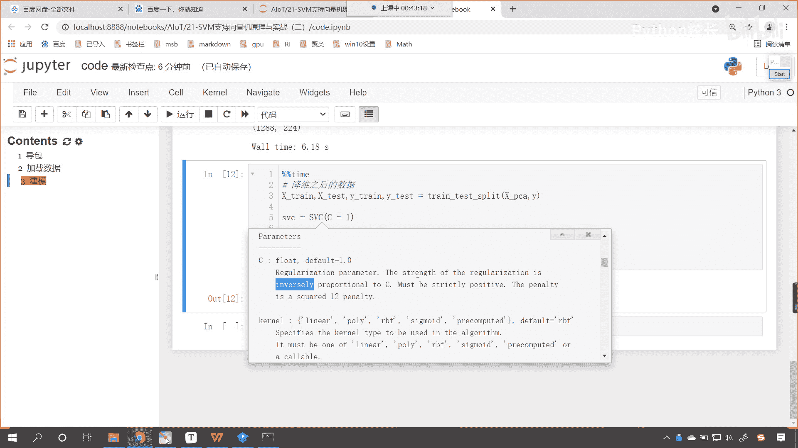

我们在进行这个数据划分的时候啊，咱们在进行数据划分的时候，那么我们呢就得照顾这些异常值，你看因为我们之前在课堂上讲了，这个软件歌是吧，软间隔，也就是说你两边的数据，你不可能通过这个一条线彻彻底底的分开。

那么我们眼睛里边儿就得能容得下沙子，宰相肚子里边就能盛得下船，这个算法也一样是吧，这个算法也一样，那么这个它呢也能够容忍一些错误的出现，那他的这个容忍错误的这个强度就是通过看。

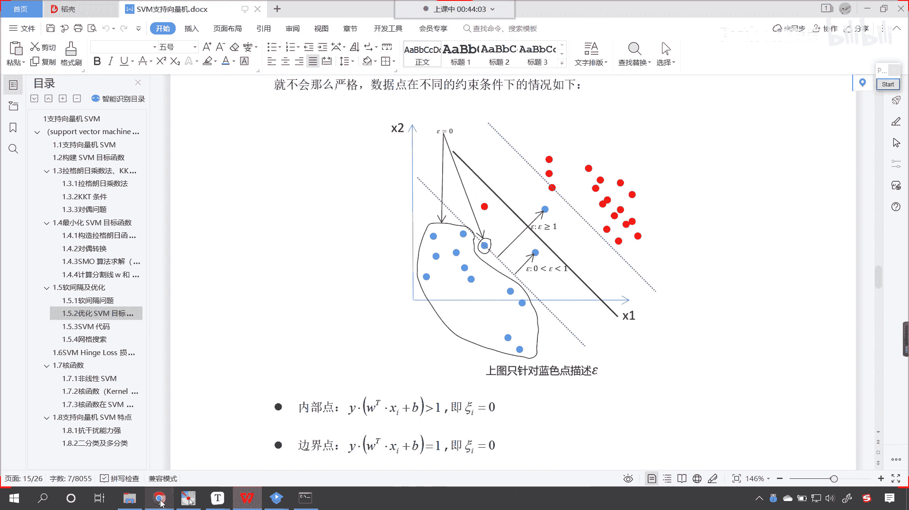

就是通过咱们这个参数c来这个体现的，那在这儿呢我们进行一个说明啊，看咱们的参数c呢，我们把它叫做惩罚项，那么它越大啊，它越大呢，它的这个容忍错误就会越小，你看容忍错误就会越小，那如果这个c越大。

你想他是不是就有这样的一个趋势啊，看啊这个c越大，它呢就有这样的趋势，他呢就会想方设法把我们的数据都给分开，看到了吧，他想方设法都要把这个数据分开。

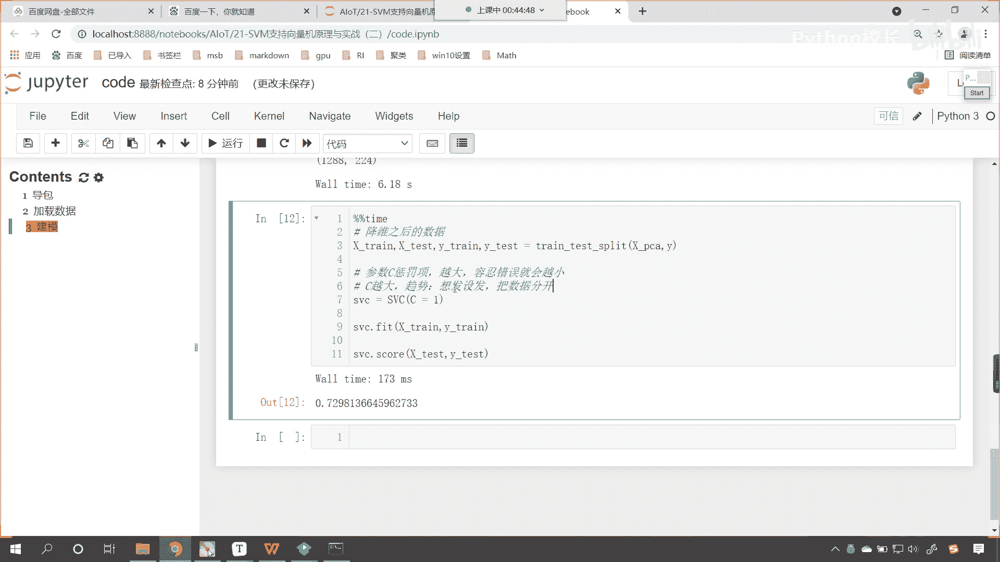

那对于我们所提供的这个数据，你想它就是变着法儿想要把这个数据分开，那他如果要真分开了，你想一下他怎么才能分开呢，他是不是就得曲溜拐弯呀，看到了吧，它就得去留拐弯，是不是才能够把这个数据分开呀。

那你曲溜拐弯把这个数据分开了，你对于训练数据倒是好，但是你对于测试数据，那这个时候是不是就不行了，这个就好比啊，你看这个有的人呢，这个啊死脑筋是吧，这个爱钻牛角尖。

他呢就在考试之前把老师所留的所有作业是吧，全背过了嗯，就是晚上不睡觉是吧，熬夜到两点也要把这个所有的题都背过，但是他不找规律是吧，他就是死记硬背，那老师考试的时候，如果说要考原题，你想分数特别高。

是不是排名名列前茅，但是呢一高考这样的人就不行了，为什么呀，靠死记硬背，没有变通，那就不行，是不是，所以说呢这个呢就是咱们之前讲过的过拟合过，拟合，他对于训他对于训练很好，但是这个没用啊。

这就咱这就是咱们这个中国古话是吧，在家里边描述某些人的时候，我们就说他窝里横是吧，这个不算是吧，你得怎么样呀，你你在这个窝里横是吧，你到外面也横是吧，这你才能真正的吃得开，所以以后你有了小孩是吧。

你在教育他的时候是吧，可不能让他怎么样，可不能让他过你河，知道吗。

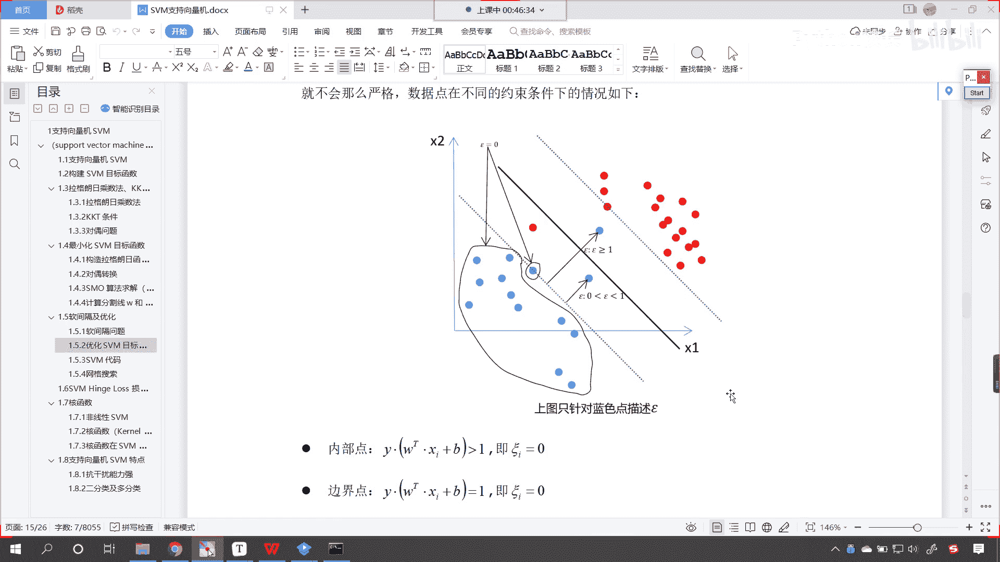

好来咱们现在呢再回来啊，那这个c越大呢，这个趋势就是想方设法要把它数据分开，那这个时候就会造成过拟合，看这个时候就会造成过拟合，那我给你演示一下啊，来咱们将上面这个数据复制一下。

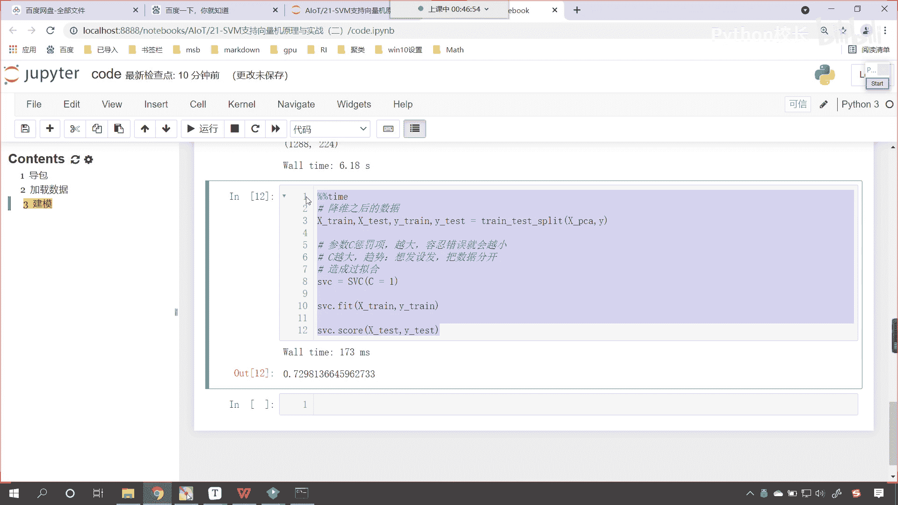

我在这儿来一个粘贴，你看啊，假设说我把这个c调整成100，你来看一下会是什么效果，那么为了和上面进行对比，咱们print输出一下哈，这叫svc点，咱们也调用sc，咱们将x下划线train放进去。

y下划线train放进去，那我们打印输出，这儿呢咱们来一个文字标记，这个呢就是咱们训练数据的得分冒号，接下来这个呢，是不是就是咱们测试数据的得分呀，看咱们来一个print。

好那么我们也给他来一个文本标记好，那么这个呢就是测试数据的得分冒号，这个时候你看我一执行，你看谁的分数高呀，你就能够发现这训练数据是不是很好呀，看到了吧，训练数据是不是很好是吧，0。96是吧。

100个人当中96个，他是不是都能够找到规律，是不是都能够把它识别出来呀，但是你看测试数据呢是不是就只有0。77呀，那么我们把这个增大啊，你看啊，我们把这个c增大，你来再来看效果，复制一下。

这个咱们同样呢也打印输出，这个时候我们就对比一下来，你现在能够发现看到了吧，咱们这个怎么样了，是不是从0。96是不是就变成一点了，看到了吧，这个呢是不是就是0。847呀，那么所以说我们在这个地方。

如果要一定程度增大c是不是训练数据也好，测试数据也好呀对吧，那你看假如说我再来啊，我给他来个1万，你看就是说你这个数据再大的话，是不是效果就不好了，你看这个时候测试数据，他的得分是0。82。

我们给100的时候，你看他是多少，100的时候是不是0。8啊，咱们给十的时候我们看一下啊，十的时候0。81，那么咱们是不是就得选择一个合适的c呀，对不对，我们需要选择一个合适的c。

那么咱们该如何选择这个合适的c呢，是吧，我们除了这个参数c之外，咱们是不是还有和函数呀，对吧好，那么嗯我们到底使用线性的呀，我们还是使用多项式呀，还是使用咱们的这个高斯核函数呀。

这个时候呢来咱们往上滑动啊，我们在导包导一个包，那就是from sk learn，咱们从model selection当中，我们导入一个grade search cv，这个呢就是网格搜索。

可以帮助我们这个非常方便的选择参数组合，那我们就往下滑动是吧，好那么这个三呢是咱们建模，咱们就进行了一个对比建模了，那么接下来我们再来一个三级标题，这个呢就叫做筛选合适的参数好。

那么我们就声明一个s vc就等于s vc，然后呢咱们来一个gc就等于grade search cv，这个grade search cv里边第一个参数呢，咱们要对于上面的支持向量机进行优化。

第二个参数呢就是它的待选参数，那我们选择哪些待选参数呢，咱们给一个啊叫p a r a m params，就等于来一个字典，第一个是c，咱们这个c从哪选呀，那就是np。log space嗯。

咱们呢就从-3，然后呢我们就到三，咱们给它分成呃，来个50份吧，然后逗号第二个参数呢和函数，kernel k e r n e n e l，那这个和函数呢咱们给几个，第一个是r b f。

第二个呢是polly多项式，第三个呢是咱们的这个linear线性的，咱们给这几个就可以了啊，那么它还有一个参数叫tol，这个tol是不是就是表示精确度呀，那么默认的精确度是多少呢。

shift tab点开这个加号，我带着你来看一看，咱往下滑，默认的是不是1‰呀，那咱们就给几个啊，咱们给一个这个1%，咱们给一个1‰，那就是0。001，然后逗号咱们再给一个0。001。

这个是不是就相当于是万分之一啊，对不对，好，那么在这个万分之一这是吧，然后呢我们再给一个零点，再来一个五，这个是不是就由大到小呀，那大家想我们这个参数组合是吧，它有多少种变换的这种方式呢。

你看这是不是有50个，这是不是有三个三五，150，再乘以一个两个三个四个是吧，那这个就是600个是吧，我们有600个组合啊，好那么把咱们的参数组合放进去来。

这个时候呢咱们就使用咱们的grade search cv，咱们调用feat方法啊，咱们来一个feat，那这个时候呢咱们就将x p ca放进去，然后呢将目标值y放进去。

那么我们的grade search cv当中，它是不是还有一个参数叫cv，这个cv呢就是网格搜索，上一节课我们对他进行了介绍，如果不明白，翻看咱们上一节课的视频啊，那这个代码得运行多长时间呢。

它运行的时间可能会稍微长一点，咱们来一个time是吧，好那么我们这个0。05，这个咱们就不是了啊，我们删除一个，这样的话它的时间呢就会缩短很多啊，来执行咱们的代码，一运行这个时候呢，那么我们网格搜索。

就会根据咱们所提供的这些参数，它会筛选合适的这个参数组合嗯。

你看我们往上看啊，看咱们刚才这个运行一个时间。

是不是大概是328ms呀对吧，那我们下面的这个运行是吧，就是它的很多倍，知道吗，就是它的很多倍，因为这个是50，再乘以三，然后再乘以三，那就是五，这个看50x3，150，150，再乘以150。

再乘以咱们的三，也就是说他得需要执行400多次，而咱们的grade search cv呢，每次又每次又会去进行这个分割，分割之后呢，这个次数就更多了，所以说呢咱们这个得稍微花一点点时间。

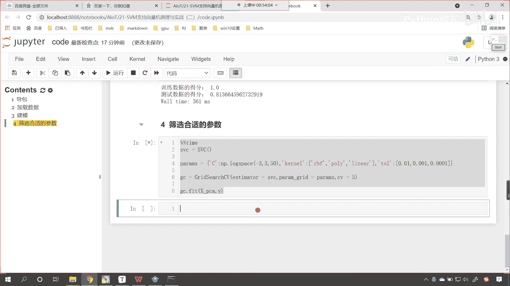

那么我们先让这个代码执行，咱们呢把我们这个代码咱们从上往下。

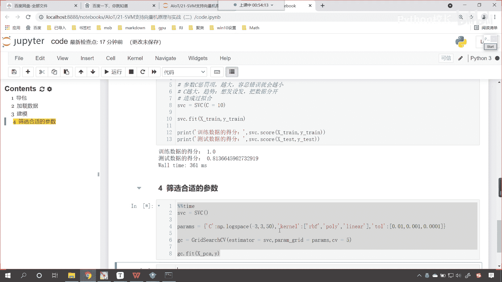

咱们串一遍好不好，笔记本干这个能支撑住，知道吗，没问题的啊，这个数据量不大，知道吗，它很小，好来我们呢把上面的梳理一下啊，嗯好上面呢就是咱们相应的导包，这个打包完之后呢，我们就进行了这个数据的加载，好。

那么对于这个数据的加载呢，我们将该合并的咱们合并一下，好不好，来我们就把这个剪切一下，咱们呢就给它粘贴到上面，我们把该删除的呢咱们就删除一下哈，125x94，我们刚才演示了，那这个就没有必要了。

那这个prt colors map，咱们就是为了给大家演示一下，我们的颜色配色有哪些是吧，现在这个也没必要了，删除这个y呢是目标值，它对应着咱们的索引，好那这个也没有必要了，好那么我们加载数据之后呢。

咱们这一行代码其实就是显示咱们的这个人脸。

是不是好，那么接下来呢就是咱们的建模。

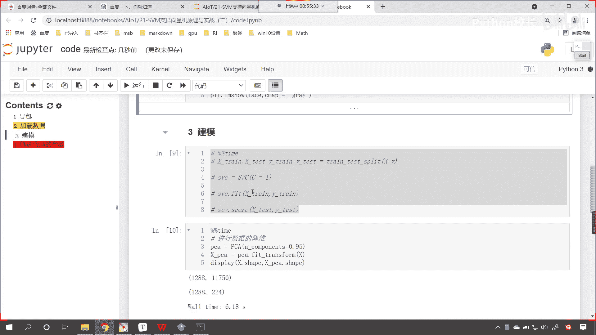

那对于我们建模，这我们进行了数据降维，那么数据降维之后呢，嗯嗯大家看啊，数据降维之后，我们呢就进行了这个训练是吧，我们给惩罚项默认是一，那我们就能够看到是吧，它有一个训练数据的得分。

有一个测试数据的得分，一旦出现这种情况，你就发现这训练数据得分，是不是远远高于咱们测试数据的得分呀，这种情况就叫做过拟合，那这种情况就叫过拟合，因为它符合过拟合的这个特征，就是对于自己学过的数据效果好。

但是对于新数据它的效果就不好，咱们在这儿声明了算法，然后是不是让他进行了学习呀，你可以认为其实这个算法学习的过程，不就是你在高中的时候做的题吗，对吧，老师给你提是吧，让你做了题，然后又讲了题。

如果下回考试考一模一样的，那你的分数是不是就高一些，对不对，那对于咱们的x test y test，你看这个呢他就没有学习过，那么让他做新题，所以说这个分数就怎么样，这个分数是不是就低一些呀对啊。

但是咱们的优势呢就是举一反三，现在这个算法呢越来越先进是吧，所以说呢，我们当然希望这个算法对于训练数据效果好，对于测试数据呢效果也好好。

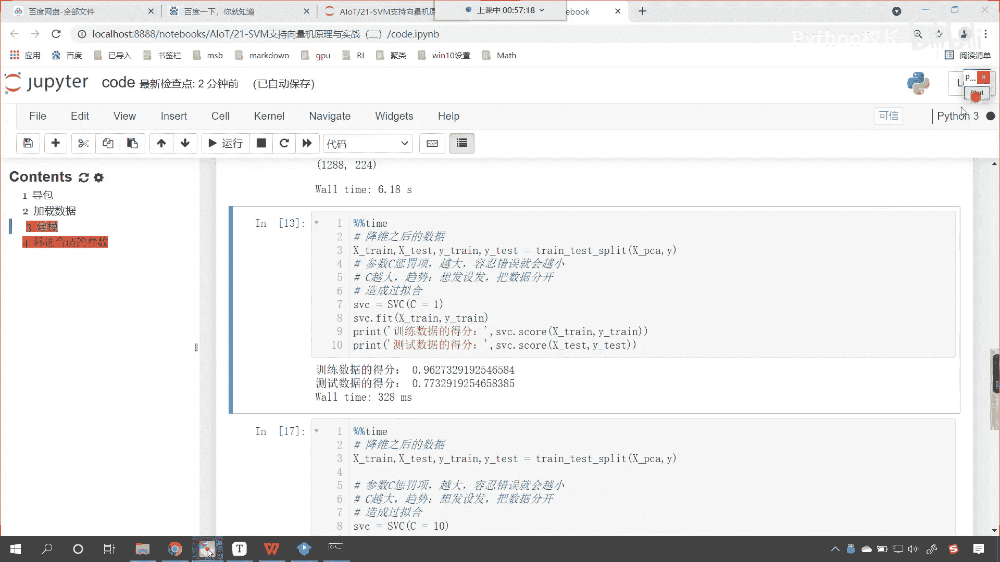

那么接下来呢我们继续往下看啊，咱们就就给各位小伙伴展示了一下，我们将这个c增大之后是吧，它的效果呢唉会好一些啊。

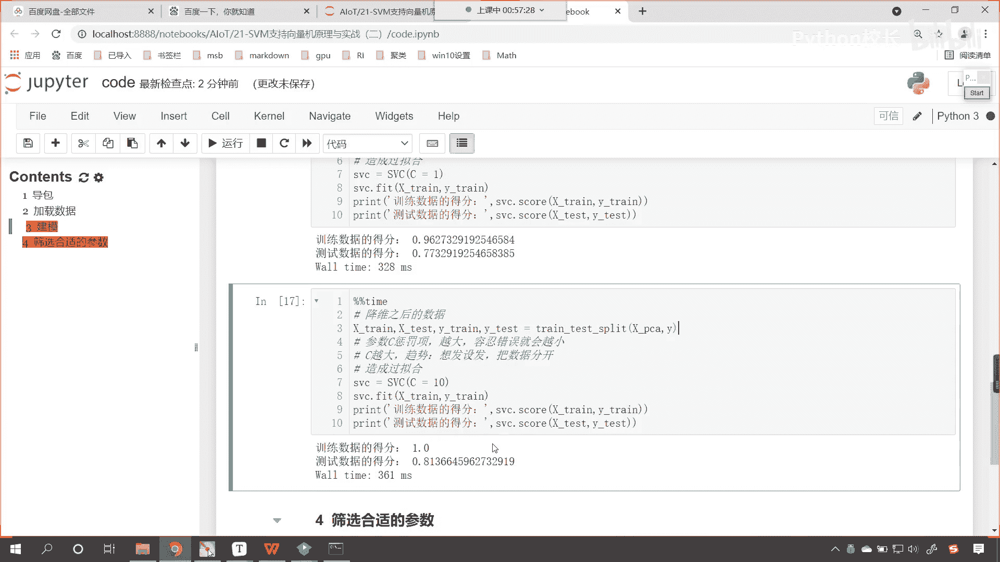

嗯那我们进行这个筛选合适的参数，这个时候你就能够发现，你看我是不是在这个地方就给自己挖了个坑呀，对吧，我们一开始我们给了多少个呀，看一开始咱们是不是把这个惩罚项，我们是不是给了50个呀。

这个就有点多了啊，所以说这个到现在呢这个代码在运行的时候，你就能够看到这个星号是不是还在，这是不是依然没有执行结束呀，对不对，依然没有执行结束好，那么你现在的话，是不是这个至少执行了这个五分钟了吧。

应该有五分钟了啊，我们看一下啊，这个肯定有五分钟了，是不是这个有了五分钟，他还没有执行结束嗯，那现在呢你想一下，这为什么他执行花的时间会这么长呢，对吧，你看为什么执行花的时间会这么长。

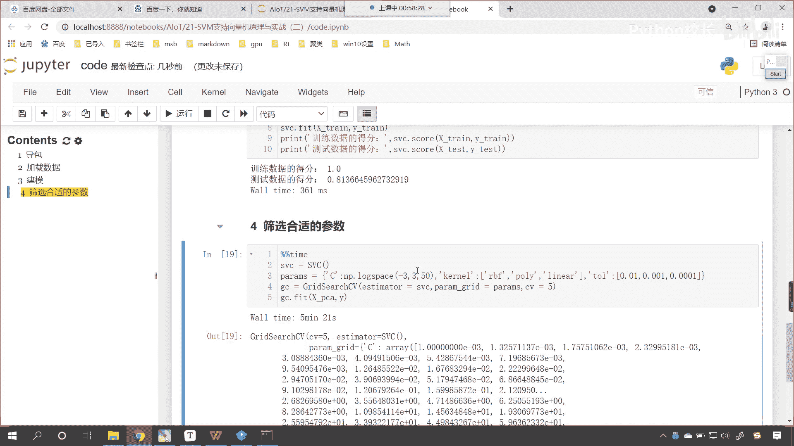

哎现在你看终于执行结束了，是不是这功夫不负有心人啊，好那么这个执行结束了是吧。

咱们这个知识点就先到这儿，那么接下来呢我们会具体讲解一下。

咱们这个grade search cv。

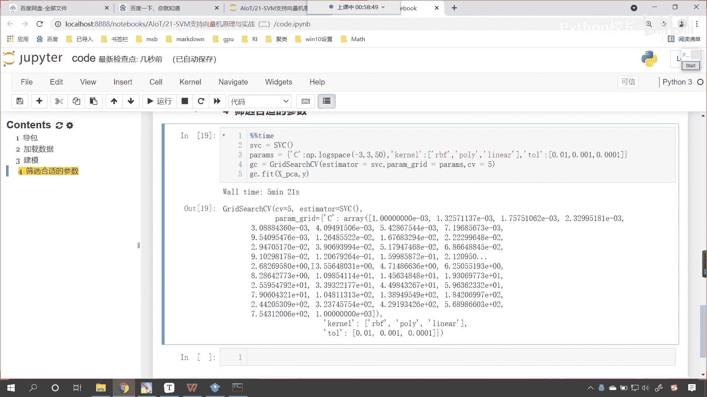