# P139：2-Kmeans聚类亚洲国家队类别可视化 - 程序大本营 - BV1KL411z7WA

去看啊。

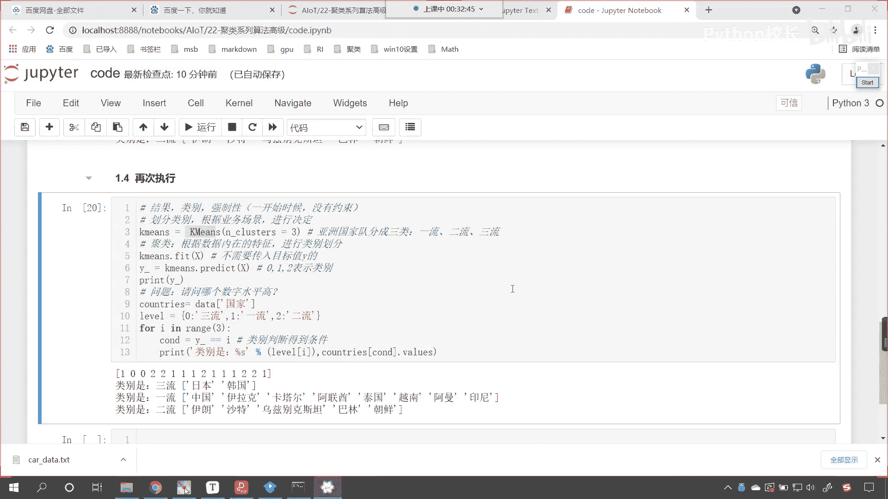

来我们对于亚洲队呢进行了一个划分。

在这个里边需要注意的点，我们也进行了说明，那么接下来呢咱们对它进行一个可视化，咱们再来一个四级标题好，咱们来一个可视化。

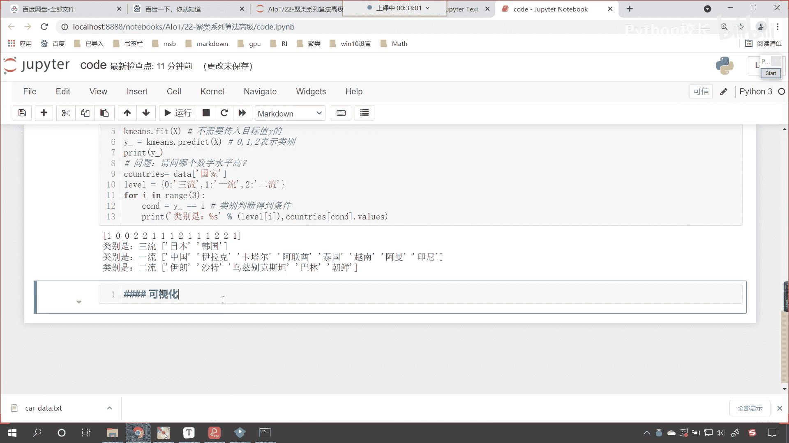

那么可视化这个地方呢，咱们首先呢给它调整一下它的尺寸叫p l t点，figure，p2 t。figure，我们调整一下尺寸，figure size，那就是12和九，然后呢这个prt咱们呢就调用嗯。

这个时候我们在进行画图的时候，咱们是不是就可以呃添加一个子视图啊，此时呢我们添加一个子视图，咱们就可以调用sub plot，那就是一行一列，第一个，然后逗号里边给一个参数叫projection。

projection就表示类别，咱们给一个3d，那这个时候，咱们是不是就有一个3d的图形了呀。

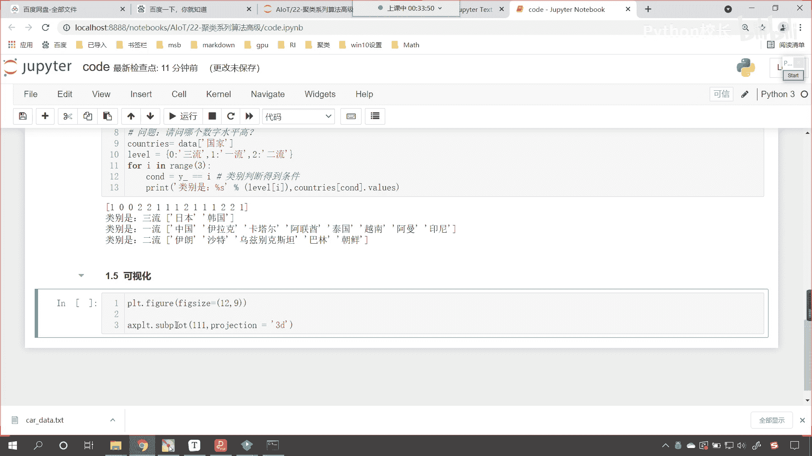

你看我一执行这个3d图形是不是就出来了，那么接下来简单，咱们是不是只需要往这个里边给它绘制，是不是只需要往这个里边绘制数据就行了，那么我们亚洲队的数据，他们的06年世界杯是吧，咱们怎么给他表示呢。

咱们这个时候呢就绘制一个scanner，这个就叫散点图，咱们的数据呢都在x当中，从x当中去选第一列，这个就表示06年世界杯x中国选第二列，你看一就表示第二列，这个呢就表示咱们10年世界杯。

然后中国二冒号，咱们再给一个二，这个呢就表示咱们07年亚洲杯，那么它的颜色是什么样的呀，然后呢，我们给一个这个咱们呢啊给他指定一下颜色，这个颜色就是c，c呢就是我们预测的结果叫歪盖。

因为你的歪杠呢看因为咱们的y杠呢，它表示它的类别不同，对不对，看这个y杠表示类别不同，那你这个c呢表示颜色，那这个c等于y盖，它所表示的含义就是咱们根据类别不同，为不同的类别去划分不同的颜色。

因为这个y杠当中它的数值是不是012啊，那么我们就会为它分配三种颜色，然后呢逗号咱们呢再给它调整一下尺寸啊，咱们来一个100，这个时候你看我一执行好，咱们现在看一下啊。

这个is an invalid key是吧。

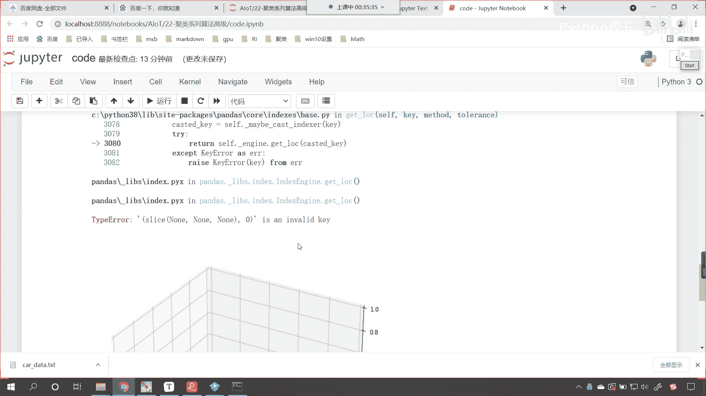

咱们看一下到底是哪一行代码可以报错了，现在他是不是报咱们这个这一行代码给报错了。

是不是，那我们看一下啊。

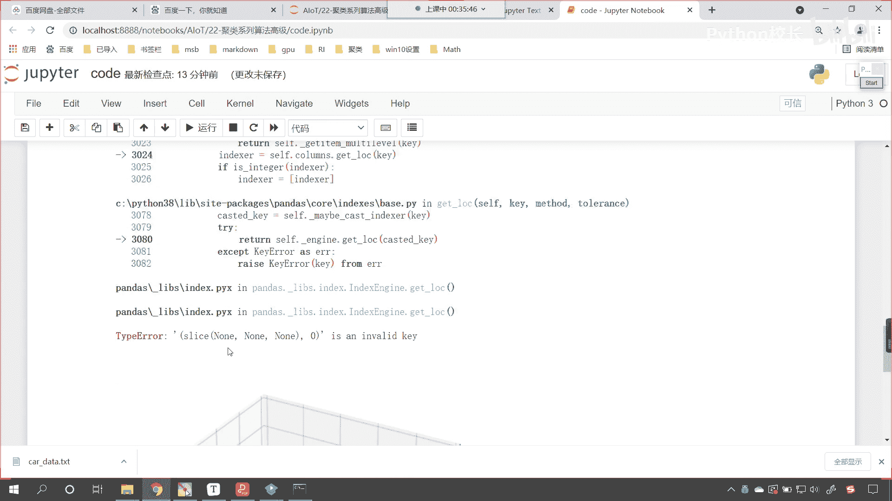

零is invalidk来，那么咱们把这个代码给它调整一下。

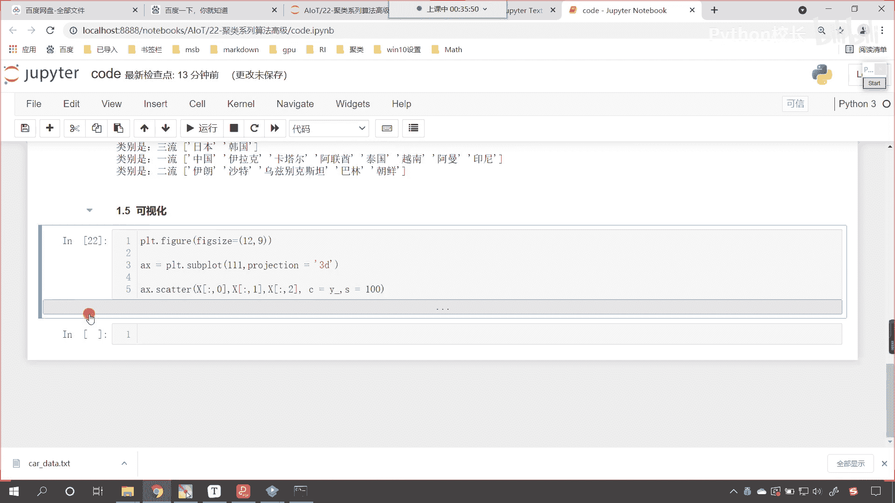

我们看一下咱们的x好，大家现在就能够看到，你看嗯咱们的x它是一个什么样的数据呀，我们就能够发现，你看它是不是一个这个data frame呀，所以说我们直接这样取数据，那肯定不行，怎么办呀。

咱们调用i log l o c是吧，或者这个再来一个i lock，那么咱们最后一个数据，咱们可以是不是直接使用中括号来给它获取呀，这个就是2007年是不是亚洲杯啊。

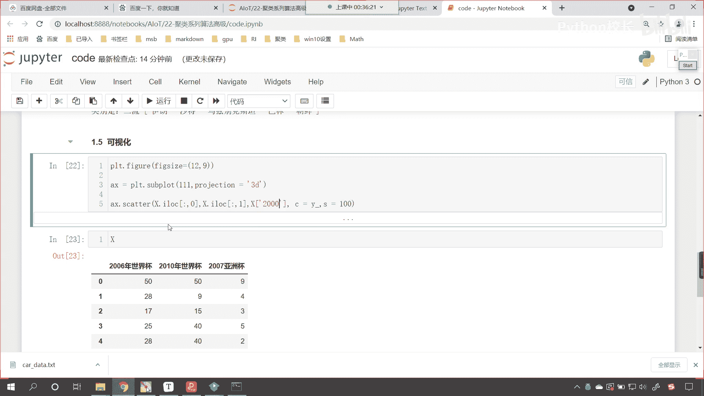

这个时候你看我再来执行来大家各位小伙伴。

你就能够看到这个代码是不是就执行出来了呀，看到了吧，此时这个代码ok了吧。

对不对，好，那么颜色呢我们也是可以调的啊，比如说这个时候呢咱们逗号，我们给一个c map，那你如果想省事点是吧，那么你就给现成的这个颜色，那我们这个现成的颜色呢，呃比如说我们给一个ocean诶。

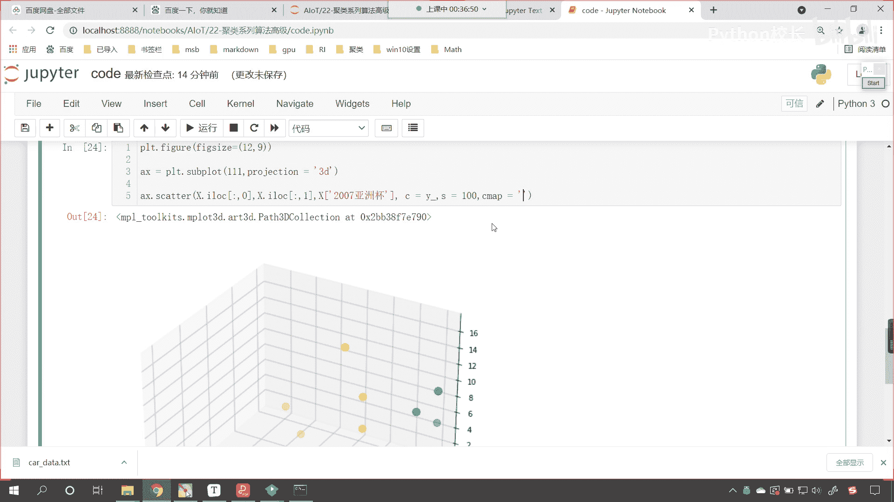

这个时候你看它就对应着一种颜色是吧。

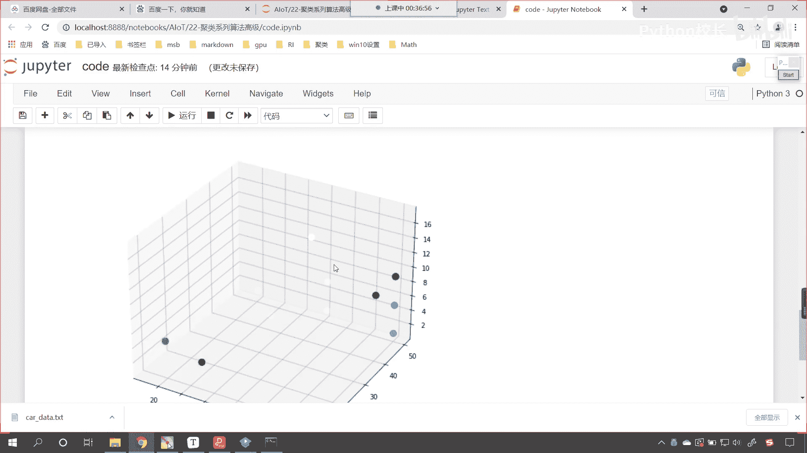

那我们还可以给它自定义颜色，在上面，咱们插入一行，咱们就from matt plot lib，从这个当中看点，从这个colors当中，咱们呢导一下包。

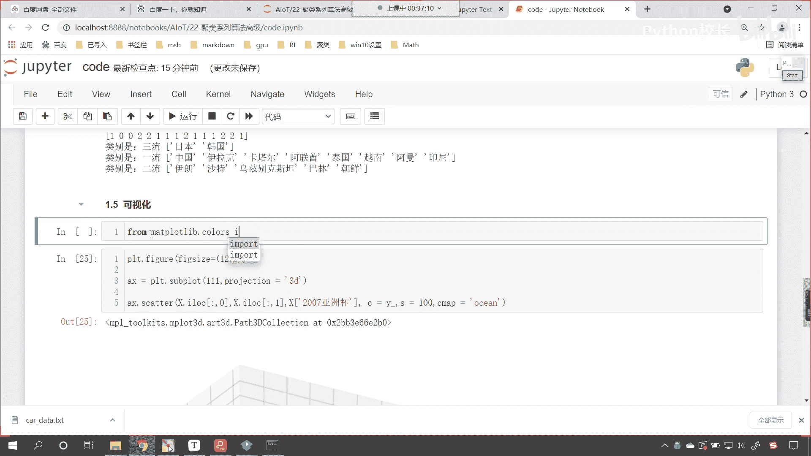

咱们导一个list color map好，那么有了这个list color map。

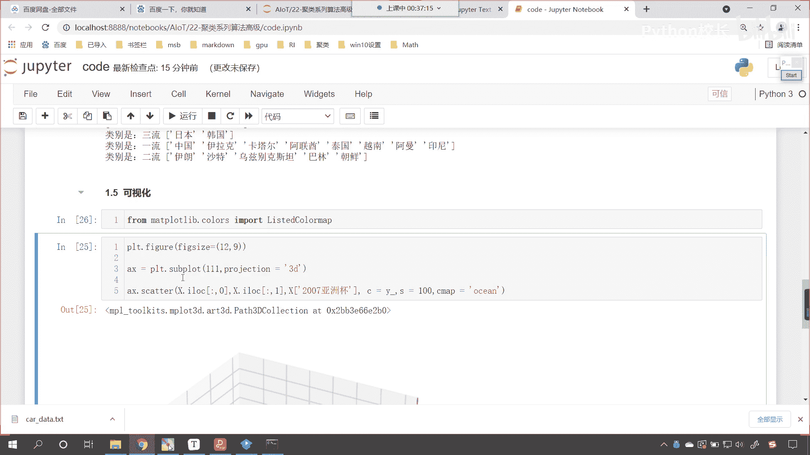

我们在这个地方呢，就可以给它生成一个颜色了啊。

咱们就创建一个colors，就等于list color map，那我们分别给它什么颜色呢，比如说我们给一个红色，咱们给一个绿色，然后咱们再给一个这个purple p u r p l e。

我们就给这三种颜色color有了，那么我们这个c map呢。

咱们就把它复制成咱们的colors，这个时候你看过一执行，现在各位小伙伴，你看颜色是不是就是我们自己定义的了，好那么在三维空间当中呢，我们看到紫色是不是有深有浅呀，是因为呢这个是图像。

它自动给你生成的啊，这样的话你看起来就有远近的感觉了。

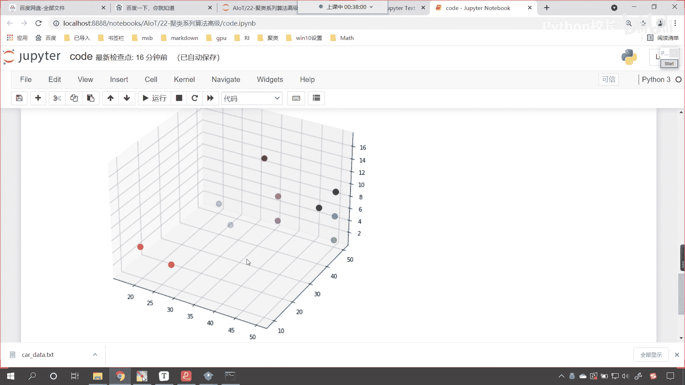

对不对，好，那么咱们说这第一个呢，他表示06年世界杯，所以这个时候呢我们就设置一下，咱们就set x label，设置一下它的标签，那这个标签呢就表示2006年是吧，这个是世界杯好。

那么我们设置一下它字体的大小，我们给它一个size，我们让它等于18好，那么接下来咱们再设置一下它的纵坐标，那就是set y label，我们对于这个label呢，它就是2010年世界杯。

然后呢同样字体的大小我们也设置一下，都让它是18，那还有一个轴就是咱们的z轴，咱们set一下z label，这个呢就是2007年哎，这个是不是亚洲杯呀，对不对，2007年亚洲杯。

那么中英文切换一下font size也给一个18，注意这个时候我们里边是不是有中文了呀。

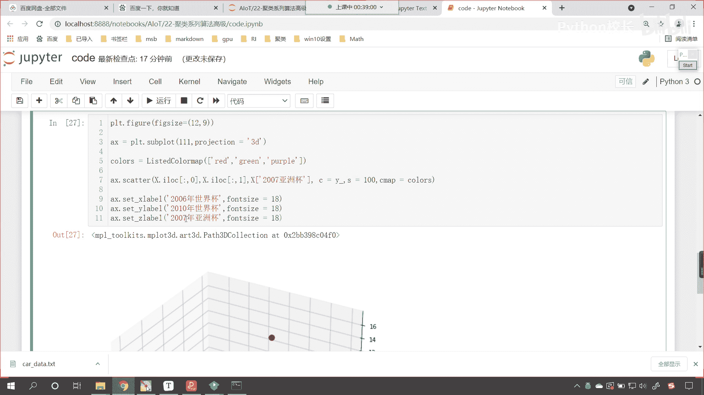

有中文默认情况下中文不显示，咱们设置一下啊，那就是p t点啊，那就是p t中国号，咱们呢对它属性进行设置，叫做plt点这个r c para来一个中括号是吧，都有什么样的属性呢。

font点咱们给一个family，在我的电脑上呢，我有这个s，咱们现在呢就给他设置一下s t楷体，这个t呢应该是大写的，这个时候你看我一执行。

大家看这个2006年世界杯，2010年世界这个世界杯。

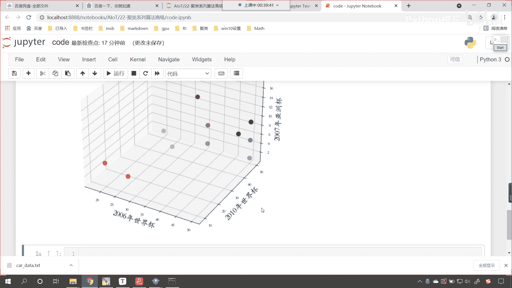

2007年亚洲杯这个数据是不是就出来了，看到了吧。

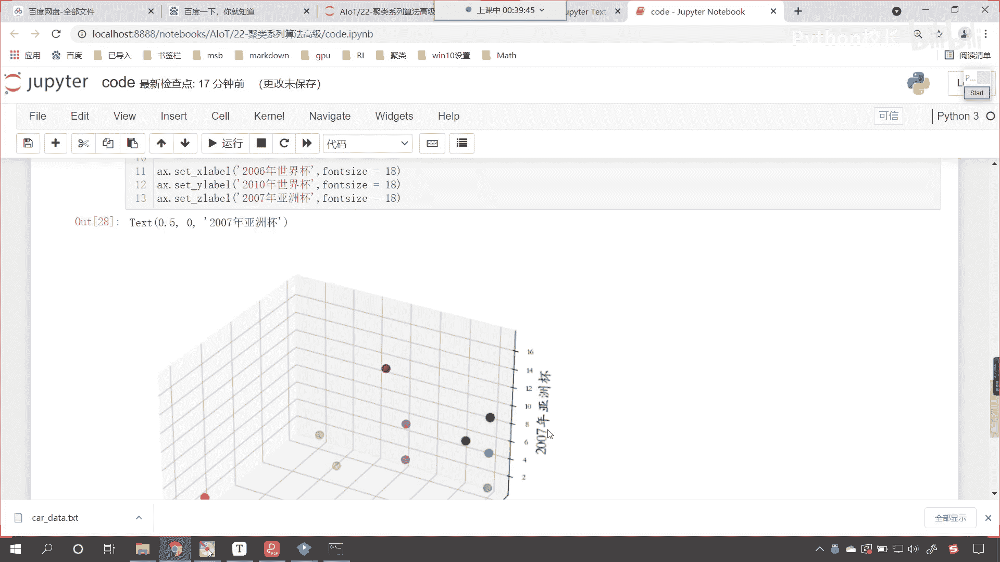

如果你不知道你的电脑上有哪些字体，你可以查找一下啊，看咱们就可以from matt plot lib是吧，我告诉你怎么查找字体啊，matt plot lib，然后呢。

我们这里边有一个font manager，从这个当中咱们导一下包，叫做font manager，导进来，在下面插入一行fm，就等于font manager，这个可以找到你电脑上所有的对应的这个字体，好。

那么有了fm了是吧，咱们fm点它里边呢就有字体的一些数据。

叫做t t f list，这个就表示它的相应的字体好。

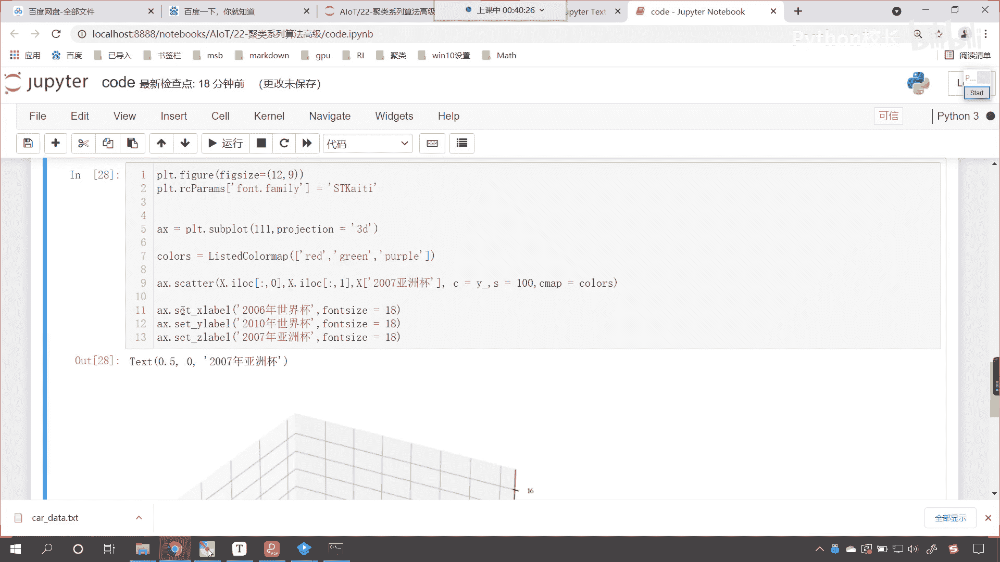

那么这个没有小括号啊，因为这个是它的一个属性。

这个时候你看过一执行，大家看这个字体是不是就都出来了呀，这是一个列表，咱们现在呢使用列表生成式，我们获取字体的名字就可以了啊，那该怎么办呢，我们叫fault f font in。

你看这个是不是就获取到了，然后呢咱们点一下它的name。

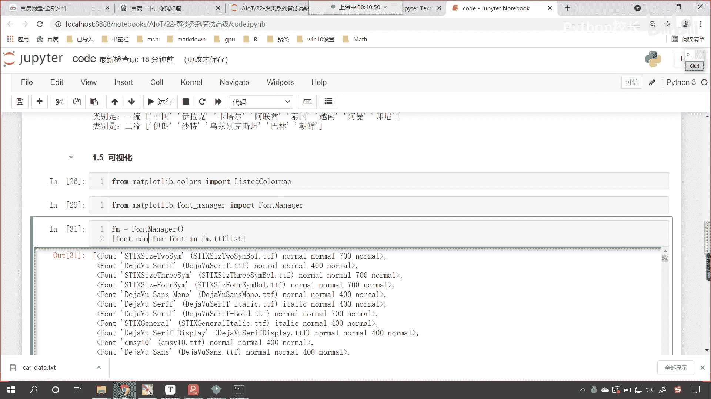

这个时候就获取了这个字体的名字，现在你就能够看到这个是不是，就是咱们自你电脑上所包含的所有字体啊，从这个当中找和中文相关的字体，你像仿宋宋体，楷体，黑体，这些都是中文字体，可以正常显示中文。

这个咱们就不再赘述了，好现在你就能够看到看咱们红色的。

你看红色的类别对应着谁，是不是对应着日本和韩国呀，他们属于是一流强队是不是好，那么我们紫色的对应谁，看咱们紫色的就在中国当中啊，紫我们中国就在紫色的当中，那么绿色的就是朝鲜呀，巴黎就是朝鲜呀。

沙特呀是吧，他们这些亚洲的这个强队好。

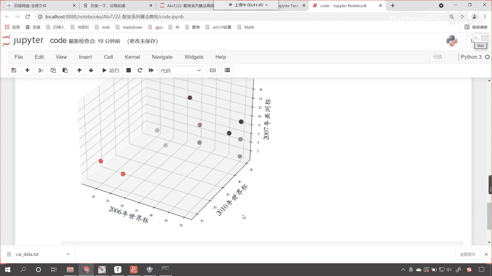

那么你看到现在为止。

我们是不是就使用了k means聚类这个算法。

对于这样的数据，咱们是不是进行了类别的一个划分呀。

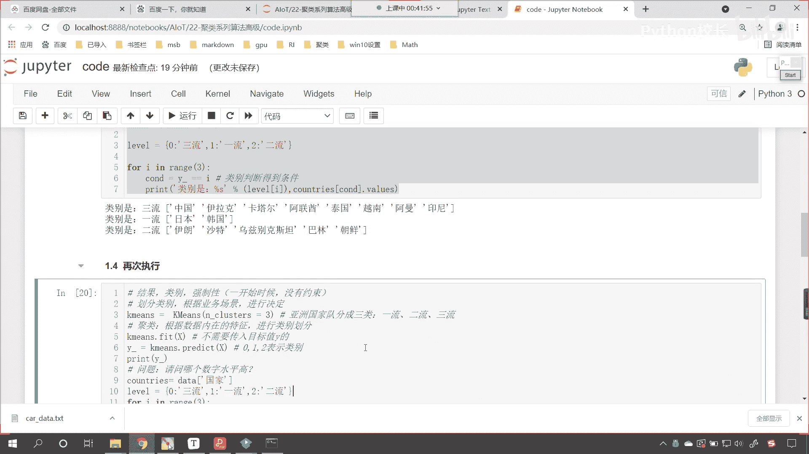

对吧，你看那你想一下，咱们人，是不是也可以对这个数据进行人为的划分呀。

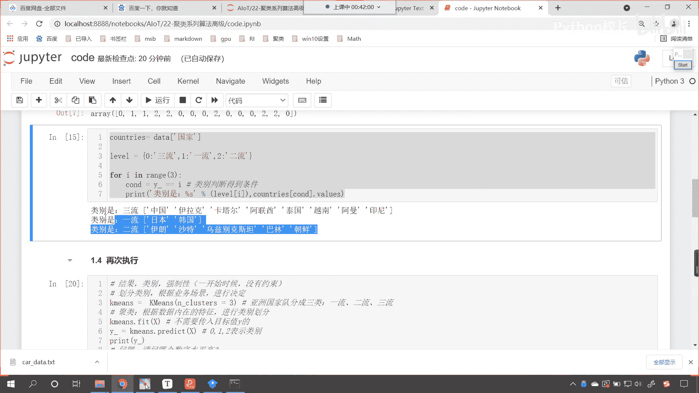

他那人和机器相比，你想一下谁的效率更高一些，对不对，很显然是咱们的机器，很显然是咱们的算法，特别是当这个数据的特征特别多的时候，你比如说我们统计的是从二零是吧，从这个2000年世界杯一直到这个二零呃。

一直到这个呃2018年是吧，世界杯我们统计了这么多年的，那这个时候你在啊说，如果数据的维度要增加的话，咱们使用人工来进行类别划分，那这个时候就难于上青天了。

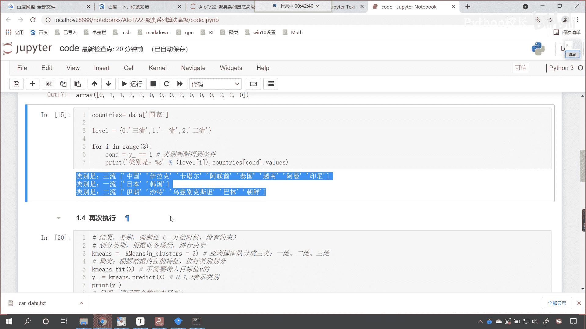

所以大家明白这个计算机它强大的优势是吧。

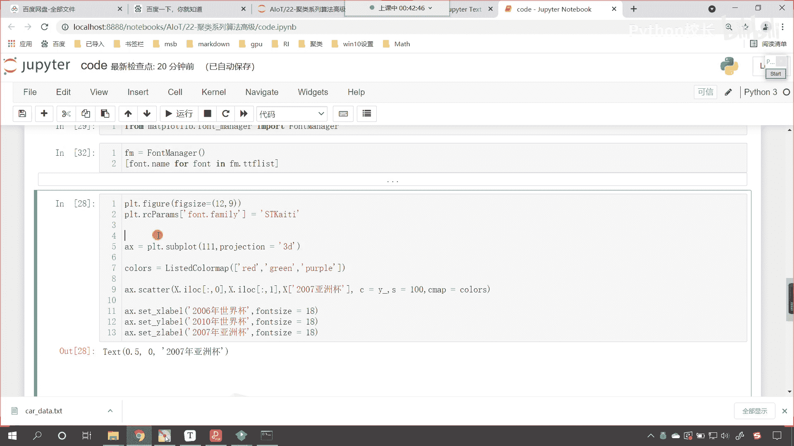

随着这个社会的进步。