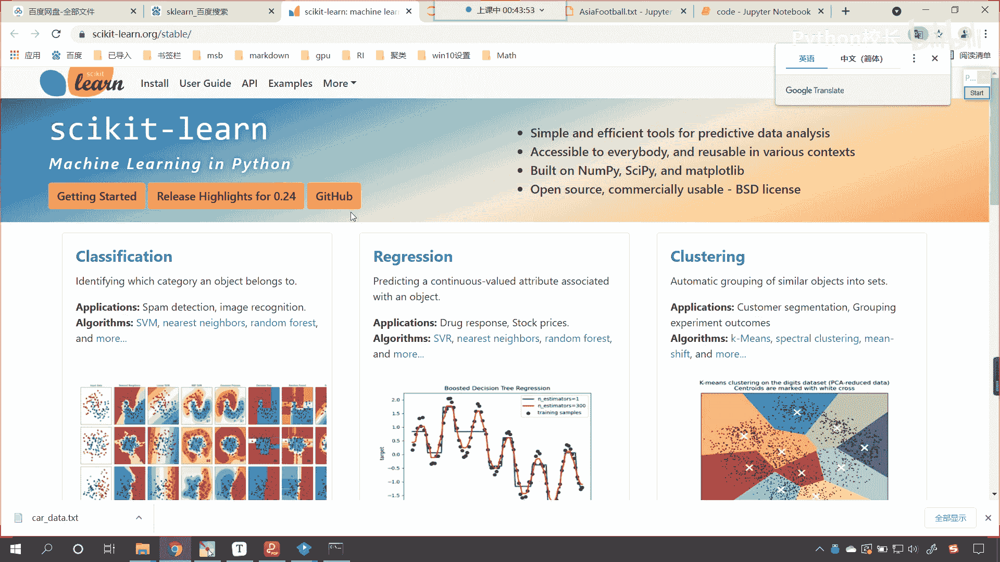
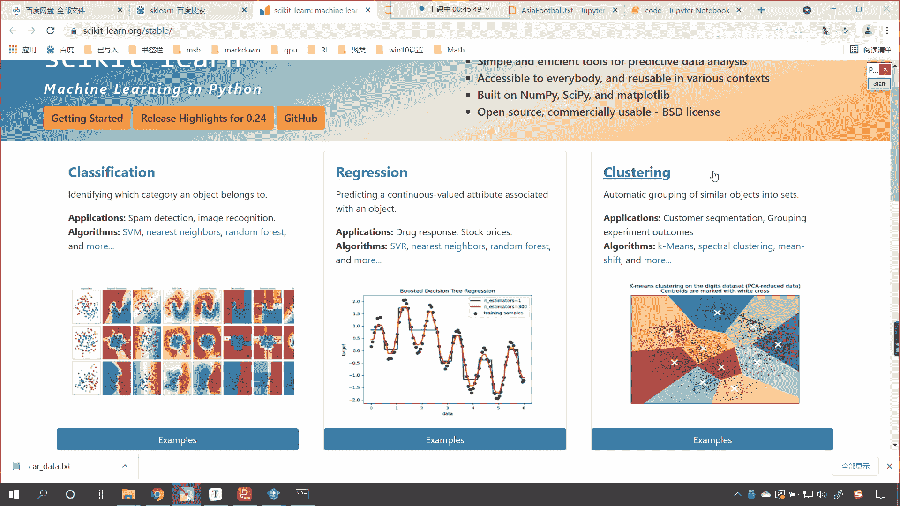
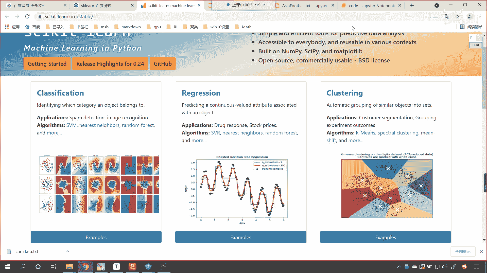
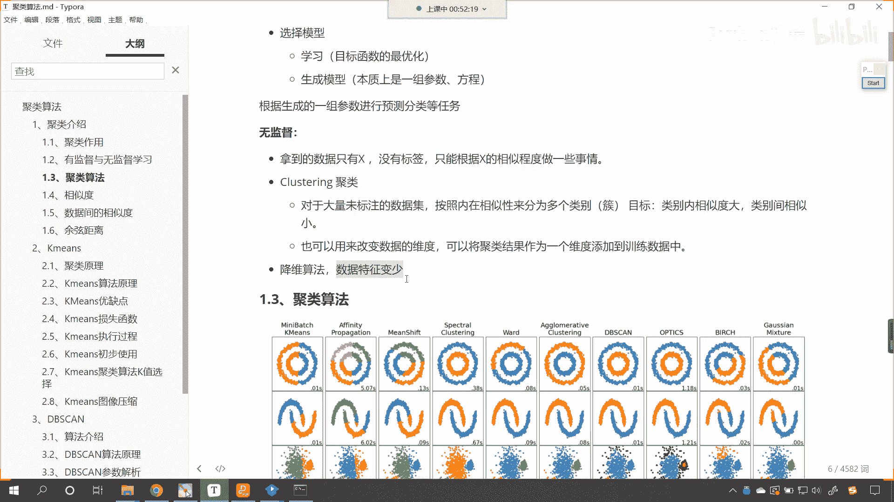
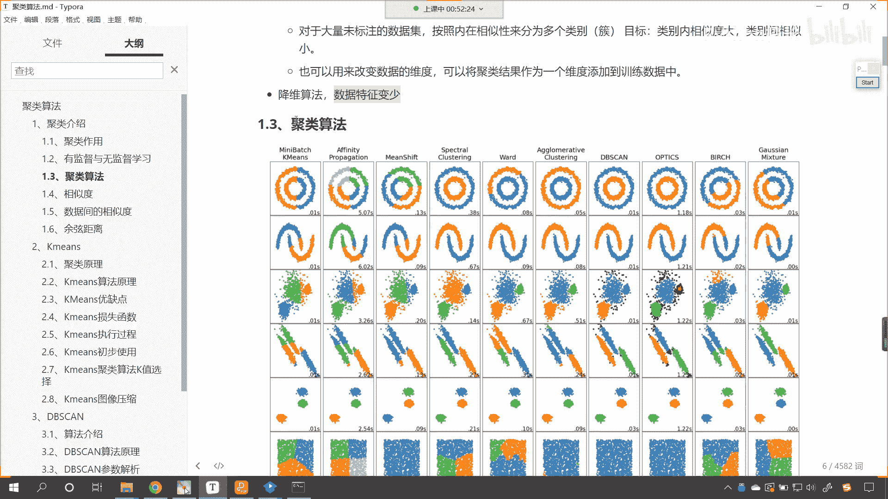
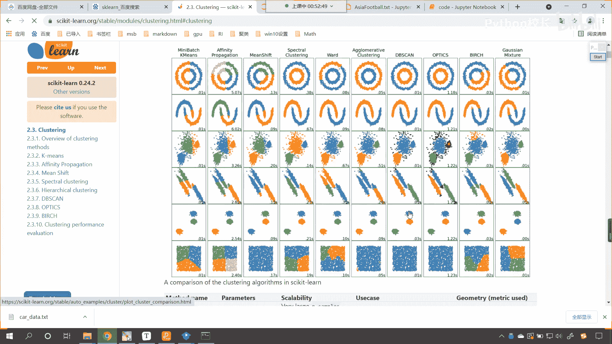
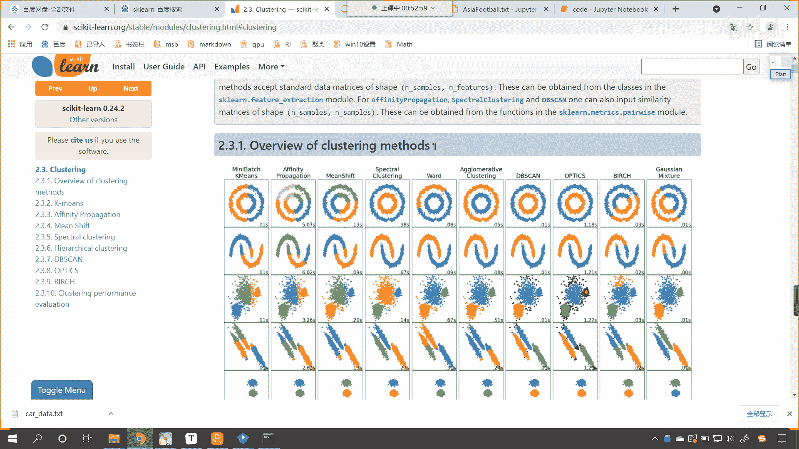
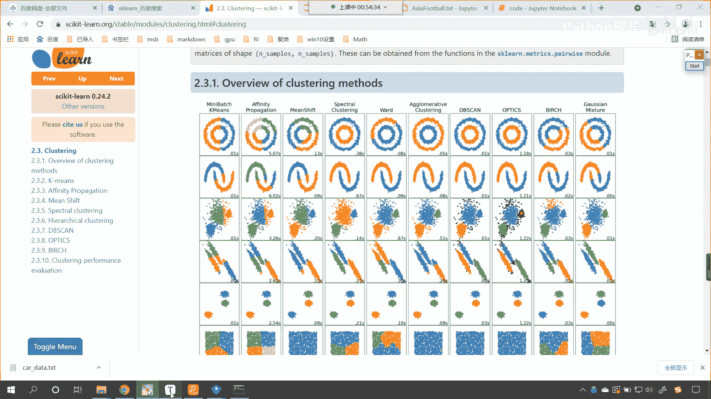

# P140：3-聚类算法概念介绍 - 程序大本营 - BV1KL411z7WA

好咱们的项目呢我们通过代码来完成了，现在有一个问题，那这个聚类算法它到底是怎么回事啊，它到底是什么样的原理呢，对不对，你看这个算法，它怎么就将我们这个数据进行了类别的划分呢，对不对，你想知道吗是吧。

你先想一想这个到底怎么回事是吧，怎么操作的来，现在呢咱们回到课件当中好，那么我们呢要对于理论进行一个说明和介绍，咱们首先看一下这个聚类是吧，这啥是聚类呢，看来我给你看一下什么是聚类。

比如说呢咱们进入sk learn啊。

这个是咱们学习的这个框架的，它的官网一点击进去了。

现在你就能够发现你看我们已经学了什么了呀，看到了吗，这是英文的啊，你学习咱们的编程，是你练习英文的一个很好的方式，classification regression，看上面首先第一个是不是叫分类呀。

第二个是不是叫回归呀，什么是回归，再也没有比这个图更形象的，这个说明了回归就是找是吧，这些点这些样本它的规律和趋势是吧，那什么是分类呢是吧，你这个红啊，红色的底和这个蓝和这个蓝色的点。

咱们就要想方设法把它分开，看到了吗，这就是分开所有我们现实生活当中的所有问题，要么是分类，要么是回归是吧，那么在这个回归和分类，这是吧，又进行了一个分支，叫什么叫clustering，这个分类和回归呢。

它们所对应的数据，看它们所对应的数据是既有x又有y，而咱们的clustering啊，而咱们的clustering咱们只有数据，我们没有目标值是吧，那这个翻译成翻译成这个嗯，中文它呢就是醋的意思。

那这个也叫聚类，你看它的作用是什么，看这个英文，你把它翻译一下，叫automatic grouping of similar objects，in two sets，它是不是就将相似的对象。

划分到一个集合当中呀，是不是划分到一个类别当中，你看下面这些点是不是咱们怎么划分呢，是吧，红色的区域，绿色区域，蓝色的区域，紫色的区域是不是要划分成功了呀，好，那么我们在它的官网上。

带着各位小伙伴看了一下，那么咱们回到咱们的课件当中啊，我们对于这个聚类咱们进行一个详细的介绍，概念性的这个介绍好，那么我们首先看一下咱们聚类它的作用是什么，看那就是知识发现发现事物之间的潜在关系。

如果你的关系是咳类类似的是一致的，那么我是不是就可以把你划归到同一个类别呀，那么还有一个叫异常值检测，那这个异常值检测呢，就是说我对你进行类别划分的时候是吧，你实在是归不到这个类别。

同时呢也归不到其他的类别里边，那这个值呢咱们就可以把它当成是异常值，还有那异常值往往是不是就是离群点呀，看你看我们呃，这个刚才所说的这个术语叫离群点是吧，离群点就是你离这个群是吧，太远距离上来说太远。

那你距离上离得远，哎那这个时候呢那你就不是同一类，这样的话我们就可以通过聚类是吧，来实现异常值的检测和这个删除好，那么第三个呢就是特征提取，那特征提取呢我们代码当中有相应的例子是吧。

到时候会给大家演示啊，这个就是数据压缩是吧，特征提取就是啥，是特征提取，原来的时候你的数据特别多，那你这些数据是吧，咱们呢这个可以把数据由多变少，把其中的这个关键数据拿出来。

那关键数据拿出来表示原来的数据，我们就可以称为特征提取，接下来呢我们继续看，咱们看一下这个金，我们这一章这一章所讲的叫无监督学习，那这个概念是什么，那咱们首先呢就要介绍一下，有监督学习之前咱们讲的算法。

它都是有监督学习，啥意思呀，给定训练集x和y我们选择合适的模型，咱们进行学习生成模型，然后呢进行预测，这一个过程就叫有监督学习，你想一下，从小到大这么多年考试是不是千千万万次呀，对吧。

那你这个过五关斩六将，一直到现在是吧，你的考试看你之前这么多年的学习过程，他呢就属于是有监督学习，因为你每次参加了考试，老师是不是都会讲一下标准答案啊，你针对着自己的标准答案是不是去校正自己。

这样的话你才能够在高考这个考试当中，是不是让自己的分数尽量高一些呀，所以说呢有监督呢，它往往有标准答案，往往有目标值来对它进行一个约束，那什么是无监督呢，看啥是无监督，你就好比画家毕加索是吧。

他画的画是不就是天马行空呀，各种怪物是不是各种抽象，那这个时候呢你看他没有参考，因为之前你看毕加索在出来之前，有人和他画的画一样吗，没有这个是不是他自己创造的呀，我们把这个叫做无监督的一种形式好。

那么在这里呢咱们的这个无监督呢，我们就是拿到数据x这个时候没有标签，这个标签就是咱们所说的目标之外，那么只是咱们呢只能根据x的相似程度，来做一些事情，你看数据和数据呢，如果它的数值大小是相似的。

那么我们可以认为这两个数值是相似的好，那么我们拿它做的事情，这个时候就涉及到咱们的聚类了，对于大量未标注的数据集，我们按照数据的这个特征的相似性是吧，咱们类别内相似度大，我们类别间让它相似度小。

看这个类别内，也就是说你划归到同一个类别了，那么你的相似度就得大一点，这个相似度大就说明这个数据越近似，这个值也就越近似，那类别间看类别间，这个类别间呢就是现在已经分成两类了，那分成两类了。

我们希望呢呃它们的相似度就小一些，那怎么才能衡量它们的相似度小呢，他们得离得远才可以好，那么我们的聚类呢也可以用来改变数据的维度，大家看啊，改变数据的维度，那你还记得之前咱们讲线性回归的时候。

我们是不是有一个数据的升维呀对吧，我们把维度给它升高是吧，给它增加一个属性，咱们通过聚类之后呢，我们可以将聚类的结果作为一个维度，添加到咱们训练集当中好。

那么这个此话怎讲，该如何操作呢，回到咱们的代码当中。

我现在呢就给你操作一下哈，比如说咱们这个数据呢已经有了，是不是看咱们这个数据已经有了，那我就对它进行操作一下，你看这个x是咱们的数据，咱们呢就可以给它一个叫类别。

那这个类别呢就等于我们算法预测出来的歪盖，然后呢我打印输出一下这个x，你看此时你就能够看到咱们的原始数据当中，是不是就增加了一个嗯属性呀，这就是类别，看到了吧。

0112是吧，很简单啊，这就是咱们课件当中这句话，他所要描述的这个意思好，那么无监督呢它另外一个作用就是降维算法，我们可以将数据的特征变小，一会儿呢我们就会介绍我们这里边有一个案例，就叫做图像的压缩。

那这个图像的压缩呢，其实就是将这个数据特征变少好。

那么接下来呢咱们再来看啊，好那么我们看一下这个聚类算法它都有哪些。

你现在能够看到看聚类算法呢有多种多样，有很多种，你看到了，那这个图呢就是咱们sk learn官网上所提供的。

我们进入咱们的网页当中，你看我们点一下这个clustering。

现在你就能够看到，你看在咱们的官网上。

它是不是就为我们提供了这张图片呢，那这张图片就是overview of clustering methods，也就是说不同的聚类算法它的一个效果展示。

看到了吧，不同的一个分类算法它的效果展示，那么上面这一行上面这些标题呢，哎就是咱们聚类算法，我们有很多，我们在课程当中呢，我们会进行这个常用算法，经典算法的一些讲解，比如说k means。

比如说咱们的db scan是吧，这些呢我们都会讲到，比如说这个goon mixture是吧，这个也会讲到你能够看到啊，我们对于相同的数据，也就是说这每一行，你看是不是都是相同的数据呀。

不同的算法对它划分的效果是不是就不同呀，现在你就能够看到哎，如果说我们使用这个k means这个算法好，如果咱们使用k means算法，那么他对于这个数据的划分，你就能够看到，看它是怎么进行划分的。

看到了吧，上面这半个数据和凸出来这个角，它是不是归成一类了，对不对，你看黄色的点是一类，蓝色的点是一类，而如果我们使用db scan这种算法，看咱们使用db看这种算法，你就能够发现。

看咱们这个数据是不是就能够很好的划分开了，你看是不是是不是就可以很好地划分开了，所以说它不同的算法它的原理不一样是吧，那它对于数据的划分效果也就也就会不同，好在这里呢我们就展示了一下不同的算法。

它的聚类效果好，那聚类算法呢十几个呢啊好，那么那这一段视频呢。

