# P150：4-DBSCAN聚类案例Kmeans算法聚类效果 - 程序大本营 - BV1KL411z7WA

来接下来呢我们继续往下看，那我们就使用咱们的算法。

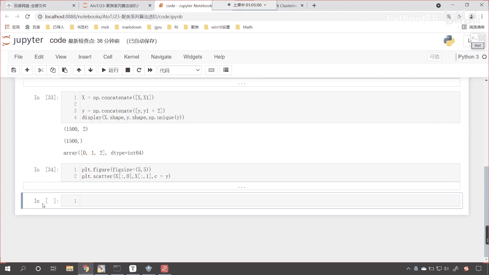

我们就进行分类，好不好好，那么数据已经创建了。

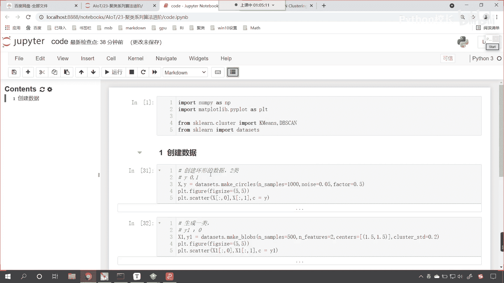

来接下来呢那我们就进行一个聚类划分，好不好，咱们进行聚类好，那么我们昨天学了k means，那咱们就先使用k means来示意吧。

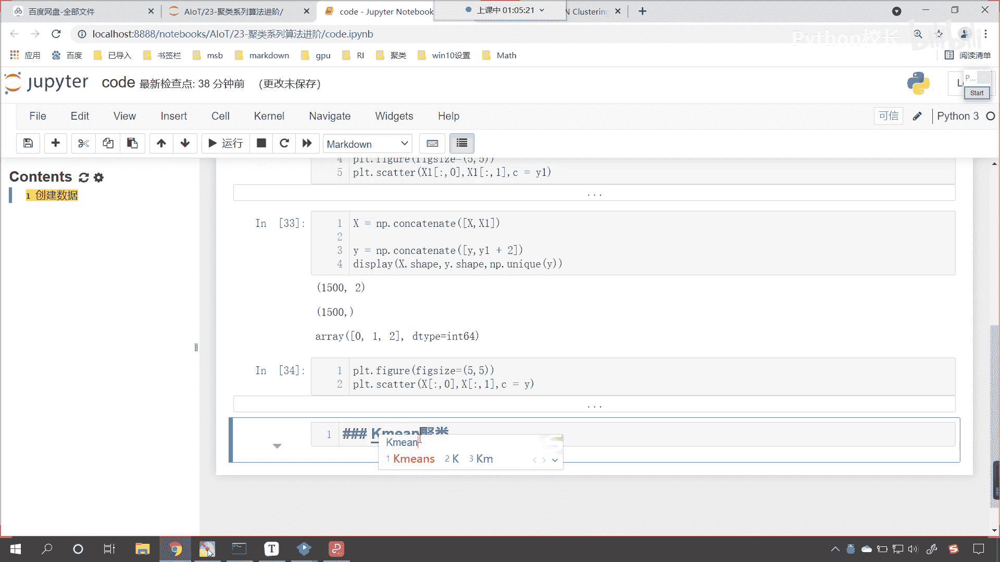

好不好好，那么k means我们就让它等于k means，我们来一个小括号，那我们把它分成三，咱们就把它分成三类，好不好，我们我们就看一下k means他的分类效果怎么样，在这儿呢咱们就调用feat。

我们将数据x放进去，然后训练完之后，咱们就使用k means对它进行一个类别划分，调用predict将x放进去，他得到的结果就叫歪盖，那怎么样呢，咱们plt把结果画出来好不好。

那原数据x冒号横坐标放进去，纵坐标放进去，c呢就表示颜色，颜色呢我们就给一个y杠，咱们就给一个类别啊。

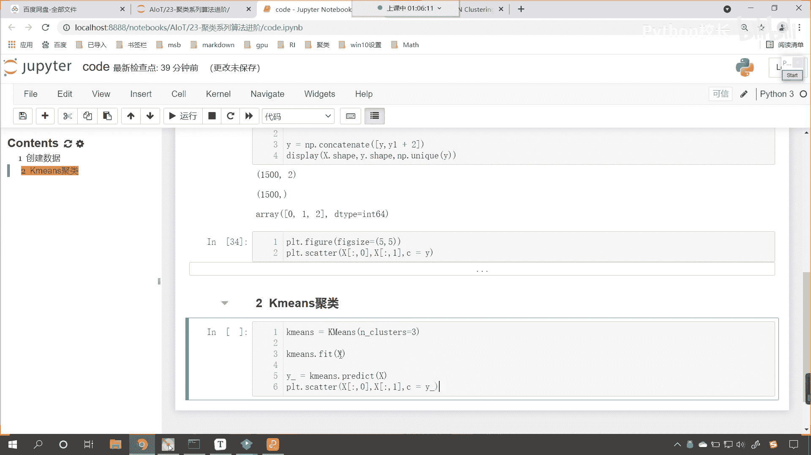

大家注意啊，看啊咱们的c呢指的是color啊，c指的是颜色，那因为我们我们计算出来的，看咱们计算出来的这个y杠，你看它表示什么呀，它是不是表示类别呀，那么它的类别是什么样的呀，它的类别是012是吧。

类别是012，那当我们在画图的时候，咱们给了一个参数c等于y杠，这个表示什么意思呀，这个表示呢咱们在进行绘制这些散点图的时候，我们呢根据类别是不是给它给它绘制颜色呀。

它的意思呢就是根据类别咱们来绘制颜色，那这个颜色呢这个颜色是默认的啊。

这个颜色是默认的，这个颜色呢它通过c map来指定，之前咱们在讲画图的时候，我们都说过哈，那如果说我们想要给它一个颜色，那其实这个y呢它指的是yellow。

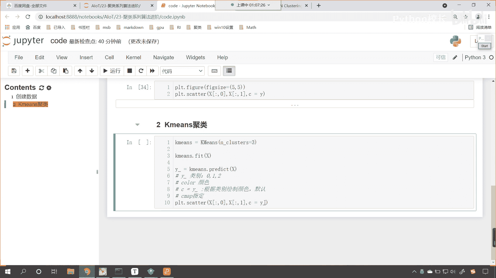

看y确实指的是yellow，但是你想要给y，你得这样给知道吗，你得看单引号，给一个y。

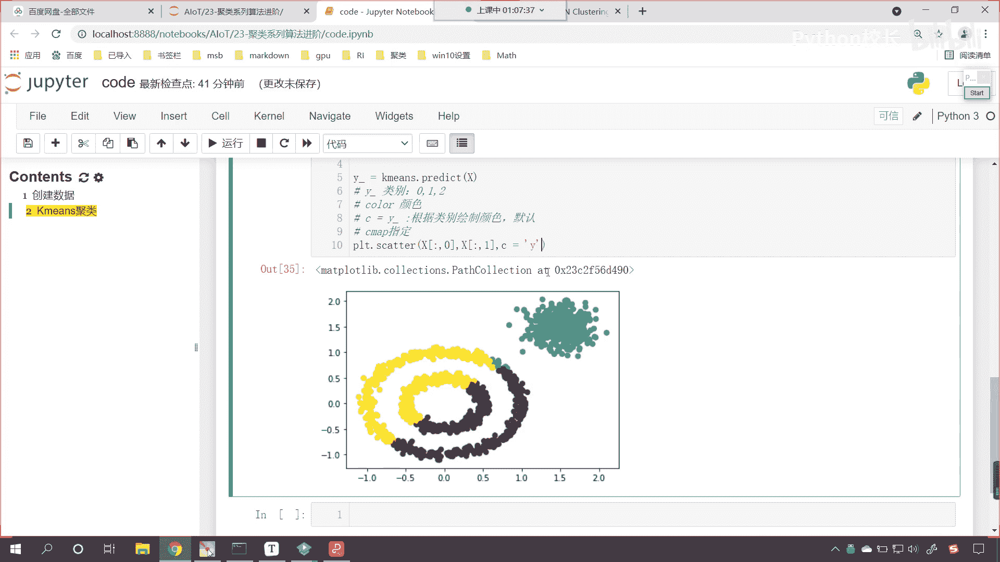

这个时候你看过一执行怎么样，是不是就全变成yellow了，看到了吗。

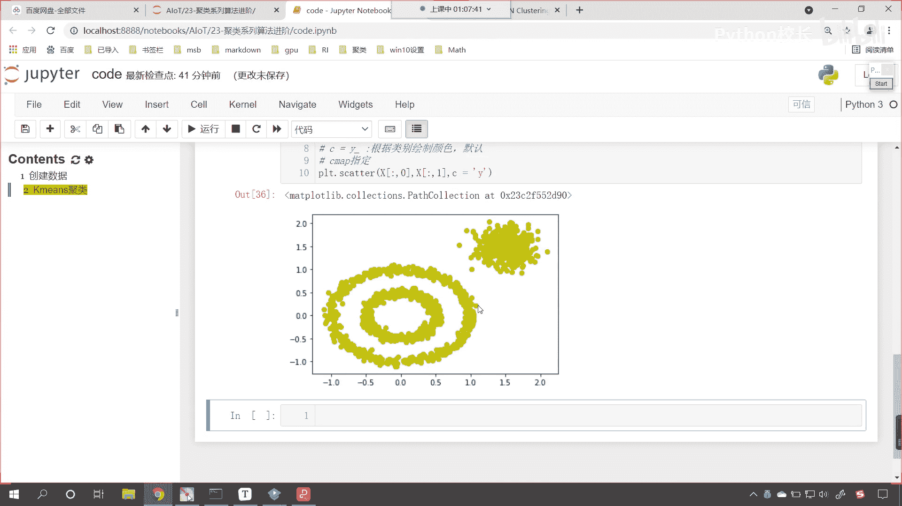

全变成yellow了，是不是啊，但是我如果要给y杠，这个就表示类别你分三类。

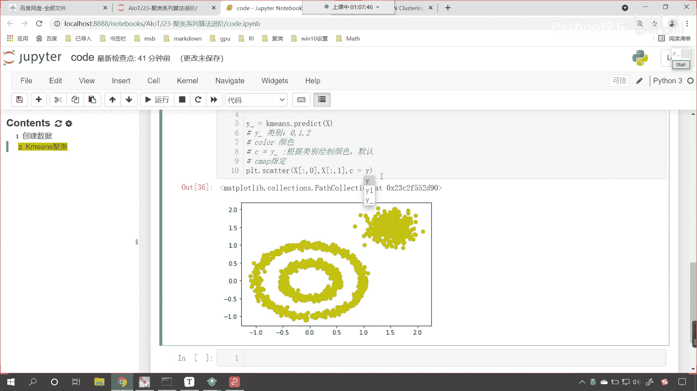

那是不是就代表三个颜色呀，看到了吧，那我们怎么去给他指定不同的颜色呢，可以通过c map。

c map里边，你看它有很多颜色，我给一个ocean，你看到了吧。

现在这就是海洋的颜色，这个右上角这个颜色呢它就没看见，知道吧，并不是他没有啊，是他没有看见，咱们调整一下尺寸啊，figure，咱们给一个figure size，我们给一个六和六。

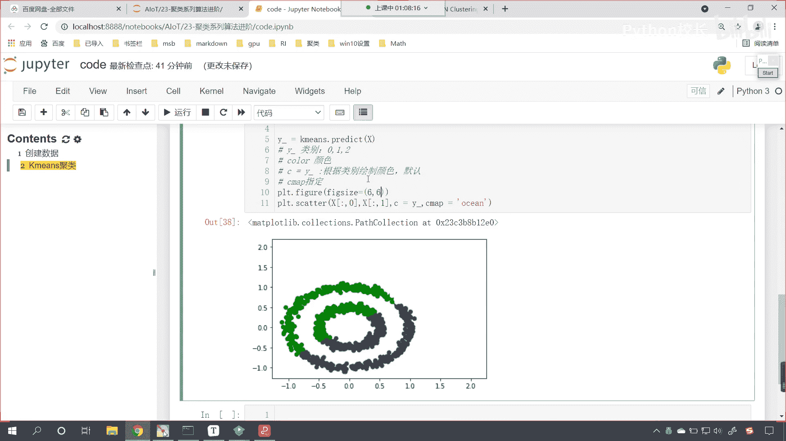

这个时候你看我一直行，那你看到了吧，现在看这半部分是不是就没了。

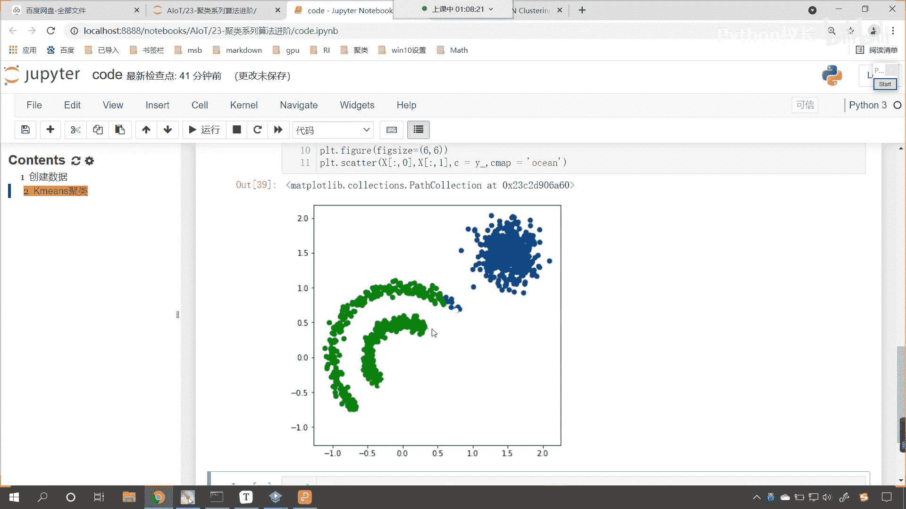

那我们还可以给它一个颜色，叫autumn a u t u m n。

你看一直行，看了这个是不是就是春天的颜色呀，那这个c map一共有多少种类别呢。

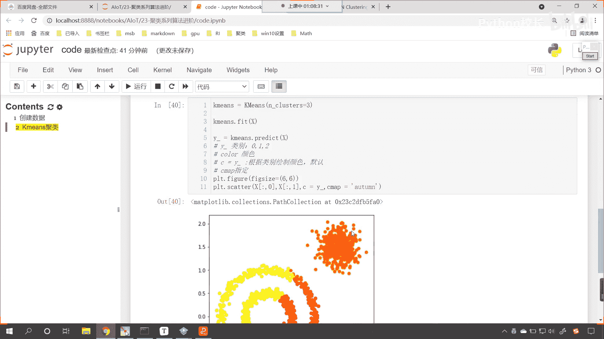

你看我往上滑，咱们呢就plt点，我们就调用这个color maps，你看我一执行呢。

这个里边有很多啊，你看我一直行，看到了吧，里边是不是有很多，看到了吧。

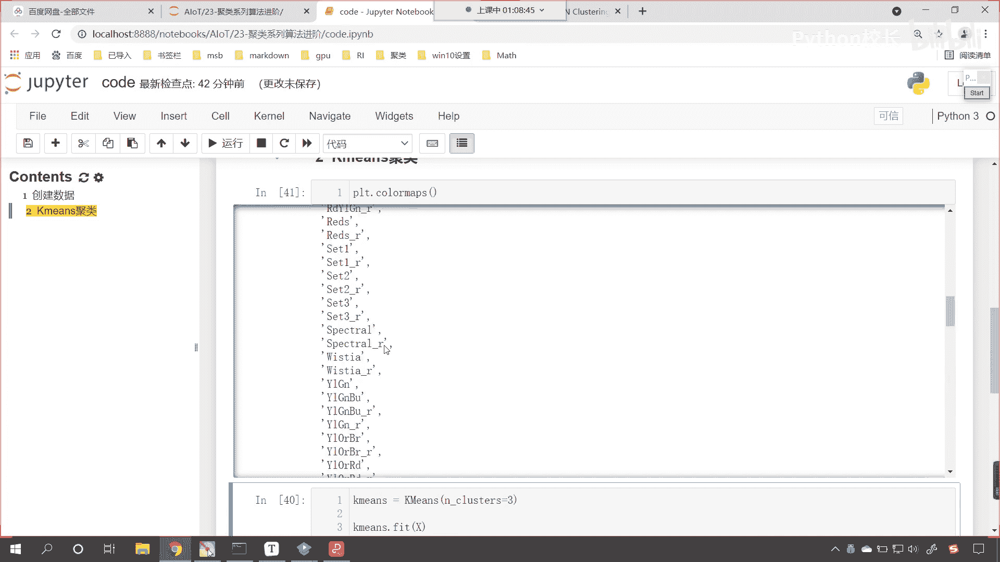

任意一个都可以选，咱们选这个啊啊ctrl c看到了吧。

然后在这来一个粘贴，你看ctrl v e执行，看到了吧，这就是这种颜色，你可以选其他的。

看到了吧，我们选一个，来咱们选一个cool warm，看一下这种是什么样的一个色调。

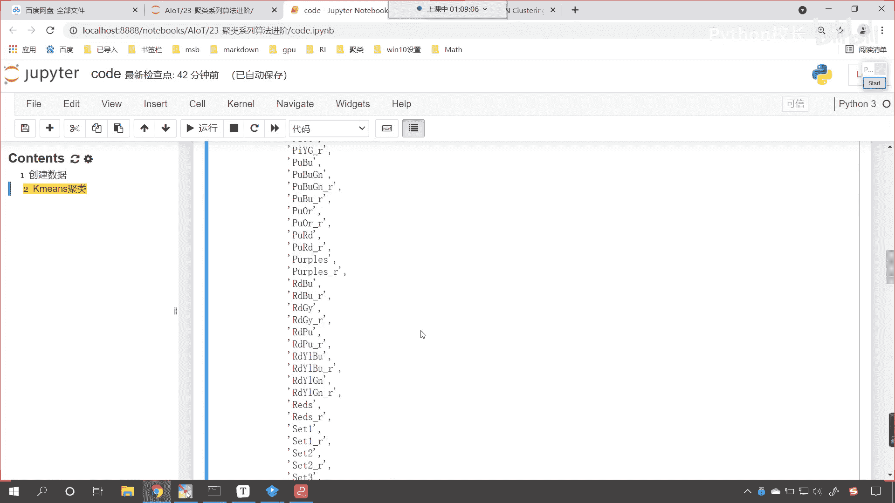

是不是双击合起来看ctrl v一直行，你看到了吗。

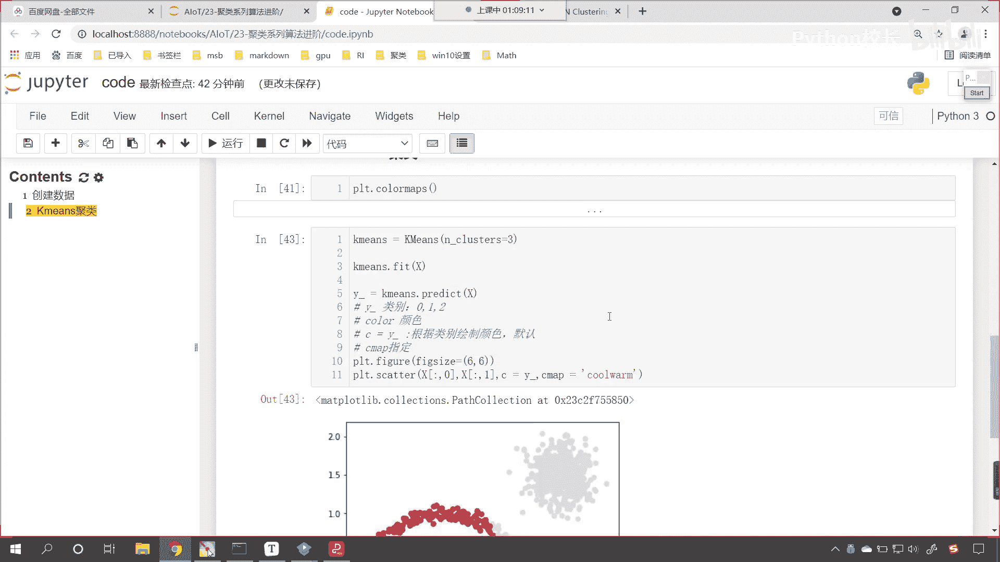

它就是这种颜色，当然咱们说这个颜色是不是也可以自己定呀。

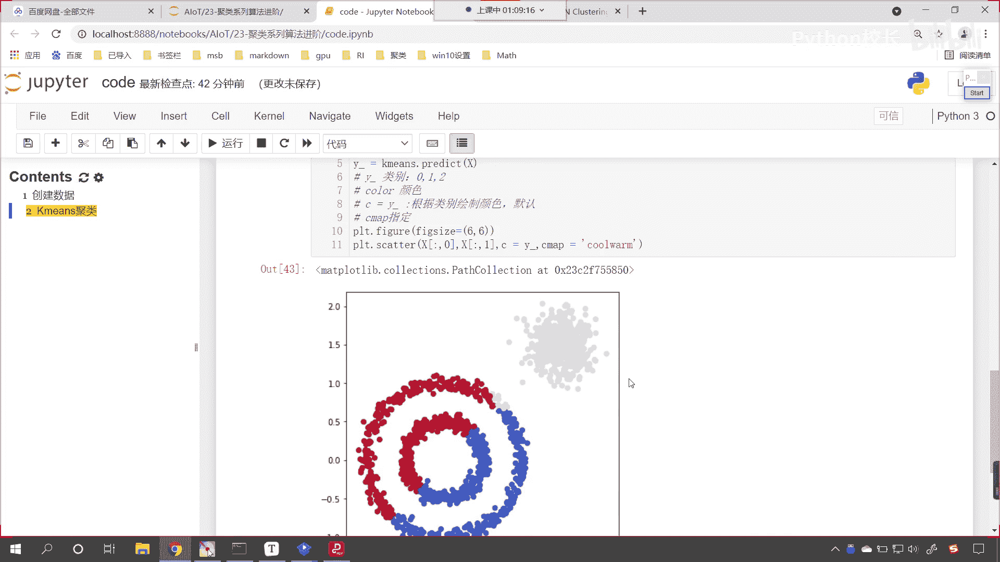

看了吧，这个颜色能不能自己定，当然能，这个时候得需要导包啊，我们from mat plot lib，从这个当中的colors下边c o l o r。

从这个当中呢咱们import这个import叫list color map执行。

把它导进来。

看到了吧，把它导进来，然后我在这给一个c map，我们创建一下，就等于咱们的list color map，在这个当中呢咱们就可以给颜色了，我给一个red红，我给一个绿，我给一个蓝叫做green啊。

蓝呢就是blue b l u e，然后呢c map我就用我自己生成的来给他操作。

这个时候你看我一执行看啊，咱们啊这个肯定给写错了是吧。

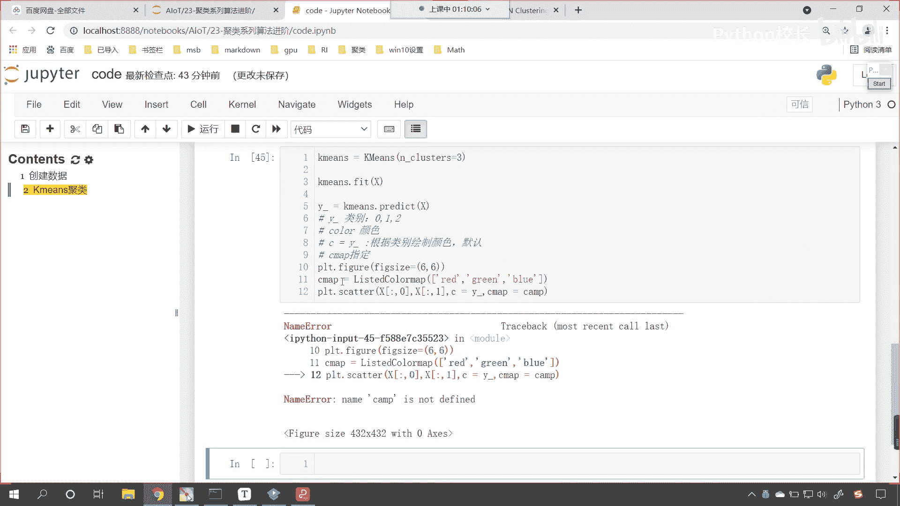

看c map写成了c a m p，调整一下位置来执行。

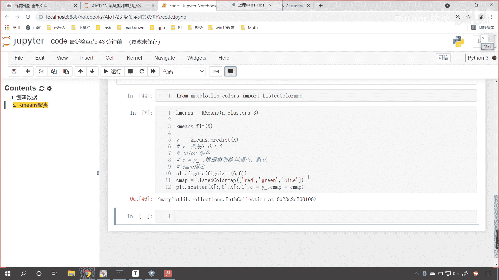

哎你现在能够看到红绿蓝是不是就指定了。

大家现在看咱们这个类别划分，你看出来了。

但是你感觉合适吗，看类别划分k means。

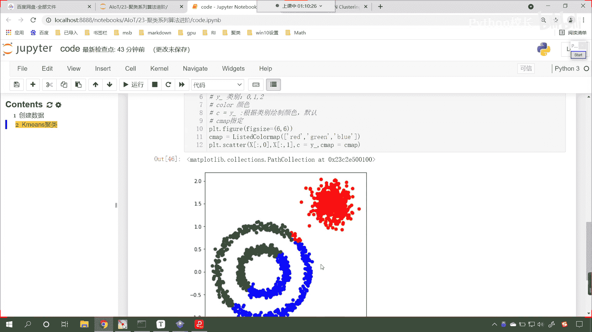

它做出来的效果是不是就是这种形式呀，看是不是看是不是。

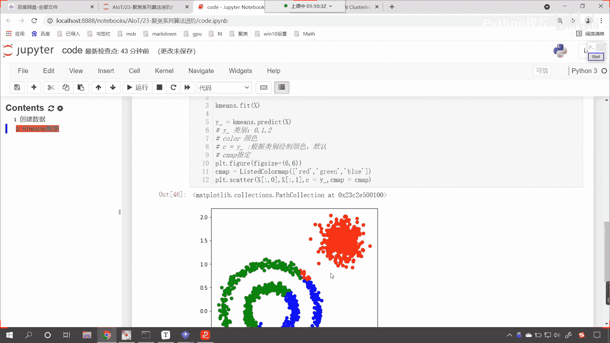

所以说呢咱们k means。

他在对于这类数据进行划分的时候，效果是不是就不好呀。

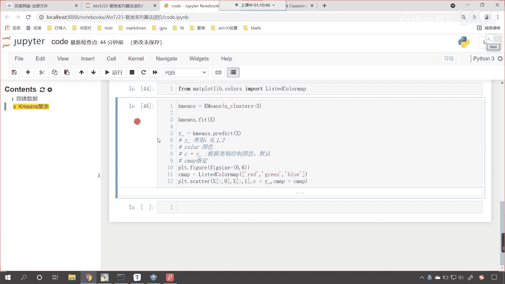