# P152：6-分层聚类概念原理参数介绍 - 程序大本营 - BV1KL411z7WA

来接下来呢我们继续啊，咱们的离群点呢它一定是-1啊，你看因为这个-1你看它是不是表示负数呀，你也能发现咱们画图画出来这个紫色的点，你看它是不是就相当于是离群点啊，因为它离得比较远，对不对。

还有咱们通过这个异常值，你看咱们通过这个异常值嗯，咱们呢也能够看到是吧，那个异常值点它就没了，看到了，通过这个嗯通过咱们这个条件过滤是吧，这两个点也就没了，这就更能说明咱们这个-1是吧，它呢是异常。

这点好，那么接下来呢我们继续看啊。

咱们看另一种算法，这另一种算法叫分层聚类，那我们先看一下分层聚类的概念，这个分层聚类呢它是层次化输出它的结构，这种结构呢，比我们平面聚类返回的非结构化聚类，它更具有信息性，你看这里边儿就说到了。

一个这个专业专业化的词叫做信息性，啥叫信息性呢，我们往下看啊，这个分层聚类呢又译为系统聚类法，这个聚类分析它是聚类分析的一种方法，其做法呢就是开始把每个样本点作为一类。

然后呢把最靠近的样本点儿首先据为小类，再将以聚合的小类按照其间距再进行合并，不断地继续下去，最后呢把一切子类都聚成一个大类，咱们在讲这段话的时候，它里边的这个专业术语比较多，那我们举了个例子。

你看咱们的白姓和红杏是不是都是姓黄元帅，红富士蛇果是不是都是苹果，那这个苹果和杏儿是不是都是水果，那这个就像这个就像呢咱们在进行聚类的时候，咱们让两个挨得近的进行合并，看到了这里，你这两个不是挨的近吗。

你看白杏和红杏是吧，他两个挨得近，那怎么样合到一起，黄元帅，红富士蛇果，他们三个挨得近，合到一起，合到一起之后，这个就是姓，这个就是苹果，那这个杏和苹果有没有相似性呢，如果要有相似性，那么就继续合并。

如果没有相似性，那他俩就是两类了，明白吗，所以说这就是咱们分层聚类，你看我们看完这个图片之后呢，咱们再来看一下啊，上面这句话，他的做法就是开始把每个样本作为看到了吧，开始把每个样本是吧，作为一类。

然后呢，把最靠近的那这这个地方所描述的最靠近，我们是不是就可以理解距离呀对吧，你离得近，ok聚到一类，你聚到一小类之后呢，然后呢就是小类和小类再进行合并是吧，这就像我们下雨一样，天上有很多云是吧。

快下雨的时候是不是就是水蒸气粘到一起，然后就变成小雨滴，小雨滴是不是再粘到一起变成大雨滴了是吧。

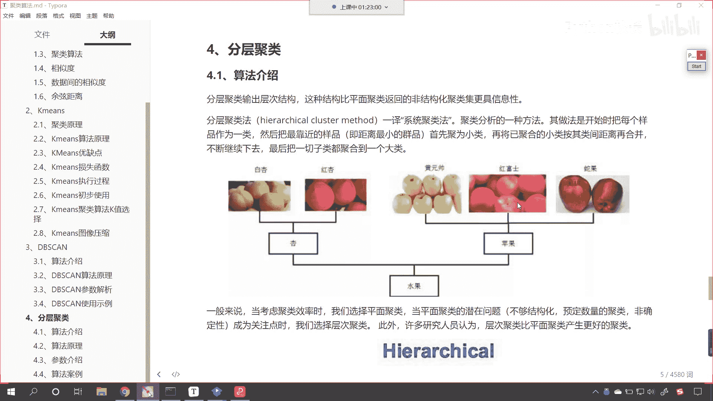

一般来说呢咱们当考虑聚类效率的时候啊，考虑聚类效率的时候，咱们选择平面聚类，这啥是平面聚类呀，就是咱们的k means，咱们一开始学到的k means，他呢就是平面聚类啊，k means就是平面聚类。

那我们的db scan它属于是平面聚类吗，看咱们的db can属于不属于平面之类啊，看咱们的db scan呢，它也属于是平面聚类，这个平面聚类呢，它往往是根据距离来进行这个操作的哈。

一般情况下说到平面之类，哎我们往往指的就是k means，当咱们平面举类存在潜在的问题，比如说不够结构化预定数量的，预定数量的举类非确定性的时候，那么我们选择层次聚类，有很多研究员呢。

他认为层次举类比咱们的平面举类效果更好，因为咱们的平面举类，也就是说咱们现在所介绍到的这个呃，这个分层聚类，那么它呢嗯对于数据的划分是吧，它可以结构化看，这是现在我们说到的结构化，我们不举例子。

各位小伙伴你感受不到啊，好，那么大家呢先对于咱们的分层聚类。

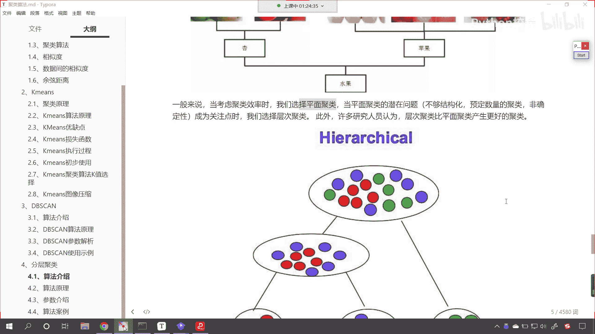

有一定的了解就好啊，你看啊你看咱们这个图是吧，咱们分层聚类是吧，这个就是它是从哪儿到哪儿呀，看到了咱们这个呢它呢就是从下往上啊，它就是从下往上，我们首先呢把红色的点儿分到一类，蓝色的点分到一类。

那咱们再根据性质，这个红色的点和蓝色点是否可以分到一类呢，哎分到一类了，分到一类之后，那么这一圈儿我们就把它当成一个整体，大家注意啊，分层聚类呢咱们呢可以认为是由少倒多，看到了吗，由少到多，由下到上。

看咱们是由下到上，唉我们是哎这种方式这种嗯这个逻辑在进行，凡是它把它划归到一个圈当中了啊，你现在能够看到，这个是不是划归到一个圈当中了，要是把它划归到一个圈当中了，我们要把它当成一个整体。

你看这个呢就是一个整体，那一开始的时候，我们会有多个点儿经过咱们这个划分是吧，他就呃这个相近的这个点都变成一个整体了，然后我们再次进行划分的时候，咱们其实就是对于这个整体在进行划分，你看所以说这叫什么。

所以说咱们这个算法是不是才叫做分层聚类呀，看到了吧，一层一层的是吧，然后这下面这个是不是属于一层，再往上又属于一层，再往上这个是不是就属于是高层了。

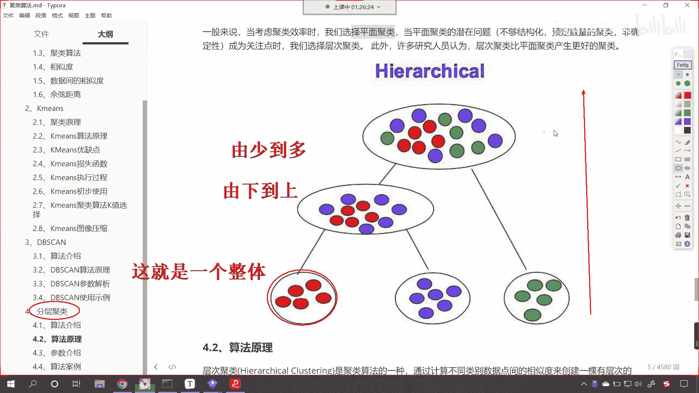

这个呢是咱们这个分层聚类算法的概念介绍。

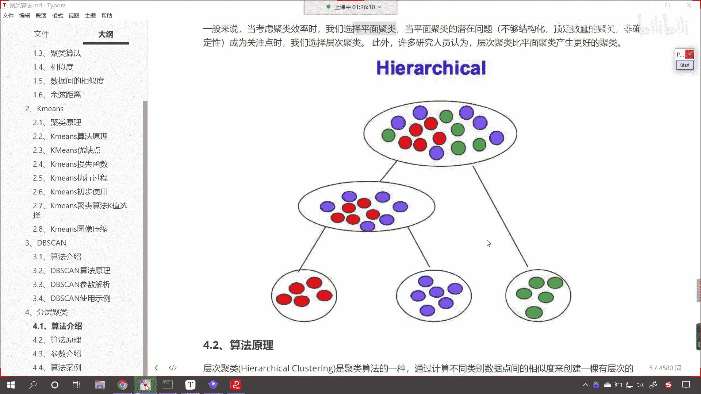

接下来我们看一下它的原理啊，好那么咱们的层次聚类呢，它其实也是聚类的一种，那呃咱们通过计算不同类别数据点间的相似度，来构建一棵有层次的嵌套聚类树，那在聚类数当中呢，不同类别的原始点数据。

不同类别的原始数据点是树的最底层，那这个数的最底层呢就是咱们这儿了，看到了吗，这就是树的最底层，树的顶层呢是一个聚类的根节点，你看这就是树的顶层，咱们在创建聚类数，有自下而上合并，还有自上而下分裂。

一般情况下，一般情况下常用的都是自底向上的合并，一开始的时候你看有一群底，是不是啊，那然后怎么进行合并呢，你看这两个点离得比较近，合到一起了，这两个点离得比较近，合到一起了，大家注意啊。

有可能看不是两个点儿，有可能是不是多个点呀，对不对呀，你看有可能是多个点啊，就是你这合并不一定是两个点，我们画图举例是吧，哎它是两个点，然后呢继续向前再进一步，咱们就发现呢这两类点看到了吧。

就是这两簇它离得比较近，是不是就可以划归到一类了对吧，然后下面这四个点是不是划归到一类了，好那么到这儿就停了，你想到这咱们的数据被分成了几类呀，看到这儿这个数据是不是就被分成了两类啊，对不对。

因为到这儿停了没有，再向下一步，它是不是就分成两类啊，上面四个点一类。

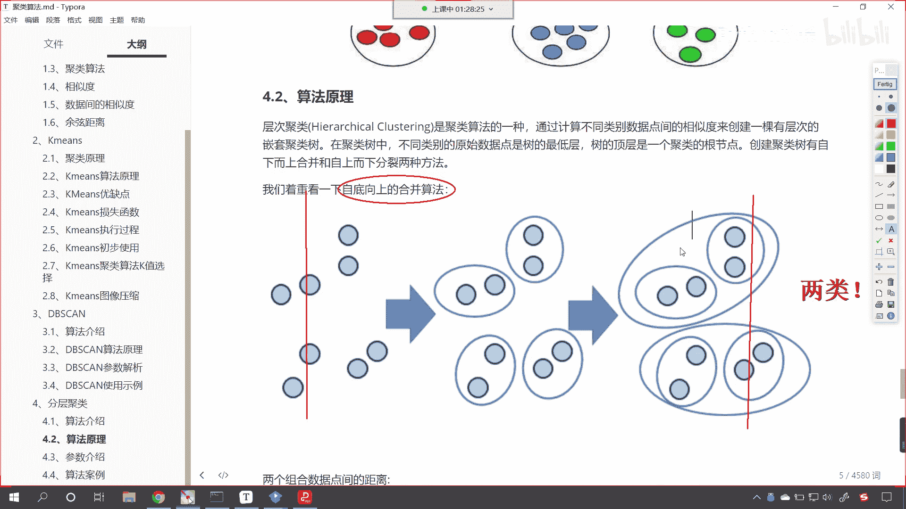

下面四个点一类，对不对好，那么我们这个算法无论是k means还是db，看还是咱们的分层聚类，还是咱们的分层聚类，我们都能够看到，你看这有一个词叫什么相似度，当我们在提到相似度的时候。

我们是不是指的就是距离呀，对不对，那你看啊咱们两个组合数据点间的距离，它有哪几种方式呢，有这个single link，complete link。

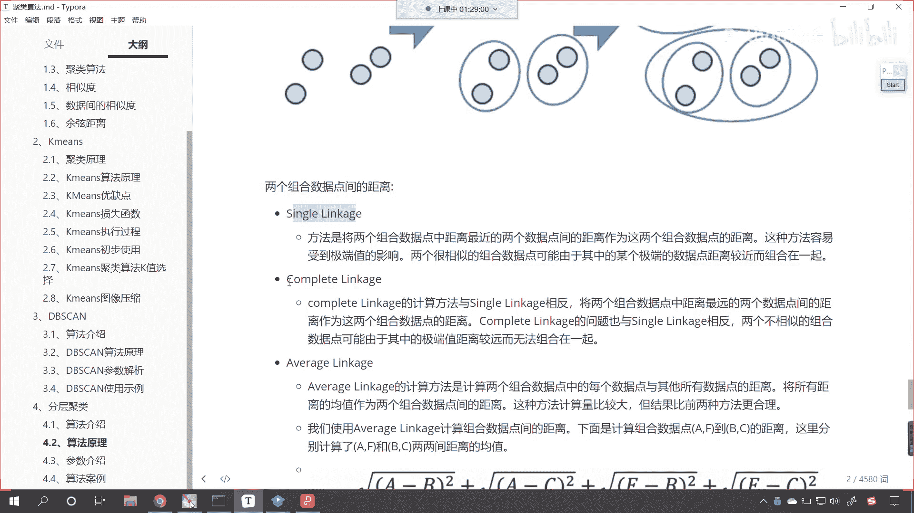

average link，看有这几种方式，那这个single lesingle linkage是吧，这种表示什么呢，是将两个组合中，两个组合数据点中，距离最近的两个数据点的距离作为它的距离。

那也就是说最近距离是不是啊啊，这种方式容易受到极端值的影响是吧，你看它呢就是距离最近，那这个complete呢和咱们的single相反，将两个组合数据点中，距离最远的两个数据点间的距离。

作为这两个组合数据点的距离，啥意思。

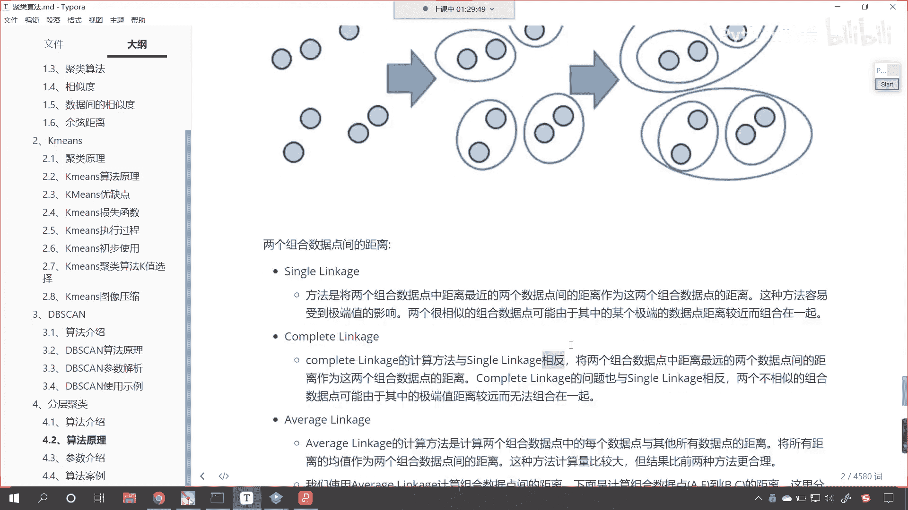

看啊，咱们上面这个你看它是不是就是一个组合呀，看到了吧，我们这两个点是不是属于一个组合，下面这两个点是不是也是一个组合呀，看咱们画图画出来啊，看画图画出来上面这个是不是一个组合。

下面这个是不是一个组合呀，他俩的距离该怎么算呢，如果要是single link，那这个距离就是两个近的这个距离，如果要是complete就是谁呀，用这两个比较远的这个点作为距离，明白了吗。

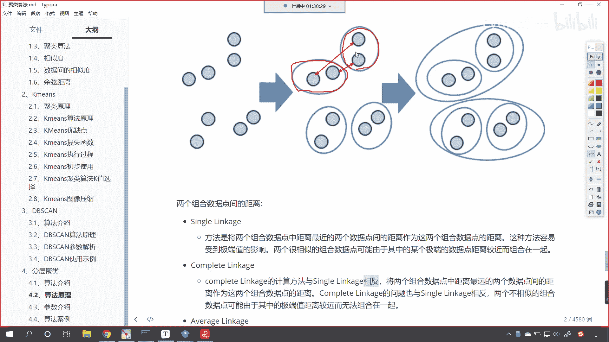

看到了吗，一个近一个远，是不是，那还有下面叫average，average是什么，你看这个average呢就是计算所有点的距离，求平均值，很显然咱们average是不是就是这个考虑的。

他是不是考虑全部点呀，看到了average，计算两个组合数据点中，每个数据点与其他所有数据点的距离，看到了吧。

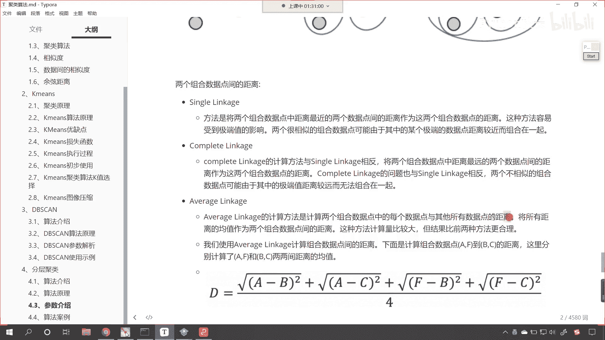

计算所有的距离，然后怎么样求平均值，用公式来表示，那就是d就等于四分之a到b的距离，a到c的距离，f到b的距离。

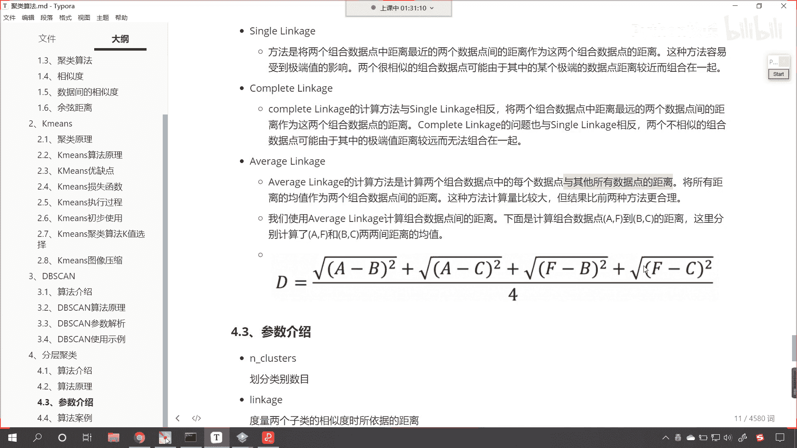

f到c的距离，看就是这样是吧，那所以说现在你就知道。

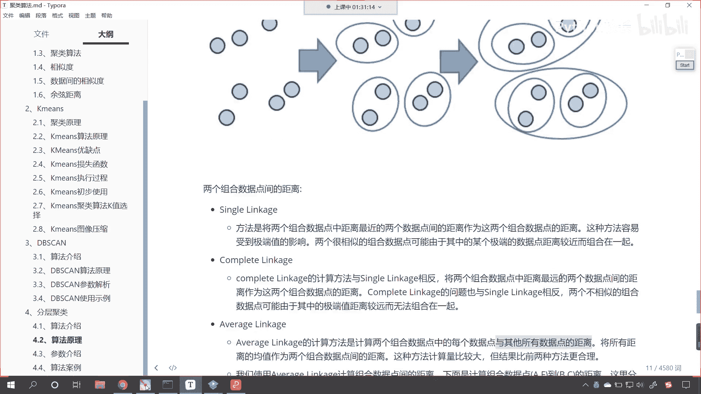

咱们两个组合数据点的距离，它的度量标准评价指标是怎么大了吧，是怎么一回事儿了吧，那这个计算量大是吧，这个你不用担心啊，知道吗，这个不用担心，因为计算机就是做这件事对吗。

现代计算机的计算性能是越来越强悍了啊。

好那么接下来呢我们看一下咱们的参数介绍啊，这个参数介绍呢第一个是n cluster，就是划分的数目，这个和我们key means一样，link值呢看linkage哎，就是咱们这个度量两个子类的相似度时。

所依赖的距离，就是说你到底用哪个距离是不是好。

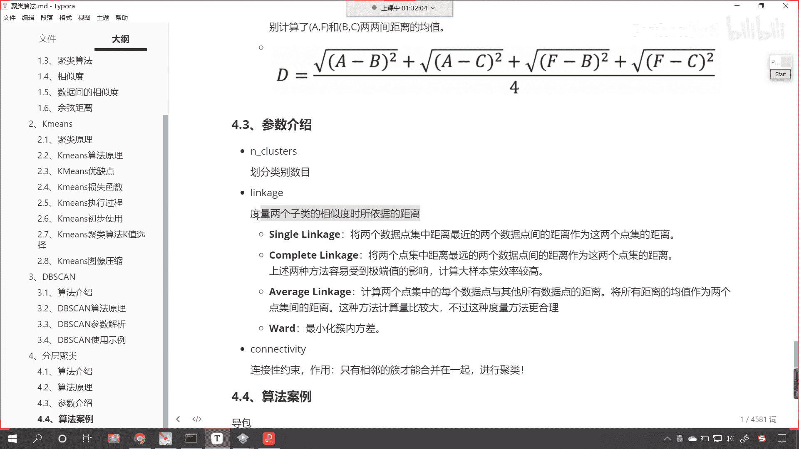

那么它有这几种，single complete outrage，还有一个叫word，这个word呢就是最小化促内方差，你知道什么是方差，这什么是方差呀，是不是就是咱们数据的波动程度呀对吧。

你一簇内的点是吧，你看你一簇内的点，如果每个点和每个点差距很大，那么这个方差就会很大，好比咱们举一个例子，你们班参加数学考试是吧，班里边50个人，每一个人都考了150分，这个时候我们在计算方差的时候。

你告诉我方差是多少呀，方差是不是就是零呀对吧，为啥，因为所有的人都一样，都是150分没有变化是吧，没有波动是吧，那所以说这个方差就是零，那这个班肯定作弊了是吧，要要么作弊，要么都是清华北大的。

那么如果说这个方差大是吧，你看有的人考零分，有的人考150分是吧，那这个时候呢哎就说明是吧，这个老师教的不好是吧，教出来的学生有的人考的高分，有的人考的低分好，这是咱们linkage呢。

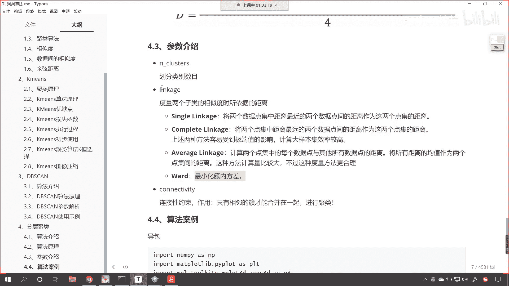

它的作用就是咱们度量相似度的方式啊。

这叫相似度，相似度一般都是距离啊。

我们计算距离，计算相似度又有不同的方式是吧，哎这里边分别进行了介绍，还有呢还有一个参数叫connectivity，这个呢叫做连接性约束，只有相邻的醋才能够合并在一起进行聚类，那么我们分层聚类呢。

它对于数据呢，诶呃这个有一定的这个结构化的一个影响啊，好那么嗯到到这里呢。

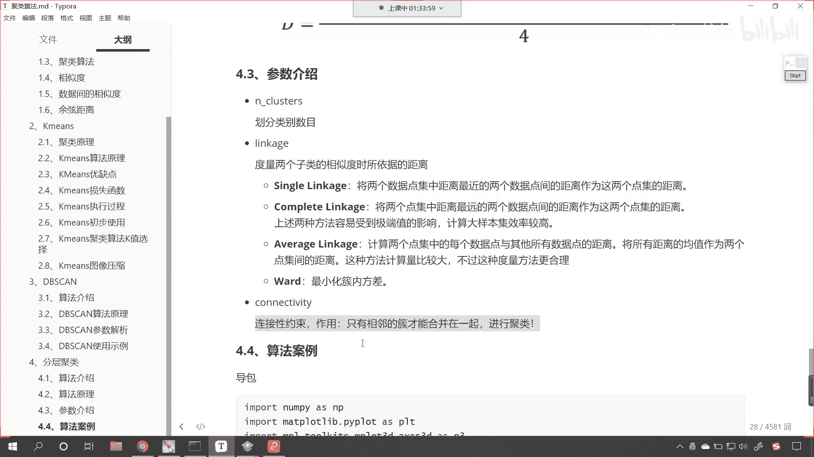

我们就对于分层聚类算法。

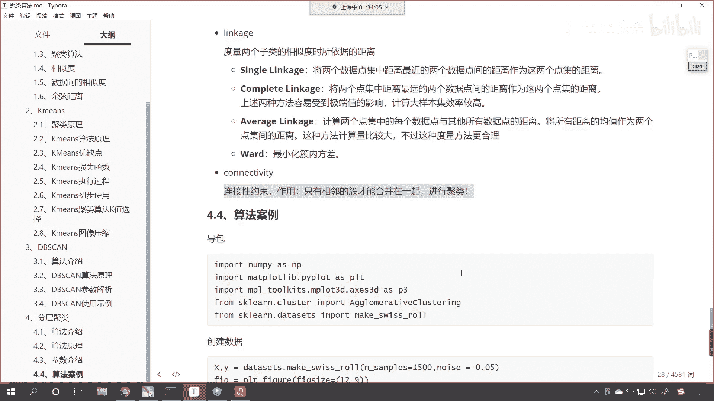