# P153：7-Kmeans聚类瑞士卷数据效果 - 程序大本营 - BV1KL411z7WA

来来来，各位小伙伴，接下来呢我们就实际的操作一下，咱们的分层聚类啊，我们看一下这个分层聚类和咱们的k means。

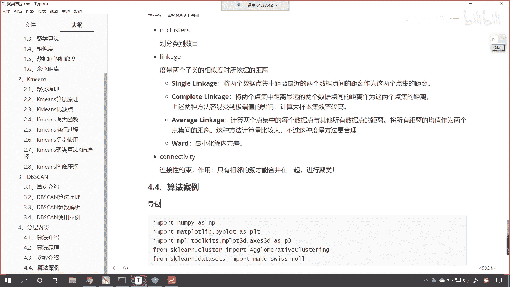

它到底有什么样的区别，咱们上面介绍到了分层聚类。

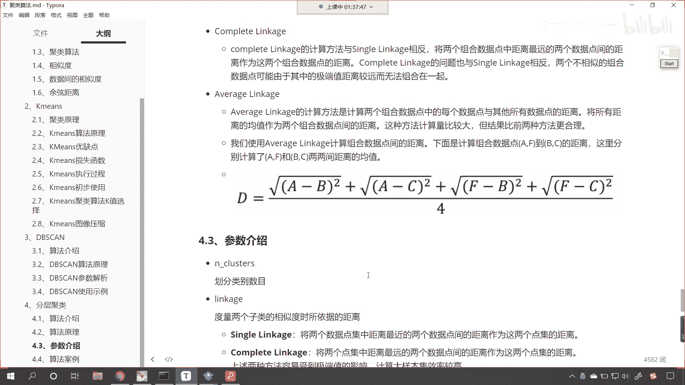

它的实现方式，还有原理，以及我们对于它的参数进行了介绍，那么我们就通过代码来进行验证一下。

好来咱们回到代码当中，咱们在这儿呢来一个三级标题好，那么我们这个三级标题呢就是分层聚类好，那么对于分层聚类呢，我们首先来一个四级标题，咱们呢首先给它创建一个数据，那创建数据这儿呢。

咱们先进行相应的导包好不好，那我们import numpy as np，然后呢咱们import，matt plot lib，点piplot as plt，然后呢from sklearn。

咱们从clustering，咱们导一个包，那我们这个分层聚类呢，就叫做大家看叫这个叫做angular monitor clustering，这个呢它呢是自底向上的聚类啊，这叫做自底向上嗯的聚类方式。

导完包之后呢，我们再将数据导进来，from sk learn data sets，我们从这个当中导入一个方法叫做make，它有一个叫make下划线，switch roll，那这个叫什么呀，叫瑞士卷。

你有没有吃过瑞士卷呀，有没有吃过瑞士卷，那我们这个数据呢它是一个三维的数据，想要把它绘制出来，咱们呢把3d引擎给它导进来，这个呢叫做import m two kids的3d点。

这个axis咱们从这个嗯当中呢，这样啊我们直接将，叫from从axis 3 d当中，咱们import axis 3 d，这个必须得导进来，你可以不创建它，但是呢我们必须导进来执行一下。

然后呢咱们就make使用咱们的switch roll，我们呢创建一个数据，咱们呢多给点给他1500个点，然后呢我们给一个noise，这个noise就是噪声0。05，这个就相当于这个数据的一个波动程度。

用xy来接收一下它，打印输出一下print np。uni q，我们看一下它为我们生成了几类啊，调用uni q将y放进去，然后呢咱们就创建一个三维的视图，我们给它一个尺寸吧，那咱们就p l t点。

咱们就调用figure，在这个当中呢给一个figure，咱们给一个figure size，我们这个figure size呢，我们让它是12和九，然后呢嗯此时呢咱们就调用p o t。sub plot。

我们给它一个一行一列第一个，然后里边呢给一个projection，给它是3d的视图，这个时候你看就有了好，那么我们起个名就叫a3 ，有了这个a3 ，咱们现在呢就可以像a3 当中绘制散点图了。

s c a t t e r，咱们将x中括号的这个第一个维度，横坐标取出来，然后纵坐标取出来，然后呢它的z轴z轴就对应二，然后我们给一个颜色c就等于y。

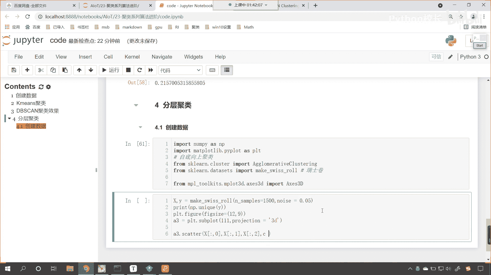

这个时候你看过一执行哎，现在你就能够看到一个瑞士卷就出来了。

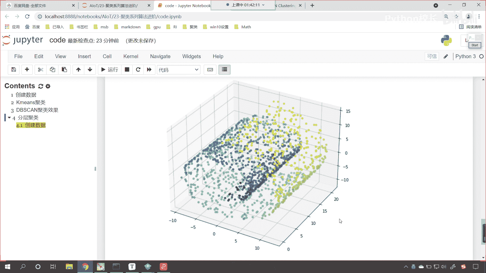

是不是我们看一下咱们是这个，我们看一下咱们的y啊，我们就能够发现，你看这个y的类别是不是有很多呀，看到了吧，uniq y这个y的类别有很多，好，那么接下来呢。

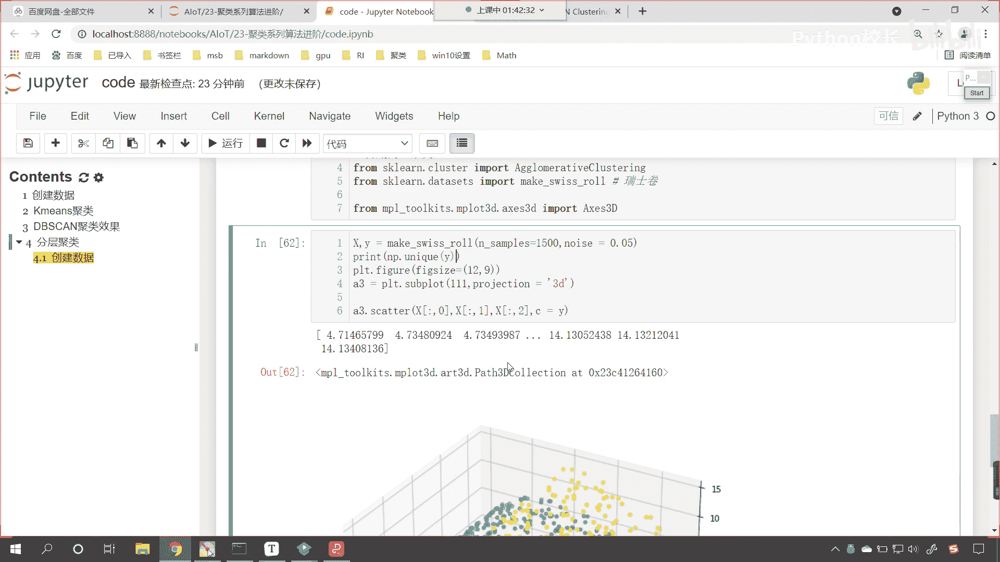

看接下来咱们进行什么样的操作呀，你看这个视图角度不太好。

咱们调整一下它的角度就可以了啊，那就是a3 点，view init，咱们把它调整成十和-80。

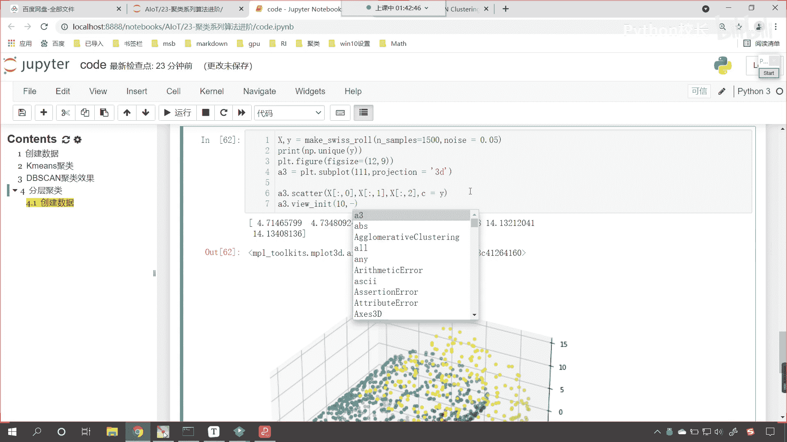

这个时候你看我再来看唉，现在你来看，咱们是不是就是从这个角度去看它了呀，现在你发现看此时你再来看咱们这个数据，看到了吧，这个视角是不是就好一点了呀，你看我们这个点它分成了几类呀，你看黄色的是不是一类。

然后再往下是不是就变绿了，然后变蓝，然后变成这个紫蓝色，最后是不是就变成紫色了，也就是说咱们的数据是不是分成好几好几类呀，对不对，你看这个数据呢。

它就分成好几个类别是吧，可不仅仅是八类啊，那这就得看我们你看这个4。71是吧，4。714是吧，他这个就是我们在打印输出的时候，np。uni q，那我们得看一下它有多少个数据，我们来一个length啊。

打印一下它的长度，看这个时候一执行，大家看咱们就知道他有1500个，看到了吧，1500个，也就是说它其实呢是1500类，但是为什么为什么咱们画出来图，我们能够看到它的类别是不多的对吧，为啥呀，你来看啊。

你看这个4。728和这个4。73，他们是不是很像呀，对不对，你看到了它很像，最后一直到多少，是不是一直到这个14。13呀，对不对，你看一直到14。113，所以说我们可以把这个黄色的是吧。

把它当成一类是吧，这个颜料呢嗯是一点一点增加的，对，我们这个呢，其实每一个颜色和每一个颜色都是不一样的。

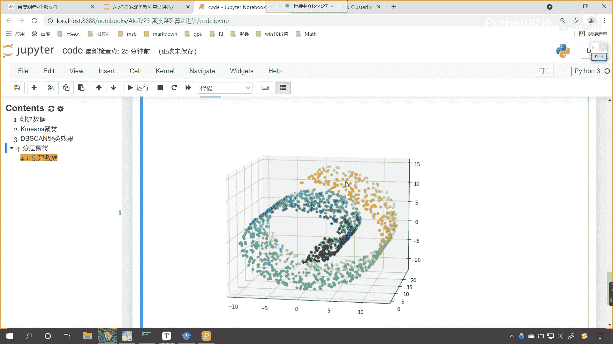

但是呢它接近是吧，那我们能不能使用咱们讲的聚类算法。

咱们把这些点是吧。

就是相近的点，我们给它聚到一起呢来，那么咱们就使用咱们的k means，我们看一下效果怎么样啊，咱们来一个四级标题，咱们使用k means，我们进行聚类。

那当然这个k means就是作为咱们的一个对比了，是吧，那我们就声明k means，嗯就等于k means，我们把它分成几类呢，咱们给一个n cluster，咱们把它分成六类，当然分成八类也是可以的。

然后调用k means我们的feat方法，咱们将数据x放进去，然后调用k means的嗯这个predict方法，你看我们可以调用它的predict方法，也可以调用它的labels labels。

就是它的目标值，咱们起个名叫歪盖，然后呢我们就开始画图啊，那此时咱们画图呢，我们可以声明一个这个子视图，那就是figure，就等于p t点调用figure嗯这个方法。

然后呢给他一个figure size 12和九，然后调用figure这个图片，此时呢我们可以调用它里面有一个方法，大家看看它里面有一个方法叫做add sub plot，a d d下划线。

su sub plot，小括号，咱们直接给一个projection，我们让它等于3d，你看上面咱们创建子视图，是不是调用的sub plot，那我们可以调用它的add sub plot。

这个函数也是可以的啊，那么添加了之后呢，咱们接收一下，你既然添加了一个子视图，咱们依然起个名叫a3 吧，然后呢咱们向a3 里边绘制散点图scatter，那就是x中国二冒号零，x中括号，冒号一。

x中括号冒号二，颜色类别呢，咱们就给y杠看这个y杠就是咱们这个k means，它呢预测出来的类别，那视角呢咱们也调整一下，view in it。

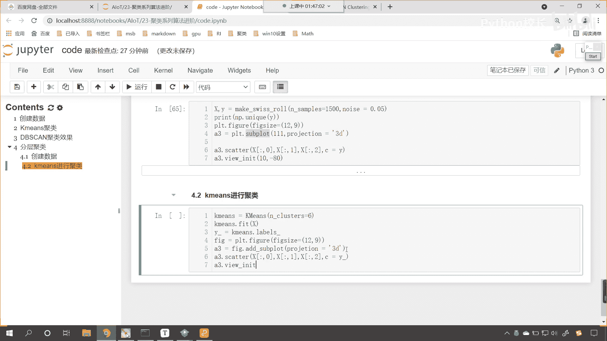

我们给十给一个-80，这个时候这个角度刚刚好看一下，咱们某一个地方给报错了是吧，figure。add subplot。

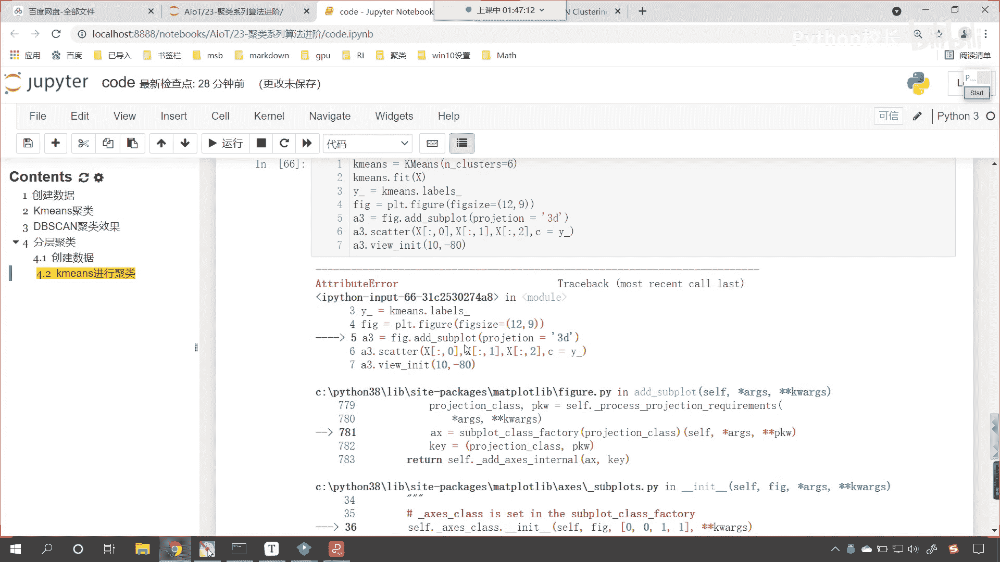

咱们看一下啊，has no projection。

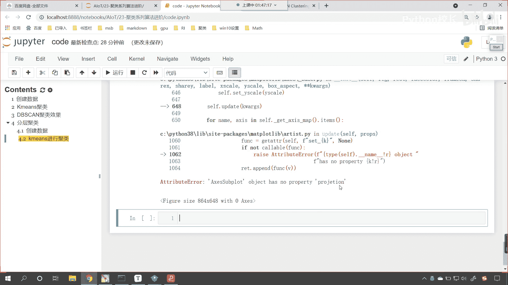

我们给写错了，咱们少一个c，看到了吗，projection这个时候我们再来执行，大家看是不是就没问题了呀，看到了吧。

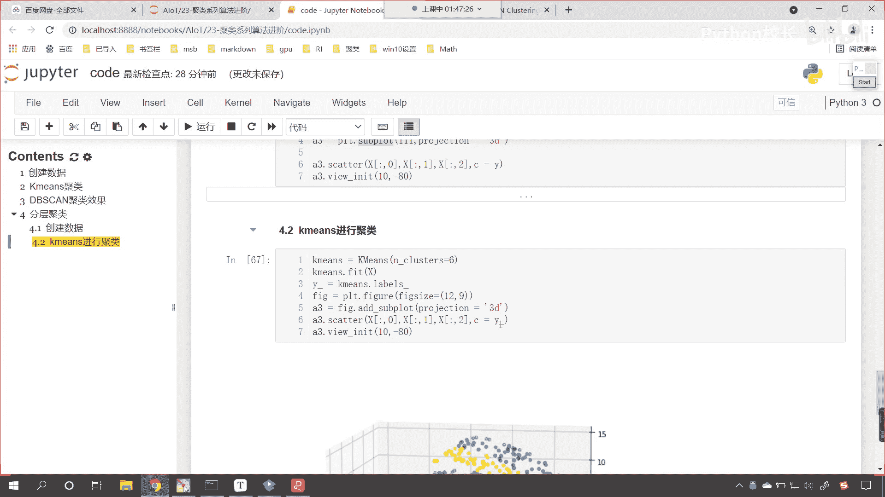

我们调用projection，你看是不是就没问题了，大家看咱们这个效果啊，你看这个效果它是怎么进行分类的呀，看到了吗，它是怎么进行分类的，你看我们这个瑞士卷，看咱们这个瑞士卷，你就能够发现啊。

他是不是有有分层的这种效果和感觉呀，现在你就能够发现，你看黄色的这一类底和咱们下面这个黄色的，它是不是给这个就相当于是给跨层了。

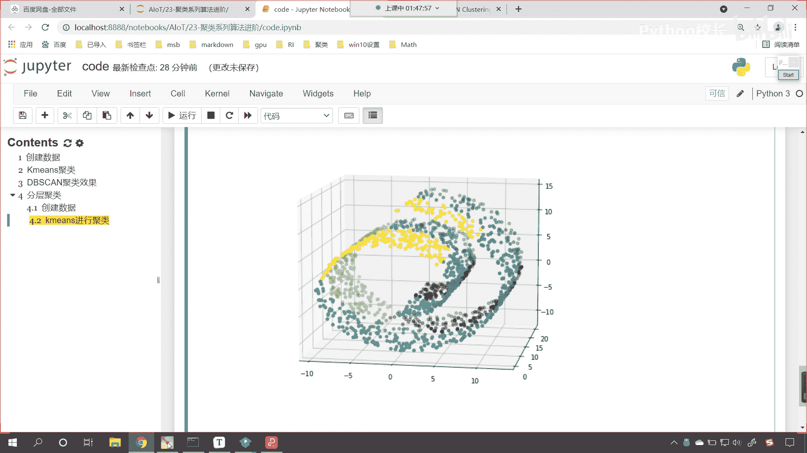

对不对呀，看到了他给怎么样叫跨层了啊，看到了咱们你看我们画图来说明啊，看就是这部分点儿，你看这是不是在瑞士卷，是这个最上面这一层呀，因为你瑞士卷都是一层一层剥开吃，是不是。

还有你看这是不是他这个里边那层呀，那这个是不是它被划归成黄色了呀，我们希望划分的时候怎么划分呀，看咱们希望划分的时候，他不要跨越它这一层，看我们希望呢划划归的时候是吧，他这样来划分是吧。

你看他把这一个怎么样划归成一层，然后呢这划归成一层，然后呢这划归成划归成一层，就像看就像咱们上面创建了数据。

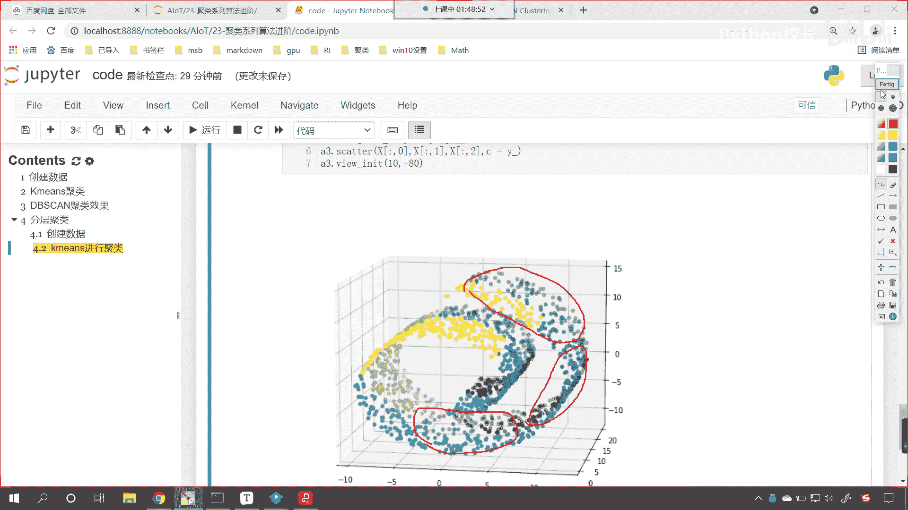

你看我们创建了数据。

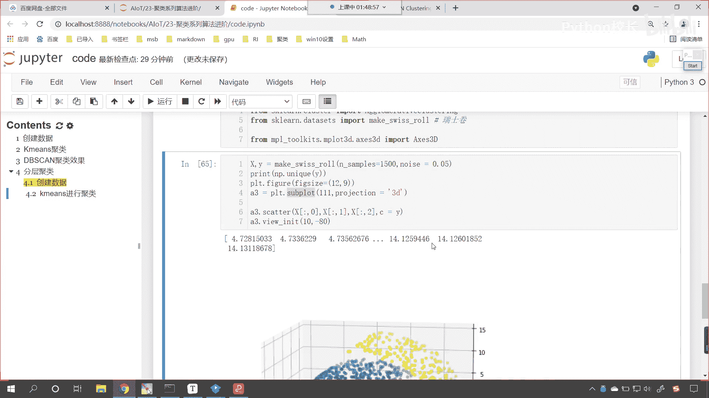

你看咱们所创建的数据，你能够看到它是什么样的特征呀，这是不是紫色的，是不是一层，上面这个是黄色的，是不是一层呀，然后呢这是不是又是一层，对不对，然后这个紫色的是不是属于是这个这个青色的。

是不是属于是一层呀，对不对，也就是说你看这既然是瑞士卷儿，它是不是就沿着瑞士卷的这个方向，在进行化层呀，你看这是不是瑞士卷的方向，看到了吗，这是瑞士卷的方向，对不对，它就沿着这个方向是吧。

哎一段一段给它解开解开吧，解开解开，给它分类，那我们刚才使用k means，咱们的k means有没有实现这种效果呀。

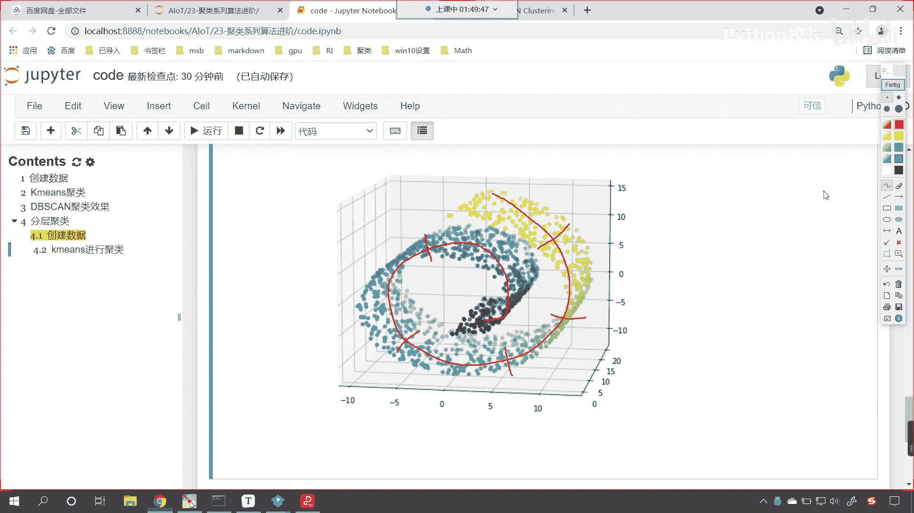

很显然k means是没有实现这种效果。

对不对。