# P163：2-线性代数之特征值特征向量分解 - 程序大本营 - BV1KL411z7WA

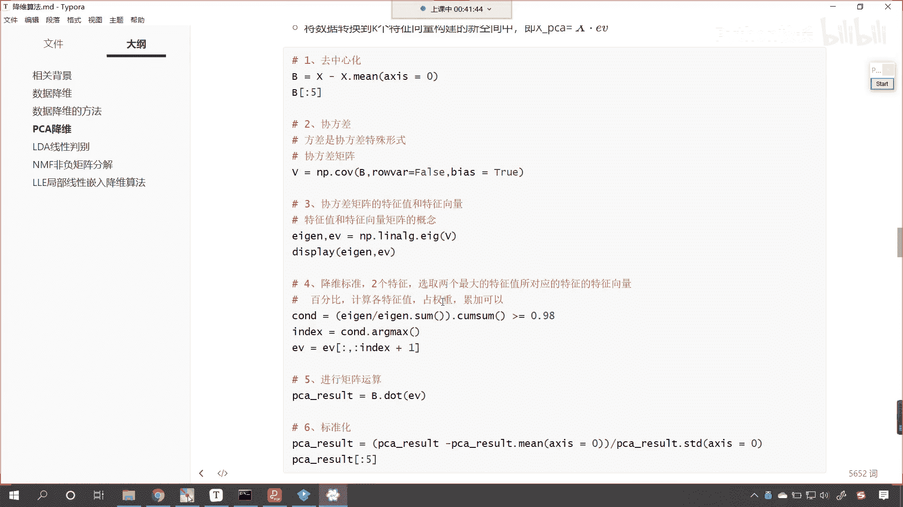

接下来呢我们继续往下看啊，来回到咱们的课件当中。

接下来呢咱们继续往下看，好，那么往下滑滑动到最后，咱们在这儿呢再来一个三级标题，接下来呢我们看一下嗯，咱们看一下这个奇异值叫做svd，奇异值和咱们的特征值，特征向量。

我们看一下它们之间是怎样的一个数学关系，好那在这儿呢，嗯在这儿呢咱们给一个数据好不好，在这儿呢咱们就呃给一个这个具体的数据啊，嗯比如说呢呃我们给原为花的数据，from sk lear。

咱们import data sets，执行一下，然后呢，咱们就使用data sets去加载一下原味花的数据，return x y，我们给一个true，这个时候呢我们就会得到数据x和y，有了x和y之后呢。

咱们x减去x点幂，我们给一个轴，让它等于零，那嗯这个时候呢咱们就会得到去中心化的数据，这个去中心化的数据呢我们就叫做a了，执行一下，有了这个a咱们呢去求一下他的这个斜方差，np。cv，我们把a放进去。

然后呢给他一个肉vr，我们让它等于false，那这个表示什么意思呢，表示我们计算力为什么要计算列呢，因为咱们的列是属性，我们计算协方差，咱们呢其实是计算属性和属性之间的相关性啊，所以说之前咱们也介绍了。

一般情况下看咱们的肉vr是吧，它呢应该是等于false，这个呢就表示咱们去计算列，列呢是属性，一般情况下这个行呢表示什么呀，行呢，它表示样本好，那么我们进行了这个计算之后呢，咱们接收一下啊。

我们就叫b给各位展示一下咱们的b长什么样。

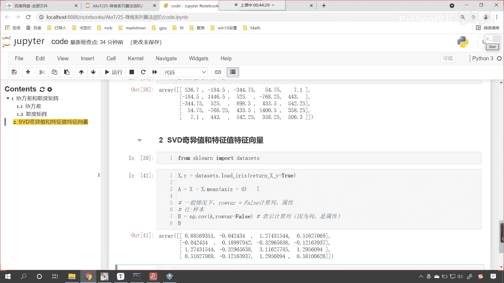

哎大家看这个就是咱们的b好，那么有了b之后，咱们现在呢来一个四级标题，我们先计算特征值和特征向量，那特征值和特征向量，咱们就可以调用np点个line lg。e g，我们将b放进去。

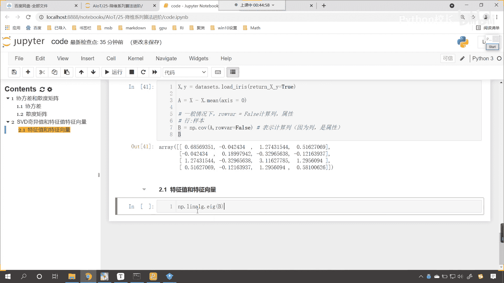

我们得到的结果就是特征值和特征向量，那我们就接收一下特征值呢，咱们起个名叫agent，特征向量呢，咱们起个名就叫e v display一下a键放进去，1v放进去，你看特征值特征向量是不是就有了。

那么特征值和特征向量，它是什么样的一个关系呢。

我们往上滑动啊，看咱们的特征值和特征向量，你看是什么样的关系呢，这个av就等于朗姆达v看到了吧，av就等于朗姆达v，也就是说我们呃，如果说咱们的a和我们的特征向量，进行矩阵乘法。

它呢其实就等于咱们的拉姆达乘以咱们的v，那我们看一下是不是这样的一个关系哈，来咱们呢回到代码当中啊，大家注意啊，你看这个lambda是特征向量v所对应的特征值，一个矩阵的一维特征向量是一组正交向量。

那什么是正交呢，其实就是垂直啊，其实就是垂直，那v呢看v呢是特征向量，lambda是特征值，对不对呀，那a乘以v表示什么。

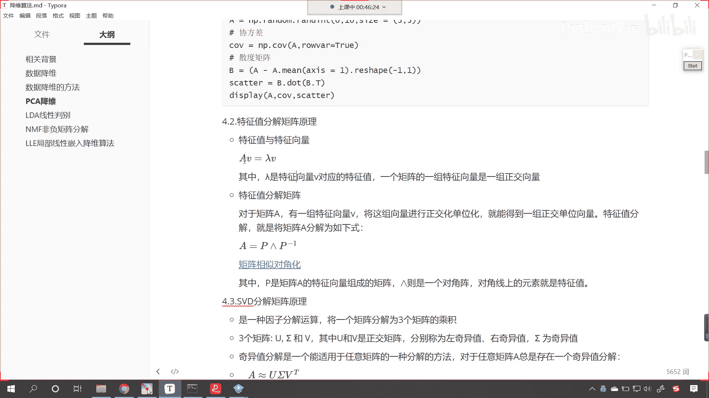

看在我们这个代码当中。

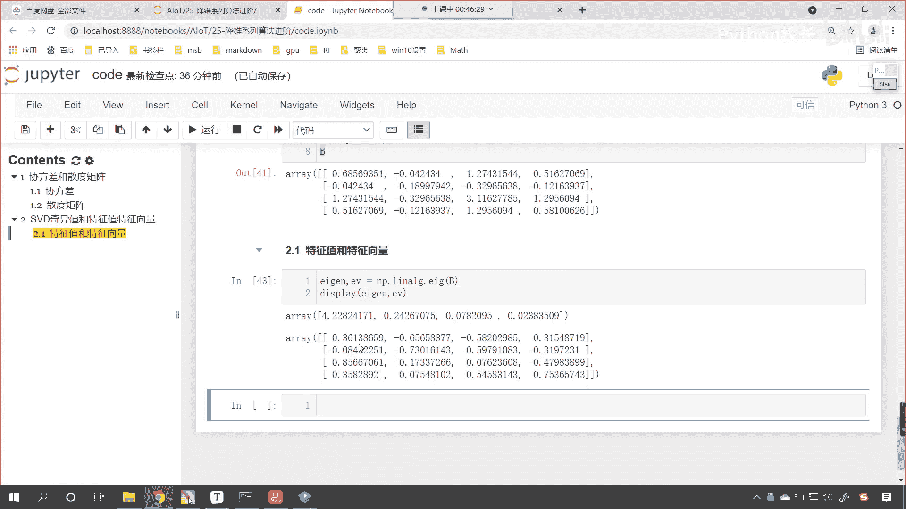

其实你看我们是不是对b，求了它的特征值和特征向量呀。

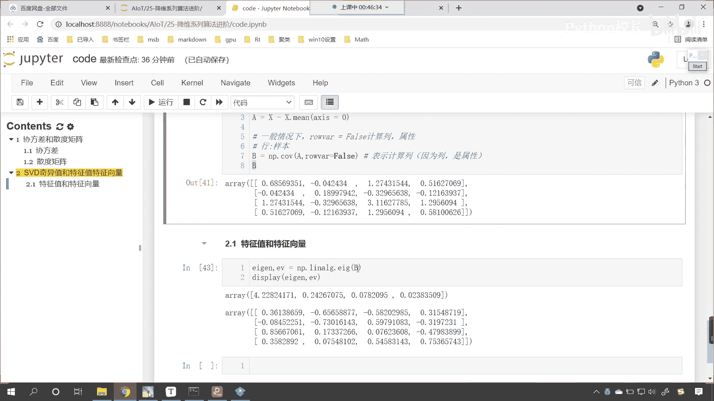

对吧，那这个时候呢咱们让b点我们来一个dot啊，咱们dota一个e v，你看这个时候我一执行，大家看咱们就会得到什么样的一个结果呀，你看我们是不是会得到，看到了吧，1。52，对不对，你看1。528。

第二个变成多少了，第二个是不是就变成了负的0。35呀，那么这一列是怎么而来的呢，看到了吗，这一列是怎么而来的呢，咱们来算一下啊，你看啊这个是什么，这个是不是特征值呀，那我们把它取出来。

那就是a镇中括号零，我们让特征值乘以十乘以e v中括号冒号，咱们给一个零，这个时候你看我一执行哎，来各位小伙伴，现在你看我相乘得到的结果等于多少，1。528，负的0。357，3。622，看到了吧。

和他一样不一样，然后呢咱们再来啊，a证中国号，咱们来一个一，我们让它乘以e v中国号冒号一。

你看我一直行得到的结果是多少，负的0。1593，第二个是负嗯，负的0。177。

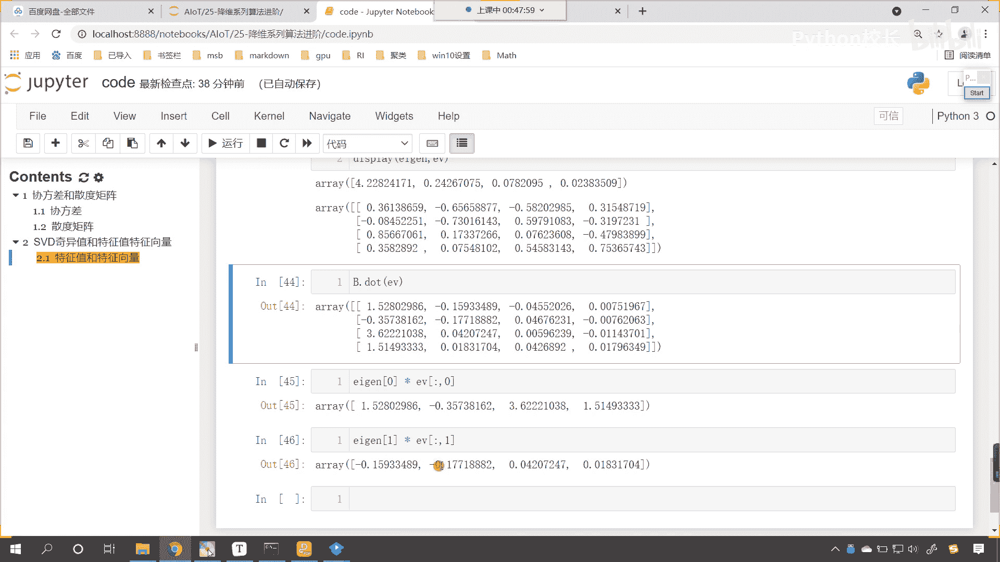

是不是一模一样，那回到我们课件当中，咱们的公式是怎么说的，看到了吧，公式是不是就是这样说的呀，就是说某一个某一个矩阵，它的特征向量和它相乘，就等于特征值和这个向量呃，和这个呃对应的特征向量相乘。

是不是看到了吧，av就等于朗姆达v，现在你看到你看这个呢，也是咱们特征值和特征向量，它的定义，也就是说你去线性代数这本书里边儿去找，那么它就对应着什么呀，看它就对应着一个这样的一个关系。

我们把存在这样的一个公式所得到的，所得到的这个v我们就叫做特征向量啊，这个v呢咱们叫做特征向量，好那么这个拉姆达呢我们把拉姆达叫什么啊，那这个朗姆达咱们呢就把它叫做特征值，啊这个拉姆达就叫做特征值。

刚才我在代码当中，是不是给各位小伙伴演示了一下他们的关系呀，对不对好，那么其实呢我们的特征值和特征向量，它们呢还可以用下面这个公式来表示，看到了吧，a就等于谁呢，就等于p。

你看这有一个向上的小于向上的小于号，然后呢p右上角带着一个-1，这个-1是不是就代表着咱们的逆矩阵呀，那这个地方咱们用了个p是吧，这个p和上面的v表示相同的含义啊。

你看这个p是矩阵a的特征向量组成的矩阵，看到了吧，哎你看它是特征向量是吧，所组成的矩阵在这个地方我们把它叫做p，也就是说你上面这个v是吧，可以有多个，就像我们代码当中，咱们是不是把第一列取出来。

这个是不是第一个特征值所对应的特征向量呀，我们在代码当中是不是也可以把第二个取出来，那它就表示第二个特征值所对应的特征向量，如果要不取出来，把它看成一个整体，那你想这个是不是就是一个矩阵呀。

所以说这个p呢是矩阵a所对应的特征向量，那这个向上的这个小于号这个符号呢它是对角，它是对角矩阵，对角线上的元素就是咱们的特征值，啥意思呢，斜对角线上有值，除了斜对角线上其他的值都是零。

那回到代码当中给大家呢对一对啊。

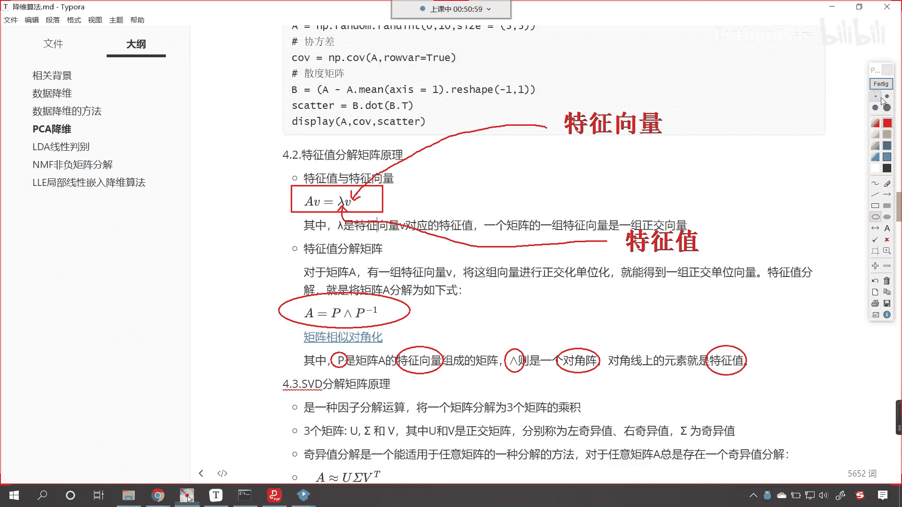

咱们要对上，那我们这个里边的b啊，咱们这个里边的b，是不是就相当于咱们课件当中所说的这个a呀，对不对，你看b是不是就相当于咱们所说的v，那这个ev是不是就是表示咱们的特征向量，对不对。

你看这个e v就表示特征向量在这儿呢，咱们也进行一个备注啊，这个b呢唉他呢就表示矩阵，咱们的ev呢就表示矩阵的特征向量好，那么我们这个地方做了一个乘法，那这个呢就是第一个大家看啊。

是第一个特征值和咱们第一个特征向量，是不是进行乘法呀，得到的结果我们发现和第一列是不是一模一样。

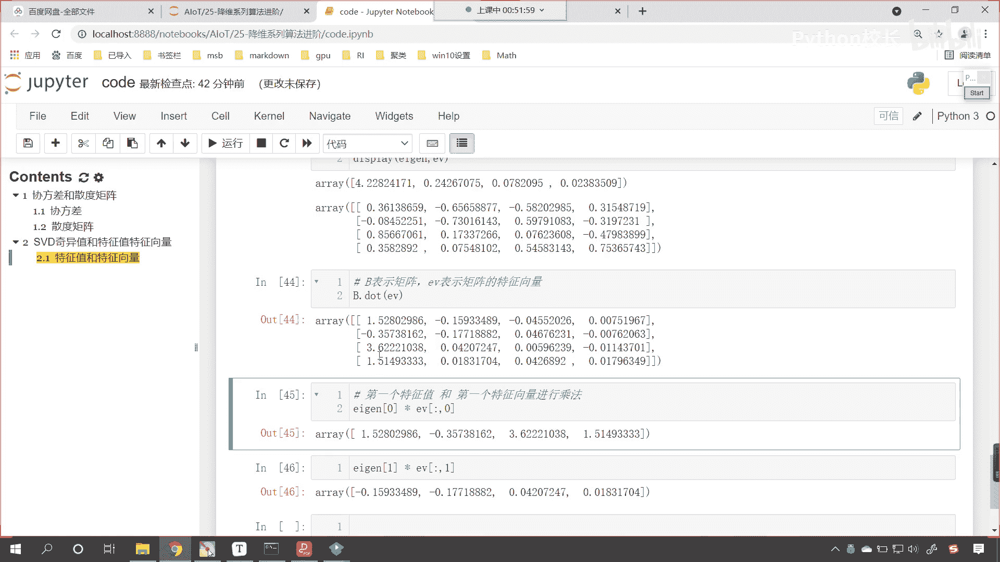

对不对，那第二个大家可以把这个叫做朗姆达。

它对应咱们课程当中的这个朗姆达，那么还有一个公式呢，a呢就等于p向上的小于号乘以p的逆矩阵。

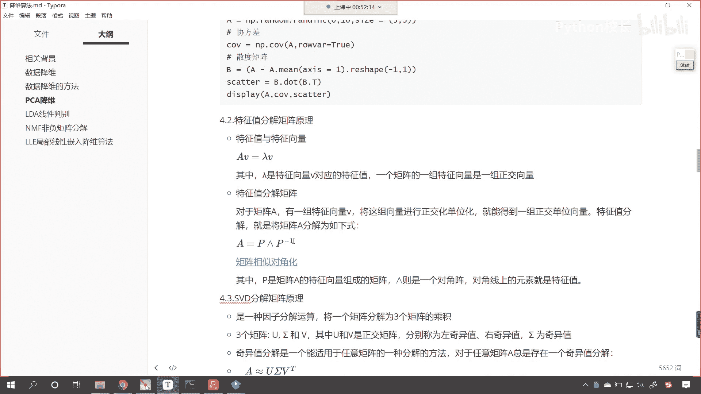

那咱们也把这个表示一下，好不好好，那么它一定存在这样的一个关系，那我们的p是不是就相当于咱们的e v呀，对不对，特征向量，那这个时候呢就是e v，咱们来一个dot小括号，我们dot一下谁呢。

这个时候呢就是咱们的这个呃特征所组成的。

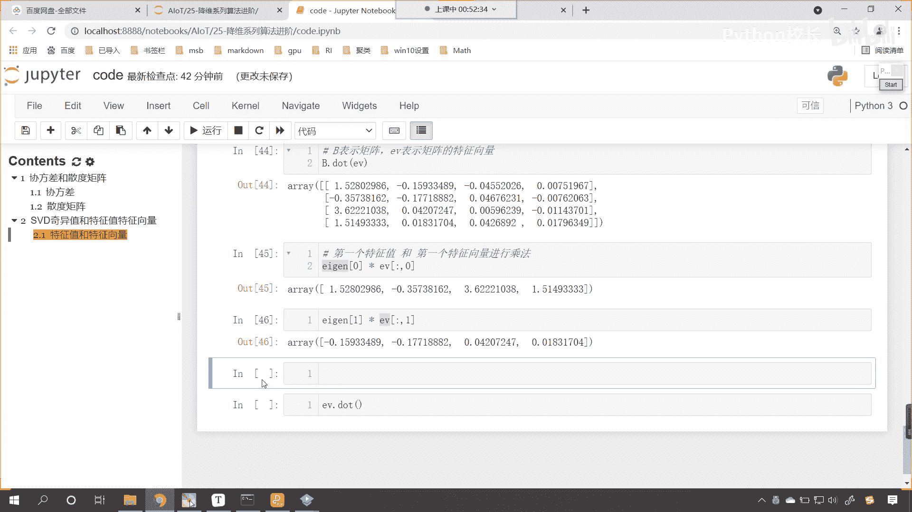

看啊它是一个对角阵，对角线上的元素就是特征值，那我们的数据是4x4的。

你在这儿观察一下，咱们所求得的这个特征向量。

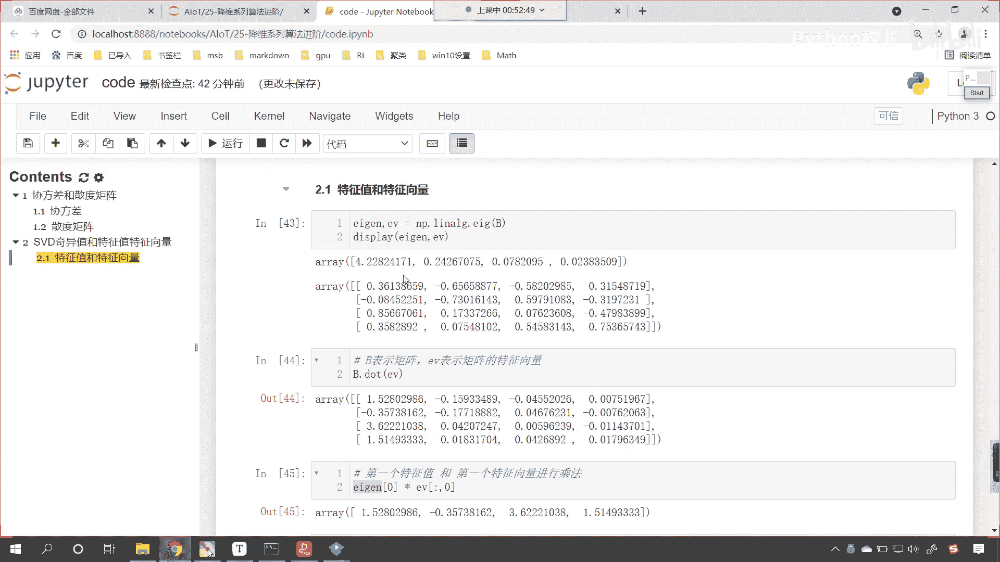

看到了吧，它是不是四行四列，那所以我们如果要想给它构建一个这个，对角矩阵的话，咱们给个四，这个时候你看过一执行，此时咱们斜对角线上结果都是都是多少呀，斜对角线上是不是全是一，其他的位置是不是全是零。

那有了这个之后呢，咱们呢再来一个乘法，我们乘以它的特征值，看这个时候你看过一执行斜对角线上是有值的，除了斜对角线上是不是都没有斜对角线上的值，这个时候变成什么了，4。2282看到了吧，4。

282是不是就变成咱们的特征向量了，你观察一下，看到了吧，4。282，0。2426，看到了吧，斜对角线0。2426是不是就发生了变化呀，对不对，所以说有了这个数据之后呢，哎我们把它就叫做咱们的这个呃。

你看这个叫符号叫什么啊。

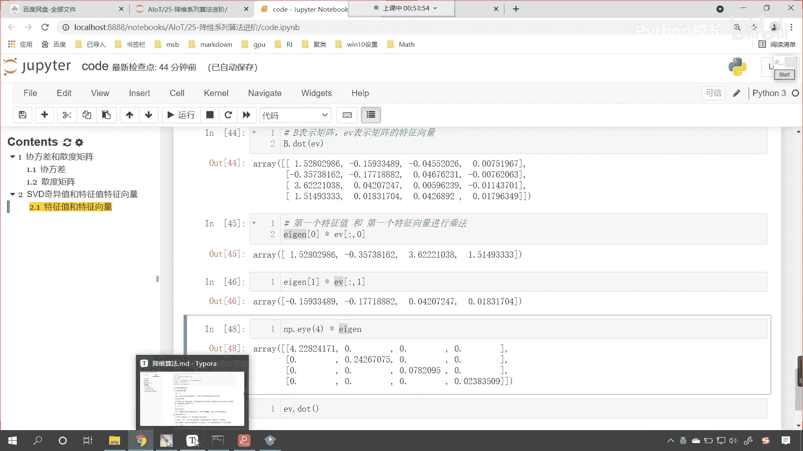

你看这个符号还咱们在代码当中，还不能够去很好的表示是吧，这个叫做这个位置是吧，那我们在代码当中回到这儿啊。

咱们给它接收一下啊，叫e i g e n g e y e好不好，就让他叫这个计算出来了。

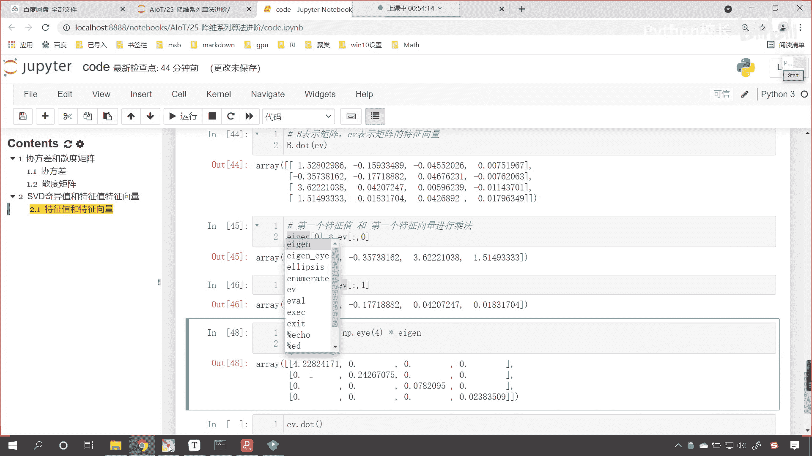

它咱们就可以进行矩阵运算了。

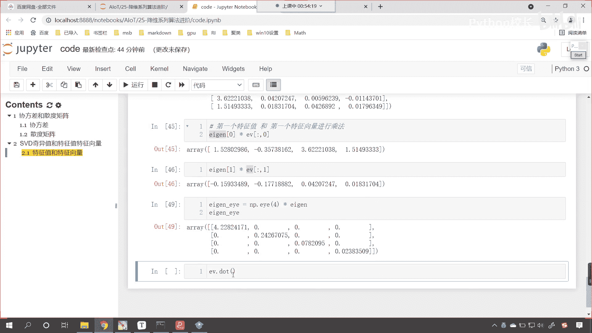

现在呢咱们就根据这个公式啊，我们就根据这个公式咱们计算一下好不好，我们看一下我们所求解出来的特征值，特征向量能不能再反反推求解出来，咱们的矩阵a因为特征值也好，特征向量也好，它呢都是来自于咱们的原矩阵。

这个p是特征向量，这个向上的小于号，它呢是特征值，这个p呢是逆矩阵，也就是说我们有特征值和特征向量，一定可以反推出来，咱们的矩阵a是不是根据这个公式。

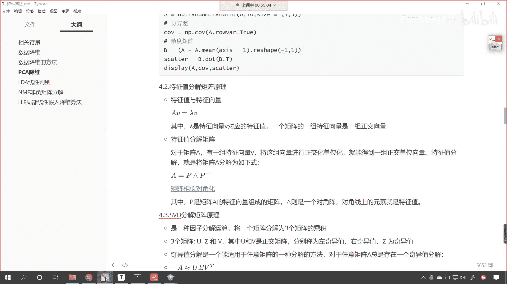

咱们来算一下啊，这个时候呢咱们把这个a减e y e放进去，然后再来一个dot np点调用这个线性回归，然后点n v求一下逆矩阵，求谁的逆矩阵呢，求e v的逆矩阵执行，各位小伙伴，你就能够看到。

此时我是不是就得到一个结果呀，那么我们的ev，咱们的a减e y e都是根据谁计算出来的呀。

我们往上滑啊。

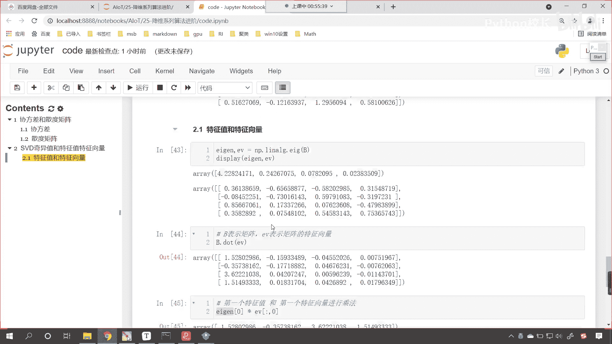

各位小伙伴，你能够看到，咱们是不是根据矩阵b计算出来了a证和ev呀。

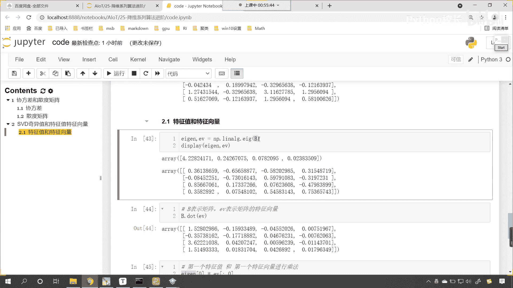

那这个b长什么样呀，来咱们在最后把b输出一下。

你来看结果你就发现一样不一样，看到了吧，b是0。6859，0。68569351，和上面是不是丝毫不差呀，保留到精确到小数点后八位完全一样，那你看咱们写的这个公式，是不是就是我们课件当中所说的这个公式呀。

看到了吧，就是咱们所说的这个公式啊，好那么到这里呢，咱们就将特征值分解矩阵的原理，我们是不是进行了一个介绍呀。

你看到这儿呢，你就应该明白咱们的特征值特征向量是吧。

它是如何分解的，分解之后咱们得到的这个特征值。

特征向量和原矩阵之间是怎样的一个关系，在这儿呢，咱们都咱们呢都通过计算。

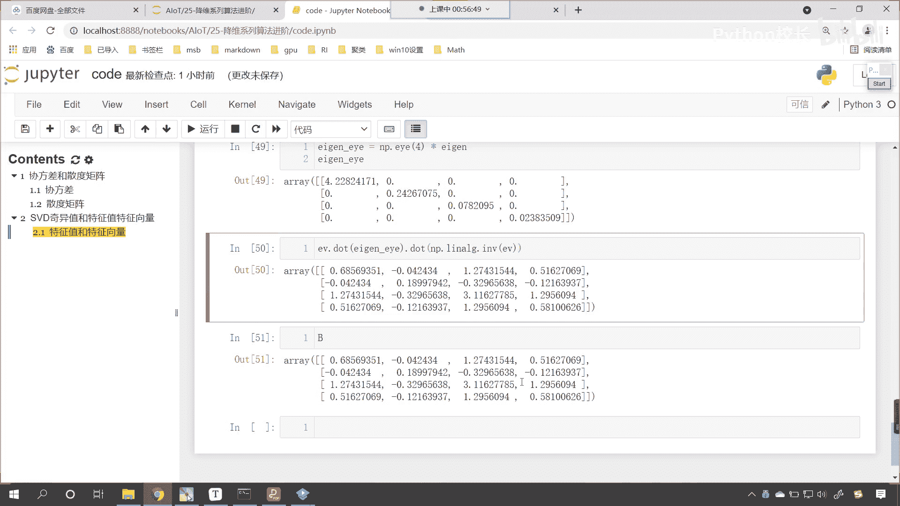