# P167：6-NMF非负矩阵分解 - 程序大本营 - BV1KL411z7WA

来接下来呢我们继续再往下看。

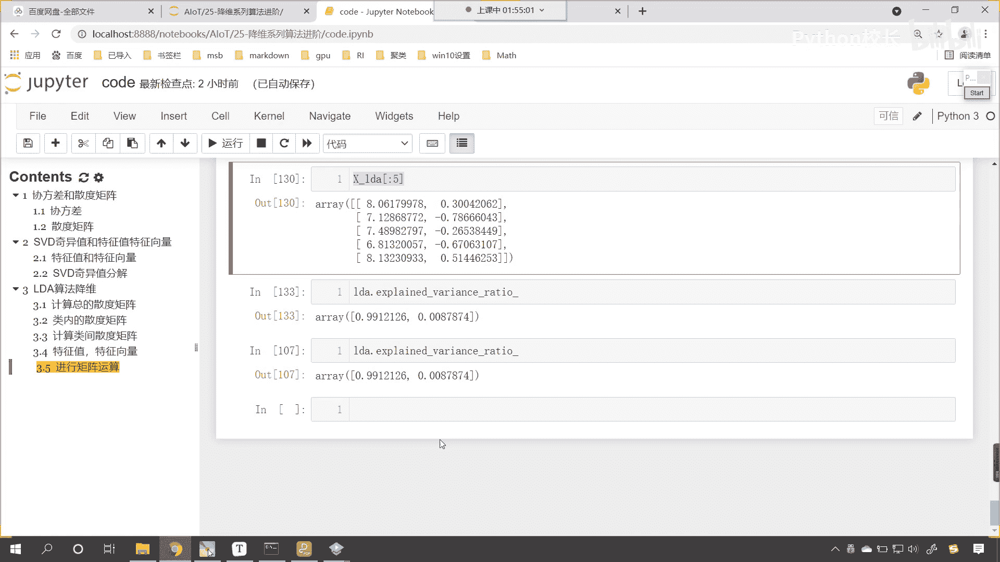

咱们呢再介绍一个算法啊，那么接下来这个算法呢就是咱们nmf。

非负矩阵分解，这个nmf 3个英语单词，你看全是大写对吧，那这个n呢就是negative，这个m呢就是matrix，这个f呢就表示分解的意思，那非负矩阵分解的基本思想呢，那也很简单。

那么对于任意给定的一个非负矩阵a，你看这个里边强调了咱们的数据，它必须得是什么，看到了吧，是不是必须得是非负的呀，那必须得是非负的，那为什么他在为什么他会强调非负呢，因为我们实际的工作当中。

我们所收集的这些数据，大家想是不是一般都是一般都是正的呀，对不对，一般都是正数，你比如说身高体重，你看这些都是正的量，很多数据是吧，它都是正的，所以说呢才会冒出这样一个算法，叫非负矩阵nmf算法。

其实就是找到一个非负矩阵，u和一个非负矩阵v 10，使咱们这个公式满足，也就是v呢就约等于w乘以h，v呢就是w乘以h，那么你看咱们上面的pca是不是矩阵乘法，lda是不是也是这个矩阵乘法呀。

那nm f也是，只不过呢他这里强调了一个非负，也就是我们分解完之后是吧，我们用w和h来表示v，那w和h是非负的，你这个v呢也得是非负的好。

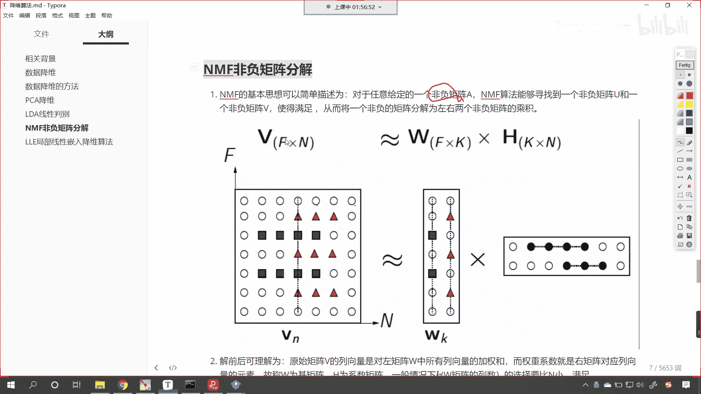

那么现在你就能够看啊，你看这个，我们知道咱们的数据是不是矩阵乘法呀，对不对，看看咱们的数据呢是矩阵乘法，这个时候呢你看啊，你你看咱们这个公式啊，你看这个第一行看乘以这一列是吧，为什么咱们这第一行当中。

为什么这个v当中第一行全是000，看到了吧，全是如果是一个圆圈，就表示它是空数据，为什么他全是零呢，因为你看你这两个数据是不是全是圈儿呀，你只要全是圈儿，你无论和这个乘也好，还是这个也乘也好。

它是不是都是圈，而咱们第二个数据你就能够发现它是一个零，是不是一个红色的三角呀，现在你能够发现咱们的第二行是不是这个位置，这个位置它是不是有三个圈儿呀，看到了吧，那呃有三个这个三角，为什么呀。

你看为什么它有三个三角呢，我告诉你啊，现在咱们换一个别的字体是吧，换一个别的字体，你看就是这一行在进行矩阵乘法的时候，你看它和这个地方进行矩阵乘法，和这个地方进行矩阵乘法，然后再和这个位置进行矩阵乘法。

你看是行乘以列，对不对，行在乘以列的时候，因为你第一个是圆圈，是不是，所以它就怎么样，上面这个是不是就不做数呀，因为零是不是乘以任何数是不是都都都得零呀，我们这个地方是不是有个三角。

你看这个三角和咱们下面这三行，进行相乘的时候，圆圈就代表有数，有数的话，你就可以把它当成一，所以说你看这个地方是不是就是三个三角，其他的行也都一样啊。

其他行也都也都一样，也都是这么个规律，所以说呢咱们明白了这个图是吧。

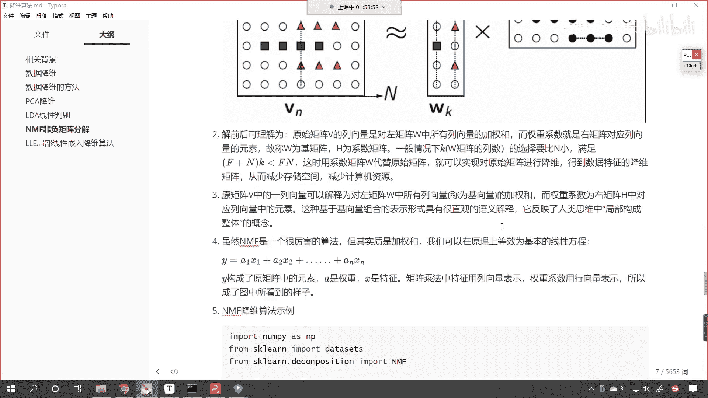

你就知道非负矩阵分解是怎么一回事了。

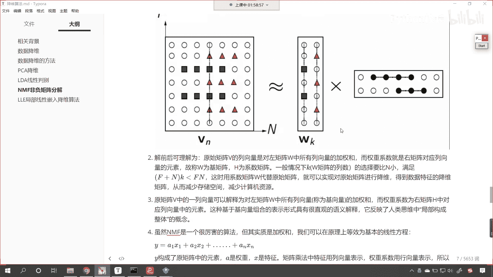

其实就是找到这个特征，找到这个数据好。

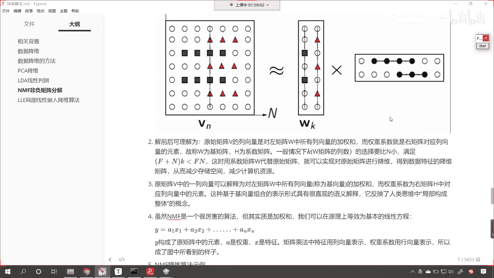

那么咱们接下来呢我们就看一下咱们非负矩阵。

咱们具体的一个案例啊，来现在呢咱们就回到咱们的代码当中。

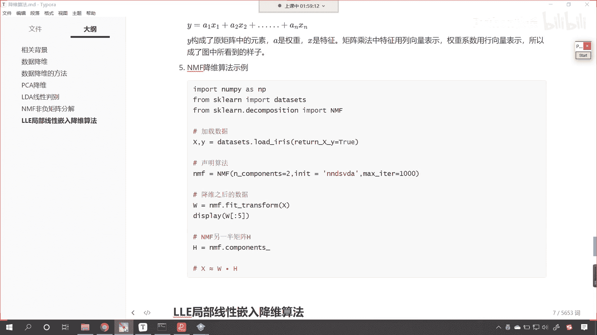

在这儿呢咱们来一个三级标题，这个就是nmf，这个呢就叫做非负矩阵，所以他必须强调，咱们的数据呢必须得是非非负的，我们导一下包，咱们import np as np，然后呢from sk learn。

咱们import data sets from klear，现在呢我们将非负矩阵，咱们给它导进来，那么非负矩阵来自于哪个包呢，decomposition，decomposition。

这个英语单词是不是有降维的意思呀，从这个当中呢，咱们导入nm f，那么我们哪个数据是非负的呀，是吧，这个时候呢咱们就data sets，我们漏的一个圆为花，给他一个return x y，我们给他个二。

x和y，你看这个return x y，一般情况下我们给true，是不是，这个时候你给二也好，给三也好，你给-1-2都能够返回具体的数据，因为在咱们的数字当中是吧，它只要不是零，那么它都表示true。

第四play一下咱们的x和y x，咱们查看它的前五条数据，这个时候你看数据是不是就得到了，因为我们圆为花，这个数据呢它呢是有物理意义的，对不对，那这个是不是表示咱们花瓣儿，它表示咱们花瓣的长度。

这个是不是表示花瓣的宽度，这个是不是表示花萼的长度，这个是不是表示花萼的宽度，你看这些都有物理含义，那只要它有物理含义，看它有物理含义，一般情况下它呢都是正数吗，一般情况下都是正数。

那有同学就说咱们的温度不是有-10度，-20度吗，零下20度，对不对呀，那是为了我们人去感受这个温度的时候，方便一些，其实呢对于物理学家而言，你看是不是有绝对0度呀，是不是273。15呀对吧。

零下273。15，啥是绝对0度呀，绝对0度就是温度最低的那个地方，从温度最低的那个地方往上是不是都是正数呀，如果说我们现在要表示温度的话，咱们就表示现在的温度是这个293度。

那你想大家用起来是不是不太方便呀，对于我们人而言，所以说呢这个嗯，我们才会有才会用二三十6度是吧，才会用零下5度来表示温度，所以说呢物理物理含义是吧，一般都是正数啊，那么你看我们使用pca降为。

咱们使用pca降维，你能够发现咱们得到的数据，看是不是就有负数了，你观察一下-2。68，负的2。71，负的2。88是不是就有负数了，那你看如果有负数的话，我们怎么用物理含义跟它进行对应呢。

是不是就很难对应了，虽然这个pca很有用，但是咱们降维之后得到了负数，这个时候是不是就不好解释呀。

所以说非负矩阵就登场了，它对于有物理含义的这些数据进行分解，分解完之后呢，它依然是正数，这个时候呢咱们就好解释一些，nmf就等于nmf，在这儿呢咱们就给他一个n components，咱们给他一个二。

也就是说我们告诉他最后呢保留两位小数，那nn mf呢，它呢也是一次一次for循环。

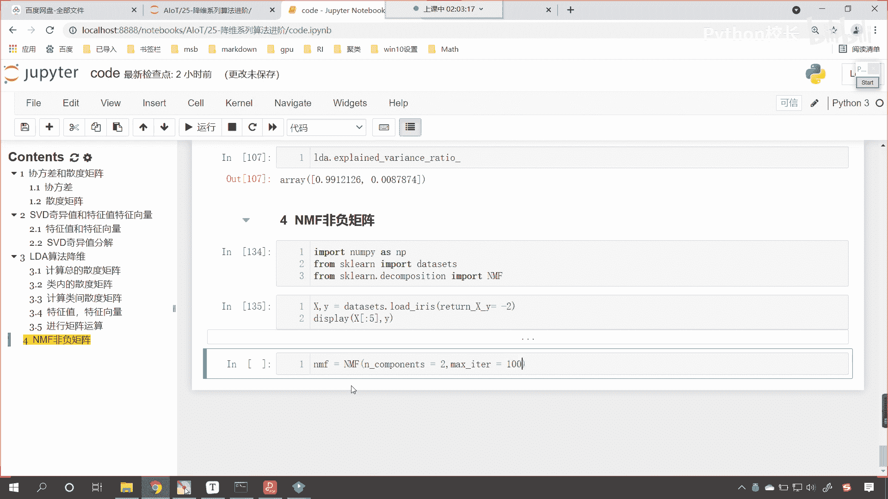

去寻找咱们这两个矩阵。

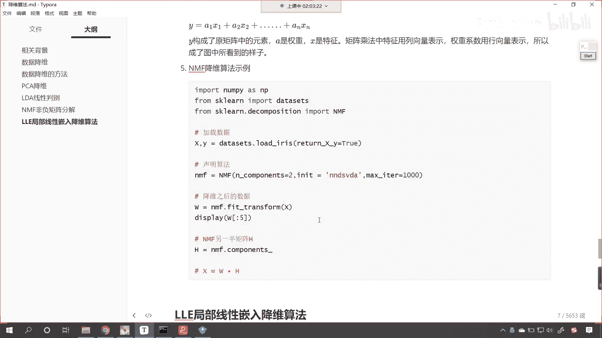

你看到了吗，这是不是也是约等于呀，你比如说你给了我一个矩阵，我一定能够找到这个矩阵w和矩阵h，让他俩进行矩阵乘法的时候，刚好等于咱们左边这个矩阵v吗。

是不是不一定，我们希望它越接近越好，是不是啊，那越接近越好，这个时候其实就有一个循环的这个次数了，那现在呢咱们给他1000次，这个都是可以调的啊，然后呢n m f咱们呢就feat一下咱们的数据。

将咱们的数据x放进去，你看我一执行，大家看现在是不是就有了呀，那现在我们发现，你看是不是有一个粉红色的提示呀，那这个粉红色的提示是不是告诉我们嗯，这个参数init呀，说这个参数呢以后会怎么样嗯。

这个参数是不是以后会你看future warning是吧，那这个参数呢哎他会你看他will be changed from n s to，n n n d s w，那我们现在给他指定一下啊。

ctrl c其实呢你不管他也没事啊，咱们给一个init ctrl v是不是好，那么此时你看我在执行它，是不是就有没有这个粉红色的提示了，然后呢nmf点咱们transform一下啊。

这个时候呢咱们就将数据x放进去，transform之后嗯，大家看啊，transform之后，咱们就会得到一个w，看一下咱们w数据长什么样，查看它的前五个，来各位小伙伴。

你就能够看到咱们的数据是不是就降维成功了，原来我们的数据是几维的，咱们现在呢进行一个对比哈，这个display一下x是原数据，查看一下它的形状，w呢是咱们的新数据，也查看一下它的形状。

现在你来看原始数据是不是100和四，现在的新数据是不是100和150和二啊，那这个就叫什么，这个不就是咱们所说的降维吗，对吧，你看这个就是降维，降维我们有四个特征，是不是就变成了两个特征呀。

那你看数据是不是就变少了变少了，咱们计算速度是不是就会快一些，对不对，那下面你看我展示了前五个，那么这些数据呢大家看它依然是不是正的，看到了吗，你去找他没有负数啊，它全部是正的。

这个时候呢和它的物理意义还能对应上好，那么这个时候就是咱们得到了w。

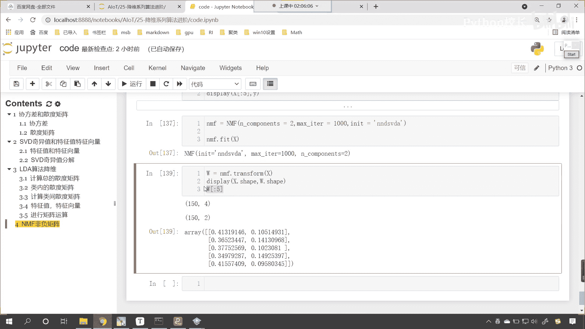

那根据咱们刚才在，根据咱们刚才这个图形的说明，得到了w是不是一定有一个h呀。

那我们现在获取它的h啊，好现在咱们获取h好，那么h呢咱们就等于nmf。components，你看一下咱们的h长什么样，看到了吗，这就是咱们的h好，那么有了咱们的h之后。

那hw和咱们上面的x是什么样的关系呢，咱把它变成markdown，来一个dollar dollar是吧，x反斜杠a p p r o x a a prox，这个就表示约等于约等于谁呢。

w反斜杠这个see dots，see dot，咱们的h你看我执行一下，你看是不是就是w点乘咱们的h呀，这个时候我们发现，你看w和h是不是都是斜体呀，来回到代码当中啊，咱们在这反斜杠rm，这就表示罗马体。

这个时候你看是不是就正了好，那么这个有点小，咱们来一个尖括号phont size，我们给它一个六，让它是6号字体反斜杠font，哎你看我一直行，是不是就变得稍微大一点了，w和h是这样的一个关系。

是不是呢，w点咱们来一个dot，把h放进去，查看它的前五个执行，看5。093。5x长什么样呢，x中括号冒号前五个，你看我一直行，5。13。5，1。40。2，大家现在看一下是不是约等于看到了吧。

是不是约等于，你看5。09和这个5。1是不是约等于对吧，3。5和咱们这个3。5是不是约等于1。4，018和这个是不是约等于啊，对不对，看到了吧，那这个后面那个零点点二，014和这个0。2是不是约等于啊。

唉所以说这个就是咱们的非负矩阵分解，大家现在明白它是怎么一回事儿了吧。

它呢是通过咱们这个图的形式。

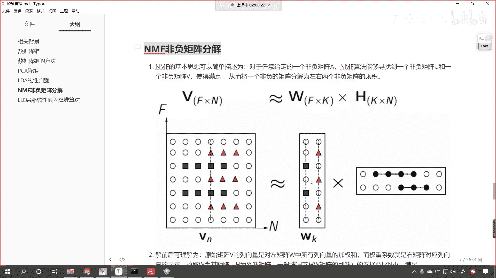

进行的一种数据降维，看了吗，进行的一种数据降维。

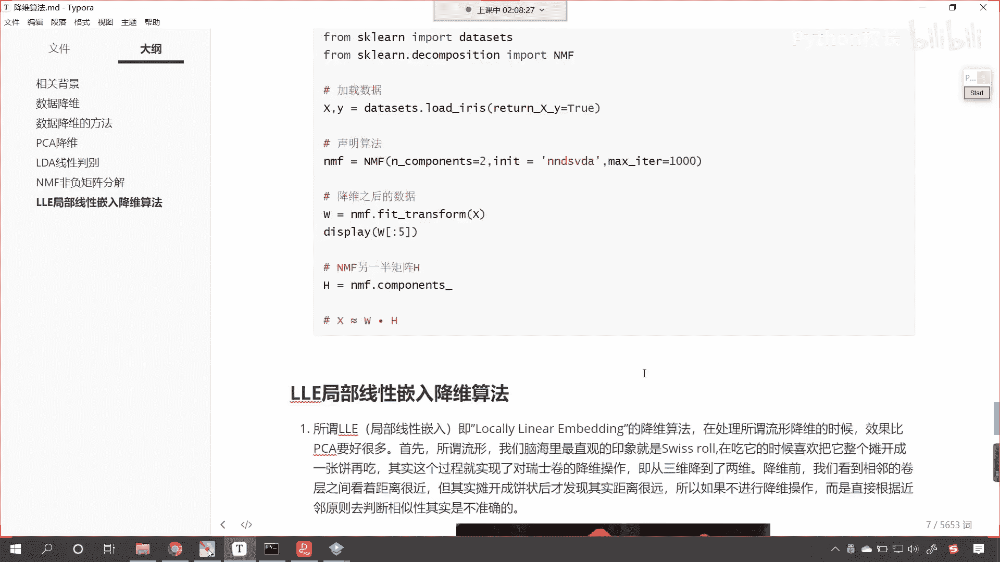

在这儿呢咱们就进行了一个演示啊，好那么这个非负矩阵呢主要强调它是非负，如果里边有负数。

他马上就报错了，知道吗。

