# P185：3-决策树鸢尾花分类案例 - 程序大本营 - BV1KL411z7WA

来各位小伙伴，接下来呢我们就继续往下看啊，咱们呢就使用决策树，我们进行一个代码的实战。

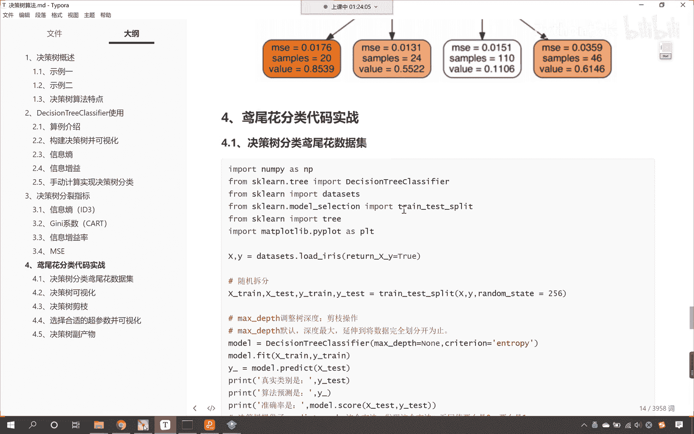

看，那这个决策树代码实战呢，咱们就使用一个圆微花好不好，咱们使用一个圆微花来，现在呢咱们就回到咱们的代码当中。

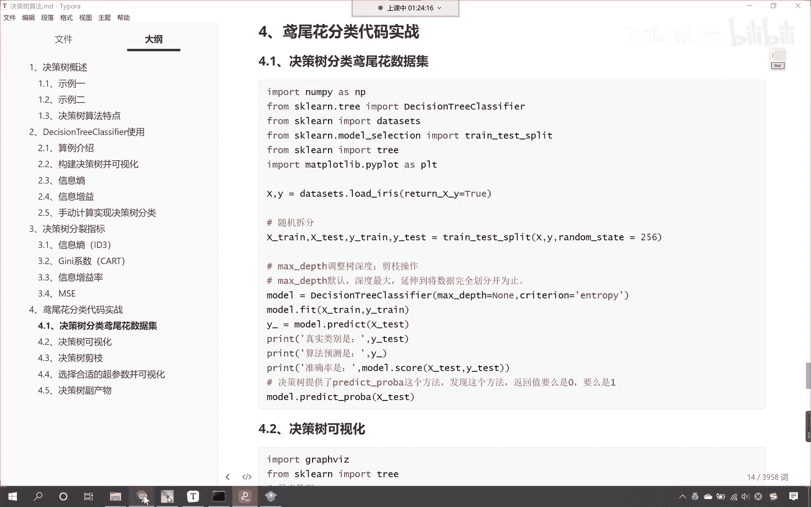

好那么我们就往下滑，咱们就滑到这儿，咱们来一个三级标题，那这个三级标题呢就是，决策树，分类原为花这个数据，那么首先呢我们导一下包啊，呃咱们呢就import numpy as np。

然后我们from sk learn点，从train当中，咱们import decision tree classifier，把算法导进来，然后呢导一下数据from sk learn。

咱们import data sets，这个是咱们的数据集，然后呢我们import graph vz，咱们就用这个来进行算法的一个可视化好，那么接下来我们首先加载数据，那就是data size。

咱们来一个lol o a d low的艾瑞斯，这个时候我们就可以获得到data，给各位看一下这个data是什么样的数据。

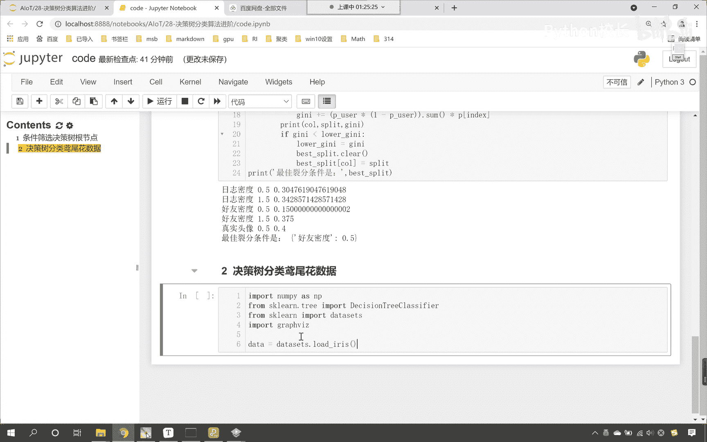

一执行各位小伙伴，你就能够看到它是不是类似字典形式的数据啊，data是它的数据，那么我们往下滑，这有一个target是它的目标值，target name是它的属性值，对不对。

咱们现在呢把这几个字段我们给它获取一下吧。

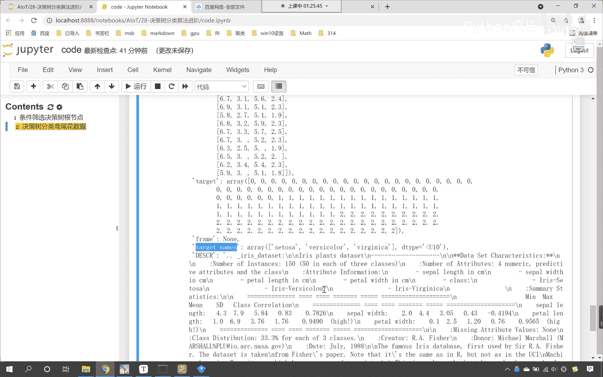

好那双击合起来，现在呢就来一个data，咱们呢就来来一个data，好，现在呢我们把这个给它改个名儿啊，咱们就叫艾瑞斯啊，唉这样的话这个就更加清晰一些，data呢对应咱们的数据x我们给一个y y呢。

就等于中括号，它呢叫target，这个就是目标值，然后呢我们给一个这个呃target诶，就是他的这个花的名字啊，叫做names，names呢就等于中国号，咱们给一个target盖嗯。

target gnames，这个时候呢我们执行一下好，大家看这个数据，咱们就或得到了，得到这个数据之后呢，咱们对这个数据进行一个拆分，从咱们sk learn当中，model selection当中。

咱们导一个包，那就是train test split，它可以将咱们的数据拆分，现在呢拆分一下train test split x放进去，y放进去，咱们给一个test size，咱们呢让它是0。

200分之20的比例，然后呢我们给一个random state 256，这个时候咱们的数据就一分为二了，那我们接收一下，那就是x下划线，train x下划线，test y下划线串y下划线test。

ok数据就拆分好了，注意这个random state，我们是为了演示的时候，哎咱们给的这个嗯随机随机状态哈，其实呢这个随机状态就把咱们的拆分给固定了，是不是啊，如果这个不固定。

每次拆分咱们都会随机打乱咱们的顺序好，那数据准备好了，咱们就生成一个模型吧，model呢就等于decision tree classifier，这个时候你既可以使用信息熵，然后呢咱们来一个model点。

咱们feat一下x下划线train目标值串放进去好，然后呢咱们就model咱们呢就调用一个scr score呢，是不是就是查看一下它的分数呀，现在呢咱们将x test放进去，y下划线test放进去。

那我们看一下咱们的测试数据，它的情况怎么样啊，啊这个就是我们的测试数据，咱们的得分打印输出一下啊，咱们print，打印输出的时候，在这儿咱们给一个文本的提示，那这个文本呢就是测试数据，我们的得分，冒号。

然后呢我们再来一个啊叫做model。predict，预测一下，将咱们x下划线test放进去执行这个代码来，大家看看咱们的准确率是多少，是不是0。96呀，那咱们这个得分还是比较高的啊，看到了吗。

得分还是比较高的，我们打印输出一下，看print，看这个地方咱们也打印输出一下，那这个print呢咱们也给一个文本，这个呢就是咱们的算法预测的结果冒号，那我们呢同时也打印输出一下print。

看一下咱们的真实结果是逗号，咱们的真实结果呢，看咱们现在呢我们就给一个外下划线test，咱们对比一下，看看到底是哪一个不正确，是不是，这个时候我们再来一个空格啊，我们让它对应上看到了吗。

这这个时候多给了几个空格，打印的时候是不是就对应上了来，你现在能够看到哪一个不太一样呀，看到了吧，是不是就错了一个呀，你看看是不是就错了一个，别的是不是都对应上了，对不对，好。

那么接下来呢咱们再使用这个算法，model。predict probe，你还记得这个方法吗，predict problem，大家是否还记得咱们呢，在逻辑斯蒂回归啊，叫逻辑斯蒂回归中，我们是不是带着各位。

手动计算过咱们的概率公式呀，那这个predict probe这个是不是就是概率，咱们将x下划线test放进去，我们看一下这个概率是怎么样的啊，你看我一直行，大家观察一下这个概率是什么样的一个情况。

看咱们的概率要么是零，要么是一，这个概率有0。80。4那种情况出现吗，看没有，是不是啊，大家要注意啊，决策树它没有0。80。4，0。5啊，0。3这种情况出现，你知道为什么吗，那你想一般情况下。

咱们预测probe是不是就是概率呀，对不对，但是这个地方为什么没有出现概率这种情况呢，因为决策树它在进行划分的时候，它呢就是非黑即白，因为咱们的决策树长什么样，你看咱们的决策树呢。

我给你看一下这棵决策树长什么样，那咱们就使用tra。explode graph vz，咱们将model放进去，然后呢给一个field，我们让它等于true，咱们给一个run的，我们也让它等于true。

咱们给一个feature names，等于names，上面咱们都得到了啊，得到这个数据呢，咱们起个名叫做dot data，然后呢咱们把它画出来，graph v a z，那就是source。

咱们将这个dot data放进去，此时你看我一执行某一个地方给错了是吧。

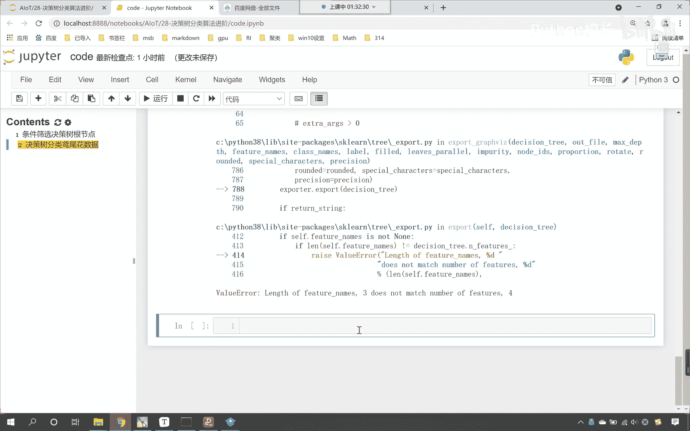

length of feature names，三，does not match number 4，呃咱们看一下哪个地方给错了啊，这个是target names是吧。

那就说明咱们获取names的时候应该是给搞错了，咱们插入一行打印，输出一下咱们的names，大家看是不是三个呀，那我们再看一下咱们的数据啊，eris我们往下滑，咱们在找数据的时候呢。

咱们选了target names，其实咱们应该选谁呢。

我们往下滑啊，咱们应该还有一个特征呢，嗯咱们还有一个feature names，咱们应该获取这个feature names就对了。

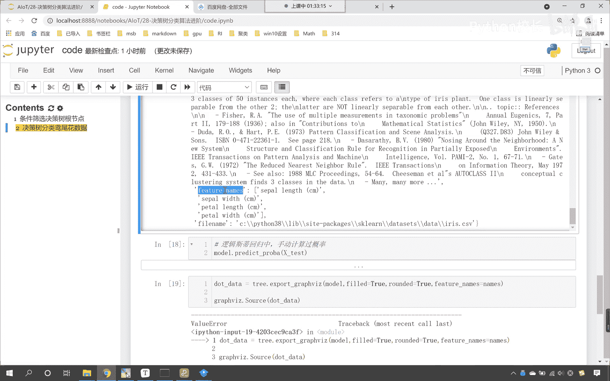

所以咱们往上滑来找到咱们这个数据，咱们就叫做f e a叫feature names，获得这个数据，那么我们把这个修改一下吧，就叫做f e a t u r e叫feature names。

执行一下这个代码，执行完这个代码之后呢，咱们在这儿是吧。

把feature names放进去，这个时候你看我一执行。

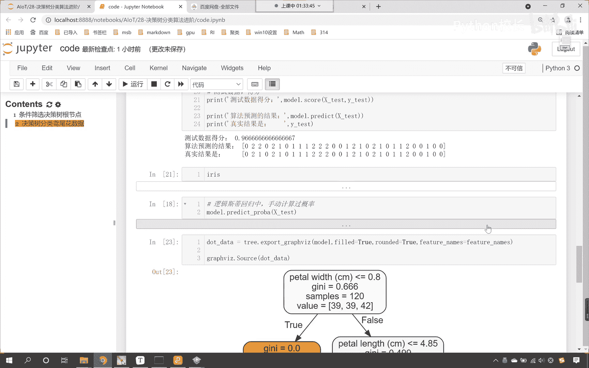

大家现在来看咱们这棵决策树，你看构建出来了吧。

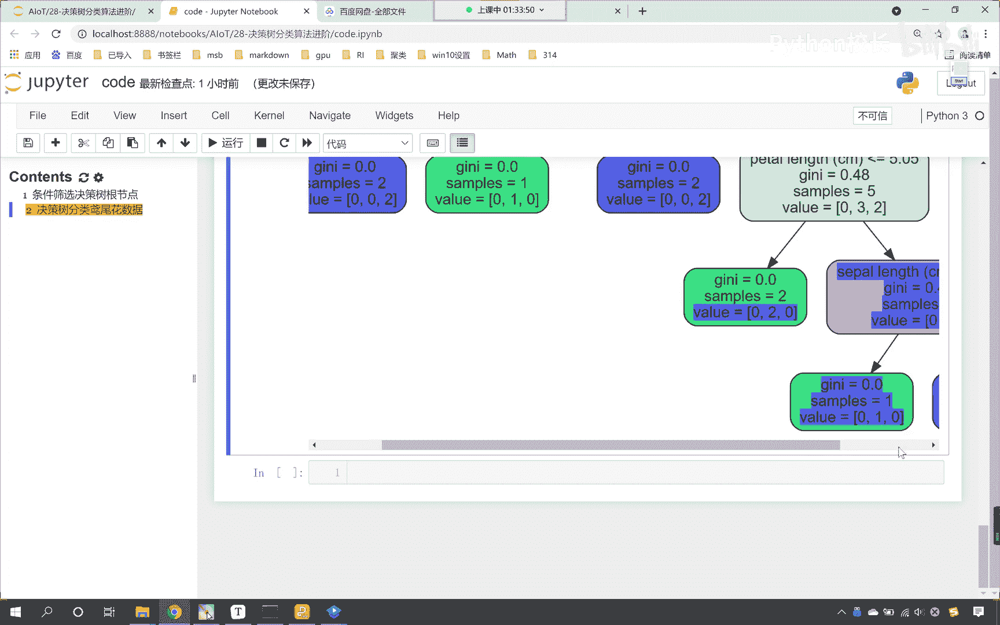

是不是就稍微复杂一点，看到了这棵树是不是就大，看到了吗。

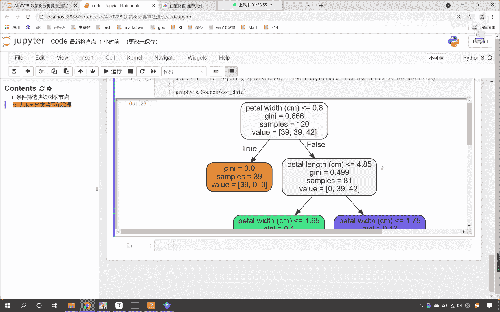

这棵树你看啊就比较大，看到了吗，这棵树就比较大。

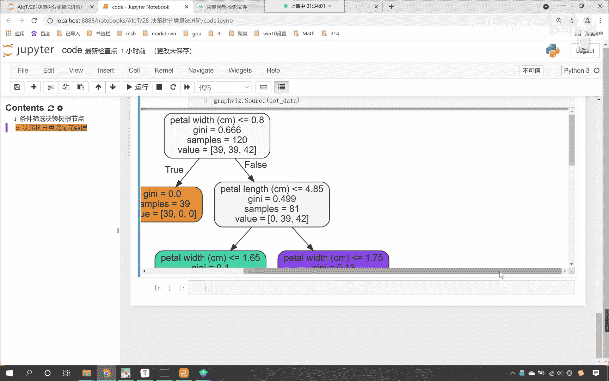

是不是看这个数就比较大诶，那为什么咱们刚才问了一个问题，为什么这个预测的概率非零即一呀。

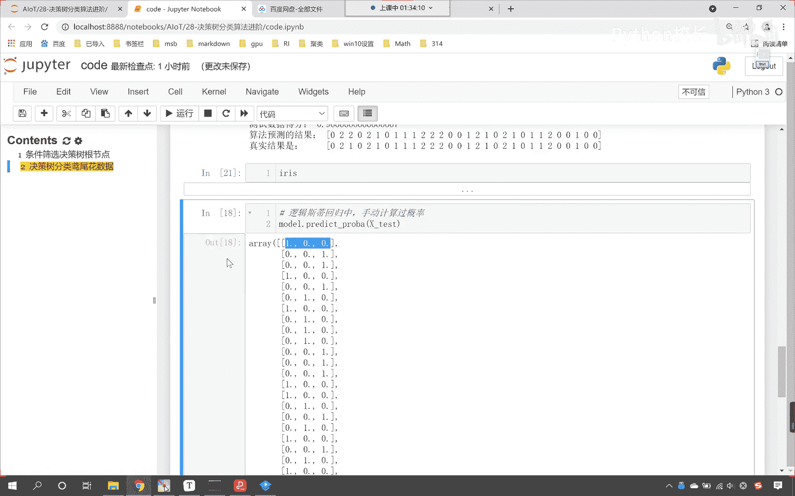

你想你任何一个样本，任何一个样本只要放到这个决策树当中，根据这个条件它进行走的时候。

他是不是走着走着它都会落到，它是不是都会落到一个叶子节点上呀是吧。

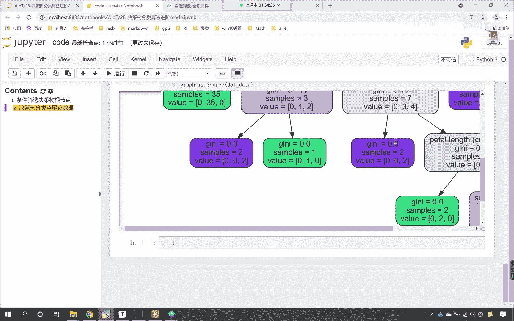

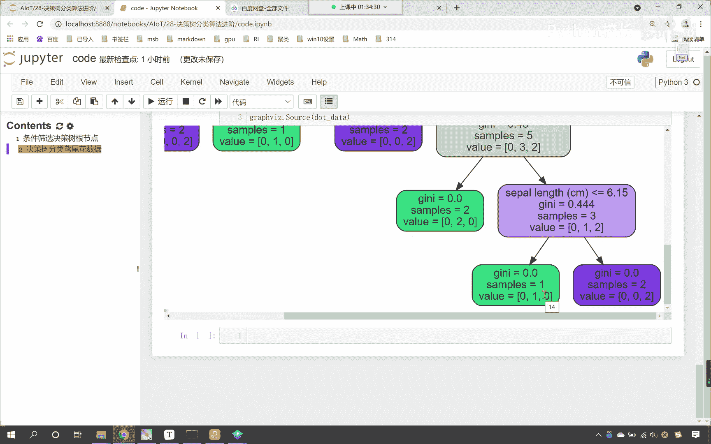

就无论你的数据长什么样对吧，无论你给我的测试数据是是怎样的。

最后是不是都会落到叶子节点上，你想是不是啊，就最后呢咱们这个数据放到咱们看咱们的数据，放到咱们的决策树中，你想他怎么走呀对吧，他走是吧，他这个它划分它一定会划分到某个叶节点上，你说我说的对不对对吧。

它一定会划分到某个叶节点上，你到了某一个叶节点上，那么你的类别就是百分之百确定的，明白吗，你划归到了某个叶节点上，那么你的类别就是百分之百确定的，所以咱们单一的决策树它呢概率要么是零，要么是一没有0。

80。9。

这种情况大家明白是怎么回事了吧。

好，那么这个这部分知识呢。

