# P186：1-决策树与不同算法综合对比 - 程序大本营 - BV1KL411z7WA

咱们现在呢已经学习了决策树的原理，那我们之前学习过逻辑斯蒂回归，咱们学习过支持向量机等分类算法，那么我们所学的决策树这个原理，和咱们逻辑斯蒂回归和支持向量机。

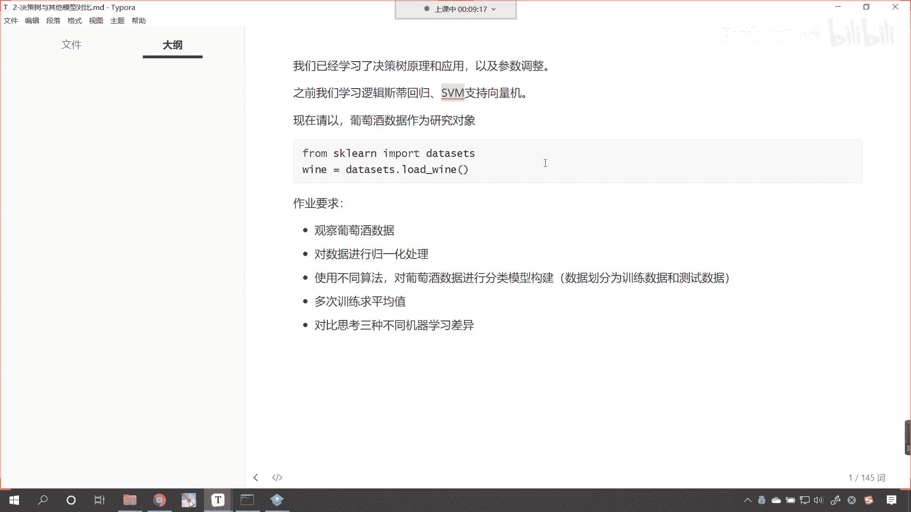

有什么不一样的地方呢，大家还记得咱们在上一节课的时候。

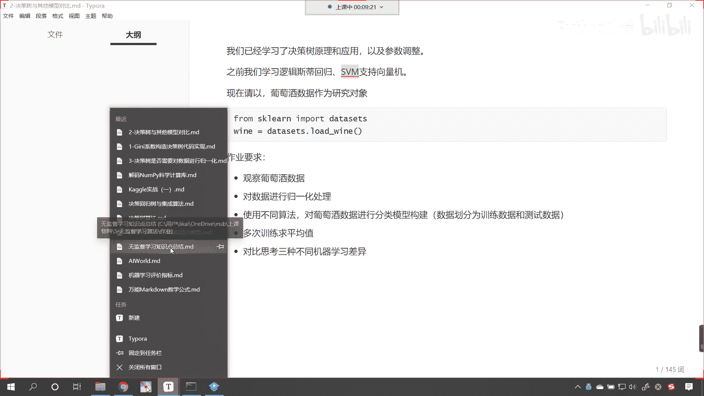

最后呢我们问了一个问题，对不对，好咱们往后滑滑动到最后最后这个问题呢，咱们说你想一下逻辑斯蒂回归，支持向量机这些算法，它有没有决策树的这个这个特征重要性呢对吧，这个呢特征重要性呢。

属于是咱们决策树的一个副产物是吧，那这个副产物还是很重要的啊，叫做feature importance，在上一节课呢，各位小伙伴众说纷纭，那我们今天晚上呢，咱们就嗯呃来看一下逻辑斯蒂回归。

还有支持向量机这两个算法，它到底有没有，那我们同时呢也看一下，逻辑斯蒂回归和支持向量机，与咱们的决策树这个算法，它们之间的这个差异有什么不一样的地方，现在呢咱们就回到我们的代码当中。

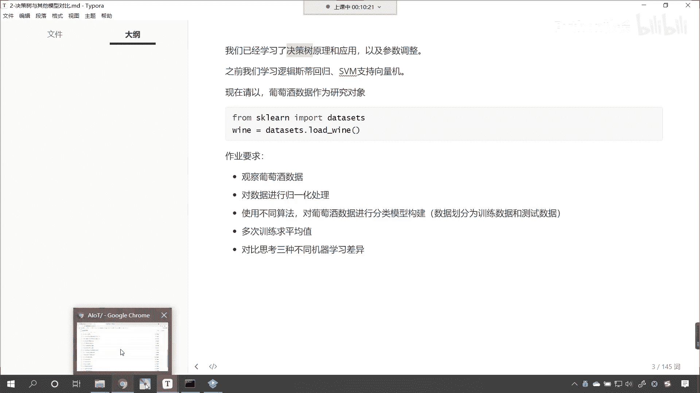

咱们就进入到这个，今天你看这是已经第29讲了，咱们就进入这29讲决策树回归算法。

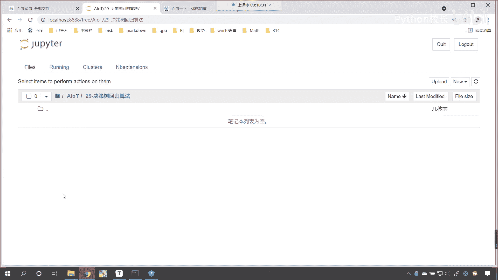

进入这之后呢，咱们在这儿创建一个代码文件，点击一下它，咱们给它改个名儿好，那么首先呢咱们来一个三级标题，那这个呢就是不同分类算法它们的差异，那在这个地方呢，咱们导一下包。

那我们就呃import np as np from sk learn，咱们首先呢将tree这个算法我们导进来，那就是decision tree classifire。

然后呢我们from sk learn，咱们从线性模块下，我们导入logistic regression，然后呢from sk learn，下边咱们从s v m下边，咱们导一个包叫svc，那包导进来了。

咱们还得需要把数据咱们给它导进来，那就是from sk learn，咱们import data sets，这个就是我们的数据集，咱们把这个也给它加载进来好，那么此时呢咱们执行一下这个代码好。

那么此时接下来呢我们再来一个四级标题，咱们呢去加载数据，那咱们就使用data sets，点调用其中的方法叫load one，我们使用其中的白酒，咱们呢作为我们的这个训练数据。

那在这儿呢我们可以接收一下啊，咱们起个名就叫one，看一下这个白酒它呢是分不同等级的，对不对，那这个白酒都分哪些等级啊，大家看啊，等级分为012，那也就是class 0 class 1 class 2。

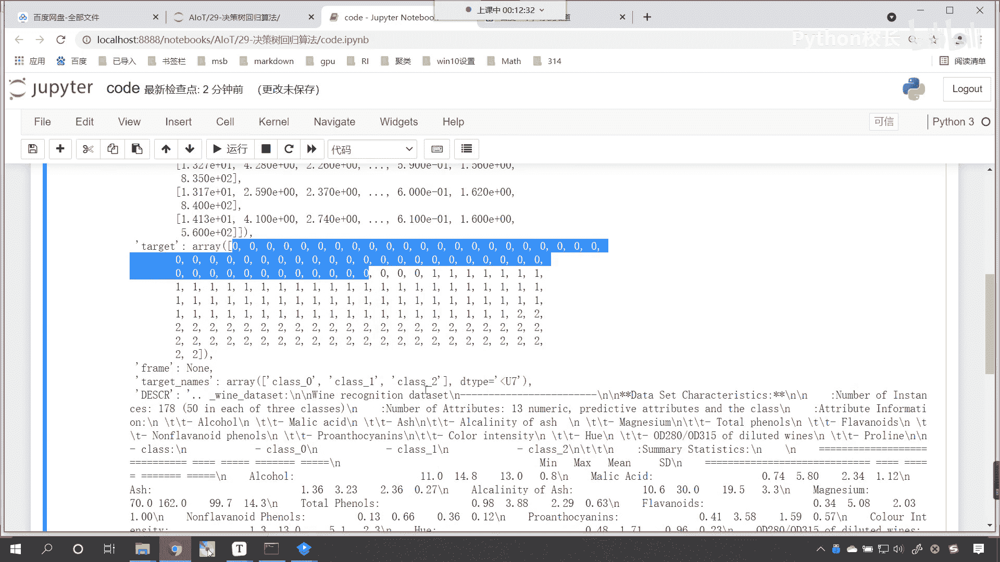

咱们知道这个不同的这个葡萄酒，它含有的这个特征特征值是不一样的啊，你想一下为什么有一些葡萄酒贵呢，为什么有一些葡萄酒还便宜，对不对呀，那这个是不是跟它的特征有一定的关系啊，那我们知道不同的葡萄酒。

它含有的酒精度是不一样的，对不对啊，含有的酸是不一样的，哎等等，你看这些特征，它呢就可以衡量咱们葡萄酒的等级，那么我们有了这些特征，现在呢你可以想一下这些特征是吧，他大概呢有有几个特征呢。

一个两个三个四个五个六个七个八个九个十个，11 12，大概有十几个特征，那这些特征里边是不是有的特征重要一些，有的特征不重要一些啊，对不对，那我们是不是使用咱们的决策树回归。

咱们使用咱们的这个决策树算法，我们是不是就可以得到哪些特征重要，哪些特征是不是不重要呀，对不对好。

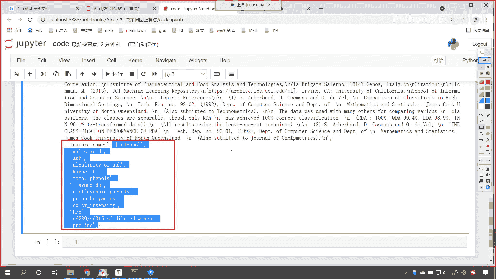

那么咱们现在呢获取一下数据啊，那结合咱们上一节课所留的那个疑问是吧。

说其他的算法向逻辑斯蒂回归这个它有特征，重要性这个属性吗。

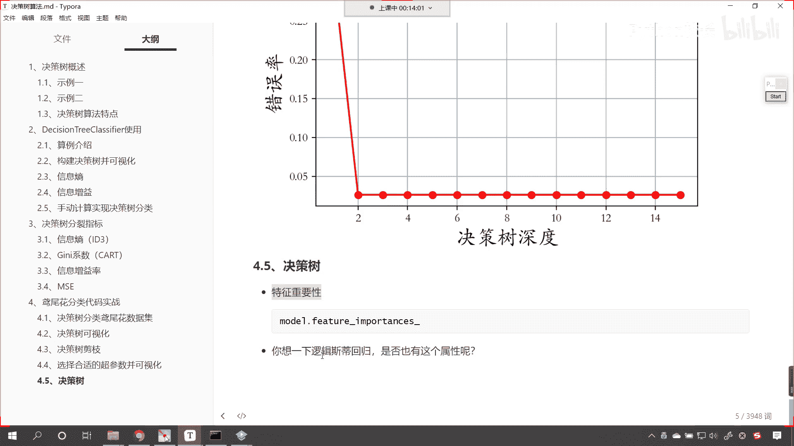

来回到代码当中，咱们现在呢就演示一下，那么我们得到y咱们得到这个数据啊，one中括号，咱们得到data，那咱们这个数据就是x，然后呢咱们给一个y y呢就等于y，咱们来一个中括号，我们叫target数据。

x和y得到了，紧接着呢咱们再导一个包from sklearn，咱们来一个model selection，我们从这个当中咱们导入train test split好。

那么有了这个train test split，咱们是不是就可以加这个x给它一分为二啊。

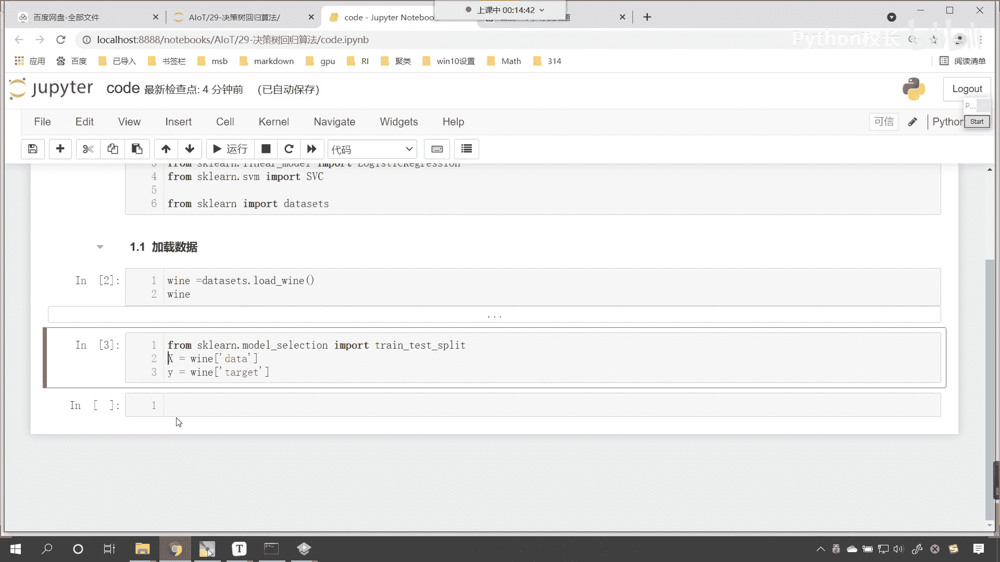

对不对好，那么我们的作业当中是这样要求的，咱们呢要多次训练，我们去求一下它的平均值，对不对啊，还有咱们呢对于数据进行一个规划处理来。

那回到代码当中，咱们此时所加载的数据呢，它肯定不是归一化的数据，咱们在这里打印输出一下来，咱们看一下我们的x它长什么样啊，哎大家看看这个是不是咱们的数据呀，咱们的数据呢它是科学计数法表示。

那我们设置一下叫set print options，咱们给一个super press，我们让它等于true，这个时候咱们的数据各位来看一看，看各位来看一看，此时咱们这个数据，它是不是就不是科学计数法了。

很显然这个数据它是归一化的吗，很显然不是，对不对啊，那咱们现在呢对这个数据，我们对它进行一个归一化处理吧，那就是from sk learn，呃咱们呢从这个咱们也导一下包啊啊。

叫做pre processing，preprocessing，就有预处理的意思，咱们导入standard的scale，这个呢就是咱们的z sc归一化啊，z score规划。

那么我们把这个standard的导包导进来了，现在呢咱们就生成一下这个s t a n d a r standard，我们就让它等于standard的scale，现在呢咱们就调用这个归一化。

那我们就调用fit transform，这个时候咱们就可以将x一把，对它进行一个归一化处理，那我们得到一下x，这个时候呢咱们x再打印输出，各位小伙伴，你就能够看到这个数据呢就是规划的一个结果。

现在你来看是吧，我们规划的结果是不是就有了呀，那在这个地方咱们上面插入一行，我们来一个四级标题好，那么这个呢就是进行归一化嗯，咱们进行归一化处理好数据就有了，有了这个数据之后。

现在呢看咱们就使用逻辑斯蒂回归多次运算，我们去求一下它的平均得分好，那么在这儿呢咱们来一个四级标题，这个呢就是l r逻辑斯蒂回归这个模型的应用，那这个时候呢咱们来100次循环。

for i in range，咱们给一个100，在每一次循环当中，咱们呢都使用train test split x和y，咱们把它一分为二，test size，我们给一个0。2，数据拆分之后。

咱们接收一下，那就是x train x下划线，test y下划线，tra y下划线，test数据在这里就拆分了，然后呢咱们就声明咱们的模型，那就是logistic regression参数。

我们使用默认的以后，你做项目如果更加细致，里边的参数你是不是需要调呀，惩罚项到底是l一正则化还是l2 ，正则还是l2 正则化，这个惩罚项到底选一点还是二点，这个是不是都可以调呀，对不对。

还有咱们的max iter是吧，这个100次够吗是吧，这个是最大的迭代次数，这个都可以调好，那么有了l r咱们让这个模型我们feat一下，咱们将x train放进去，和它对应的目标值外串放进去。

然后l r咱们来一个sc score的话，咱们将x下划线test放进去，这个时候呢我们会得到一个分数是吧，那咱们起个名就叫s，我们100次训练，是不是会得到100次的这个分数呀，那我们在最上面。

咱们呢就给他介绍声明一个死杠，让它等于零，每一次一个模型计算了分数，咱们呢就让它加，等s我们来一个除以100，看这个之所以除以100，是不是每个模型所占的比例就是1/100啊，等这个for循环结束。

咱们print输出一下啊，在这儿的话，那就是l r逻辑回归这个算法多次运算，我们的平均得分是英文的逗号，然后我们将scar在这输出一下，逻辑斯蒂回归有可能会出现这个嗯这个提示，所以说呢提示和警告。

咱们将warning导包导进来，warnings。than filter warnings，咱们呢给他一个now，就是忽略掉先执行这个代码，现在呢咱们就运行一下好，那么我们既然有100次循环。

此时呢咱们就使用魔法指令嗯，咱们看一下下面这一段代码，一共执行花了多长时间是吧，这是100次循环，来我们一运行好，现在咱们就能够发现此时是不是报错了呀，看啊syntax error，我们的语法错了。

那大家看for i是吧，我们少一个in，对不对，那我们往上走，咱们在这儿呢给它加一个in啊，此时再来执行这个代码好，大家看咱们是不是这个少一个y是吧，你看l r score这个地方。

咱们只是将测试数据放进去了，和它所对应的真实值，那就是y下划线test，此时咱们再来执行代码来，各位小伙伴就能够看到逻辑回归多次运算，咱们的平均得分是不是98呀，对吧好，那么逻辑回归有了。

接下来呢咱们再来一个四级标题，那就是s v c，这个s vc呢就是我们的支持向量机，咱们模型的啊，这个是支持向量机，咱们模型应用一下，那重复的代码，咱们现在呢复制一下啊，ctrl c复制一下。

在这咱们来一个粘贴。

此时我们修改，咱们是不是只需要修改这个l r这个地方呀，咱把模型呢定义成model，那么在声明变量的时候呢，咱们也给咱们呢就给一个s vc，那下面训练这个地方，咱们就使用model预测这个地方是吧。

模型验证得分这个地方咱们也修改成model print，打印输出这个地方是吧，咱们修改一下啊，把这一部分选中删除，这就是s v c支持向量机，多次运算平均得分，我们看一下它的表现怎么样。

花费的时间怎么样执行，来，大家现在就能够看到支持向量机多次运算，咱们的得分是不是98。36呀。

是不是比这个稍微高一点点来，现在这个代码再来复制，我们在下面再来一个四级标题，现在呢咱们就使用决策树是吧，这个是决策树模型它的一个应用。

此时呢我们在这儿来一个粘贴svc，咱把它删除掉，修改成decision classifire，此时呢我们运行这个代码，打印输出这个地方，咱把它删掉，这个呢就是决策数多次运行。

我们看一下咱们的平均分是多少，好现在我们发现决策数运行完之后，这个平均分是不是0。986呀，看到了吗，你看他的得分是不是就不太高呀，看到了吗，他的得分是不太高的啊。

咱们说这个决策树呢它是一个重要的算法啊，但是呢有一些数据逻辑回归或支持向量机，它就更加适合，那此时呢咱们将决策树这个模型循环次数，咱们给它增加，我们给它增加成1000个，这个时候咱们再来执行诶。

大家看啊，这个时候你看我们把它的次数增加，决策树是不是没有发生什么变化呀，对吧呃这个时候其实应该是除以1000的啊，再来执行一秒钟，是不是0。9039呀，基本没变化，那上面呢你看上面啊。

咱们的支持向量机，我们把它调整成，咱们把它也调整成1000好，那么除法这也来个1000，咱们执行一下好，大家看支持向量机是不是也也特别稳定呀。

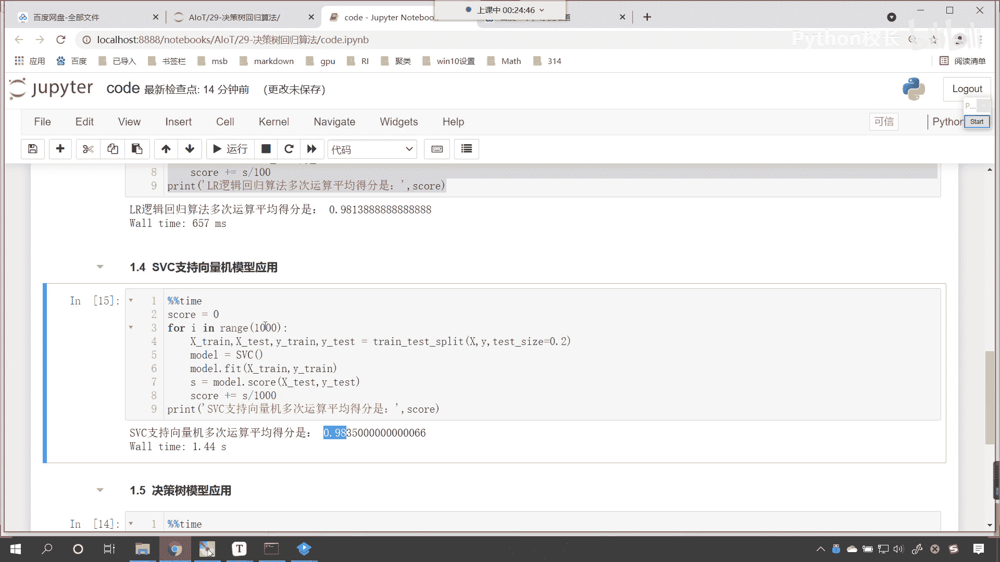

无论我们给1000还是100，是不是都是98。3对吧，那咱们这个逻辑斯蒂回归，那肯定也是一样的，好，大家有没有记得，咱们刚才进行了一个归一化处理，那假如说我要不进行归一化处理会怎么样呢。

现在咱们将归一化处理这部分代码，咱们给它注释掉，也就是说我不进行归一化处理了，咱们将这个数据直接加载是吧，看直接加载，然后呢咱们使用逻辑斯蒂回归，我们测一下啊，你看啊，一直行，大家观察时间。

原来咱们的时间是657ms啊，现在我执行一下，看一下，此时咱们逻辑斯蒂回归他会怎么样，此时各位小伙伴，你能够看到咱们所花的时间和刚才相比，是不是就慢了一点呀，准确率你会发现看准确率怎么样了。

准确率是不是变小了呀，看到了吧，准确率变小了，支持向量机呢我们也运行一下啊，你看啊，来咱们运行这个代码，看一下知识向量机，大家现在发现这知识向量机我们运行了1000次，这平均得分是不是就变成了67%了。

咱们再看决策树是吧，执行诶，大家看啊，决策树你看有没有变化，此时你记着，咱们的数据是没有经过归一化处理的，那决策数它的得分是不是依然是0。906，和刚才是不是差不多呀，他嗯这个一点一点的波动是吧。

它呃这个一点点的波动是吧，就像这种轻微的波动，我们可以认为它是没有变化的，你像咱们上面支持向量机，这个波动是不是特别剧烈，咱们逻辑斯蒂回归这个波动呢，也发生了一个比较大的变化，特别是逻辑斯蒂回归。

它运行时间是不是比较长呀，哎那现在你就要想一想，这是为什么呀，对不对，这是为什么，咱们在这儿我们就来一个总结是吧，哎这叫做不同算法，咱们呢来一个总结对比好，那么其一呢哎咱们来一个第一点啊。

其一这第一点呢，唉就是这决策树，看它呢对咱们的数据是否归一化，它是不是不敏感呀，对不对，你看决策树对我们的数据是否规划，这个是不敏感的呃，第二呢咱们的逻辑回归是吧，如果不进行归一化，咱们的准确率降低。

我们的运行时间是不是会增加呀，接下来咱们的s v c支持向量机是吧，如果，如果不进行归一化是吧，咱们的准确率是不是大大的降低了对吧，大大降低，你想这是不是咱们这三种算法它的一个差异呀。

那最后呢咱们再看一下，咱们呢先声明一个决策树这个算法啊，复制一下，在这儿来一个粘贴，选中他shift tab，这个时候缩进它就向回缩了，我们按的是shift tab模型进行了训练。

咱们得到它的feature importance，这个时候你就能够看到这个特征重要性，这是吧，是不是就出来了，很显然这第一个特征是不是不重要，第三个特征对于这个葡萄酒的分类，是不是也不重要，看到了吧好。

那么我们上面的代码咱们呢再复制一下，在这儿呢我们再来一个粘贴啊，咱们将这个模型我们给它修改成支持向量机，好不好，看一下支持向量机有没有这个属性，此时我执行一下，你想一下这个代码能不能返回一个结果。

会不会为我们返回特征的重要性，你想一想来讨论区里边回复一下是吧，不会认为会的是吧，你就回复一个会啊。

来此时我执行啊，来各位小伙伴，你就发现这个支持向量机怎么样，是不是has no attribute feature importance呀，他告诉你知识线缆机这个算法是吧，没有这个特征好。

那么我们看一下model点，这个时候呢看咱们来一个点，来一个点就可以把这个算法是吧，它有哪些属性，在这里会为我们显示一下，看到了吧，在这里会为我们显示一下，你可以从这儿找到它相应的这个特征。

那从这找到它相应的特征，咱们之前在学知识向量机的时候，我们学习过support vector，对不对，嗯这个就是支持向量，那在这儿呢咱们没有发现它描述特征，重要性的这个属性，是不是你看你往上滑有吗。

是不是没有呀，看到了，那比如说这个max iter，这是它最大的迭代次数，是不是还有这个intercept，这个是截距，我们再往上看，他呢有一个call if，咱们呢把call if我们给它打印。

输出一下上面这个feature importance，没有，我们就把这个代码注释掉，此时你看我一执行，大家看扣扣if是不是也没有呀，报了个什么错，这个q if是系数，就是你这个系数呀。

只有当你这个和函数是linear的时候，那么你才可以调用call if，对不对呀，所以说现在咱们s v c这个算法，它默认的核函数是r b f就是高斯核函数，那么啊那么这个方法啊。

他呢就没有返回咱们的特征，重要性相关的这个信息，特征重要性的信息它呢都没有，大家明白吗，这个算法都没有啊，来现在咱们再把这个复制一下，再来一个粘贴，我们把这个算法。

咱们给它修改成logistic regression，逻辑斯蒂回归我已执行，哎，你现在能够发现逻辑斯蒂回归是不是也没有呀，对不对，那我们把它注释掉啊，逻辑斯蒂回归虽然它没有这个特征。

但是呢它有一个什么呀，他有一个扣一，这个扣if是什么，看到了吧，扣if是不是他的这个斜率啊，看到了吧，扣if是他的这个斜率啊，那各位小伙伴，你现在呢来观察一下这个斜率。

你能不能通过斜率来找到咱们特征的重要性，或者说它不重要呢，你仔细观察一下是吧，一般因为我们这个，因为咱们这个逻辑斯蒂回归呢，现在是一个三分类问题是吧，现在是一个三分类问题，那如果是三分类问题。

其实呢它就有三条线，现在你就能够看到是吧，我选中的这是一条线，中间的是不是也是一条线呀，最后的这个也是一条线，咱们刚才讨论区里边有小伙伴就提到了，说越靠近零，这个影响就越小，你要注意啊。

这个方程它描述的并不是咱们特征的重要性，这个方程它是不是，咱们之前在讲逻辑斯蒂回归原理的时候，这条线它的作用是不是，就是把咱们的点儿分成几部分呀，哎你思考一下是不是，你看假如说这上面有有一类底。

是不是啊，你看这上面这上面有有一部分底，是不是啊，然后那我们再来一个颜色啊，绿色的，你看下面有一部分点，是不是，假如说下面有一部分点是吧，下面一部分点，所以说呢这个权重大家注意啊。

这个权重它不能表示咱们的特征重要与否，咱们这个结论呢我们把它写到这儿啊，这个l r l r它所返回的系数，它呢不能表示特征重要与否，所以说呢无论是支持向量机也好，还是咱们的逻辑回归，逻辑回归也好。

它们所返回的系数，都不能表示咱们的特征重要性，那上一节课咱们所留的那个疑问，在今天这一节课里边儿，咱们做一个收尾是吧，那也就是说呢，咱们的决策树这个算法，在学习了我们的数据之后，它呢是有特征重要性的。

而咱们的逻辑斯蒂回归和支持向量机呢，这个是没有的，当然在我们的回归模型当中看，在咱们的回归模型当中，大家注意，在这个地方呢，我再给你一个结论啊，在我们的回归模型中，比如说线性回归它的系数大小。

它的系数的绝对值大小，也可以表示咱们特征的重要性啊，它也表示特征重要性，因为非常直观，你看这个系数的大小，是不是就表示你看它的权重的这个多和少呀，对不对，所以说在线性回归，领回归呀等一系列回归算法当中。

这个系数绝对值的大小，也在一定程度上表示了咱们特征的重要性，好那么到此为止是吧。

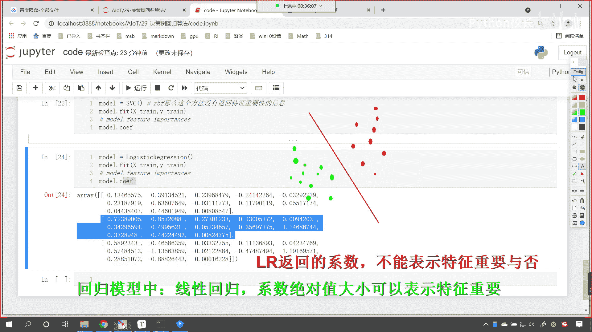

咱们这个问题我们就探讨清楚，搞明白了，这个呢也是我们上一节课所留的作业好。

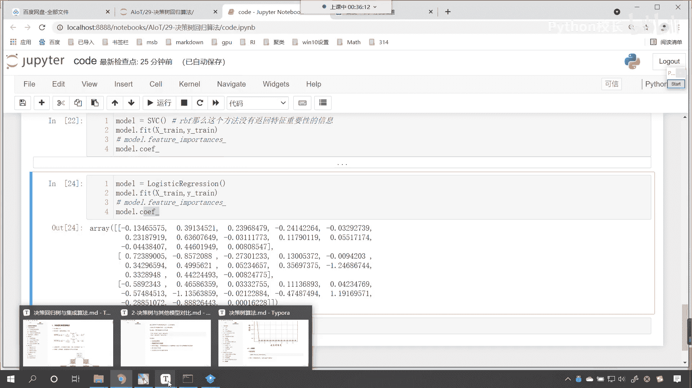

那么呃不同模型之间的差异是吧。

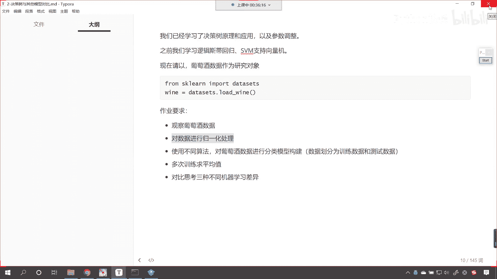

咱们就看到了好，那么呃最后呢我们再说一下，咱们进行归一化处理和不进行归一化处理，对于逻辑回归，对于咱们的支持向量机，那他的影响是非非常深远的，所以说你以后呢在使用这类算法的时候。

你要注意巧妙地使用呃这个归一化处理，那它的底层原因呢，是因为咱们的逻辑回归和支持向量机，它在进行优化的时候，它使用了梯度下降，梯度下降呢跟咱们数据的这个量纲之间，有非常大的关系是吧。

我们说如果有一个特征值非常非常大是吧，那它是不是会影响其他的这个属性的，这个发挥呀，就像咱们白天天上有没有星星呢，有但是我们看不见，为什么呀，是因为白天太阳出来了，太阳的光芒是不是特别耀眼呀。

是不是把星星的光芒是不是就遮盖，是不是就遮盖住了呀，同样如果你的数据当中有一个属性值特别的大，那你想你其他的属性，在这个特别大的属性的面前，是不是就微不足道呀，对不对，所以说呢。

这就是我们为什么要进行归一化处理的，原因所在，而决策数呢不是使用梯度下降，对不对，昨天咱们讲到的决策树，它的原理跟梯度下降没有关系，所以说呢你的属性值大和小，对我不会造成这样的影响。

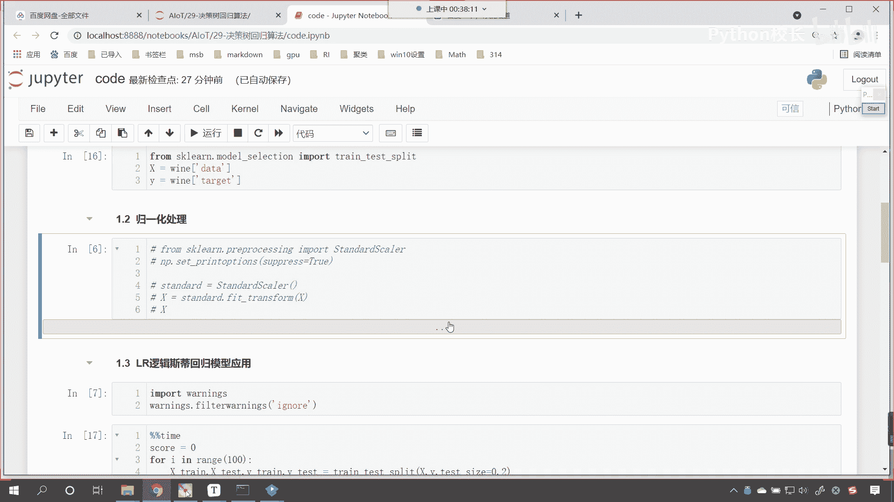