# P188：3-决策回归树算法示例演示 - 程序大本营 - BV1KL411z7WA

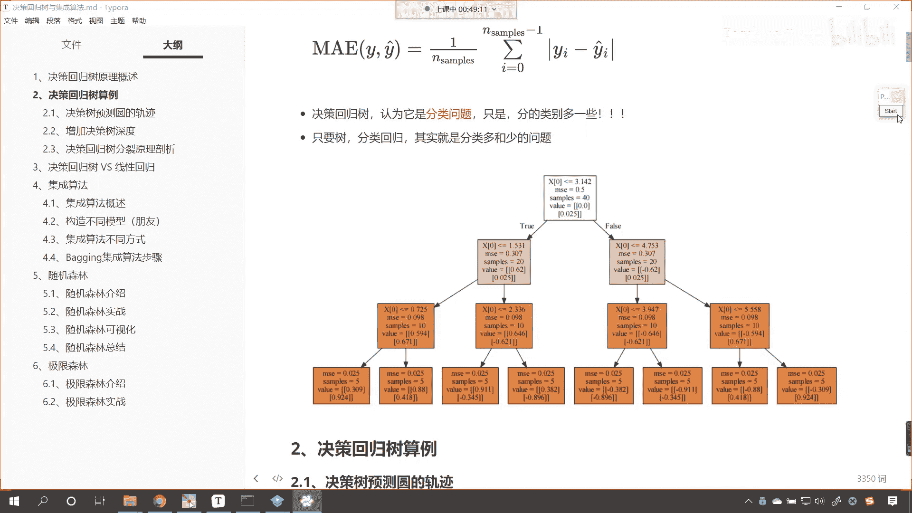

来接下来咱们看一下我们决策树回归。

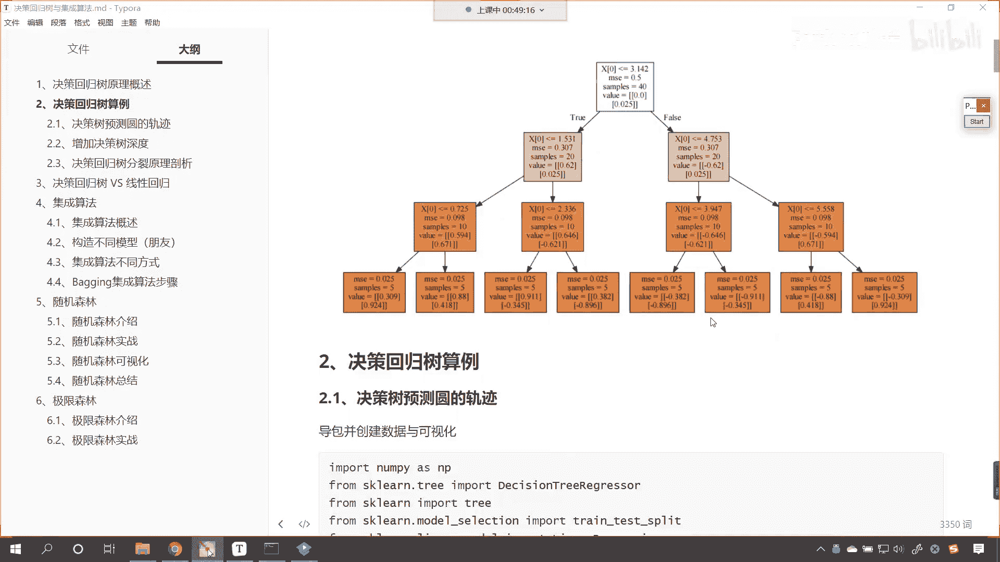

咱们给一个算力啊，咱们给一个例子好，那么此时呢咱们就回到我们的代码当中。

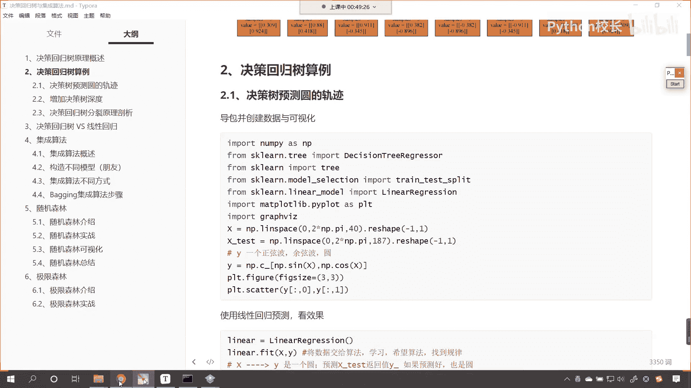

我们往下滑，咱们在这儿呢，给他来一个三级标题，这个呢就是我们的决策回归数，咱们给一个示例，咱们点开咱们的目录好，那么这个时候目录就呈现了是吧，我们把这个可以关掉，那现在呢我们导一下包啊。

咱们from sk learn，咱们来一个tree，我们import叫decision tree regression，这个就是咱们的回归数，然后呢我们from sk learn。

咱们import train，我们将数导进来，这个方便咱们画图，然后呢我们嗯再导一个包啊，咱们import np as np，那为了能够显示咱们的这个数据情况，我们import matt plot。

lib pie，plot画图工具，我们给它导进来，执行一下这个代码，紧接着呢咱们来一个四级标题，在这个地方呢，我们呢就创建数据好，那么创建数据呢，咱们就给一个x下划线叫x下划线train，咱们使用np。

lin space，我们给他创建一个等差数列，0~2倍的np。py，很显然咱们这个是不是一个正弦波的数据呀，那我们把它分成多少份啊，咱们把它分成40份看啊，这就是40个点。

我们通过n peter line space，咱们得到的数据是一味的，它的形状呢不符合，不并不符合咱们机器学习的嗯这个要求，所以在这个地方咱们来一个reshape-1和一好，那么这个时候咱们的训练数据。

它呢就是符合要求啊，他就是符合要求的二维数据，现在你想一下，为什么它必须得是二维的啊，为什么咱们这个数据必须是二维的呀，你看二维由两部分组成，是不是一个中框，再来一个中框，是不是再来一个中光逗号。

再来一个中光好，那么嗯里边这个呢我们可以叫做样本一是吧，然后呢样本二样本三嗯，是不是一直是省略号呀，对不对，也就是说你的数据是二维，它可以表示成这种形式，就是样本一样本二样本三，样本四是吧。

后面是省略号，也就是说这个是多个样本，你看它呢就可以表示多个样本，而每个样本你看而咱们的每个样本，它是不是又包含多个属性呀，对不对，看每个样本又可以包含多个属性，这个时候你这个样本呢它可以有高度。

有宽度是吧，还有长度好，那么这个时候咱们的数据就搞定了，搞定了数据之后呢，咱们给一个y啊，你看y是什么呢，y呢就等于np点，这个时候呢咱们来一个这个吉连叫cn cat啊。

咱们来一个cocat conky net，来一个吉连好，那么这个数据y肯定是从x这儿得到的，对不对，数据y肯定是从x这得到的，那咱们再进行几连的时候呢，咱们求一下x寸的正弦波，再求一下它的余弦波。

那就是np。s咱们将x下划线train放进去，然后np。cos咱们将x下划线train放进去，那么吉连的时候呢，咱们要指定一下轴，咱们让他最后一位进行集连，这个时候咱们就会得到一个y。

这个y呢咱们起个名叫外衬好，那么你知道我所创建的这个x和y tru，这个外衬它是什么样的一个数据吗，你知道我创建的外传是什么样的一个数据吗，来咱们p l t咱们调用scanner是吧，来一个小括号。

我这个外衬呢它的形状呢，它肯定它的shape肯定是等于40和二，对不对，这没跑啊，这这是必然的，因为因为我们在这进行了计算，求了一个正弦，求了一个余弦是吧，所以说它一定是40和二好。

那么咱们这个形状是什么样呀，如果我要画图给它画出来，它长什么样呀，唉它的形状呢是一个圆，知道吗，它的形状是一个圆，现在咱们就画一下哈，好那么我们用scatter来绘制，那就是外传中括号冒号。

咱们来一个零，这是他的第一位，然后外tru中括号冒号，咱们来一个一，这就是它的第二位，此时你看我一执行这个代码，大家看画出来的是不是一个圆呀，现在咱们看起来像一个椭圆，对不对。

那此时你观察一下它的横纵坐标，看到了吧，横坐标是不是-1~1，纵坐标是不是也是-1~1啊，这个时候怎么给变成椭圆了，是因为它的比例不是一比一，对不对，那这个时候咱们给它设置一下比例啊，那就是p t。

figure是吧，咱们给一个figure size，咱们让它是四和四，这个时候你看过一执行，咱们这个时候得到的是不是就是一个圆呀，对不对，因为我们只要给了一个，咱们只要给了一个角度值是吧，0~2派。

那这个值0~2派，它其实就是一个正圆，那我们的圆和咱们这些底是什么样的关系呢，是不是就是正弦波和余弦波呀，看到了吧，我们之前高中的时候学习三角函数，往往和圆是不是分不开关系呀，对不对。

你看这个时候你看通过咱们数据可视化，你是不是一下子就明白了这个正弦波，余弦波他们俩一组合是一个什么样的情况，对不对，那如果把这部分代码是吧，交给初中生，高中生他们一看到就明白了是吧，印象肯定特别深刻。

什么是正弦波，什么是余弦波好，那么现在咱们的数据就创建好了，那创建好数据之后呢，咱们还差一个测试数据，咱们在这个地方呢给一个x下划线test，我们就等于np。line space。

咱们小括号从0~2倍的np点派，我们此时呢咱把它分成多少份呢，咱把它分成256分，大家看啊，我们把它分成256分，这个时候咱们的测试数据和上面的训练数据，肯定就很不一样了，上面是分成了40分。

这个地方我们分成了256分好，那么同样它的形状也必须得转变一下，那就是-1和一，这个时候咱们执行这个代码好，此时咱们的数据就创建好了，好，那么你想咱们现在这个问题，是不是就是一个回归问题啊，对不对。

那x train和咱们的外衬，它们之间是不是有这样的一个关系啊对吧，因为这个数据上面，这个假数据是我们自己创建的，所以说我们代码，我们程序员知道它们之间的对应关系是什么，对吧。

现在呢咱们给了一个测试数据，我们希望咱们的算法也能找到它们之间的关系，对不对，好，那这个时候该怎么找呢，看这个时候该怎么找呢，咱们首先呢使用咱们的线性回归，我们来预测一下。

看看线性回归他能不能找到这个关系是吧，咱们首先，啊咱们首先使用线性回归，我们呢来操作一下好，那么呃这个时候呢，咱们导一下包他们from sk learn，点linear model。

咱们从linear model当中导入linear regression，那我们执行一下，然后呢我们声明一个model就等于linear regression，然后呢咱们使用model。feat一下。

我们将x train放进去，目标值外衬也放进去，ok现在就建模了，大家看啊，此时我们就建模了，那这个模型到底怎么样呀，来咱们model点咱们predict一下，将测试数据x test放进去。

返回的值我们就叫做vega predict，看那上面是建模，这个是不是咱们的预测呀，那到底准不准呢，嗯在这儿呢到底准不准，咱们给一个标准啊，如果咱们的线性模型预测效果很好。

你看原来咱们的这个数据是不是一个圆，如果他预测的效果很好，你想一下咱们预测效果很好，那么我们绘制了咱们的测试数据，它应该是一个它应该是一个什么，它是不是应该是一个标准的圆呀。

你想它是不是应该是一个标准的圆，对不对，因为你只要能够找到它们的规律，那你得到的这个数据应该也是一个圆，对不对，那我们看一下咱们到底有没有找到啊，调用plt。scanner是吧。

咱们将y下划线predict中括号冒号零放进去，好在咱们画之前，我先问一个问题，咱们的外下划线predict它的形状是什么样的呀，看它的shape等于多少呀是吧。

那我们在这个地方咱们display一下啊啊咱们display一下，那就是y下划线predict。shape，咱们打印输出一下它的形状是吧，s h a p e，你想一下啊，它的形状是什么样的，各位小伙伴。

你可以在讨论区里边把它的形状是吧，来发一下哈，好，那么你想这个形状和咱们的x test，是不是有非常大的关系啊，这个y predict和咱们的x test，大家想他俩有关系吧，对不对，看因为因为什么。

因为这个y predict是不是由咱们的x test，预测出来的呀，对不对，所以他俩有关系，那x test是什么样的形状呀，对吧，哎你看这个地方有一个256，是不是，那我们就执行一下啊。

来我们不仅把图画出来，同时呢咱们将咱们这个模型是吧，它的这个形状给它输出一下，你看此时我一直行，来，各位小伙伴，你能看到咱们得到的结果是多少，是不是256和二啊，对不对，哎。

所以说呢你一定要搞清楚数据之间的对应关系，一旦你搞清了数据之间的对应关系，那么机器学习你基本上就学会了90%了，明白吗，其实我们和数据进行打交道是吧，这个模型它是现成的，你工作当中其实就是应用是吧。

你水平高，那你应用的更加溜一些，玩的花样是不是多一些呀，对不对是吧，好现在我们就能够看到咱们预测出来的，你看它是一个圆吗，是不是一个圆，不是圆是吧，果然如它的名字一样是吧，这个算法的名字叫什么线性回归。

你看他预测出来的结果就是什么样，是不是就是直来直去的一条线，对不对，你看它就是线，对不对，好，所以说这个算法看到了吧，这个算法对于我们这种问题很显然就失效了，是不是好，那么接下来呢咱们再来一个哈。

那我们看一下svr是吧，这个n这个支持向量机，那咱们看一下这个支持向量机是否好使是吧，from sk learn，点svm，咱们从这个当中导入svr 2，这个就是咱们的支持向量机，它的回归算法。

那么上面的代码咱们就复制一下啊，上面的代码复制一下，在这个地方来一个粘贴，linear model regression，我们把这个删掉，咱们声明一个s vr，那么里边的核函数咱们是不是就可以选了呀。

我们给一个r b f是吧，咱们试一下啊，给一个r b f，这个r b f就是咱们这个高斯核函数，来此时执行，各位来看一下啊，看一下咱们这个这个结果，看咱们的y数的b e d a a。

咱们got n n d a40 和二是吧，那这个时候你看咱们的支持限量机，在使用的时候，它是不是报了一个错呀，是不是说明咱们的外衬这个形状看到了吧，这个形状必须得是这个一维的对吧。

那而我们此时咱们的y是嗯，咱们的y是几维的，咱们的y是二维的，所以这个r b f这个建模是不是马上就不行了，然后呢咱们给一个linear啊，我们给一个线性的，大家看咱们给线性的是不是也不可以啊。

那我们给一个多项式啊，polly哎，你看我一执行，大家看，此时是不是就说明咱们这个就走不通了呀，那我们使用这个支持向量机，你看它对于这个数据而言是吧，他就这个捉襟见肘，黔驴技穷了，他呢就不行了啊。

你看看咱们的外传是吧，这个数据它呢确实是二维的啊，而我们的线性模型，看线性模型遇到这个问题的时候，是不是没有问题好，那么咱们的知识向量机呢，对于我们的数据y是有形状要求的。

那所以这个时候呢啊咱们这个这个数据呢，就嗯嗯这个算法对于这样的数据它就不太合适，那咱们看一下咱们的决策树，看我们的决策树算法，看一下他怎么样是吧，这个时候咱们也来一个粘贴，ctrl v。

咱们将linear regression给他替换一下，叫decision tree，这个时候就不是classifire了，对不对，叫decision tree regressor，大家要注意。

我们刚才在介绍算法原理的时候，咱们说这个决策回归数啊。

我们说到了这个决策回归数。

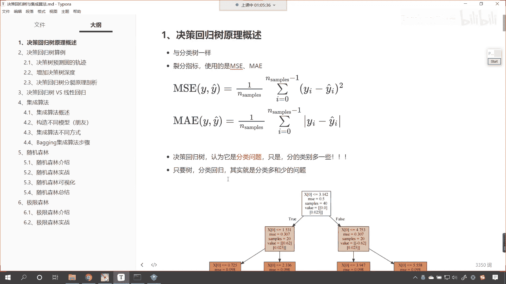

咱们说到了这个树的深度，对不对，那这个树的深度是不是有它的裁剪。

是不是有它的一些参数来决定的呀，那其中有一个参数叫max depth，这个就可以控制它的深度，比如说咱们给最大的深度是三是吧，我们尝试一下啊，看我执行这个代码来，现在各位小伙伴。

你就能够看到咱们预测出来的结果是这样的，看到了吧，这是画出来了好，那么这个时候呢咱们plt点，这个时候给一个equal eq u a l，你看我们给一个一口，它也可以是一个圆，看到了吧，咱们给一个一口。

我们对于轴进行设置这个axis ax i s，这个呢就表示咱们的坐标轴，我们如果要设置了个eco，它表示什么意思呀，你翻译成中文就明白了，这个eco是不是就表示相等呀，相等是谁和谁相等。

唉就是咱们的横纵坐标，它的刻度值相等，如果要是刻度值相等，你看这个时候我画出来的图，看是不是就是一个圆呀，看到了吧，像不像一个圆，咱们是不是把圆的这个规律，决策树是不是给我们预测出来了，看到了吧。

那我们这个地方有一个打印输出是吧，它在这进行了一个操作，那我们用一个下划线杠，咱们来接收一下它，这个时候就不会有这个打印输出了，因为打印输出对我们来说没什么用对吧，所以我们来一个下划线杠哈。

这个时候你来看诶，大家来看看这个决策树是不是就有了，像一个圆吧，是不是就比较像一个圆了，那么此时我们的这个决策树它长什么样呀，来咱们把它画出来，这个时候呢咱们就调用tree是吧。

这个时候我们还得导一下包啊，咱们import graph vz，我们把这个导进来，然后呢咱们就调用tree。explograph vz，把哪个模型导出来啊，上面的这个model。

然后我们给它填充一个颜色，few来一个true，然后呢我们给一个run的，也让它是true，现在导出来这个数据，我们接收一下，那就是dot data，有了dot data。

现在呢咱们就用graph v i z，调用其中的source这个对象，把数据放进去，这个时候咱们是不是就可以构建咱们的图形了，图形就叫graph。

输出一下这个graph来，各位小伙伴。

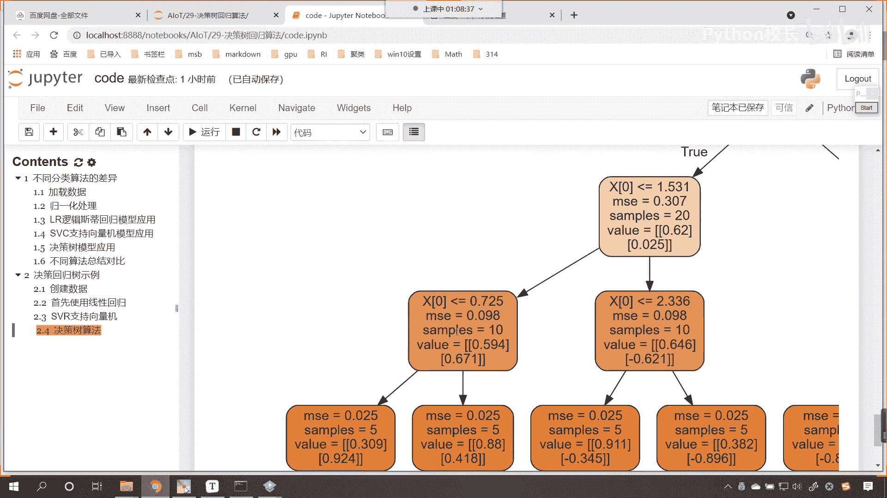

你就能够看到一棵决策树是不是就出来了，深度是几。

深度是不是三是吧，你看深度是三，最后咱们分成了几个叶节点是吧，看大家深度是三。

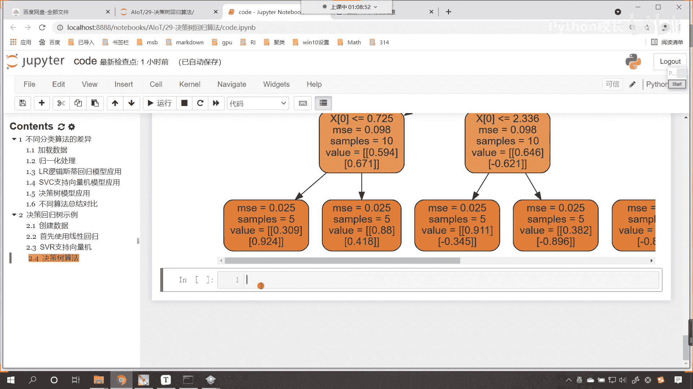

分成了几个叶节点，那就是二星号星号三次幂是吧，就是八个，看到了吧，唉算一下就是八个啊，看这棵树是不是就比较大。

哎这就是咱们决策回归树它的一个构建。

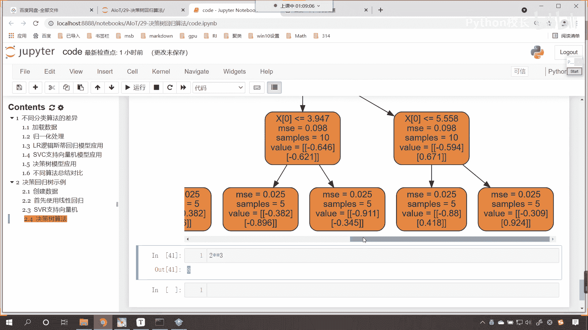

到这还没完，接下来呢咱们继续看啊，看上面这个咱们给的深度啊，在这儿咱们进行说明一下，咱们决策树的深度是三是吧，那我们调整一下深度，咱们在这儿再来一个叫做决策树深度呢，我们给它调整成四好。

那么来复制一下这个代码，在这儿来一个粘贴，那么我们把max depth咱们给它调整成四，这个时候你看过一执行来，各位小伙伴，你能够发现此时这些点儿是不是就多了一些呀，你告诉我咱们的深度是四的时候。

我们这个当中一共有多少个点呀，看看一下咱们这个当中有多少个点儿，我们有16醋点，大家看啊，我们有16醋点嗯，对不对，咱们用16寸底嗯，那我们这个时候呢我再问你一个问题啊。

看这个时候问你一个拷问灵魂的问题，咱们画图画的时候，画图画的是不是y predict呀，对不对，请问这个y predict是吧，它有多少个点，看这打印这个地方是不是直接打印输出了，是不是256呀。

你要注意啊，虽然咱们画出来这个点看上去它是16个，其实咱们这个点是多少个呀，看因为我们这有了是吧，其实呢咱们的点儿是不是还是256个呀，为什么画出来咱们的效果显示是16个点呀，大家注意啊。

我们把它叫做16醋点，让我们把它叫做16寸点，那么每一簇点当中有多少个点呢，有16个啊，咱们的每一簇或者说叫每一类是吧，它含有16个点，他们是这样的一个关系，明白吗。

因为你如果说这个点儿要是数值一样的话，你想咱们画图画出来是不是就摞到一起了呀，看到了吧，它呢是摞到一起了，明白吗，它是摞到一起了，所以说你肉眼看出来，你肉眼看起来的效果好像是16个点。

其实呢是256个点，上面咱们的深度是三的时候，你看起来像八个点，其实呢它也是256个点是吧，那现在呢我也给你看一下这棵树，它的形状复制咱们的代码，在这儿呢，咱们来一个演示。

你看这个时候这棵树你来看是不是就更深呀。

对不对，你看这棵树就更深了啊。

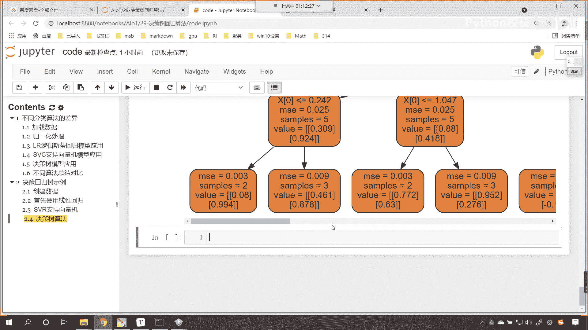

它的最后呢看到了吧，是不是就特别深，像这种图形是吧。

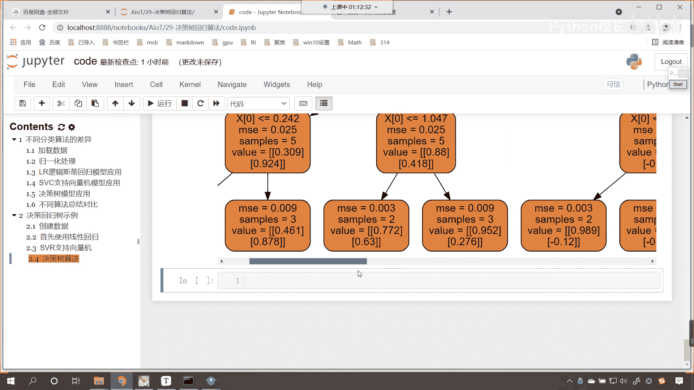

你可以保存是吧，你可以保存啊，好那么最后呢咱们不控制数的深度，看ctrl v，我们不控制数的深度，那max steps默认情况下它是nine，如果要是nine，那么他会把这棵树展开。

让这棵树的深度是最深，知道吗，哎这个时候呢咱们不进行减脂操作，那不进行减脂操作，默认这棵树呢它会展开来，此时呢咱们执行一下这个代码哈，你看我运行来，现在现在你就能够看到啊，看现在呢咱们不进行展。

咱不进行减脂操作，默认咱们是不是它的一个这个状态啊对吧，那这个时候呢咱们画出来啊，在画之前咱们调用model点，我们把它的深度给它打印输出一下，咱们看一下啊，看max depth点。

咱们得一下它的这些属性叫做get depth，你看它有一些方法是不是叫做get呀对吧，来咱们执行一下啊，大家看啊，他给了我们一个深度，这个最大的深度是不是给了个六呀，对不对，那如果要是六的话。

咱们二的六次幂嗯，星号星号你看一下它是几个点，它其实是不是就是64个点呀，它并没有将我们这256个点，完全构成一棵树是吧，因为你想也没那个必要吧，对不对，因为也没有那个必要。

那如果说我们的数据是2万个数据，或者说10万个数据的话，难道我们使用决策树在进行操作的时候，他会把这10万个数全部给我们展开吗，也不会，对不对呀，好那么这就是咱们默认展开，他给了一个参数呢。

哎这个就是深度是六画出来，咱们看一看啊，复制一下这个代码在这儿呢。

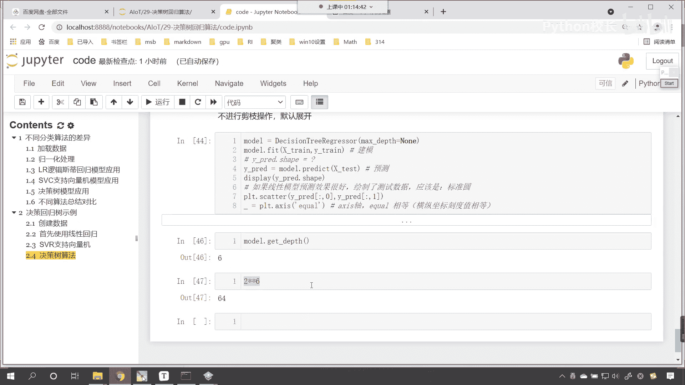

咱们来一个粘贴好，你看我一运行，大家看啊。

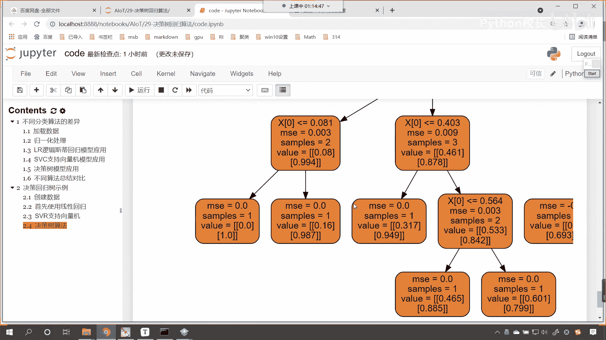

你看这个数的深度看到了吧。

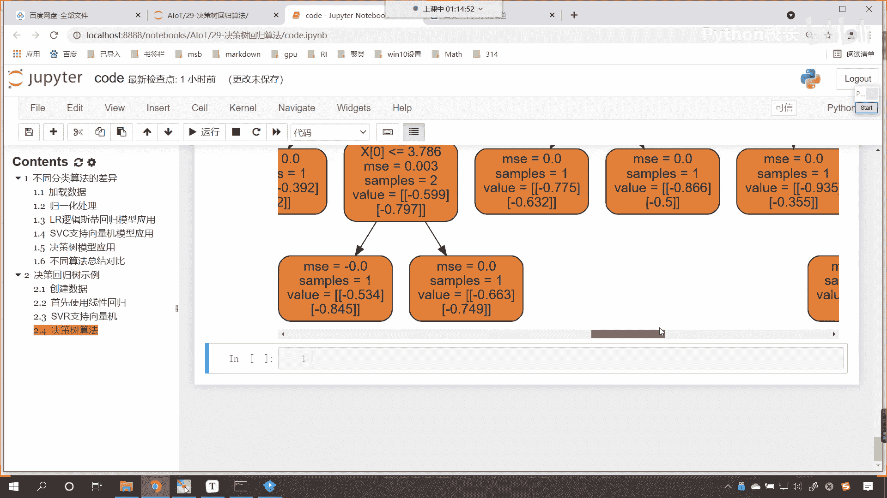

大家看你看我是不是划了很久呀，对不对。

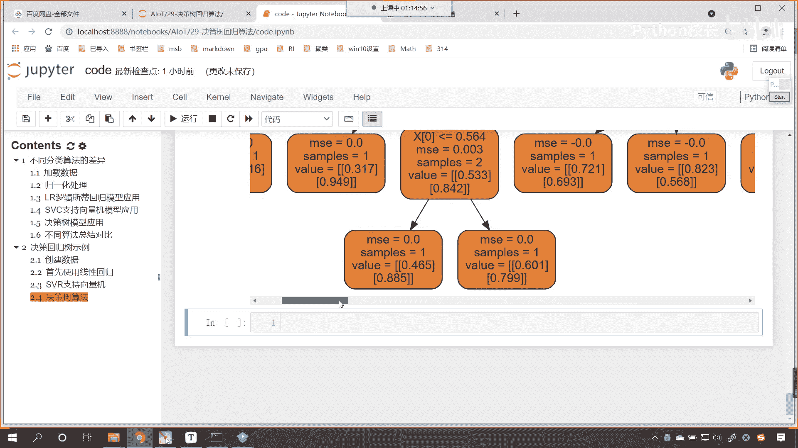

你看那我就划了很久，是不是好，这个呢是咱们这棵树双击合起来。

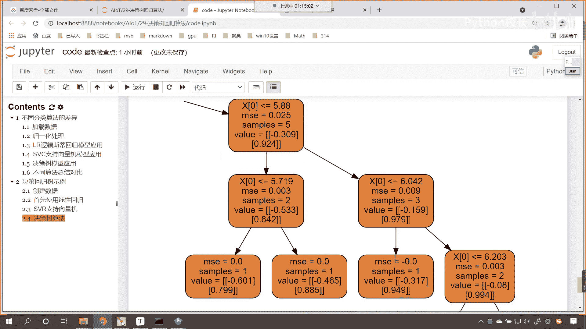

现在咱们就使用这个模型看一下它的得分，咱们来一个sc，此时呢咱们将x下划线train放进去，y下划线train放进去，我们看一下它的得分，你就能够发现这个得分是多少，是不是一点呀，是不是给分纯了呀。

看到了吧，咱们是不是将咱们的测试，是不是将咱们的训练数据，那咱们呢将训练数据怎么样给分除了，对不对，哎，因为分成了之后，你看这个scr得分是不是一点，大家注意啊，这个地方的scr是吧。

它和我们的准确率是不一样的啊，因为这是一棵回归树，回归数的得分，它是用什么度量的呀，看他是r2 ，之前咱们在讲回归算法的时候，我们介绍过r2 ，这里呢咱们就不再进行说明了啊。

这个r2 它呢可以是一个小数，知道吧，它的它会有一个范围，它呢可以是小数是吧，最大值是一，它可以是负数啊，这个值可以是负数好，那么你看到此为止，咱们决策树，咱们的回归示例，我们呢就进行了一个说明。

你看归根结底这棵决策树你发现是吧。

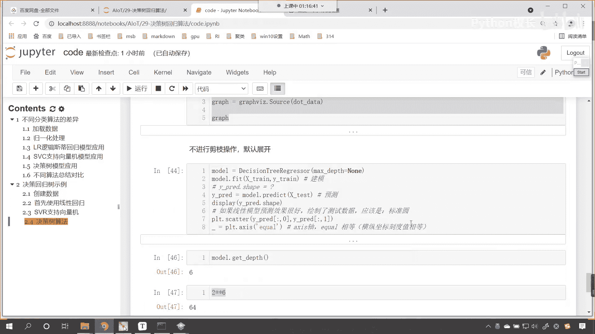

这棵决策回归树，你发现它是不是也是一个看到了吗。

你看是不是也是叶节点，叶节点，叶节点。

那这个和咱们的你看这个和咱们的这个呃，这个和咱们的这个分类数是不是就非常相似呀，只不过咱们的回归数，我们里面用的列分标准是什么，你就能够发现这个列分标准是不是，就是咱们刚才介绍的m一啊，对不对。

你看这个就是咱们介绍的m1 ，那我们不进行减值操作，默认展开，咱们往下滑是吧，我们画图显示，各位小伙伴，你就能够看到他的最后这个ms是多少。

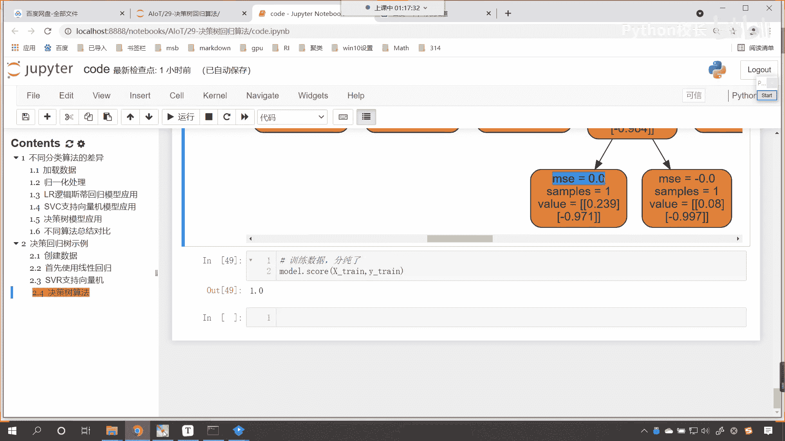

是不是零呀对吧，你看为什么到这个叶节点它给停了呀，看到了为什么到这个叶节点给停了，看为啥到这个业界点停了，是不是因为分纯了呀，对不对，你看构建这个模型，它是不是给分成了，是不是你看零零是吧。

到了零是不是就得停呀，是不是你看都是这样的一个特征啊。

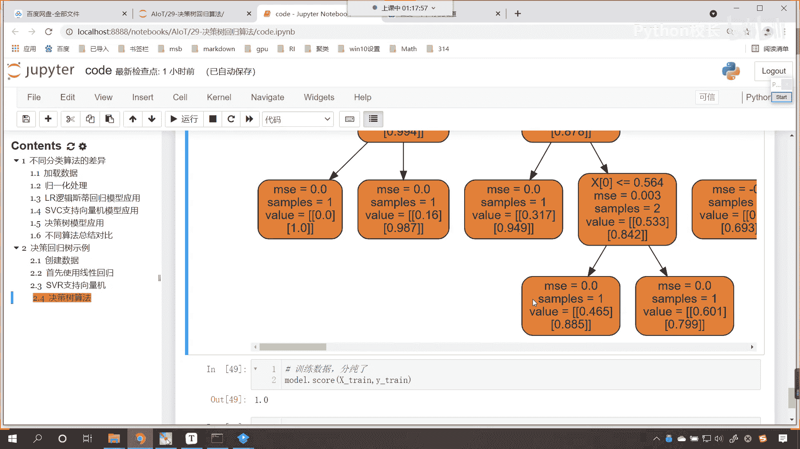

哎所以你看我们给六就够了，你看为什么六就可以把咱们所有的数据分成呀，是吧，那你回想咱们的训练数据是extra，它是多少个是吧，我在这下面插入一行，查看一下咱们x train。ship，你看我一直行。

他是不是只有40个呀，而我们二的六次幂是64个，你想能不能把它分开，能不能把它分成呀，那绝对可以，对不对呀，唉这就是咱们决策回归数示例，包括它的算法演示可视化的一个展示啊，以及呢。

我们在这个里边还调整了它不同的这个参数。

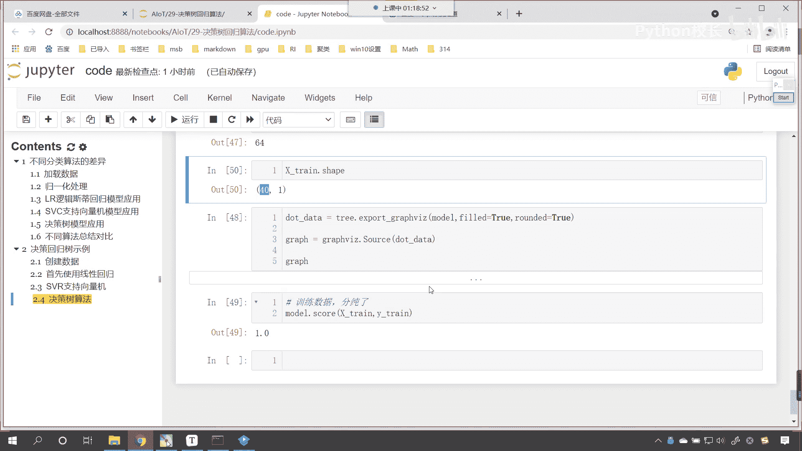