# P193：1-归一化对不同算法影响 - 程序大本营 - BV1KL411z7WA

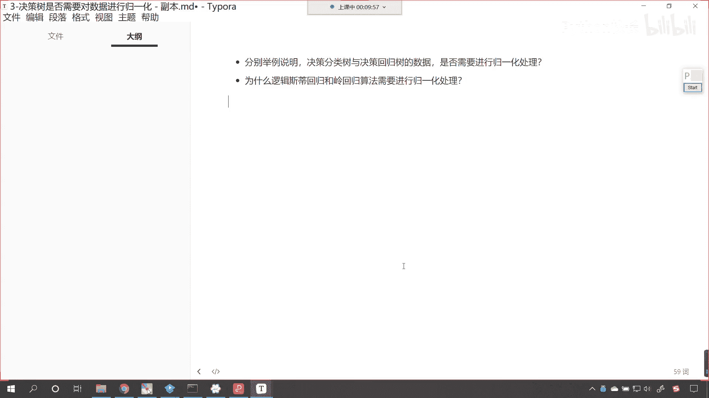

上一节课呢我们留了这样的一个作业，咱们说分别举例说明我们的决策树。

决策分类数与决策回归数，咱们在进行训练的时候，咱们的数据需要归一化吗，哎在这儿的话。

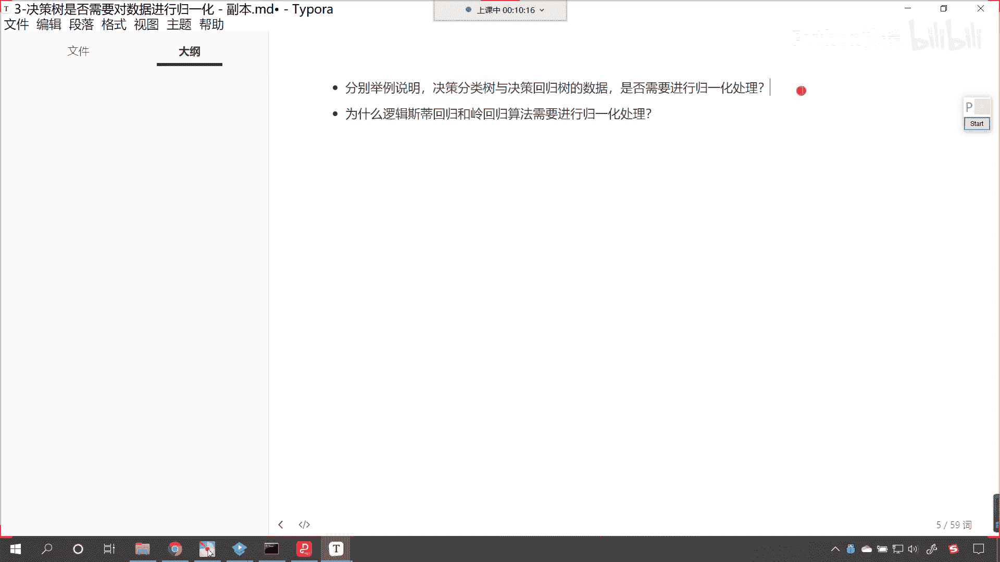

我们给一个答案啊，这个是不需要归一化的。

那为什么不需要归一化呢，因为我们的分类咱们是分类的话。

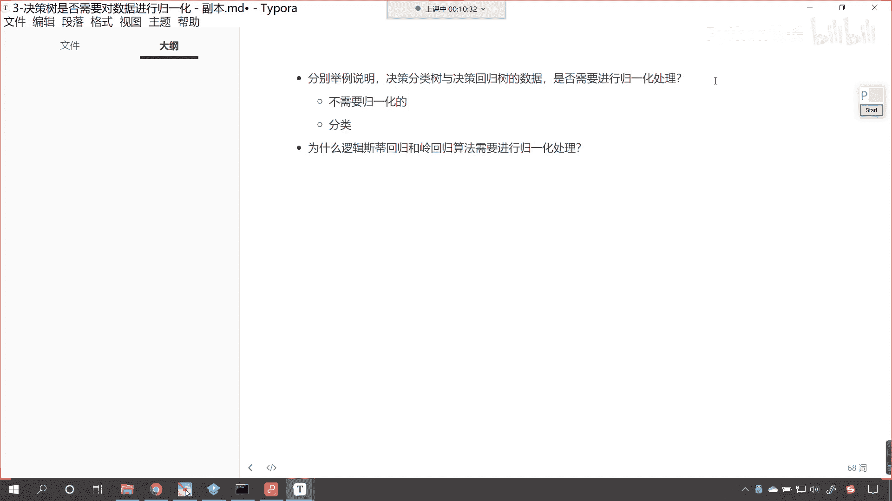

我们是根据呃根据这个croy c r o。

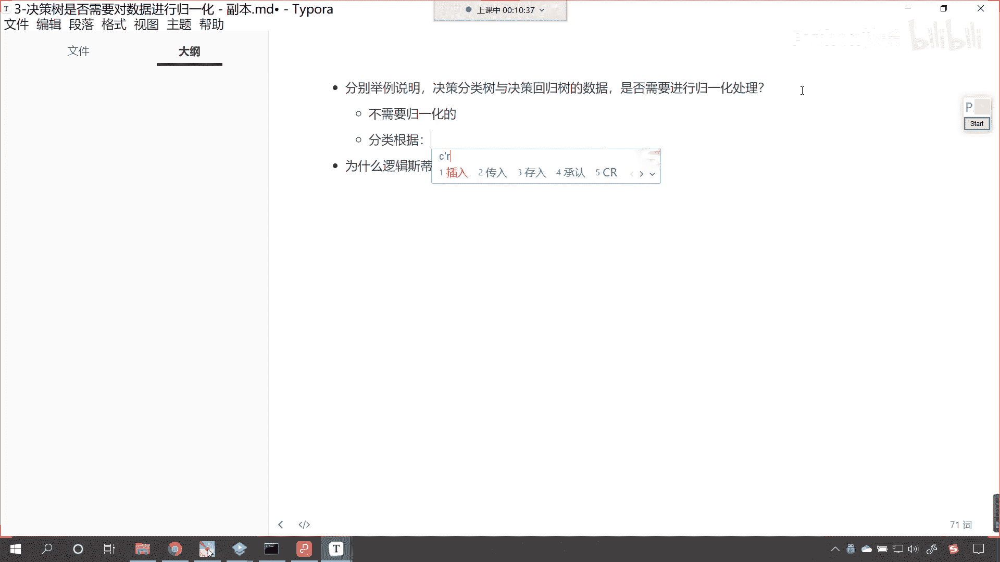

可这个c r o p根据咱们的这个信息熵是吧，c r o p t y cru，看根据咱们呃信息熵。

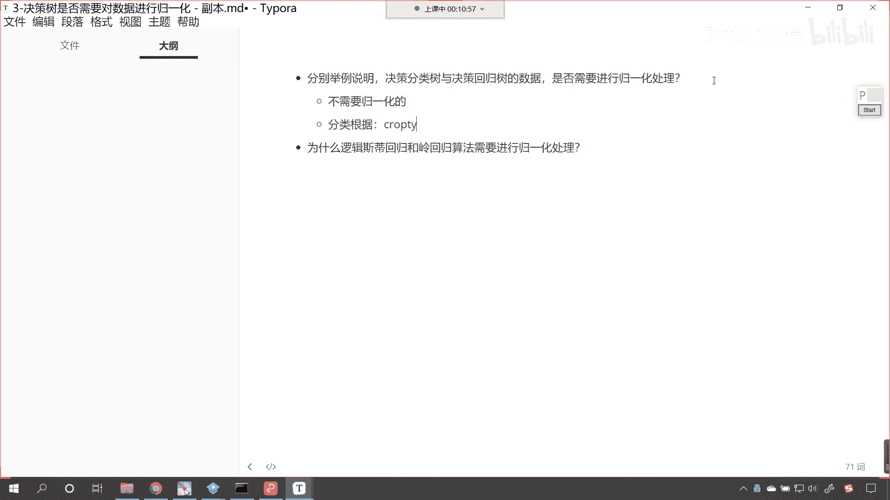

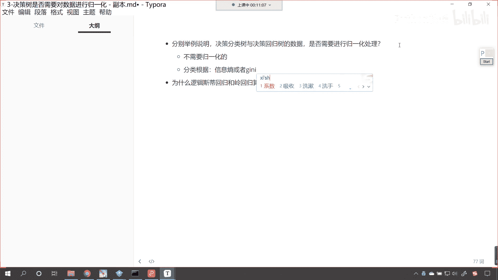

是不是来进行划分呀，无论是否归一化，其实我们的结果是一样的，为什么你看是否规律化，结果是一样的。

因为咱们计算的是目标值。

无外的信息熵，即使咱们对于数据进行了规划，比如说咱们进行规划的时候，原来是1~100，现在咱们把它规划规划成0~1了，那其实划分的列分条件是不是没有发生变化呀。

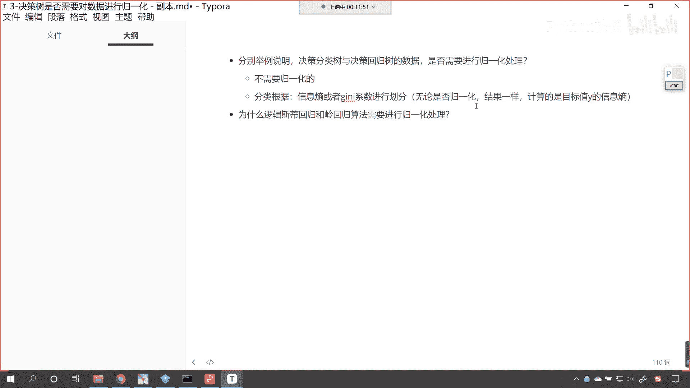

对不对，哎你看啊，其实呢这个列分条件是吧。

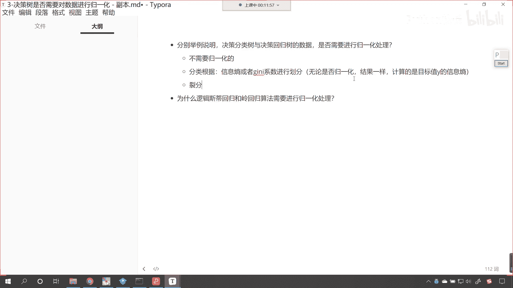

它的分裂点。

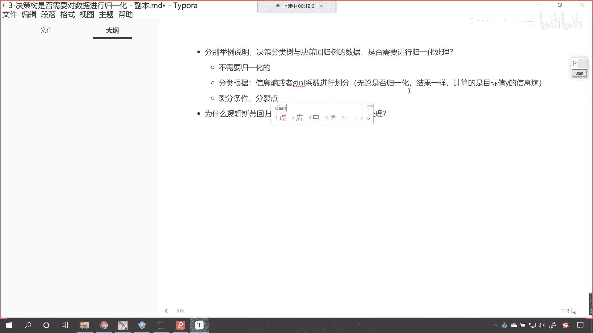

分裂点呢不会有差异，所以说呢这个决策树分类的时候，这个是没有影响的。

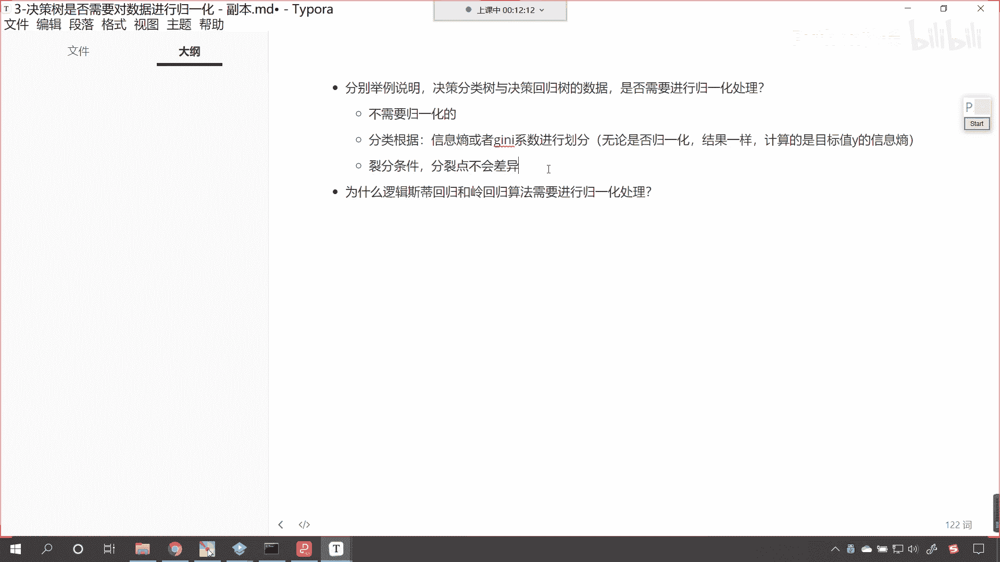

那咱们回归的时候呢，咱们根据的是什么。

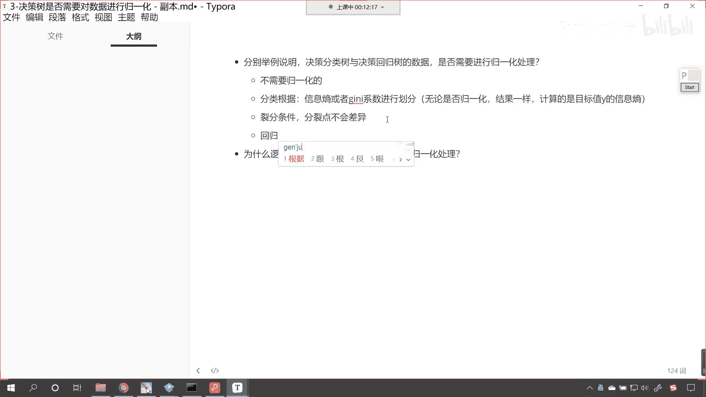

咱们根据的是m均方误差。

我们根据军军方误差，咱们呢来进行划分。

那这个军方误差呢，无论是否归一化啊。

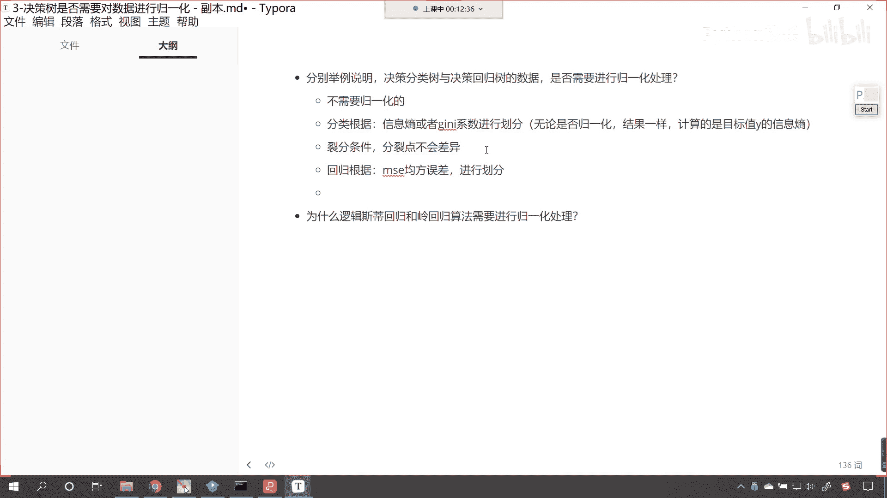

这个无论是否归一化。

那么它的结果呢不会产生影响。

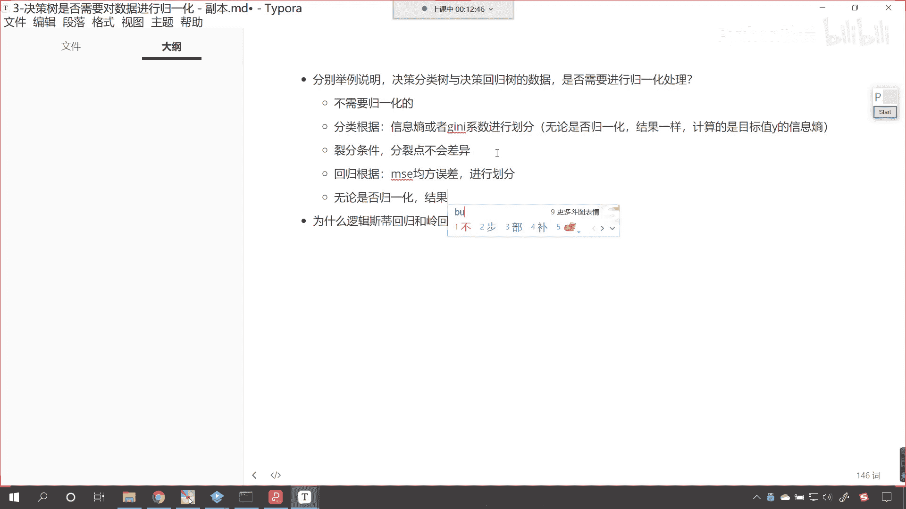

看这个得需要各位根据咱们的计算过程，你去思考一下，咱们前面的课程，我们在讲分类的时候，咱们都手动为各位进行了演算，也就是说这个算法到底怎么回事，咱们每一步的信息熵，或者说每一步的进尼系数。

我们都进行了计算，对不对，那你想归一化之后，你计算的方式，你计算的这个列分点儿大小可能不一样，但是这个裂分点儿它所占的比例是一样的，因为咱们的这个嗯，因为咱们的归一化，其实其实呢它是按照一定的比例。

是不是进行了缩放呀，对不对，你看他按照某一定的比例进行了缩放，所以说呢是否归一化，对于我们决策树分类没有影响，那回归也是咱们是否归一化，对于咱们的回归也没有影响。

上一节课我们计算了ms这个到底是如何算的，咱们给各位演示了一下好，那么为什么逻辑回归和领回归这两个算法，咱们需要进行归一化处理呢，往往一进行归一化处理，那这个效果是特别好的，咱们在这儿呢也说一下原因啊。

因为这两个算法它在进行优化的时候。

在进行优化计算的时候。

咱们使用梯度下降。

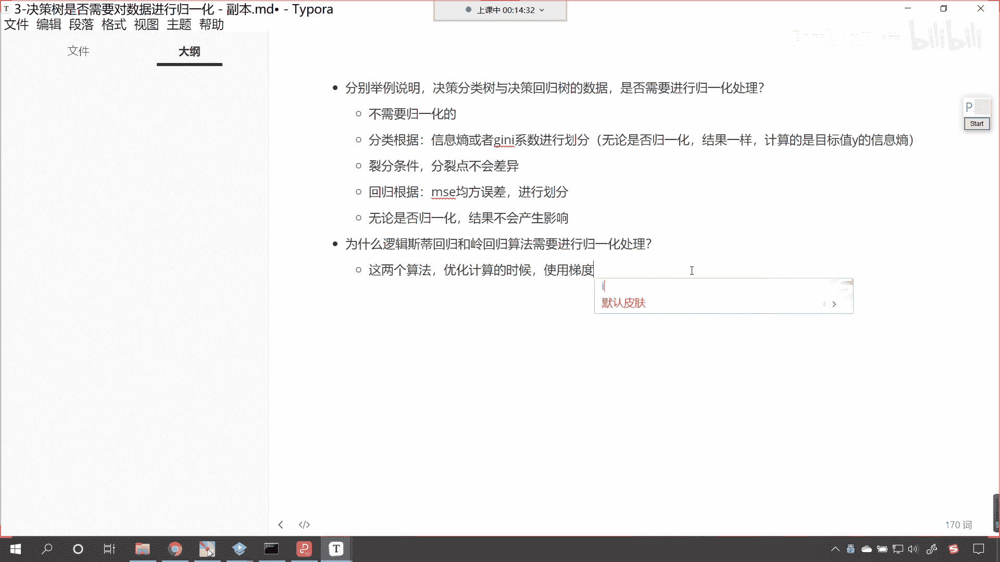

使用梯度下降的方式来寻找咱们的最优解。

如果他要使用梯度下降的方式去寻找最优解。

那么你想一下看他如果使用最优化的形式。

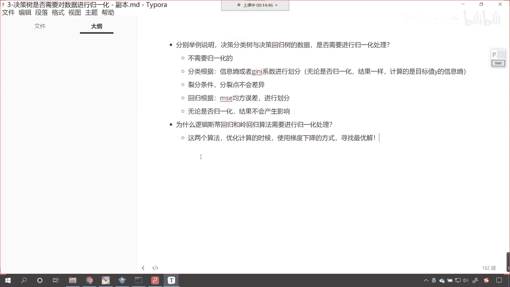

使用梯度下降的方式去寻找最优解，那梯度下降我们知道这个属性和属性之间是吧。

它是这个每一个属性呢，它属于是一个特征，那如果说我们的特征量纲不一样，有的特别大，有的特别小，那么在使用梯度下降的时候，有的都会，有的会梯度下降特别快，有的呢梯度下降特别慢。

导致呢咱们没有一个很好的这个，因为你找最优点最合适最好的方式，那就是同时是吧，各个属性咱们同时梯度下降到最优点对吧，那如果说我们没有进行归化，有的数值特别大，有的数值特别小。

咱们在使用逻辑回归和领回归的时候，那这个这个时候这个效果就不会特别好，所以说就是因为梯度下降是吧，你就像咱们这个下山一样，对不对，那呃比如说有很多条路是吧，那有的路呢特别陡峭，有的路呢比较平滑。

平滑的路是你是不是走的特别慢啊，陡峭的路你是不是速度就快一些啊，假设说山上要是有一个电梯的话是吧，你乘电梯是吧，可能一两分钟就下来了，但是如果你要爬山的话是吧，沿着这个坡道一级台阶，一级台阶向下走。

你可能得需要小半天时间，所以说呢电梯是一个属性，咱们的这个山上的这个轨道呢，山上的这个这个小路呢，它也是一条这个属性，你你能够看到我刚才举例，咱们所花的时间是完全不一样的对吧，如果要坐电梯，那就快多了。

如果我们要爬爬楼梯，那所花费的时间就很长对吧，你看放到咱们算法当中，这个逻辑斯蒂回归和领回归，它优化算法它是通过梯度下降，你梯度下降都是一步一步去寻找自由解，那这就会出现这个属性之间寻找最优解的时候。

它不匹配，有的属性可能得需要1万步，有的属性呢你可能两步就找到了，所以说呢这个逻辑回归和咱们的领回归，这样的算法，凡是用到梯度下降的，那我们给它进行归一化，往往就会取得比较好的一个结果。

咱们的准确率呀都会有一个大幅度的提升，好这个呢就是咱们上一节课所留的作业，这个算是对于我们算法原理更深刻的一个理解，咱们上一节课在讲课的过程当中呢，我们进行了相应的举例，咱们使用的是葡萄酒的这个数据。

那你能够发现是吧，逻辑斯蒂回归规划和布和不进行归化。

