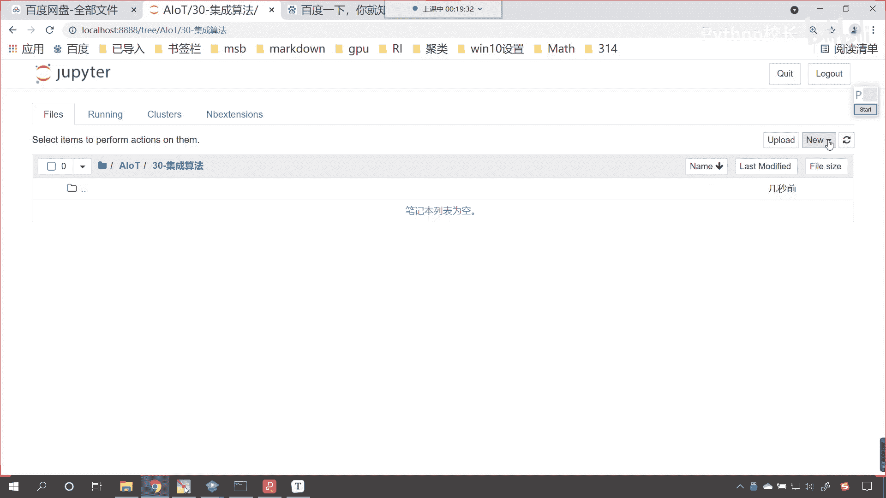
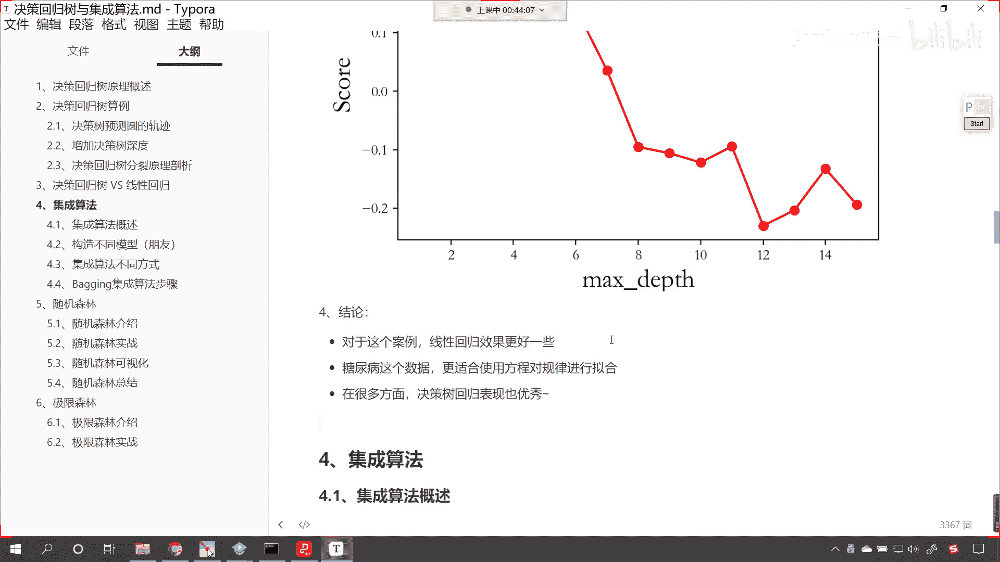

# P194：2-决策回归树VS线性回归 - 程序大本营 - BV1KL411z7WA

来接下来呢咱们继续往下看啊，看咱们今天的这个内容知识点，那上一节课咱们讲完决策树回归之后呢，我们还剩一点内容，那就是咱们决策树回归和咱们线性回归，它们之间的一个对比，现在呢咱们回到咱们的代码当中。

咱们就使用一下决策树和咱们的线性回归呢，进行一个对比，上一节课呢咱们将决策树回归的原理，我们进行了一个讲解，咱们也知道它如何进行分裂了，对不对，那么它根据的标准就是咱们的m s e是吧。

咱们上一节课我们也使用代码手写代码，一步一步的，咱们把这个列分的这个过程最佳的例分条件，我们算出来了，咱们算出来的这个最佳列分条件，和咱们题目当中，和咱们决策树画出来这棵决策树一模一样。

那咱们就知道这个决策回归树，到底是怎么一回事了，接下来呢我们对于决策回归数，咱们进行一个使用来，现在的话咱们就回到咱们的代码当中好，那么我们在当前的文件夹下，哎这个我起了一个30杠集成算法。

咱们在这儿呢创建一个python文件，我们给它改个名。

这个呢就叫做code好，那么现在的话我们呢就导一下包，咱们呢就from sk learn，咱们从tree这个模型下，那我们导一个包，咱们导入decision tree，我们现在选regreer。

然后from sk learn，咱们从linear model下，咱们要对比一下决策树和咱们的线性回归，它们之间的呃这个差异，所以说我们将linear regression咱们导进来。

然后呢咱们将数据导进来，from sk learn，这个时候呢咱们import哎，我们将data sets导进来，然后from sk learn，咱们从model selection这个子模块下。

咱们导一个包，那我们就import train test split，这个方法呢，它可以将我们的数据呢呃来进行一个拆分好，那么先然后呢我们再导一个包啊，import numpy as np。

此时我们执行一下代码，首先咱们加载一下数据，那我们就load下划线，咱们选择die beats这个数据，这个呢是糖尿病的数据，在这儿呢我们注释一下啊，这个是糖尿病数据，那我们执行一下。

给各位看一下咱们这个糖尿病哎，他数据是什么样的一个数据，在这儿你能够看到data，这个是数据，这个是target，那target这个值越大，就说明呢，咱们糖尿病的这个情况呢就越不好是吧。

我们血糖的含量就越高是吧，这个是一个指标，那我们再往下看啊，看一下咱们都有哪些特征，看到了吧，这个就是咱们的feature names，这个feature name就是特征。

也就是说呃一个人他为什么会得糖尿病呢，那哪些特征跟它得糖尿病有一定的关系呢，根据我们的常识，咱们就知道一个人得不得糖尿病，和他的年龄是不是有关系啊，想年龄越大得糖尿病的概率是不是就越大呀。

还和性别有一定的关系，还和bmi有一定的关系，这个bmi就是表示一个人是否肥胖，那我们知道一个人如果特别肥胖的话，他患糖尿病的概率是不是就更高一些，还有bp这个是血压，还有s1 ，一直到s6 。

是咱们血液当中的一些指标，也就是说这些呢都是生物上采集的数据，那这些生物上采集的数据，是不是，就决定了这个人糖尿病的这个严重程度呀，好那么这个数据呢他就是一个回归问题，它不是一个分类问题。

各位小伙伴你仔细看一下咱们的target，那我们这个target是不是就相当于我们的目标值呀，看到了吧，target这个就相当于是目标值，那我们这个目标值呢，各位小伙伴你来看一下，你看151 75。

178，48 270是吧，99 280，每一个数据和每一个是不是都不一样呀，对不对，每一个数据和每一个数据都不一样，这个就是一个回归问题，如果我们这个数据是一个分类问题的话。

那么它长得应该像咱们圆花那样，长得应该像咱们葡萄酒那样，你看葡萄酒的数据是吧，一六全是零是吧，另一排全是一，再接下来就全是二是吧，那样的他才属于是一个分类问题，而像咱们糖尿病它的这个严重程度是吧。

这个就属于是一个回归问题，好现在的话咱们获取一下这个数据啊，我们调用这个方法里边呢有一个参数，它呢叫return x和y，那这个意思呢就是直接返回数据x和数据y，咱们这儿呢给他一个true。

那么我们就会得到咱们的数据，x和咱们的目标之外，现在有了x和y，咱们现在调用train test split，我们将x和y放进去，这个时候我们的数据就会被一分为二，那就是x下划线，trax下划线。

test y下划线，truy下划线test，这个时候你看数据就被一分为二了，好那么有了数据之后呢，咱们现在就使用linear线性回归这个模型，我们对它进行一个建模，然后咱们就model点。

我们就feat一下，咱们将训练数据放进去，然后呢我们看一下它的效果怎么样啊，那就是model点，这个时候咱们将测试数据x test，y下划线test放进去，同时上面咱们来一个打印输出。

那这个呢就是叫测试数据的得分，冒号打印一下，那就是model。co嗯，咱们将x下划线train放进去，y下划线train放进去，下面这个呢就是我们上面这个唉，我们修改一下啊。

上面这个叫做训练数据的得分好，那么下面这一行打印输出，他是不是对应着咱们测试数据的得分啊，在这儿呢修改一下啊，这个文本咱们填充一下，这个是测试数据的得分，冒号测试数据得分训练数据得分。

你想一下哪个得分会高一些呀，上面这个得分会高一些，还是下面这个得分会高一些，来各位在讨论区里边儿回复一下啊，来你看我一直醒来，各位小伙伴看各位小伙伴，咱们就能够看到是吧，哎我们有同学说上面这个得分高。

咱们有同学说下面这个得分高是吧，哎现在我们就能够看到，你看哪个得分更高呀，哎咱们现在得到的结果是，下面这个得分更高是吧，现在呢我们解释说明一下啊，这个按道理来说，是不是上面的得分应该更高呀，对不对。

因为上面的数据呢，是不是咱们的这个训练数据啊，对不对，我们算法学习的就是这个数据，然后我们然后我们对它进行预测的时候，理所当然应该上面这个数据高一些，是不是啊，那这个跟我们数据划分有一定的关系啊。

这个时候呢我们train test split，咱们再执行一下，你看啊上面这个代码，大家注意上面这个代码，我们再执行一下，你看我在运行，然后呢再一次去运行，依然是咱们这个情况，是不是啊。

看依然是咱们这个情况，那这个时候呢，他和咱们常规的这个情况出现的不太一样啊，唉我再执行一下啊，唉现在你来看来各位小伙伴，现在你再来看看，这个时候你会发现，是不是上面的得分要更高一些呀，看到了吧，0。

527，这个是不是0。470呀，因为我们的train test split，咱们这个在进行数据划分的时候，大家注意啊，咱们在进行数据划分时，我们存在一定的随机性，刚存在一定的随机性。

所以说这个分数呢有的时候上面高，有的时候下面高，但是如果说这个数据量足够大啊，现在呢咱们给一个前提，如果我们的数据量要是足够大，那么一定是上面的得分更加高一些，一定是上面的得分要更加高，哎大家要注意啊。

这是我们的最终的一个结论啊，好那么咱们就能够看到，这是我们linear这个线性模型，它的得分，那我们现在呢就看一下咱们决策树，我们看一下它的表现怎么样，好不好，现在的话，那我们要，那现在的话。

我们就声明一下咱们的这个决策树啊，那这个时候呢我们将决策树的得分呢，同时呢咱们给他这个绘制一下啊，这个时候咱们import mat plot lib，点piplot画图工具，咱们呢给它导进来啊。

这个划分的时候呢当然是可以固定的啊，你看如果我要固定的话，咱们呢就使用random state，这儿呢咱们给一个911，你看这个时候你看我如果给911，咱们这回执行得到的分数是0。54，下面是0。41。

你看我再执行一下啊，现在这是第这个代码，执行的是第八行，如果我要再执行，你看右上角是不是就变成九了呀，看到了吗，这个时候这个random state 911，就相当于我们将数据固定了。

你这个数字是多少都可以知道吗，这个数字是多少都可以好，那么接下来咱们就看一下决策树，他对于这个分类问题的一个操作和研究，那咱们p t呢我们设置一下属性吧，plt rc params。

然后呢我们设置一下它的font，咱们呢将它的family我们呢给他设置一下，这个就是设置它的字体，那就是s st，咱们来一个楷体好，现在的话我们绘图的时候，咱们就可以显示它的啊，这个中文了，好。

那我们那么咱们知道决策树呢是不是有深度呀，对不对，决策树有深度，咱们就给一个max depth好，这个就是咱们决策树的深度，咱们决策树的深度，我们这个时候就给他一个范围吧，那就是arrange。

咱们让数字深度是一一直到16，左臂右开，也就相当于是一到15，对不对，好，然后呢咱们给一个car，car呢就相当于是他的得分，然后我们来一个for循环，for d in。

咱们的max depth对它进行一个便利，那么在便利的过程当中，在便利的过程当中，咱们呢就声明一下咱们的决策树，那就是decision tree，regressor里边给他声明一个参数。

max depth就等于咱们的d，现在咱们就使用这个特定深度的数，咱们呢进行一个训练，那我们调用它的feat方法，同样将咱们上面得到的train数据放进去，然后目标值外存放进去，然后呢咱们model。

co，这个时候我们获得一下它的得分，咱们将x test放进去，y下划线test放进去，这个时候你想我是不是会得到一个分数score呀，有了这个分数之后，咱们呢cae。

append上面这个car是一个列表，咱们将每一个模型，它所获得的对于测试数据的分数，咱放到这个s当中，大家看啊，放到s当中了，好，现在这个for循环，就对于15棵树进行了训练和得分好。

那么接下来呢咱们就进行一个绘制，那我们就plot一下，现在呢咱们将max steps把这个作为咱们的行索引，咱们将scr作为我们的作为咱们的列索引，然后呢逗号咱们给一个r，咱们给一个o。

然后呢我们给一个盖，这个就相当于是对它设置了属性，那这条线呢是红色，这个o呢就代表着这个圆形，这个杠呢是不是就代表破折线，对不对，这个盖儿呢就代表咱们线的一个形状好。

那么接下来呢咱们p l t我们对于它的横坐标，它的标签我们对它进行一个设置好，那么标签呢横坐标，咱们传的数据是不是max depth啊，好这个呢咱们给一个中文啊，这个就是最大深度。

这就是咱们树的最大深度，然后呢逗号咱们给一个font size，我们把它的字体大小设置成18，然后prt咱们再来一个y label，这个y label就是咱们的纵坐标，那么我们纵坐标咱们给的数据是吧。

纵坐标咱们给的数据呢是scar，这个就是咱们这个回归的得分情况，看这个呢就叫做决策树呃，决策树的这个得分，决策树的得分，咱们随着数深度它的一个变化情况，font size咱们也给个18。

好那么这个value这个呢我们给一个title啊，这个给一个标题，那么我们plt。y label，咱把这个给它改成高，哎这个就是咱们的这个分数了，那font size咱们也给个18。

这个时候你看我执行这个代码唉，各位小伙伴，你就能够看到，看咱们这个得分情况是不是就出来了，哎我们现在看咱们的最高得分是多少呀，看到了吧，咱们的最高得分是不是，当决策树的深度是二的时候呀，你现在来看啊。

这个树的深度是二的时候，其实他的得分也并不高，你看我们把它画到这儿，这个是不是他的得分啊，你看这个是0。1，这个是0。2，那到这个地方也可能就0。25左右吧，对不对，零点是吧，也就是0。25左右啊。

这个分数是不高的啊，那我们输出一下啊，你看咱们print一下是吧啊，这个最高的分数是吧，最高分数是冒号是吧，咱们来一个max，那我们将score当中的这个最大值给它拿出来，你看最高分数是多少。

是不是就是0。25489呀对吧，这个决策树它的得分和咱们上面训练，和咱们上面线性模型的得分相比，你看是不是线性模型的得分更高一些呀，看到了吧，线性模型的得分更高一些啊。

好那么我们现在画的这个曲线呢是决策树，它对于测试数据它的分数，那我们现在呢咱们再画一条线啊，嗯这个时候呢咱们就来一个高二，我们给一个中括号，那么咱们在这个里边呢，我们让高二点append一下。

对它进行一个追加，这个里边儿咱们要添加的数据呢，哎就是决策树，那就是决策树对咱们的这个训练数据，看一下训练数据的得分，也就是说随着你决策树的深度增加，咱们看一下这个决策树，对于训练数据得分是怎么样的。

那这个时候呢咱们就使用model点调用car这个方法，然后呢我们将x train放进去，咱们将外出放进去好，那么高二有了，咱们紧接着呢在这个图形当中，咱们再画一个图是吧，那这个时候呢那就是plt唉。

大家看啊，咱们给他来一个换行调用plt点，plot小括号，咱们的横坐标依然是max depth，咱们的纵坐标呢，这个时候我们给一个高二，然后呢咱们给一个绿色的是吧，咱们给一个星号，然后咱们给一个盖好。

那么分别注释一下，那么绿色的这条线，绿色的线唉是我们训练数据，随着数深度的增加，他的这个得分变化情况好，那么下面这条线是不是咱们红色的线呀，红色的线呢是我们测试数据，咱们随着数深度增加，得分的变化。

此时你看我一执行，哎哟各位小伙伴，各位小伙伴，你有没有发现有没有发现咱们绿色的线，这个得分怎么样，这个得分是不是超级高呀，你知道这是为什么吗，看到了吗，决策树咱们绿色的这条线看到了吧，他得分超级高。

而咱们红色的这条线是我们测试数据的，绿色的这条线呢，看绿色的这条线是是咱们什么数据的，是不是咱们训练数据的，那这个时候咱们在绘制的时候呢，呃我们再给他一个嗯这个plt点卡，p o t一点legend。

咱们呢给他一个图例啊，那么呃这个这第一个呢是我们训练数据啊，训练数据，第二个呢单引号是我们的测试数据，测试数据的得分，上面呢是咱们训练数据的得分，这个时候哎你看我一直行，哎大家现在看啊。

此时在咱们的右上角，咱们是不是就有一个这个图例了，这个图例不太大，是不是来我们在画这个图之前，咱们图形尺寸设置一下plt点，save figure，我们给它一个这个prt调用figure。

然后在这个当中设置一下它的尺寸，12和九，这个时候你看我一执行哎，现在你再来看啊，这个时候是不是就稍微好一些了，看了那这个字体还是不够大，咱们设置一下它整体的这个字体啊，那这个时候就是撇。

那我们在设置图例的时候，咱们给它一个字体啊，在这咱们就调用font size，我们也给一个18，这个时候大家来看，这个时候这个字体是不是就就变大了啊，那我们根据红色的这条线。

咱们就知道随着这个数深度的增加，看随着咱们数深度的增加，其实这个算法的表现是不是越来越差呀，对不对，这个算法的表现越来越差，咱们给12和九稍微有点大，咱们给一个12和六啊，这个时候你看再来执行哎。

这个时候咱们就可以，把它全部框起来，我们呢对它进行一个说明，那么咱们决策树相对于咱们的看，我们的决策树相对相对咱们的线性回归，那哪个模型更好呀，嗯决策树相对于线性回归，它的表现是不是要差一些呀，对不对。

你看他的表现要差一些，那其实我们看表现的时候，咱们主要看哪个表现呀，是不是主要看咱们红色数据的表现呀，对不对，因为这个红色数据是测试数据，对不对，你绿色的数据呢是我们训练数据，对不对。

也就是说你这个模型表现好坏，你得需要对，你得需要在新的数据上进行测试和验证，才能够表示你很好，对不对，那就像一个考生平时考试的时候是吧，每次都考班里第一名，但是呢一高考是吧。

就是这个就考不上985211，那这个时候是不是说明这个学生的心理素质，是不是不够不够稳啊，不够稳定，是不是，那你看咱们画出来这个图，你有没有发现，如果出现了这种情况，看到了吧，也就是说你树的深度越深。

其实你的决策树对于我们训练数据，是不是效果越来越好，对不对这种，但是呢他对于测试数据是不是越来越差，我们之前讲过一个看我们之前讲过一个概念唉，就叫什么就叫过拟合，看就叫过拟合。

这种情况就属于是非常明显的过拟合，知道吗，非常明显的过拟合，也就是说他训练数据特别好，但是测试数据特别差，看到了吧，最后这个测试数据的得分，你看都是不是变成负的了，看到了吗，这个时候就是负的0。2。

看到了吧，哎就变成负的0。2了，所以说在这里呢咱们给各位演示了一下过拟合，那随着数深度的增加，你想一下会怎么样，看咱们的树这个树的深度，你看这个树的深度增加，咱们是不是可以把训练数它的这个叶节点。

叶节点是不是就变得非常多呀对吧，你看它的叶节点就变多了，那他是不是可以将训练数据给我们分纯呀，对不对，你看他是不是就可以将咱们的训练数据分成，对不对，加训练，但是这个时候没用，知道吗。

这个时候没用它的鲁棒性，它的鲁棒性不行，遇到我们的新数据是吧，他就不行了，运遇到咱们的测试数据是吧，他就解决不了这个问题，搞不定了，所以说这样的模型对于我们这个工作当中而言，是吧。

这个就是一个比较差的模型，我们希望怎么样呢，看我们希望咱们的训练数据，和咱们的测试数据是吧，他的这个表现尽量让它的表现，我们希望让它尽量一致，这个时候就说明咱们的模型鲁棒性好，说明咱们的模型稳定。

我特别清楚的记着我在上高中的时候是吧，大我三届有一个学长，他学习特别好，学习特别稳定，高中3年他一直是全年级第一名，也就是说任何一次考试，他永远都是全年级第一名，18个班级。

最后呢参加高考考上了清华大学，到最后参加高考考上了清华大学，以全校第一名，全市第一名的成绩考上了清华大学是吧，你看这就是你平时的训练，就是每一次考试最终的那个测试数据，就相当于我们的高考是吧。

我们希望平时的成绩特别好，测试的时候这个成绩也特别好好，那么在这里呢咱们对于决策树是吧，又进行了一个介绍，好那么最后呢看我们总结一下啊，看咱们的结论呢，对于我们这个案案例而言。

咱们的线性回归呢表现更好一些，而糖尿病这个数据呢大家看啊，咱们更适合使用方程对规律进行拟合，在很多方面的决策树回归是吧，他的表现也是非常优秀的啊，啊咱们并不能说在这个案例当中是吧。

咱们线性回归把决策树回归给比下去了是吧，那我们就否定决策树回归这个算法，其实呢这个是不对的啊，嗯再说了，咱们现在所介绍的这个决策树回归算法，它呢属于是最基本最基本的这个决策树算法，后面我们还会接。

我们还会接触更优秀的这个决策树算法好，那么这个呢就是咱们决策树回归。

