# P195：4-随机森林原理和应用 - 程序大本营 - BV1KL411z7WA

好那么我们集成算法它其实呢就是取长补短，那接下来呢我们就看一下咱们的随机森林啊。

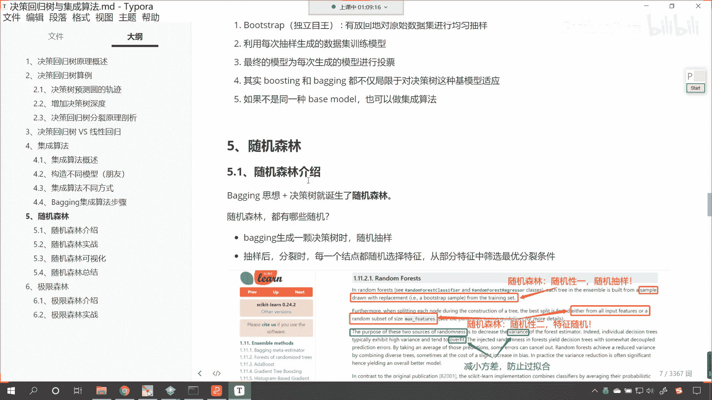

哎这个呢是我们要介绍的第一种算法，那这种算法它是begging加上决策树，回顾一下咱们上面什么是begging是吧，那这个就叫做套带法，看到了吧，这个就是套袋法，咱们呢对于训练，对训练集进行抽样。

咱们将抽样的结果用于训练是吧，得到一个模型并行独立训练是吧，那随机森林呢就是这一类这一类的一个代表，好那么我们看一下这个随机森林是吧，它有哪些随机呢对吧，你看你为什么叫随机森林呢。

那我们之前这个算法咱们是不是叫做决策树呀，你看它是一棵树，对不对呀，那什么是森林呀，是不是就是多棵树，它就是森林呀，对不对，那我们这个地方强调了一个随机，那什么是随机呢是吧，你像这个咱们这个决策树是吧。

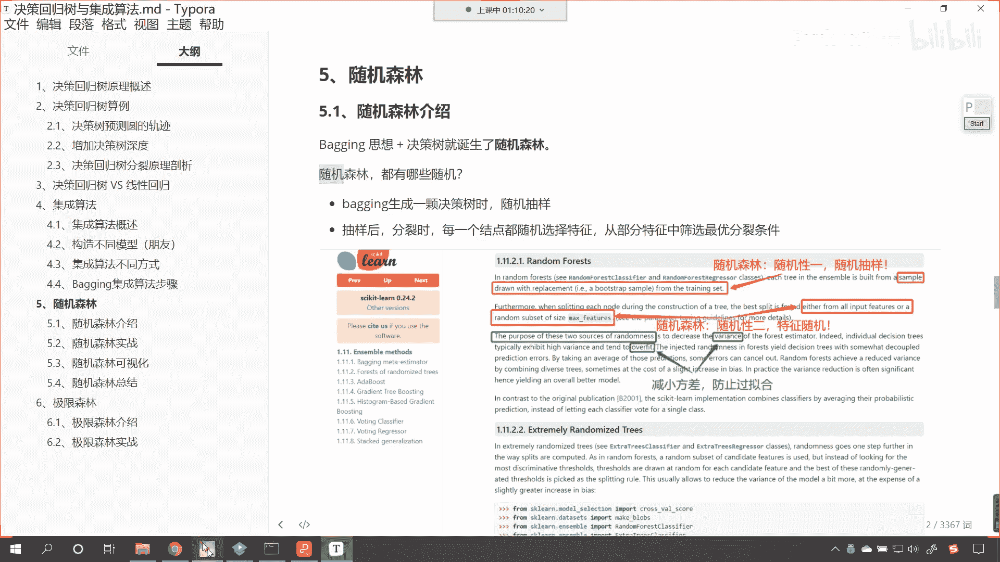

唉我告诉你啊，看啊咱们现在学的库叫sk learn。

现在呢我们可以进入这个sk learn哎，这个官方网站。

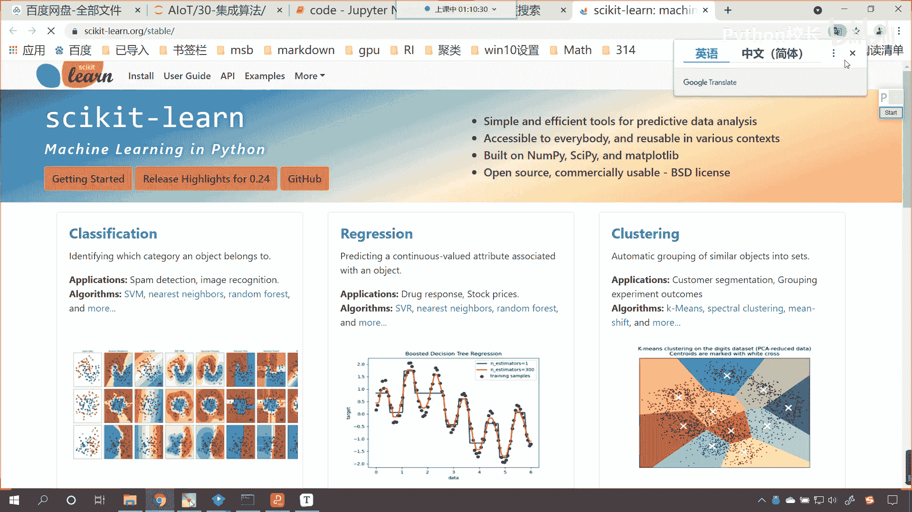

然后呢我们在这儿可以找到random forest，你看classification这个是不是就表示分类呀，然后这个里边有一个random forest。

你random forest表示的是什么，random forest，表示的是不是就是咱们的这个随机森林呀，翻译成中文。

这个是不是随机森林，那么这个随机森林，你看这个地方是不是有一个英文的描述呀，对不对，那你看我在咱们的笔记当中。

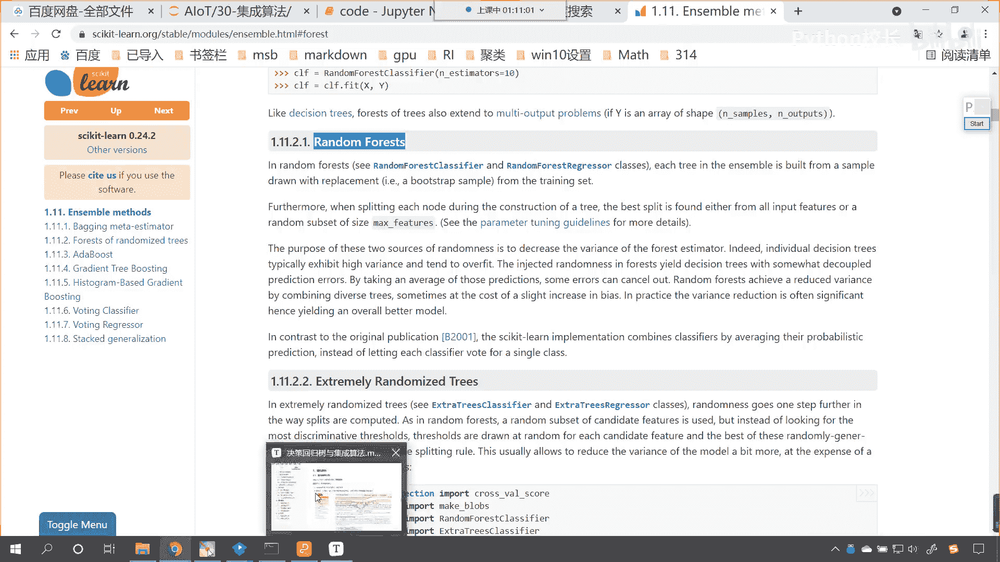

为各位进行了一个截图，看到了吗，这个random forest他到底是。

那它到底是哪种随机呢，看这个图当中，我对于特定的部位，咱们呢进行了一个截取，咱们随机森林它有两种随机性，唉你看啊这个随机森林它的随机性，一是进行随机抽样，看为什么呢，你看这个红这个框里边是吧。

叫做sample join with replacement是吧，from training set，看这个join就是拉取的意思，看我们从哪个数据当中呢，我们从trading set当中咱们怎么样呀。

给他是不是随机抽样获取了一部分数据呀，那这个就是随机抽样，既然是随机抽样，你想我们这次随机抽样得到的样本集，和另一次随机抽样得到的样本集，是不是不一样呀，对不对，哎，随机抽样得到的样本一般是不一样的啊。

有没有可能完全一样呀，有可能啊，这种概率是非常非常小的。

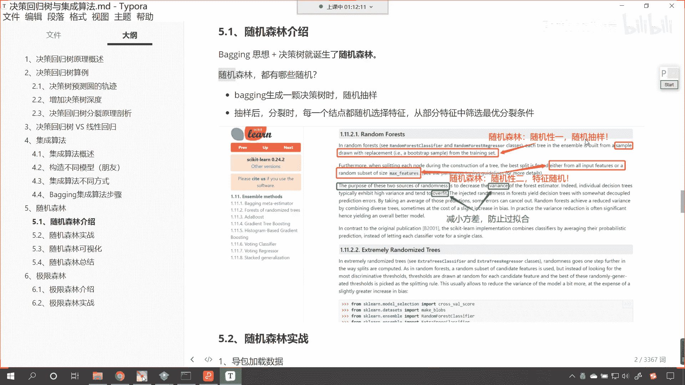

特别是当数据量比较大的时候，那么第二种随机是什么呢，看第二种随机是吧，这个either from，你看either是吧，either from all input features。

这个all这个all a random subset of science max feature是吧，那这就是咱们的第二种随机，第二种随机呢就是特征随机，看到了吗，一个是随机抽样，另一个是特征随机。

哎你看啊，随机抽样对应着咱们上面所说的什么看啊，我们第一种随机是随机抽样，是不是对应咱们的行不同呀，看到了吧，行不同是不是表示随机抽样，你的行是不是就表示样本呀对吧，大家要注意啊。

这个行不同就表示样本我们的数据都是二维的，你想是不是，那么第一维他表示样本，第二维这个列就表示属性，对不对，所以说是吧，这个就表示什么唉，这个就表示咱们的随机抽样是吧，好那上面这个呢你看行相同，列不同。

这个是什么，看这个是不是就是特征随机呀，你的特征是吧，比如说你有十几个特征，我一次不取你的全部，我取你的一部分特征进行训练是吧。

所以说咱们的决策树是吧，咱们的这个随机森林，它随机的，它随机在哪里，就随机在这两点，一个是随机抽样，另一个是这个特征随机，你看这在它的官方网站上都有说明。

那么随机森林有什么样的好处呢，看咱们可以减少方差，防止过拟合，看到了吗，叫overfit，这个就是过拟合，那就是防止这个减小方差，防止过拟合，那减小了方差之后，咱们的结果就更加稳定。

方差表示的是不是咱们的波动性呀，对不对，你减少了方差，那么我们的结果就会更加稳定好，那么这个就是随机森林很简单啊，现在咱们就对于随机森林，我们呢来进行一个应用啊，你可以把这个就想象成咱们的一个随机森林。

你现在就能够看到，你看看我们这个当中是不是就有多棵树呀，看一颗两颗三颗四颗是吧，省略号是吧，这每一棵树都进行训练是吧，然后每一棵树呢它都有一个怎么样，每一棵树是不是都有一个这个预测呀。

那最后预测我们得到的这个结果，最后呢进行汇总统计计数，看看哪个类别多，那我们就选谁，看为什么这个选浣熊呢，因为你狐狸只有一个，咱们的浣熊是不是有两个呀，所以二比一是吧。

那这个时候浣熊就胜出了，好现在的话咱们就回到代码当中，咱们对于咱们的这个随机森林呢。

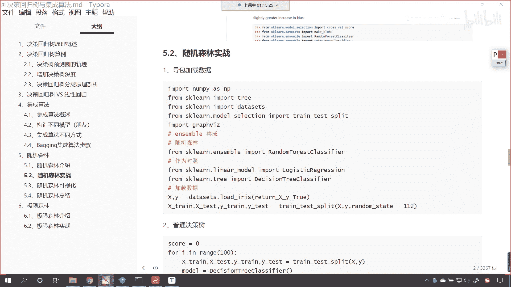

哎我们进行一个这个应用啊，来回到咱们的代码当中好。

那么我们往上滑，滑到咱们代码的最上方，咱们呢给一个三级标题，在这儿呢咱们来一个三级标题，这个呢就是我们的决策树回归vs，咱们的线性回归好，那么我们往下滑，然后呢咱们再来一个三级标题。

咱们看一下随机森林它的使用好，那么这个时候呢咱们导一下包啊，咱们from sklearn，点叫assemble，大家看我们现在所在的模块叫assemble，这个英语单词它有集成的意思，有嵌入的意思。

从这个模块下咱们导入叫random forest classifire，看把这个模型导出来了，然后from sklearn，现在呢我们从train下边。

咱们导入一个decision tree classifire，咱们对比一下，看一下，咱们随机森林和咱们的决策树，有什么样不一样的地方，然后呢我们from sklearn，咱们import一个tree。

我们将这个数这个模块给它导进来，from sk论，from sk learn，咱们import一个data sets，然后from sk learn，咱们将画图工具给它导进来，那画图工具呢。

咱们导一个包啊，叫import graph vz，这个呢可以帮助我们画图好，那么咱们呢就执行一下这个代码好，现在大家就能够看到这个模型导进来了，然后呢咱们就使用data sets。

我们去加载一下咱们的数据，这个数据呢你可以变，可以是你工作当中的数据是什么数据都行，明白吗，这个数据咱们在这儿为了给大家演示，所以说咱们就使用sk learn当中，为为我们提供的这些比较经典的数据好。

那么这个数据我们已经很熟悉了，咱们呢得到一下它的x y好，那么得到了这个数据之后呢，紧接着呢咱们就对它进行一个拆分，那就是train test split xy放进去，接收一下咱们拆分的结果。

那就是x train x下划线test，y下划线串y下划线test好，那么执行一下这个代码，k数据就拆分了，咱们先使用咱们简单的这个决策树，我们来操作一下。

那就是model就等于decision tree classifire，然后呢我们调用model。feat一下，将x train放进去，外传放进去，然后呢调用model。scr一下。

我们看一下咱们决策树，对于我们原为花这个数据，他的情况，大家看这回得分是多少，0。921，是不是我们在上面插入一行，来一个四级标题，这个呢就是一棵树啊，这就是一棵树，对不对。

那接下来咱们再来一个四级标题，咱们呢给一个随机森林，你想如果要是随机森林的话，那是不是就是多棵树呀对吧，这就是随机森林，多棵树，我们看一下它怎么样好，那么随机森林呢咱们来一个cl f啊。

就等于random forest classifire，唉，大家要注意啊，你看啊我在命名的时候，我这个地方是不是也可以叫model呀，这个都无所谓啊，一般情况下model这个英语单词表示模型哎。

表示算法，那咱们这个cl f表示什么呢，这个c o f呢你可以把它认为是classifier是吧，它的一个缩写啊，你知道它它表示呢classifire表示咱们这个分类。

因为我们现在导包导入的这个random forest，其实它呢就是一个分类器，哎在这儿呢啊咱们叫做分类器，所以说这个缩写我们可以用c l f来表示，当然变量的名字你只要是合情合理是吧。

符合咱们python的命名规范，其实你叫什么名字都无所谓啊，名字是小是吧，你理解它的应用就可以，然后cf点咱们就feat一下，那就是x下划线，truy下划线串，现在呢我们在执行之前。

咱们先看一下这个里边的一个参数，这第一个参数大家看是n immor，这第二个参数是criteria，你看你熟悉不熟悉，然后max depth mean sample split是吧。

这些熟悉不熟悉是不是很熟悉啊，那这些参数其实和咱们嗯，你看这些参数，其实和我们决策树当中的那些参数，是不是一样呀，对不对，因为决策树呢它的这个嗯他的根模型，咱们的随机森林。

它的根模型其实就是上面咱们的决策树啊，和决策数差不多，但是第一个参数叫n t matter nimator，就表示100颗决策树，你看100哎，咱们在这儿对它进行一个说明啊，这个呢就表示100棵啊。

它呢就表示100棵树哎，组成了随机森林啊，组成了咱们的森林，这不就相当于三个臭皮匠顶个诸葛亮吗是吧，100棵树在进行学习的时候是吧，这叫人多力量大呀，现在咱们训练了，然后咱们cl f score一下。

将x下划线test放进去，这个y test放进去，你看我一直行，唉现在咱们发现看这个得分有没有变化呀，这个得分好像没有很大的没有变化，是不是我们看一下啊，这个得分，咱们就发现是不是没有没有任何变化呀。

对不对，好，那么呃我看一下啊，咱们random forest classifire，这个得分没有变化，那应该和我们数据拆分的时候有一定的影响好，那么咱们现在呢再将上面这个数据拆分，我们执行一下。

看啊运行，我们再看一棵树啊，看啊执行哎呀，这个时候这棵树变成一点了是吧，咱们再执行，这个时候你看也都变成一点了，好，那么原来呢咱们这个拆分的结果，和我们看咱们拆分的结果，和我们这个呃。

咱们预测的结果和咱们数据拆分，是不是有很大的关系呀，那我们现在怎么办，咱们现在这样啊，我们来一个for循环好不好，咱们来一个这个for i我们引range看啊，我们批量运算是吧。

咱们来一个100次好不好，选中这三个来一个tab键，我们对它进行一个缩进好，那么咱们在这个for循环当中，我们对这个数据呢进行100次的拆分看啊，ctrl v咱把它放到这儿看。

现在你看这个每次是不是都进行了拆分呀，拆分之后咱们在for循环之前，我们给它来一个死杠，让它等于零是吧，那每一次模型训练，咱把分数呢给它进行一个相加啊，我们就让它等于加等咱们后面这个数值是吧。

因为你是100次，所以说你每一个模型，它所占的权重比例是不是一啊啊，比例是不是1/100呀，所以说咱们这个时候给一个怎么除以100是吧，最后呢我们print输出一下啊，这个呢就是决策树。

这个叫做一棵决策树，咱们的平均得分是啊，冒号，这个时候呢咱们将car放进去，你看我一执行，大家看一棵决策树，平均得分是不是0。9455呀，好那么接下来呢咱们在对于我们的随机森林，我们也进行这样的操作啊。

for i in range，咱们给个100，然后来一个冒号，同样咱们将这个数据呢，同样咱们将这个数据呢给它给它拿过来啊，ctrl v来上面再复制一下，ctrl c是吧，ctrl v好。

那么下面这三三行代码，咱们来一个缩进，选中它，按键盘上的tab键，它就缩进了，同样for循环之前，咱们也给一个scr，让它等于零好，那这个空格呢咱们就给它删除啊，删除好，现在咱们car我们让它加等。

除以100来，咱们打印输出一下print，来一个单引号好，那这个呢就是咱们随机森林，看随机森林平均得分是，我们看一下有没有变化，因为咱们一次的情况是不是带有随机性呀，对不对，你像上面是吧。

你给一棵决策树是吧，随机划分一下，它呢是存在随机性的，有的时候高，有的时候低，咱们如果要给100次，那你想一下，这个时候是不是就基本上趋于稳定了对吧，来现在呢咱们执行一下这个代码好。

这个时候运行的时间可能会稍微长一点，大概就是七八秒钟啊，十秒钟的样子，好各位小伙伴哎，我们现在就能够看到咱们随机森林平均得分，你现在就能够看到，是不是比上面要稍微高一点点呀，看到了吧，确实增加了。

但是呢我们增加的幅度呢还不是特别大对吧，这个增加的幅度呢还不是特别大啊，那跟这个跟咱们这个数据呢，也是有一定关系的啊，看跟咱们的数据也是有一定关系的，嗯嗯看这个耗时比较长是吧，哎因为它是100。

然后我们每一棵树当中是不是又有100个呀，对不对，跟咱们每一棵树当中又有100个，这个是存在一定关系的啊，好那么大家要知道啊，就是单一的决策，单一的这个决策树呢。

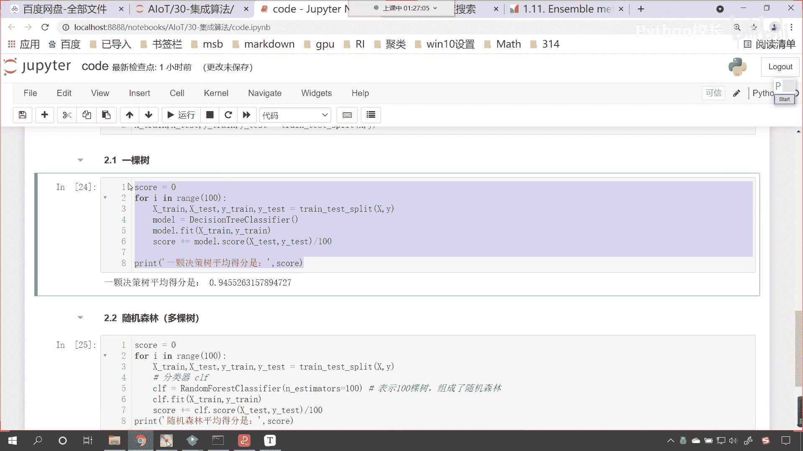

看单一的这个决策树，看单一的这个单一的这个决策树是吧，这个在这里呢，呃我们得到的这个结果稍微有点牵强是吧，这个随机森林这个分数稍高，它的结果呢更加稳定，降低了咱们结果的方差，减少了咱们的错误率。

哎大家要注意啊。

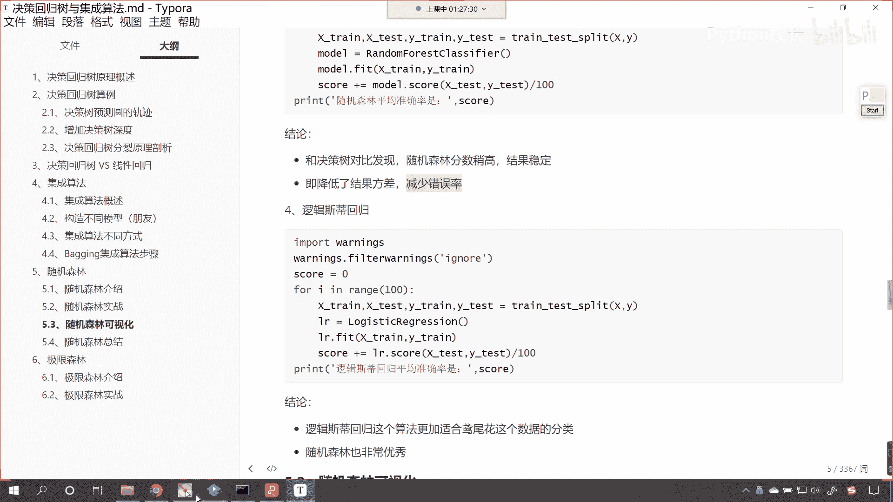

回到咱们的代码当中，我们可以将这个数据给他更换一下，比如说现在咱们这个数据呢，我们给它low的一个one，我们使用看看，咱们这个时候，你看咱们这个数据是不是葡萄酒的数据呀，来我们执行一下啊。

现在换一个数据，咱们看一下它的情况怎么样，看一棵树，那对于葡萄九是0。907，看一下咱们随机森林哎，这个时候怎么样，所以说这个呢取决于咱们的这个数据不同，来各位小伙伴。

现在你就能够看到咱们使用随机森林平均得分，这回是多少，是不是0。980，上面这个得分是多少，因为我们改变了数据，你就发现是吧，这个是不是一下子就把它给凸显出来了呀，看到了吗，一下子就凸显出来了。

所以说这个随机森林是不是还是非常优秀的呀，哎这就是呃三个臭皮匠赛过诸葛亮啊。

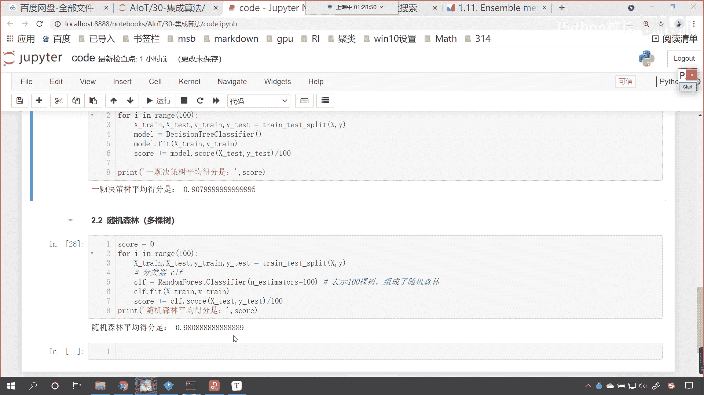

好那么我们再往下看啊，好，那么我们就看一下咱们随机森林的这个可视化，啊，啊咱们看一下它的这个这个可视化好，来回到咱们的代码当中。

看回到咱们的代码当中，那么对于咱们的随机森林呢和咱们的决策树呢，我们在这儿进行一个这个比较啊，两种算法啊，这叫两种算法，它的比较咱们这回比较从哪里开始呢，我们从这个准确率看，我们从准确率开始好。

那么咱们model呢是是不是我们的这个决策树呀，咱们调用它的predict probe，看这个是不是就表示概率啊，咱们将x test放进去，现在你就能够看到看到了吗，model。

predict probe，你看这个是概率是吧，那么我们发现这个概率就非常工整，是不是啊，它要么是一，要么是零，是不是因为你是一棵树，是一棵树，你的叶结点是吧，你想你有叶节点，那么你落到哪个叶节点。

是不是就是那个类别呀，看你落到哪个叶节点，咱们就算做那一类，所以说它的概率啊，所以说它的概率呢要么是零，要么是一两种选择，那我们再看一下，咱们随机森林看啊，那就是cf。predict数据都一样啊。

x下划线test来咱们现在来看一下，各位小伙伴，你就能够看到此时的这个概率，是不是看此时的概率就有什么了，看此时的概率是不是0。91，对不对，0。007是不是0。07，那为什么会出现这样的呀。

因为我们是100颗数，咱们进行了什么，是不是进行了投票，那进行了投票之后，你想一下会怎么样，比如说咱们第一种情况看啊，比如说咱们第一种情况看91这个0。91，0。07，0。02。

那他的投票情况应该是什么样的呀，看我们的数据是分三类的，对不对啊，零嗯是不是分零一和二呀，对不对，那零投了多少票呀，零投了91票，那一投了多少票呀，一投了七票，二投了几票呀，二哎这个类比二就投了。

投了两票，我们呢将这个票数咱们给它转换成概率，你想一下看把票数转换成概率，是不是就是0。91，对不对，然后零点点零七，0。02，是不是就是这种比例啊，对不对，所以说它是这样的一个情况啊。

好那么然后呢我们再把树画出来，再来一个四级标题，哎咱们可视化，好，那么这个时候呢咱们就调用tree，点explograph v a z，咱们先将model这单一的数咱们给它画出来，看到了吧。

这是单一的数啊，然后呢给他field等于true，然后呢给他run的，我们也让它等于true，好那么咱们将这棵树的数据导导出来了，我们就叫做dot data。

呃然后呢咱们就使用graph va z source，咱们将这个dot data放进去。

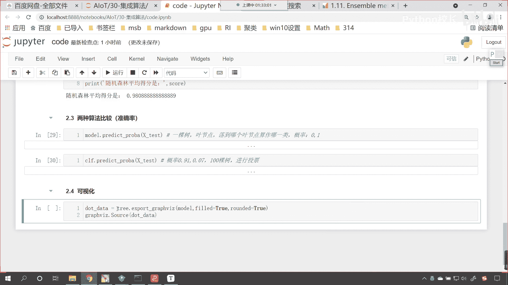

你看我一执行来，现在你就能够看到这棵树是不是就有了。

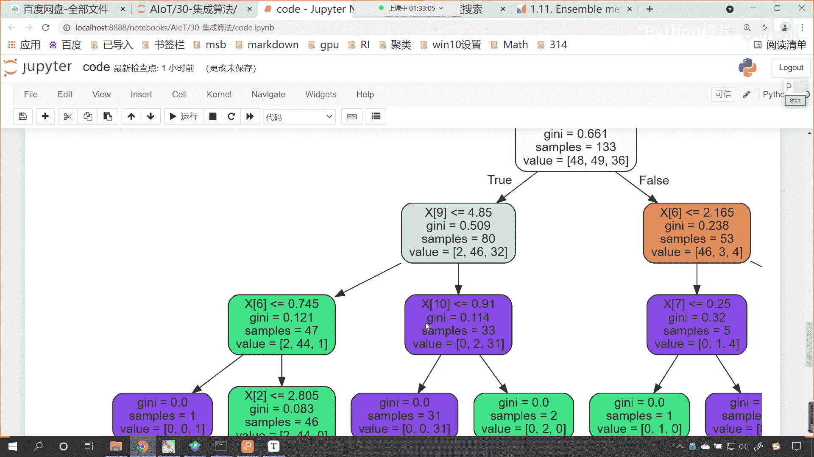

看到了吧，这棵树，那这棵树是看这棵树是什么，是不是咱们一单一的这个决策树，它的结构呀，看到了吧。

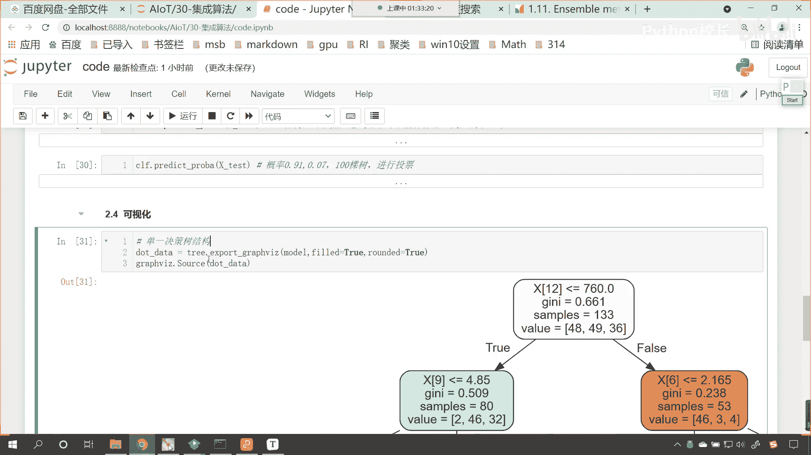

嗯这个时候你要观察一下，咱们的样本有多少个数据来，各位小伙伴，你告诉我有多少个数据，这棵决策树它的训练数据有多少个，告诉我来在我们讨论区里边回复一下，大家看他是不是133呀。

对不对，哎那为什么是133呀，为什么来我告诉你，为什么咱们是不是叫x train呀，看看x train。ship，你看它是多少，看是不是133，看到了吧，然后接下来呢我们再将随机森林给它画一下，好。

你想一下咱们的随机森林是不是有100棵树，对不对，那我们先画，咱们呢就先画第一棵好不好看，咱们先画第一棵树，好那这个时候也简单看啊，那就是trade explode graph v z model点。

这个时候呢就是c l f了，来一个中国二零，这就表示第一棵树，然后我们也给一个field等于true，也给一个round，让它等于true，得到的这个数据，咱们接收一下，那就是dot data。

然后grape viz。sauce，咱们将dot data放进去，你看我一直想看第一棵树是不是就出来了，看到了吧，大家仔细观察我们第一棵树当中有多少样本，83个对不对，诶，那为啥它是83个呢对吧。

为啥他是83，他这个样本量好像少了一点，对不对，看是不是样本量是不是少了一点，看到了吧，我们刚才在讲随机森林的时候，看咱们刚才在讲随机森林的时候。

它有几个随机性，这第一个叫什么，是不是叫做随机抽样呀。

那你你进行了随机抽样，大家看啊，看咱们训练的这个过程，你看这个是随机森林这一行代码，看这两行代码是不是他的训练啊，你看我在fit的时候，看我在训练的时候，咱们给的这个x train。

看咱们给的这个x train，它里面的样本是不是133个啊，我们给的是133个，这个没错吧，对不对，但是呢他进行了随机抽样，是不是进行了随机抽样抽样之后，这个数据是不是就变成了83个。

所以你现在知道为什么这一棵树画出来，它是83个了吧，哎大家注意啊，咱们的随机森林呢，不能把他的所有的样子画出来，但是咱们可以把它的每一棵树画出来，它的每一棵树都是一棵决策树。

看随机森林当中的每一个模型都是一棵决策树，好，那么我们刚才画了他的这个第一棵树，来咱们复制一下ctrl c，在这呢ctrl v咱们现在呢画达的第50棵树，那就是49，咱们画它的第50。

看第50棵树，你看我一直想看到了吧，这回你看样本量变成多少了。

81看了样本量，这个是不是也是随机抽呀，是不是随机抽样，咱们的这个数量有可能会不一样，那接下来咱们再来一个复制ctrl v，我们画它的最后一棵树啊，最后一棵树，那这个cf咱们是不是可以给个99。

看这个是不是他的最后一棵树，看到了吗，76对不对，那就最后一棵树，我们在获取的时候是不是也可以使用-1呀，一样的啊，你看看你给99也行，给-1也可以看到了吧。

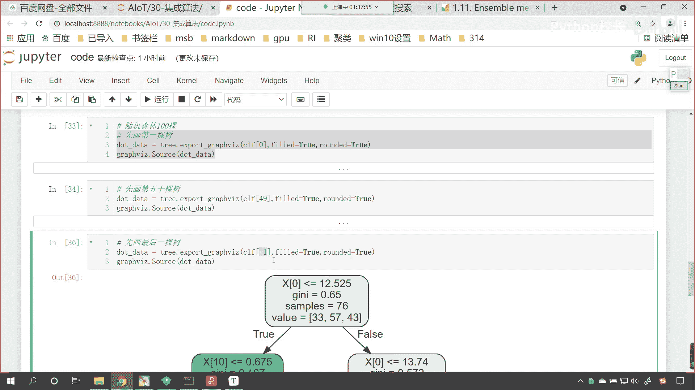

哎每一棵树，你看和咱们原来所学习的决策树有区别吗。

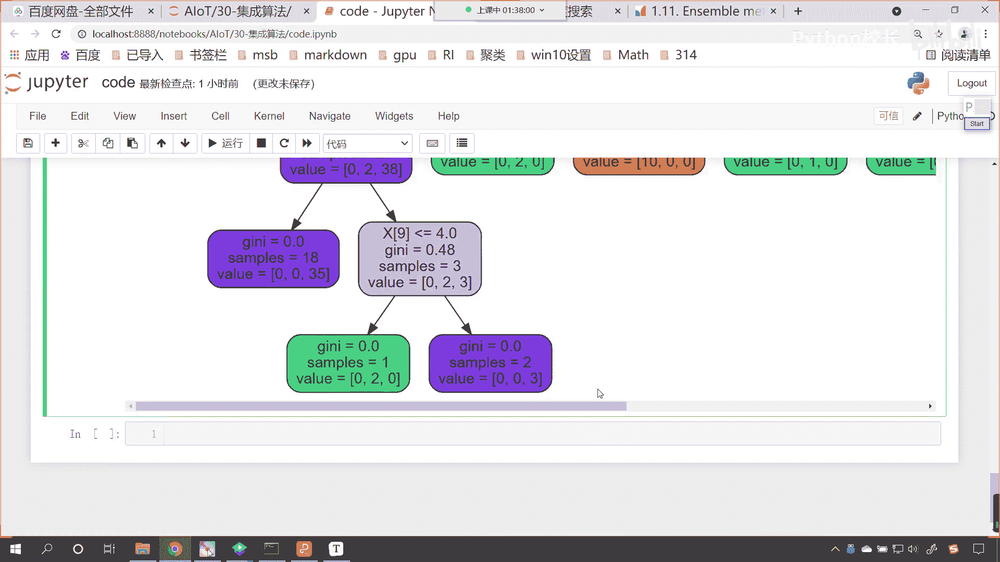

看到了吧，是不是没有区别好，那么现在你就知道他是怎么一回事儿了吧，看到现在你就知道嗯，这个随机森林到底是怎么一回事了。

好那么我们呢就通过代码。

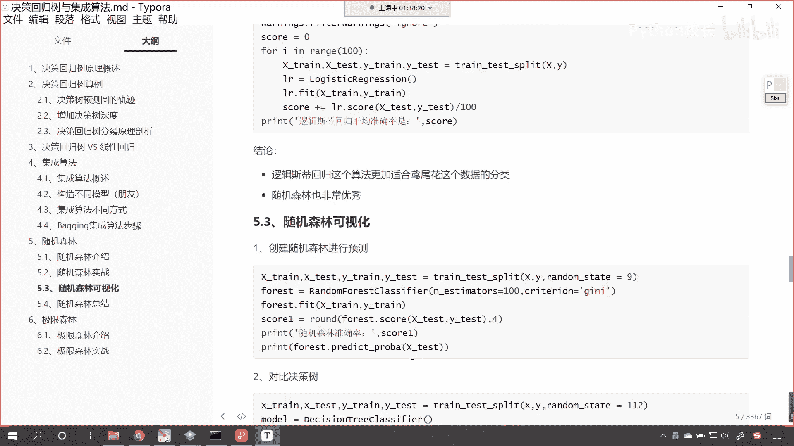

咱们通过它的可视化是吧，我们呢就进行了这个这个绘制是吧。

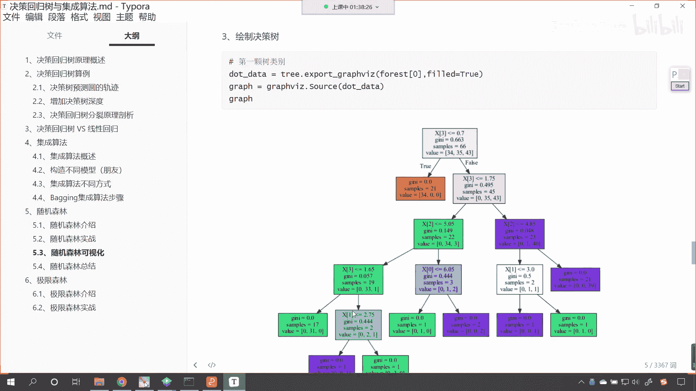

那最后呢我们看一下咱们随机森林的一个总结，好咱们的随森林的主要步骤呢，就是随机选择样本，有放回的抽样这个随机选择特征，然后呢构建咱们的决策树，然后随机森林呢最后是不是来了一个平均呀，对不对。

你看随机森林最后来了一个平均，那我们这个表现呢它更加的良好，咱们可以处理高维度的数据是吧，就是你的这个特征属性比较多的时候，使用随机森林嗯，更加这个均衡一些，它可以辅助进行特征选择。

得益于begging，咱们可以进行并行训练啊，对于噪声过大的数据，那就容易过拟合，其实对于噪声过大的数据，咱们随机森林过拟合，决策树，过拟合，支持向量机，它也会它也会过拟合，你噪声大是吧，都不行。

那咱们都得需要进行处理，随机森林当中的每一棵树都是一棵决策树，随机森林当中的每一棵树都是一棵决策树，好，那么这个呢就是咱们随机森林，哎，大家注意啊，咱们的特征也是进行随机的啊，你想一想。

如果这个特征要不是进行随机的，那我们随机森林在进行这个操作的时候，看随机森林在进行这个构建这个决策树的时候，那你想他是他从这个特征筛选的时候，变化最大的那个特征呀，你如果说你这个特征不是随机的。

你给再多的这个数，我再多的树长出来，是不是都一样呀，如果咱们的特征要进行了随机，那这个时候呢咱们得到的结果就会哎略有不同，正是因为这个随机，所以说咱们的表现就更加良好是吧。

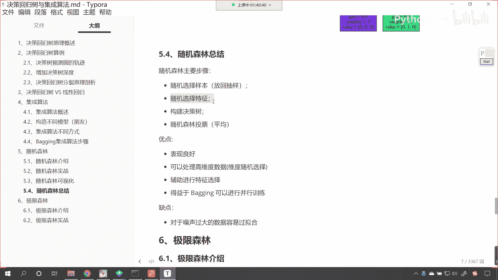

你看咱们代码当中展示了咱葡萄酒的数据，葡萄酒的得分，是不是就比咱们这个单一的决策数分数要高，在这儿呢咱们再多讲一句，因为咱们的葡萄酒它的特征是13个，大家要注意啊，看x下划线train。

你看它的ship它的特征是13个，而咱们的圆微花特征只有四个，特征只有四个和特征只有13个，像你在进行特征筛选的时候，你想你特征只有四个，你没得选，是不是你的选择空间就很小，所以说呢无论是一棵树也好。

还是多棵树也好，你最终得到的那个分数差距是不是就不大呀，如果你是13个特征是吧，那我进行特征筛选的时候，我的可选空间是不是就大得多了呀，比如说现在让你上大学是吧，你要么上这个，要么上河北工业。

要么上这个河北大学，看你就有两个选择，你都是这个都不是985，如果说你的选择多了是吧，多给你一个清华大学是吧，这个北京大学，浙江大学，上海交通大学，上海复旦大学，你的选择空间多了。

那你想你的人生是不是就完全不一样了，对不对，当你特征少的时候是吧，你选择就少，无论是决策树也好，还是咱们的这个随机森林也好。

他们都没有什么特别大的差异，这就是咱们当中所说的，你看这个可以处理高维度数据是吧，这个维度随机选择，这个维度随机选择就是咱们的特征随机选择啊，唉其实呢它这一点儿啊。

其实咱们这一点和上面所说的这个特征选择哎，它呢是一个意思啊，好那么这个呢就是咱们随机森林唉。

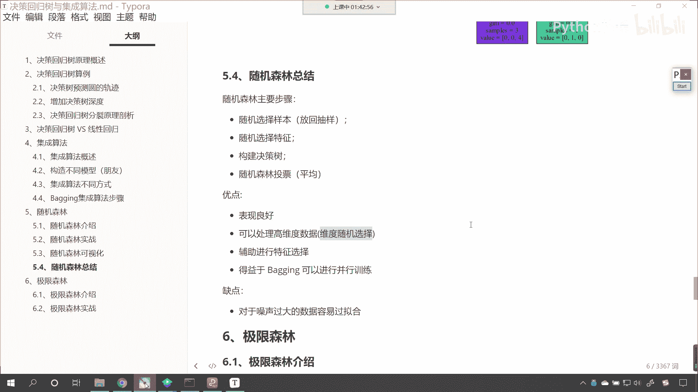