# P196：5-极限森林原理和应用 - 程序大本营 - BV1KL411z7WA

来那接下来呢我们一起看一下极限森林啊，咱们看一下这啥是极限三零呀。

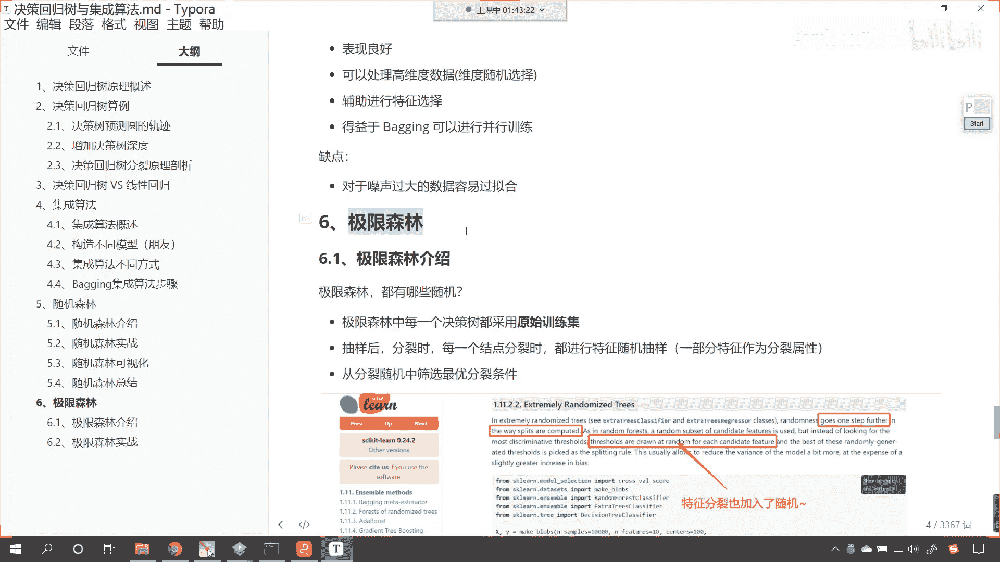

回到咱们sk learn的官方网站上看random forest。

这个是随机森林，紧接着它的下面就是extremely，random forest，extremely呢就有极限的意思，极致的意思我们在课件当中也进行了说明。

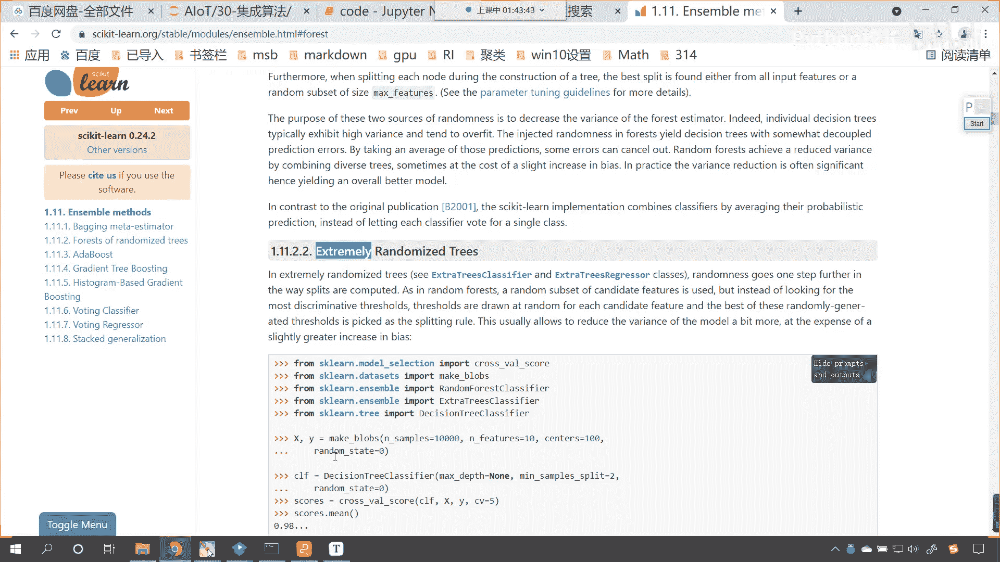

咱们看一下这个极限森林都有哪些随机性，看现在呢，你能够看到他对于极限森林有这样的一个描述，叫做goes one step further。

看goes one step further是不是又向前进了一步呀，叫goes one step further是吧，就像当年阿姆斯特朗登上月球，所说的那一句话是吧。

人类的一小步是吧啊这个一个人的一小步，但是人类的一大步是吧，这就是go one step further就向前更进了一步，the way splits are computer啊。

这个computer看这个计算，这个分裂的计算方式是吧，这个不一样了，怎么个不一样法呀，看到了吧，叫threads are drawn at random for each codinate feature。

也就是说我们的这个这个分裂标准，是不是也加入了一定的随机呀，你看啊咱们之前在进行特征分裂的时候，或者说通过信息熵的变化，谁变化大，是不是就选择谁呀，你想想是不是拿咱们高考举例，咱们也是谁考的分数高。

是不是就谁就可以上更好的学校呀，进行了相应的这个改革，那因为这个高考彼得是分数，所以说你看各种各样的k 12，像新东方好未来猿辅导是吧，好这个作业帮是不是都起来了，但是这是国家想要看到的吗。

难道你通过分数就可以判定这个人的这个，这个优劣吗，很显然不是对吧，那你想这个刘翔是吧，你如果要让他去参加高考，他肯定考不过那些学霸，对不对，但是你看刘翔就得了奥运会冠军。

所以说国家选拔人才也不仅仅是看分数，分数只是一个标准，就像我们在进行算法操作的时候，我们选我们筛选哪个特征最好，我们选谁，谁的信息熵变化大，我们选谁，这样一定好吗是吧，你放到咱们社会当中是吧。

你的钱你挣的工资多是吧，我就一定嫁给你吗是吧，这个女孩子选对象的时候是吧，难道我就完全根据你的薪资高低来选择吗，很显然不是是不是好，所以说呢这个极限森林它的这个随机性呢，看到了吧。

它的随机性更进一步是吧，就在于这个特征分裂加入了随机，有了这个特征分裂的这个随机呢，哎我们呢这个得到的结果，因为我们是多棵树，那多棵树得到的结果，最终呢哎就有可能更好一些，这呢就出现了一个这个综合评判。

好来现在的话咱们呢就使用这个极限森林，我们呢来进行一个这个操作啊，来此时呢咱们就回到咱们的这个代码当中。

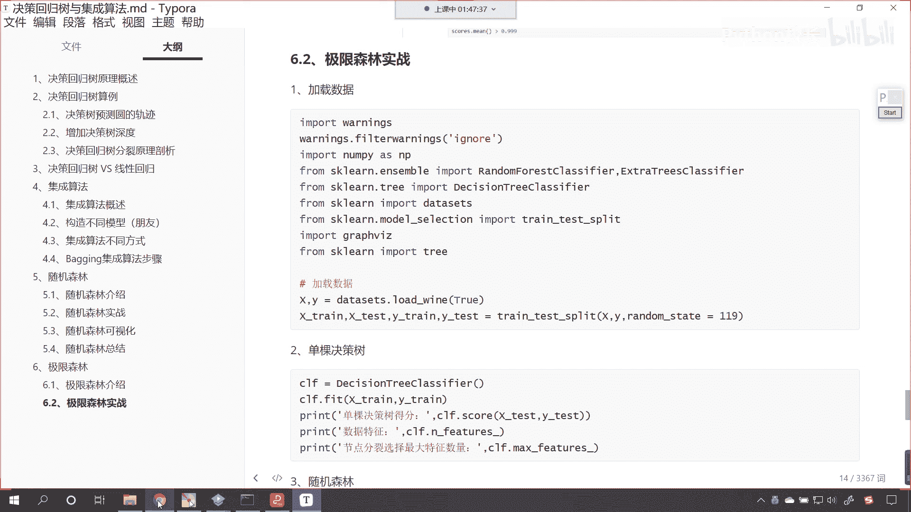

好，那么我们在这儿呢来一个这个三级标题，这个呢就是极限森林好，那么对于我们的极限森林呢，咱们依然使用上面的数据，哎，大家注意啊，这个时候呢咱们依然使用上面的数据好，那么此时呢咱们就导一下包。

from sklearn，以seassemble，从这个当中咱们import是吧，极限森林叫做extra tree classifire，好，咱们把它导进来，导进来之后执行一下。

同样呢咱们也来一个for循环，for i in range，我们给一个100是吧，冒号呃，然后呢咱们创建一个叫cl f2 ，就等于extra tree classifire。

然后呢cl f2 点咱们就feat一下啊，这个时候呢我们还得使用train test split，将咱们的数据呢一分为二，对不对，那在这儿呢咱们就手写一下，x trax下划线，test y下划线，春。

y下划线test，这个时候大家注意啊，此时的这个xy它是什么数据呢，它是不是依然是葡萄酒的数据啊，对不对，往上看一下，咱们随机森林的得分是0。98，咱们一棵决策树的得分是0。907，对不对。

那现在呢咱们看一下极限森林它怎么样啊，好那我们cl f2 feat一下，咱们将x下划线串放进去，y下划线串放进去for循环的上面，咱们给它声明一个sc，让它等于零，然后呢咱们对于每一次的得分是吧。

咱们记录一下，那就是scr加等咱们cl f2 这个极限森林，咱们对于测试数据进行分数的一个预测，那就是x下划线test，y下划线test，让他除以100，最后for循环结束，我们打印输出一下，哎。

那这个呢就是极限森林，我们的平均得分是冒号逗号，咱们将score放进去来，此时咱们执行一下，那么它运行也得花几秒钟时间，好现在咱们看一下，咱们的得分是0。984是吧，我们看一下和上面的这个哎。

你来看随机森林得分是0。98，对不对，我们极限森林得分是0。984，你看它的分数是不是高了一点点呀，你要注意啊，你看啊此时这个分数已经是0。98了是吧，满分是100，对不对，满分是100。

那他在这个基础上高了一点，这个已经很不容易了啊，你就好比是吧啊，这个啊你看我就经常拿我举例子，博尔特是吧，他跑1百米，他用了呃，这个九秒九秒六八还是六九呀，我跑1百米是吧，我13秒是吧。

我最巅峰的时候啊，1百米我跑13秒，我就和他差距是吧，这个四秒钟你眨眼眨眼睛眨四下是吧，就这么一点点差距是吧，但是呢你看人家通过体育，是不是就可以挣很多很多钱呀，所以说呢这个你就像咱们中国的苏炳添是吧。

他跑步的时候，这个在日本奥运会跑步，是不是这个跑进跑进这个9。83，是不是啊，那你想这个这个9。83和这个9。69，是不是就差一点点呀对吧，但这个时候你想要再提高，是不是已经非常非常难了呀，对不对。

你看这就非常难了啊，所以说咱们随机森林呢，对这个分数的这个预测已经很高了，它是一个高点，那我们使用极限森林，咱们是不是在这个基础上又提升了一点呀，哎这个就是极限森林它的一个这个特点哈。

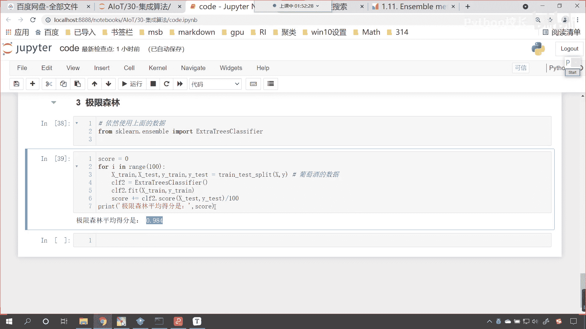

所以说这就是极限森林更近的这一步叫钩子，one step further是吧，他又向前又进了一步，那这也就说明这个极限森林，它的效果是不是也非常的好呀，对不对，你看这种效果也很好好。

那么这个咱们也进行一个可视化吧。

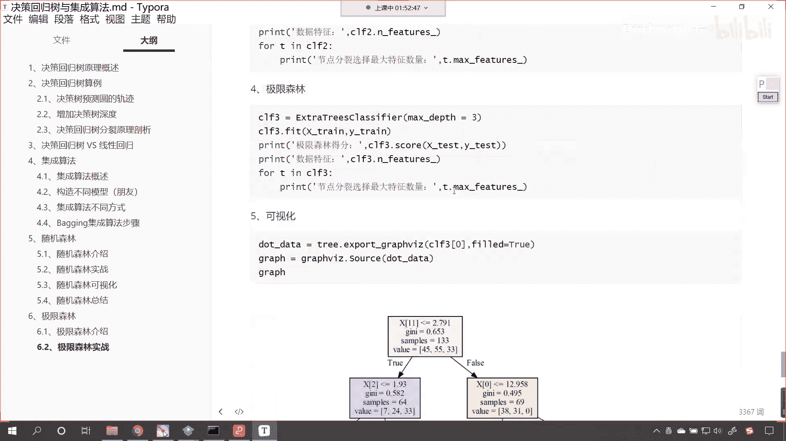

好不好，咱们进行一个可视化来回到代码当中是吧，那这个极限森林呢它是多少棵树呢，shift tab，你来看一下这个极限森林，它是不是也是100棵树呀，好咱们现在画树的时候呢，我们就画它的啊。

这个嗯第一棵树，第50棵树是吧，还有呃这个第100棵树，现在呢咱们绘制一下第一棵树是吧，那这个时候咱们就调tra点呃，咱们就调用它的explograph cl f2 ，大家看啊。

cl f2 来一个中括号零，这就是它的第一棵树，然后来一个field true，来一个round，我们也让它等于true，得到这个数据叫做dot data，然后呢咱们把它画出来啊。

这个时候呢那就是调用graph v z source，咱们将这个dot data放进去，你看我一直行，大家看这棵树。

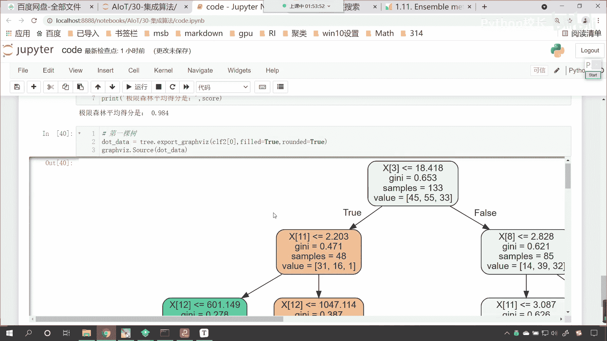

你看是不是就出来了，看到了吧，哇这棵树可真庞大呀，看到了吧，这棵树是不是就出来了，看到了，此时这个数就出来了啊，好那么这个数出来之后呢，咱们复制一下啊，ctrl c ctrl v来，咱们第50棵树。

那就是49，好那么这个呢就是咱们的第50棵树，你看我执行咱们有的人心特别细，他就发现看到了吗，这个样本是多少，是不是133呀，那这个极限森林和咱们的随机森林，是不是有不同的地方呀。

你想它有没有不同的地方，很显然在这个地方是不是就是不同呀，对不对，那也就是说咱们的极限森林。

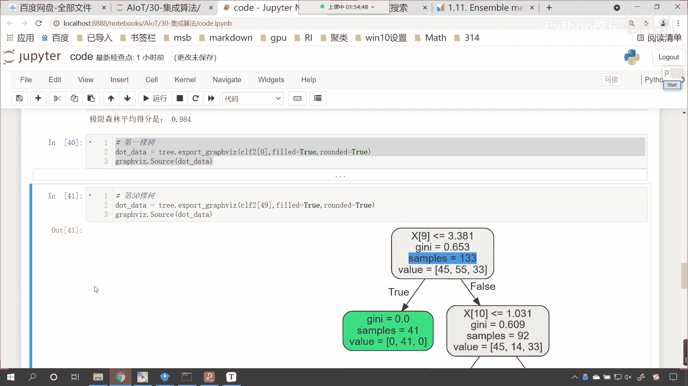

是不是会使用所有的样本呀，对不对，他会取所有的样本啊，这个就是它不同的地方，在这儿呢我们进行一个特别的说明啊，好我们的随机森林，它里边儿呢是不是有一个随机，看是不是有一个随机抽样呀，而咱们的极限森林啊。

极限森林咱们是不是使用所有的样本呀，对吧，哎你看我们使用所有的样本好，那么紧接着呢咱们看一下它的第50棵树，第100棵树啊，那就是-1了是吧。

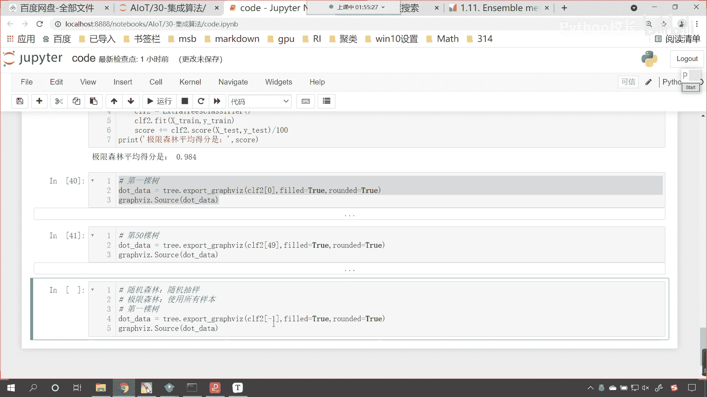

好这个时候你看我一执行诶，大家看啊，这棵树呢也是呃比较庞大的啊。

看这就是咱们这第100棵树好，那么最后呢我们再来验证一点啊，最后咱们再来验证一点啊，比如说呃我们为了简单一些啊，这个里边是不是有一个深度呀，看到了吧，这里边有一个深度，默认情况下是nine，它没有控制。

没有进行裁剪是吧，现在呢咱们来一个控制啊，那就是max下划线depth，我们让它等于咱们让它等于三吧，这个时候你看过一执行，这个时候这棵树，它的深度是不是就被限定住了呀，看啊被限定住了，你看深度是三。

咱们的得分是不是稍微会降低一些，没关系啊，咱们看第一棵树啊，你看第一棵树的深度怎么样。

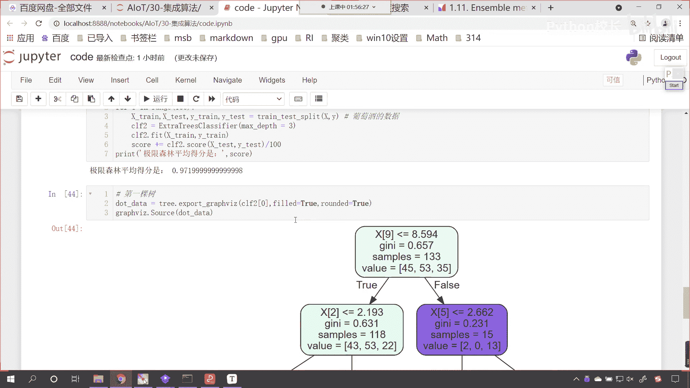

是不是就不像刚才那么大了，看到了。

因为我们对它进行限制了，你第50棵树呢看是不是也就深度是三。

对不对，好，那么最后第100棵树呢，大家看他也是看到了吧，所以说咱们给这个参数max depth等于三，那么它所有的数它的深度都是三，明白吗，看那上面咱们还有随机森林，看随机森林。

那这个随机森林这个地方呢，看也可以给一个max steps，咱们也让它等于三执行一下，好那么这个深度是三呢。

我们现在呢看一下它的第一棵树，你看一直行，咱们这棵树。

嗯这个是咱们单一的数。

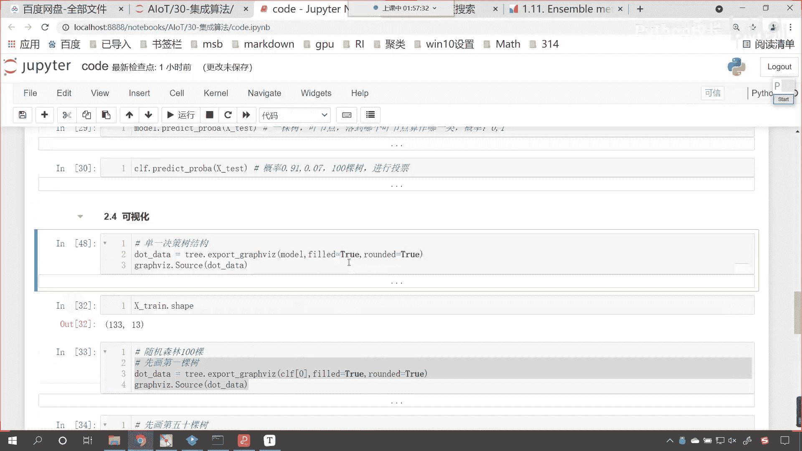

咱们看一下随机森林的第一棵树，看深度是不是就是三了。

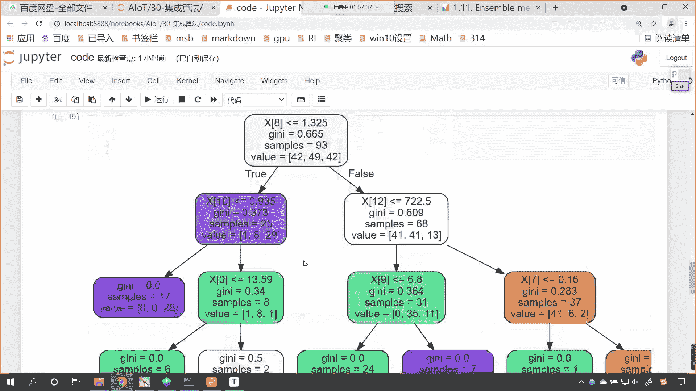

是不是被我们限定住了，看到了一个两层，三层四层是吧。

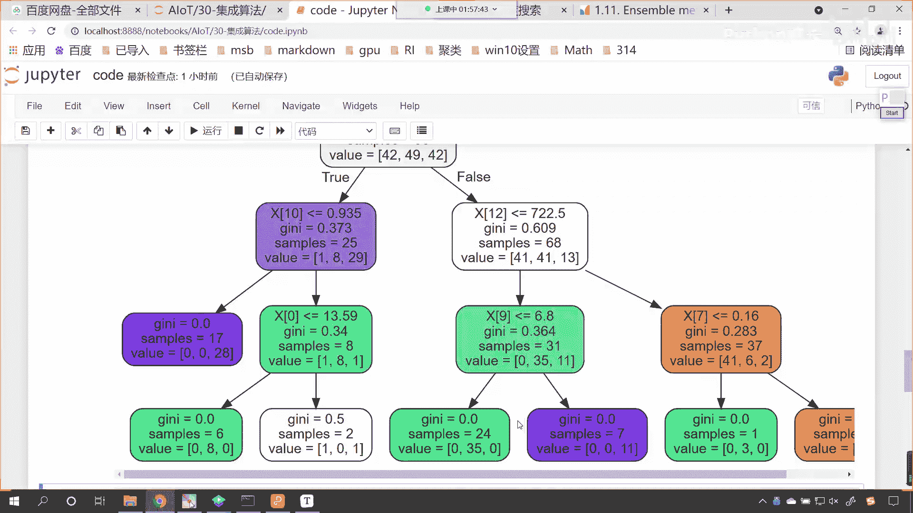

因为算树根，树根这一层不算是不是好，那么最后我们要讨论一件什么样的事呢。

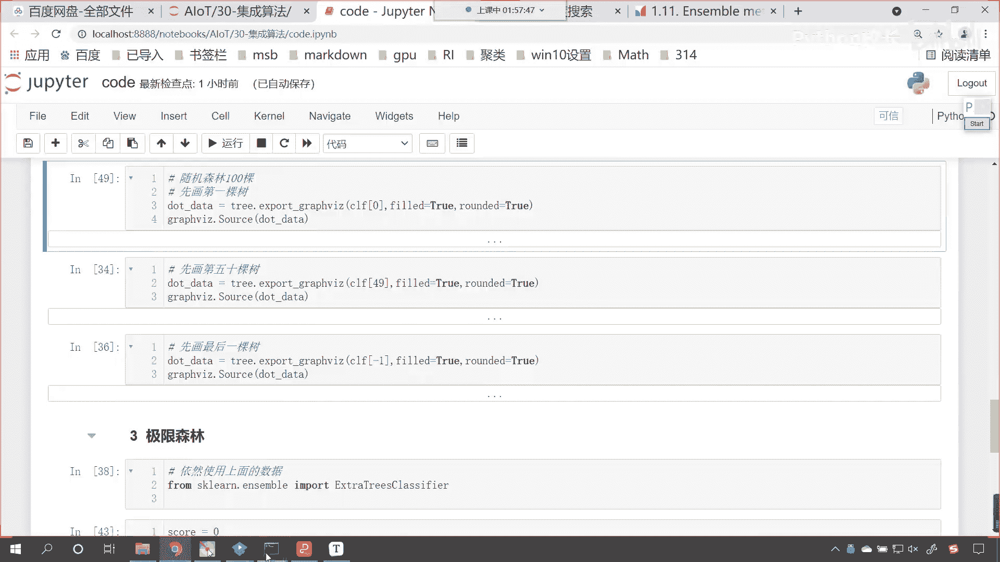

看啊我们往下滑啊。

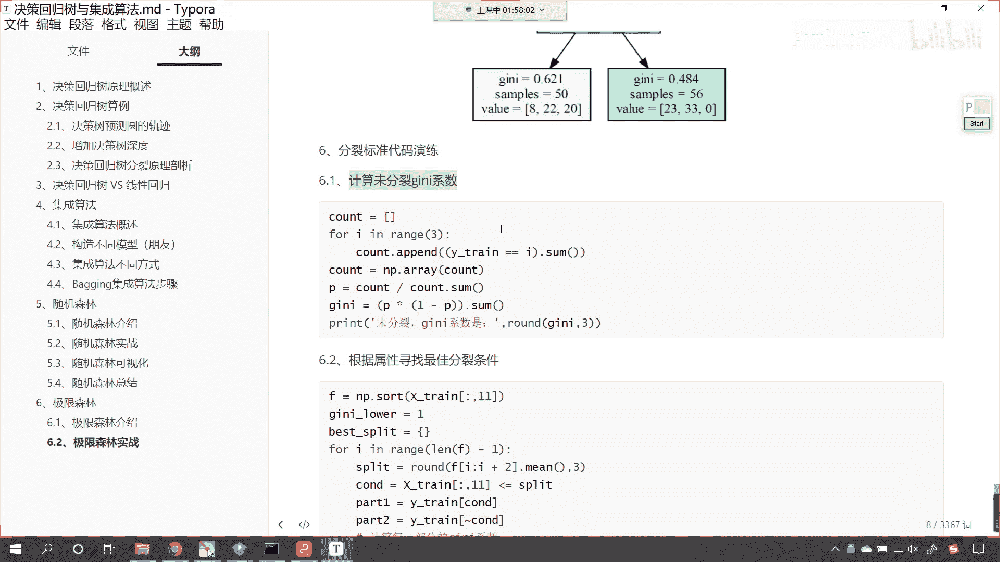

那你知道咱们的葡萄酒它是分几类的，看我们往下滑啊，看咱们在这儿呢来一个三级标题，那么葡萄酒是分几类的。

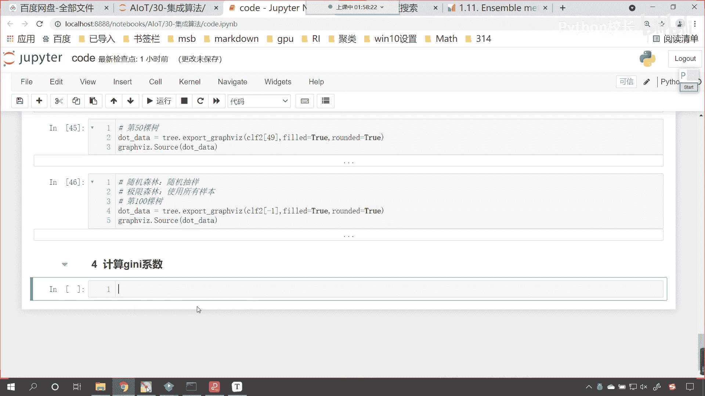

来给你看一下y看012是不是分三类呀。

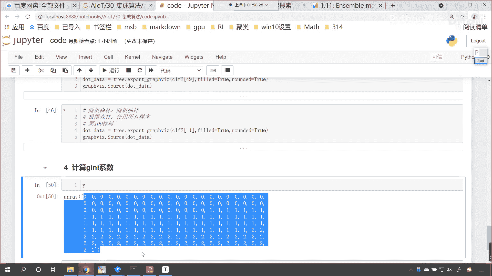

对不对，那分三类该如何算呢，代码在这儿呢看啊，复制一下ctrl c回到咱们的代码当中。

在这儿呢咱们来一个粘贴，你不是分三类吗，我每一类都进行一个统计，然后呢我进行一个计算，对不对，你看我进行一个计算，你看这个时候我计算出来的结果，0。663看到了吧，0。663算出来了吧。

那看一下咱们看看一下咱们这个，极限森林它的第一棵树，ctrl c，ctrl v看啊。

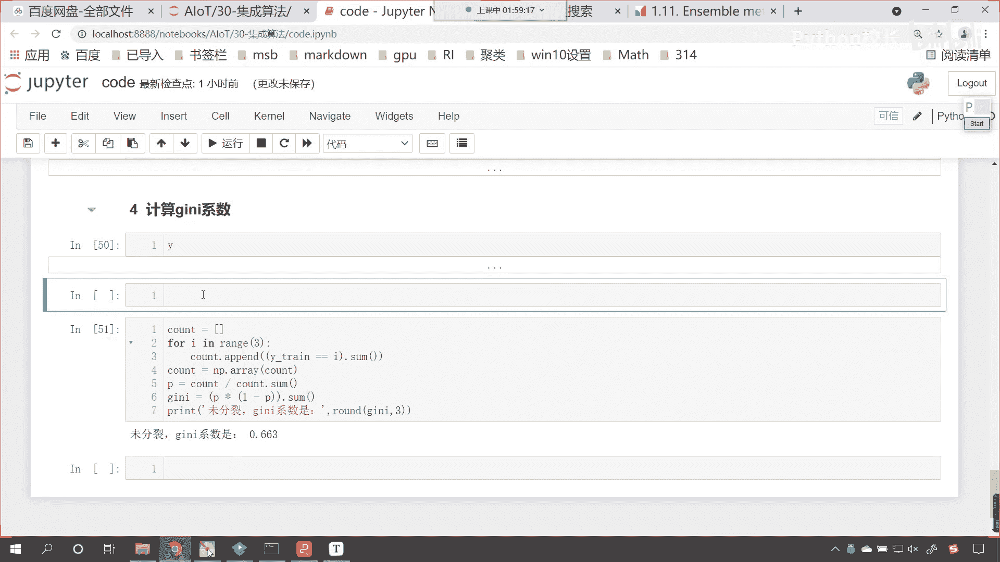

执行看一下咱们极限森林0。657，是不是啊，那肯定是咱们在进行采样的时候。

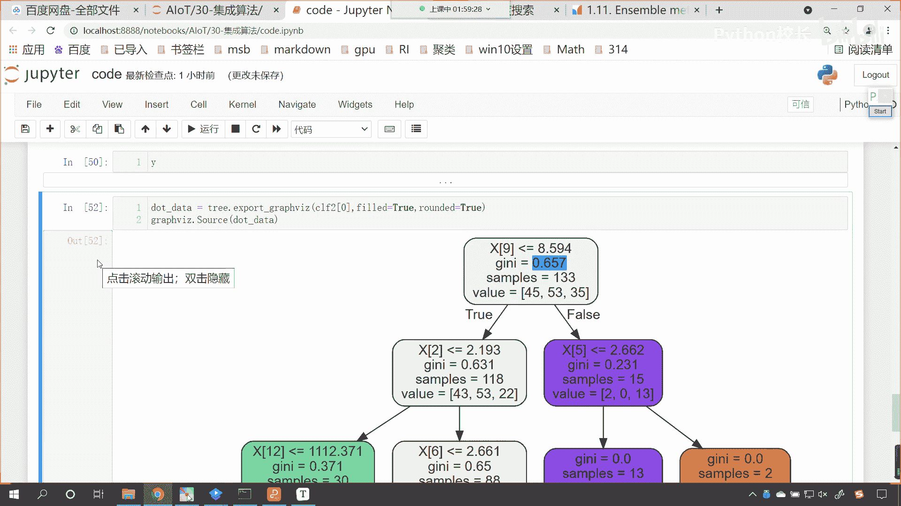

他稍微有点不一样，看这个是0。663，所以说如果要是多分类的话，公式不变，知道吗，公式不变好。

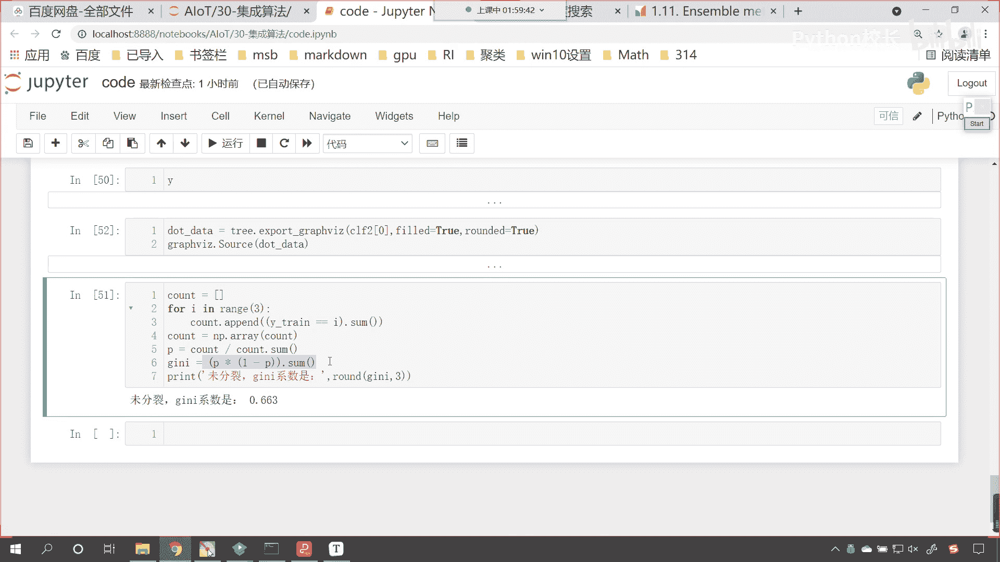

那么这个呢就是咱们集成森林，这就是咱们集成算法，我们介绍了随机森林，咱们介绍了极限森林好，那么今天晚上呢。

咱们这个知识点我们就讲到这里啊，我们看一下咱们的作业啊。

咱们今天晚上的作业呢，我们对于决策树的知识点进行一个总结，咱们呢回答一下这五个问题就可以了啊，嗯好咱们今天晚上呢我们就到这里啊，好那我们呢呃今天呢就先下课啊，各位小伙伴来。

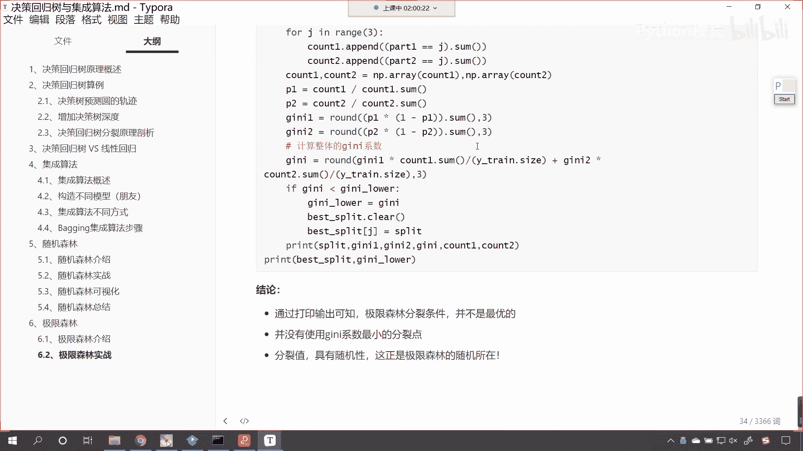