# P51：2-八元一次方程增加截距的解决方案 - 程序大本营 - BV1KL411z7WA

来那遇见问题了，那程序员是万能的，咱们接下来呢就解决这个问题啊，往上走啊，往上走，你看咱们经过嗯，咱们经过相应的操作，你看我的x求解出来的是不是幺五十五，384 17 12，他是不是这样。

这个是咱们的标准答案啊，啊在这儿呢咱们做一个说明啊，这个是不是标准答案，对不对，当我们给八元八次方程的时候，我们给八元一次方程的时候是吧，那这个就是标准答案，既然有了这个标准答案。

那你看这个是不是就是他的这个w呀，来我们复制一下啊，你看我怎么操作啊，w呢，那w就等于np。a瑞ctrl v粘贴一下，这个就是标准答案，有了标准答案，咱们再给它增加一个方程。

那这个方程呢咱们起名就叫x9 x9 ，它的这些数值都是多少呀，随机数生成np。random rint，我们让它从-15到正15，然后给他一个size，那我们依然给它是八个，看到了吗。

这个就是我们的x9 ，这就是我们增加的这个方程，你看你有了这个方程，又有了上面的系数，看到了吧，有了这个方程，又有了上面的系数，那么我们现在是不是就可以来一个乘法吧，那就是x9 点dot。

咱们将系数放进去，你看我求解出来的是不是207，那这个是不是就是咱们的y值，我加上12，看到了吧，我加上12之后它是什么，那加上12之后，他是因为咱们上面的，那因为我们上面那八个方程。

看咱们上面那八个方程，它是不是看咱们上面那八个方程啊，上面那八个方程你想一下，他是不是都增都增加了12，所以这个方程是不是也得增加12啊，在这咱们做一个说明啊，上面的，看上面的八个方程。

看它呢都有截距是12，所以说第九个看第九个方程是不是也一样呀，哎所以他怎么样也增加12，那增加12它的值是多少，219，ok现在有了219了，咱们的y呢就可以发生一个变化了啊，你看y是目标值是吧。

y就等于np。cocoinnate，小括号中括号把y放进去，再来一个中国2219放进去，那这个时候你看我一集连这个y的结果是多少，这个时候你看我一执行，你看它的最后一个值是多少，是不是就变成219了。

好现在你看啊，现在呢我是不是将y给搞定了，那还剩x你看咱们的x长什么样啊，看到了吧，x是不是长这个样，x是不是八个方程。

对不对呀，最后一列是不是一我们的x9 ，是不是咱们最后一个方程，那这最后一个方程，是不是要添加到咱们的x的后面，对不对，你看你这个第九个方程，它是不是应该填到这，填到这儿之后，它的最后是不是也应该。

是不是也应该增加个一呀，这个一是不是就表示截距呀，对不对，看到了吧，他也应该对不对，也应该增加一个一，是不是好，那么咱们就按照这个操作来好不好来，那么现在的话上面的x9 。

咱们先对于x9 进行一个操作啊，那就是np。cocoinnate来一个中括号，咱们将x9 放进去，这就是咱们的第九个方程，然后我们给它加个一是吧，这个时候你看我一直行啊，那这个一还不行。

咱们这个一呢得给它加一个中括号，看到了吧，这个时候你看我一执行，大家看此时x9 是不是就发生了变化呀，接收一下来，咱们接收一下，那就是x9 ，看这个就是x9 好。

那么咱们现在呢就将x9 放到x里边就可以了，但这个时候你发现x9 是一维的，看到了吧，我们的x呢是二维的是吧，怎么才能给它添加进去呢，咱们依然是调用contacculate这个方法，来一个中括号是吧。

咱们将x放到这儿，再来一个中括号x9 ，看我们给它放到这儿，这个时候你看我一执行，你看最后一行是不是增加了，看到了吧，增加了之后呢，这个就是咱们全新的全新的什么，这个就是咱们全新的x执行一下啊，记住啊。

只执行一次啊，执行这个代码，大家看，有了有了咱们增加的这个方程，以及咱们处理过的y之后，那么我们接下来就使用正规方程，对它进行一个操作好不好，那就是np一点，大家看啊，i n v小括号，那就是x。t。

dot x，然后点dot小括号x。t，然后点dot小括号，咱们将y放进去，大家拭目以待，执行一下，各位各位唉，看结果，各位各位看结果，看前八个是什么，前八个求解出来的答案，和上面咱们求解出来的答案。

你看一样不一样，看到了吗，这是咱们八元一次方程求解出来的答案，你看这个是12，对不对，那经过我们增加方程，看到了吗，经过我们随机增加方程，咱们所求解出来的这个解，看到了吧，和上面是不是一模一样啊。

看到了吧，和上面是一模一样的，那么我们在上面插入一行，咱们将w进行一个输出，看将w进行一个输出，看到了吧，这个是原来的解啊，看来咱们画一个图对它进行一个说明，你看到了吧，这个是标准答案。

这是我们提供的八元一次方程的标准答案，那么后来呢，我们将八元一次方程给它增加了个系数，那这个系数呢就是咱们的12，既然你增加了一个系数，增加了一个截距，那么你的方程也得发生变化，注意啊。

咱们来一个绿色的啊，方程也得发生变化，知道吧，这个就是第九个方程，因为一个方程多元一次方程，如果想要唯一确定解，它是不是有充分必要条件呀，嗯还记得充分必要吧，是不是，那我们方程的充分必要条件。

它是不是它有几个未知数，那是不是就得嗯至少有几个方程呀，对吧，哎这还不一定充分啊，你的方程呢还必须得是有效方程才可以，对不对，你看现在就求解出来了，好那么这是正规方程的求解。

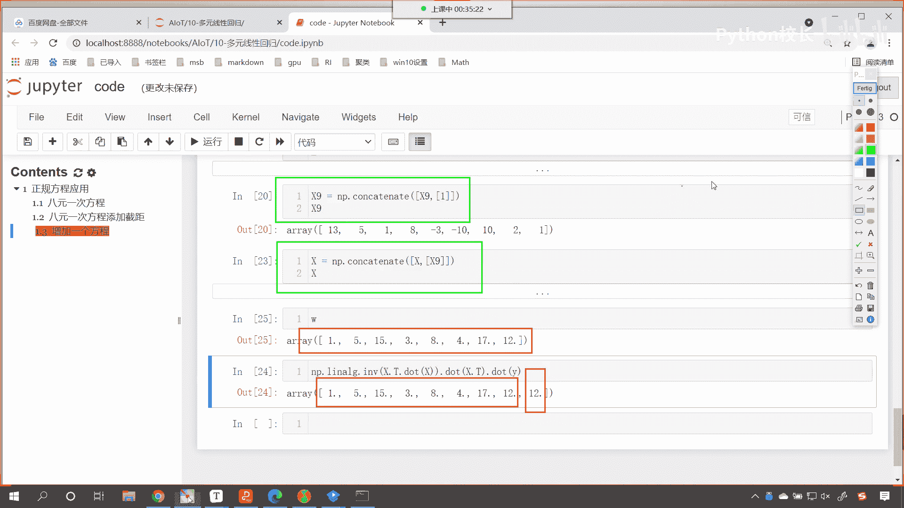

那正规方程对它有效啦，那你讲线性回归是不是也就有效了，来咱们来一个linear regression，同样啊咱们这个feat intercept，你看我依然给他设置成了false，这个时候你先想一下。

为什么咱们先计算结果啊，xy这个时候呢咱们就调用猫打印输出一下，那就是model。coif，你看我一执行，大家看此时方程增加了一个，你看无论使用线性回归也好，还是使用咱们的正规方程也好。

结果是不是一模一样，看到了吗，一模一样啊，看到了吧，display，对不对，所以说他们是统一的，我们在上一节课之所以会出现那个问题，那根本原因所在呢，根本原因所在就是就是这个地方。

咱们一上来问大家的那个问题，说八元一次方程求解有唯一解，请问至少需要几个方程，是不是咱们刚才也有小伙伴说了，是不是啊，必须得是八个，是不是啊，那我们对它进行了添加截距，这个截距它就又相当于一个变量。

增加了截距之后，这个时候它就成了九元一次方程了。

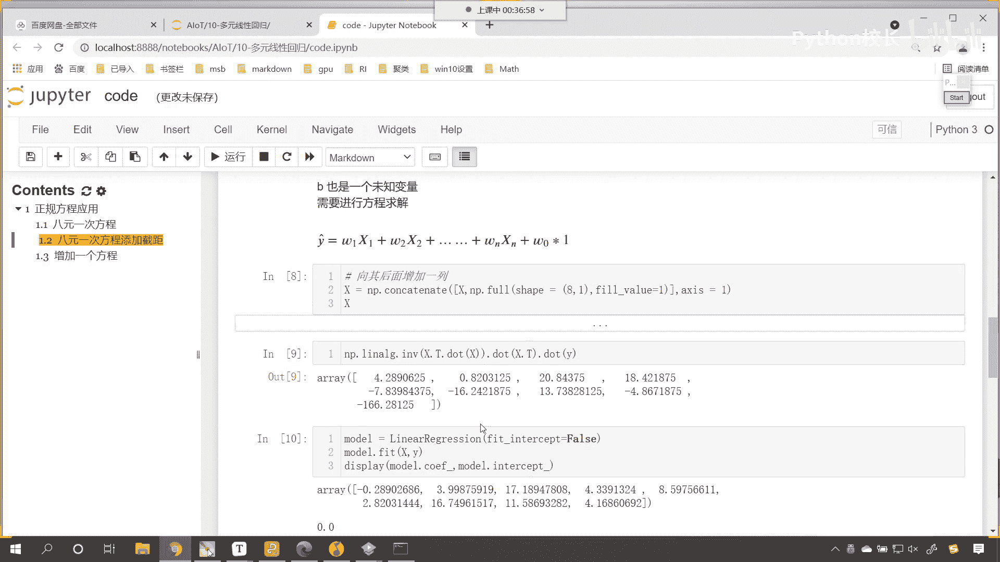

那九元一次方程我，但是咱们的方程数数据当中如果有八个，这个时候你无法求解出标准答案，无法求解出完美解，所以说你看我们无论使用正规方程也好，还是咱们使用线性回归也好，都一样，这个是解不出来的，是不是啊。

你看它是它是这个无解的啊。

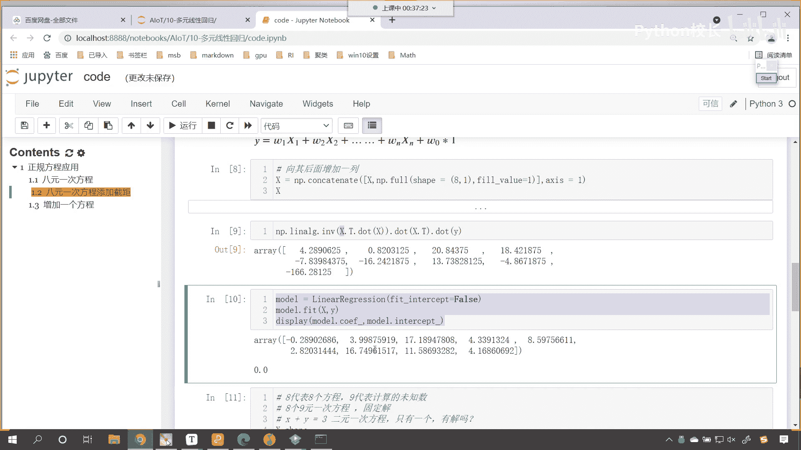

那我们增加一个方程，你看大家要注意咱们是怎么增加的这个方程啊，你不是有嗯，有这个原来是有八个方程，是不是x9 ，这个x9 是咱们随机生成的啊，这个数值就像什么呢。

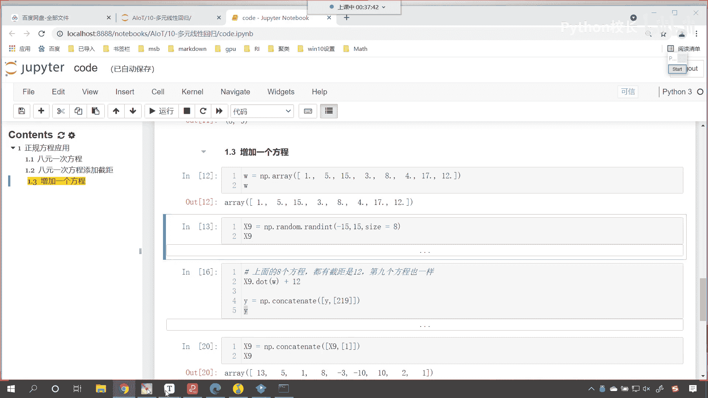

你看啊你看你的系数x2 之前，x3 之前，x4 之前是不是都有像有十，对不对，你看它有13二-25，这些数字是我们随机生成的，对不对，我们在代码当中也模拟了这样的操作。

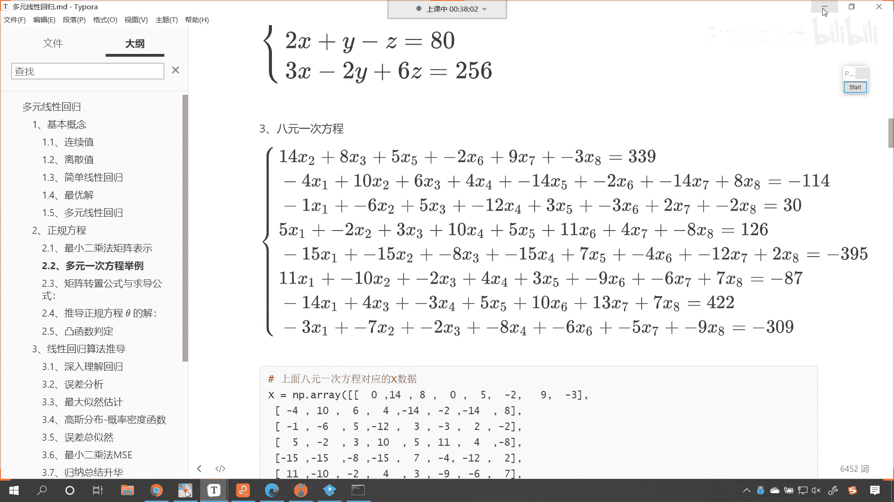

让咱们的random随机数，随机帮我们生成了一组数字，有了这组数字，是不是就可以使用矩阵运算去求它的目标值了，加上12是不是就相当于截距，那么y也就有了，有了y之后，你看你有了y之后，你这个x9 是吧。

咱们对于上面的x9 ，我们又对它进行增加了一，这个一也就对应着咱们的结局，这个数字的范围是我随机生成的啊，你这个范围想是多少就是多少，明白吗，嗯我们以后课堂上所举的这个数字的范围是吧，你随意啊，明白吗。

小伙伴们，同学们随意，知道吗，因为这个只是举例是吧，你让这个范围是多大，这个没有关系，所以你看咱们最后就求解出来了来，那我如何才能大家看啊，简咱们，ctrl v。

那假设说我要将这个feat intercept给它设置成true，它会怎么样呀，就是说我在求解的时候，我计算结局会怎么样，咱们执行一下，看看和原来一样吗，你看啊，看到了吧。

我现在feat intercept设置成true，你会发现会怎么样，他把最后一个系数计算成多少了，是不是计算成零了，咱们model。intercept它计算成多少，是不是19。99999716呀。

如果四舍五入一下，你想这个是不是就是12啊，咱们现在呢可以这个，呃你看这个11。9是吧，如果说我们要进行四舍五入，那咱们进行怎么样四舍五入，四舍五入，那下面这个求解出来的截距，它是不是就是12，你看啊。

看咱们这个数值为什么是零，看到了吗，你看这个数值为最后这个系数求解出来是零，表示什么，想一下它是零表示什么，如果说一个系数或者说我们把它叫做权重，它是零，是不是说明它不重要呀，那既然不重要。

是不是说明可有可无呀，你看前面这八个数是不是都是正确的，看到了吧，前面的这八个数都是正确的啊，来我们接下来再做一个改进。

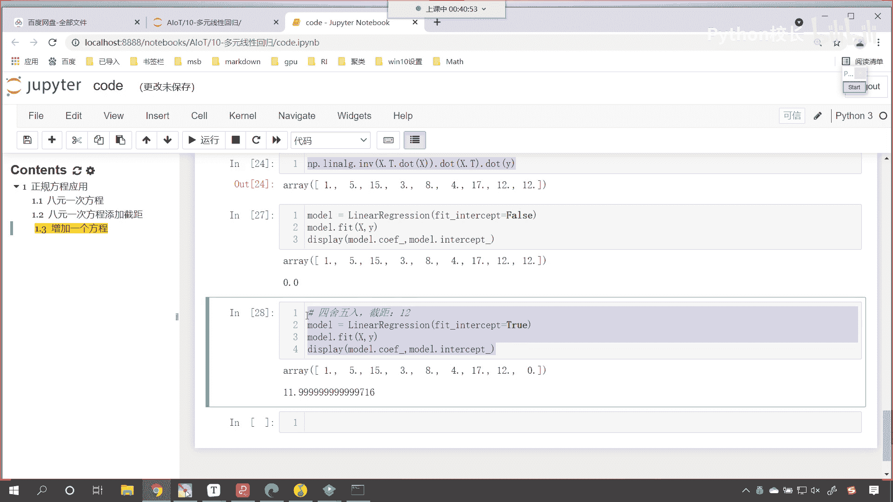

复制一下ctrl v，你看啊，我依然让它是true啊，依然让它是true，咱们对于x进行一个操作，那对于x进行一个操作，咱们对它进行一个怎么操作呢，啊咱们来一个冒号嗯，然后呢这个逗号再来一个冒号。

切片切到-1，如果我要切到-1的话，你知道会发生一个什么样的情况吗，看我要切到-1会怎么样。

你看我执行一下，我切到-1是不是最后一列就没了呀，看到了我切到-1是不是最后一列就没了。

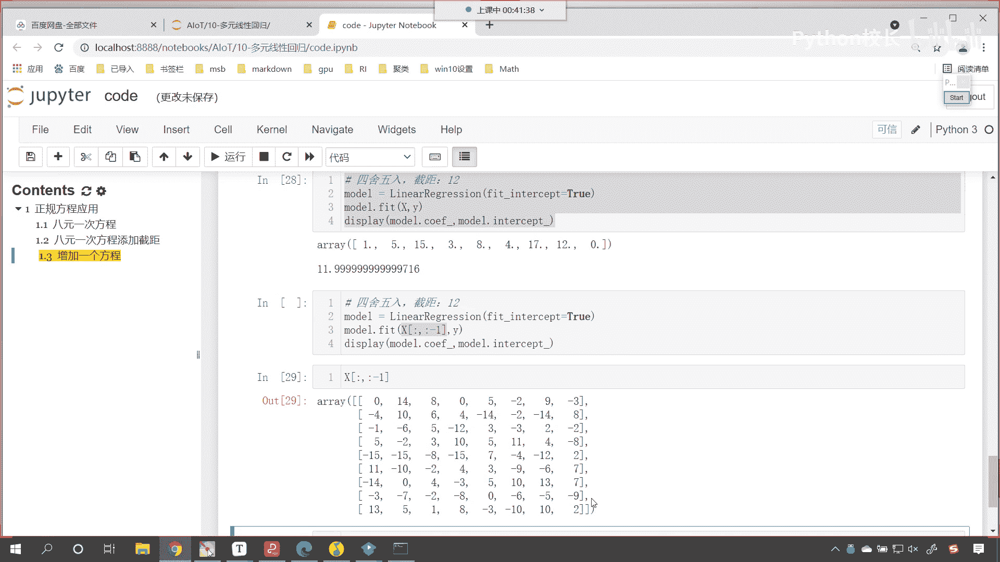

没问题吧，你看啊，咱们看了切片的效果了，执行一下，那也就是说我切片切到-1，咱们是不是将那个截距给去掉了呀，对不对，看我们将截距去掉，是不是没错吧，也就是说你不要拮据这一列了，咱们怎么样呀。

告诉线性回归，你求的时候直接求一下就好了，是不是啊，你看这个时候执行一下啊，哎大家看是不是一五十五三八四十72，求解出来的结局是不是依然是啊，这个11。9999，是不是不是说结局不重要啊，结局也很重要。

各位各位小伙伴，结局也很重要，你想这个截距是不是影响着咱们方程的位置呀，对不对啊，截距影响着方程的位置哈，他通过这个结局呢来让方程上移或下移，结局也是很重要的啊，如果不重要，那干脆就不要这个model。

intercept杠了是吧，为什么还要需要它呢。

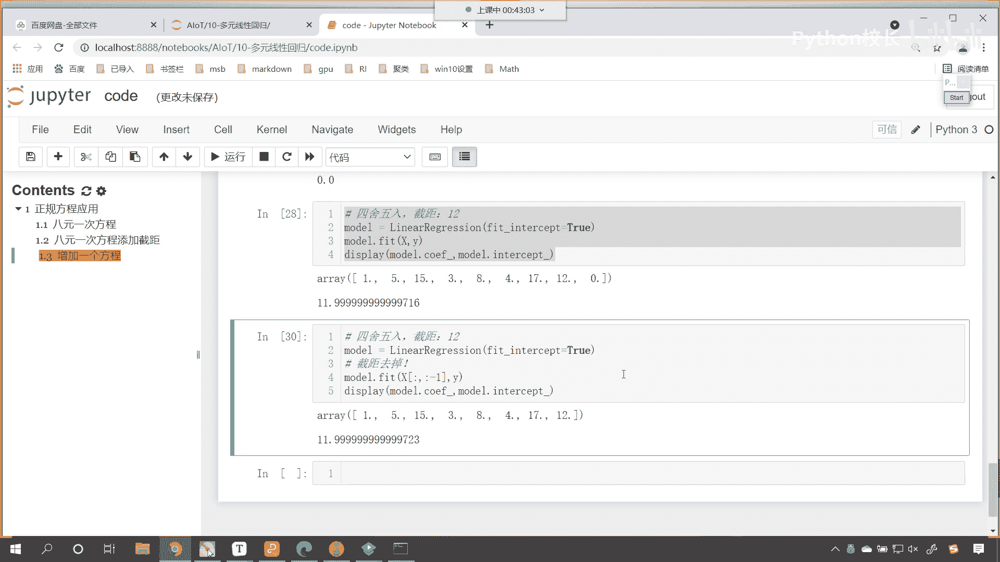

咱们刚才呢有小伙伴问了一个问题，说我把这个数据增加了一个方程之后，看增加了一个方程之后，咱们使用linear regression，看到了吗，咱们使用linear regression。

你看我求解出来的，求解出来的最后一个系数是多少，是不是零呀，对不对，那该如何理解咱们最后一个系数是零呢，看我们把它叫什么呢，我们把它叫做方程的系数，对不对，我们把它叫做方程的系数。

有的书上还把它叫做什么呢，叫做权重，你看还把它叫做权重，一般情况下咱们用w来表示，对不对，你看一般情况下用w来表示，那这个w它等等什么呢，就是weight，weight，翻译成中文就有权重的意思。

你想如果它的权重是零表示什么呀，看权重是零是不是表示你无论乘以多少，是不是都白搭呀，对不对，你看权重是零，是不是说明可有可无呀，对吧，可有可无，因为你想我们给定的这个数据x你看啊。

我们给定的这个数据x他的最后一列，你看它都是什么，都是一，对不对，你看你给的数据都是一对吧，那你这个这一列他呢就无足轻重，那你就像是吧，我们在回答问题的时候，看我们在回答问题的时候。

无论别人问你什么是吧，如果说你都回答对，那很显然是吧，你回答就是不合理的是吧，你的回答就不重要，无足轻重了，所以说呢你看啊，我们为了让各位能够更好地理解，咱们进行了相应的变形，明白吗。

你看我进行了相应的变形。

我相信各位小伙伴这个八元一次方程。

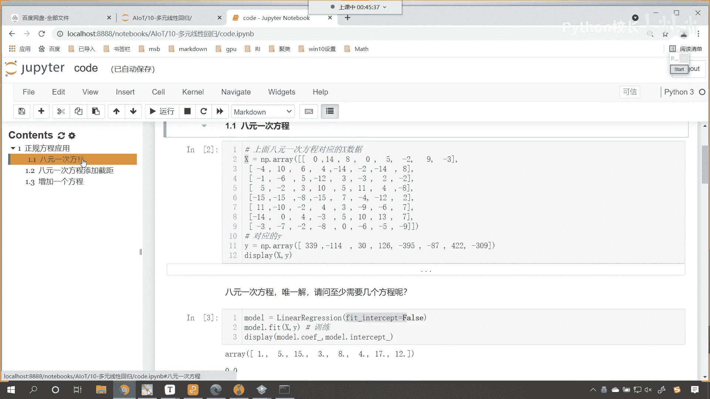

咱们所举的这个八元一次方程，咱们到这个地方，各位都是明白的，看到了吧，到这儿是吧，八元一次方程对不对，你看八个未知数，八个方程求解出来的清清楚楚。

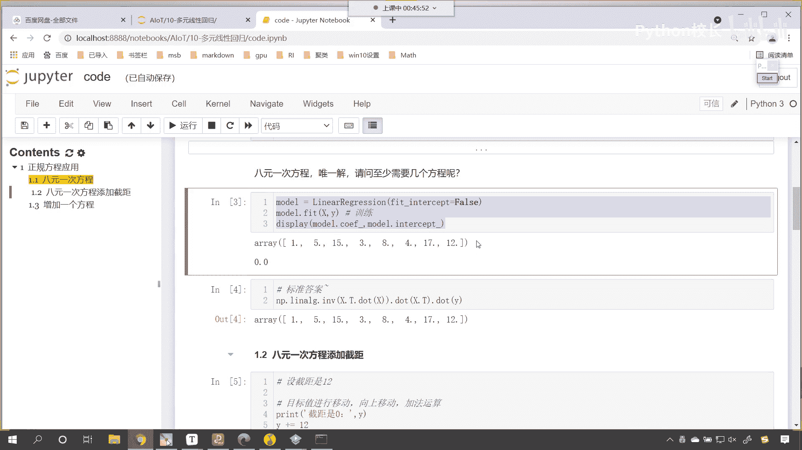

明明白白，那我们使用正规方程求解出来的也是清清楚楚。

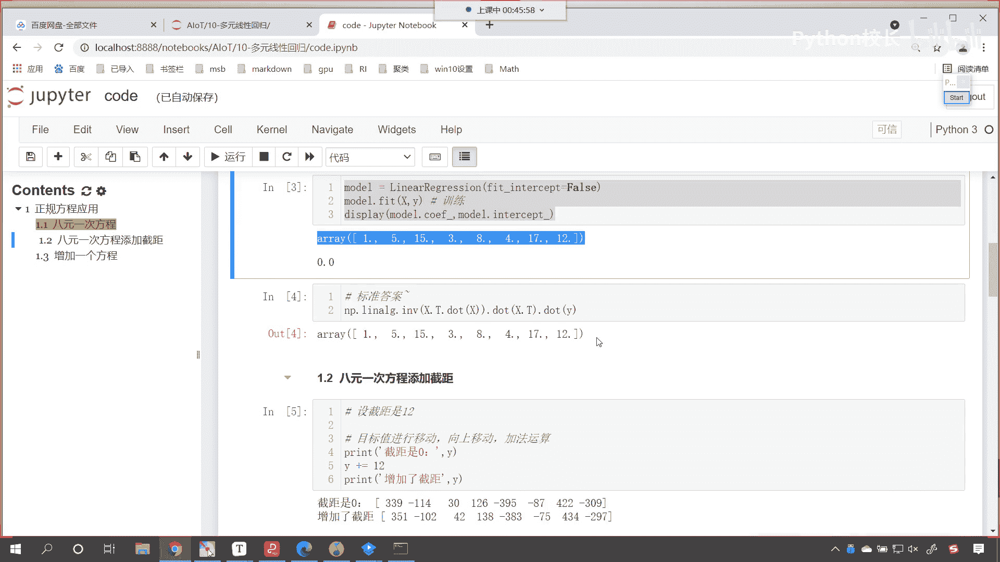

明明白白，和上面咱们使用线性回归结果一样，对不对，你看就这一块儿是吧，大家肯定是明白的，来不明白的小伙伴嗯，这个回复一个888啊，明白的小伙伴回复一个888，到这儿没问题，是不是啊。

那我们接下来再进一步啊。

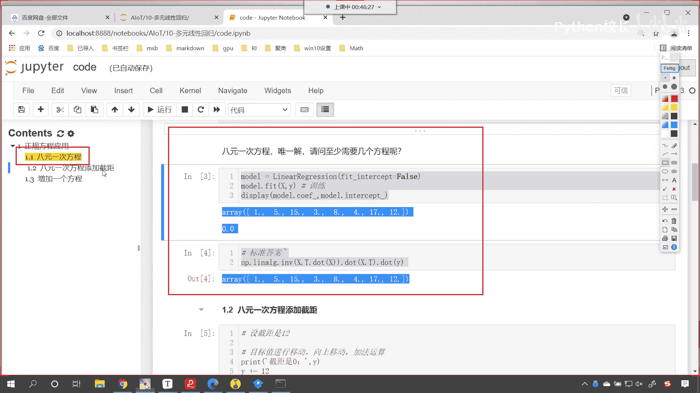

因为我们这个分三部分是吧，紧接着呢咱们对八元一次方程增加了截距，我们说我们加大难度增加截距，那么我们如何理解截距呢，我们说截距就是一个b，对不对，你看你加了一个常数，是不是b那我们说这个b也是一个变量。

也需要进行方程的，也需要通过方程来进行求解，所以说b，咱们是不是就可以把它当成一个新的系数呀，看了你这个b你用啥符号表示不行呀，对不对是吧，你这个既然你这个b呢，它都是一个变量是吧，用啥符号表示不行。

看啊嗯咱们也行，知道吗，这个y不增加12也是可以的，知道吗，y不增加12也可以好，大家看啊，你看咱们这个b用什么符号表示，是不是都是等效的呀，对不对，那这一块各位听明白的，咱们回复一个996好不好。

这一块儿听明白的回复一个996好，那么到这儿之后。

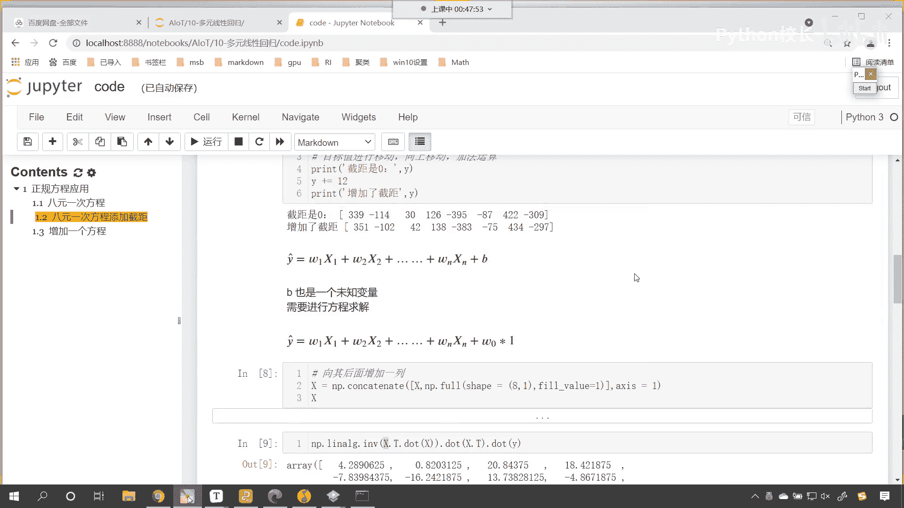

咱们既然增加了一个w0 ，那我们这个数据呢形式就得怎么样，你看就得发生一定的变化，因为你这个w0 无论是哪个方程对吧，你看你有八个方程，对不对，咱们原来是八元一次方程，那有八个方程。

那这八个方程是不是都加了w0 呀，所以看那这八个方程诶，他的最后一列咱们都为它增加了个一，这个一呢就对应着你看这个w0 的系数，看看这个一就对应w0 的系数，为什么增加了这个八个数呢。

因为原来是八个方程，所以说增加一好。

那么现在有了x了，当我们再次使用正规方程的时候。

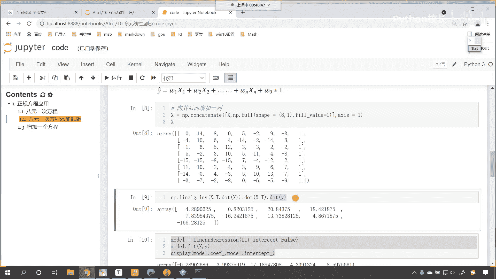

你看算出来的结果就不对了，在使用线性回归的时候。

算出来的方程也就不对了，看到了吗，在使用线性回归的时候，算出来的方程它也就不对了，那这是为啥，是不是啊，这是为啥。

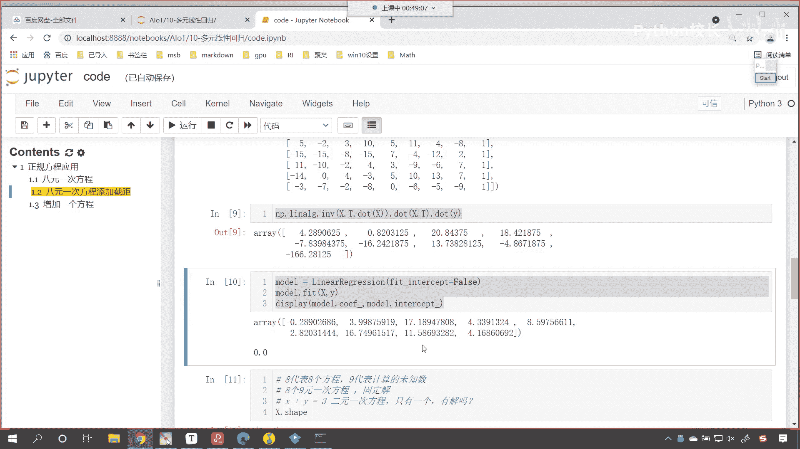

明明刚才好好的是吧，嗯都这个非常圆满，求解出来了。

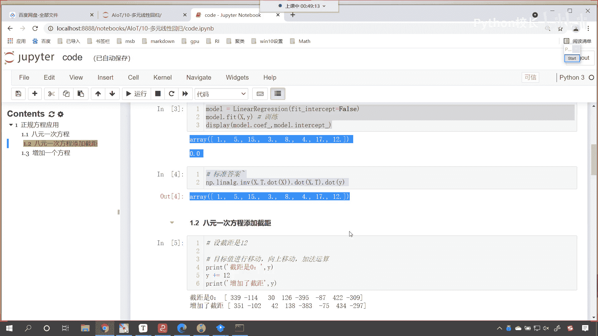

现在增加了一个结局，你就不行了，为啥唉，咱们说了这个八呢代表八个方程，现在你增加了一个截距，那就是叫法不一样而已，是不是，那这个截距它也是一个要求解的变量，所以这个时候就相当于是八个九元一次方程。

它呢就没有，那它就没有固定解，因为咱们所给的方程不够，所以说这个就解不出来对吧。

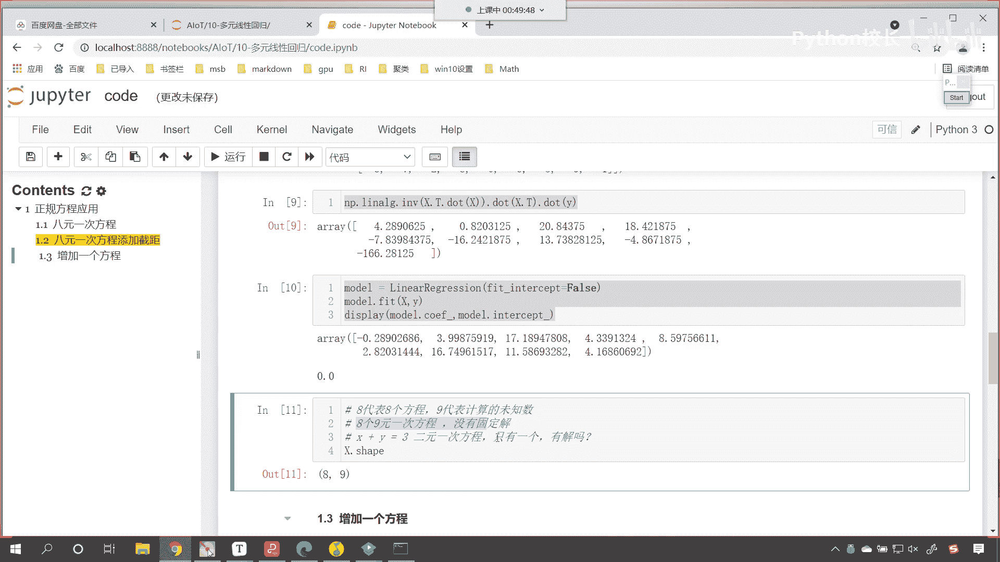

我给你，你也解不出来好，那么这就是原因所在，然后我们就想办法去解决这个问题，你不是八个方程吗，那咱们就增加一个方程，我们原来的标准答案是不是还是w呀，对不对，咱们当然希望增加了这个方程之后是吧。

我们原来的不变嘛，对不对，所以说咱们就把w找到啊，给w赋值，这个就相当于是看这个，就相当于是什么叫标准答案好，那么有了这个标准答案之后呢，咱们怎么样创建第九个方程嗯，这儿呢就是第九个方程。

看这个很重要啊，咱们起名就叫x9 了，系数随意，看到了吗，这就是我们创建的第九个方程，你看你有有第九个方程，又有方程的系数，那他俩是不是乘一下就好了，看到了他俩乘一下，乘完之后，咱们让他加上12。

那这个y是不是就得怎么样，咱们是不是就得让他增加一个呀，对不对，那y增加了对应的x是不是也得增加呀，所以说咱们将第九个方程，最后一个系数把它变成一。

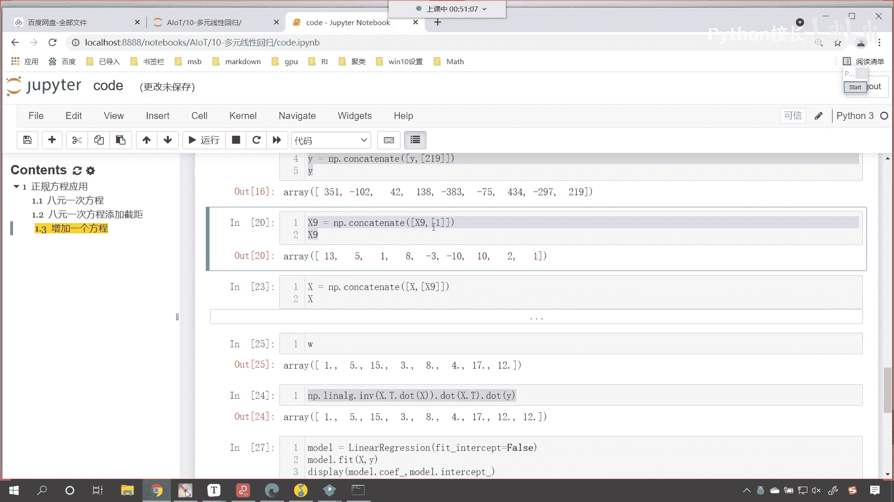

然后的话让咱们的x发生变化，看到了吧，这个时候x它就是九行九列，九个方程刚好够解。

那我们在进行计算的时候，你看这个时候求解出来的答案，是不是又成了标准答案了，对不对，然后我们使用线性回归求解出来的答案，是不是也有标准答案了。

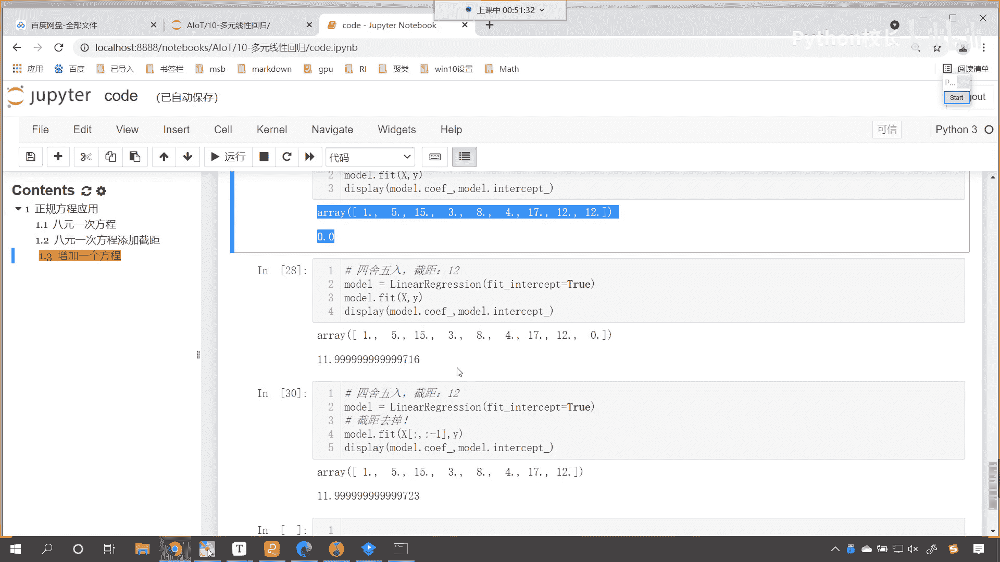

你看这个时候咱们就怎么样呀，你看我们使用feat intercept，无论我们给true还是给false，它都能解出来，看到了吧，无论给true还是给false都能解出来是吧，这就是方程强大之处。

只不过如果咱们feat intercept等于true，咱们求解出来的结局是12，那我们最后一个系数就是零了，看到了吧，因为为什么它变成零了，因为我们不是求了一个截距嘛，对不对。

你既然最后一个变成截距了，那你想最后一个系数是不是就消失了，本来我们给的方程是不是就是九。

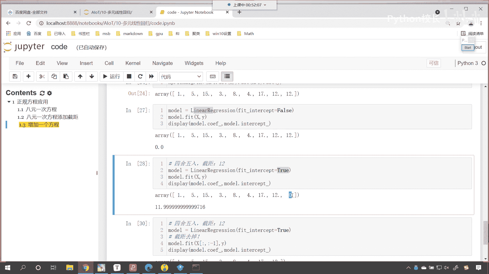

是不是就是八元一次方程呀，对不对，我们给的这个就是八元一次方程，对不对。

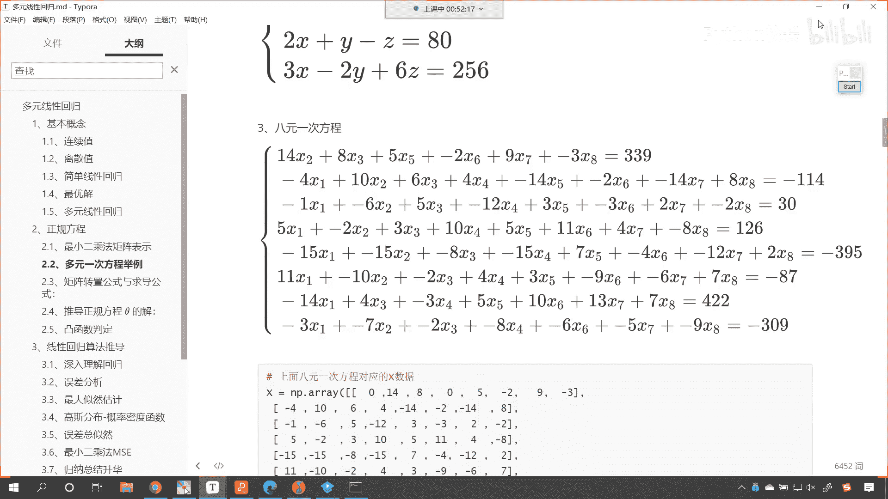

所以说呢这个无论我们给什么都可以，最后呢咱们又进了一步，我们说我们依然把它设置成true对吧，然后呢我们进行切片是吧，咱们把截距去掉，看到了吧，截距去掉，这个时候你看我们算出来的。

是不是就是八个方程的这个系数呀，然后还带了一个截距，11。999，看到这个数字，你自动把它变成12就可以了啊，啊明白吗啊好，那这个时候你看我我只要调用run是吧，那么它就会你一旦调用run的是吧。

它就发生了啊这个保留位数的变化啊，这就是咱们嗯这个八元一次方程唉，对它的理解，如果你理解到这，那么你这个正规方程，还有咱们的linear regression，你就搞清楚，弄明白了。

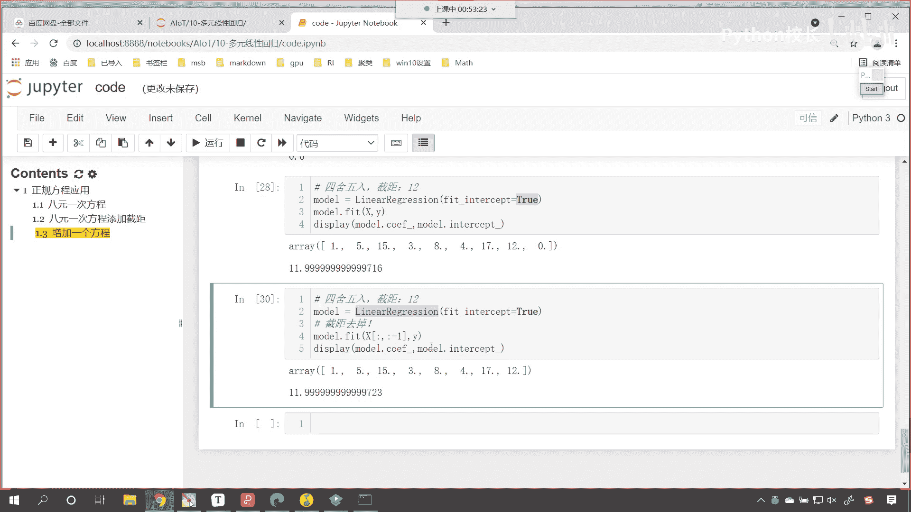