# P60：3-模型评估 - 程序大本营 - BV1KL411z7WA

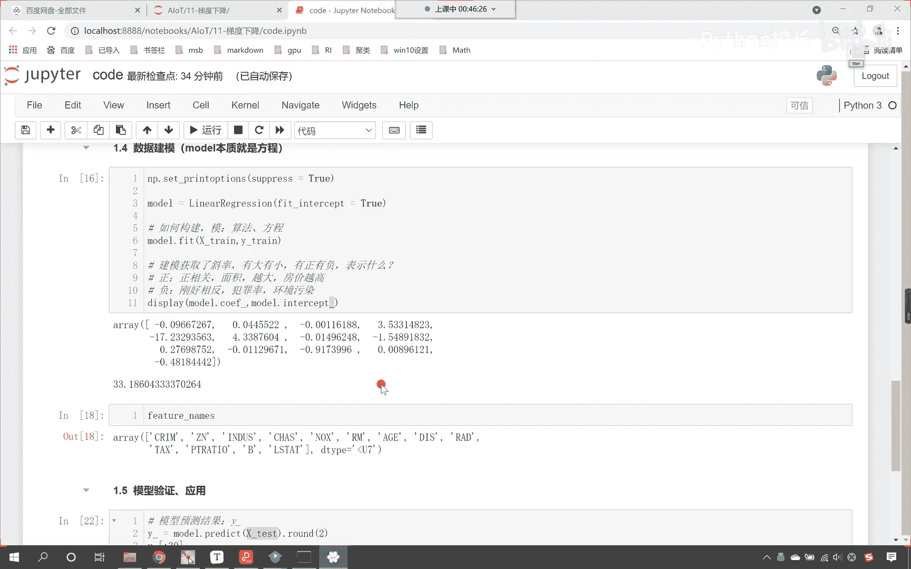

好咱们呢再看最后一个，咱们再看最后一个点儿啊，咱们再来一个四级标题好，那这个模型出来了，咱们刚才用肉眼看了一下，对不对，你看我们说14。5，14。15和这个19差不多是吧，我们说20。54和这个24。

1差不多，那我们这样去比较是吧，这个他呢就不太符合规范，因为你想，你看这个20。54和这个24。1，他们俩之间是不是还相差3。53。6呀，对不对啊，那有没有相应的一个指标，来对它进行这个评估呀，对不对。

就像我们在中国挣100块钱，和在美国挣100块钱，这个是不一样的，对不对呀，是不是啊，你看美元它和人民币是不是有一个兑换，对不对，那所以咱们在进行这个评价的时候，就是说你这个算法是吧。

预测了这个算法进行了建模，你这个到底合适不合适呀，到底好不好呀，是不是哎咱们接下来看一下咱们模型的啊，这叫模型的评估。

是不是啊，好那么如何对这个模型进行评估呢，哎这个时候你就能够看到看咱们model当中呢，它有一个方法叫skr啊，有一个方法叫sc，这个sc是不是就是看一下咱们的得分啊，好那么里边放什么数据呢。

shift tab，你看我是不是放一个x一个y啊，来了放一个x，放一个y，那对于我们的线性回归这个方法，它return是一个是一个什么呀。

叫return the coefficient of determination，数学上的这个r2 。

那这个里边呢告诉了我们相应的这个公式，我们就可以通过相应的公式去计算，你在这儿就能够看到这个是不是这个公式呀，看到了吧，一减去反斜杠frank u和v，那这个u和v代表什么。

你看这个u is the residual sum of square，你看外处减去y predict平方，su and v呢is the total sum of square，外处减去呃。

这个外处密平方是不是嗯好。

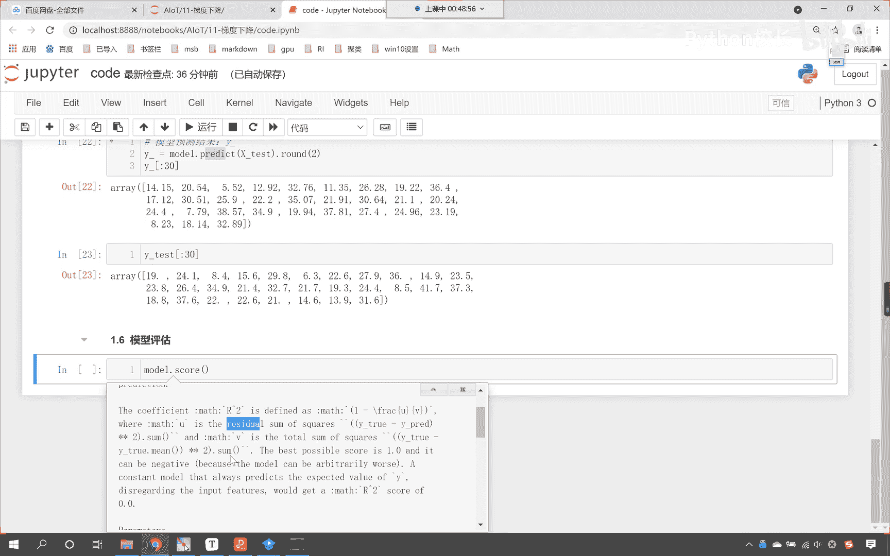

那么咱们呢就测一下啊，大家看啊，那就是x下划线test，然后y下划线test。

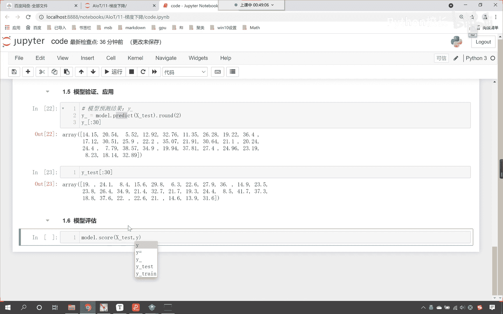

这个时候你看我一执行，咱们得到的这个分数是多少，0。65还不错啊，那在这儿的话，我告诉你这个指标，看这个指标它的这个最大值，看这个指标的最大值是多少，最大值是一，它呢可以小于零。

也就是说如果说你这个算法，如果说我们的这个模型啊，咱们特别不好是吧，模型特别不好，那么我们可以那么咱们的这个评分，看看咱们的平分呢可以是多少啊，咱们的评分可以是负数，就是说你太差了是吧，可以是负数。

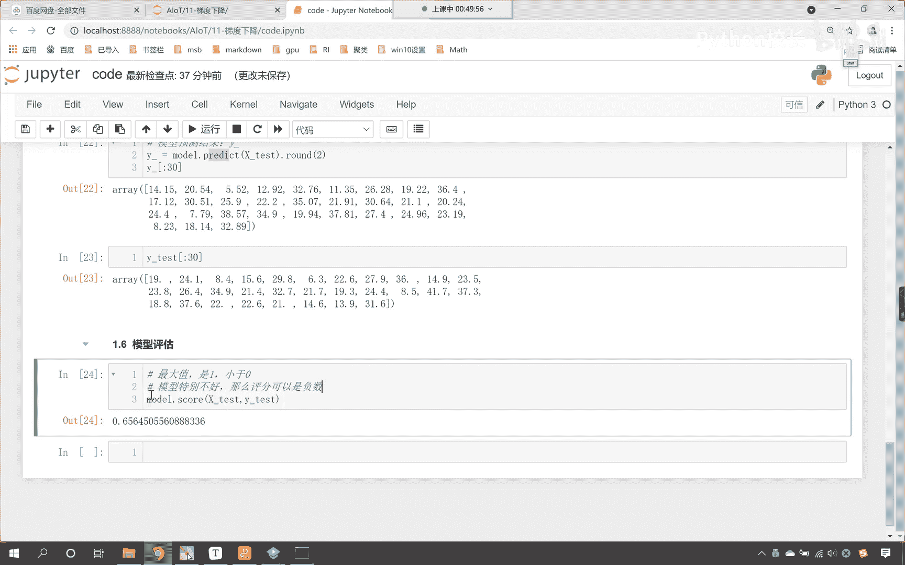

完全不相关呢，它就会小于零好，那么你看这个是0。6564，是不是，那这个是怎么算出来的呀，来各位我给你算一下啊，你看他这是不是有相应的数学公式呀，the coefficient是不是就是max r啊。

我们看一下它是怎么定义的啊，嗯咱们现在就能够发现，你看它是怎么定义的，来咱们根据它的提示，我们在这儿呢来一个markdown，markdown，这呢来一个dollar dollar是吧。

咱们把它写出来啊，叫做r上角标二是吧，它等于这个好，那么它就等于一减去frank好。

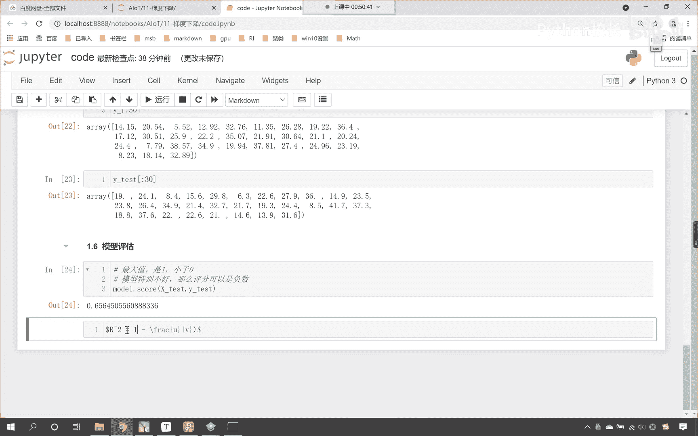

这个时候我给你看一下啊，你看一执行看到了吧，他就是一个嗯这个公式就是一减去u除以v，那么我们的u等于多少呀，是不是只要我们知道u和v，咱们是不是就可以进行相应的计算呀，那u是多少。

shift tab再进入这个里边看u是多少，看到了吧，u is the residual sum of the square，看到了吧，是不是这个值来咱们复制一下。

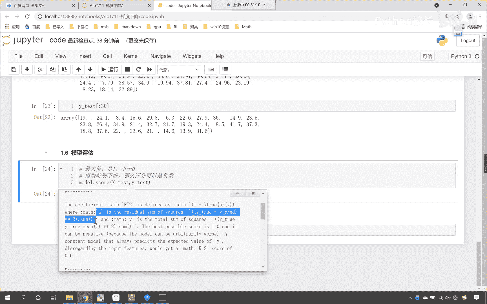

看这是不是u好，那么ctrl v把它放到这儿看。

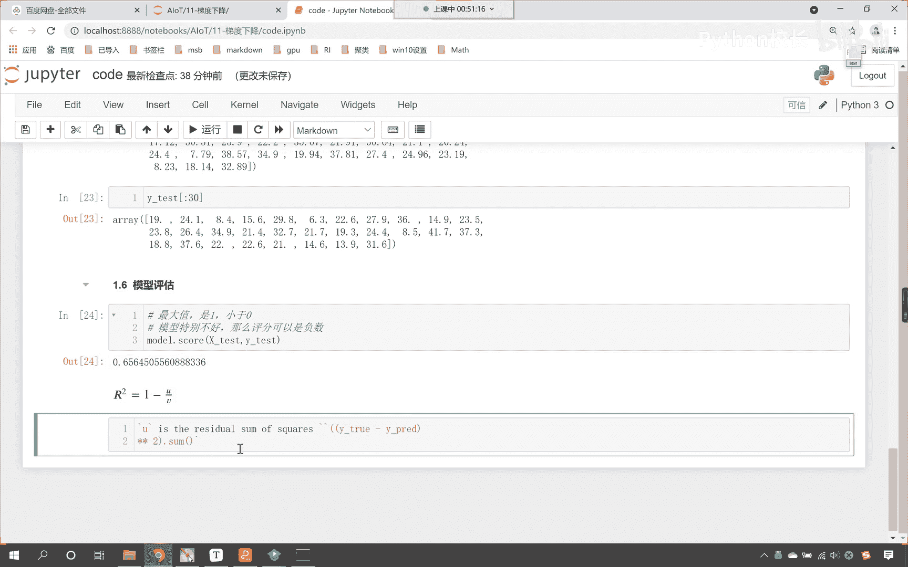

这就是u啊，嗯看见了吧，是不是y处减去y predict的平方，再来一个求和呀，那我们再来看一个v是啥，来shift tab，咱们点开这个加号，有可能各位啊，有可能各位对于我们这个公式还不太清楚。

但是呢我们可以根据它的数学公式的规则。

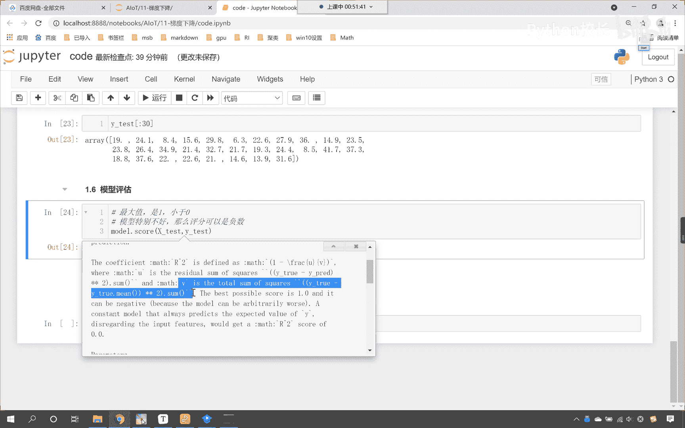

咱们呢是可以把它算出来的啊，也来一个markdown，来来来一个ctrl v是吧。

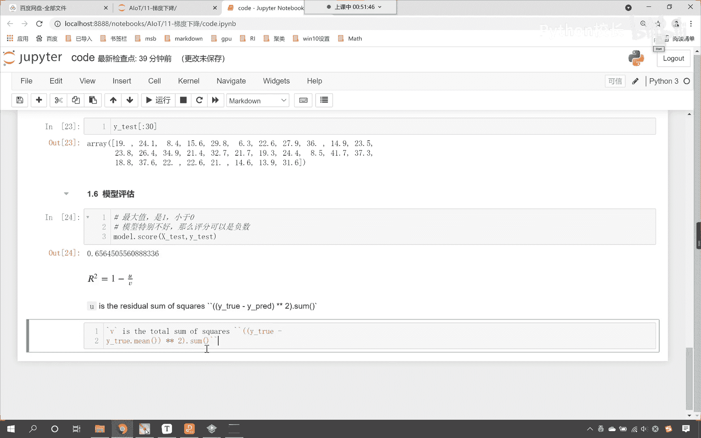

执行一下，你看这个是不是就是v啊，对不对，那我们算一下好不好，那我们先算u吧，那他用的是什么y tru，是不是减y y处是不是减去y predict，好，大家看啊。

咱们在上面计算x test和这个y test，这个数据得分的时候，那你想这个算法model，如果我们调用predict，咱们把x test放进去，我们得到的这个数据是不是叫做歪盖这个y girl。

我们说它叫什么值，是不是就是咱们的预测值，预测值，我们给一个什么叫外predict，看这个y predict它呢就表示预测，那么我们的大家看咱们这个y predict，它呢就表示预测值。

这个y处呢它就表示真实值，那对应我们的这个数据而言，对应咱们这个数据而言，大家想咱们的外出是不是，就对应着咱们的y test呀，这个是不是，就是咱们保留的那20%的房价呀，对不对。

所以说所以说大家要注意啊，咱们的外出就对应y test，而我们的外predict，而大家看y predict，它就对应着咱们的算法计算出来的结果，然后它就对应着它就对应着这个结果。

我们把这个关系理清了之后，咱们就可以根据公式进行相应的计算了，来咱们就算一算好，那这个时候这一步，你看我就得到了这个y predict好，那咱们的y处呢我们也定义一下。

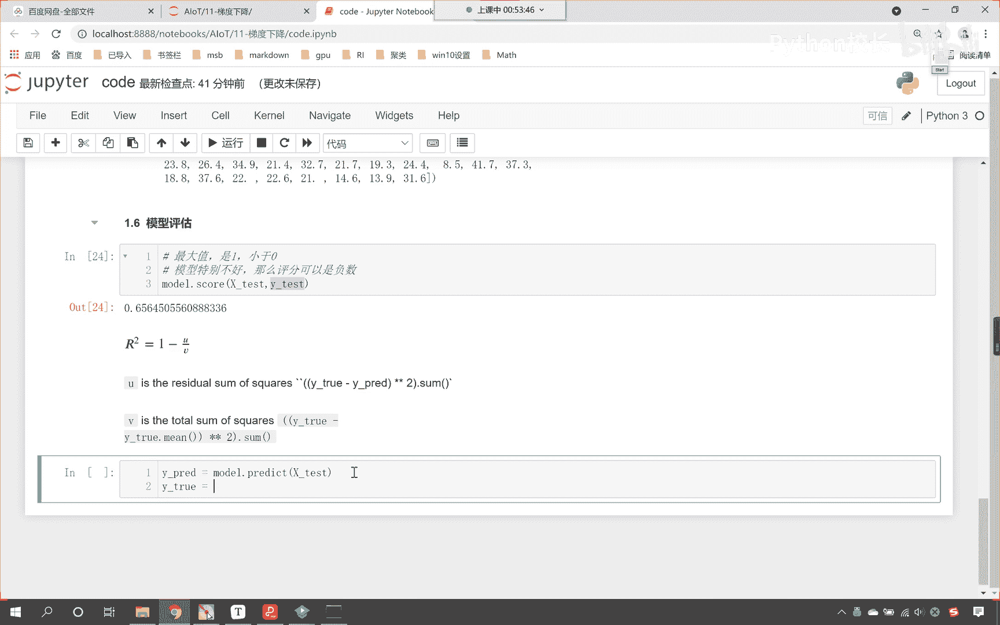

其实就是y test，哎这个时候你看我一直行，这两个数据有了根据公式算还不简单吗，小括号再来一个小括号，咱们外出看外处放进去减去y下划线，y下划线predict，是不是啊，然后怎么样。

星号星号平方是不是啊，这是他的幂运算，最后怎么样，是不是求一个sum，求完这个sum这个数据是多少，哎就是mu是不是我们看一下mu是多少啊。

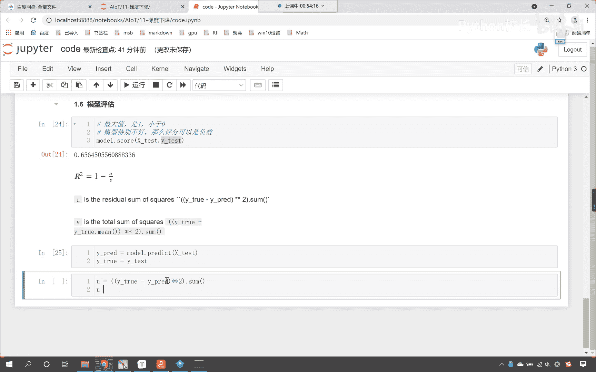

执行一下这个代码，看到了吧，算出来这个结果是这么大的一个值，对不对，好，那我们接下来再计算一下v好不好，咱们这个v等于多少呀，v等于小括号，再来一个小括号，这个里边是不是y下划线处呀，然后减去谁呀。

是不是y下划线处，他是不是求了一个mean，对不对，求了一个平均值，然后再怎么样，是不是星号，星号的平方，最后怎么样，是不是求了一个sum，我们查看一下。

咱们的v是多少，你看我一执行这个是不是7000多，好，来根据上面这个公式。

r方等于一减去u除以v是不是好，那么我们就操作一下吧，一减去u除以v执行，各位小伙伴擦亮眼睛看一看。

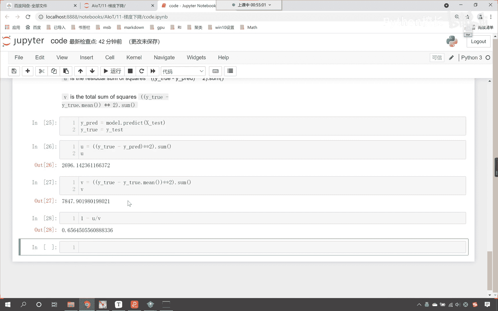

各位小伙伴擦亮眼睛看一看，你看我们算出来这个结果和上面这个使用算法，算出来这个结果一样不一样。

看到了吧，上面这个结果算出来多少，是不是0。65645呀，看这个计算出来的结果是多少，0。65645是不是完全一样呀。

所以说那这个呢证明没算错。

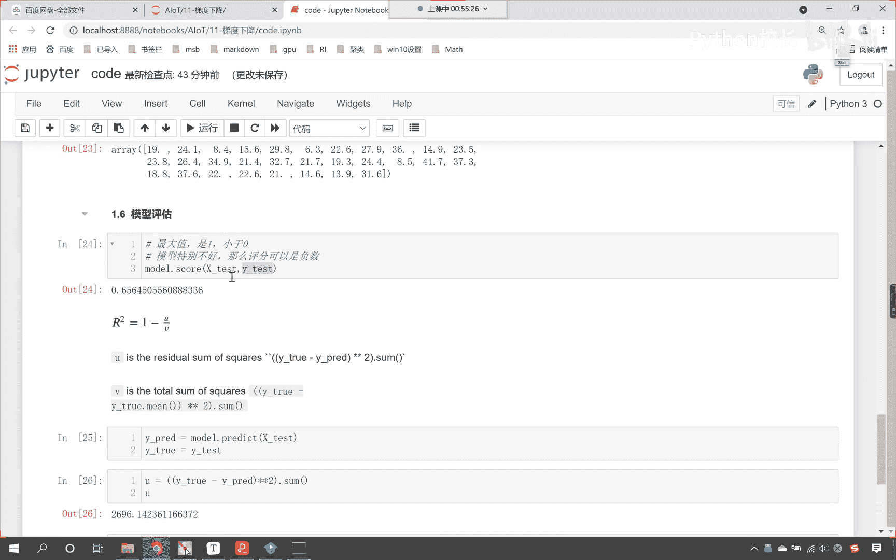

是不是哎，完全没完全没算错啊。

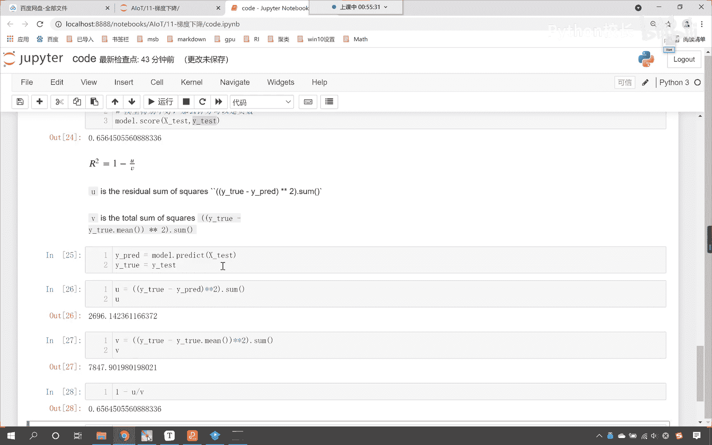

这个呢是它的一个评价指标啊，这个是它的一个评价指标，它的分数越高越接近于零，说明我们的线性回归的模型就越好啊，那这个值这个指标啊，这个指标它越接近你越接近于一说明，看说明呢这个算法就越优秀，知道吧。

越接近于咱们的一说明呢，这个算法就越优秀好。

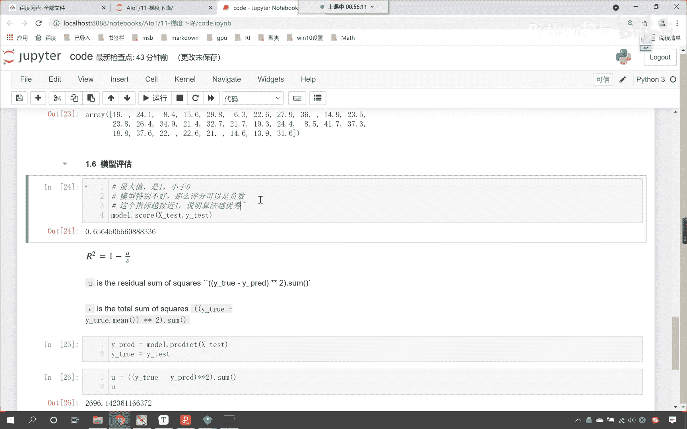

那么咱们呢在上面插入一行，说明咱们找到的这个规律呢就越符合，那它就可以放之四海而皆准是吧，你就大胆的去应用就可以了，然后这个时候你看我再调用一个叫model。sc来，咱们来一个小括号，大家看啊。

现在我把什么放进去了，就是x train，然后呢y下划线train放进去，你看这回我要判断一下谁的得分呢。

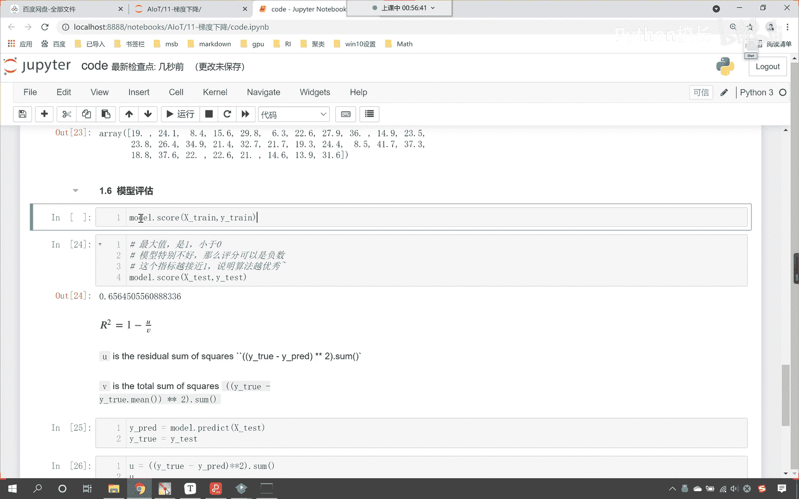

啊此时我是不是要判断一下咱们训练数据，对不对，这训练数据是不是就是80%的这个数据，它的评分啊，好那么我们看一下这个评分会怎么样啊。

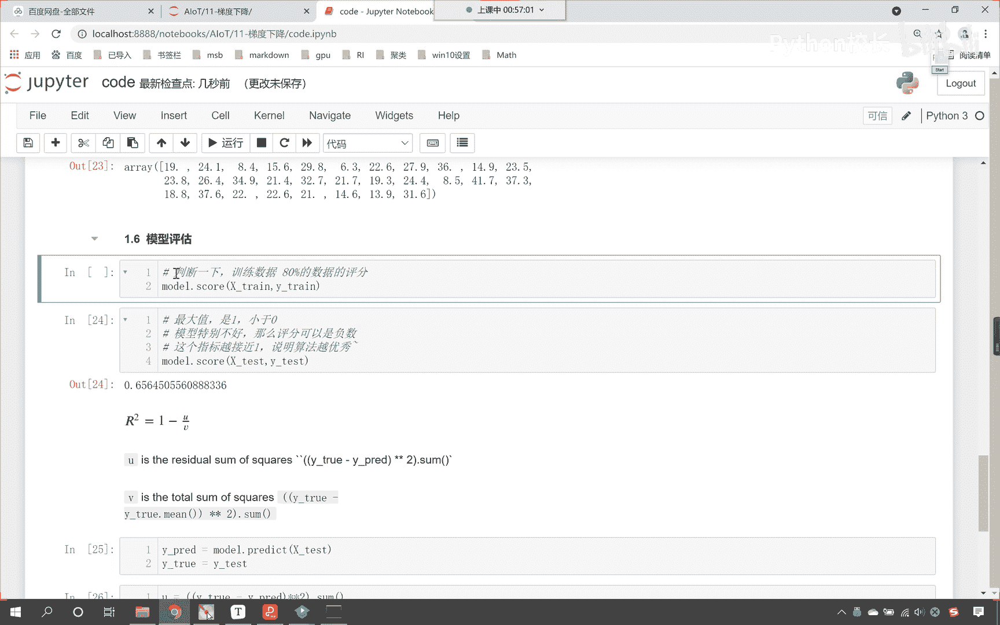

你看我一直行，大家看看我一执行这个分数是不是要高一些。

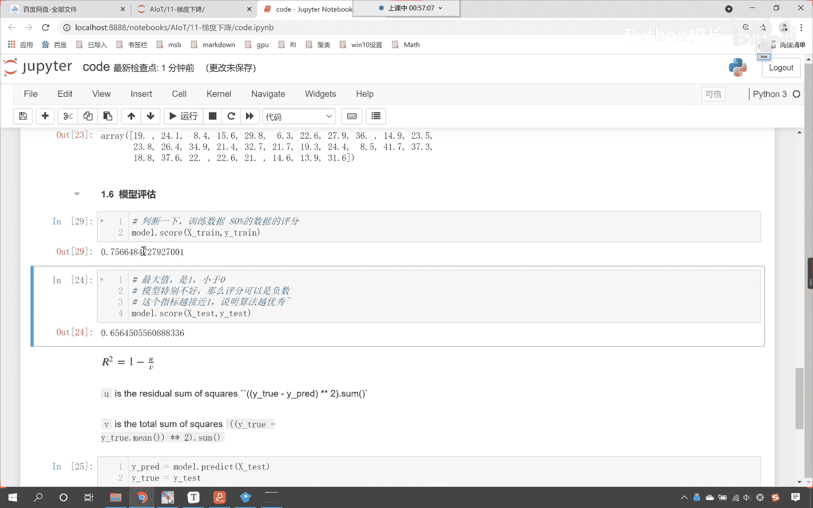

是哪位小伙伴，哪位同学能告诉我，为什么看咱们现在问一个问题，为什么我使用训练数据，咱们的评分会高呢，唉你想一下为什么使用训练数据，这个评分越高呢，评分会高呢，来各位小伙伴来咱们呢在群里边儿是吧。

回复一下好，我们有小伙伴回答了，说这个拟合度高是不是啊，因为我们使用训练数据训练出来的模型唉，回答非常正确，就好比是吧，你在参加考试的时候是吧，平时的考试呢都是重复的题型是吧，都是老师讲过的。

那你想你考试是不是分数就高一些，高考的时候这些题目都没见过，所以说这个分数是不是就会低一些是吧，那些考上清华北大的，他的这个模型训练是吧，哎就是超越了是吧，就是无论有没有见过的题目是吧。

都能考一个很好的分数是吧，咱们普通人呢唉都是这个老师讲过的题目，下一次考试再考，我们可以考的分数高一些，老师没有讲过的题目是吧，老师没有讲过的题目，这个x test就相当于是不是新题目。

因为你想我在训练的时候。

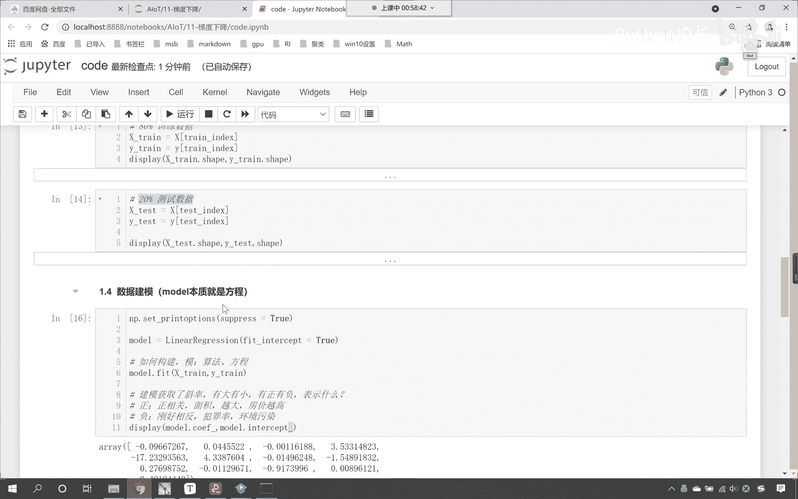

你看咱们这个模型在进行建模训练的时候，我是不是把x乘y乘交给模型了，这个是不是我们我们举一个例子啊，这个就相当于我们考试咱们做过的题。

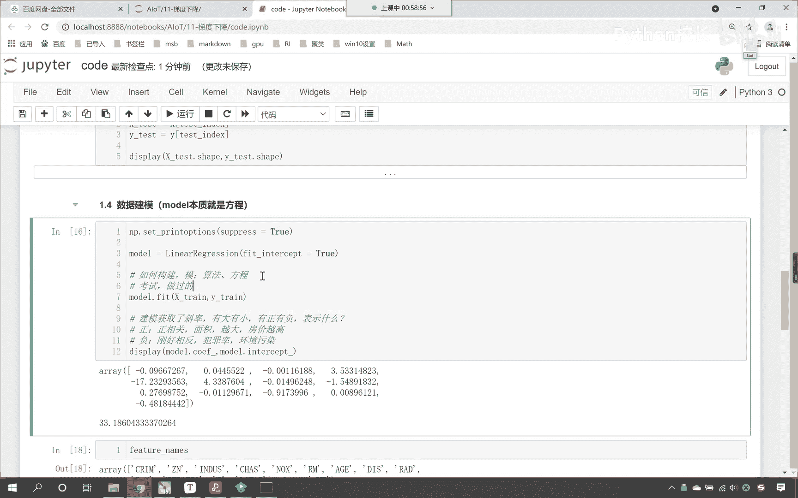

对不对，看到了吗，这就是考试做过的题，做过的题，如果让我们继续做一遍。

继续参加考试，你想你的分数是不是就会高一些是吧，那我们对于做过的题目，咱们如果要再次参加考试，你想那这个分数会怎么样，分数是不是就肯定会高呀，下面这个x test它就相当于是什么呀。

唉这个x test呢它就相当于没见过，是不是就相当于没见过的题目，这个呢属于是新题，那一般情况下大部分人遇见新题是吧，哎都会有一个反应是吧。

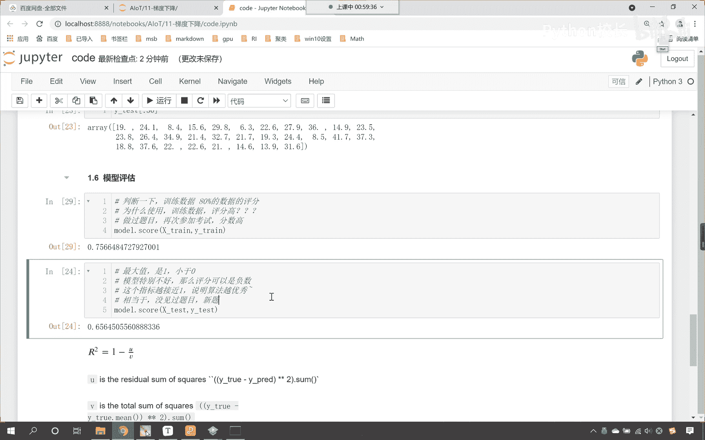

时间过去了，分数呢哎也会低一些，但是呢现在随着机器学习，深度学习的进展，就是他的训练呢唉越来越合适是吧，这个能力呢越来越强，无论见过的题还是没见过的题，我怎么样唉都能得到一个很好的答案。

就像这个5年前是吧，阿尔法狗就已经能够把人类打败了，唉咱们说的是人类啊，而不是李世石，李世石它只是代表人类的最高是最高水平是吧，但经过那次比赛，阿尔法狗已经把人类打败了，也就是说后面的棋手无论是谁是吧。

再想和阿尔法比阿尔法狗比赛，那都已经不行了，好那么这个呢就是咱们的这个模型评估。

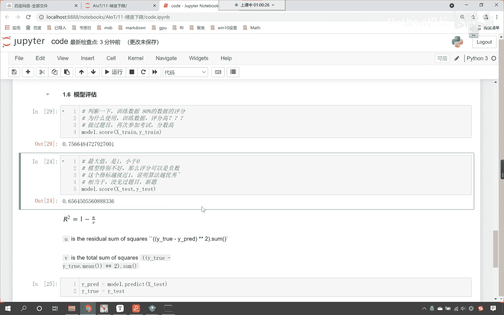

当然我们的模型评估除了这个指标之外。

我们还有一些其他的指标，哎你比如说我们from sk learn，嗯嗯这个里边呢唉咱们找一下啊，嗯嗯叫做metrics，我们从matrix里边，咱们导入一个叫做masquare。

看m1 a n看看咱们可以导入一个m matrix，m e a n下划线sq。

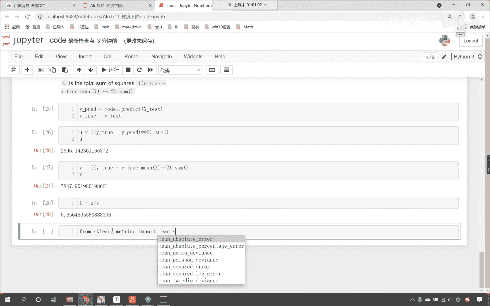

这儿是不是有一个叫main square error啊，看这个mean square error是什么啊。

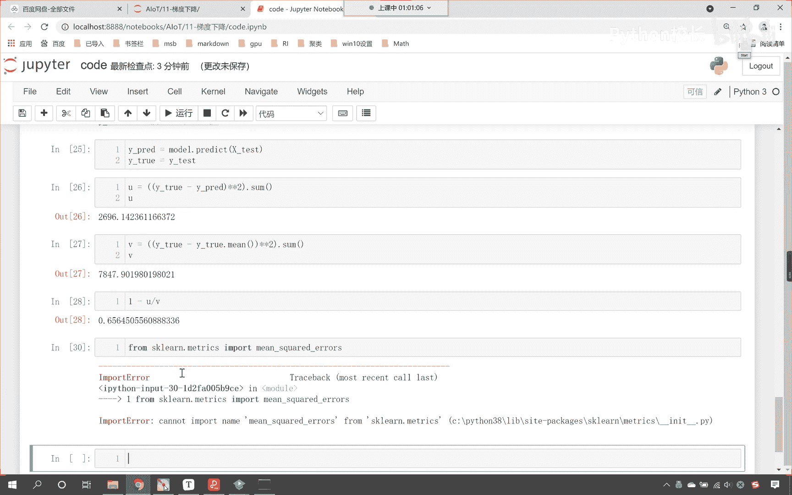

嗯咱们看一下咱们导包的时候，是不是给导错了啊，mean square error，来我来一个tab键啊。

来一个tab键，刚才是不是多了一个s呀，哎这个时候再执行，你看就不会有错了，什么是masquare error呀，这个不就是高斯所说的叫做最小，什么是不是最小二乘法，看到了吧。

哎这个就是高斯所说的最小二乘法。

是不是来你大家看啊，error和咱们上面的分数相比。

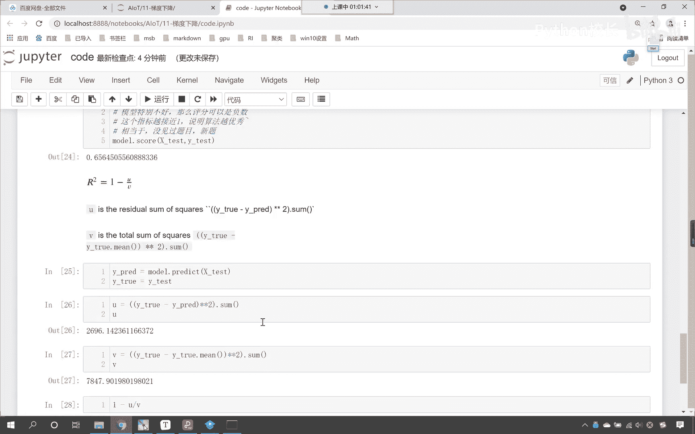

是不是分数越高越好。

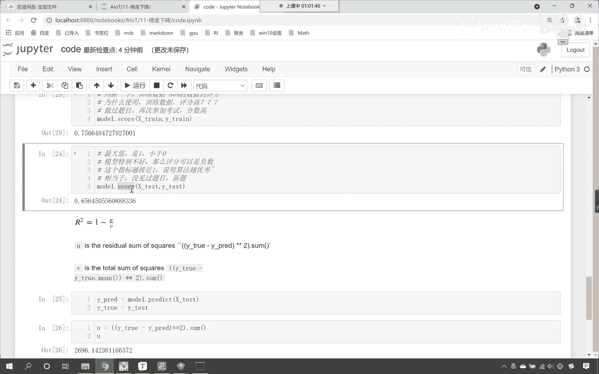

错误是不是越低越好呀，对吧，那咱们就可以使用means square error，我们的来进行对于咱们的模型进行一个评估了，现在你看这个里边需要传入什么样的数据，我们是不是传入一个y true。

是不是传入一个y predict就好了好，那咱们现在呢将y下划线true放进去。

然后呢y下划线predict放进去，这个时候你看我一直行，大家看得到的这个结果是不是26。69呀，对不对，注意啊，这个外出和这个y predict这个，啊这个是咱们测试数据。

也就是我们验证数据它的一个表现，它的一个误差啊，他的一个表现，它的一个误差，那这个数据呢它就对应着那20%。

那我们再来看一下，咱们不是还有80%的测试数据，对不对，你看我们还有80%的这个训练数据，那我们看一下咱们这80%的训练数据，它的表现怎样，我们现场就算一下，看means square error。

那这个外出不就是咱们的外出吗，是不是这个外传是不是就是表示目标值，是不是就表示真实答案，那这个y predict呢，咱们可以直接使用model来进行一个predict，我们只要将它的数据放进去。

那么他预测出来的，你想是不是就是预测值呀，对不对，这个时候你看我一执行，现在在执行之前问各位小伙伴一个问题。

上面算出来的是26。69，这个算出来的，你说比他大还是比他小，看我们大家想一下来执行。

哎各位小伙伴大家看比他大还是比他小。

是不是比他小呀。

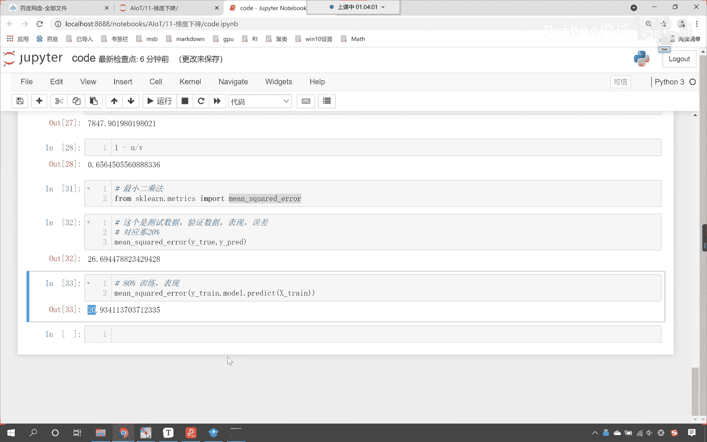

为什么我们上面进行了解释，说拿80%的训练数据，就相当于我们参加考试是吧，就相当于我们做过的题目，再次参加考试，那么分数高是吧。

哎所以说这叫score是吧，就是分数，而我们现在这个指标叫做error error。

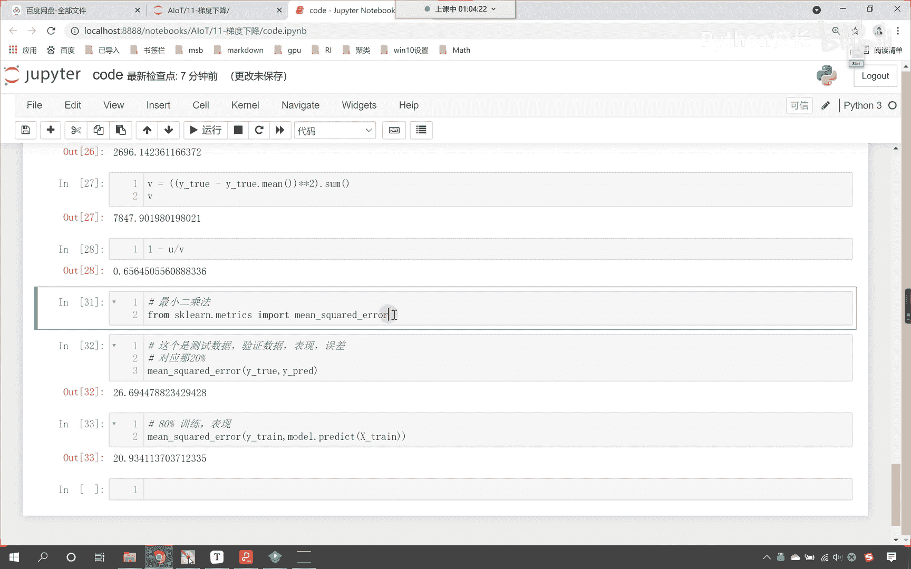

就是误差，误差越小越好，现在你看这80%的训练数据误差，是不是比咱们上面20%的数据表现的，要好呀，对不对，因为我算法我拟合的就是x乘y乘这个数据，那我找规律找的自然要好一点，是不是一般情况下啊。

一般情况下我们模型在训练数据上表现的，它呢比咱们测试数据上验证数据上要好一些，但是我们记呃，但是我们的工作是吧，算法人员的工作就是要想方设法，让这两个表现越来越接近，那这样的话我们这个算法就更加优秀了。

咱们就可以放之四海而皆准，就可以大胆放心的让他去应用，让他去预测，让他去使用。

产生社会价值好。

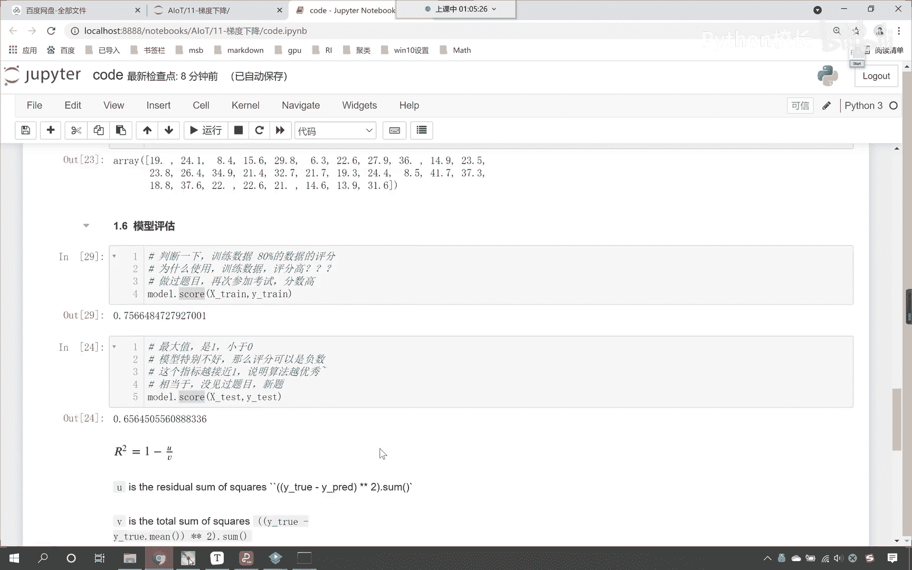