# P61：4-梯度下降的概念介绍 - 程序大本营 - BV1KL411z7WA

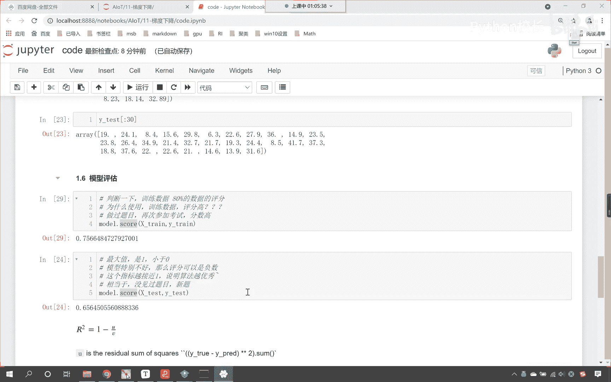

好那么接下来呢我们就看一下梯度下降，那么对于咱们梯度下降当中的内容呢。

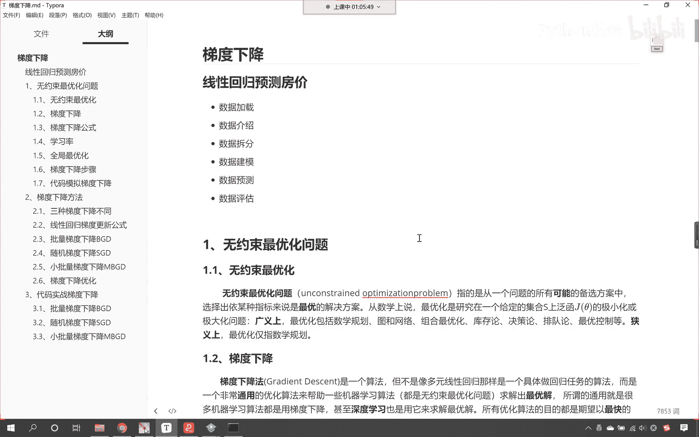

那我们要看一下这个，首先咱们看一下无约束最优化问题。

那这个无约束最后无约束最优化问题，这个当中呢就涉及到一些概念，大家呢就跟着我的思路，咱们一起看一下这个什么是无约束最优化问题，这啥是无约束呢，唉这个无约束呢指的是从一个问题的，所有可能的备选方案当中。

选出以某种指标来说的最优的方案，嗯咱们用大白话说一下，也就是说啊，你你看啊，咱们想要去求一个这个最小值，咱们还是画一个图好不好，好，我们想要求它的最小值，那你看那这个是不是就对应着一个横坐标。

是不是就对应着一个纵坐标呀，对不对，那我们的横坐标是不是就对应着x无约束呢，就是说你x任意不对他进行限制，这个就叫无约束，明白了吧，那有一些是有约束的，比如说我在求这个方程的时候，你的x得需要怎么样呀。

得需要大于零，那一旦有了x大于零，这个就相当于约束，那有约束的问题去求解的时候往往不太好求，但是无约束问题在进行求解的时候是吧，我们是不是可以大胆地使用嗯，求导数令导数为零呀。

因为你不需要考虑x它的范围是不是啊，所以说呢这个就是无约束，咱们呢就用简单的话是吧，告诉大家什么是无约束了，哎也就是说你的x任意啊，你求求解出来多少，那么就是多少好，那么咱们的无约束呢。

你看在很多方面是吧，都有广泛的应用，比如说数学规划图和网络组合最优解是吧，库存论，决策论，排排队论等等。

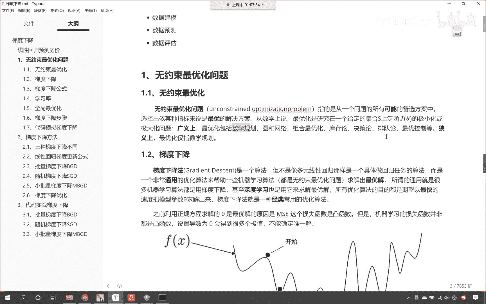

都有广泛的一个应用好，那么对于无约束优化，咱们往往使用什么样的什么样的优化呢。

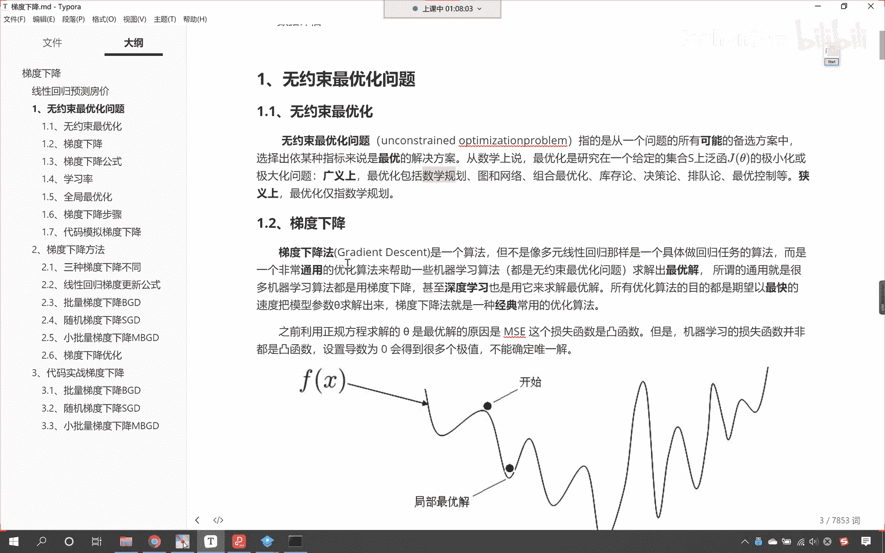

什么样的算法呢，这个里边咱们就要介绍一下叫梯度下降啊，梯度这什么是梯度下降呀，这个梯度下降它所对应的英文叫gradient descent，这个呢是一个算法嗯，它呢不像咱们多元线性回归那样是吧。

咱们前两节课所讲到的多元线性回归这个问题，我们用的是不是正规方程，对不对，咱们都是根据那个正规方程来进行操作的，对不对呀，它有一定的局限性，知道吧，还有一定的局限性，你看这个正规是什么呀。

是不是正正规规，是不是方方正正规规矩矩呀，对不对，但有的时候你要进入社会当中，或者说在工作当中，在算法当中，如果你要不会变通，那往往就是死路一条，对不对啊，所以说呢咱们这个梯度下降呢。

它是一个通用的优化算法呃，那么这个机器学习呢，它可以解除无约束的这个最优解，所谓的通用，就是很多机器学习都是用梯度下降来进行优化，来进行求解，甚至咱们后面学到的深度学习，比如说阿尔法狗。

或者说其他公司开发出来的，都和梯度下降有一定的关系，我们很多算法，都是在梯度下降的基础上进行的优化，那这个算法很简单。

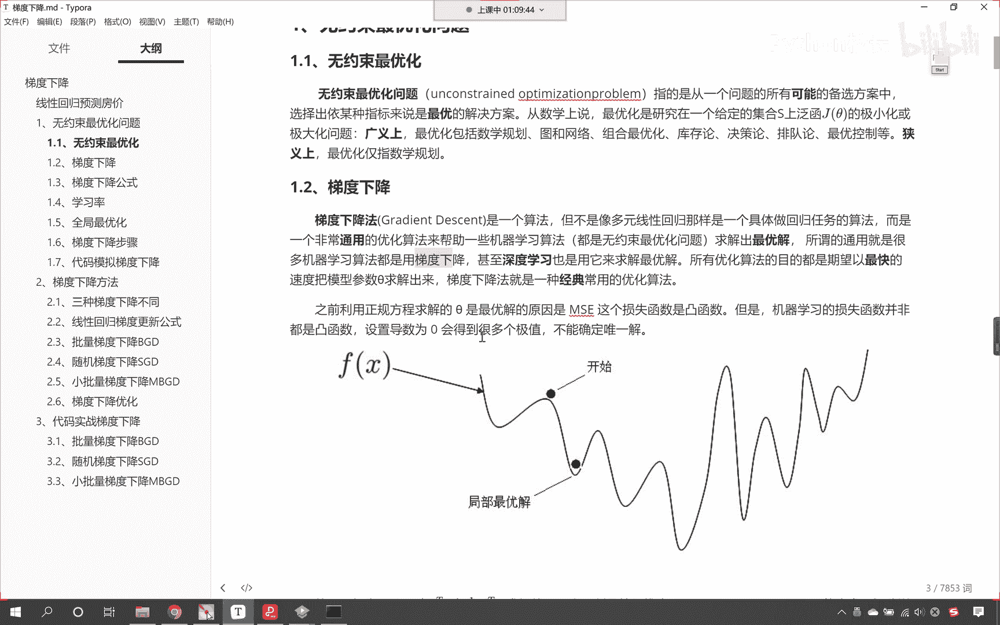

也比较容易理解，那么它到底是什么呢，是不是它到底是什么呢。

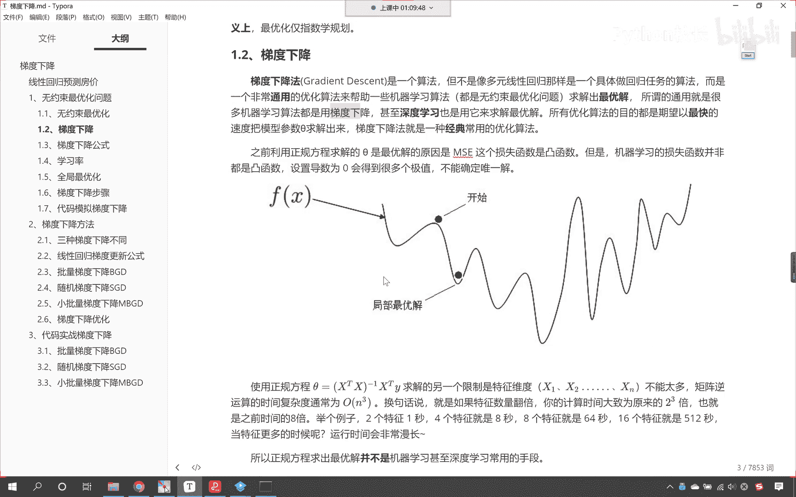

看咱们之前我们是不是讲到了正规方程呀，对不对，咱们正规方程求解c塔，它的最优解的原因是什么呀，为什么它能够求解出来，是不是因为咱们的ms这个损失函数，它是一个凸函数，对不对，它是一个凸函数。

它不像咱们这个方程一样，看到了吧，拐弯拐来拐去的，是不是，如果说我们的方程是这样的，一个这样的一个形状，咱们使用之前的正规方程，我们就没有办法求解了，因为你会发现我们这个地方是不是存在着很多，局部解呀。

看到了吧，存在着很多局部解，而咱们的最优解是不是只有一个，看到了最优解，是不是最下面这个它是不是最小呀，但是你会发现这它的导数是不是等于零，这个地方的导数是不是也等于零呀，对不对呀。

哎你看这个地方的导数也等于零，是不是，所以说所以说什么呢。

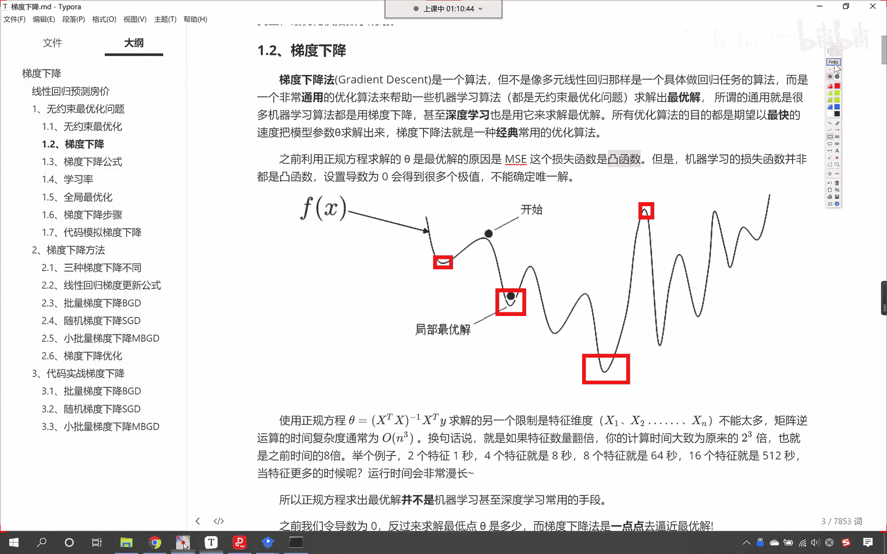

这个正规方程它呢就有一定的局限性，而且呢这个正规方程，当这个数据量特别大的时候，看正规方程，当这个数据量特别大的时候，它的运行时间就会非常的漫长，来，你比如说咱们举一个例子啊，看因为它进行了。

你看是不是进行了矩阵的乘法呀，看到了吗，进行了矩阵，进行了矩阵的乘法是吧，而且还是连成，所以说数据量大，那么它所耗费的时间就是指数级的增长，这个倍数大概是多少啊，二的三次幂，比如说我们举一个例子啊。

两个特征，咱们花时间花了一秒，四个特征，那就是八秒，八个特征，那就是64秒是吧，16个特征，那么就是512秒是吧，你的特征再多下去，那这个翻倍是吧，它的倍数就是嗯这个呈指数级的增长是吧。

哎后面量子计算机那现在还没有商用。

是不是是吧，所以说唉这就是它的一个这就是它的缺陷啊。

唉所以说呢正规方程求解最优解，并不是机器学习甚甚至深度学习常用的手段。

那么它不是常用的手段，之前呢咱们令导数为零，反过来求解最低点嗯，这个最低点的这个系数theta是多少。

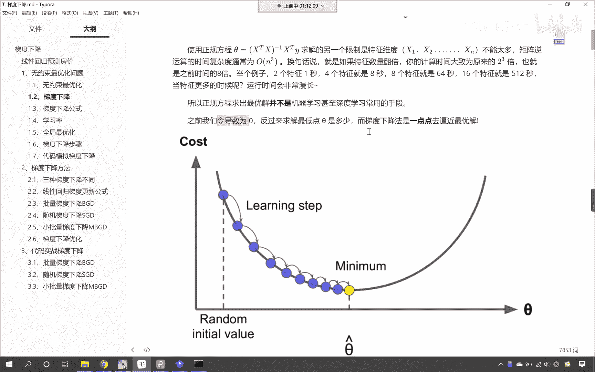

而梯度下降呢是一点点逼近求最优解。

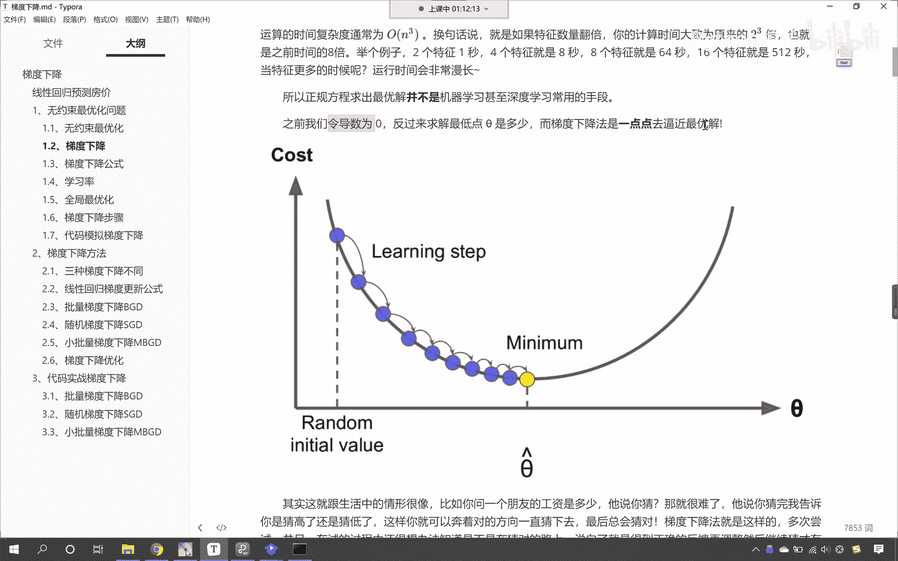

你看啥叫梯度，啥叫下降，唉你来看这个图，看到了吧，看这个图我们知道咱们的最优解，看到了吧，咱们的最优解是不是就是下面这个黄色的点呀，对不对，那我们之前正规方程就是一步求解，对不对。

就是一步求解令导数为零，是不是那梯度下降呢，就是我呢看到了吧，叫random initial value，各位小伙伴，你来翻译一下，是不是就是随机初始化一个值呀，看到了吗，这叫随机初始化啊。

这个意思翻译成大白话，也就是瞎蒙，看到了吧，也就是瞎蒙，也是我随机初始化一个值啊，当然在咱们深度学习当中，咱们说的瞎蒙是吧，我们给的值一般往往都是正态分布的，让它靠近零是吧，因为神经网络特别复杂是吧。

神经网络特别复杂，系数特别多是吧，好那么但是呢它有瞎蒙的成分啊，也就是说给它初始化一个值，随便初始化一个值，这个值你想它是不是有可能不是咱们的最优解，那怎么办，唉咱们就根据一定的算法是吧。

让他一步一步的下降，一步一步的靠近咱们的最优解，所以这个就叫什么，哎你看这个就叫梯度下降，你就像我们下山一样，是不是我们想要从山上，想要从泰山上下来，咱们是不是一步一步向下走呀，对不对。

你看你向下走是不是就有一个坡度，是不是就有一个梯度，看到了吧，我们下山是不是下山是不是就有一个梯度，这个梯度是不是，就相当于咱们真实世界的坡度呀，那么对于函数而言是吧，我们其实机器学习也好。

深度学习也好，本质上来说是不是都是一个函数，是不是都是一个方程是吧，万变不离其宗是吧，其实本质上都是数学，对不对，好，那你想对于函数和方程而言，它是不是有导数，那这个导数是不是就相当于它的坡度呀。

看到了吧，导数是不是就相当于它的坡度，是不是就相当于它的陡峭度，对不对，你看就相当于它陡峭度，那来嗯，你看咱们如果要画图的话，你来告诉我它的最低点，它的坡度是不是就是零呀，你想你越往上。

你的这个坡度是不是越越大呀，你的导数值是不是越大，看到了吧，导数值越大，所以说咱们就可以根据这个梯度，怎么样来进行下降，因为你一开始的时候你会发现是吧，如果说你离咱们的最优解比较远，但你离得远。

那么你的坡度就大，你的导数就大，你每下降一步，下降的就快，知道吗，下降的快知道吗，所以说你下降下降下降是吧，当你非常接近咱们的标准答案的时候，这个时候你就发现是吧，你就走不动了是吧。

走不动我们就有一个退出机制是吧，走不动就是你达到某种精确度，那么我们就允许你停下来，因为咱们说了，机器学习我们要求解的是不是并不是完美答案，因为没有完美是吧，人无完人是吧，算法也一样。

所以说我们追求的往往都不是完美好，那么这段呢大家好好理解一下，希望大家把我刚才讲的听明白了，听明白了是吧，后面的哎咱们就这个好办了。

来我们继续往下看啊，好那么这个咱们刚才所举的例子，就特别像咱们生活当中的情景，比如说你问一个朋友的工资是多少呀，他说让你猜一下，那就很难了，但是他就说了是吧，你在猜的时候，我会告诉你是高了还是低了是吧。

这样的话，你是不是就会奔着对方的那个方向猜下去啊，比如说你猜这个5000，他说低了，比如说你猜3万，他说高了，然后你猜25000，他是不是说正确了，对不对，哎这个就特别像哎咱们这个举例子好。

那么我们接下来继续看啊，咱们刚才说是不是梯度呀，我们刚才说了这个梯度下降，那这个梯度下降是不是对应着一定的公式呀，啊这个梯度下降，咱们在这个地方直接使用梯度下降的，这个公式就可以了啊。

那这个公式对应着什么，各位现在所看到的这个，就是咱们梯度的更新公式，看这就是更新公式，我们不是下降吗，下降咱们用的是什么下降，你看我这个地方用到的就是减法是吧，那下降我得减去一个值。

我减的这个值是不是得合适呀，对不对，好大家看看这个阿尔法代表什么，你看这个阿尔法呢就代表咱们的，就代表咱们的不服哎，就它呢它呢是一个系数，然后这个gradient呢。

这个gradient就代表咱们的导数啊，gradient我们一定对应着一个方程，这个gradient就代表着导数啊，这个gradient就代表着导数方程的导数，那我们嗯咱们这个阿尔法呢。

咱们可以把它叫做不符，你看因为我们这个梯度下降，咱们进行类比的是人下山，你看我们人下山的时候，如果你的步子迈得大，你是不是下山就快呀，但是你的步子也不能迈得太大，步子步子迈的太大，刹不住车。

是不是就有可能车毁人亡呀，是不是就有可能会滚下去呀，对不对，这个就叫不服，知道吗，这个叫不服好，那么你看我们的这个c塔，咱们之前在课堂上讲课的时候，唉我们就说过是吧。

咱们这个c它是不是表示咱们方程的系数呀，看到这个就表示啥，大家看看这个就表示方程的系数啊，这就表示方程的系数好，那么方程的系数除了可以用theta表示之外，咱们还可以使用什么。

我们还可以使用w我们之前讲课就说了，咱们用什么符号表示无所谓，对不对呀，公式都是一样的，对不对是吧，就像中国外国是吧，我们可能都叫月亮是吧，中国叫天上的那个啊，叫月亮，美国是不是就叫做木呀，你到了法国。

到了德国，你发现这个发音这个字母又不一样，但是我们不同的符号表示的都是月球，是不是唉所以咱们虽然符号不同对吧，但是呢咱们表示的不符啊，在机器学习当中是吧，咱们这个不符呢，哎我们也叫做习率是吧。

这个叫学习率，你知道学习率既然提到了一个绿是吧，是不是跟速度快慢有关呀，你想你的学习力越大是不是就越快，梯度下降是不是就越快，对不对，你看啊，哎所以说咱们在这儿呢，哎就给他说一下。

就是说你这个值呀越大它会怎么样，是不是就越快，但是也不能太大太大。

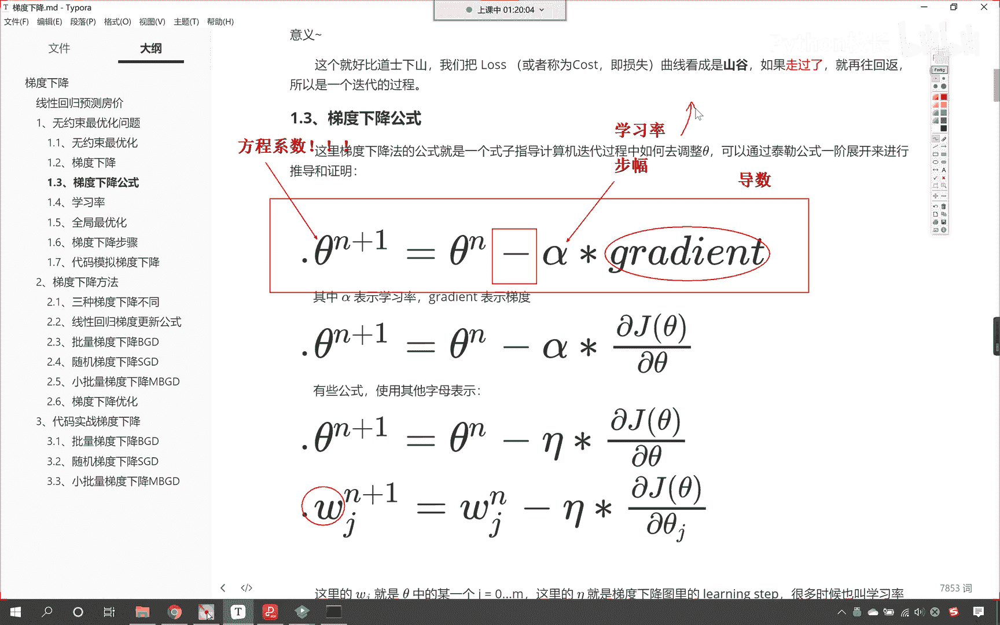

咱们说怎么样唉也不行，来为什么呀，我们往下看啊。

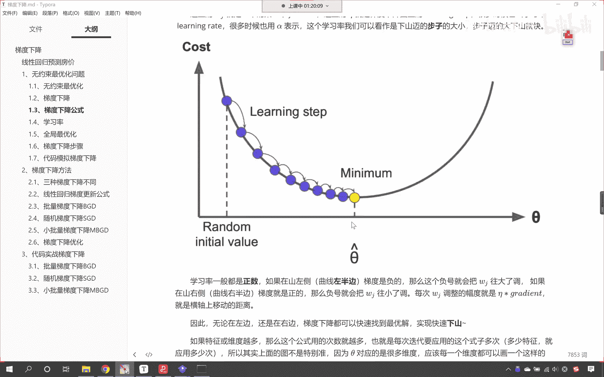

看太大的话也不行啊，知道吧，嗯太大也不行。

嗯所以咱们在这块儿举的例子是吧，嗯在这块儿举的例子，你看嗯就是学习率一般是正数，如果在山的左侧看到了吗，你在这个左侧它是正数，如果说他要在山的右侧，那么它就会是负数，所以说无论我们从哪边进行梯度下降。

咱们最终都可以通过巧妙的正负号，因为导数是吧，你在左边求导数，右边求导数，它的正负是不一样的，它都可以怎么样呀。

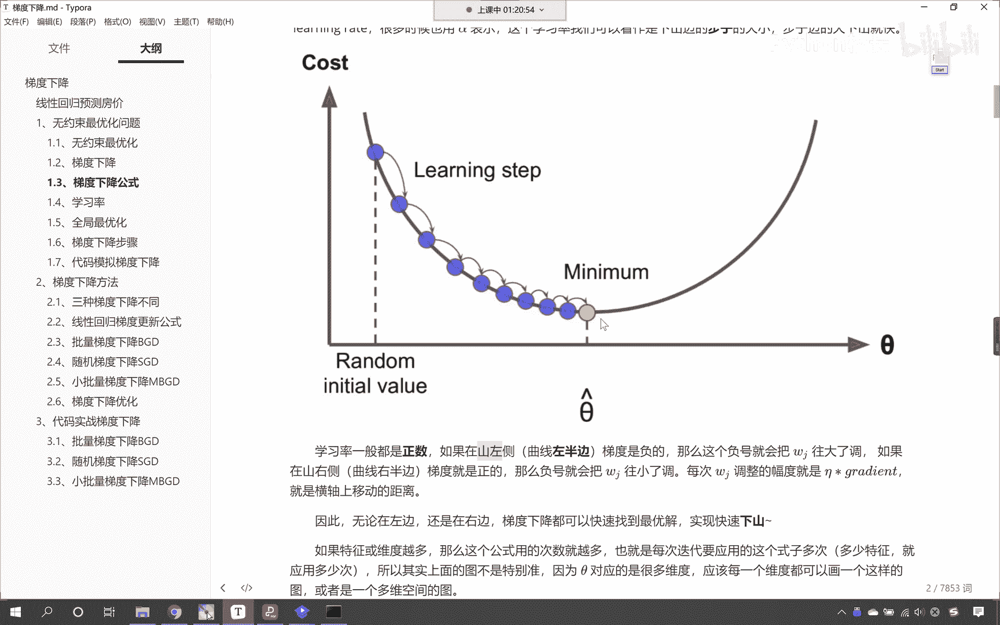

都可以滚到山谷，都可以找到咱们这个最小值。

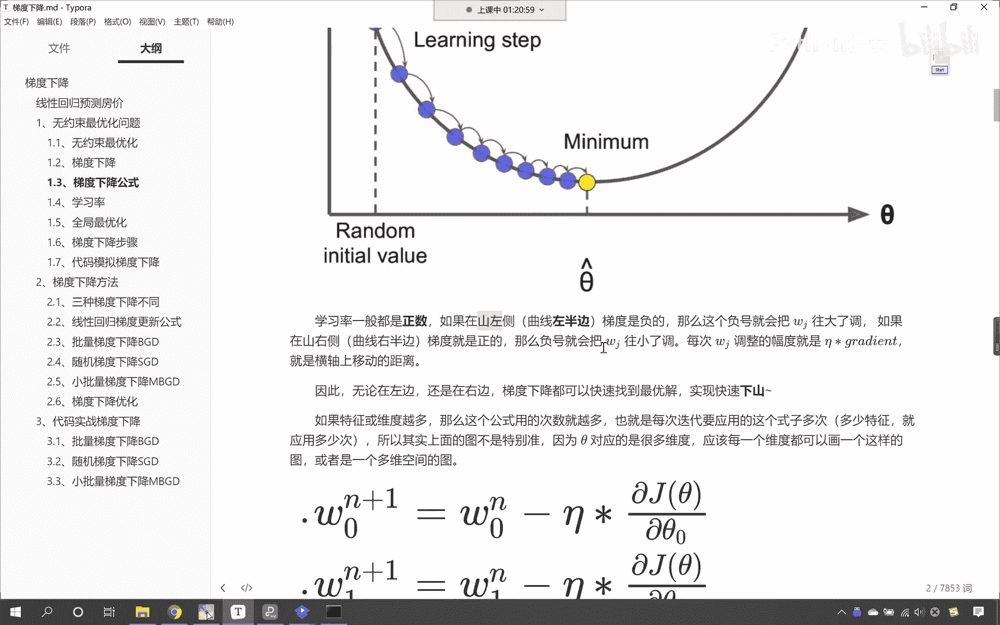

所以说无论在左边还是右边梯度下降，都可以以最快的速度找到最优解，也就是说实现下山我们的学习率过大是吧。

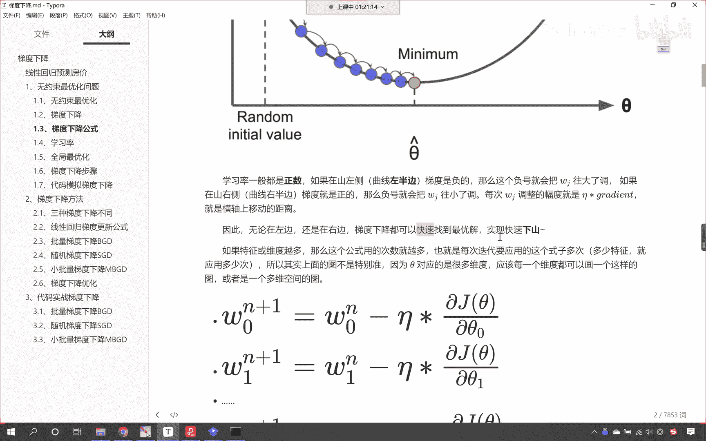

看看咱们的学习率过大，嗯这个时候呢他可能会出一些问题。

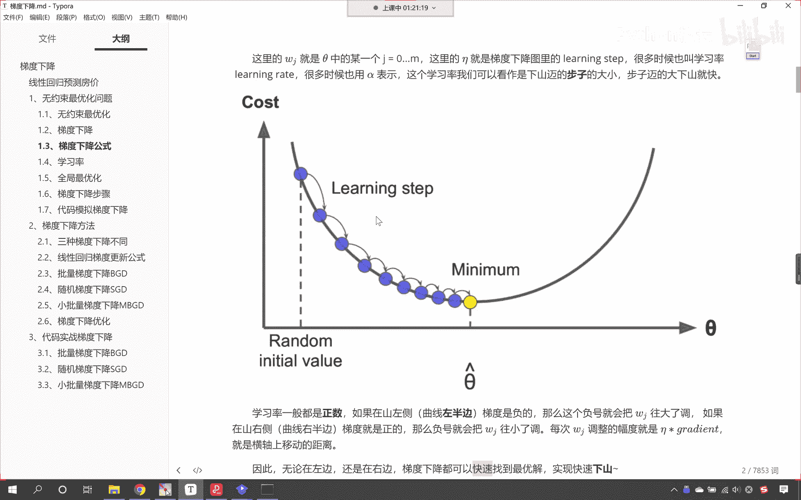

下面咱们有讲到，哎我们往下看啊。

唉这块儿是不是就介绍了一下学习率啊，你现在来看。

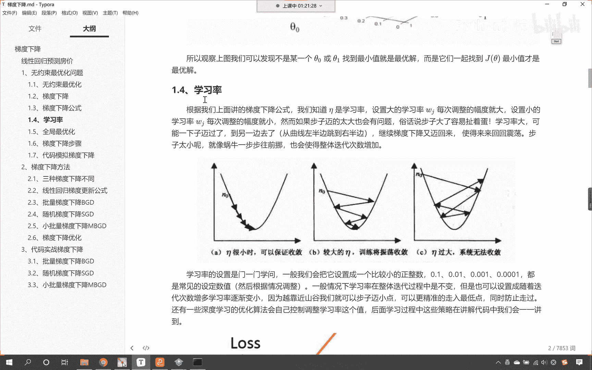

你看这个a呢是一它很小时，咱们可以保证它收敛，也就是啥叫收敛，就是你走着走着是不是就走到这个，所以我解了呀，这个时候刚好合适，那b较大的一它咱们会怎么样呀，训练的时候它会震荡。

就是说你看你这一台比较大是吧，走来走去走来走去，你看这这个会怎么样呀，是不是你步子大，是不是就会迈过来，你看看这个一塔如果过大会怎么样，看到了吧，你唉一下子卖到这儿，是不是又一下子卖到这儿。

这个时候就不能收敛了，这什么叫不能收敛呀，不能收敛就是最后没结果是吧。

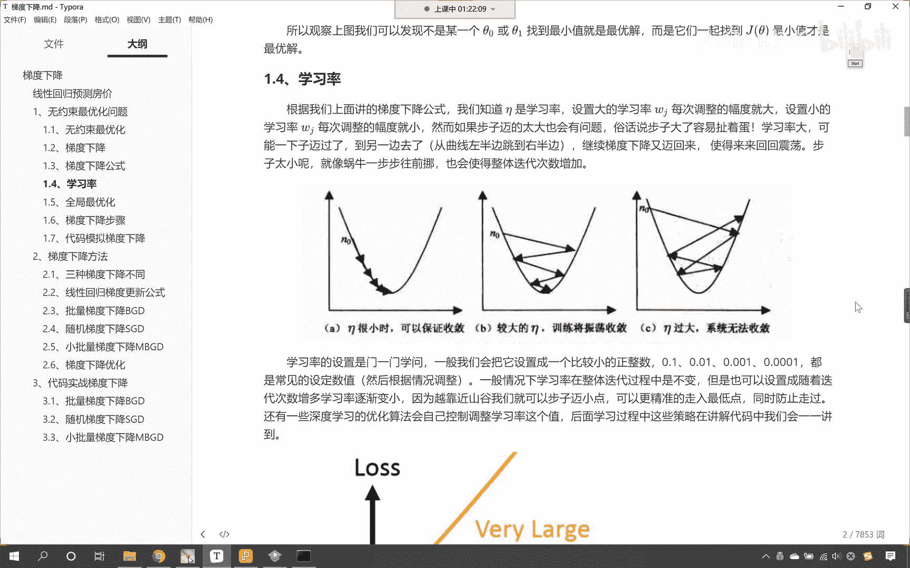

本来我想好好的找到最找到咱们的这个最小值，结果呢唉最后呢就没有找到，没有收敛是吧。

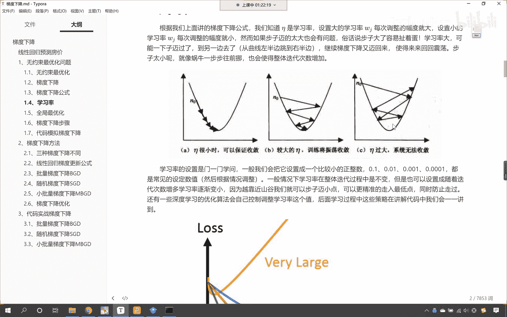