# P62：5-梯度下降步骤 - 程序大本营 - BV1KL411z7WA

好来咱们继续来看啊，就是你看你这个梯度下，就是咱们刚才所说的嗯，这个你像让子弹飞上是吧。

说步子迈的大，是不是容易扯到蛋呀，对不对，在我们算法当中，步子迈得大，咱们的这个不服学习率太大是吧，有可能就学过了，有可能就走火入魔了。

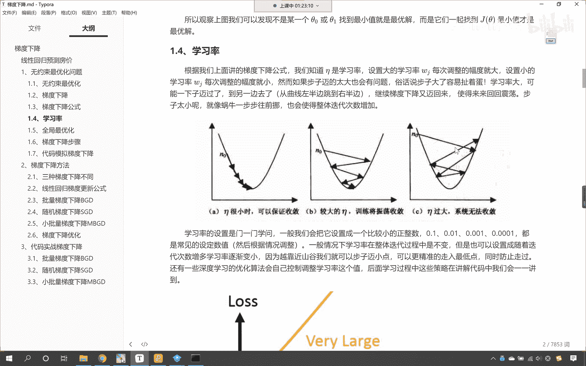

你就永远也回不来了，对不对，你就像咱们好，这个咱们中国现在也有自己的空间站了，它的速度是吧，它的位置是不是都有一个固定的位置，你像我们天上发的卫星是吧，我们发到天上以后，这个卫星的速度不能快不能慢是吧。

它的位置不能高不能低是吧，如果说你这个卫星速度快会怎么样，是不是会脱离地球的控制呀，是不是啊，嗯它那它就会脱离地球的控制，是不是，那所以我们的这个学习率呢你也不能太大是吧。

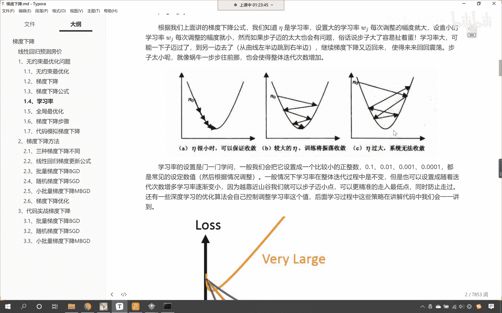

你给一个刚好合适的就行，一般情况下你看咱们给的这个结果是多少，0。10。0010。001是吧，我们给这样的唉嗯那当然这个嗯给多少合适呢，咱们得调整知道吗。

给多少合适呢，我们得需要调整才能知道，你看下面这个图是吧，唉就展示了一个效果，你看黄色的这条线怎么样，very large，是不是特别大特别大，它就会怎么样，看到了吧，飞出去了。

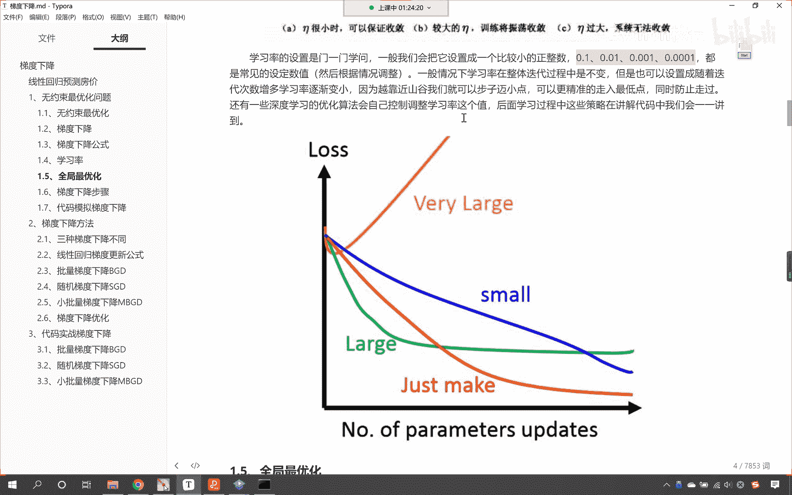

就像咱们刚才所举例那个卫星一样，你速度太大，那你就脱离地球了是吧，我们知道这个第一宇宙速度是不是11。2啊，是吗，第二宇宙速度是不是呃这个16。9哎，具体是多少，我给忘了哈。

好那么大家看唉，这就是它的一个情况，那我们就能够看到呃，大家看啊，这个large small，你看这个small是什么情况，small small是不是就有点小了，你要给的小，是不是他走的慢啊。

梯度下降特别慢，是不是你看这个红色的就是just make是吧，just make就是刚刚好是吧。

不大不小，刚好合适好，那么嗯咱们接下来呢我们再来看一个概念啊。

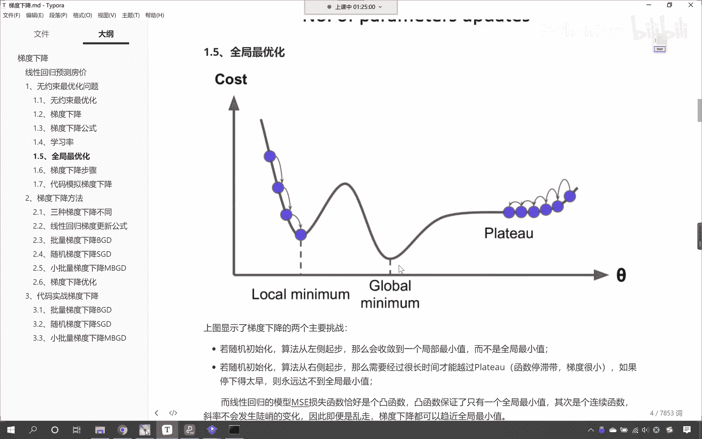

这个概念叫做全局最优。

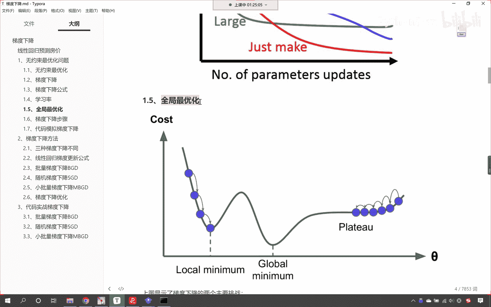

这啥叫全局最优呀，函数我们以后工作当中要接触的问题，它不可能像咱们画的图一样是吧，这么漂亮这么的合适，这么的美观，不可能是这样的，往往是吧，都是曲流拐弯的，是不是，那曲流拐弯这个什么叫全局最优化呀。

大家看啊，对于这个概念而言，那么我们这个点儿看看咱们这个点，它是不是也是一个嗯，它是不是也是一个这个极值点呀是吧，它的导数是不是也是零对吧，你看它的导数也是零，那么这个点儿它不叫全局最嗯。

它不叫全局最优解，而叫做局部最优解，那对于我们这个咱们肉眼可见是吧，它和所有的这个数据进行比较，它是不是最小的呀，所以说它叫全局最优解唉这就是对应了它，那么还有一种情况，我们在进行梯度下降的时候。

也会遇到一定的问题，这个叫什么，你看叫做plenty plus是啥呀，到这儿你看基本是不是就平了呀，但是平它不像这是吧，它就是这个梯度怎么样嗯，特别小，就是你走的特别慢，这就相当于我们平路一样是吧。

平路一样，就是你走了多久是吧，哎你发现你的海拔高度并没有下降啊，但是只要你一直走下去，那么你就发现你能够滑到这个最优解嗯，所以说唉你看他他是这样的一个情况啊，那如果是这种情况，大家想咱们的梯度是吧。

你看在这种情况下，如果我们的学习率是吧，如果要太如果咱们的学习率要太小啊，咱们的学习率如果要太大，嗯你看在在这种情况下是吧，呃这这种这种呃这个时候呢应该就是太小了，看学习力如果要太小。

你想他走的是不是就特别费劲呀，对不对，你你这个时候本来就平是吧，那就耗时太长，有可能呢这个算法，他就会根据你学习次数会怎么样呀，唉就自动就停了是吧，跳出这个循环，这个时候就会出现一个问题啊。

出现什么问题呢，停下来的太早，就是说你不应该这么早的停下来，哎你应该怎么样呢，继续向前走，然后呢才能够找到唉他的一个答案，所以说嗯这是咱们的这个情况啊，就是说如果要是咱们所画图上的这种情况。

那就是有可能会停下来太早。

所以在这个地方呢，咱们就介绍了一下这个全局最优解。

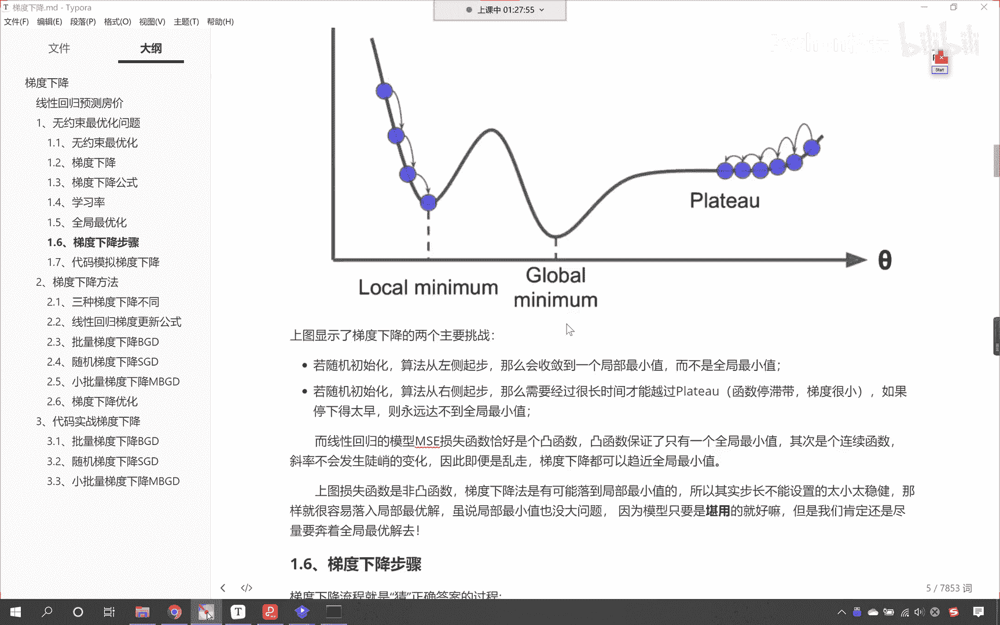

那所以说呢调整咱们的学习率呢。

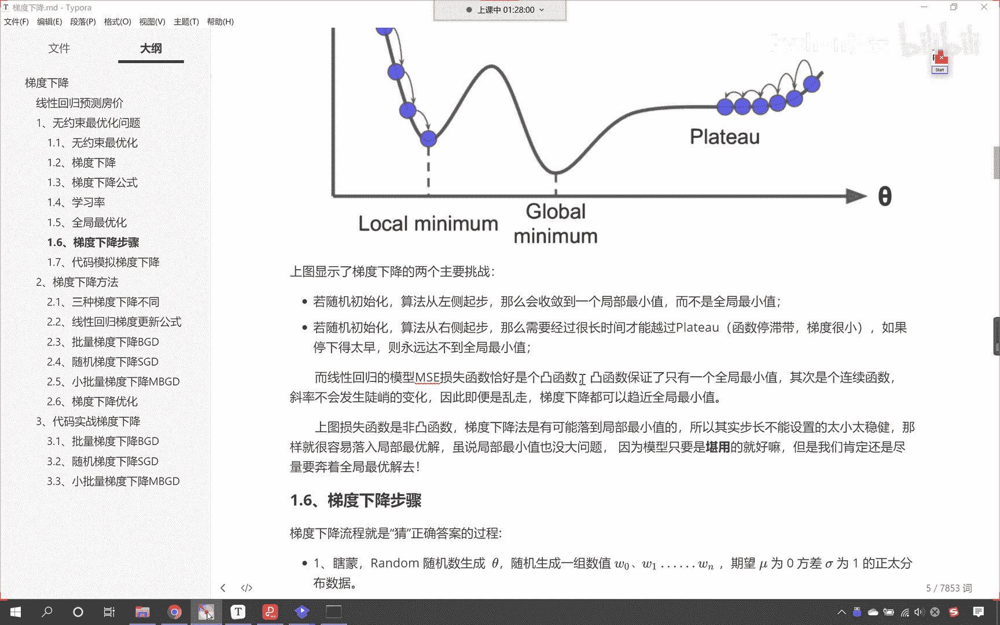

是咱们算法当中的一个重点好。

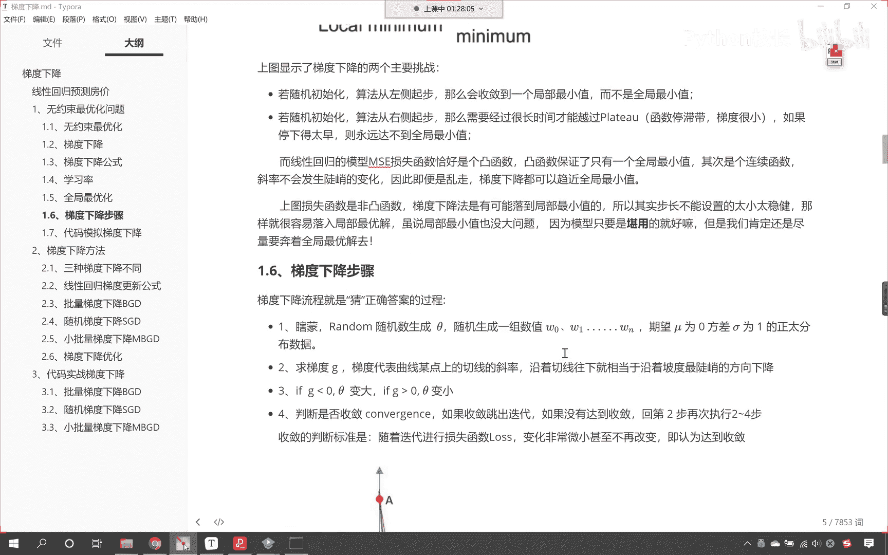

那么咱们接下来呢看一下咱们梯度下降的步骤。

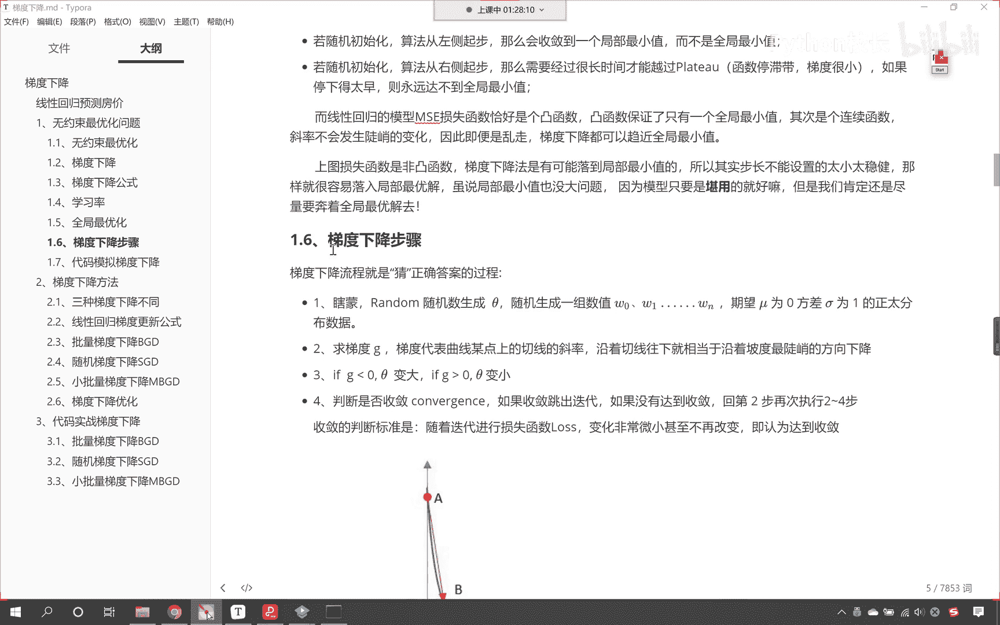

好不好，我们看一下这个梯度下降到底是如何进行的呀。

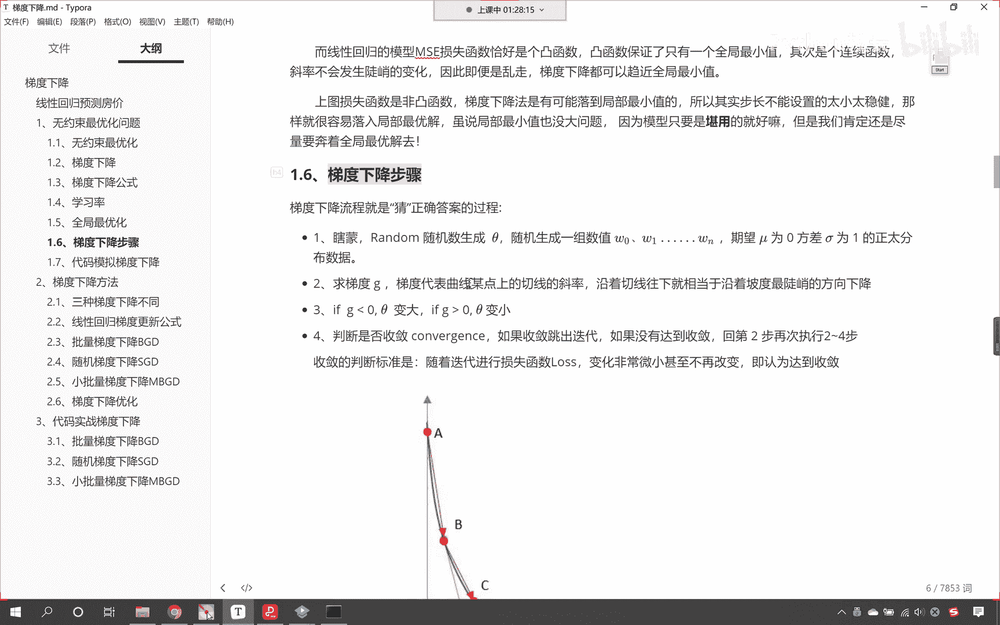

咱们在刚才我们就介绍到了，说一开始的时候，咱们这个系数c它它有瞎蒙的成分看，那么我们在这个地方为了更加严谨，咱把瞎蒙给他带一个引号啊，其实也不完全是瞎蒙，对不对，你也不完全是瞎蒙，比如说你这个方程是吧。

你进行了相应的数据统计，你的系数不可能一下子给个10亿是吧，给个100亿，我们一般情况下会在一定范围内，根据我们经验，在一定范围内去给它生成一些系数好，那么我们随机生成的这个系数就是w0 。

w1 w2 是吧，一般情况下咱们让他的期望是吧，让它的平均值为零，方差哎你看咱们的方差为一的一个正态分布，这是你看我们即使瞎蒙，咱们是不是也要为它生成一个正态分布呀，这个正态分布不就是高斯分布吗。

对不对，好，大家看啊，这第一步瞎蒙，第二步呢咱们求g看到了吗，求j这是什么，就是咱们的梯度，那对于只要有一个方程，咱们去求梯度，是不是很简单，高等数学当中，甚至咱们在初中高中当中就学过导数了。

是不是唉这就是求梯度啊。

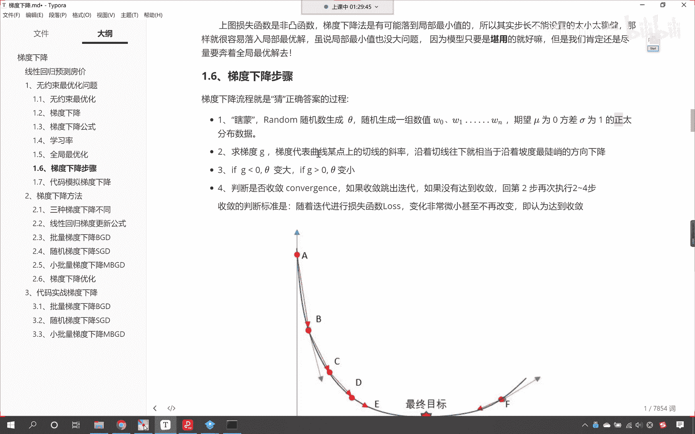

有了这个梯度，咱们呢就可以沿着这个切线往下进行梯度下降，那这个时候我们求解出来的梯度，然后它下降的速度就是最合适的，接下来呢你看我们第三步，if咱们的j小于零，那么c塔变大，如果咱们的j大于零。

那咱们的c塔就变小，第四步，咱们判断是否收敛啊，这个判断收敛是数学当中的知识，判断收敛，怎么判断收敛呀，我们就根据它的精确度，如果精确度达到一定程度了，那么咱们就判断收敛，那就跳出这个循环。

如果没有收敛，那咱们怎么样呢，咱们就继续执行2~4步，那继续执行2~4步，这个里面是不是就涉及到一个循环呀，对不对，你看这个里边就涉及到一个循环，那这个循环就对应着咱们的while循环啊。

就是对应着while true的一个死循环，我们可以写代码写出来这样的while true死循环，然后让它一点一点的向我们的目标值靠近，现在你就能够看到判断是判断咱们收敛的标准。

随着咱们迭代进行这个损失是吧，当它变化微小甚至不再改变的时候，咱们就认为它达到收敛了，也就是说你看我们原来咱们在a点是吧，然后他梯度下降，走着走着走着是吧，走到这个最终目标了，你想它越往下走。

他是不是就走得越来越慢呀，越往下走是不是就走得越来越慢，我们也可以通过这个指标来对它进行判定好。

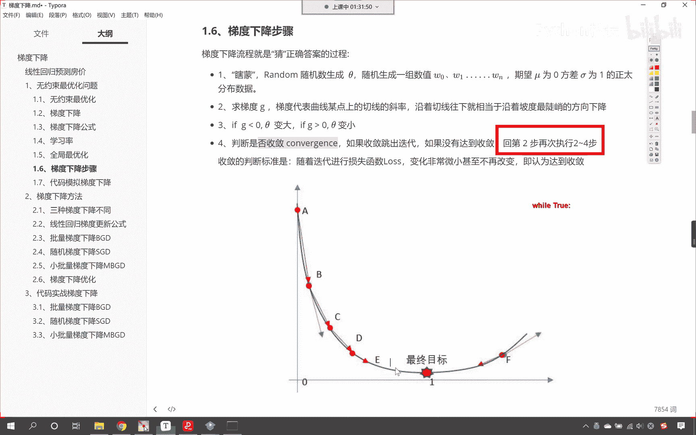

