# P71：5-SGD和MBGD更新公式介绍 - 程序大本营 - BV1KL411z7WA

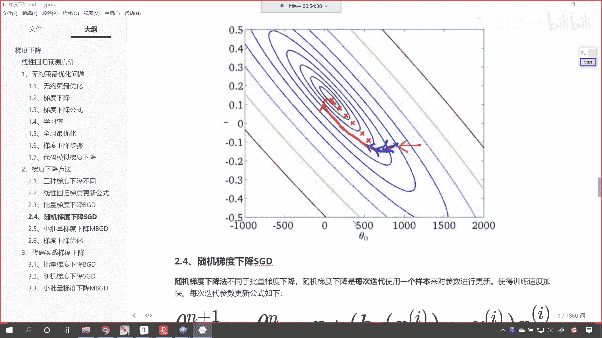

继续往下看，那有了批量了，咱们接下来再看一下随机梯度下降。

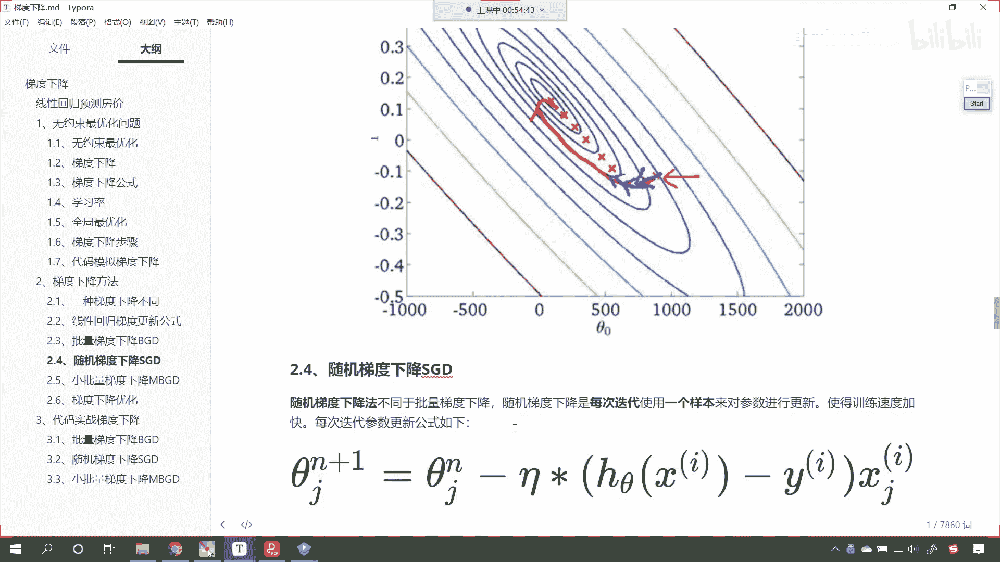

那么这个随机梯度下降，是不是就是每次迭代的时候，使用一个样本来对参数进行更新呀，那每次到底使用哪个样本来对它进行更新呢。

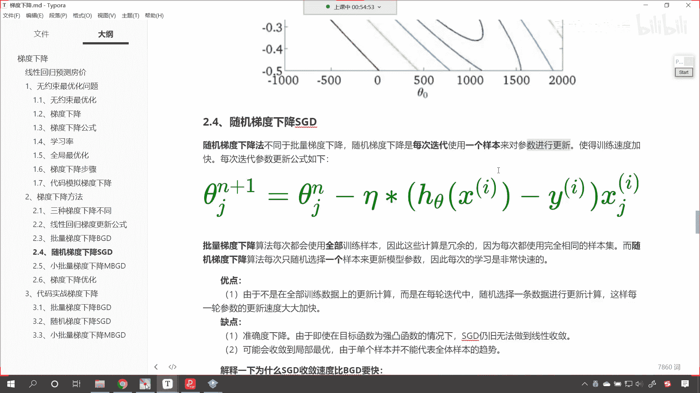

随机选择看咱们随机选，我们说数据当中整体数据是不是一个整体啊，随机选择一个样本是不是属于是抽样呀，那大家想我们样本和整体之间，是不是包含和被包含的关系啊，有的时候呢这个我们公司开会，或者说这个国家开会。

是不是都会选出一些代表呀，是不是，是不是这个向国家反映反映，是不是啊，比如说这个呃，说程序员的工资太低了，是不是啊，我们应该涨薪，是不是至少得三倍五倍的涨，因为程序员加班比较严重，是不是好。

那么大家想我们随机从整体样本当中，随机从整体样本当中选出一个数据，它也能够在一定层面上代表这个整体数据，唉，这就是随机梯度下降这个算法由来的这个根本。

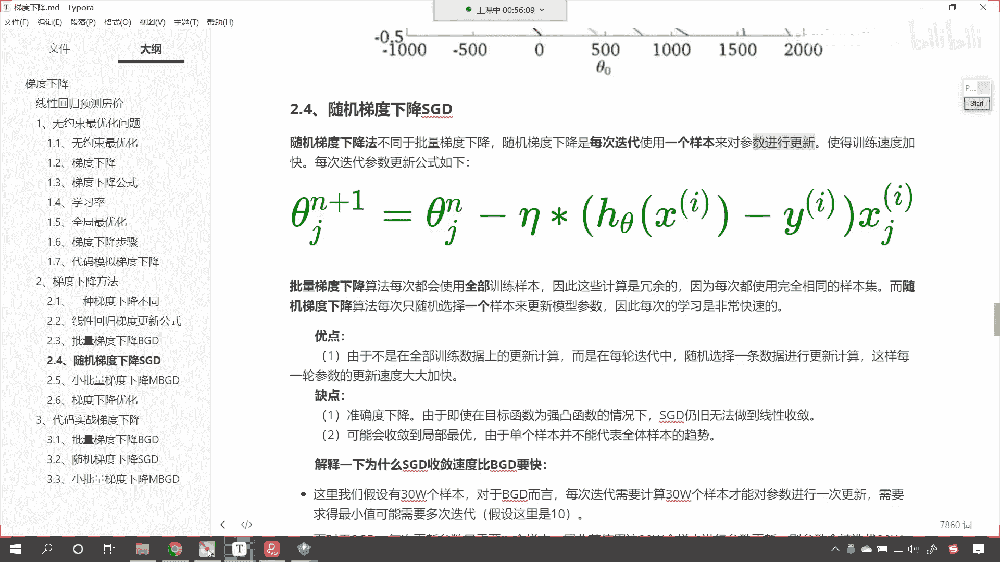

那这个随机t下降算法每次都会使用全部数据，这个批量梯度下降，每次都会使用全部数据训练样本，因此这些计算是冗余的，因为每次使用完全相同的样本集，而随机梯度下降，每次只随机选一个样本来进行更新模型。

因此呢他每次的学习速度非常快。

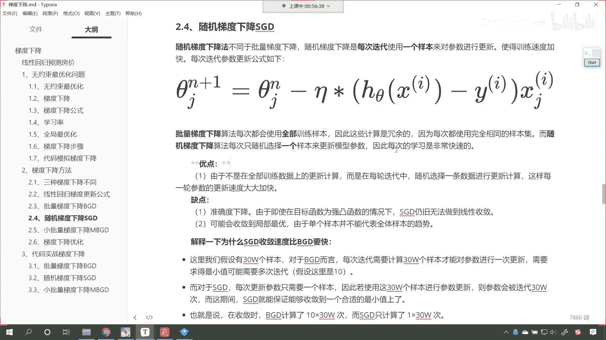

因为数据少，所以说每次的速度快，那它也有优点，优点呢，由于不是在全部训练数据集上的更新计算，因此呢在每轮的迭代当中，随机选择一条数据进行更新，这样每一轮的大家注意啊。

每一轮的这个参数的更新速度就会大大加快，当然也有缺点，咱们的准确度呢会下降，那可能会收敛到局部最优解，由于单个样本并不能代表全体样本的这个趋势，我们说了这个单个样本。

它是不是在一定层面上可以代表全体样本呀，但是呢单个样本并不能代表全体样本的趋势，所以说这个就是整体和部分的一个关系，那咱们的随机梯度下降正是利用这一点。

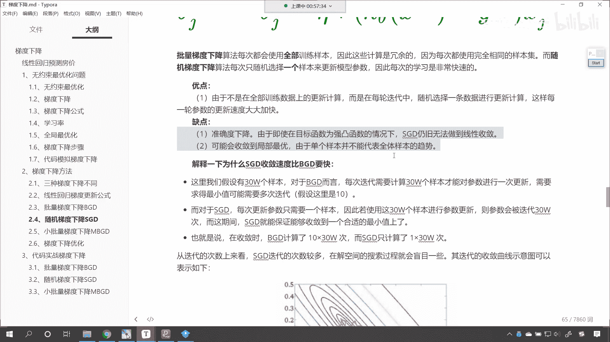

哎那我们进行的一个进行了一个规划，进行了一个学习。

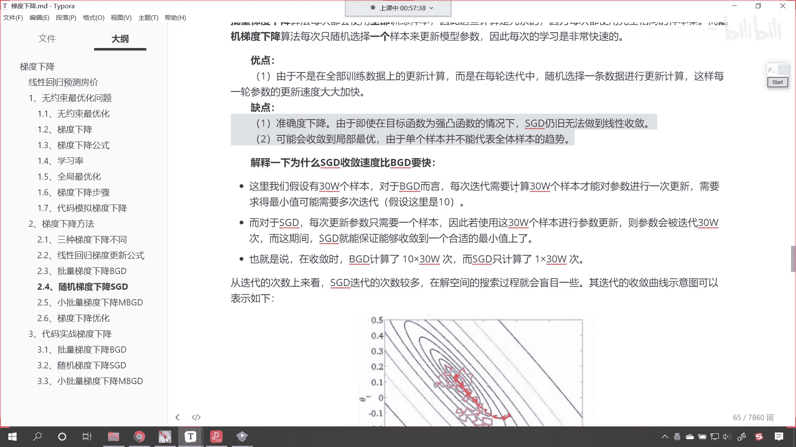

那咱们在这儿呢解释一下啊，为什么这个随机梯度下降，它的收敛速度比咱们的批量梯度下降要快呢，我们举一个例子啊，假如说我们样本当中有30万个样本，你想这个数据是很多的，对不对，对于bgd而言。

就是批量梯度下降，咱们每次迭代需要计算30万个样本，知道吗，每次迭代需要计算30万个样本，才能够对参数更新一次，需要求得最小值，可能需要更新迭代多次，咱们假设说这里是十。

而对于s gd每次更新参数只需要一个样本，因此若使用这30万个样本进行参数更新，则参数会被迭代30万次，而这期间sgd就能够保证，收敛到一个合适的值上去，所以说你看我们进行减这个粗略的计算。

b g d的话是不是就是10x300000次呀，那就是300万次，而咱们的s gd呢就是1x300000次是吧，所以说这个时候他的次数就少了，所以说这个随机梯度下降。

大家看他的这个轨迹啊，你看虽然曲溜拐弯的，是不是迈的步子是不是比较多呀，这叫什么小步快跑，知道吗，这叫小步快跑嗯，所以说它的速度快，虽然他会走弯路，但是最终呢速度要比咱们bgd的这个，速度要快好。

那么这就是它的一个优点。

那咱们接下来继续看，咱们看一下这个小批量梯度下降，这小批量梯度下降呢，是对于批量梯度下降，以及随机梯度下降的一个折中办法。

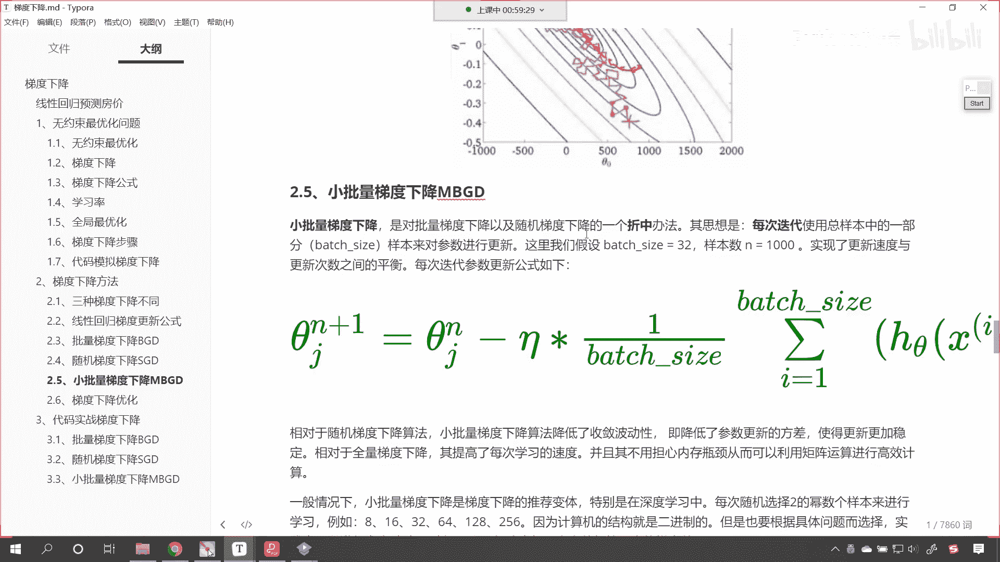

我们随机梯度下降是不是也有缺点啊，对不对，你看它的缺点是什么，准确度下的准确度下降，因为每次只选一个样本，这一个样本有可能是异常值，对不对啊，对不对，那我们就选咱们全国这个财富的拥有量是多少。

这个时候恰巧就选择了马云，那你想一看马云是这个亿万富翁，那我们就觉得中国人都富有，这种理解是不是不对呀。

对不对啊，因为马云是一个个体，是不是，那这个时候怎么办呢。

唉那就是小批量梯度下降，咱们抽的时候是吧，就抽一批，对不对啊，抽样的时候抽一批，比如说咱们的样本量是1000个，咱们抽的时候呢一次随机抽样抽32个，你想这32个是不是更能够代表。

是不是更能够代表咱们整体样本呀，那它呢就实现了速度与次数的平衡。

好咱们现在呢把这个字体给它更换一下啊，咱们更换成六。

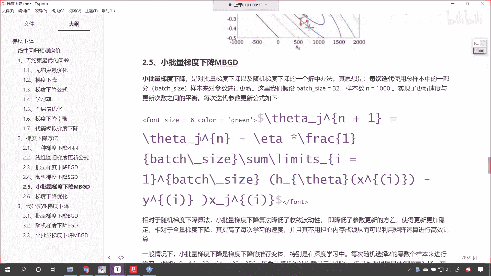

这个时候我们这个公式就能够展示全了，唉，大家现在就能够看到，咱们小批量梯度下降的更新规则是怎么样的，嗯第n加一次是吧，在第n次的基础上进行更新，咱们用了一塔乘以batch size。

你看这个时候我们的求和，大家看此时我们的求和是什么样的，咱们这个算数求和是不是就是i等于一，一直到batch size呀，对不对，你看当我们介绍到小批量梯度下降的时候，咱们这三个公式是不是就统一了呀。

无论是批量梯度下降也好，还是随机梯度下降也好，还是小批量梯度梯度下降也好，其实它们的不同点儿，是不是就是在于这个抽样的数量不同呀，看到了吧，就在于抽样它的数量是不是不同的，对不对，你看就在于此。

是不是哎那我们知道了这个之后是吧。

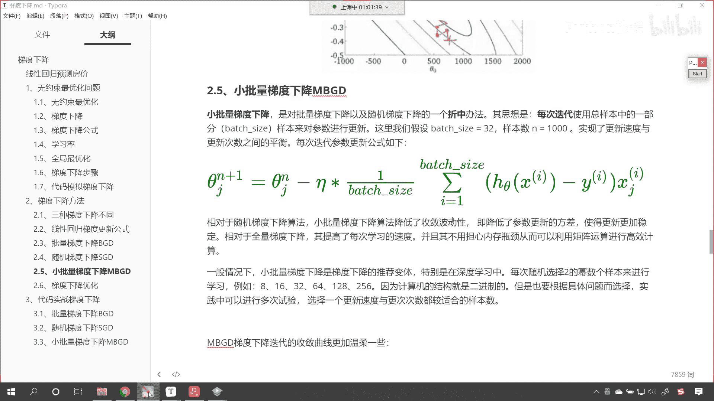

咱们的小批量梯度下降叫做m b g d。

那么它都对应着相应的英文啊，叫做mini batch gradient descent，那最全的这个叫batch gradient descent。

随机梯度下降叫做stochastic gradient descent。

诶这叫随机梯度下降，现在呢我们介绍了这三种梯度下降的不同，大家呢再看一下这三种梯度下降的轨迹。

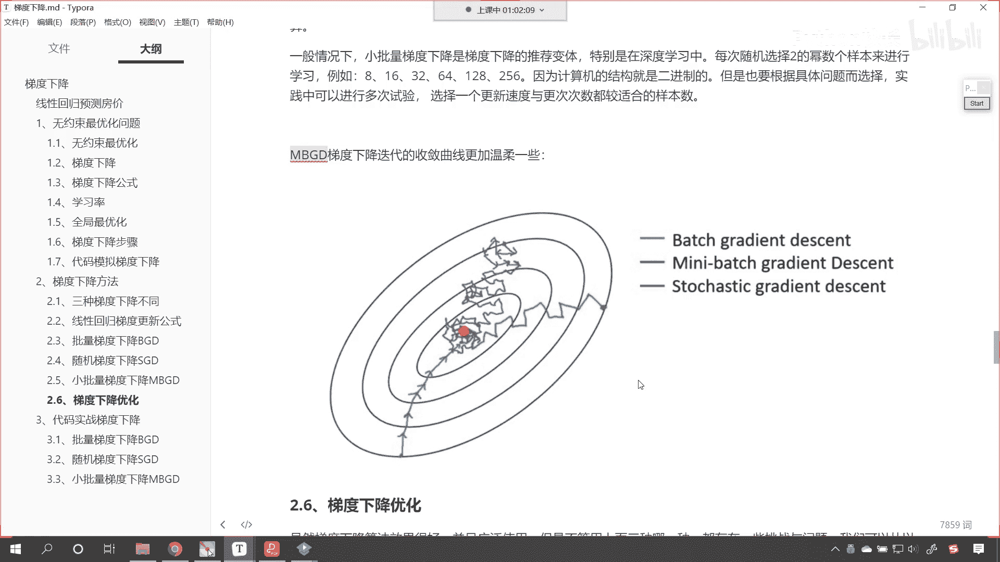

你看啊，此时呢我们再看一下它们的轨迹，看完轨迹之后呢，你再联想一下这三者的不同啊，这个呢就叫做下降轨迹，那我们就发现咱们的bgd就是这条，也就是这条蓝色的线，它在下降的时候是吧。

你看每一步下降的时候是不是一步一个脚印呀，那你要注意啊，这个时候他用了全部的数据，当数据量特别多的时候，它的计算就会比较慢，知道吗，计算就会比较慢是吧，因为他考虑比较周全，你就像我们人在做决定的时候。

如果你考虑周全，把所有的因素都考虑了，那么你肯定就这个这个向前迈一步是吧，那肯定就比较难，对不对，如果说你这个想的比较少是吧，嗯就就相当于咱们说这个，来一场说走就走的旅行是吧，背起包就走是吧。

这就相当于咱们的随机梯度下降一样是吧，一会儿到这儿，一会儿到这儿，一会儿到这儿是吧，来来回回的是吧，最最后也也到达一个终点了，这不就是我们人生的终点吗，是不是我们每一个人是最后通过这一生的努力。

是不是最后都会到达人生的一个终点，是不是啊，哎又回到了我们终极问题了啊，所以说你看这个算法和咱们的这个很多方面，人生活的很多方面是不是都可以联系起来啊，那咱们的mini batch。

你看这个就可以兼得了是吧，它速度和咱们的准确率是吧，哎就达到了一个统一，所以根据下降轨迹，我们再看这个图形，咱们呢就能够对这三种批，这个批量梯度下降方式不同。

