# P81：4-天池工业蒸汽量项目归一化实战（一） - 程序大本营 - BV1KL411z7WA

咱们呢归一化实战，我们呢找见咱们天池工业蒸汽量的数据。

好不好，好找见咱们天池工业蒸汽量的数据啊，各位小伙伴，你那里应该也有哈是吧，那就是这两个文件嗯，我复制一下，咱把这两个文件放到我的代码目录下，用户在咱们a l o t是吧。

13里边咱们在这儿来一个粘贴好。

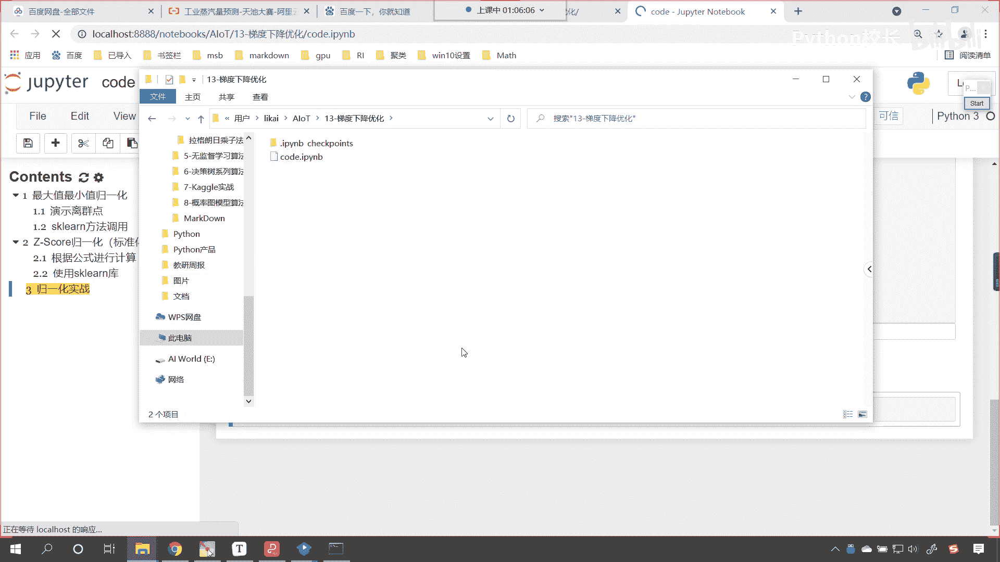

那么我们首先呢为了有一个对比，咱们首先呢就是不进行归一化，啊我们不进行归一化进行操作，那这个时候呢咱们就import pandas as pd，把这个导包导进来，import numpy as np。

我们加载数据，那就是pd。read csv，当前路径下有一个蒸汽train，它的分割符呢，我们给一个反斜杠t加载完这个数据之后呢，这个就是一个df，根据我们对于这个数据的介绍。

咱们就知道它里边的训练数据就是df。i log，此时咱们是不是要对它进行一个切片呀，那第一个冒号就表示所有的行，所有的样本都提取出来，后面有一个逗号，逗号后面这个冒号就表示咱们的列索引，我们的最后一列。

它是咱们的样本，最后一列呢是咱们的目标值，所以说咱们切片切到-1，就代表最后一列左臂右开，最后一列取不到，那它所对应的目标值就叫外衬，那就是df，直接来一个中光二target。

你看t r g e t我这个都记住了，然后咱们展示一下这个数据啊，discipline x下划线串，咱们展示的时候，咱们就展示他的前几个吧，head，然后y下划线train也调用它的head。

也查看它的前五个上面是咱们的训练数据，那我们同时也将测试数据给它加载进来吧，测试数据咱们就叫x test，那就是pd一点read csv给它路径，蒸汽test直接把这个加载进来就可以了，给一个sap。

那就是反斜杠t，那我们在打印输出的时候呢，咱们也打印输出一下x test它的前五个数据head。

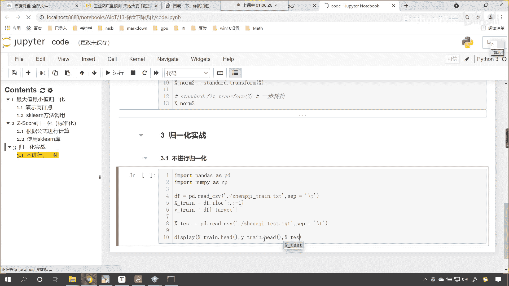

这个时候你看过一执行这个代码啊。

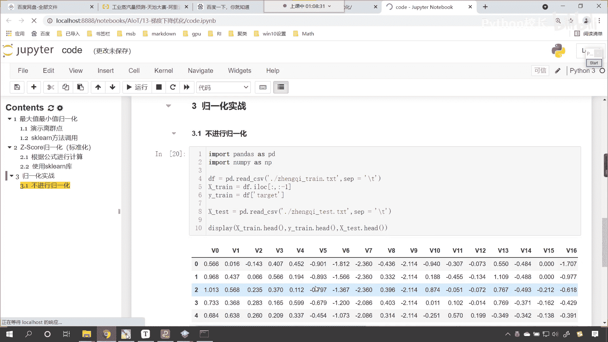

各位小伙伴看咱们的数据是不是就得到了，这个里边的数据，各位小伙伴就能够发现我们没有经过任何处理，是不是你看0。5，0。9，你看你v6 这一列，是不是整体来说都比较偏大呀，看到了一负的1。8，负的1。

5是不是v7 是不是负的2。3，而咱们v8 这一列是不是就是负的0。43，0。332呀，你想我们所构建的方程方程它所对应的系数，咱们方程所对应的系数，是不是就是表明咱们这方程的系数。

是不是可以在一定程度上表明这一列，它权重的大小呀，那你这个系数越大，是不是说明这一列对于我们的目标值，影响就越重要呀，是不是啊，但是呢你看没有经过处理，有的数值是不是比较大，而有的数值就比较小。

你比如说v 11这一列看到了负的0。307，负的445，虽然有正有负啊，但是呢它的绝对值来说，v9 那就要比v 11它的绝对值要大。

对不对，好这就好比是吧，咱们举一个例子啊，你看我们家里边儿有黄金是吧，我们家里边有黄金500克，那就不到一斤是吧，然后呢你跟我比一下，你说我们家里边儿有有这个铁块儿有2吨，你想啊哪个值钱呀，哪个重要呀。

那你就是有10吨100吨铁块，你能比得上500克黄金吗，是不是比不上呀，对不对，所以说呢这个数值的大小，它呢并不能这个反映它的啊，这个属性的这个属性它到底重要还是不重要，所以如果要是没有经过归一化。

那单纯的这一列这个绝对值大，它并不能说明它重要，同样呢你这个数值比较小，也不能说明这个属性它就薄弱，但是呢如果我们要不进行归一化，往往数值大，对于我们最后的这个目标值，它就有一定影响。

我再给你举一个例子，你是不是只能在晚上看到天上的星星呀，白天天上有没有星星，请问白天天上的星星在不在来，各位小伙伴在我们的直播间，在我们的讨论区里边，你回复一下也在，为什么白天看不到呢。

是不是因为太阳他太耀眼了，它的光芒是不是四射，他是不是把星星的光给你掩盖了呀，对不对呀，白天太阳它的光太大，它就把星星是不是给掩盖了，同样你想一下，如果咱们属性当中某一个数值，它的量纲特别大。

它是不是会影响我们这个量纲比较小的呀，对不对，那我们知道太阳它只是非常普通的一颗恒星，有的恒星比太阳大多了，是不是，比如说天狼星，那就比太阳大了不知多少倍，但是我们只能在晚上是吧。

依稀的看到天狼星的一点点光亮，是不是，但是天狼星比太阳更大，所以说呢不进行归一化，数量比较大的就会影响数量比较小的，这是我们最直观的一个举例了啊。

好咱们的数据呢演示了没问题，那我们呢把咱们的算法导进来啊。

咱们就from sk learn linear model，咱们从这个当中就导入linear regression，现在我们对于没有归一化的数据，咱们呢就进行训练和预测，linear声明。

linear model，咱们就调用linear model fit，我们将训练数据x train放进去，y下划线train放进去，然后呢咱们就使用这个模型，我们进行预测，predict。

将x下划线test放进去得到的这个结果，我们起个名叫y盖，现在呢咱们将歪盖这个数据呢。

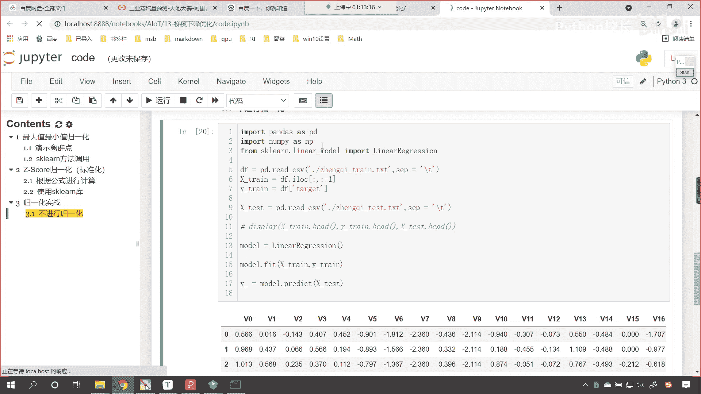

我们给它保存一下啊，啊那这个时候呢嗯咱们就调用这个歪盖点。

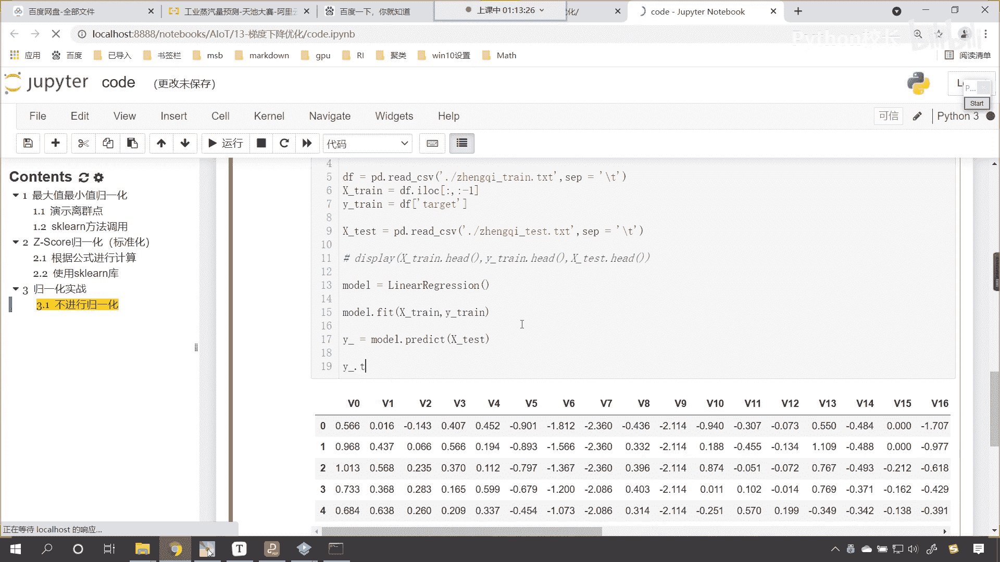

我们先查看一下歪盖啊，直行来，各位小伙伴就能够看到，这是不是咱们y杠的预测的值呀，那我们就保存一下啊，那就是np点，咱们调用它的c5 t e x t这个方法是吧，把它保存到文本文件当中，点反斜杠。

这个呢啊，就是咱们的result r e s u l t叫result一点tx t，那这个数据呢是咱们没有经过规划的，对不对，直接上是不是啊，唉执行一下这个代码保存成功了。

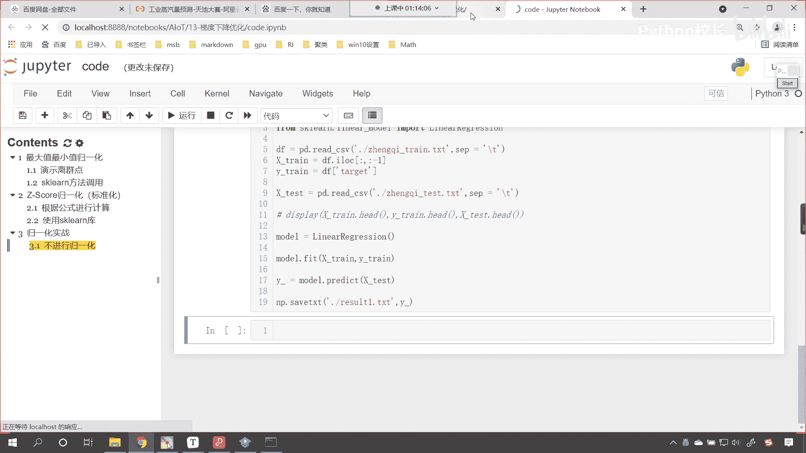

在咱们的当前路径下，大家看是不是就有了这个数据啊，打开看一下啊。

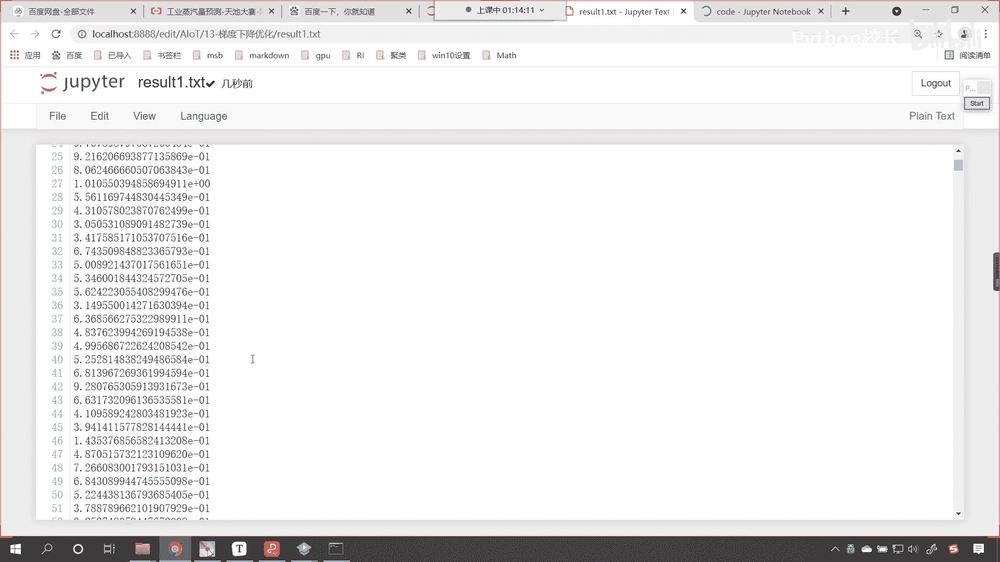

数据符合要求来，现在咱们就把这个数据上传到咱们的天池。

工业蒸汽量上，那找见提交结果，我点提交，然后呢，咱们就选择嗯咱们这个目录下所生成的result一哎。

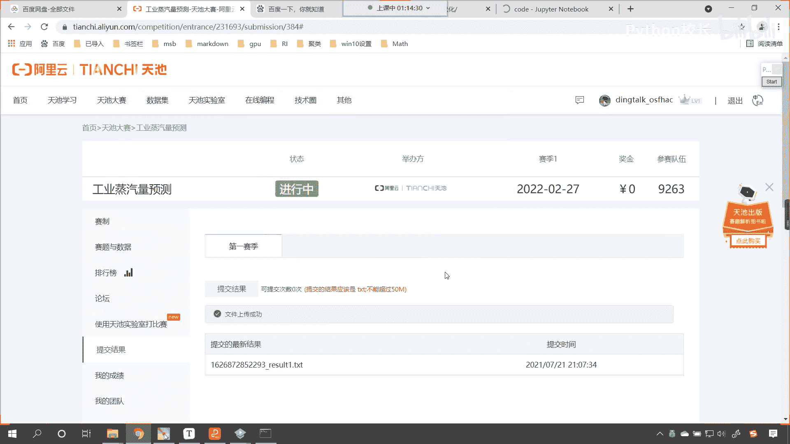

大家看上传成功了，一会儿我们是不是就可以看一下成绩了，对不对，咱们一会儿看成绩啊。

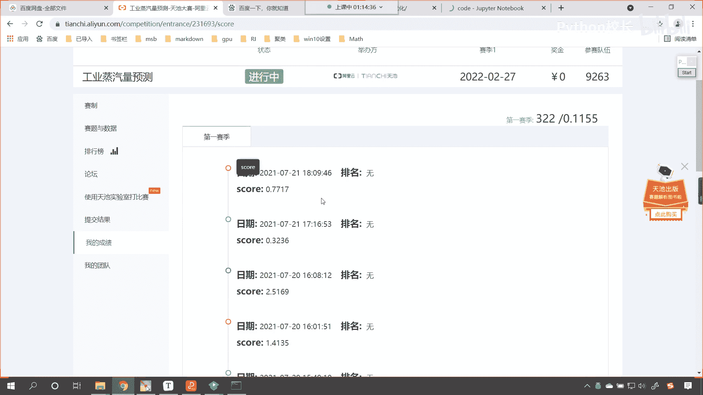

嗯上传了他得过一会儿才能看到成绩。

那我们接下来嗯咱们就进行归一化，好不好，来一个四级标题，在这儿呢，咱们就来一个最大值最小值归一化好不好，最大值最小值归一化好。

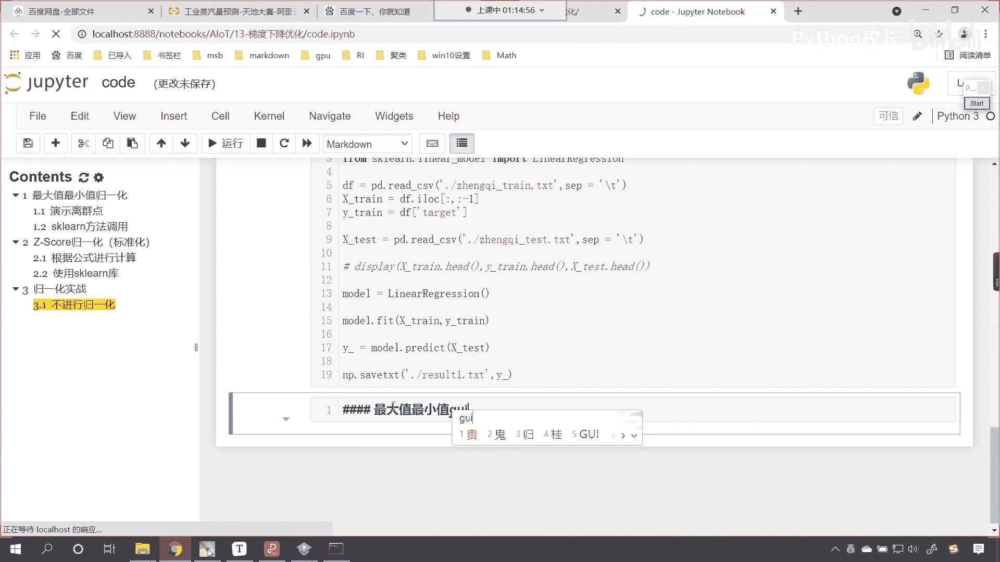

那么最大值最小值归一化呢。

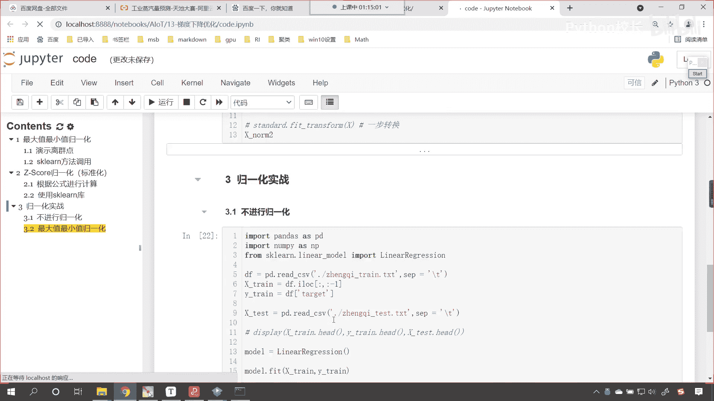

咱们将上面的数据给它拿到看啊，复制直接拿过来。

ctrl v我们归一化，咱们是不是sk learn当中提供了相应的方法，直接用是吧，这就是站在巨人的肩膀上，sk learn只要我们知道了它的原理是吧。

咱们pray从这个当中导包叫me max scale，上面呢是加载数据，接下来呢唉我们就进行归一化，mm就等于me max sc，咱们的mm，咱们这个时候呢我们就得先feat一下。

大家想在进行归一化的时候，再进行归一化的时候，是不是这个x train需要归一化，x test是不是也得需要规划呀，对不对，看这两者都需要规划，你想想是不是我们要处理某一个数据。

那么我们前后是不是都要保持一致呀，对不对，x train是咱们的训练数据，x test是不是测试数据啊，两者都得需要归一化，那咱们规划的时候，我们规划的这个模型，咱们先进行feat，feat的话。

咱们就将x train放进去，然后咱们就可以归一化了，那咱们mm点咱们调用transform这个方法，将x下划线train放进去，放进去之后得到的这个结果就是x下划线train，咱们起个名叫。

咱们起一个名叫做杠nm，这就表示他规划了，对不对，那你训练数据规划了，测试数据是不是也得归一化，依然调用transform这个方法，咱们将x test放进去，t e s t接收一下。

那就是x下划线test杠nm n r m好，大家看这一步就是咱们的规划归一化之后，咱们就可以进行，咱们就可以进行训练和预测了，那依然声明一个model吧，就等于linear regression。

然后调用model它的feat方法，咱们将x train normal放进去，目标值不用变，你看目标值不用进行操作，我们进行规划，咱们呢是对数据，我们是对于特征，对于我们特征的。

这对于我们特殊的这个案例，其实就是工业蒸汽量，看他的这个生产工艺的这个，你想是不是它生产嗯工艺它的这个属性特征呀，对不对，就是它生产工艺是吧，它的这些参数是吧，其实我们是对它进行这个归一化好训练和预测。

然后呢咱们就model点，咱们就调用predict，咱们将x test nm放进去得到的这个结果，咱们用vr predict接收一下，保存一下np。c5 t e x t点反斜杠。

起个名叫result 2，然后逗号将咱们的y杠predict放进去，执行这个代码保存成功了。

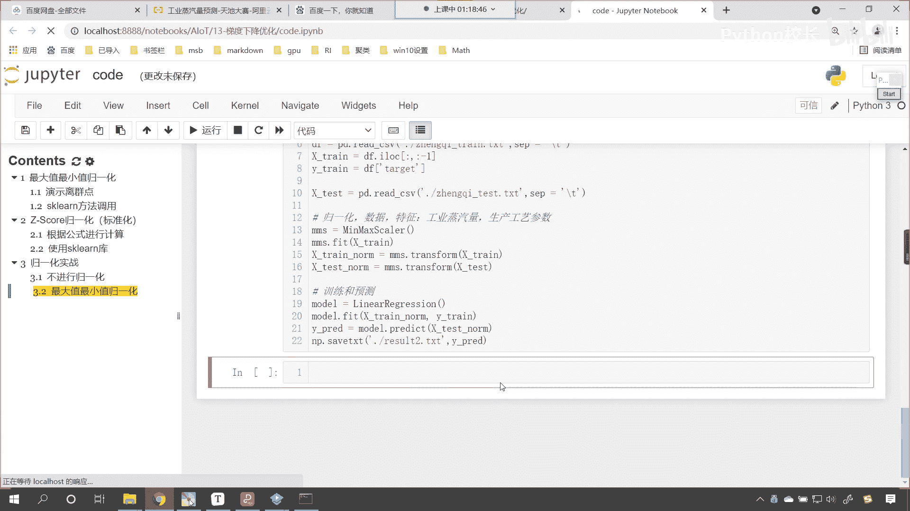

那现在咱们也把这个数据上传一下。

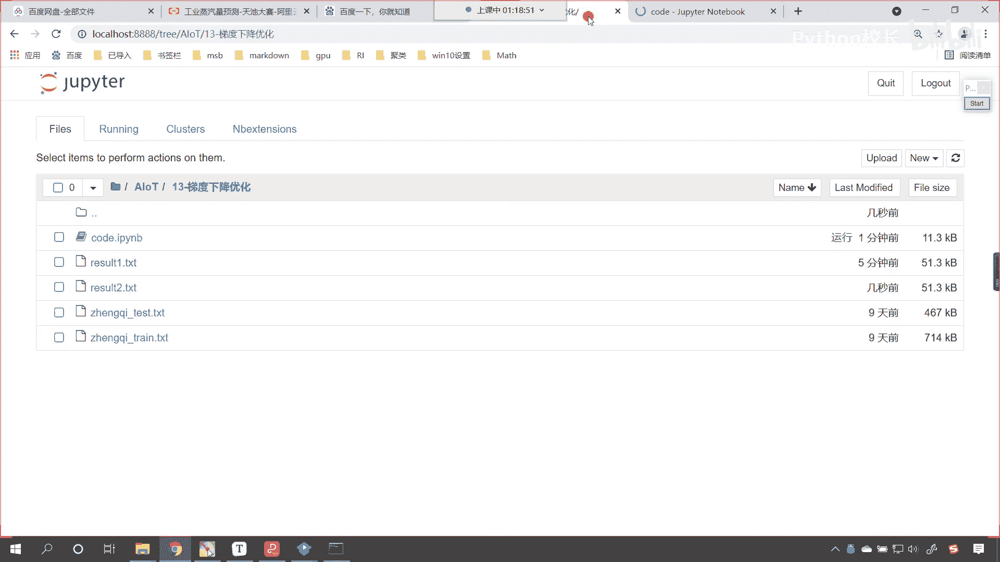

好不好，来回到天池，工业蒸汽量在这儿刷新一下，看咱们在这刷新一下。

还在转圈啊，这个好出来了，各位小伙伴，你就能够看到，这个是不是咱们今天晚上09：07，是不是上传的未经归一化得到的一个分数是吧，那你知道这个分数越大越不好，是不是，那我们现在呢再来提交一下啊。

看看提交结果，蒸汽二提交上去好，上传成功了，还得再等一会儿啊。

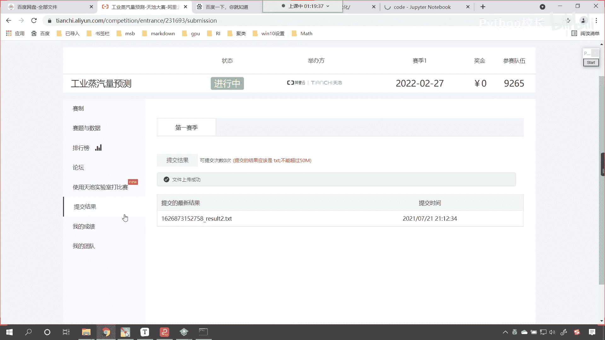

咱们看我的成绩，这是吧，还没出来来，咱们现在紧接着，咱们就把最后一种规划也给他写上吧，这最后一种归化是不是就是z score呀，对不对，z z告归一化。

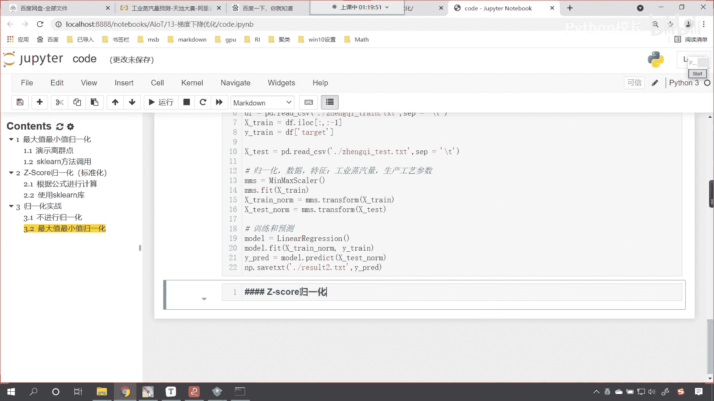

那我们得到这个数据其实就是更加正太了，上面的代码复制一下。

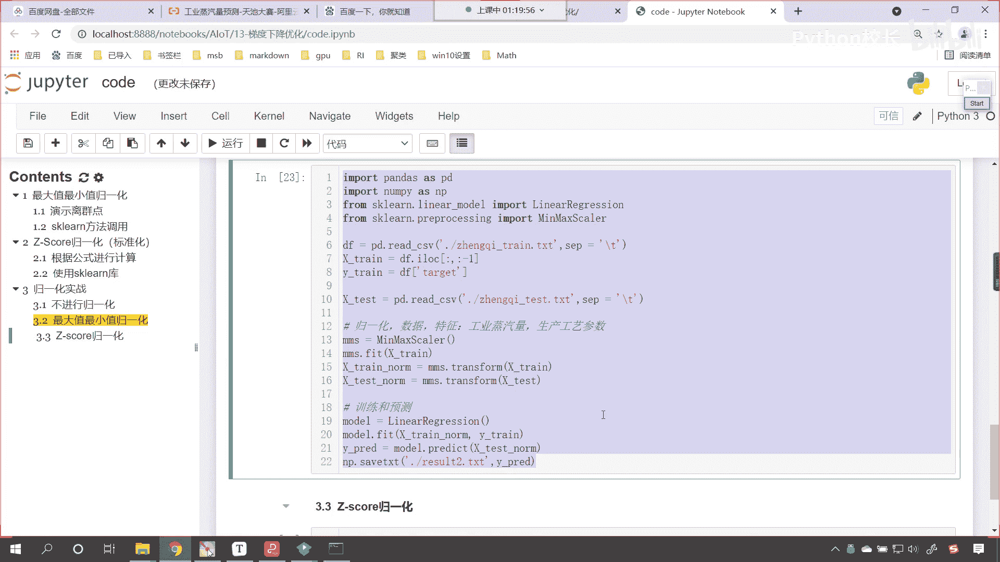

咱们粘贴过来，导班咱们就不导入minmax了，standard scale，是这个数据不用动，那我们规划的这个方法修改一下，那就是standard的scale，英文的小括号，那咱们这个变量名呢。

我们起个名就叫standard的吧，哪个import啊，这个地方多了个t是吧，眼睛真明亮好，然后呢复制一下这个变量，对它进行一个训练，使用它进行一个转换，使用它进行转换。

来咱们保存的数据结果我们就叫做result 3，好不好，这个时候呢咱们执行这个代码，保存成功了，看保存成功了，你看嗯整体的这个变化是不是就是把最最小值，最大值规划变成了z score规划呀。

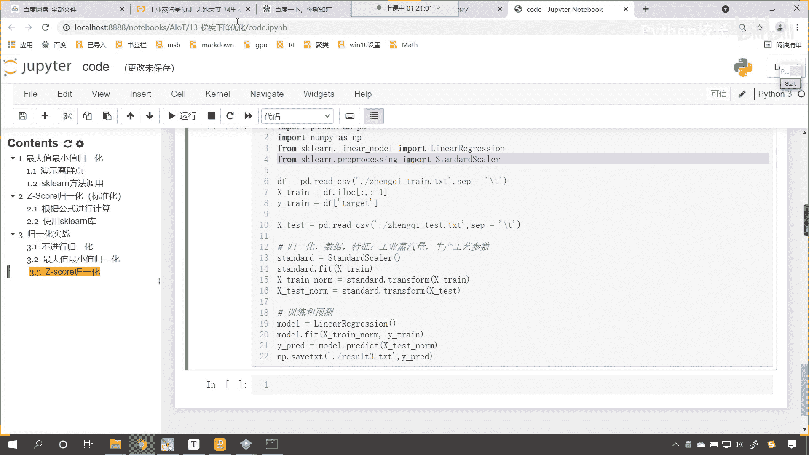

来再来提交结果，点击提交选择result 3，看选择result 3，我们等着这个提交上去啊，上传成功，现在看一下我的成绩，3。88096a规划之后，它应该有很大的一个变化，咱们现在发现9。07和09：

12，这个分数是不是一模一样呀，那是不是我们刚才导包的时候，我看啊这个也是3。089，是不是这个就奇怪了啊，来我们一起来看一下，看看到底哪个地方不太对啊。

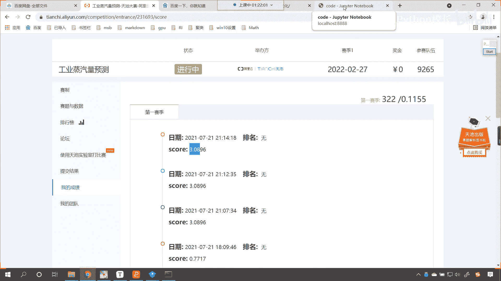

他应该经过规划之后呢，它的效果呢应该会应该会好很多的啊，我们看一下啊，model。feat x normal，x test normal，是不是他应该经过规划之后，他这个结果呢应该是完全不一样的啊。

大家别急，咱们呢打开result 1，我们看一下这个数据好不好看，第一个呢是2。682。60，负的6。9，我们再看一下咱们的第二个是吧，result 2嗯，咱们现在就发现，你看我们这几个结果。

得到的是不是都一模一样呀，看到了吧，看啊2。682。60，那咱们看一下咱们保存的这个数据。

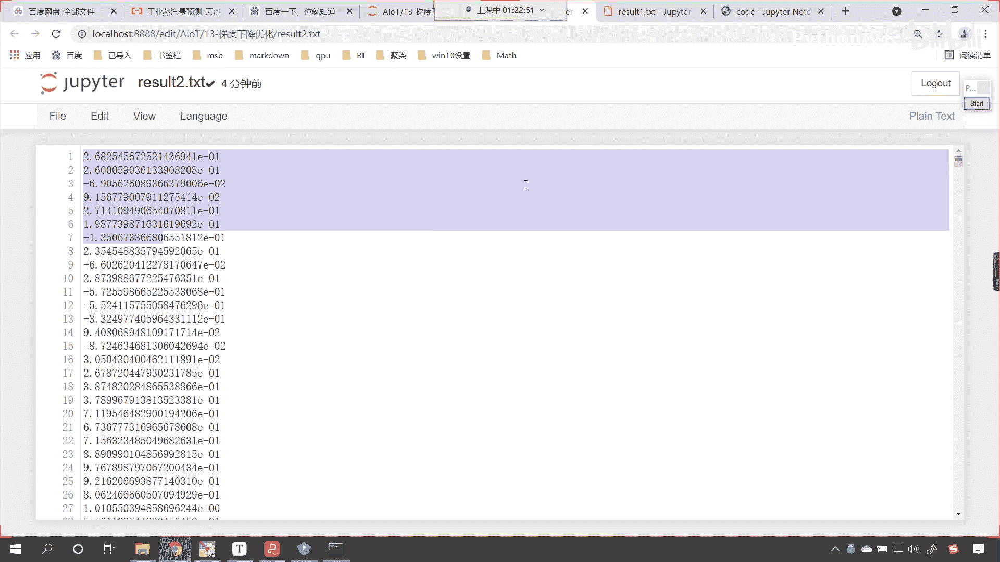

他有没有这个不一样的地方啊，看来我们先看咱们不进行规划的这个结果，model。feat，model，点predict。

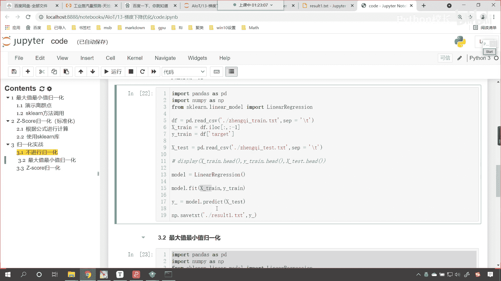

把它存成了result 1，然后咱们这个数据呢我们把它保存成了result 2，x train norm，x test norm，上面呢咱们是进行了嗯，这个归一化操作是不是feat一下，归一化操作之后。

来我们在保存之前，咱们将外杠predict，我们把它的前15个数据打印输出一下，0。26，那么上面是没有经过规划的，咱们将y杠的前15个数据我们也输出一下，0。26，0。26，刚才0。26。

负的0。69，咱们现在发现得到的结果是一模一样的。

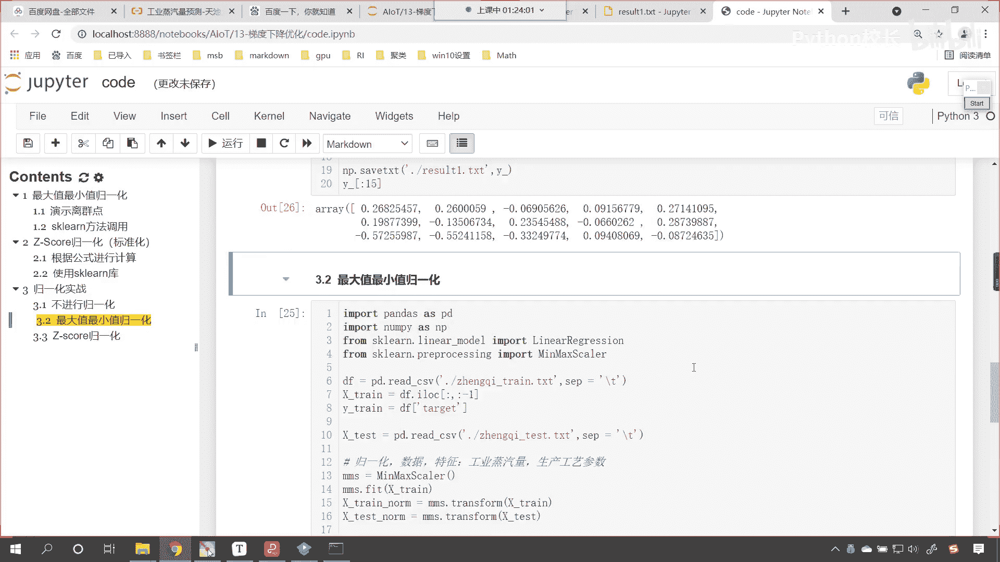

是不是负的0。08。

对x test也是需要进行规划的，那我这个地方进行了规划呀，这就说明咱们的规划是不是没有成功呀，对不对，你看这就说明咱们的规划没有成功啊。

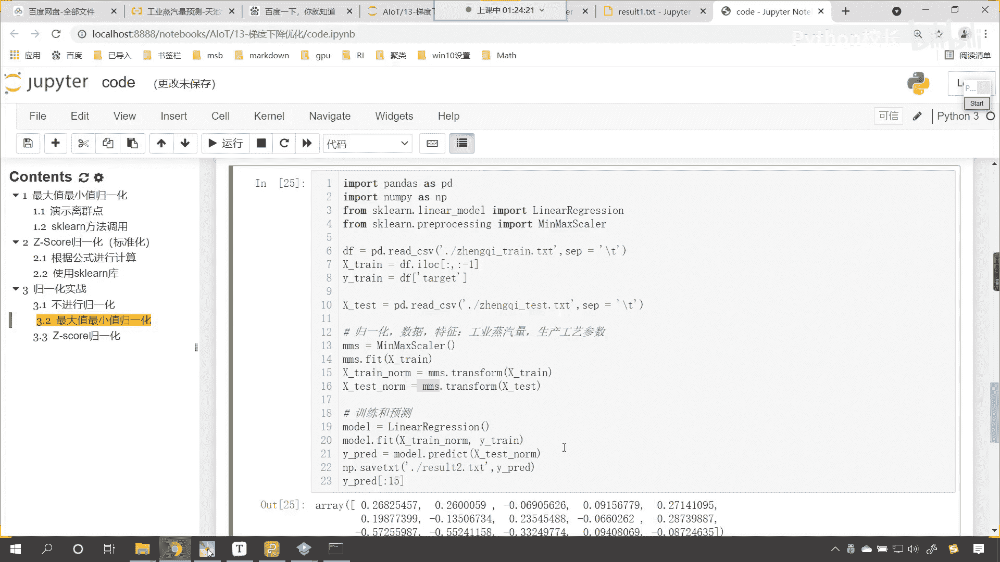

那z score归一化呢，咱们也将这个y下划线predict中括号冒号，我们也查看一下它的前15个好，现在的话，那么我们就打印一下规划之前和规划之后。

这个数据是吧，它有什么样的不一样啊。