# P83：6-过拟合和欠拟合正则化介绍 - 程序大本营 - BV1KL411z7WA

我们继续往下看。

那这些咱们就可以关闭掉了，各位小伙伴也可以去尝试一下啊。

来那咱们现在呢就来继续回来啊。

回到咱们的课件当中，接下来呢咱们就看一下正则化，好接下来咱们就看一下正则化，刚才叫归化，接下来我们看一下正则化，这什么是正则化呢，那我们就得介绍一些概念，过拟合欠拟合，这欠拟合呢就是还没有拟合到位。

这训练集和测试集的准确率都还没有达到最高，学的还不到位，这个过拟合呢就是一般情况下，欠拟合的情况出现的比较少，现在的算法都非常强大，只要我们使用sk learn的算法，或者说我们自己写的算法。

咱们一般都能根据数学公式，把咱们训练集当中的特征给他找到，给它拟合出来，拟合的这个方程一般情况下都是比较好的，所以说这个欠你和现在呢不是问题，你想现在都啊这个2021年了，是不是啊，那我们这个机器学习。

深度学习其实发展的已经跟之前相比，就不可同日而语了，所以说这个欠拟合就表示没学会是吧，哎这种情况很多时候已经不存在了，出现的情况往往是过拟合，这啥啥意思呢，就是拟合过度咱们的训练数据是吧，分数特别高。

但是测试集呢哎就反而降低了，这就好比学习走火入魔了，就叫学过度了，你看你就好比咱们考试是吧，高中高考的时候，高中的时候你做卷子是吧，有的学生呢死记硬背，把之前做过的卷子背过了，你考试考它训练过的。

考他这个之前老师讲过的，得的分数很高，一考试碰见新的就考不好，比如说你看你平时考试很好，一旦高考是吧，这个时候就就不行了是吧，这说明呢你之前你分数之所以考的高，你死记硬背了，你不会举一反三。

高考的时候没有重复的题，是不是还有第三种情况呢，就是恰到好处。

他刚好把这个数据分开了，那我们有三个图。

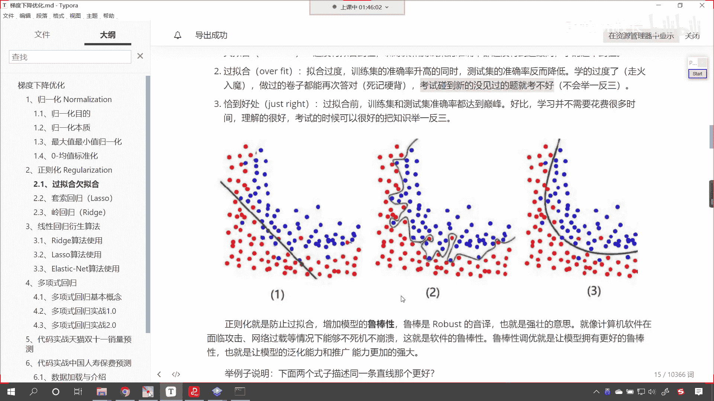

你看第一个图呢就是欠拟合，我现在的任务是，需要把蓝色的点和红色的点分开，你这个时候就刚划了一道，很显然很多点是不是没有分开啊，这个叫学习不到位，你看这第二个点儿是不是就是过拟合呀。

现在你就能够发现它是不是把所有的点，用这条线给我们分开了，你看这就有点过，为啥你看曲流拐弯的是不是曲流拐弯的，而我们第三条线呢刚刚好，你知道咱们训练出来的模型，我们是为了在真实环境下去应用。

那你想要在真实环境下应用，大家想一下，你看到这个看到这个图，你是不是就能够看到它有一定的规律呀，也就是说我们这个抛物线的上边，它是不是应该是红蓝色的点，这个抛物线的下边是不是应该是红色的底呀，对不对。

而我们中间这条线，它确实把已有的数据全部分开了，对不对，你看他确实把已有的数据全部分开了，但是呢如果有一个新数据，你比如说啊有一个新数据，你看这个时候我在这个位置看，咱们画一个点。

你看这个时候我画的点儿，是不是一个绿色的点儿呀，请问这个绿色的点儿根据这条线来划分，这个绿色的点，它会被划归到哪一个类别呀，然后在这儿我给了一个绿色的点，大家仔细看看我给了一个绿色的点，大家仔细看。

请问这个绿色的点应该被划归到哪一类呀，这个绿色的点它应该被划归到蓝色的这个点，还是红色的这个点，来各位小伙伴在群里边儿回复一下啊，你看那我们就看这个绿色的点，它到底在咱们这条线的上面。

还是还是在这条线的下面，对不对，那你看这个绿色点，它是不是在咱们这条线的下面呀，所以根据这条线如果我们进行划分的话，那么这个绿色点它应该被划归到红色部分，就是绿色的点儿，咱们根据根据咱们的划分。

你看它应该被它就是被划分到红色哎，这个区域了，对不对，但是看你发现，这个绿色点它的周围看绿色点，它的周围它其实应该属于哪一个范围啊，你看绿色的点，它的周围就一个红色的点。

我们可以认为这个红色的点是异常值，你看它的周围是不是都是蓝色的点呀，这个按照它的一个分布规律啊，按照这个这个点的分布规律，它呢应该是啊，它应该是咱们蓝色区域嗯，因为它的周围啊。

因为它的周围呢唉它都是蓝色，对不对，所以说应该是蓝色，但是呢你过你河嗯，你过拟合呢，这就相当于是呢呃你把已有的数据全部分开了，但是对于新数据你往往不太好，那这个是我们机器学习当中，最应该避免的一种情况。

就是说你看这我们用咱们中国的古话来说是吧，这叫窝里横是吧，在家里边特别横，一到外边就蔫了是吧，就不行了，你在这个对已有的数据是吧，分得很好，一遇到新数据就不行了，你想我们辛辛苦苦把模型训练出来。

咱们的目的是什么，目的是不是就是让他预测新数据呀，你已有的数据，这都是我统计好的，我知道谁该分到哪儿，对不对，我们主要的目的就是为了让他预测，就是为了让它实践应用到新数据。

但是这就是过拟合它的这个缺点是吧，对于已有数据特别好，对于新数据就不行了，嗯不知道你你在上高中的时候，有没有遇到过这样的同学，平时考试很好，一旦大一旦这个大型考试的时候是吧，模拟考试就不行了。

或者说一旦高考的时候是吧就不行了，平时很好是吧，可能因为紧张呀，也可能因为这个各种各种各种各样的因素吧，这个就是心理素质不够硬是吧，不会举一反三好，那么这个就是咱们过拟合。

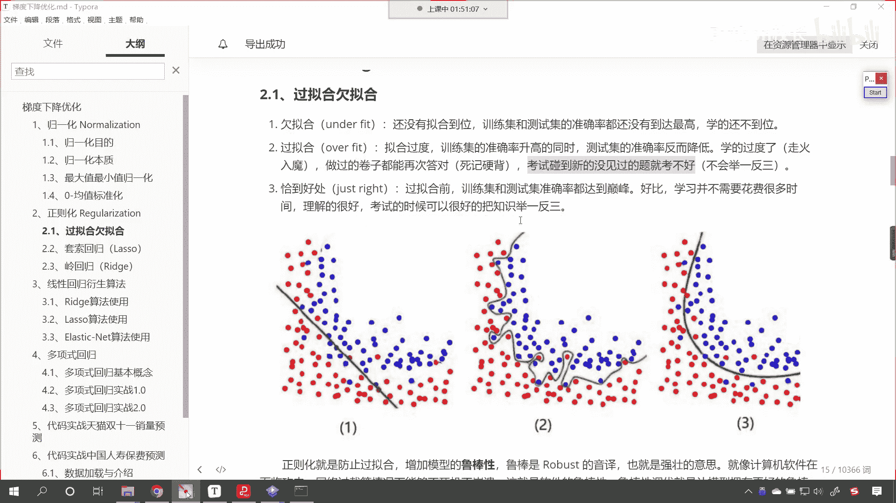

欠拟合它的一些概念好，那么我们如何防止这种情况呢。

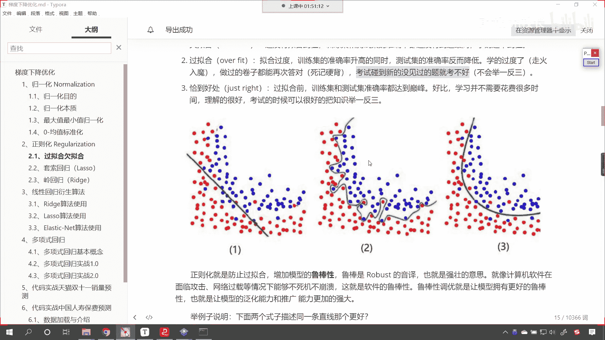

看到了吧，我们如何防止过拟合呢。

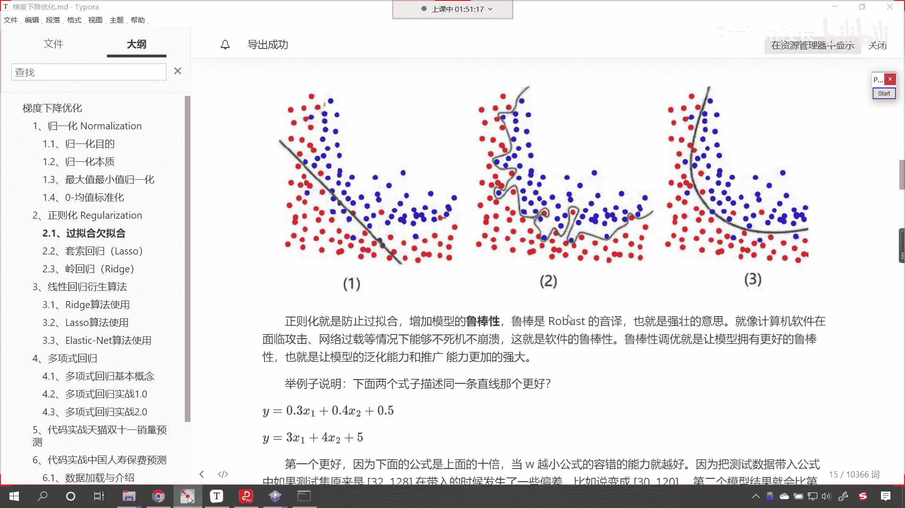

咱们可以通过正则化来防止过拟合，增加模型的鲁棒性，你看这个鲁棒性一看这是什么意思呀，哎就是强壮的意思哈，嗯就是咱们计算机软件在面临攻击呀，网络过载等情况下，是不是这个能够不死机，不崩溃。

这就是软件的鲁棒性，那对于我们模型的鲁棒性呢。

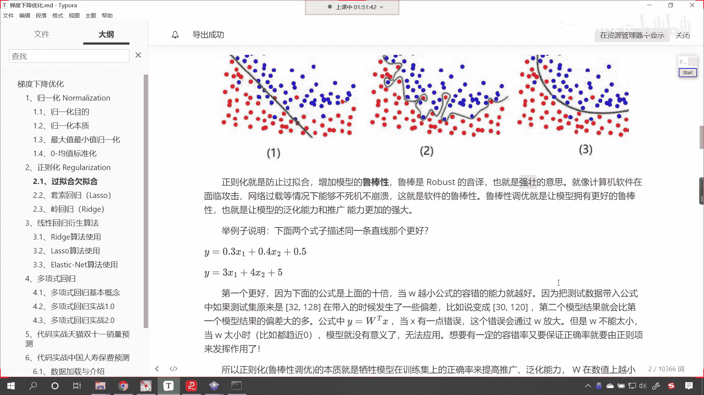

唉也就是说它的泛化能力强，也就是说他在遇到真实数据的时候。

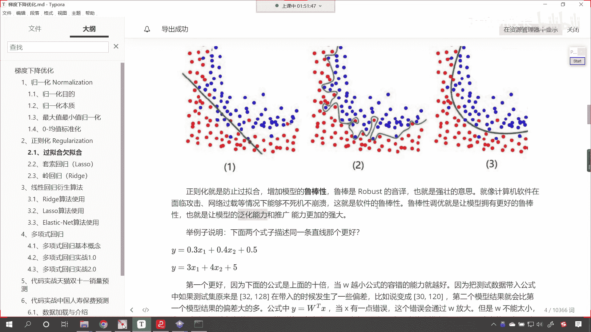

能够很好地把这个数据给你进行划分，准确率还不错是吧。

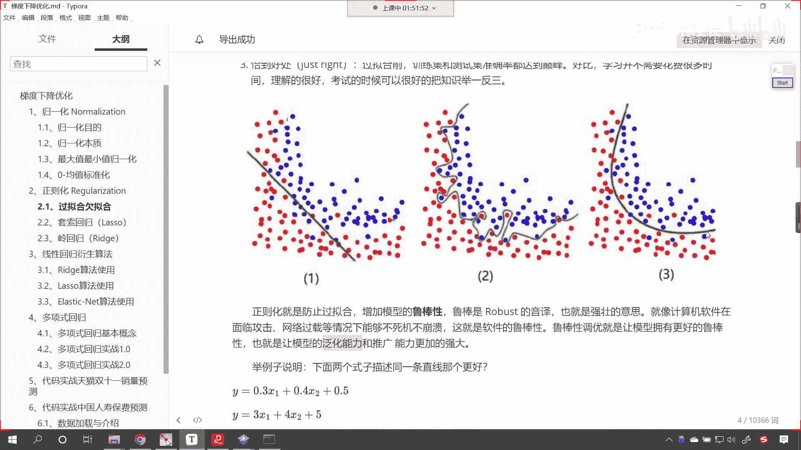

哎这就是他的这个鲁棒性好。

那么咱们举一个例子啊，看下面两个式子描述同一条直线哪个更好呢。

你看到了吧，下面是两条直线。

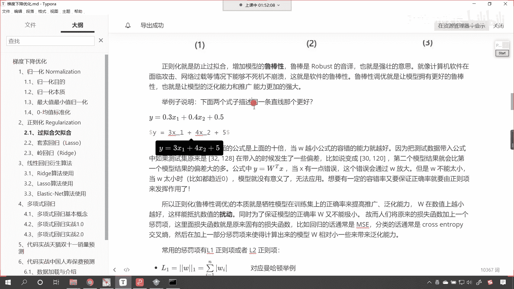

各位小伙伴能够看到，其实这个直线你看到了吧，3450。30。40。5，你看这两条直线是不是类似呀，比例是不是也是类似呀，你看哪一个更好呢，上面这个系数比下面这个系数是不是小，1/10啊。

啊是不是它的1/10小9/10，是不是上面这个更好一些啊，虽然这个一样，但是上面这个更好一些，为什么你想啊，如果说我们要把测试数据带入咱们的一式当中，假如咱们的测试数据是32和128，代入上面。

它是不是会有一定的偏差呀，对比如说嗯，那么他就嗯，那它有一定的变有一定的偏差，那假如说我们的我们的这个测试集，发生了一些变化，它变成了30和120啊，这个时候呢你看你从30呃，从咱们的这个32变成30。

从128变成120，横纵坐标都有发生变化，对不对啊，但是你的方程一，因为它的系数小，一乘它是不是就偏差就小呀，误差量是不是就小一些呀，对不对呀，所以咱们的偏差，咱们的误差会通过这个系数放大，知道吗。

会通过这个你系数大，你一乘你的偏差是不是就大系数小，你乘这个偏差是不是就小一些，对不对。

所以说呢咱们的这个，咱们如果想要防止它的过拟合，咱们得需要把系数给它变小。

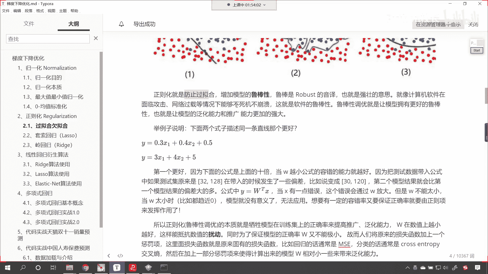

你看咱们这个方程看到了曲溜拐弯的，那你想这个这条线，如果说它对应着一个方程的话，那么它的系数就比较大，你想我们一会儿上一会儿下，它如何才能够实现，一会儿上一会儿下呀，如何才能够实现这个拐弯呀。

是不是导数变化比较快呀，那导数变化跟什么有关系，是不是就跟咱们方程的系数有关系啊，对不对，你一会儿上一会儿下，一会儿正，一会儿负，是不是就说明这条线它所对应的方程，看这条线所对应的方程。

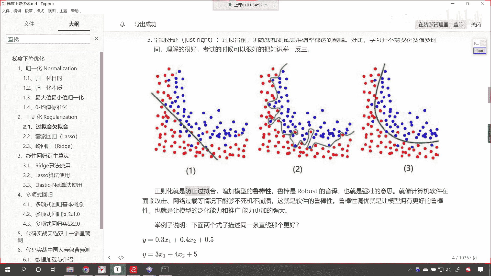

它的系数就比较大，那我们刚才也举了这个例子。

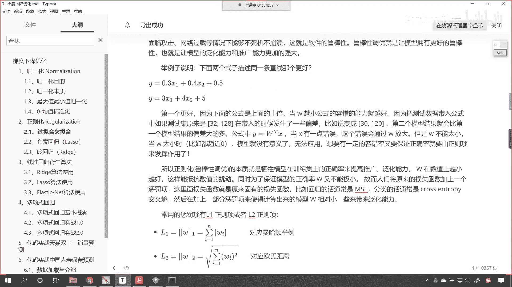

是不是咱们也举了这个例子，说这个方程的系数小一些是吧。

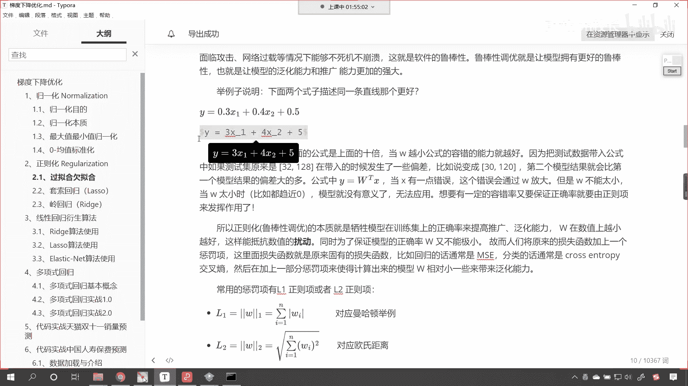

有助于这个模型的这个鲁棒性更好。

你看那所以呢正则化看正则化，咱们的本质就是牺牲模型，在牺牲咱们模型在训练集上的准确率，提高推广泛化能力，w在数值上越小越好，通过这种方式来抵抗数据的扰动啊，通过这种方式来抵抗抵抗数据到扰扰动。

同时呢为了保证模型的正确率，我们这个w又不能特别小，嗯这个如何才能做到呢，哎咱们呢就是在损失函数当中增加一个惩罚项。

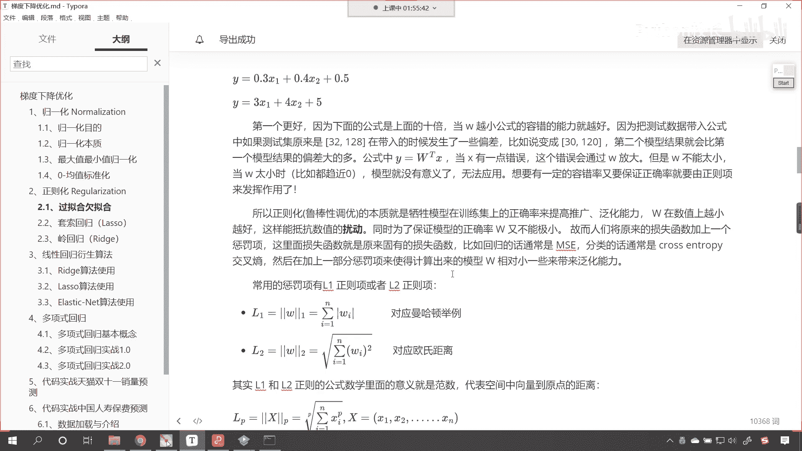

这啥是乘法项呢，看什么是乘法项呢，你看说到这里，咱们可能又有点蒙圈了对吧，我们接着往下看啊，我们都有具体的公式，咱们这里的损失函数，就是咱们原来固有的损失函数，咱们线性回归的损失函数是不是最小二乘法呀。

这个到哪都不变对吧，他就是m s e是吧，分类的话就是后面咱们会讲到叫cross entropy，这个叫交叉熵啊，那我们在原来的基础上进行优化，其实就是给他增加一个乘法项，其实呢就是给他增加。

其实就是给他增加了一个这个叫做l1 ，或者说l2 ，那我们的乘法项对应着一个具体的公式，叫做l1 ，你看这种写法，它呢其实就是矩阵的一个写法，大家看这个这个就是矩阵的写法。

那我们这个其实你看是不是就是绝对值呀，看到了吧，是不是就是绝对值，看到两个竖杠是不是绝对值，前面这种写法是矩阵写法啊，这个对应曼哈顿距离嗯，这个对应着咱们的曼哈顿距离，那什么是l2 呢。

这个l一呢就代表一次幂，这个l2 呢就代表二次幂，你看这个l2 对应着什么。

是不是就是w i的平方呀，然后再来一个开平方。

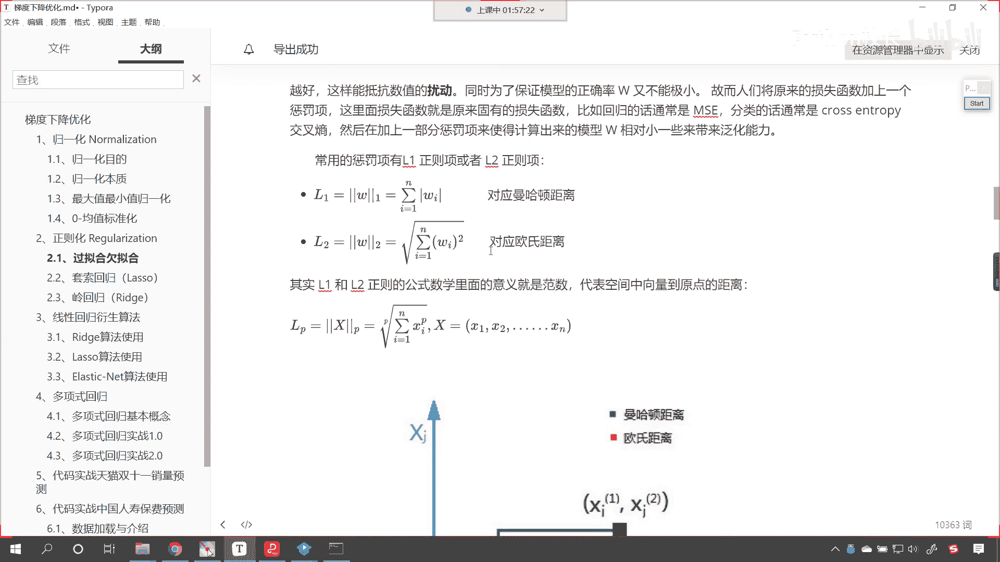

这个就对应着欧式距离，也就是说我们如果想要对咱们原来的这个模型。

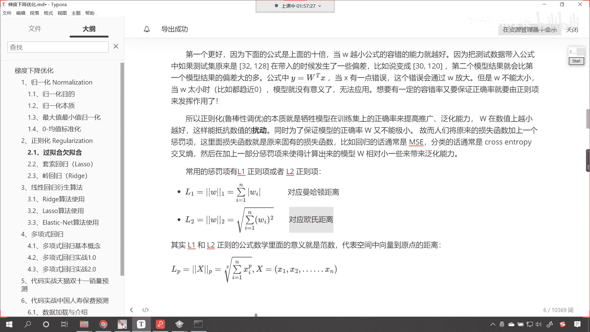

想要防止它过拟合。

那么我们得需要把损失函数。

把它的公式对它进行一个调整，怎么调整呀，就是给它加上啊，就是给它加上一个惩罚项，这个惩罚项就是咱们下面这两个公式，那你先知道这，那接下来又有一个问题，为什么加上这样的惩罚项，可以让我们的系数变小。

你看到了，因为咱们说了这个w看看这个w数值减小，它数值减小是不是可以抵抗数值的扰动呀，对不对，你抵抗了数值的扰动，它的鲁棒性是不是就更强了，对不对，好，那么大家先熟悉一下。

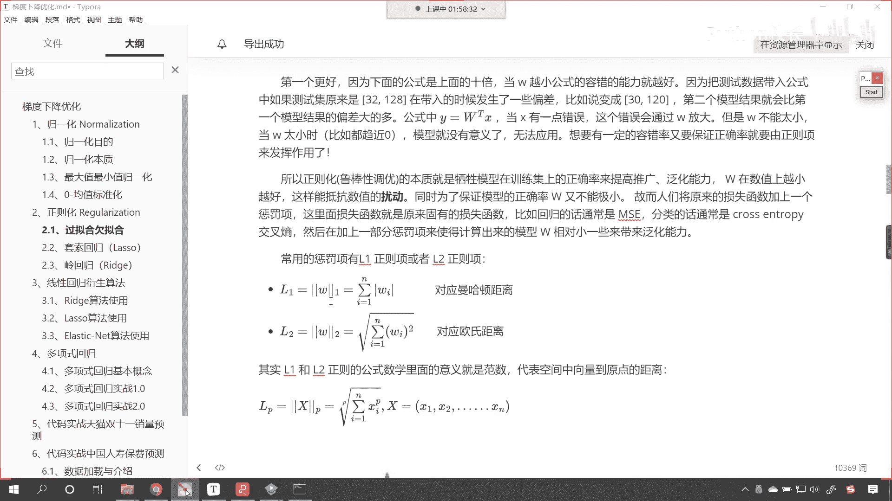

咱们l一和l2 这两个公式，那l一和l2 ，正则公式在数学里的意义就是范数，那这个范数代表着什么呢，代表着空间中向量到原点的距离嗯，大家现在就能够看到我在这画了一个图，在咱们这个图当中呢。

你看是不是两个点，那这两个点儿你具体来看一下，红色的是不是欧式距离呀，对不对，红色的是欧式距离，就是两点之间的距离，这个公式你可以求，对不对呀，你看这个公式是怎么求的，是不是就对应着咱们的l2 啊。

看了吧，你看你是不是就是这个w i的平方，这个w i的平方是不是就是xi一减去x g1 ，是不是这两个点相减，然后x2 减去x g2 这两个点相减的平方呀，对不对，你看它的公式呢是这样的啊。

咱们如果要把它写出来的话，你看这两个公式该怎么去求解呢，那其实就是x a是吧，一看我们把一啊减去x g，这是第二个点的，是不是x g，然后它上角标有一个一，是不是来一个平方，然后再加上谁呢。

是不是第二个的对吧，第二个你看就是x i是不是，然后他的第二个点，然后减去x g，是不是第二个，然后括起来是不是来一个平方呀，对不对，唉这个和咱们的这个三角函数联系起来，这个是不是就是勾股定理啊。

对不对，哎所以这就是l2 啊，你看l2 ，它的物理意义其实就是对应咱们的欧式距离，那咱们的l一呢就是曼哈顿距离，啥是曼哈顿距离呀，你在打车的时候，你比如说你从某一个点a点到b点，a a点到b点之间。

它是不是有一个最短距离呀，但是你这个最短距离呀，他有楼房挡着呢，你没有办法直接过去，那司机一般都怎么走，是不是先你看你比如说这个a。b点是吧，司机怎么走，是不是先往上走，然后再往这走。

是不是就可以到达b点了，对不对，先竖直向上走，然后在水平走，是不是，这就是曼哈顿距离啊，这就是曼哈顿距离，你看对应的公式，是不是就是对他求了一个绝对值呀，对吧，求了一个绝对值。

然后加和这不就相当于是曼哈顿距离吗，对不对，就是你你看咱们的xi 1 x j，这个是这样x g一是吧，怎么才能到这儿呢，是不是这两个数相减减完之后求绝对值，然后你水平的这段距离怎么计算。

是不是xi 2减去x g2 ，这俩相减求一下绝对值呀，谁减谁都无所谓，因为求了绝对值了，是不是看到了这个地方是求了绝对值了，那么当我们把多元线性回归损失函数，加上l2 正则的时候，咱们就诞生了领回归。

当当我们把多元线性回归，损失函数加上l一的时候，咱们就孕育出来了螺丝回归，其实呢这个l一和l2 ，咱们的正则项，乘法项可以加到任何算法的损失函数上面去，来提高模型的泛化能力，你看什么是泛化呀。

我们有一个成语叫泛泛而谈，说这个人泛泛而谈，他和任何人是吧都可以进行很好的交流是吧，上知天文，下知地理是吧，这个说明这个人很能混得开，很能聊得开，是不是知识不单一是吧，知识比较丰富。

和什么样的人都可以沟通，咱们你和好坏它的具体指标呢。

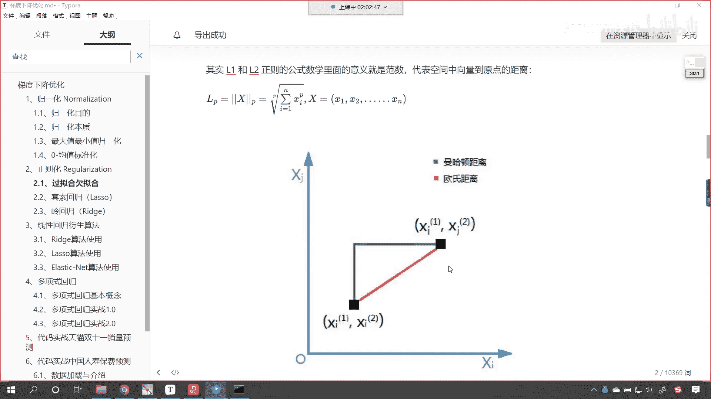

在与我们的训练数据上，咱们的准确率要高，在测试数据上准确率也高，也就是说嗯就是测试数据，也就是咱们的这个实践，那也就是在实践中效果好，那我们就可以认为这个拟合就特别好看。

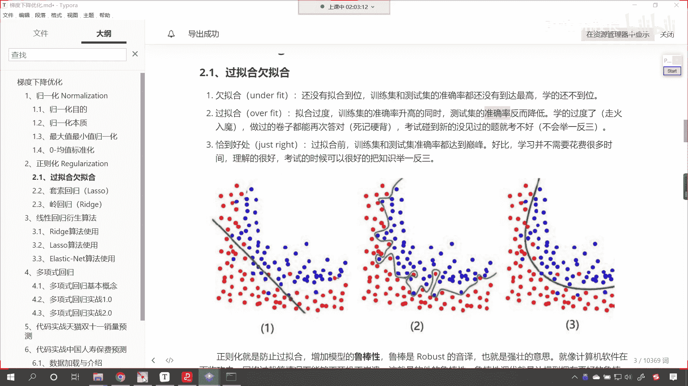

你比如说咱们这个图片当中的三，你看如果我们要这么划分的话，我们对于一个新的点在进行划分的时候，是不是十有八九，咱们就可以把新的点规律给它进行一个划分呀，对不对，如果你要是在这边是吧。

在这个抛物线的右上角，咱们是不是一般就把它归到蓝色的这个点呀，对不对，我们知道咱们的模型不可能是完美的。

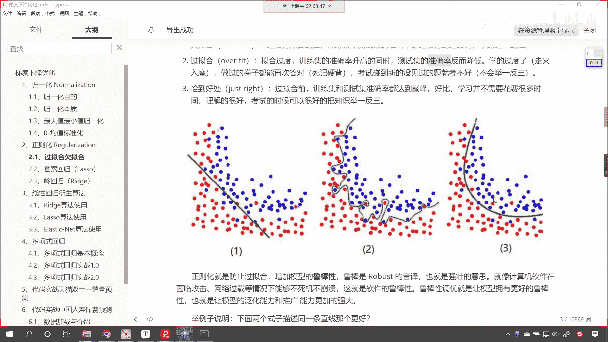

我们准确率高，也不可能到百分之百。

两个都高最好，但是他们俩之间会有一个平衡。

知道吧，会有一个平衡好。

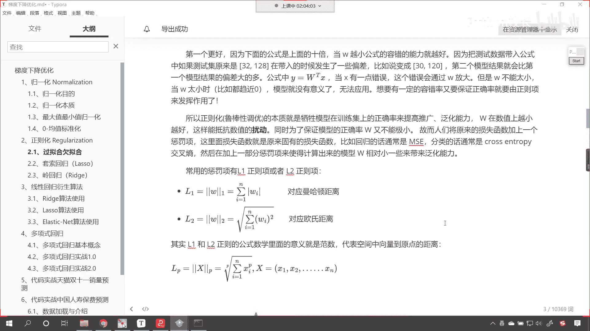