# P87：4-L1正则化稀松性缩小系数到0 - 程序大本营 - BV1KL411z7WA

往下看好，那么到此为止，咱们已经知道了这个l1 ，你看虽然它是各个权重的绝对值。

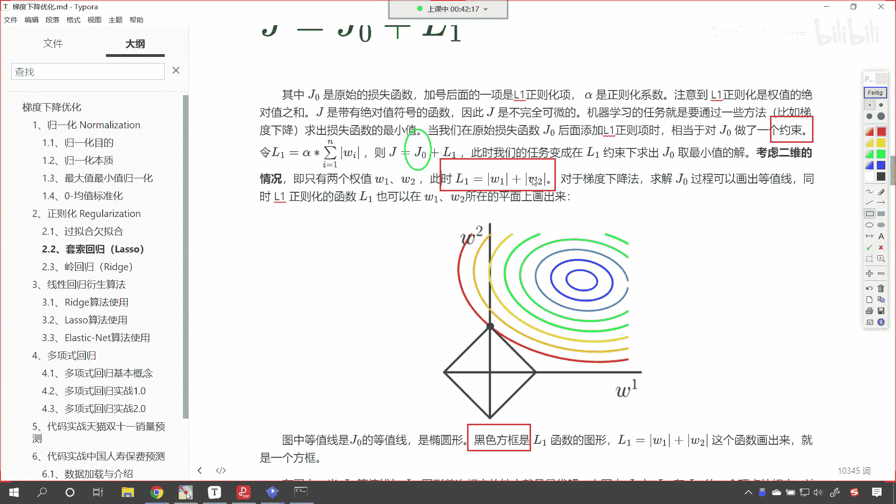

但是他如果要画出来图，那就是这个样的，看到了吧。

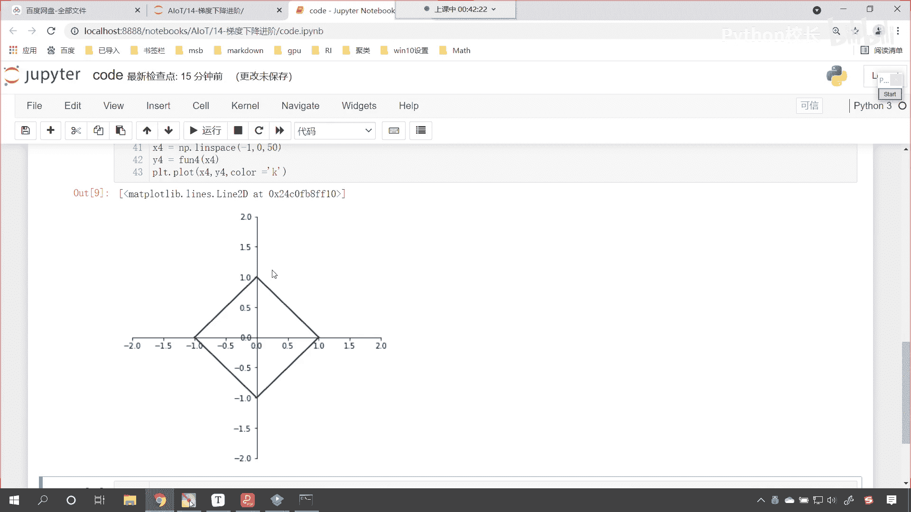

画出来图的话，你就是这样的，对不对，那接下来呢我们再来看啊。

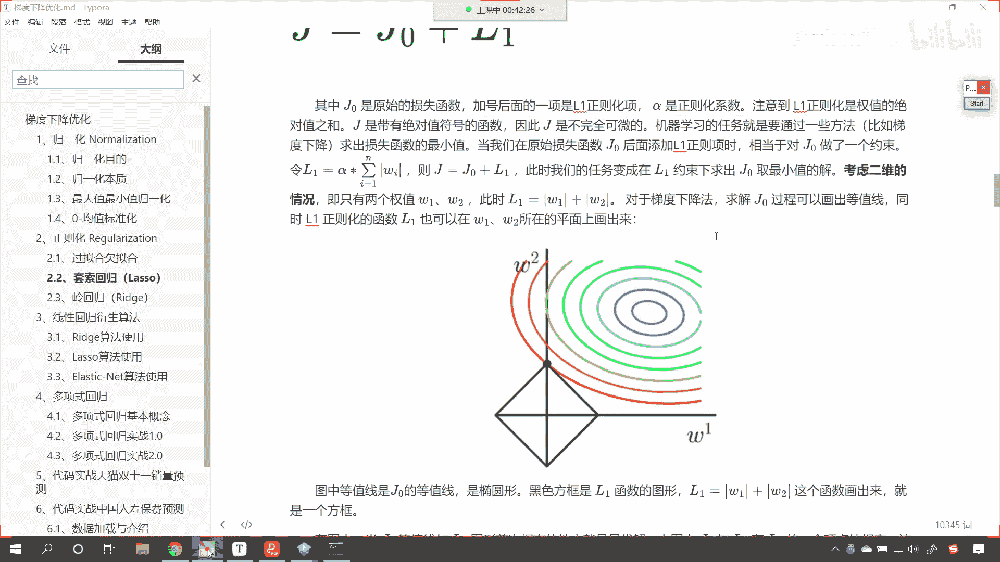

咱们知道了这个约束对不对，你想对于我们的j0 而言，看咱们的j0 而言，这个j0 是什么呀。

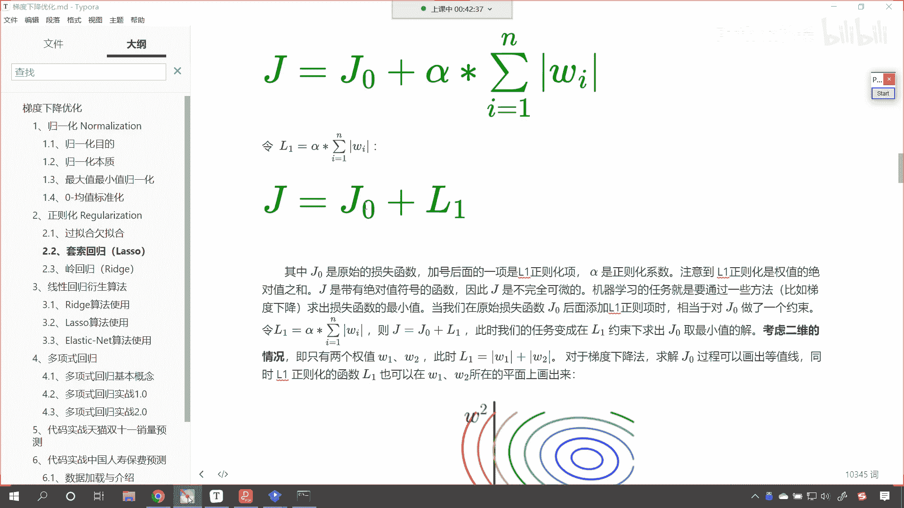

这零是不是就是最小二乘法呀，最小二乘法的公式。

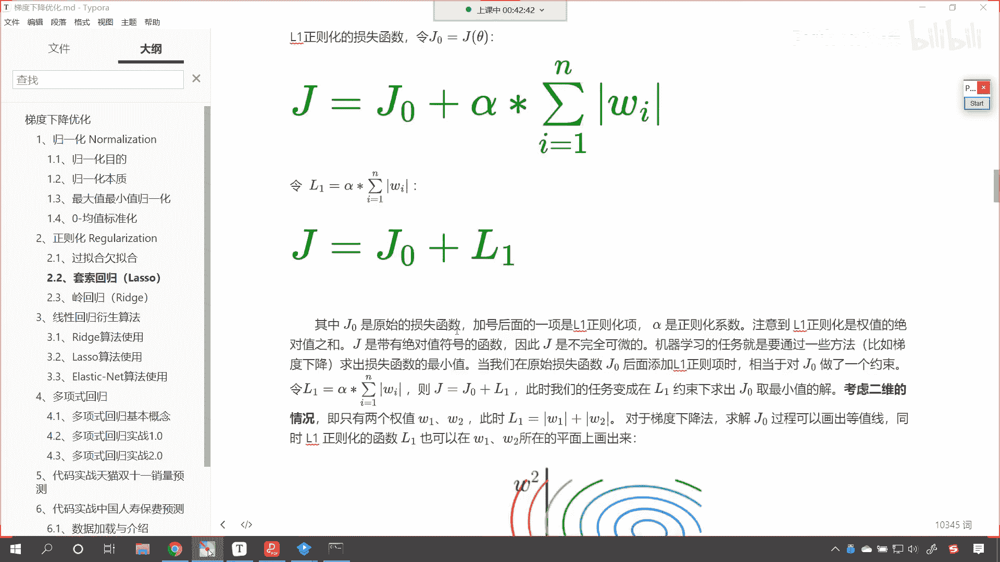

你看它长什么样，最小二乘法的公式，各位小伙伴是不是能够看到这有一个平方呀，看到了吧，这有一个平方，那如果这个地方有一个平方，你是不是叫可以想象一下把它画出来图，它会是一个什么样的图形呀。

如果我们要把它画出来图形，你想一下它是不是就是一个圆呀。

它是不是就是一个椭圆呀，注意啊，现在我们有小伙伴在这个在这个群里边儿是吧，呃说了它呢是一个这个凸函数，对不对，它是一个凸函数，那你是把它想成这种方程了。

你看如果要是凸函数的话，你看你把它想成这种了，y呢就等于x的平方，咱们现在用markdown的形式看来书写，你看你把它想成这样了，dollar dollar y就等于x嗯平方，然后加上三倍的x。

你看你如果要是把它想成这样，那么它画出来就是一个抛物线，但是现在你要发现啊，你看我们的公式当中，看看咱们的公式当中，比如说这个时候呢我们来一个markdown好，咱们公式当中呢是这个x和y呢。

它减了一个y，这个x呢是比如说3x减了一个y，然后三，然后呢再来一个平方，如果我们要把这个函数画出来看，如果我们要把这个函数画出来，那么咱们得到的结果它会是一个椭圆，知道吗，它会是一个椭圆。

你看这个会是一个椭圆。

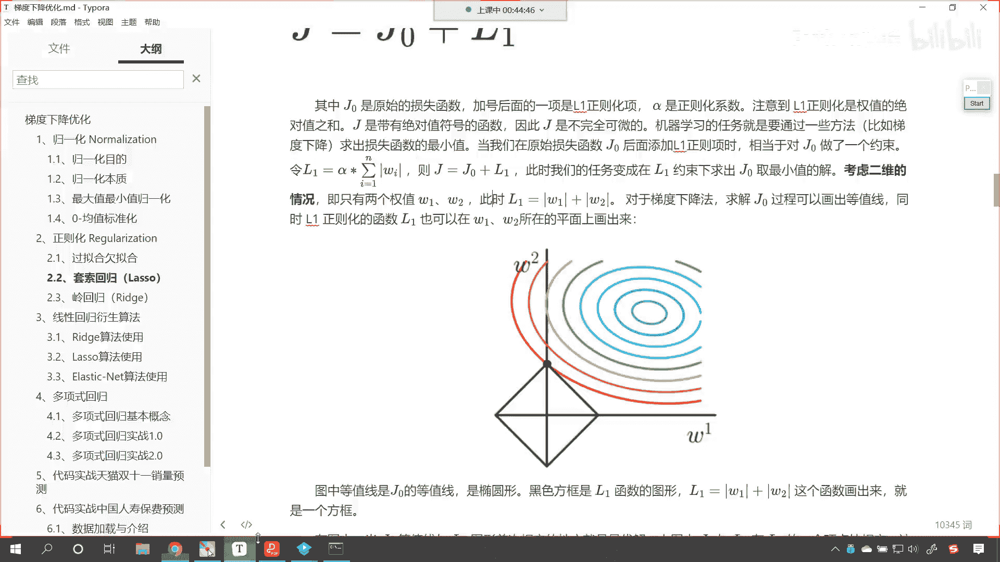

所以咱们看到的是看，所以咱们看到的是这种情形。

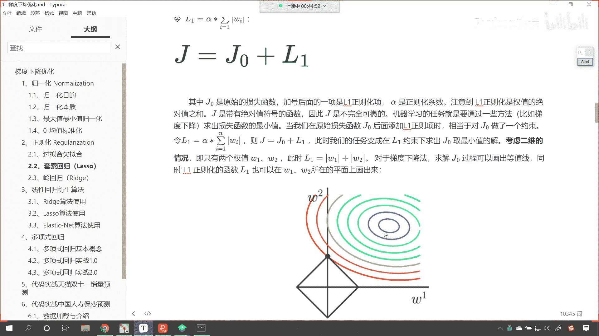

你看上面的方程，是不是hc塔x减去y i啊对吧，h c塔x i减去y i带着一个平方。

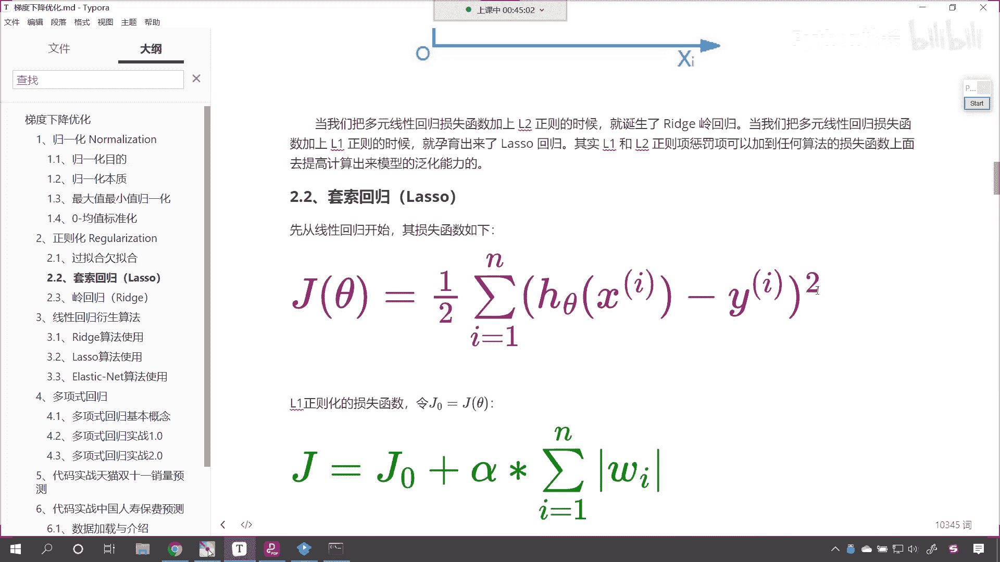

所以我们画出来唉，它会是一个这个椭圆好。

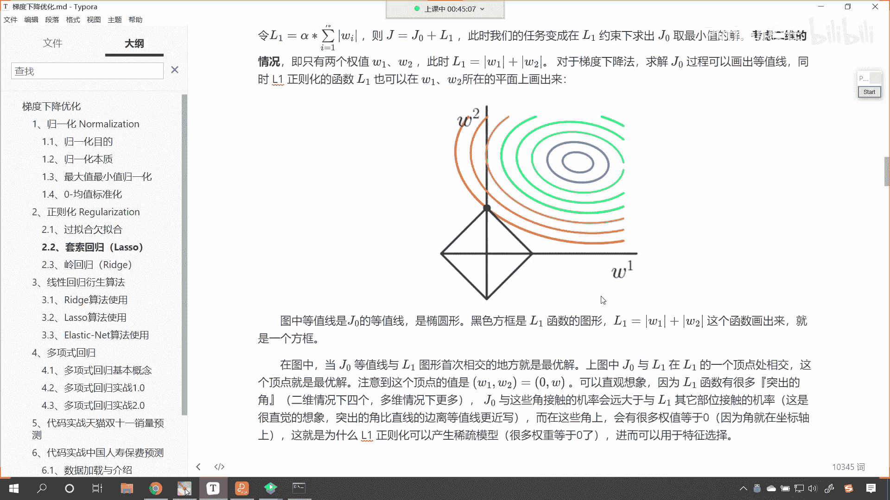

那么到了这之后呢，咱们就可以继续向下走了，既然咱们的约束条件是一个菱形，是不是就是这个黑色的菱形，在咱们的途中，当我们的j0 的等值线，与l一图形首次相交的地方，那这个就是我们的最优解。

那上图当中的g0 与l一在l一的一个顶点处，它进行了相交，各位小伙伴就能够看到，我们呢是在这个地方进行了相交，那么这个点就是咱们的最优解最优解，那这个点我们就能够发现，咱们的这个w一呢是零。

其中有一个数值是不是零呀，因为这个解它是不是在咱们的这个y轴之上，对不对啊，所以说你看它就有一个零可以直观的想象，现在呢我们就把自己的这个想象呢唉发挥一下，你想我们现在给的是两个特征。

是不是w1 w2 啊，那你想如果我们的数据比较复杂，比如说我们这个多维，你看咱们的数据是多维的，现在假如说你进入三维空间，四维空间，五维空间情况是不是也是类似的呀，对不对，情况也是类似的。

咱们l一的函数呢它会有很多突出的角啊，它也有这些突出的角啊，只不过我们现在没有办法画出来，只能想象我呢通过一个二维的，通过一个通过一个这个平面的，告诉你它长什么样，那你就只能发挥想象。

想象它在三维空间跟这个也是类似，只不过比这个复杂一些，所以你有没有发现咱们的j0 ，也就是说咱们这个等高线与这些角接触的概率，是不是远远大于与l一其他部位接触的几率，因为我们等高线在绘制的过程当中。

画着画着是不是更容易和这个角进行接触呀，对不对，那所以说呢咱们使用螺丝回归，咱们使用这个套索回归求解出来的系数，我们就会有一部分系数等于零，这个时候呢就有很多权重等于零，从而呢它可以用于特征选择。

为什么等于零了，就可以用特征选择了，你想你这个特征是零，是不是就说明有你和没你是一样的呀，那这个特征就可以怎么样，这个特征就可以删除掉，知道吧，这个特征就可以删除掉，那既然很多权重是零了。

我们把这个所产生的模型，咱们呢就叫做稀疏，就就叫做稀疏模型，这什么叫稀疏呢，和稠密是相反的一个词，什么是稠密呢，是不是啊，你看说这个人的头发是吧啊，很浓密，说这个人的头发很稀疏，很这个稀疏。

你看一下葛优，你就知道什么是稀疏了，稀稀拉拉的，是不是，那对于我们的方程机器学习的这个模，这个模型而言，咱们这里所说的稀疏哎，就是它的很多权重等于零了，只有只剩下一部分权重是存在的，那你既然权重是零。

那么我们就可以根据，根据这个咱们得到的这个权重，把权重等于零的这个特征我们给它删除掉，因为它不重要，我们有同学问了一个问题，没有办法进入，咱们只能想象，但是数学家呢在数学的这个王国里边儿。

它呢是存在高维的，你比如说我们的数据啊，你比如说咱们的这个呃，咱们在这个代码当中所展示的数据，看我给你举一个例子啊。

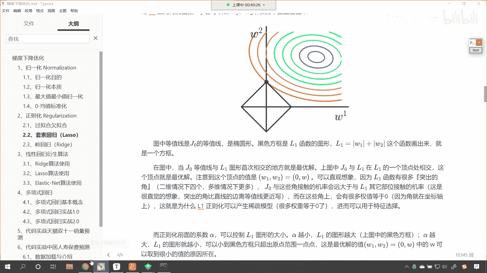

比如说np。random，咱们来一个run int，我们从零到十，咱们给一个size，你比如说这个时候呢，你看你我给一个十，咱们可以把这个数据叫做一维的，那如果我想要创建二维的，咱们np。

random randoint，从零到十，从零到十，咱们给一个size，我们让这个size是五行三列，这个时候你看我一执行，我得到的这个数据是二维的，它是不是既有行，是不是又有列呀。

那我假如说创建一个三维的呢，你看np。random rint，从零到十，咱们给一个size，那这个时候我给一个345，那我们得到的这个数据是三维的，三维的，就是咱们生所生活的这个现实世界是吧。

立体的长宽高，那还有更高的数据呢，你看我给一个六，我给一个七，我给一个八，你看你把你所看到的这个数据，你看你所看到的这个数据，它呢就是六维的，看这个数据就是六维的，那这个数据长什么样呢。

这个数据如何进行呈现呢，现在没有办法进行呈现，你看过刘慈欣的小说叫三体，那个里面有一个专业的这个外星文明，攻打地球的术语，叫做降维打击，是不是降维打击啊，这是科幻当中这个所说的。

比如说咱们现在有一个一滴水是吧，一滴水是不是三维的呀，如果说我们把一滴水给它降维降到二维的，以为没了，是不是啊，那就是那那这滴水可以平铺，它可以平铺多大的一个面积，多大的一个范围啊。

哎那就是整个宇宙是吧，非常非常薄是吧，它可以铺开铺的面积非常大。

所以说呢在这个地方是吧。

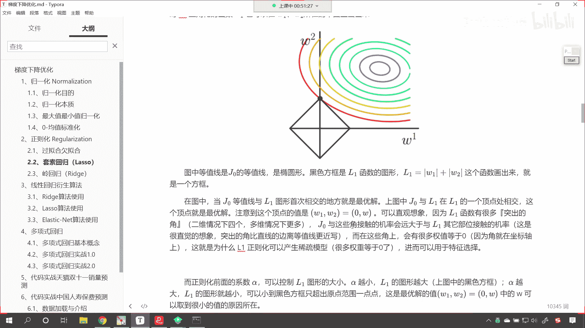

大家只要理解咱们的二维就可以了，看你只要理解二维就可以了，你看二维我给你画出来了，各位都容易理解是吧，眼见为实，三维咱们很难画出来，四维五维六维，那这个就更画不出来了，但是道理是类似的。

你要知道道理是类似的，你在二维当中你发现的场景是怎么样的。

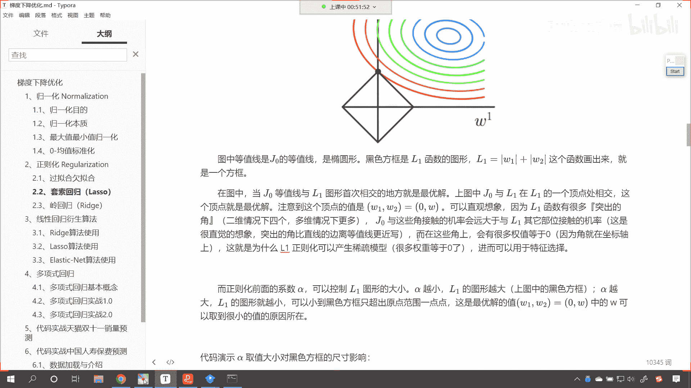

那么它在三维当中也是类似的，你看在二维当中，我们在进行求解的时候，你你就能够发现嗯，是不是咱们这个等高线，咱们这个等直线，是不是最容易和咱们这个点进行相交呀。

是不是是不是和咱们这个角进行相交呀，那么在三维四维，五维六维也是咱们所说的三维四维。

五维六维哎，我们指的是特征啊，咱们指的是特征，你比如说咱们之前讲到的。

看我们导一个包啊，看from sk learn点啊，咱们导入import data sets，那我们data size咱们漏了一下，之前咱们是不是介绍过波士顿房价这个数据呀，对不对。

咱们就return x y给他来一个true，那我们接收一下叫x和y，这个时候你看我查看一下咱们xy。shi，各位小伙伴就能够发现是不是560和13呀。

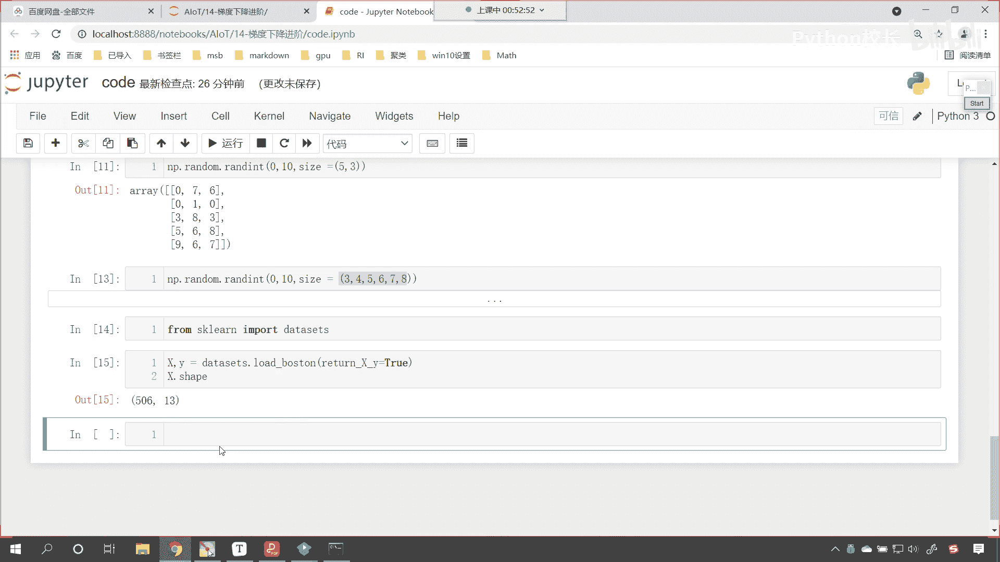

来打印输出他的前五条数据，各位小伙伴唉，你看到的这个数据是这样的是吧，咱们现在呢对于它进行一个设置叫set print，我们不让他使用科学计数法来一个super press，我们让它等于true。

这个时候各位小伙伴，你看到的数据是这样的，是不是，那请问咱们波士顿房价这个数据，它是多少维的数据呀，就是我们的特征是多少维的，你看咱们特征是几个是吧，或者说咱们的特征是多少维的数据，一个意思啊。

各位小伙伴就能够看到，这个是不是就是13维呀，那13位，你想象一下它是不是就对应着13个系数呀。

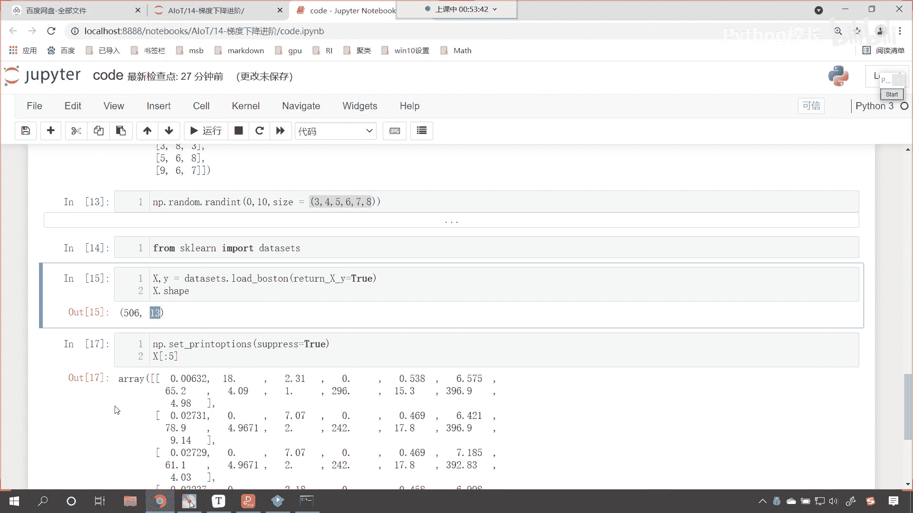

回到我们的这个回到咱们这个呃这个课件当中，你在看这个图形的时候，你想象一下，如果说要是有w1 w2 w3 ，一直到w 13，你想你这个图形怎么画，是不是你想这个图形怎么画，是不是就很难画了，但是没关系。

你只要理解二维就行了，知道吗。

所以说呢咱们l一正则化，我们在进行运算的时候，咱们得到的结果当中，这些系数呢就有可能一部分为零。

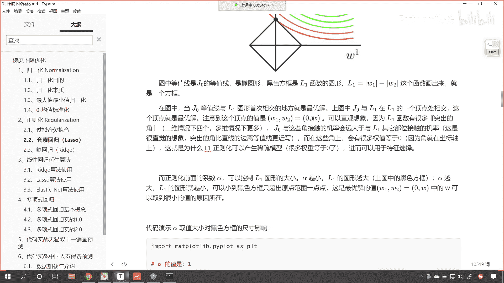

从而呢我们可以进行特征的筛选，正则化前面的系数叫阿尔法，它呢可以控制l一图形的大小，阿尔法越小。

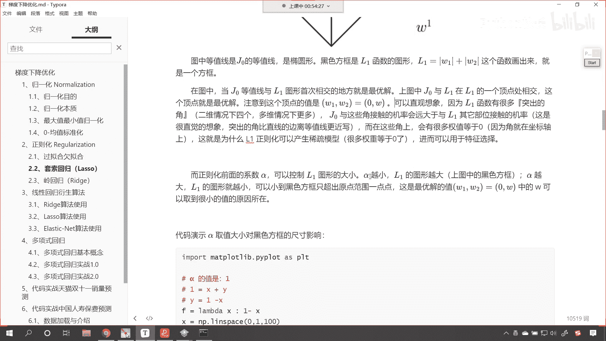

咱们的l一图形越大，看啊，你看咱们的这个l一的。

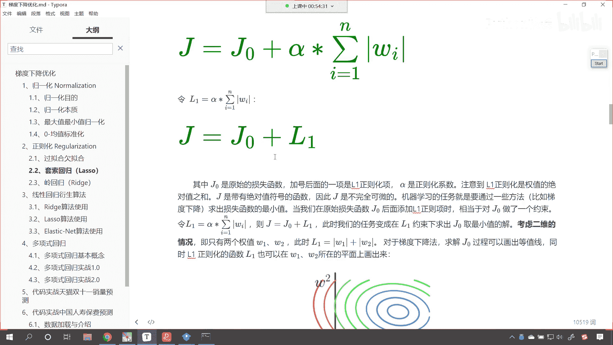

前面是不是有一个阿尔法呀，看到了吧，这是不是有一个阿尔法这个地方说了一句。

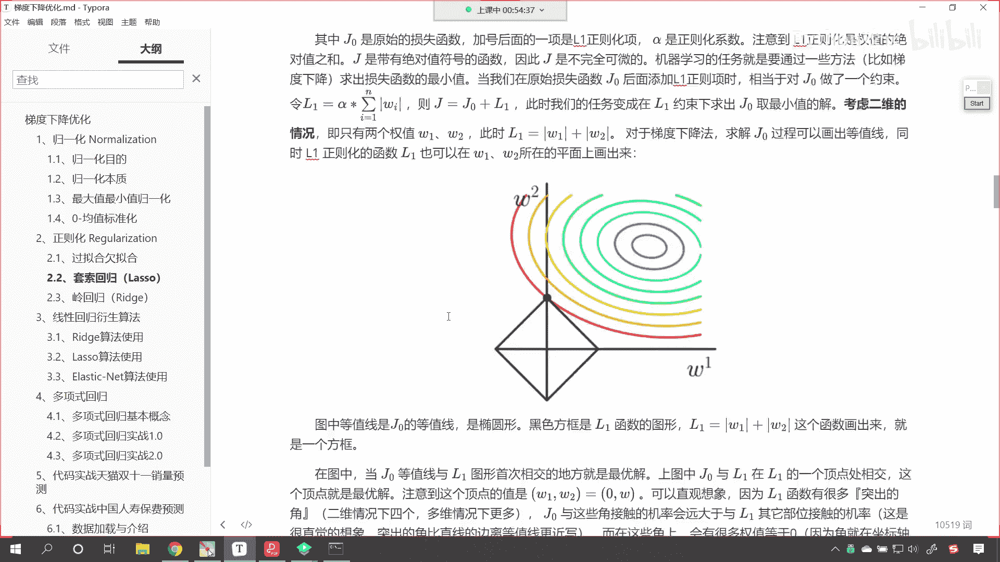

说这个阿尔法的可以控制l一图形的大小，l越小，l一的图形是不是越大呀，来现在我给你证明一下，回到咱们的这个代码当中。

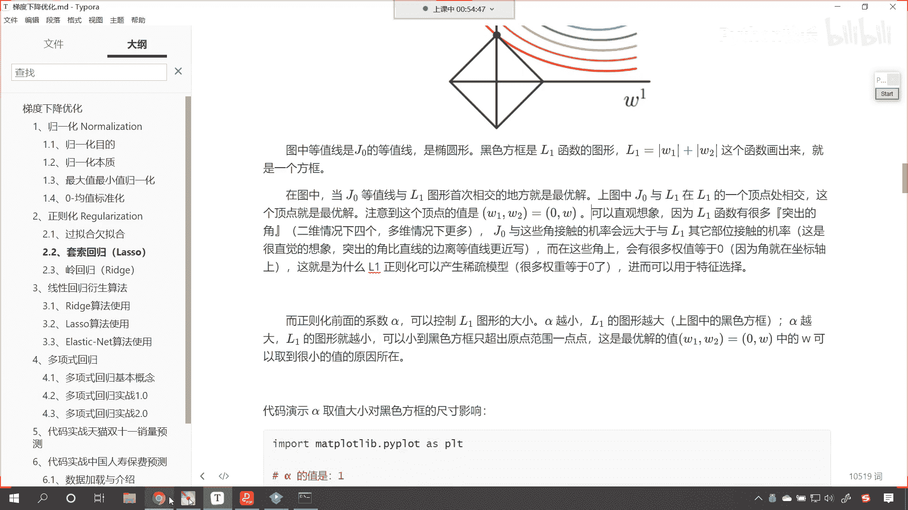

你看咱们上面是不是画了一个呀，那上面咱们再进行操作的时候，我们假设x y都大于零，你想咱们是不是这个阿尔法我们就给了，那此时的这个阿尔法，a l p h a阿尔法是不是就等于一呀。

此时咱们就令阿尔法等于0。5啊，我们就令啊a l p h a阿尔法就等于0。5，那如果他要是0。5的话，你想咱们这个数值是不是应该变大呀。

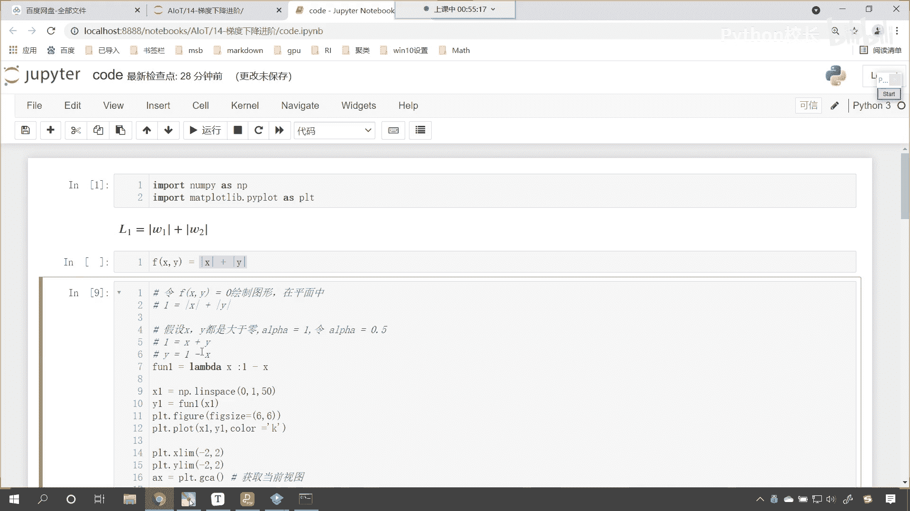

根据他的说法，阿尔法越小l一的图形是不是就越大。

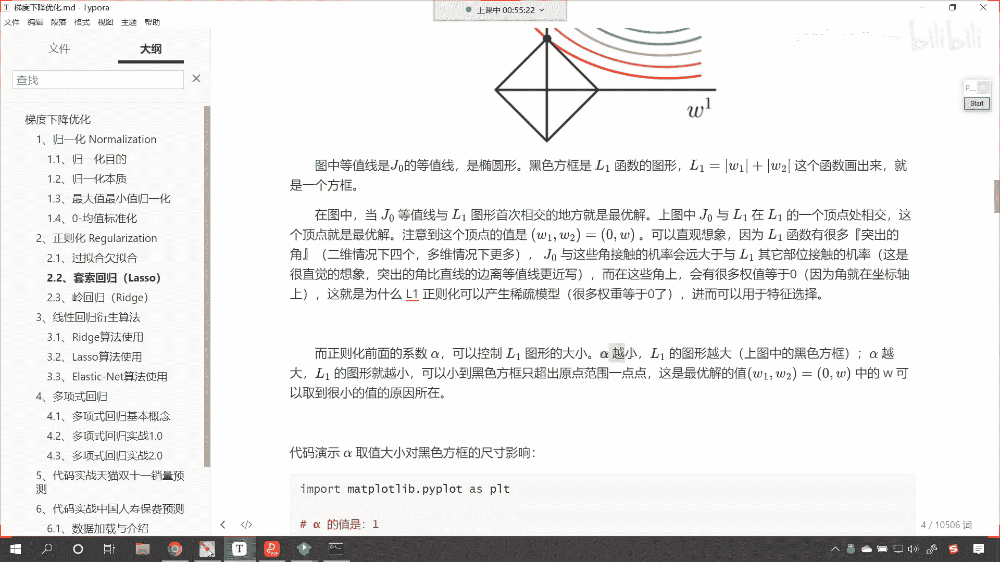

如何证明来咱们就回到这儿啊，你看你既然阿尔法是0。5了，那这个地方是不是就是0。5乘以，咱们后面这一堆呀对吧，那就是0。5乘以x和y，对不对呀，那这个时候我们调整一下，既然是0。5，那左右两边都乘以二。

这个时候是不是就变成了二减x呀，看到了吧，这个时候就变成了二减x，那我们的方程也得发生一个变化，那这个时候就是二减x，咱们在进行绘制的时候，我们把颜色给它修改一下，这个颜色呢咱们让它是g。

这个时候你看我一直行来，各位小伙伴就能够看到，你看范围是不是变大了，范围变大了，咱们同时呢将它的坐标范围也给它调整一下，上面我们的范围是0~1，咱们现在呢将这个范围给它调整成二。

这个时候你看我一执行看到了吗，其中第一象限的这个范围，是不是由原来的这条线，是不是变成了绿色的这条线，你就能够看到我调整谁呢，我调整阿尔法，把阿尔法变小，咱们是不是这个图形就变大了。

哎所以说这就是他所说的阿尔法越小。

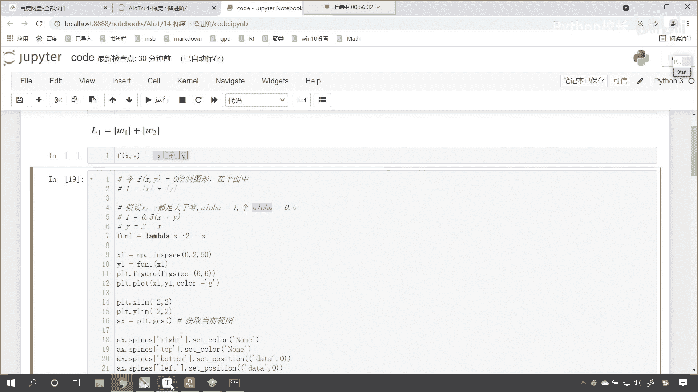

咱们的l一图形就越大。

是不是阿尔法越大，咱们l一的图形就越小，所以说呢，我们可以通过调整阿尔法的大小来控制，看通过调整阿尔法的大小来控制什么呢，来控制咱们所得到的系数，它的大小通过调整它，我们就可以把w1 。

w2 控制在一个很小的范围内看啊，这句话很重要，看啊控制在很小的范围内，看到了吧，可以控制，那接咱们上一课所讲到的归一呃，正则化，我们说为什么会出现过拟合，是不是方程的系数太大了，对不对。

之所以会出现过拟合，是因为方程的系数太大，想要防止过拟合，咱们就想方设法想方设法把方程的系数降低，现在你看l一正则化，是不是可以把方程的系数降低呀，看到了吧，很小是不是啊，唉所以到此为止。

