# P88：5-L1正则化套索回归权重衰减梯度下降公式 - 程序大本营 - BV1KL411z7WA

去往下看。

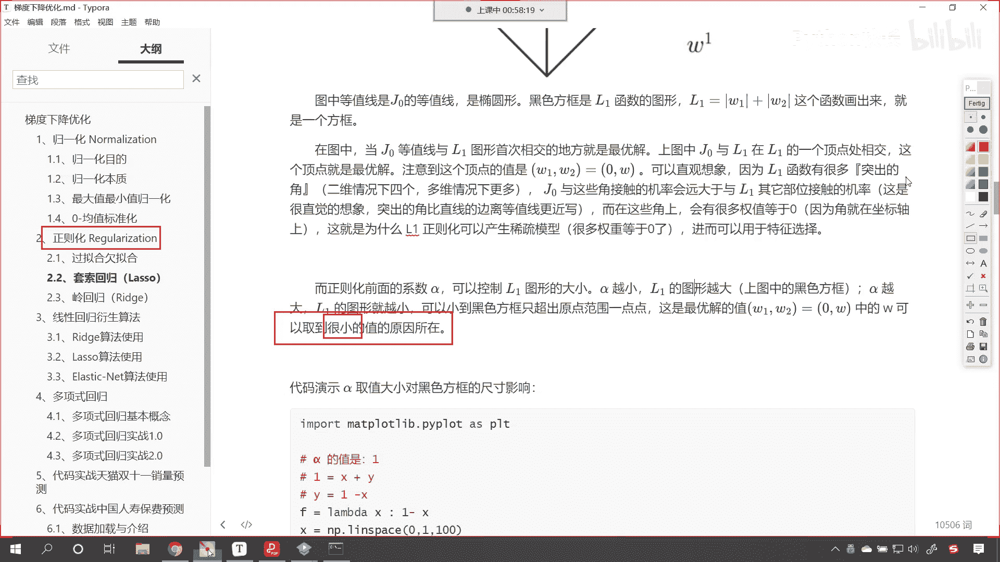

好那么这个图形呢咱们已经绘制了嗯。

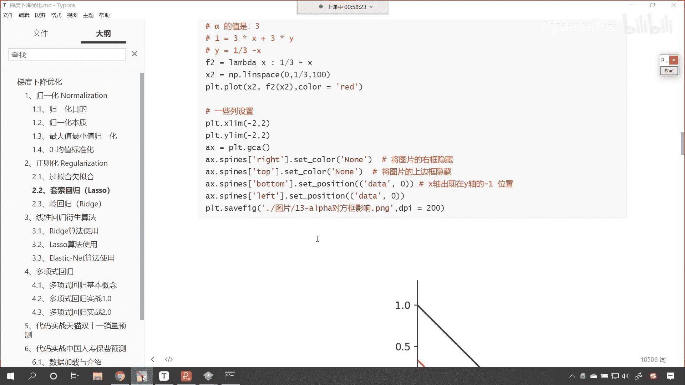

接下来呢我们就看一下咱们的权重更新规则，那具体的权重更新规则呢，哎其实呢这个里边就用到了咱们的嗯，这个梯度下降。

好各位小伙伴就能够看到嗯，这个就是咱们上面的方程。

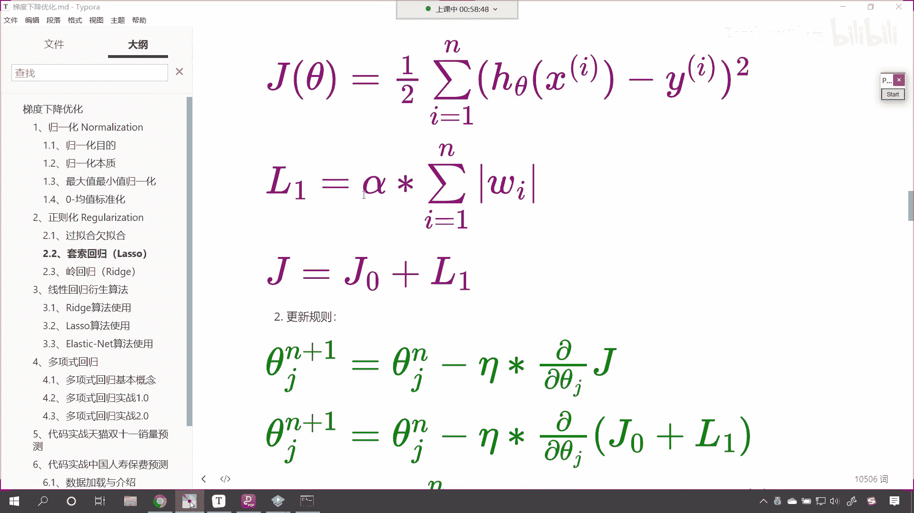

那根据我们之前所讲的梯度下降，咱们知道梯度下降的更新规则，是不是就是一个学习率乘以它的梯度。

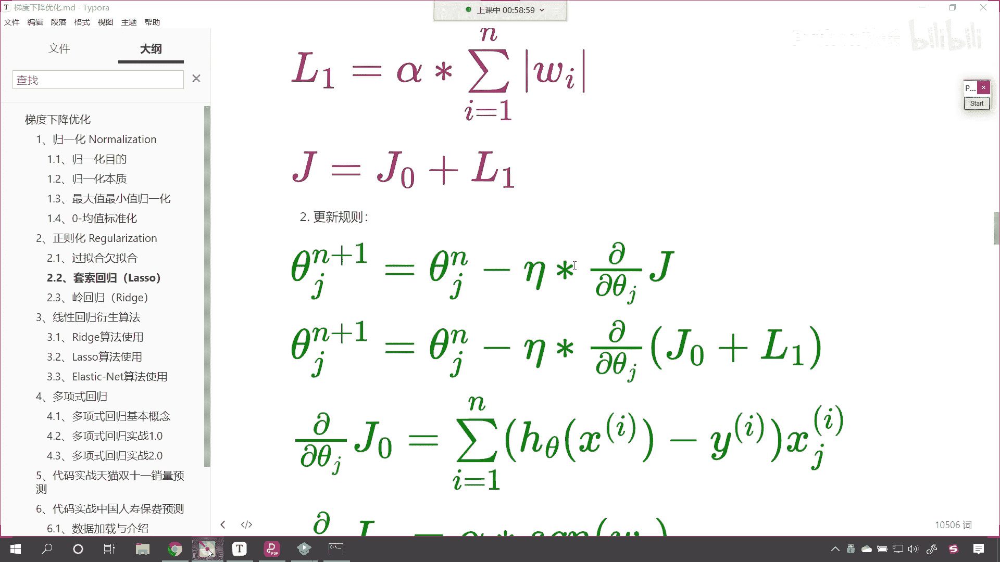

对不对，你看学习力乘以它的梯度，那我们的j呢是套索回归它的损失函数，那这个g呢就等于j0 加上l一啊。

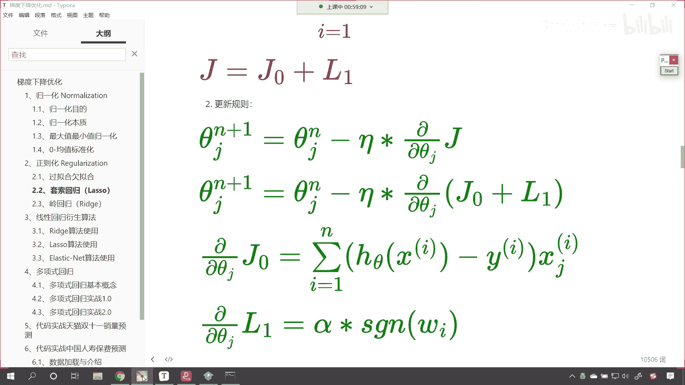

这零加上l1 ，那我们的g0 是咱们之前学过的线性回归，这个简单我们如果要对它求导数的话，你能够知道导数，咱们之前推导过，这个就是咱们线性回归的导数，我们有一个新的啊，我们加了一个新的正则项。

这个新的正则项就是咱们的l1 ，那我们如何对l一进行求导数呢，刚才咱们在群里边有一位同学说到了，说这个导数它是带符号的，有有绝对值怎么办呢，哎咱们可以通过分段对它进行求解，那如何进行分段求解呢。

也就是分正负，对不对，分段求导数也就是分正负啊，叫做分段求导数，是不是就是分正和负呀，对不对，也就是分正负之分，是不是分象限，那大家看啊，咱们如果想要对l一求导数。

那咱们可以是阿尔法乘以s g n w i，你看这个s g n w i这个表示什么。

哎大家看啊，这个s g n w i它表示什么啊，这个s g n呢它是符号函数啊，这个就是符号函数，它作用就是只是正负，它的值呢就分两种情况，一个是一，一个是-1，看到吗，一个是一，一个是-1。

所以说咱们的s g n w i，它就它呢就是当你w i大于零的时候，你想你w y大于零，那如果我要对你求导数，你是不是直接就是一呀。

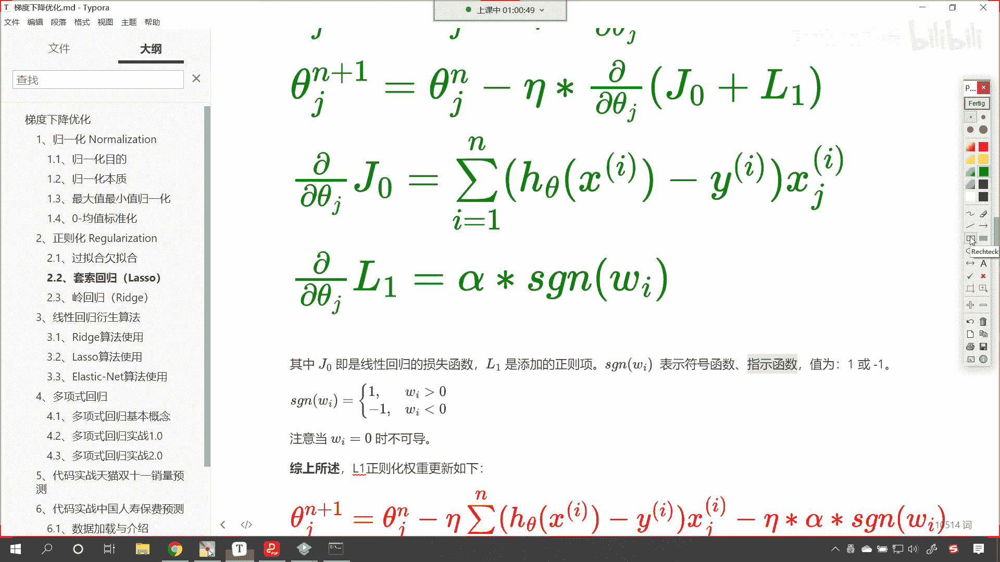

对不对，因为你这句因为你再看它的公式啊，因为你再看它的公式。

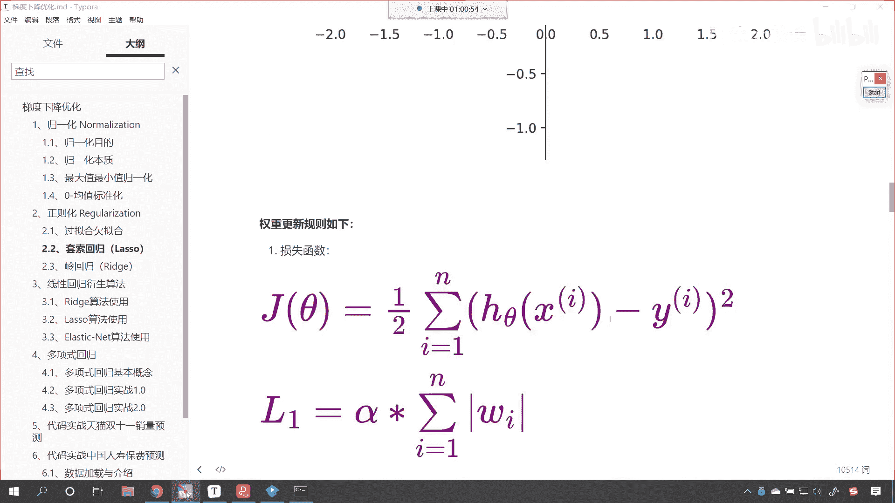

你看如果我要对于这个公式求导数，看到了吧，我要对这个公式求导数，咳是吧，咱们先不考虑它求和呢，咱们假设说它是正数，那你想正数的话，你这个符号是不是就得去掉呀，绝对值符号去掉。

绝对值符号去掉咱们所要求的这个未知数，你看它是w它是不是一次幂对它求导数，那求求得的结果是不是就是一呀，看到了吧，对它求导数，你结果是不是就是正一，你想是不是对它求导数，结果是不是就是正一。

如果说这个是负的呢，如果他要是负的，他要把这个绝对值符号去掉，那是不是得需要在它的前面加一个-1呀，所以说咱们l一正则化求导之后的结果。

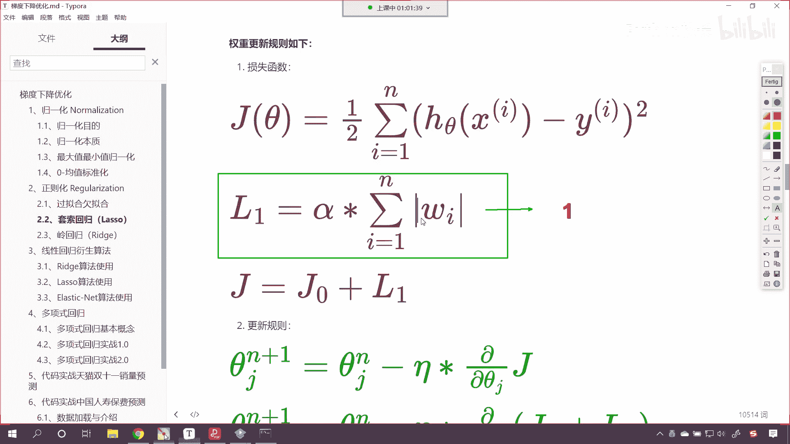

哎就是咱们下面所写的叫做sun w i要么是正一。

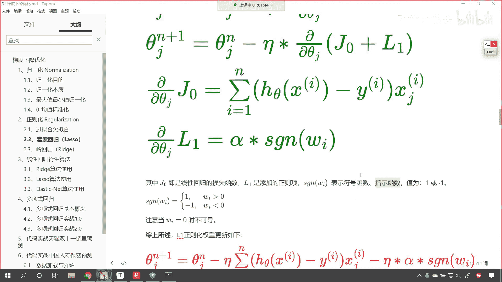

要么是-1，注意当咱们w y等于零的时候，这个时候他不可导，所以说呢这个时候呢，哎就不存在w i等于零的情况，w i等于零的话，咱们直接跳过。

不需要再进行计算了，综上所述，咱们l一正则化权重，它的更新规则如下，看到了吧，之前这个梯度下降更新咱们是不是专门讲过呀，看梯度下降的更新，咱们专门讲过，现在你看我画出的这一部分，看我画中的这一部分。

是不是就是咱们之前所讲的梯度下降，看大家看啊，这个就是梯度下降，我们l一正则化和之前不一样的地方，就是咱们多了后面这一项，看到了就是多了后面这一项，那多了后面这一项，各位小伙伴你来看一下。

我们来分析一下啊，看他会多了这一项他会怎么样，咱们的一塔是咱们的学习率，就是咱们的不服，咱们的阿尔法，它必须得是大于零的，这个阿尔法呢唉是咱们正则化的系数，你看这两个都必须得怎么样，都必须得大于零。

你看前提就有限制了，表示梯度下降的学习率，这个表示l一正则化的系数，那就分两种情况了，当w i为正的时候，你看也就是说你的w i为为正数，也就是这个系数为正，那你想这个sw i是不是一。

那我们做了后面这一堆减法，是不是就相当于减去一个大于零的数值呀，你想你wa是正的，现在呢你又减去了一个大于零的数值，所以说这个w i会怎么样，所以说这个w i是不是它会变小呀，对不对。

所以说你看它会变小，对不对，这一点能理能理解吧，那我们接下来再来看啊，那变小的话，你可以认为它是不是在向零靠近呀，那还有下面这种情况，各位小伙伴也能够看到我们下面这种情况，那w i w i为负数的时候。

那大家想他是不是就是这个sw i，是不是就是-1呀，你想你减去一个负数，看到了吗，你减去一个负数，是不是就相当于直接加上咱们这一项看到了，因为你这有一个food，你这有这也有一个负的。

根据我们之前所学的数学公式的这个原理，是不是叫负负得正呀，对不对，所以说就相当于直接加上一塔乘以a，你加上一个，你看啊，你加上这个值之后，咱们这个负的wi是不是就变大了啊，负的w y又变大了啊，注意啊。

我们-3大还是-5大，你告诉我-3还是-5大好，咱们有两个数，是不是一个是-3，一个是-5，哪个大呀，是不是咱们的-3要大一点呀，对不对，所以说这个w i它呢就变大了，那它是向哪个方向走呀。

它的绝对值变小了，看到了吧，绝对值变小了，也就是说我们的系数无论正和负啊，无论正和负，你的这个绝对值越大，表示它在方程当中它的这个变化幅度就越大，那我们如果想要避免过拟合，想要避免过拟合。

那么我们就得需要让系数的绝对值变小，知道吧，就得需要让系数的绝对值变小，所以说各位小伙伴就能够看到，你看当咱们的这个是-1的时候，就相当于直接加上咱们的这个一塔乘以a，那此时的这个一塔乘以a呢。

这个地方给写错了啊。

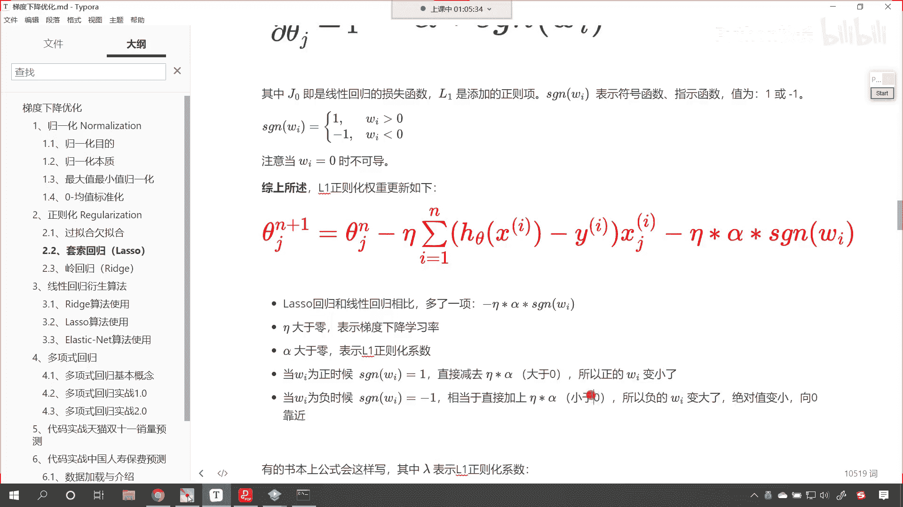

这个一塔乘以a他呢也是看大于零的，只不过一个负数加上大于零的值，所以说呢你想它就变大了，绝对值呢是变小，它是向零靠近，所以各位小伙伴你就能够看到。

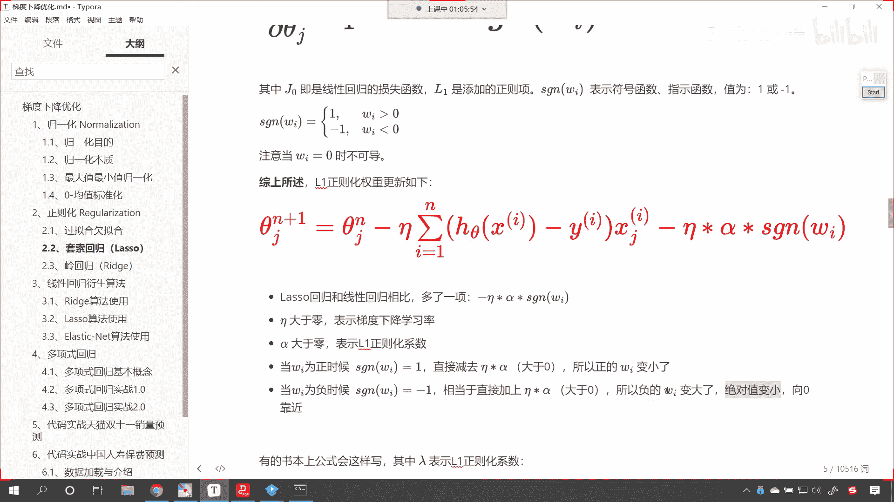

无论我们的系数，无论我们的c塔，无论我们的系数w它是正的还是负的，只要他加上了咱们的l一正则化，那么总体的一个趋势，看它总体的一个趋势是不是都是绝对值变小，向零靠近呀，看到了吧，哎咱们总结一下啊。

看咱们总结一下，也就是说l一这个正则化之后，咱们的系数它呢绝对值变小，无论你是正还是负，那么你的绝对值呢是变小的啊，绝对值变小，绝对值变小，你看有一个好处，是不是我们的方程你的系数小了。

方程是不是就简单了呀，这个时候就可以起到防止过拟合l一正则化，看l一正则化，最后我们缩小咱们的系数呢，可以变成看它的系数可以变成零，为什么啊。

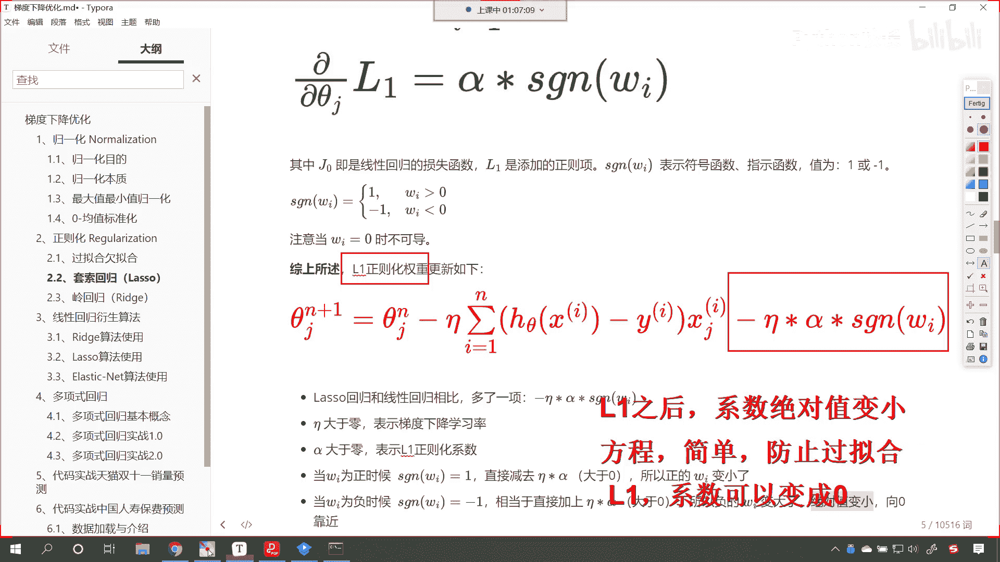

系数可以变成零，你想是不是上面咱们画图演示了一下呀。

对不对，因为呢咱们的这个l一正则化，它所对应的它所对应的这个图形呢，看它所对应的图形，它突出的角唉都在咱们的坐标轴上。

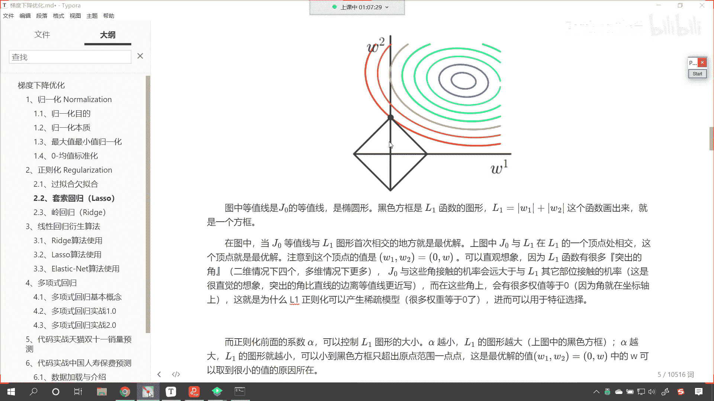

唉，所以说呢咱们求解出来的值呢，哎是有可能等于零的啊。

那么有的书本上在书写公式的时候，它使用lambda来表示l一的正则化系数都可以。

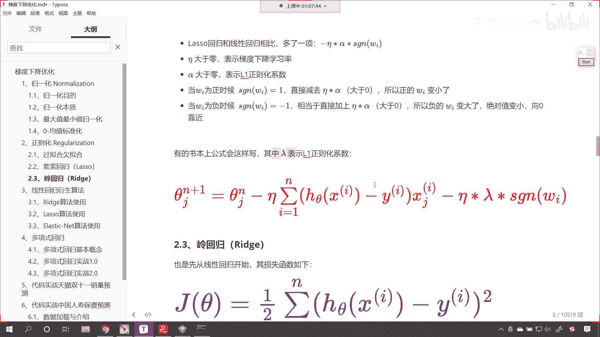

你看公式是一样的啊，你对比一下，看对比一下我们下面这个公式，看咱们上面这个公式使用了阿尔法，下面这个公式使用了朗姆达公式都一样好，呃到此为止，咱们就通过绘图，咱们通过公式。

我们就推导了一下咱们的这个套索回归。

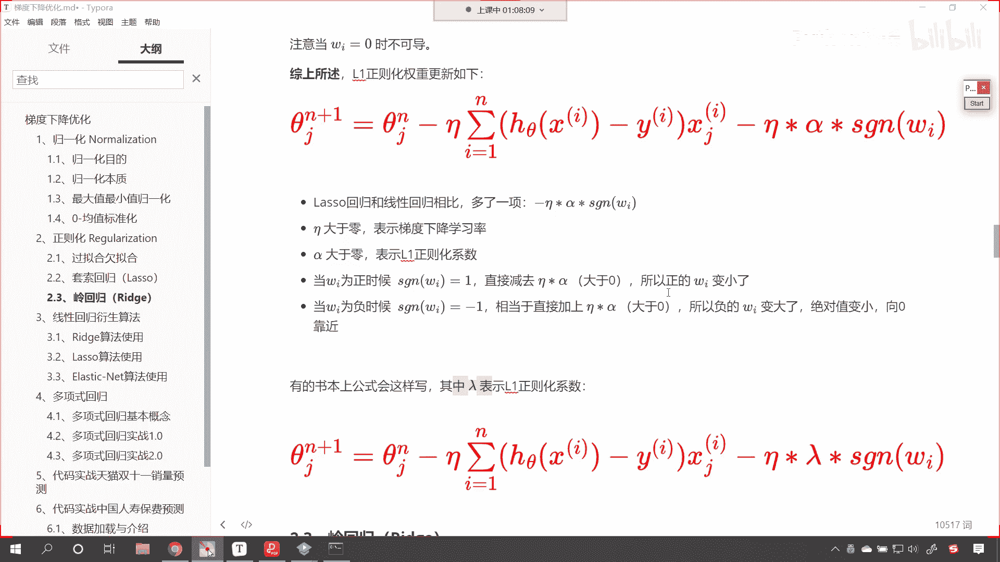

套索回归。

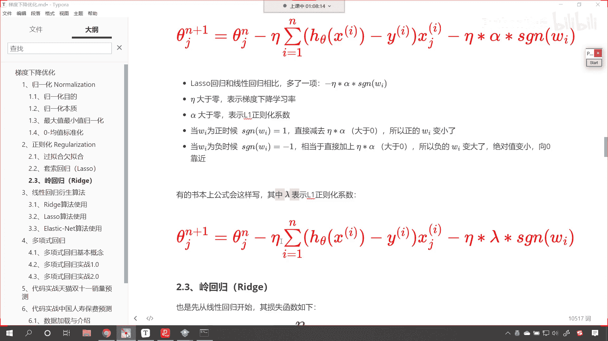

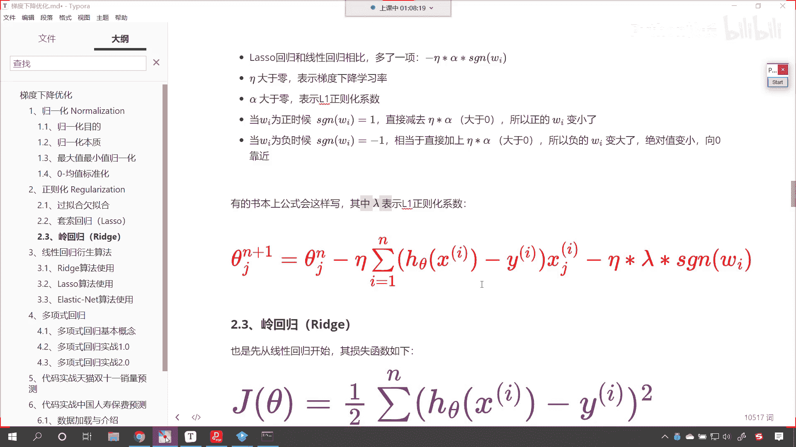