# P89：6-L2正则化岭回归原理详解 - 程序大本营 - BV1KL411z7WA

往下看好。

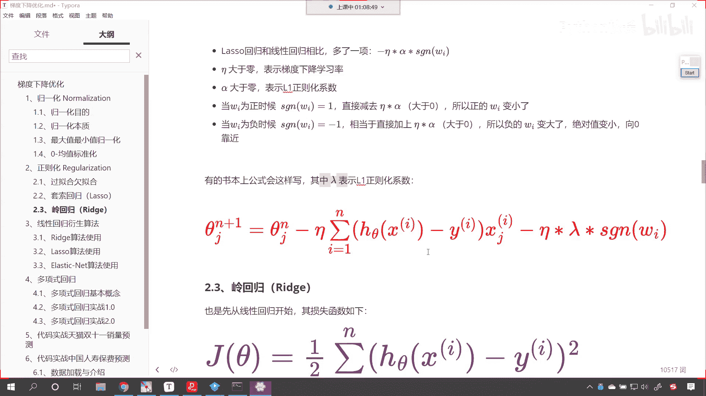

那么介绍了套索回归之后，咱们再看一下领回归，上一节课咱们介绍了说这个正则化分两种方式，一种是l一范数，另一种是l2 范数。

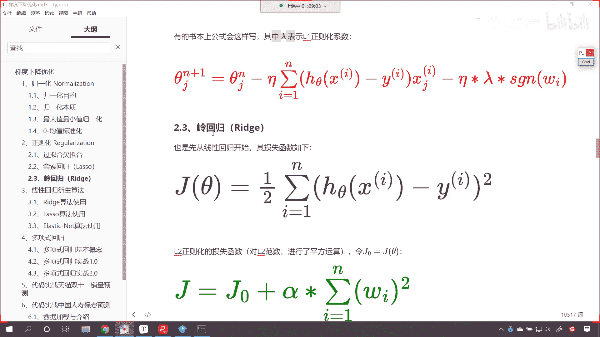

那我们刚才介绍的就是l一范数，接下来咱们看一下l2 范数。

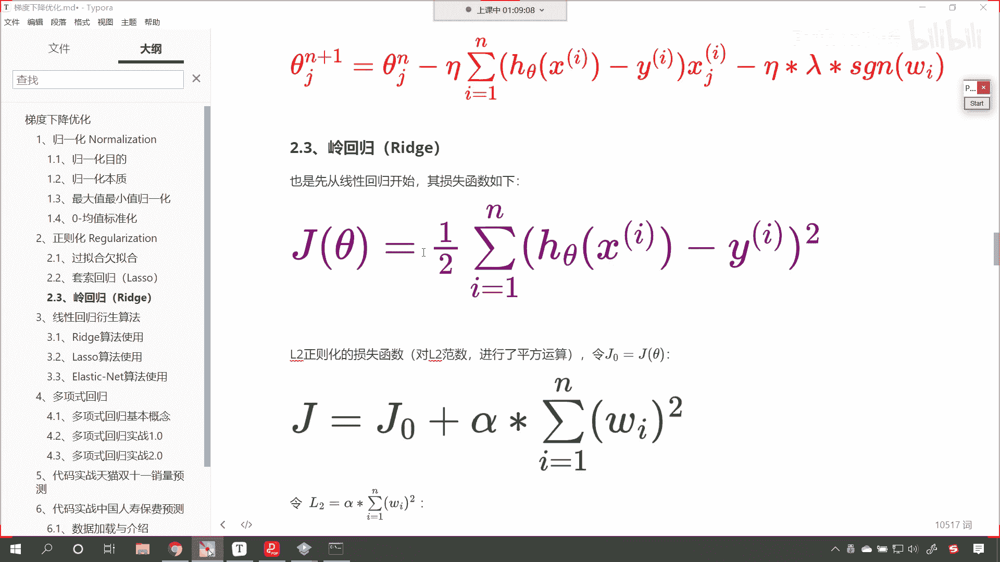

领回归这个算法所对应的方程。

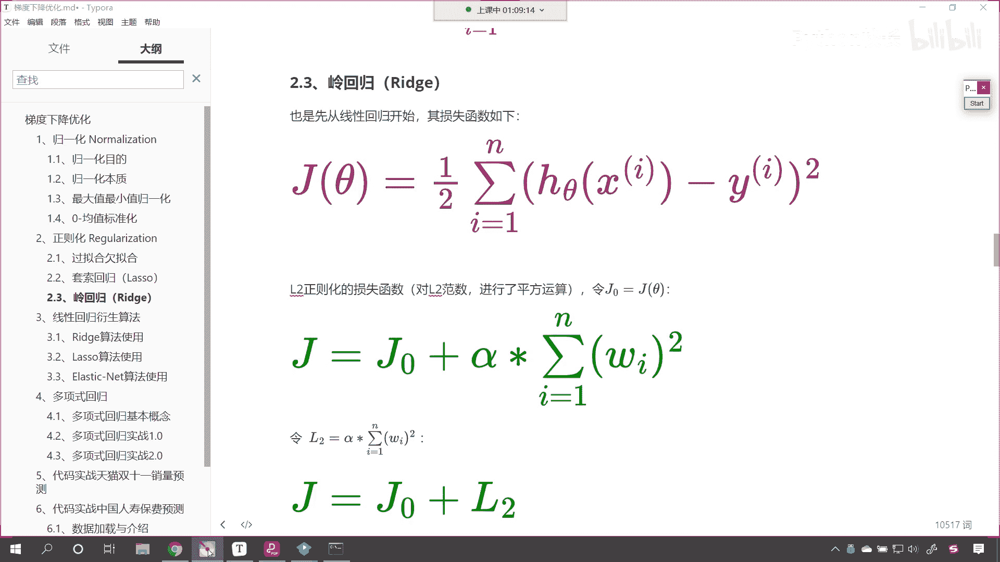

也是在线性回归的基础上进行的一个改变，l2 范数，各位小伙伴就能够看到它所对应的方程呢，就是这样的一个方程，这个那各位小伙伴为什么叫l2 范数呢，看我们呢是对l2 范数进行了平方运算，各位注意啊。

各位注意l2 范数它是嗯平啊，它是这个平方求和之后，是不是再来了一个开平方呀，你想一下咱们的这个欧式距离欧几里得距离，它是不是平方之后加和又来了一个开平方呀，对吧，它有一个开平方啊，开平方。

那我们l2 正则化的损失函数呢，它是对于l2 范数进行了平方运算，所以说这个时候就没有什么了，是不是就没有开平方了，你能够看到这个时候咱们怎么样了，是不是直接在这给他加了一个平方呀。

所以说这个就叫做l2 正则化，那l2 正则化我们所对应的不同的这一项，就是l2 等于阿尔法乘以，咱们后面的所有系数的平方。

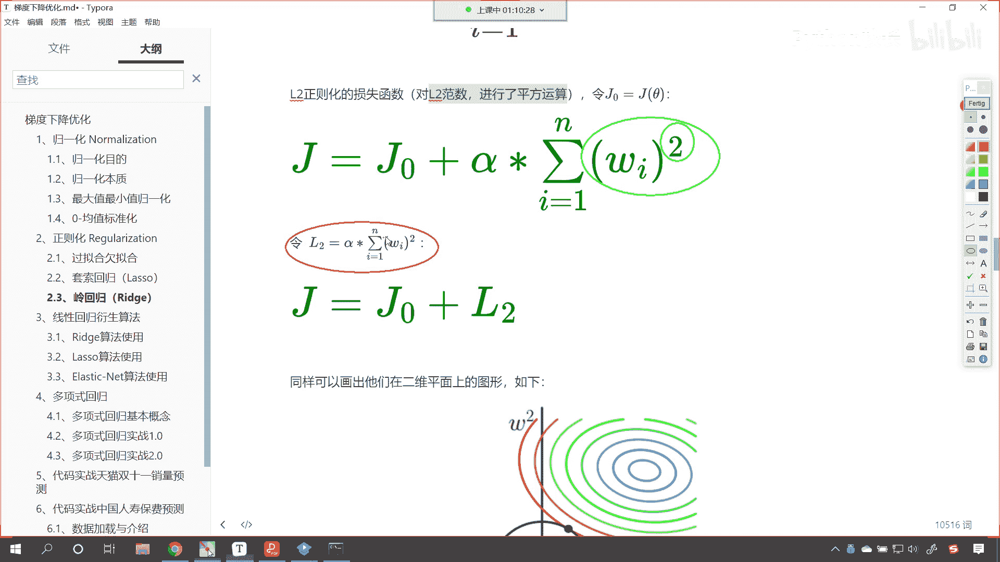

那我们把这个图画出来啊，各位小伙伴你来看一下，看各位小伙伴你来看一下，那为什么，这个时候咱们所对应的这个就是个圆了呢，看到了吧，这个时候咱们所对应的是一个什么，是不是一个圆呀，看到了吧。

此时对应的就是一个圆，刚才我们对应的是什么，是不是一个棱形呀，那你能知道为什么l2 这个方程，它所对应的是一个圆吗。

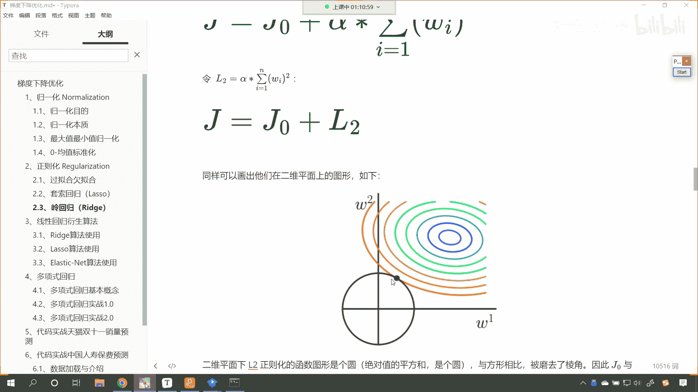

来回到代码当中，我给你画一下啊，好那么首先咱们将l2 它所对应的这个方程，咱们呢给他复制一下哈。

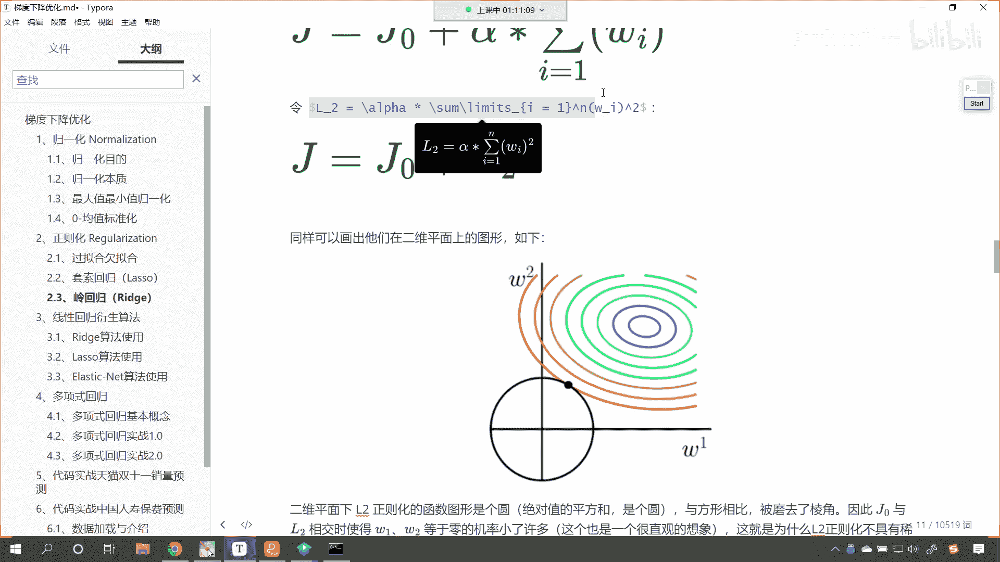

看ctrl c来，现在呢咱们就回到代码当中，上面咱们画了一个l1 ，接下来咱们来一个三级标题，叫做l2 ，唉它的可视化，那在这儿呢咱们来一个mark down，咱们把这个公式粘贴过来，一执行。

咱们画复杂的，我们没有办法绘制，那咱们现在呢咱们就画一个简单的，同样呢也是两个变量，那就是w一和w2 ，w1 w2 是不是就对应了咱们的x和y啊，对不对好，那根据这个公式。

你就能够发现我们同样也令l21 啊，那这个时候你想是不是就是x看，咱们如果把它转变一下，你想是不是就是x的平方，y的平方呀，来dollar dollar啊，我们同样令它是一一。

是不是就是a l p h a阿尔法，你看乘以x的平方加上y的平方，哎你看我一执行是不是就是这样的一个公式呀，哎注意啊，咱们的阿尔法呢是包含它的，是相当于是x和y的平方，看到了吧，x y的平方是不是。

那我们现在也可以来一个简单的这个阿尔法，是正则项系数，咱们是不是可以令阿尔法等于一呀，对不对，我们呢就令a等于一，对不对，那这个时候呢你看这个方程就可以写成一呢，就一是不是就等于x方加y方。

这个画出来的图一定是个圆好，那现在呢你看咱们再给你绘制一下，也来一个markdown，那就是dollar dollar一就等于x它的平方，加上咱们y它的平方，是不是，你看是不是就是这个好。

那么这个时候呢，这个时候那么我的y它等于什么，y是不是可以写一个方程呀，fn就等于拉姆达l m b d a拉姆达x冒号，你想这个时候咱们插入一行啊，也来一个markdown，dollar dollar。

我们给他实现一下y是不是就等于正和负呀，对不对，反斜杠pm，然后呢这个反斜杠s qr t花括号一减去x平方，你看是不是应该是这样的，看到了y是不是应该等于正-1减去x的平方。

你告诉我我所写的这个方程对不对，看到了吧好，那么可见呢咱们markdown强大之处是吧，这个公式直接就能够写出来好，那那么我们现在呢就定义上面那个方程好，那上面这个方程呢，咱们就来一个这个小括号。

那其实就是一减去x的平方，平方的话，两个星号啊，来一个二是吧，然后再给他来一个开根号，开根号就是星号星号0。5啊，这就是开根号，但是这个fine呢这个这个里边是正的，我如何表示负呢，哎这个很简单啊。

待会咱们画图的时候，咱们一块把它画出来就可以了，好那么我们给一个范围，x呢就等于np。lin space，我们让它的范围从-一到正一，咱们把它分成100份，这个时候呢你看我plt。plot是吧。

咱们求一个y吧，y分两部分，咱们给y1 ，y一呢就等于发x放进去，再给一个y2 ，y y2 呢就等于fx，是不是前面给一个-1就行了，看到了吧，这个时候咱们绘制吧，x y一放进去，然后p t。

plot x y2 放进去，这个时候你看我一直行，是不是一个圆诶，有同学说老师这是个椭圆呀，为什么啊，因为我们图片的尺寸宽度高度它是不一样的，稍微调整一下就行了啊，在画图之前呢，plt。figure。

咱把它的宽高设置成一样的就可以了，在这给一个figure size，咱们呢给一个四和四，这个时候你看我一直行，是不是一个妥妥的圆了呀，看到了吧，这就是妥妥的圆了，所以说这个方程看到了吧。

x方加y方画出来是不是就是一个圆。

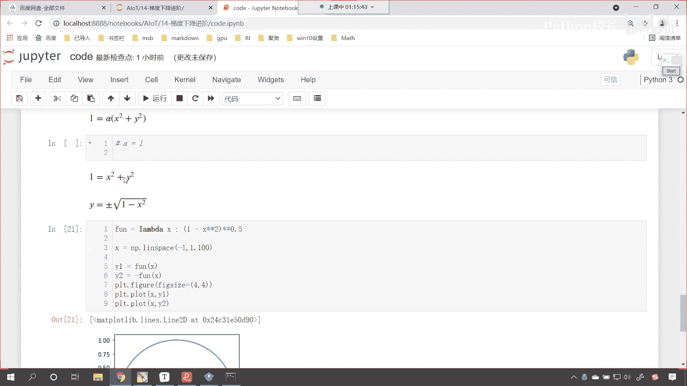

是不是就是咱们图片当中所对应的。

这个黑色的圆圈呀。

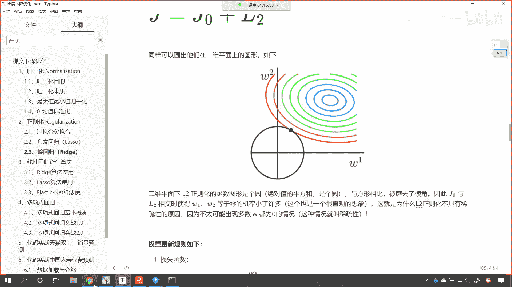

咱们画图的时候也可以把它变成黑色的逗号，我们给一个color，让它是k下面这个也给一个color，让它等于k，这个时候你看我一执行，是不是就是一个纯黑色的了，看到了吧，所以说这是对应的啊。

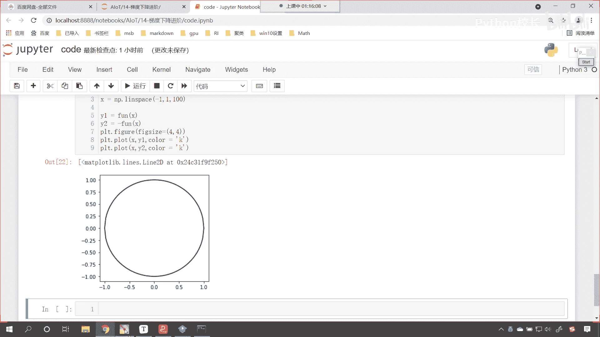

各位小伙伴哎，要明白啊，这个好。

那么同样呢这个和咱们上面套索回归是一样的。

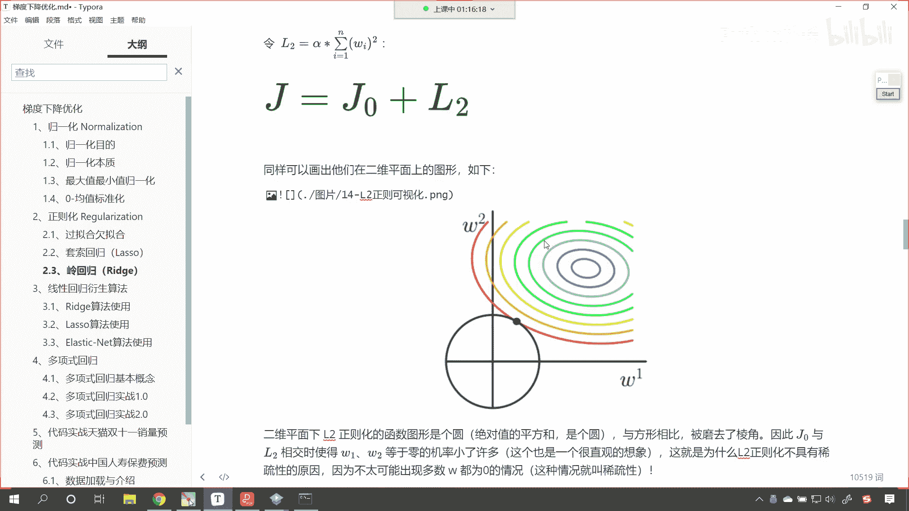

那各位小伙伴就能够看到咱们二维平面下，l2 正则化的函数圆形，这个图形呢是个圆，因为它是绝对值的平方。

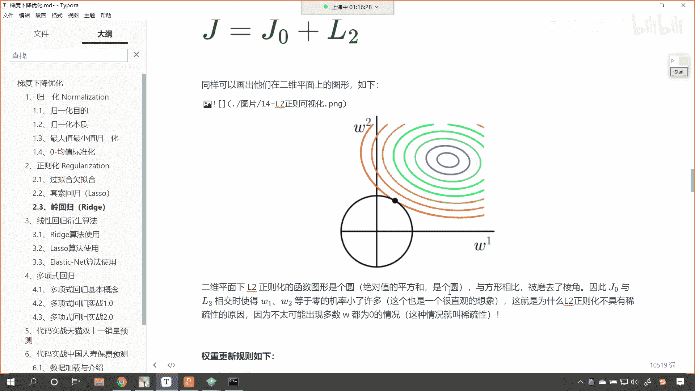

和与咱们方形相比，它呢被磨去了棱角，因此呢j0 与l2 相交时得到的w1 ，w2 等于零的几率，那就小了许多，看到了吗，也就是说你想你这个点相交的这个点，想要交到他的这个坐标轴上，是不是就困难多了呀。

你看这就是，为什么咱们l2 正则化不具备稀疏性的原因，但是呢通过咱们l2 正则化的限制，各位小伙伴也能够发现，你想咱们通过l通过领回归，通过这个l2 正则化求解出来的这个解，它是不是也靠近零呀。

看了因为我们圆心在这儿呢看到了，因为咱们的圆心是在这个位置哈，那我们给了一个限制，对不对，咱们给了一个限制，那个限制呢，我们可以通过这个呃l2 正则化的阿尔法，去调整圆的大和小。

和咱们上面l一正则化一样。

因为有上面l一套索回归嗯，这个内容的讲解。

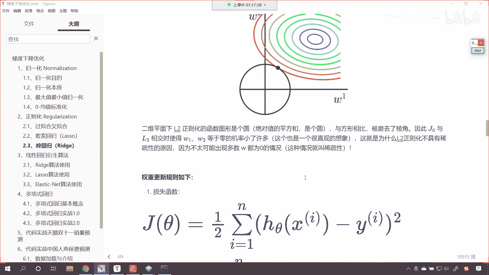

所以说到这之后咱们就顺理成章了，好那么我们接下来呢咱们继续往下看啊，权重的更新规则和上面就类似了。

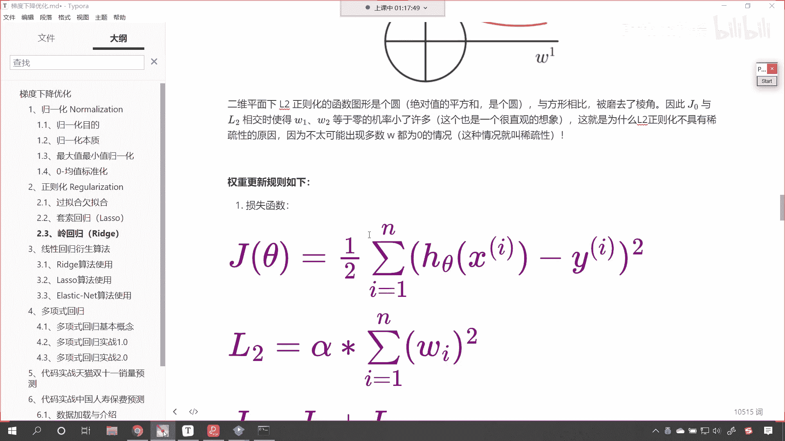

好那大家看咱们的l是带着一个平方的，带着平方的求导数和咱们绝对值求导数相比。

带平方的就方便多了，好那我们就求导数吧。

各位小伙伴，你就能够看到我们l2 正则化求得导数，我们只讲这个地方，看它所对应的导数，是不是就是二倍的阿尔法w i啊，对不对，你看就是他了，不需要考虑正负是不是啊。

那我们看一下更新规则，各位小伙伴，咱们的这个更新规则啊，咱们这个更新规则。

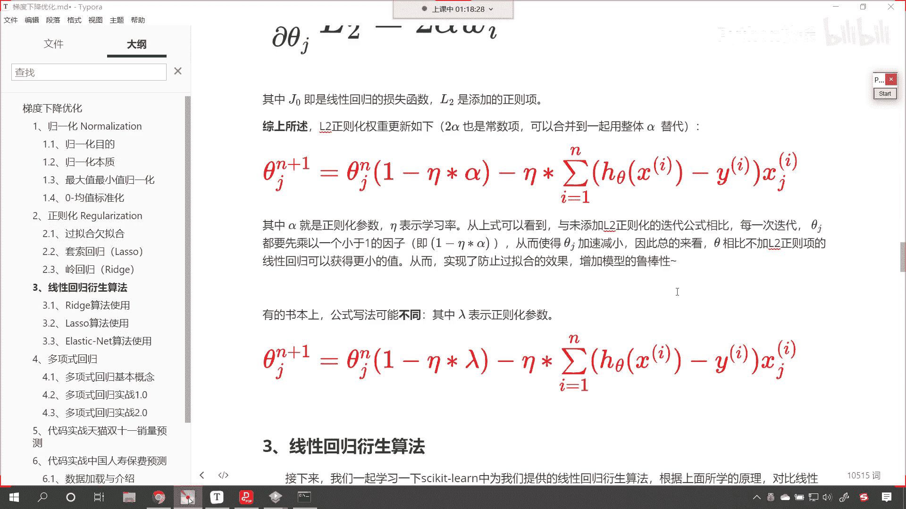

那我们呢就有一个这个和咱们l一正则化。

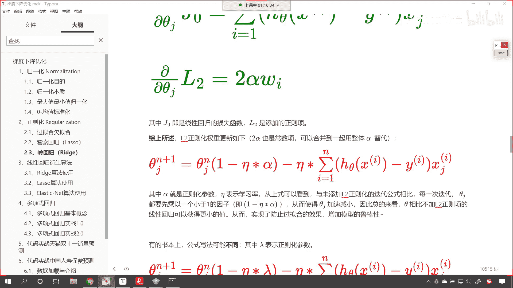

不一样的地方，看就在于这个地方，就在于它是不是在原来的基础上，是不是多减去了这一项呀，看是不是是不是多减了这一项，那你看这一项是不是还是咱们原来的呀，看这一项还是原来的，你知道咱们的w i。

其实是不是就相当于咱们的c塔呀，看这个w i就相当于咱们的theta，因为我们在之前讲课的时候说了，这个w是不是表示系数，我们的这个c它呢也表示系数，也就是说有的时候咱们在写这个公式的时候。

我们可可能没有这个统一啊，但是公式上是吧，你像这个数学是有不同的数学家，一步一步构建的，他们当时可没有商量是吧，说我们统一都这么写没有，所以说现在就导致这个哪个数据，哪个数学加强盛是吧。

那符号呢大多就都用它的，所以有的时候呢，这个你发现机器学习上这些符号也没有统一，各位小伙伴能够看到我们这个地方求导，求解出来的是二阿尔法，阿尔法是不是一个常数呀，那既然它是常数项。

那么我们就可以用阿尔法是吧，来取代它就可以了啊，看到了我们用阿尔法来取代它就可以了，知道吗，用阿尔法来取代就可以，所以这个时候你咱们就能够发现好，咱们再进行这个权重更新的时候啊。

这个时候呢就是c他按j然后让再减去，这个再减去，你看让咱们的一减去咱们的这个阿尔法，那一减去咱们的阿尔法，所以说咱们的更新公式呢，各位小伙伴就能够发现不一样的地方看啊，不一样的地方就在就在这个地方啊。

我们刚才讲了半天，不一样的地方就在这儿，因为我们的更新规则呢，它相当于是多减去了一个l2 ，对不对，看多减去了一个l2 的偏导数，是不是你l2 的偏导数，最后你看你这个是不是对应w i。

那我们的这个c塔j呢，你可以把它当成一个一个这个变量啊，所以说他在更新的时候，就相当于减去了一个一塔阿尔法，而咱们的一塔和阿尔法都是正数，一减去一个正数，你想一下，你看啊，我们在进行更新的时候。

咱们先乘了一个小于一的因子，从而使咱们c塔j加速减小，从而使它加速减小，因此总体来看，theta相比不加l2 正则项的线性回归，可以获得更小的值，防止过拟合的效果，就实现了模型的鲁棒性也就增强了。

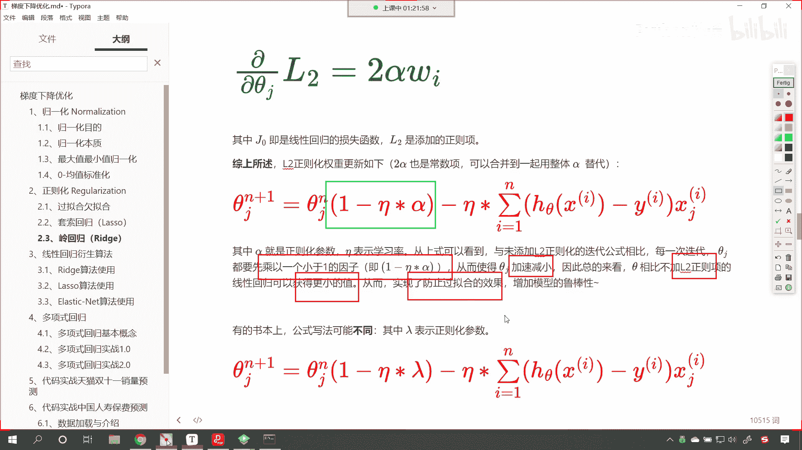

所以说咱们这个咱们这个规则是这样的。

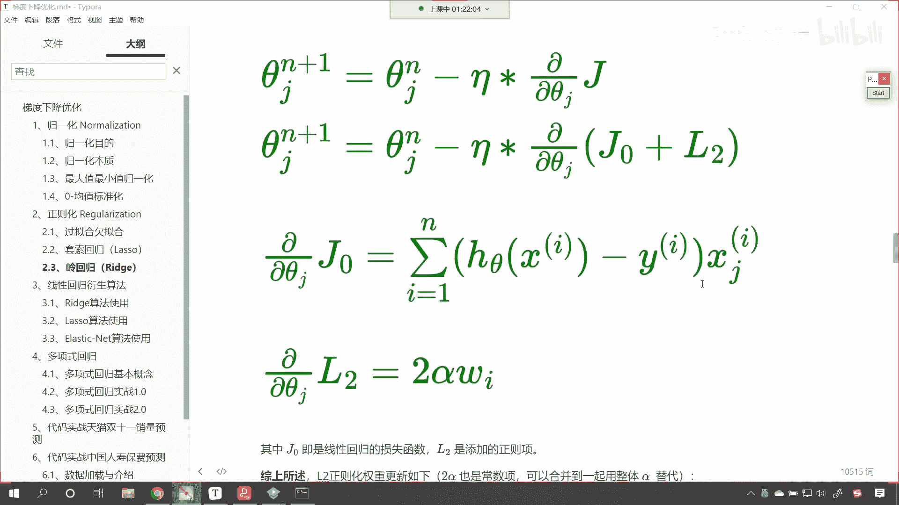

你就能够看到你看梯度下降，梯度下降是不是，这种方式呀，这个是不是它的权重更新呀，看到了吧，就是c a g n减去一塔，是不是，而我们的j0 的偏导数和l2 的偏导数，是不是都求解出来了。

我们将求解出来的带进去看，咱们将求解出来的带进去好，将求解出来带进去。

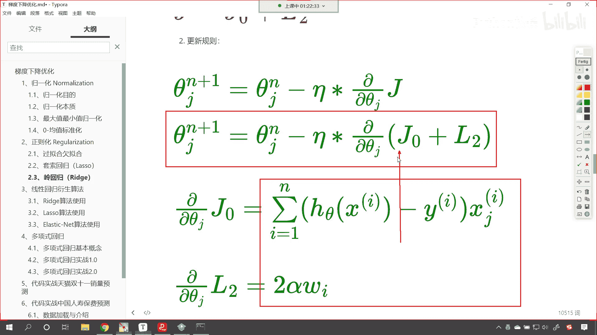

不就是咱们下面这个公式吗，你来看啊。

将它带进去是不是就是咱们下面这个公式看啊，各位小伙伴看咱们上面这个，那这是梯度下降的这个公式，对不对，你把它带进去，看到了吧，因为这是一塔，一塔乘以，后面这一堆是不是，那不就是一塔乘以。

咱们我用绿色来表示哈，看这是不是j0 的梯度，然后这个是不是咱们l2 的梯度呀，你l2 的梯度，你看你把它乘进去之后，他是不是也就前面得多一个一塔呀，我们这又说了，因为二二阿尔法是常是常数项。

所以咱为了描写方便，咱们就统一用这个阿尔法来替代，因为你阿尔法是常数项，我们在进行设置的时候，这个值是可以大一点，可以小一点，所以说这个是可以调整的，那干脆就用一个阿尔法来替代，这就是数学家是吧。

他这样写更加的方便简洁。

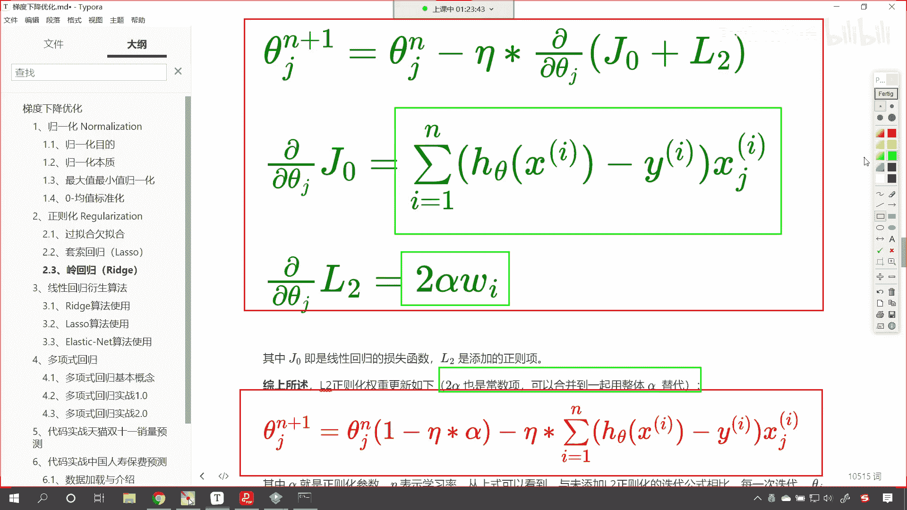

所以呢到了这之后呢，唉咱们就能够发现加了l2 正则项，咱们的系数呢是不是相相比，没有加l2 正则项是不是就变得更小了呀，哎你看这不就和咱们上一节课所讲到的，为什么我们的算法出现过拟合。

是因为咱们所求解出来的系数偏大，如何防止过拟合，咱把系数给它缩小，是不是就可以了，如何缩小l2 ，加上了这个正则项是不是就可以，你看通过梯度下降的公式。

你也能发现确实变小了，通过咱们上面这张图片。

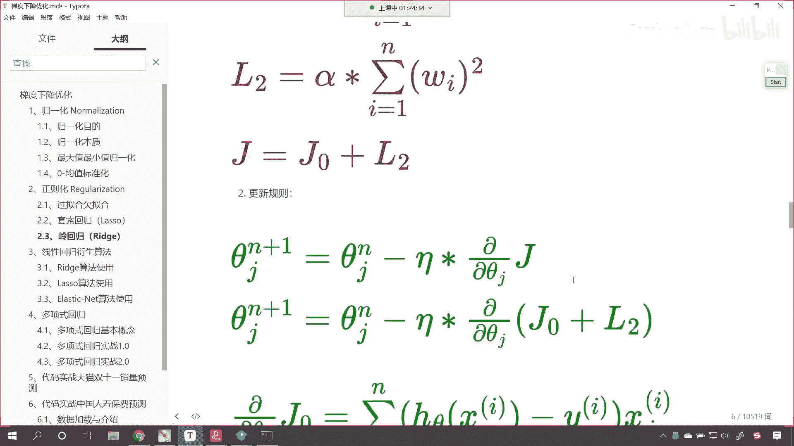

你也能发现是不是有了这个限制，咱们的系数是不是就朝着这个方向看，他是不是也朝着这个方向去缩减呀，看到了吧，你原来的时候你越往右上角，看到了吧，越往右上角它越大，你越往下走，如果你要走到圆心。

那这个时候系数就小到零了，是不是就不能再小了，对不对。

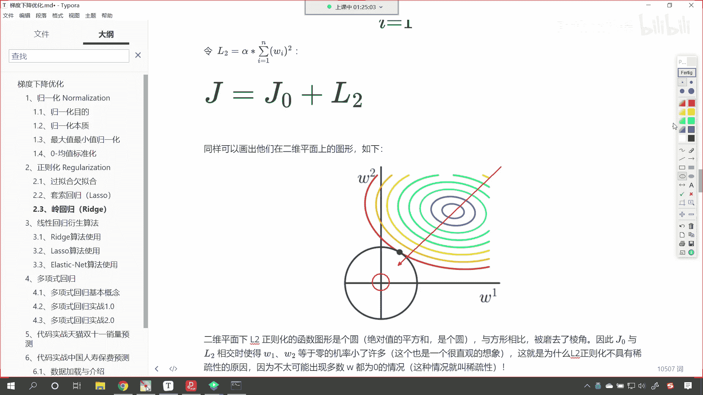

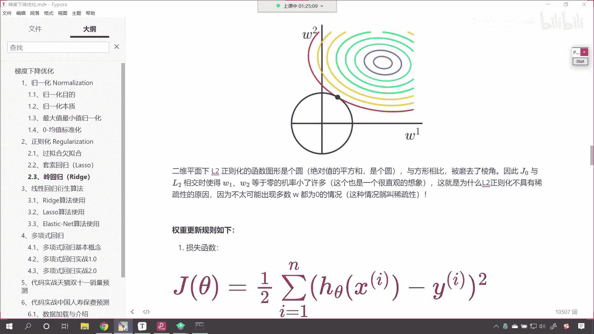