# P91：8-Lasso回归使用 - 程序大本营 - BV1KL411z7WA

咱们接下来我们继续往下看啊，那大家想我们介绍了领回归，你想一下螺丝回归是不是也一样呀。

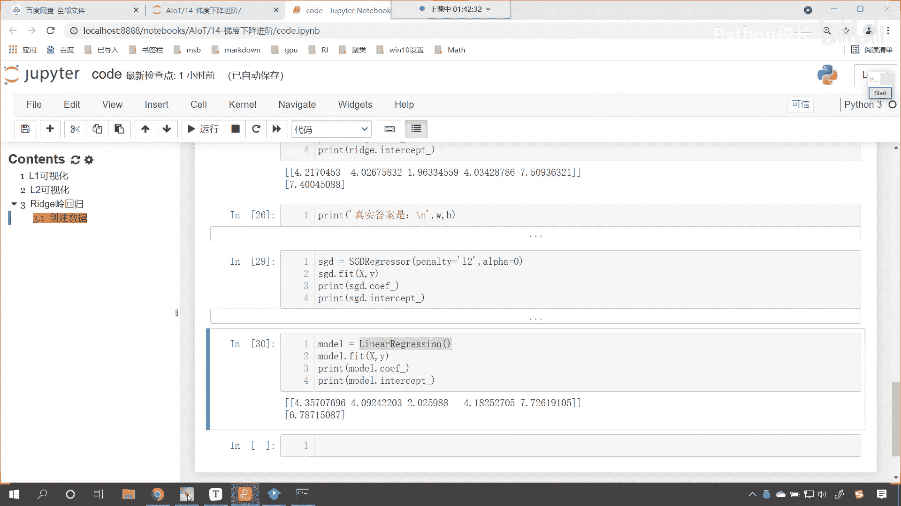

来咱们回到这看一下咱们螺丝回归的使用啊，那么咱们螺丝回归，这个是i3 kt learn官网上给出的套索，回归它的损失公式，那这个里面它就用到了这个范数啊，这个当中它就用到了范数。

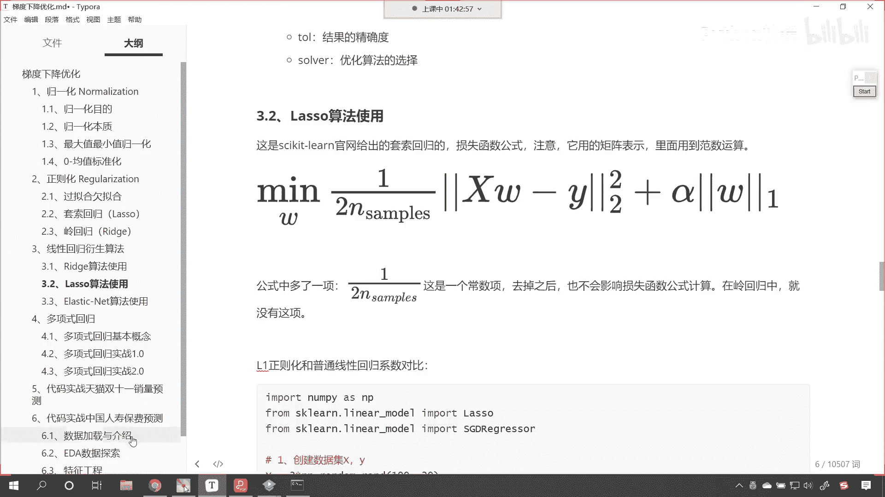

这个以后你再进行相应操作的时候呢，你看啊咱们可以这样，比如说我们搜sk learn进入它的官网。

进入官网之后。

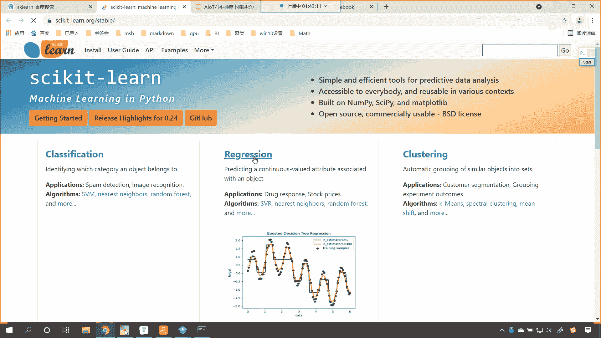

咱们就进入regression，这个是回归，我们是不是就可以进入lol呀。

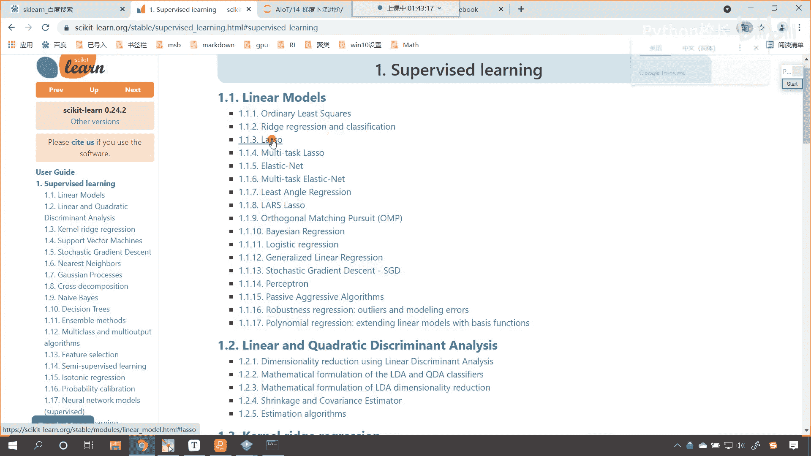

各位小伙伴就能够看到，这个是咱们每天正在用的suit learn是吧，这个是有很多高手，很多大牛写出来的开源的代码，你看这个lol回归，看它是什么样的，看到了吧，lol回归是不是就是这样的一个公式呀。

看到了吧，你在公式当中仔细观察，其中有一项是这个看到了吗，其中有一项是这个好，我们现在有小伙伴看不懂了，我给你解释一下啊，两个竖杠，两个竖杠表示范数，看两个竖杠它表示范数，这什么是范数呢。

范数呢它是对于咱们的啊这个矩阵而言的啊，范数呢它是对矩阵而言，咱们是不是在课堂上讲解的时候。

我们是不是也说过范数呀，看来咱们搜一下ctrl f叫做范数。

你看我们是不是介绍过范数呀，看到了吧，就在咱们的课件当中啊，来退出江湖，小伙伴，你来看一下，你看这什么是范数呢，看到了我们说这个l一看到了吧，它是不是就对应看看啊，来退出江湖，小伙伴，你仔细看看啊。

这个就叫做看竖杠，竖杠w一这个就叫做范数，那范数对应的数学公式是什么，你如果中间这个看不懂，后面这个是不是一定能看懂呀，退出江湖，小伙伴，这个一范数明白了吗，明白了扣个一啊，看到了吧，哎这个就是一范数。

那还有二范数呢，啥是二范数呢，看竖杠，竖杠看它下角标来了个二，它具体的公式就对应这个看了吧，对应这个就是你w i的平方累累加和，然后再来一个开根号呐。

这个就叫做范数，那我们在官网上，在sk learn官网上，咱们看到的这个，你看你看到的这个，首先你看它的下角标有一个二，这个是不是二二范数，二范数右上角又带了一个二，这个是不是就是范数的平方呀。

是不是就是二范数的平方。

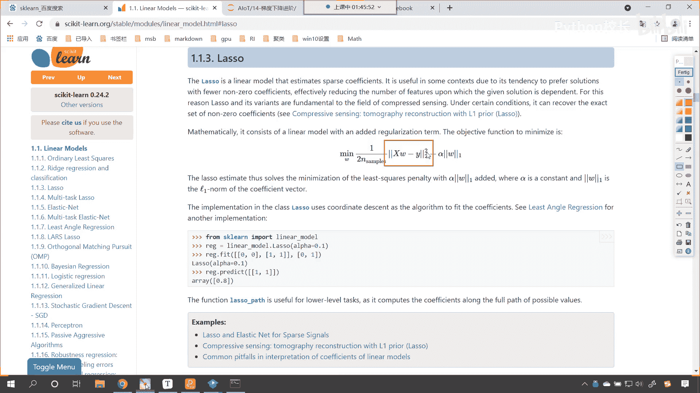

为啥要二范数的平方呀，因为你的二范数是不是有一个开平方，看到了吧，咱们的二范数范数二是不是有一个开平方，开平方，如果我要再来一个平方，开根号是不是就去掉了呀，对不对。

开根号它就去掉了哈，所以说你看哎这就是他写的这个公式后面，然后加上阿尔法竖杠。

竖杠是不是w是不是你看和我写的公式，你看和咱们所写的公式你看一样不一样，和咱们所写的公式是吧，咱们就找一下啊，咱们的这个过拟合欠拟合啊，咱们找找一下咱们这个套索回归。

看啊和咱们所写的公式呢，唉那是一样的啊，所以说他右上角带着一个二，就是你开了平方，你再来一个二就不要开平方了，去掉就行了。

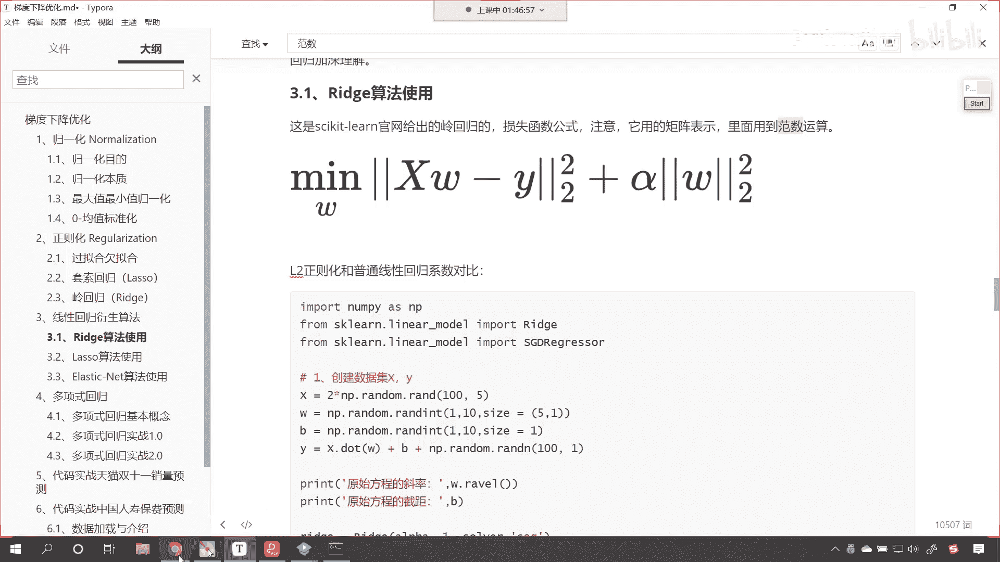

是不是啊，所以说呢它的公式这样写好，那么我再让你看一下普通的这个这个。

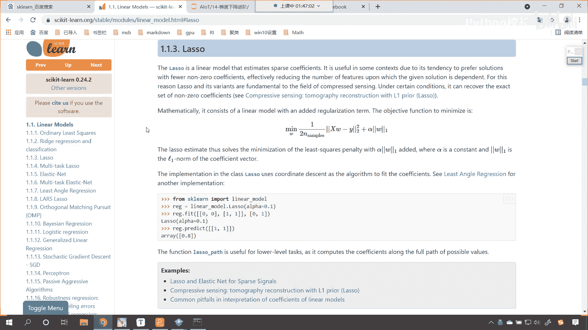

linear regression，你看这个是不是linear regression，看到了吧，这就是普通的线性回归，就是x w减y是吧，竖杠竖杠平方好，那么有了这个公式之后呢。

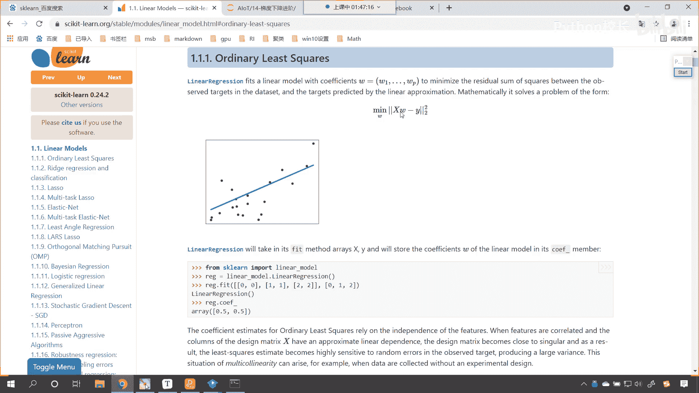

为了让你看得清楚明白看，为了让你看得清楚明白，现在呢咱们线性回归多元线性回归当中，咱们之前我们是不是讲过。

看一下咱们具体的这个公式啊，好，我们看一下咱们的这个最小二乘法的这个公式。

诶，你看来各位小伙伴，现在你看到的这个，是不是就是最小二乘法的公式呀，看这个是不是最小二乘法的公式，那这个最小二乘法的这个公式，我们用数字来写的这个数字来写，你看我们是不是带了一个求和。

右上角是不是带着一个平方，你想这个公式大家看啊。

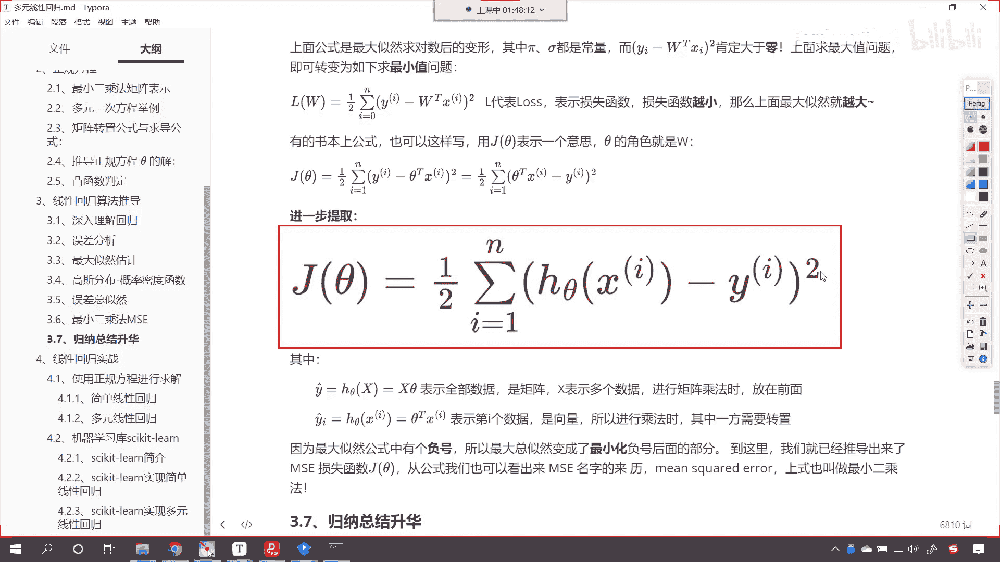

这个公式和它所描述的这个公式是不是一样呀，你仔细想一下，如果说你要把它展开的话，看把范数展开是不是一样呀，看到了吗，x w减y，你把它当成解，把它当成这个矩阵是吧，他的每一项都展开，每一项都求和。

不就是咱们这个公式吗。

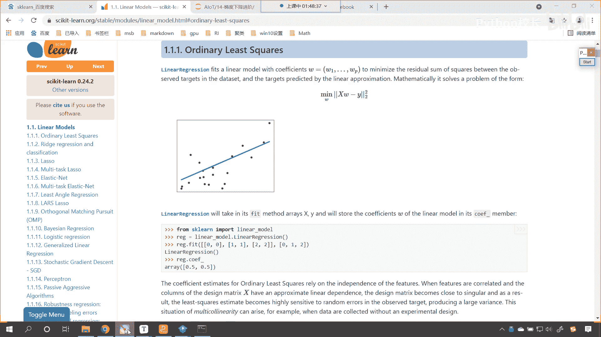

是不是它就是这个公式啊，所以一个是矩阵形式。

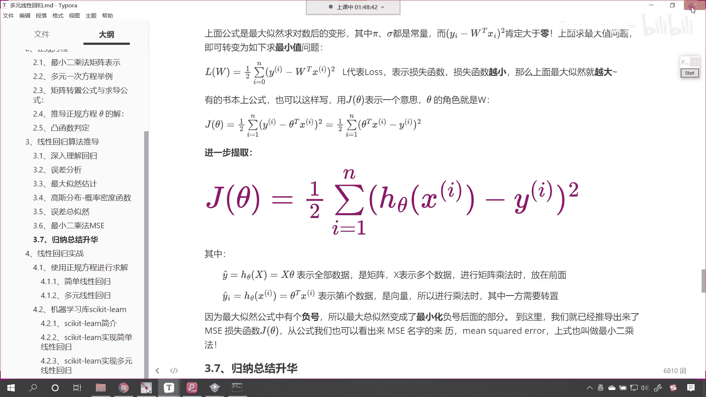

另一种呢是咱们的这个数学公式是吧，这是一样的啊，来那么我们就看一下咱们螺丝回归，看咱们螺丝回归它官网上给的公式呢是这样的，这多了一个2n sample是吧，而咱们领回归呢没有。

我给你看一下官网上领回归的啊，叫睿智。

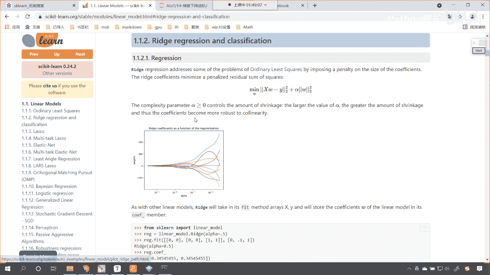

看到了吧，这是官网上领回归的，你往下滑一点，就是嗯咱们看一下啊。

咱们点这个lol看到了吗，这就是螺丝回归，我们发现官网上肯定是不同的人写的。

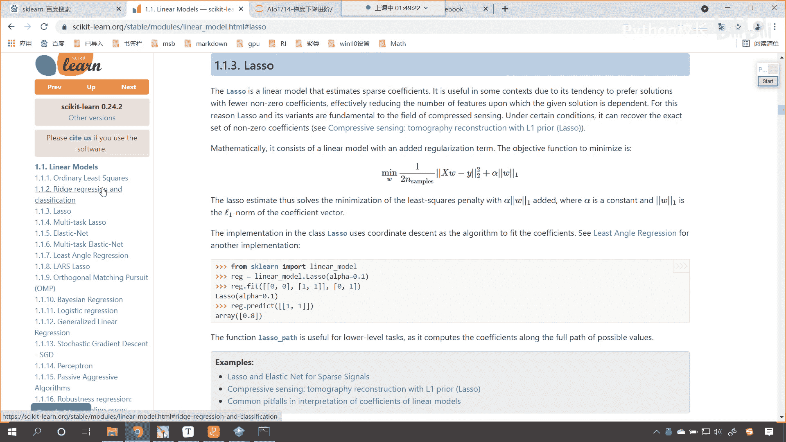

因为你要统一的话，应该都统一，对不对，我们的领回归呢它没有这个没有这个公式。

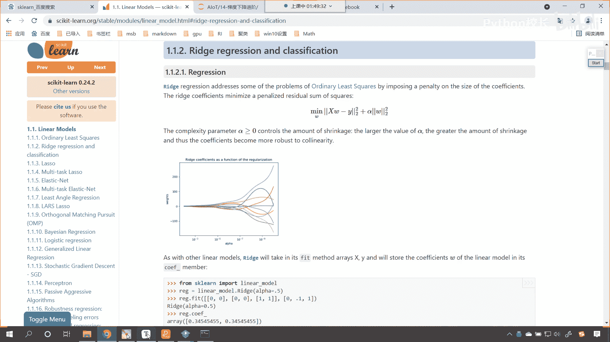

看到了吧，没有这个没有这个分子，没有这个2n sample分之一，其实呢你想这个2n3 部分之一它是一个常数。

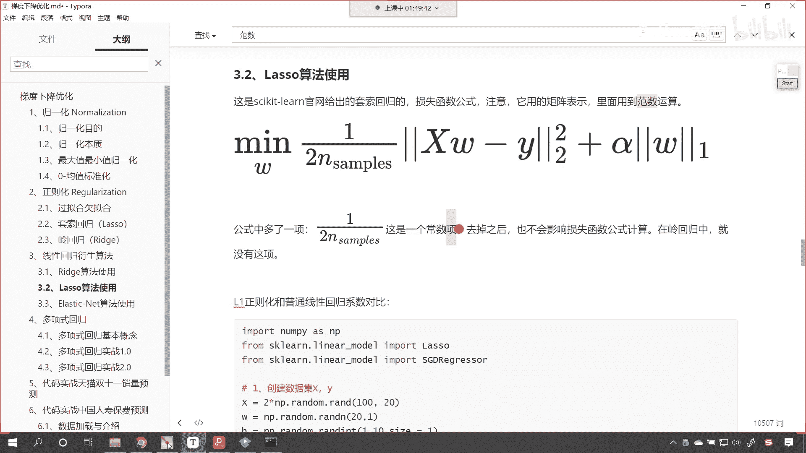

对不对，你去掉之后也不影响损失函数公式的计算，在领回归当中就没有这一项。

这更能说明就这个线性回归当中，不同的算法是由不同的人写的，你知道吧，哎是有不同的人写的，如果要是同一个人写是吧。

那他肯定就统一了，知道吧，你看到了，所以说这写不写都一样啊，就咱们这个公式，就咱们这个公式，就咱们这个符号写不写都一样，但是你要明白，写上它也对，不写也对，你知道这个sk learn在咱们工作当中。

它是有广泛应用的，这个是一个特别强大的工具，特别强大的库，但是呢我们认真的去学习这个库的时候，我们发现不统一没关系，知道吗，你理解加上他也行。

不加他也行是吧，就行了啊，都对知道吗。

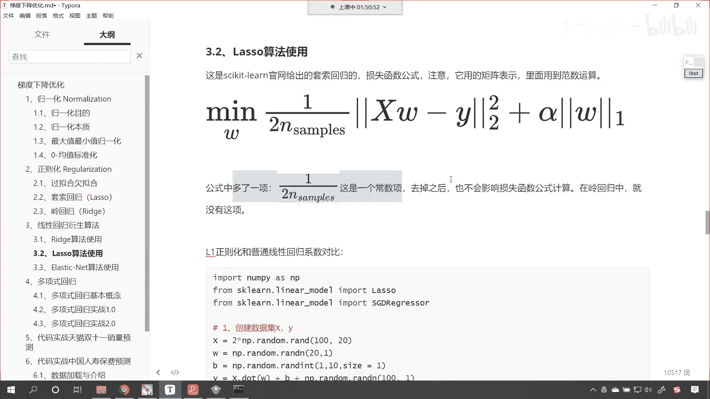

好那么咱们接下来呢我们就回到代码当中。

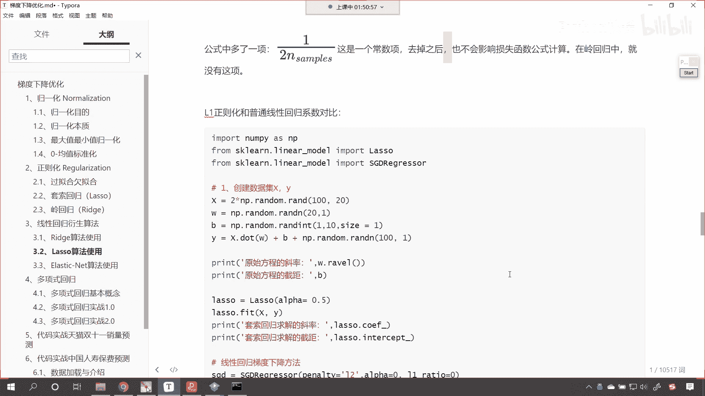

咱们来演练一下咱们的螺丝回归的使用。

来回到代码当中嗯，进入到咱们的代码，咱们在这儿呢给它添加一个三级标题，好这个时候呢就是咱们lol l a s s，lol这个lol呢它也叫套索回归，翻译成中文就叫套索回归，好，那么咱们导一下包啊。

from sk learn，同样也是从linear model当中导包，咱们就导入lol l a s s o，把这个导进来好，那么导进来之后呢，咱们紧接着呢我们就创建数据。

咱们创建数据和咱们上面是类似的，咱们给一个xx呢就等于二倍的np点，来一个random，咱们调用run这个方法，我们生成100个数据，咱们给他20个特征，然后呢我们给一个w就等于np。random。

咱们调用run这个就是一个正态分布，给一个20和一，这个就是一个二维的，然后给一个b np。random，这个时候呢我们就调用run int，因为这个b呢它是一个截距。

那这个范围呢我们给一到十给一个size，这个size呢我们让它生成一个，接下来咱们就呃根据数据来创建咱们的目标值，那就是x。dot w，然后加上b啊，这个时候呢咱们给它加点盐，让这个数据呢有点波动。

np。random点，咱们调用run使用正态分布，给一个100和一，注意咱们的形状要对齐了啊，咱们display一下x的形状放到这，y的形状放到这儿，你看我一直行，是不是120，100和一好。

那你看咱们说这个np的random rann，如果我们只给100，不给一会怎么样，看会怎么样，这个时候你看我一直想各位小伙伴，你就能够看到生成的数据是不是100和100呀，因为如看到了吧。

因为这是广播机制，是不是哎我们给一个100和一执行，所以说这个时候呢，也就是说咱们的特征呢是100个样本，每个样本20个属性，目标值呢就是每一个数据呢它是一个目标值，好此时呢咱们的数据就创建好了。

那接下来呢咱们就使用套索回归，那咱们就使用套索回归，我们来进行训练，查看一下它的结果好，那么lol l a s s o lol呢，就等于lol这个里边有一个参数就叫做阿尔法，你还记得这个阿尔法是什么吗。

默认情况下这个阿尔法是一点，是不是咱们给一个一点，看默认情况下这个值是一点好，那么咱们就调用lol点，咱们feat一下，将xy放进去，然后我们就print输出一下lasso，回归它的方程系数。

print输出一下lasso回归它的截距，执行这个代码，哎，各位小伙伴，你能够看到此时我求解的解都是多少，看到了吧，都是零了，哎你能告诉我为什么它都变成零了吗，我们之前在讲课的时候。

咱们说这个矩阵叫什么，是不是叫做稀松啊，它具有稀松性质，是不是什么是稀松性质啊，是不是就是将一部分，系数是不是就可以变成零了呀，对不对，它有稀松性，对不对，是不是就可以将一部分系数变成零。

现在我们发现是不是全变成零了，那为什么，就是因为这个阿尔法啊，就是因为这个阿尔法我们之前在讲课的时候。

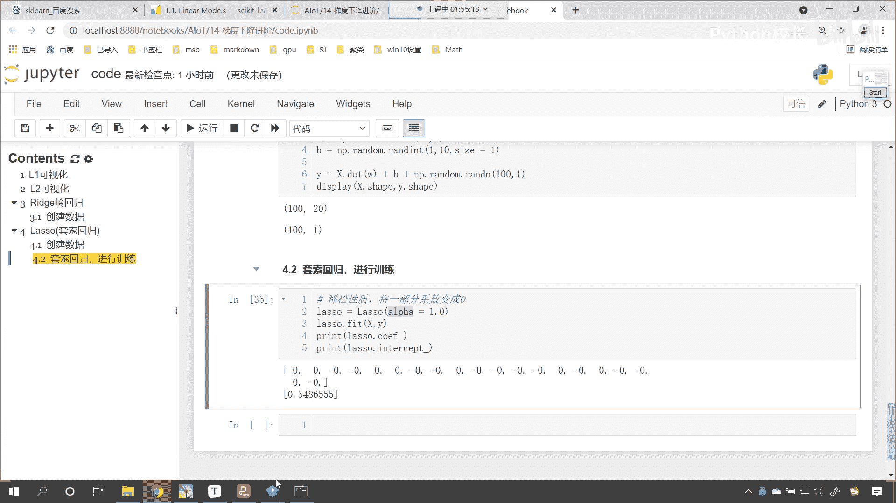

咱们说了，说这个阿尔法越大。

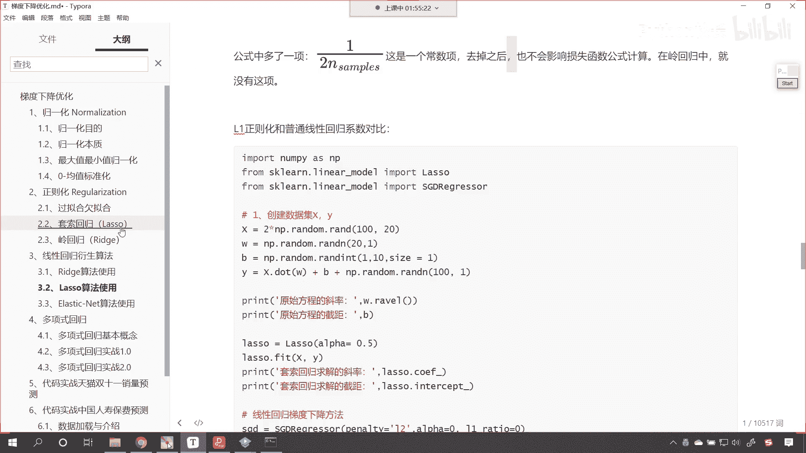

它会怎么样，看咱们这个阿尔法越大会怎么样看啊，阿尔法越大，看看啊，阿尔法越大，这个跨越怎么样，看阿尔法越大，咱们l一所对应的图形是不是就越小，他如果要越小，你想一下就是咱们这个菱形越小。

我们是不是就越靠近靠近咱们的这个嗯，跑到原点是不是啊。

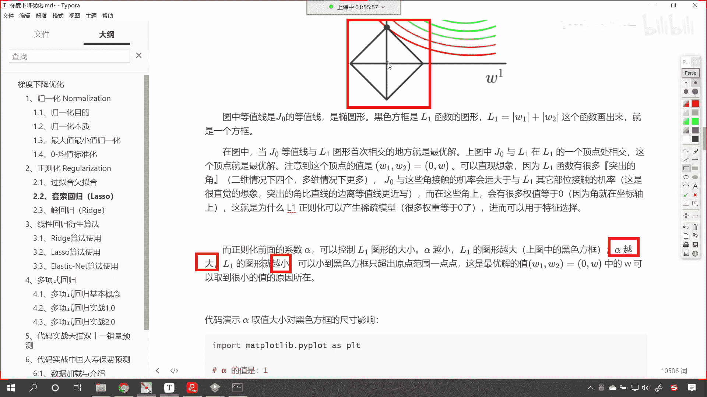

所以就会怎么样，你看我们给了个一嗯，对于我们这个数据而言，这个一就很大了，所以说求解出来的是不是就全是零呀，那如果说我要给他0。1呢，看逗号，咱们给一个0。1，这个时候你看我一执行诶。

是不是就求解出来了，是不是有一部分为零，另外的是不是不为零呀，对不对，那你看啊，我再调大一点，调整成0。5，这个时候各位小伙伴看你就能够看到，是不是其中有一部分就为零了，看到了吧，你像这些看到了吧。

就全为零，然后我们有一些不为零，看到了吧，就是这个权重比较重要，不为零，这个权重也比较重要，这个也比较重要是吧，这个我们把重要的都给它画出来，剩下的你想都为零，那这些特征咱们是不是就可以给它删除呀。

我们就可以将看啊为零的这些特征，咱们就可以删除，你看你知道为啥吗，因为你不重要，因为我即使求解出来了，我发现你的结果也是零，是不是啊，所以说就可以将为零的所对应的特征，咱们给它删除掉，删除掉之后呢。

它是嗯没有影响的啊，它是没有影响的，好那么大家看套索回归是不是也就出来了，来接下来呢我们进行对比，咱们呢使用这个随机梯度下降，好，咱们使用随机梯度下降，我们来进行一个对比。

那就是s g d就等于s g d regression，嗯在这儿呢咱们给一个pently，我们嗯这个呃pently呢我们让它是l1 ，同样的我们也给一个阿尔法，让它是零是吧。

因为默认情况下它都有这个参数啊，s g d。feat xy放进去打印输出一下，print s g d点调用它的call if再来打印输出，他求解出来的结局，sgd。intercept执行一下。

来各位小伙伴，咱们现在呢对比一下，我们在这个地方咱们就能够发现看到了吧，咱们这个数据是吧，你看它有一个红色的提示，对不对，怎么才能让这个红色的提示消失呢。

看他说a column vector y was passed when a diary words，ex pect，翻译一下，你只要把这个英语翻译成中文理解了，那么这个问题你就解决了。

也就是说你看咱们这个算法啊，咱们这个算法在进行运算的时候，他发现你这个y呢，他expect是不是他期望他这个是一维的呀，但是呢我们传的y是几维的，咱们上面生成的这个y，你看它的形状，它是不是二维的呀。

最后一位是不是一个数字，所以我们可以怎么样可以给它改变形状，用到的方法是不是reshape给一个-1，这个时候你看过一执行，还有红，还有粉红色的这个警告吗，这个时候是不是就没了，除了这个方法之外。

你看我要再把它删掉，你看一执行又出来了，他告诉我们是不是还可以使用rebel这个方法呀，revel和咱们reshape是一个意思啊，r e reve r e v a l嗯，r a v e l。

那你看我一执行是不是也没了，所以说rebel的效果其实也是把它平铺，也是把它变成一维，现在呢咱们就对比一下啊，来各位小伙伴看啊，看我们数据是不是就有一定幅度的缩小，各位小伙伴，你就能够看到。

你看这变成零的，咱们就不看了是吧，咱们就看一下这个，你看他是不是从1。8变到0。6了，对不对，那我们看一下这个负的1。6变成多少了，负的1。6，它是不是缩减到负的0。6了，请问哪个数值大，负的1。

6大还是负的0。6大，来直播间的小伙伴，你告诉我一下是不是上面这个大呀，对不对啊，上面那个大，那我们在讲原理的时候，咱们在讲原理的时候，我们说到了它呢，其实这个无论是领回归还是套索回归。

它是不是都向着零的那个方向去去缩减呀，也就是说它的绝对值是不是变小了，你看这个1。8是不是变成了0。41啊，对不对，是不是，你看这个1。72是不是变成了0。23，对不对呀，那这个负的0。

8它就缩减到零了，是不是，你看这个负的1。75变成了负的0。8，哎所以说咱们看了之后呢，咱们就发现规律了，是不是啊，也就是说咱们的套索回归嗯，在处理数据属性特别多的时候，它是很好用的啊。

当你的属性特别多，那么我们就可以使用套索回归嗯，去烦是吧，把不重要的特征给它去掉，留下的都是精华好，那这个呢就是我们这个套索回归。

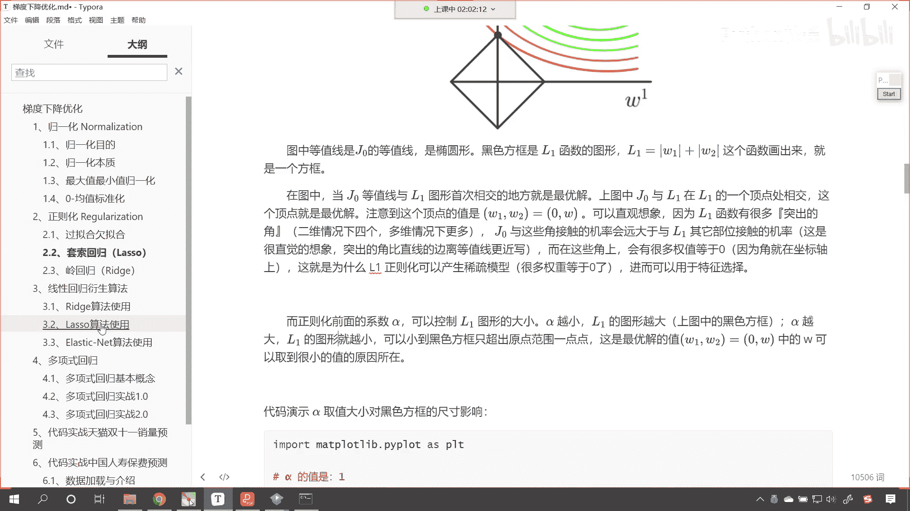

它的一个使用是吧，很简单吧是吧，我们在这里呢就带着带领着各位呢。

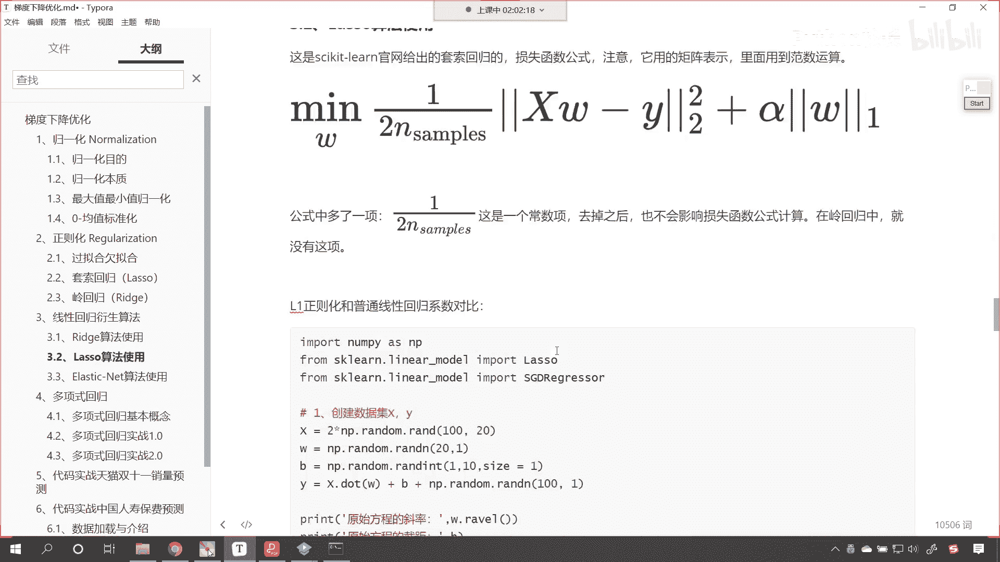

进行了相应的一个操作，那么呃我们呢对于他的这个结论呢，咱们进行一个说明啊，和没有正则项约束的线性回归对比，咱们l一正则化，我们将方程的系数进行了缩减，咱们的部分系数就是零。

所以这就是为什么我们我们把它叫做稀疏模型，七叔就是一部分为零了，阿尔法越大，咱们的稀疏性越强，越多的参数为零，当我们把阿尔法设置成一的时候，全部为零了，那螺丝回归它的源码解释。

咱们在这儿呢对它的参数进行一个说明啊，阿尔法是正则项系数，feat intercept是是否计算截距，normalize就是是否做归一化之前呢，咱们在进行电池工业蒸汽量的时候。

我们是不是可以手动进行规划呀，这个地方它也可以就通过这个参数呢，哎你来对他这个在运算的时候，可以让它直接归化这个precommunicate，是布尔类型的值是吧，这个呢就是否计算gram矩阵。

来来这个加速咱们的计算啊，那矩阵当中的一些知识，就是说如果说你要是调用了prey communicate，那么计算速度会快一些，max最大迭代次数tol，这个就是结果的这个精确度啊。

tol就是咱们结果的这个精确度，我们之前在讲梯度下降退出循环的时候，咱们是不是有一个退出条件呀，这个t y l叫tolerance，英语它所对应的这个英语单词叫taller rs。

t o l taller r啊，叫taller rs，这个英语单词就有容忍的意思，那翻译成机器当中的这个意思就是精确度，就是说我能容忍的错误是多少是吧，你能容忍的错误越苛刻，说明咱们的精确度就越高。

warm start也是布尔类型的值，默认值是false，如果为true的话，那么我们就使用前一次训练的结果继续训练，不然的话咱们就从头开始训练，所有咱们这个参数当中的这些属性是吧。

只要它是布尔类型的值，那么它都是极其简单的，知道吗，都是极其像，这个当中特别需要注意的就是阿尔法，max eater是吧，迭代次数，还有tolerance。

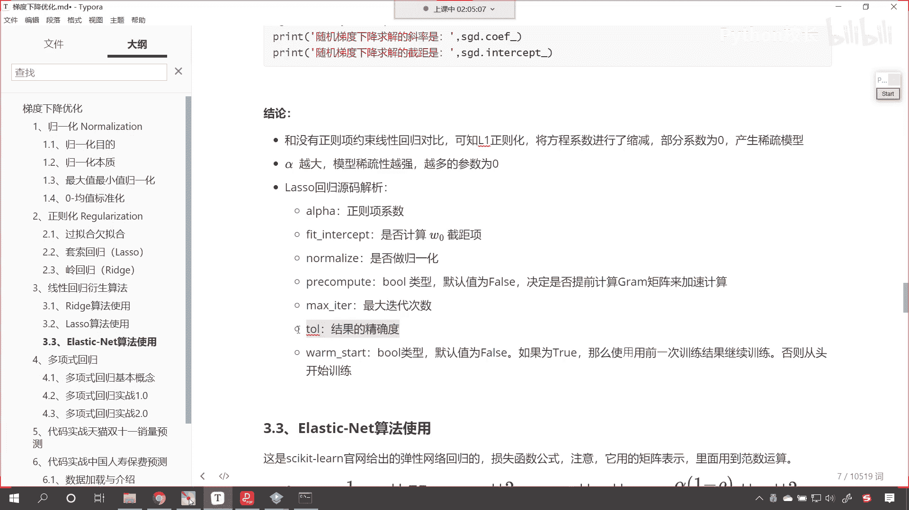