# 复旦大学经济学院《机器学习与量化投资》（Spring 2020） - P5：Lecture 5 Logistics Regression - ___main___ - BV1fv411r7z1

大家好，我们今天来讲一个新的回归的方法，我们上次讲的是线性回归，我们看到线性回归是借助假设函数是线性的函数，当然是在高维空间的线性函数，高维空间的线性函数就对应着高维的线性空间中的超平面。

但是线性回归主要是处理其输出的变量是连续性的变量，比如说输出的变量是可以取所有的时数，显然线性回归对于分类问题是不大合适的，当我们处理分类问题，正如在我们在感知机那一节看到的。

分类问题通常是在空间中有两种颜色的点，或者说输出是两个离散的值，这两个离散的值比如说是0或者是正1，但是当我们用线性回归试图去处理这样问题的话，本质上说我们就需要我们得到一个超平面。

超平面上的值其实它很可能是远远不是介于0 1之间，或者说是远超在0 1之外，所以我们发现这样的一个连续性的函数，去逼近离散型的函数看上去是不大靠谱的，所以我们还是想看看如何去修改我们的线性回归的方法。

使得它能够对于分类问题也能够派上用场，这样就诞生了逻辑回归，其英文叫做logistic regression，我们现在就来看看这个想法是怎么样加进来的，好，我们来看，我们先从给定的点击出发。

所以说我们看平面上给出这些点再一次的，我们总是这样的出发点就是x1 y1 x2 y2，加定给了n个点，其中每个x都是rk空间的一个向量，y这次仍然是取离散的值，比如说0或者是1。

我们怎么去逼近这样的一个离散函数，我们可以去这样想，首先我们还是对线性函数感兴趣，所以说我们还是在所有的线性函数，构成的假设类中去考虑，比如说对于w也是rk空间的一个点。

当然我们还可以取一个实数b就是所谓的结据，这样我们就可以构造一个线性函数，这个线性函数就是x的转值乘以w再加上常数b，当然了它也是w的转值乘以x加上常数b，好，正如刚才我们说的。

我们这样做其实得到的是一个连续函数，这个连续函数首先不一定介于0 1之间，它当然更不可能只取0或者1，同时完全有可能取到0 1很远之外的地方，所以我们首先想怎么才能够把它限制到0 1之间。

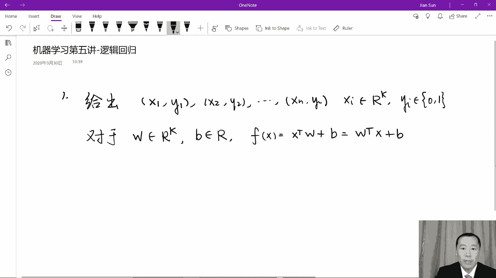

甚至怎么让它的取值尽可能的接近0和1，那么我们就设想去构造一个函数，比如说我们去构造，构造一个g，其取值是所有的实数r，其定义在所有的实数r上，取值我们首先把它限制在0到1之间。

同时我们还希望这个函数值其实是绝大部分的时候，是尽量的接近到0或者是尽量的接近到1，这样的函数其实有无限度，我们随手其实都可以画出来，比如说我们在这里画一个图，这是0，那么这是1。

我们随便就可以画出一个图来，这样的一个函数你看它取值在所有的实数上，但是它定在所有的实数上，但是它的取值却是在0 1之间，比如说我们就直接写出一个来，1加上e的x分之1，好，因为对于任何一个实数来讲。

e的x取值是正的，所以说1加上e的x分之1，首先它是大于0的，其次它是小于1的，这样一来我们眼前就有这么一个现成的函数，它就是取值在0 1之间，而且我们看到我们看看两边的极限。

那就是当x趋向于正无穷的时候，好，我们在这里面再加上一个，其实我们在这里稍稍改一下，好，那么一样，那么x趋向于正无穷的时候，那gx趋向于1，那么当然x趋向于负穷的时候，那么gx就趋向于0。

所以刚才我们定义的，就是刚才我们分子，少写了一个e的x次幂，其实无所谓，如果我们的分子就写1，也是其实结果这个函数仍然是可用的，只不过大多数的情况下，大家喜欢写成一个递增函数的情况。

当我们写成一个递增函数的情况，这个函数就可以稍加改造，我们上下除以e的x次方，我们就可以看到可以写成这个样子，好，我们构造这样一个函数，其目的就是把我们的线性函数。

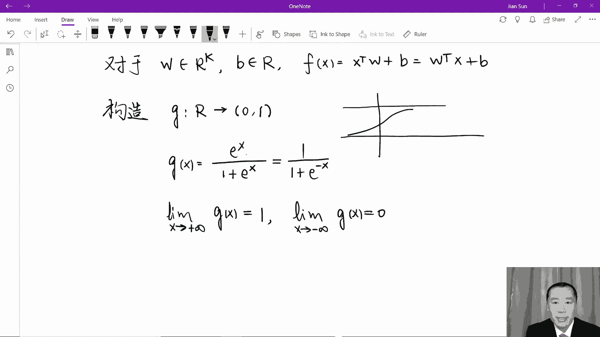

符合在一起，我们看，这样一来我们复合，hx是等于g，把f和g符合在一起，当然写在一起就是这样的，分子是1，分母是1加上e的，这边就是负的括号，w的转值乘以x，或者x转值乘以w，再加上一个常数b，好。

这样的函数，它就是定义在rk空间上的，任何一个向量x上，其w是一个参数，b也是一个参数，其取值就变成了0 1之间的，这样一个取值了，好，我们有了这样的一个值，它是定义在0 1之间，接下来我们的问题。

就是如何构造咱们的损失函数了，你想，数据点也给出来了，我们的假设集合，就是所有的w和常数，和1元的b也给出来了，那么下一步不就是构造，这样的一个损失函数，就是我们怎么去解释，我们构造出来的函数。

是足够的逼近一个分类问题，一个取值是0和1的，这样的一个分类问题，一方面我们可以延续以前的想法，那就是构造距离，也就是说我们可以希望，我们得到的函数值，跟原来数据点的label。

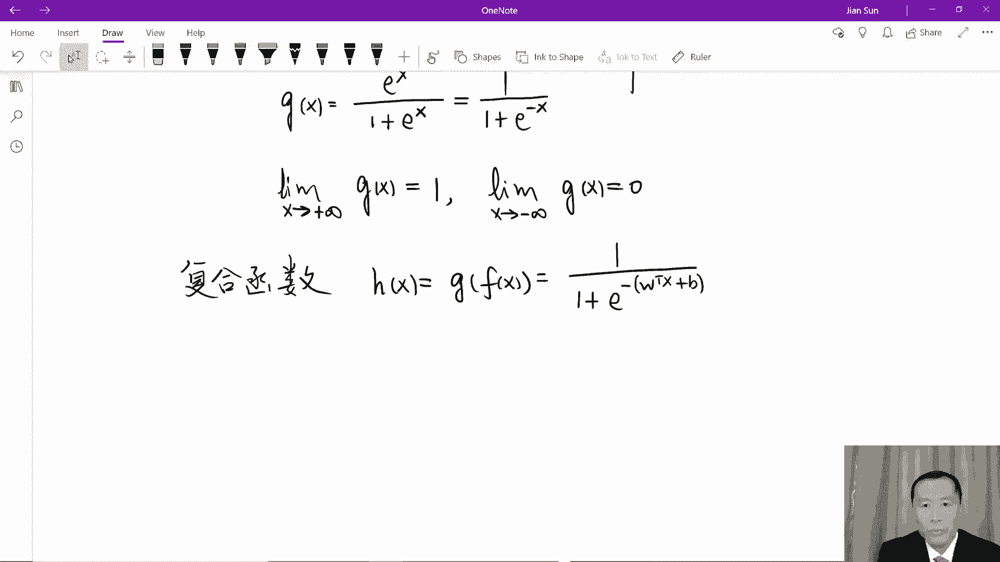

0 1之间，在某一种距离下，足够的接近，但是我们今天换一种思路，我们引入概略论的这种想法，好，所以我们现在换一种思路，概略论的想法，我们看到概略论的想法，同样可以帮助我们来构造，损失函数。

怎么样去引入概略论呢，你想，如果我们把平面上的点，这些xi和yi，我们想象成，它们之间就有某一种概率分布，同时当然首先是x，和y在一起，如果我们把它都看成随机变量的话，一个是取。

以k为的空间的一个随机变量，一个就是，一个离散的随机变量，取01之间，这两个数的这么一个随机变量，那么联合起来x和y，看成一个整体的随机变量，它就在我们概率论里面，就应该有一种联合分布，好。

有了联合分布的概念，当然我们就有条件分布的概念，比如说我们给定了一个x，我们问，在条件给定x情况下，y=0的概率是多少，或者是y=1的概率是多少，这个就跟我们的分类问题，就密切相关了。

其实在绝大多数情况下，我们去理解，我们平面上给定的点击，如果你要非要把它理解成，是一种确定性的关系的话，也就是说给出了x，背后的函数，是一个非常确定的函数，对应的就是一个y，这是一种想法。

但是我们在开始机器学习，给大家进行机器学习综述的时候，我们也说过，那么用概率的想法，其实这也是另外一种想法，也就是说我们认为，其背后的函数关系，并不一定是确定的，你给出了x。

那么y仍然有一定的概率是取0，和一定的概率去取1，在这样的一种想法下，其实我们就需要把概率论来引入，好回到刚才我们说的，如果说我们把x和y，这样看成是两个随机变量，那么比如说他们要满足一定的联合分布。

而我们是不知道联合分布的，所以说我们要去猜背后的联合分布，如果说我们猜到了背后的联合分布，当我们进行预测的时候，也就是说我们知道了某一种联合分布，那么你再给出我x，我在预测相应的y的时候。

我关心的是这种条件分布，所以条件分度就是说，我给出了x以后，我想问y=0的概率是多少，同时我们也想，由此我们也想知道，给定x之后y=1的概率是多少，当然这两个概率，在我们二分类的情况下。

当然加起来就等于1，好，所以说我们学习的问题，在这里就变成了去为了预测，我们的想学习的就是，我们想学习，我们想学习条件分布，同时我们可能还想学习，联合分布，但无论如何，我们先看看条件分布。

我们怎么去学习它，为了学习条件分布，当然在这里我们需要先去给出条件分布，所满足的这么一个函数，的假设集合，我们通过刚才跟大家的介绍。

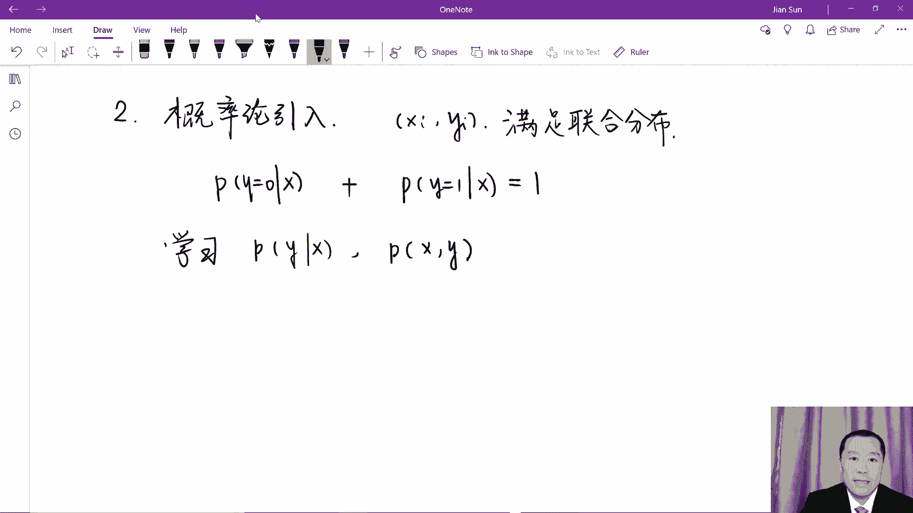

就是线性函数，同时我们再通过一个特殊的，一种所谓的gx在这里，以后我们慢慢的把gx叫做激活函数，我们把一个线性函数，在符合上一个激活函数之后，我们会发现。

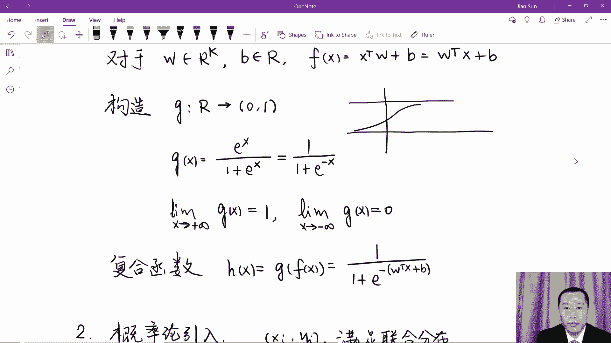

它的数值就介于0 1之间了，好，既然它介于0 1之间了，所以说很自然的，我们就来说，我们就可以说，y=1，在给定x的条件分布，就是刚才我们说的这个函数，就是1/1+e^-1，从而如果这个是成立的话。

那么给定xy=0的概率，那就是e减去上面这个值，那就是变成了，好，所以我们在给定的假设函数之后，再符合上一个激活函数，我们就可以用这两个函数，来模拟这个条件概率，下面我们为了简化我们的记号。

我们仍然做升为，同样跟我们以前做的一模一样，我们希望简化我们的记号，为此我们就需要定义，x1要升一位到k+1位，w1那就是b和w，因此从现在起。

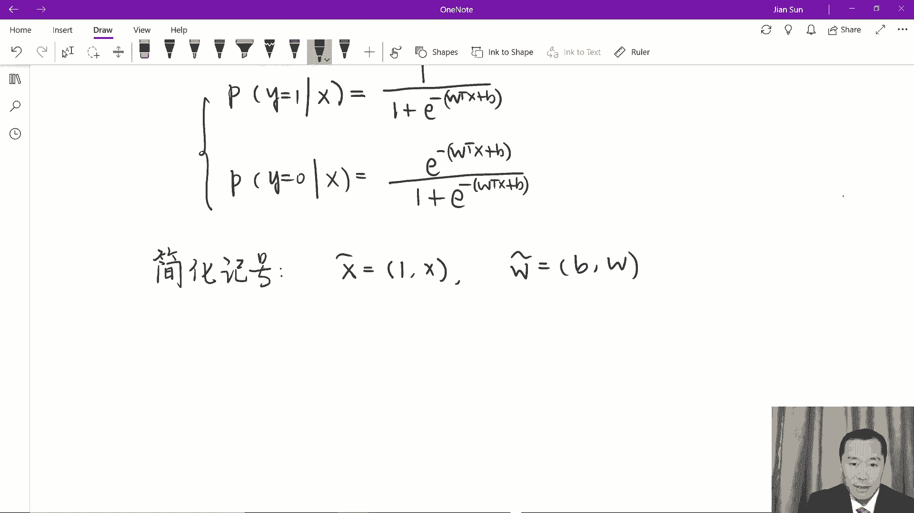

我们忽略x和w上面的q的符号，我们仍继承x和w，但是记住这都是升为以后的变量，所以又一次的我们来重新看，我们简单的符号下的写法，这是负的，好，所以每当给出一个w，我们就有了一个条件的分布概率。

而且我们现在来看一看，从几何上来讲，比如说w所对应的超平面，在我们二维空间就是直线，这个直线就是wx=0的这么一个超平面，在空间中是一个超平面，在我们的二维平面下，那就是一个直线，我们看一看。

我们知道任何一个点不在这条直线上，你比如说这个点叫做x1，x1不在这条直线上，那么x1到这条直线的距离，比如说这个距离叫做L，那么这个L是多长呢，L其实就是w和x的内积，它还要处于一个常数。

其实这个常数就是w自己的摩长，好，我们看到分子就是w和x的内积，分母是一个固定的数，我们在这里就可以暂时忽略，总之我们看到如果说这是这个常度的话，好，我们会有三种情况，比如说哪三种情况呢，回过头来。

根据这样的一个几何直观，再根据刚才我们构造的符合函数，我们就看到，给定x y=1，如果说我们就用上面的函数来代表的话，那么就会出现三种情况，一种情况就是这个w和这个x的内积，如果是大于0的话。

而且是非常的正，这是说明这个x距离这条线，在正的方向很远很远，但这样一来我们看这个概率，你把这个w和x的内积，带到上面的表示式去，那么这个exp这一项就会很小很小，因此exp是趋向于0。

因此这就接近于1，就会接近于1，如果是wx=0，那么exp那一项就严格的等于1，那么我们上面的概率就是0。5，同样如果wx是负的，换句话说就是这个x这个点，它距离这条线在另外一个方向很远很远。

那么整个的概率你计算去就会接近于0，换句话说我们通过这样的一个几何表示，我们看到如果我们上面定义的这种带，参数的条件概率分布。

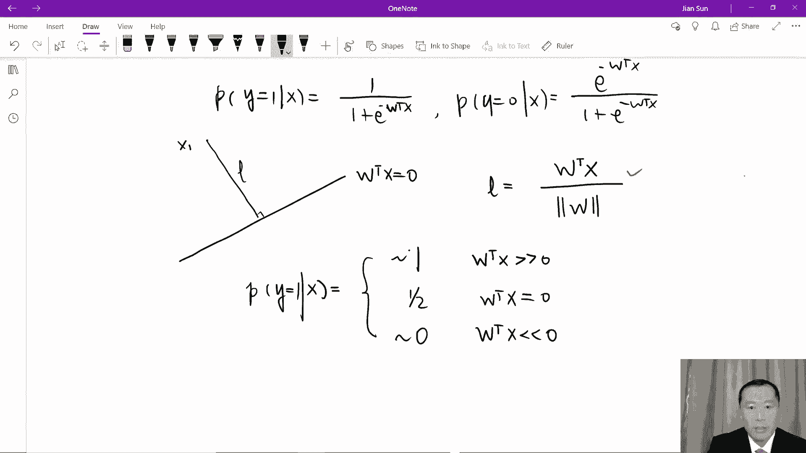

是这样表达的话，我们会看到在这根线的超平面的线上，在这个超平面的线上，对应的那些点，其条件，就是对应的那些y=1的概率就会很接近，就是1/2，而在这个线的一边就会接近于一边，可能会接近于1。

在另外一边远远的另外一边，在远远的另外一边，它很可能就接近于0，这个也符合我们二维分类的这么一个直观的想法，其实我们说如果说二维，我们在二分类，如果在空间中有两组点，这两组点一种是红颜色。

一种是比如说是黑颜色，我们就会看它们中间很可能还有一些，交相混杂的地方，我们就会想到，那么越离它们中间的地带远的地方，其分类就应该越明确，换句话说对应在这里的条件分布，就越是趋向于1或者是趋向于0。

越是在它们中间混合的地带，其条件概率就越接近于1/2，从我们分类角度来讲，就越发的分类不清，所以我们目前给出的参数的形式。

其实已经非常接近我们的直观，好，那么下一步我们就是来看，如何更确切的定义我们在这里的损失函数。

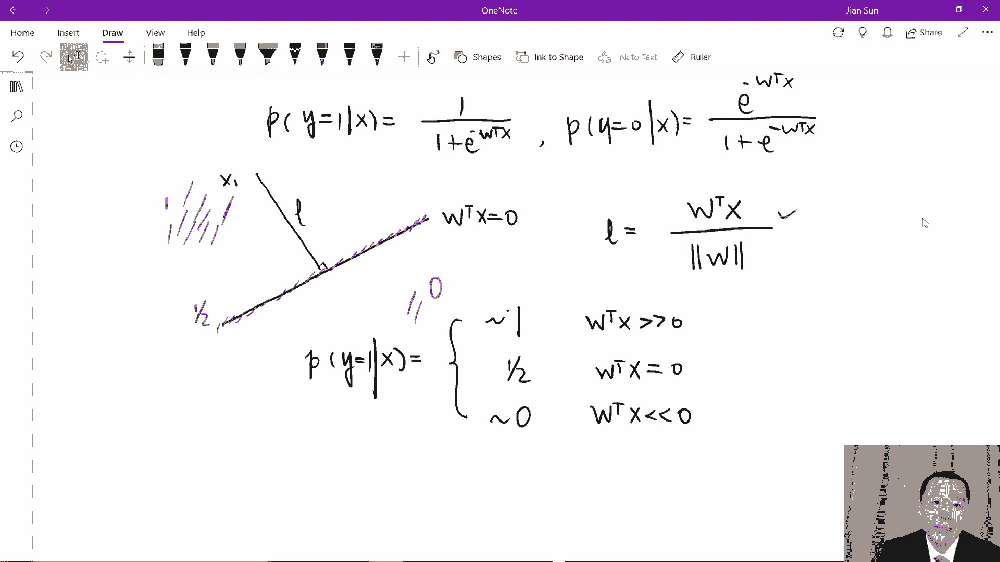

既然我们已经把概率引进来了，那我们下面就来看。

从概率统计的角度我们来看，有一个极大自然分布，有一个极大自然估计，极大自然估计说的是，如果我们假设所有的这些点都是iid的，也就是这些xi和yi给出的，都是独立同分布，在这样的一个情况下。

我们来计算它们出现的这些密度，我们正好看到x1y1一直到xn yn，它们是独立同分布的情况下，那么看到它们的密度应该是多少，我们已经知道它们的分布是什么样子的，就是说，我们再写一下xi和yi其。

给出来的这种分布，它就应该是，我们根据贝叶斯估计它应该有两个，一个是xi给出了yi乘以就是xi本身的分布。

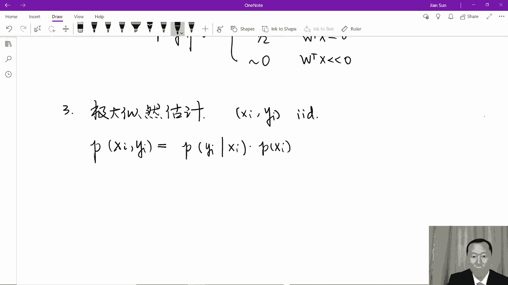

好 xi本身的分布，我们是从因为我们的参数体现在第一个表达式，里面体现在第一个的条件分布里面，而我们的参数并不体现在xi本身的分布里面，xi本身的分布，因此从我们的参数估计角度来讲。

其实对我们来讲就是无足轻重的，我们就当成它们是已知的，因为我们的参数仅仅体现在第一项里面，但是第一项里面怎么写呢，我们看到第一项里面其实就可以写成这个样子，也就是说yi可能等于1，y等于1的时候。

它是相应的概率就是下面这个概率，当然了yi也可能等于0，其相应的概率就是这样的形式，好我们看一看，就这一项，从条件概率角度来讲，因为它是一个二分类，永远可以写成这两个的成绩，其实这两个成绩看上去是成绩。

其实永远是其中取一项，比如说y等于1的时候，那就是取第一项，y等于0的时候，其实我们取的是第二项，所以无论如何根据y等于1，我们就取的是第一个条件概率，如果是y等于0，我们取的是第二个条件概率。

所以这总是正确的，然后我们把最后一个xi也把它放在这。

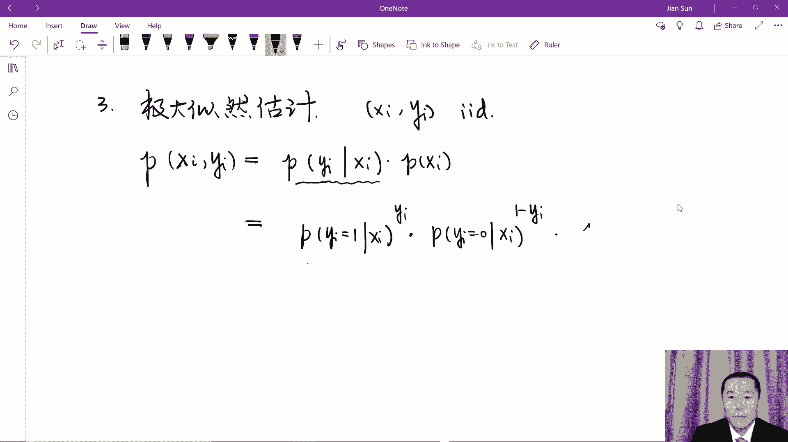

最后我们把所有的，因为是xi和yi给出的是独立同分布，所以当我们把所有的xi和yi的分布的密度，i等于1一直到n给出来的时候，这当然也就是给出了两步，i等于1到n的，我们现在写它，好，回到刚才我们说的。

从参数估计角度来讲，在这个中括号里面，其实是我们是有参数的，我们要想从极大自然估计角度来讲，我们是希望眼前的表达式，在所有的参数里面，去取眼前表达式最大的，那么就等价于我们忽略后面的关于px的项。

因为它跟我们的参数没有任何的关系，所以我们就极大自然的估计的第一项，就是前面的这一项，所以我们极大自然估计的问题。

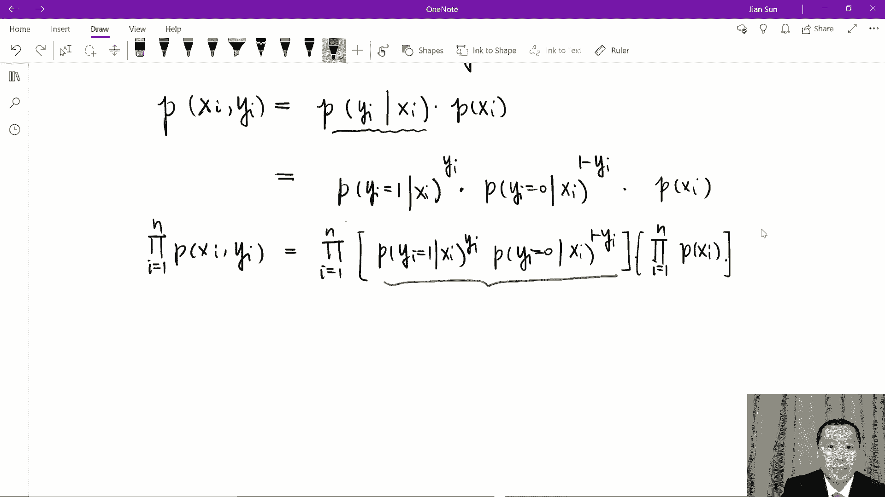

从概率统计角度来讲，就变成了去求解，argument max，去求解谁呢，去寻找所有的w，使得谁最大呢，就使得我们后面的这一项最大，那就是i等于1，pi等于1，xi yi，pi等于0，xi的1-yi。

去求解它的最大，好，我们甚至还可以把它写得更明确一下，其更明确一下就是，y，y1 y2一直到yn可以分成两组，一组是y取1的时候，一组是y取0的时候，你比如说我们先说它取1的那些。

就对于所有y等于1的那些我们来做，yi等于1，给定了xi的成绩，当然我们说的还有第二组，第二组就是所有的y等于0的，我们用yj等于0，那么就是yj等于0，这样就更简单了。

好，我们现在把我们的上面的参数代进去，就变成了argument max，那么这个里面就是所有的yi等于1的那些点，所以对应了就是1除以1加上e的负的，w的转制乘以xi，这是第一组。

那么第二组就是所有的成绩yj等于0，这里面就是e的负的w转制xj，前面就是e加上e的负的w转制xj，好，目前来看你只要给我x1到xn，y1到yn，我就一定可以计算出现在的成绩来。

对于任何一个w我都可以计算出成绩来，因为成绩给我的就是条件，概率的连成绩，根据吉他实验人估计，我们是在所有的w中，可能的w中去选一个，使得连成绩取值最大，好，我们进一步的说，如果要想让连成绩最大。

当然我们就可以取log，所以说同样的w就可以让成绩变成求和，就是log，加上所有的yj等于0的log，好。

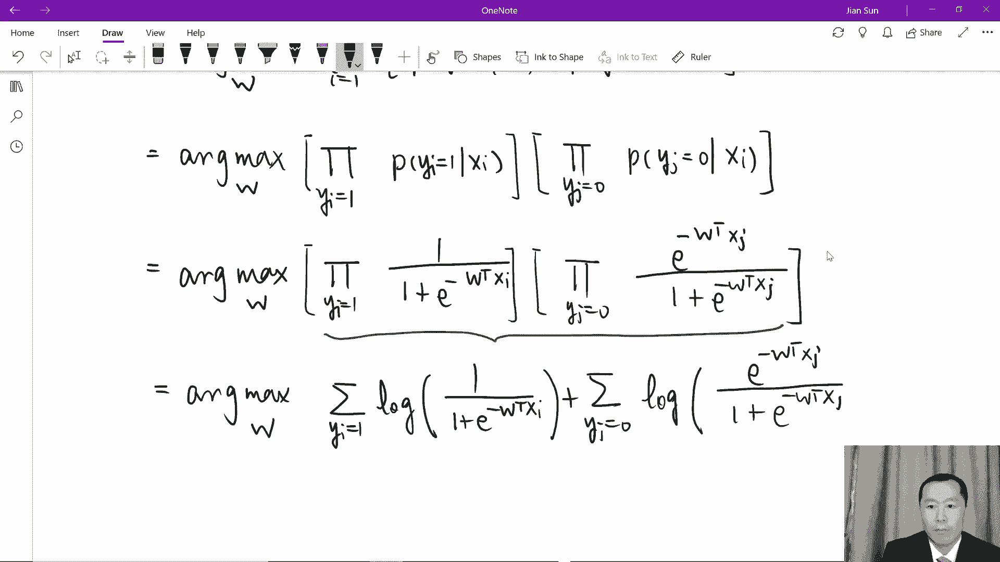

最后这是让它成为最大，如果我们把前面加上一个负号，就可以让它成为最小，让它成为最小之后，我们就可以写这是负的，好。

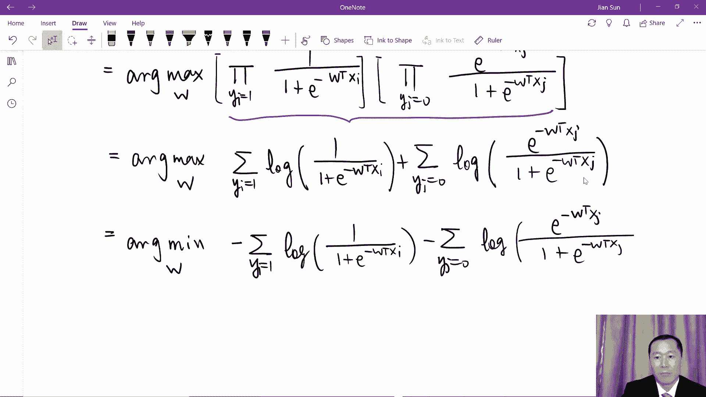

这样就跟我们的损失函数对应上了，换句话说，从吉他实验估计来讲，我们的目标是去寻找一个w，使得后面表达是最小，因此后面表达是，当然我们就可以定义成为我们的损失函数，咱们的损失函数用lw去表示，那就是负的。

所以对应在咱们的逻辑回归，现在积极学习的问题，我们就可以叙述清楚了，所以积极学习的问题，就是给定了独立同分布，凭空间中的一个二分类的数据，我们的假设函数还是所有的线性函数，符合上一个激活函数。

激活函数通常是取值0~1之间的，这样的一个激活函数。

符合上线性函数之后，我们的损失函数就定义成。

把每一个符合函数看成是一个条件概率分布，所以我们的损失函数，就是所有的条件概率分布的乘积，同时取一个倒数，我们在还可以前面取一个log，这样就构成了我们的损失函数的定义。

所以在这里的l就构成了我们的损失函数，好，最后我们来说一下算法。

我们有了这样的一个损失函数，我们怎么去计算它的极小值呢。

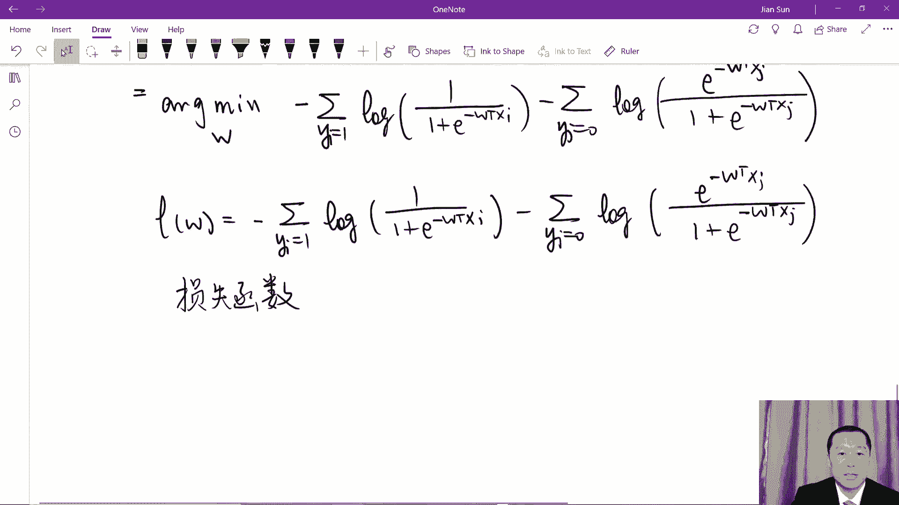

咱们在线性回归中，我们的算法是最后得到了一个B形式解，也就是通过我们去求梯度，我们得到一个B形式解，但是现在眼前的损失函数看上去非常的复杂，我们如何能求到一个B形式解呢。

我们想强调的是在这里B形式解是不存在的，所以我们必须要用数值解法来去优化极小的问题，所以这里其实是数值解法，数值解法，我们今天不在这里过多的讲，我们以后专门来讲数值解法。

其实数值解法有很多去求解这个函数的最小值，比如说常见的是梯度下降法，对于梯度下降法一个直观的解释就是下面。

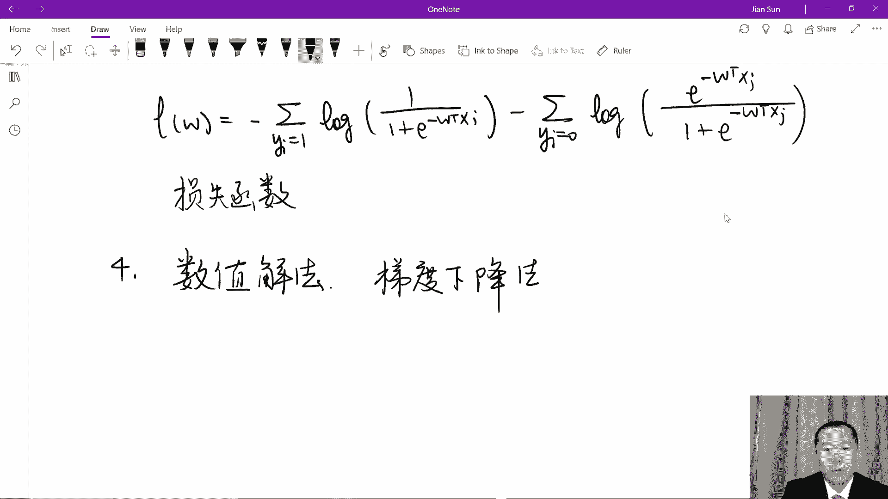

比如说我们现在有一个函数在这里面，这是函数fx，函数有一个极小值在这个地方，但是我们并不知道这个极小点在哪，我们如何才能够不断的搜索到这个极小点。

不断的搜索到这个极小点，其实你看方法很多，比如说一种方法是对于函数的导数，我们去求函数导数等于0的点，你去求函数导数等于0的点，我们上以前讲过我们可以做二分法，我们可以做牛顿法，我们可以做结线法等等。

所以说对于求解一个函数它的极小或者极大，其实你通过研究它的导数，这是一个方面，另外一个方面我们看，如果我们不去研究它的导数，我们从函数本身出发，我们随便给出一个点，你比如说这个点是叫做x点。

我们如何想办法让从给出了一个x点，如果它不是极小点，我们去得到一个比函数值在fx更小的点，首先在x点如果函数光滑的话，我们可以去计算它的切线，有切线就有斜率，所以说我们就会有f1-x。

好我们看到当f1-x>0的时候，也就是在x左右它是递增的，我们肯定要选取一个，为了让取函数值比x的函数值更小，所以我们会去x这个tota=x减去一个，比如说一个很小的数delta x。

这是在f1-x>0的情况下，如果在另外一边f1-x<0，那么如果这个是x的话，我们希望去选取xtota=x要比它大一点。

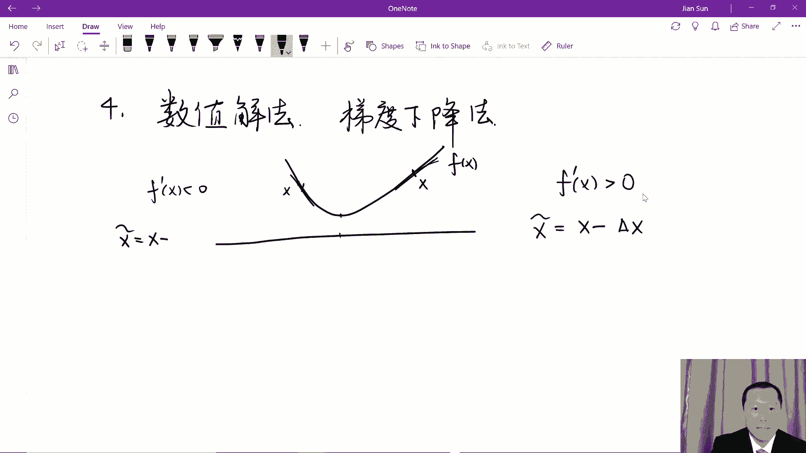

好这就是一个很直观的想法，一般提度下降法指的是一般来讲，我们给出一个函数，它可能还是一个rk空间到r的一个，多元的这么一个函数，多元的函数我们可以计算的是它的t度，也就是它对于每一个分量的偏导数。

我们就给定了xn到xn+1之间，其实可以做一个迭代，这个迭代就是xn+1=xn沿着t度方向，减少这么一个eta倍，eta在这里是一个常数，它是一个大于0的这么一个常数。

所以眼前的迭代公式其实就叫做t度下降，因为我们在xn+1是从xn到xn+1，是沿着t度的方向下降了一些。

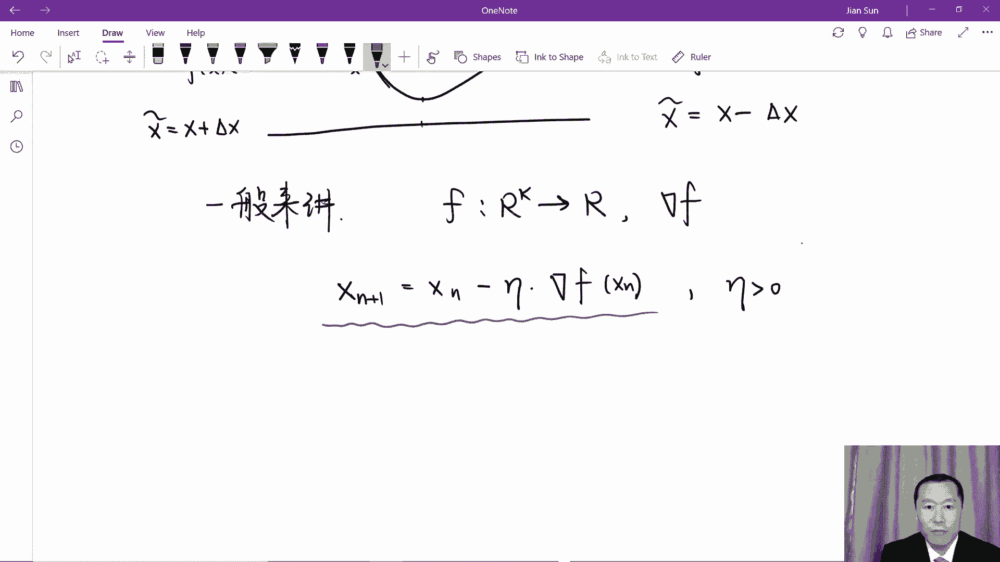

好这个方法就叫做t度下降法，t度下降法对于我们函数是充分光滑的函数。

是比较有效的一种方法。

所以说用这种数值解法，我们应用到我们的逻辑回归的时候，它也是比较有效的，好所以我们从机器学习的这4大方向，从数据，然后从假设函数到损失函数的定义，到最后优化算法，所以我们就都有了这4大方法。

在一起就构成了逻辑回归。

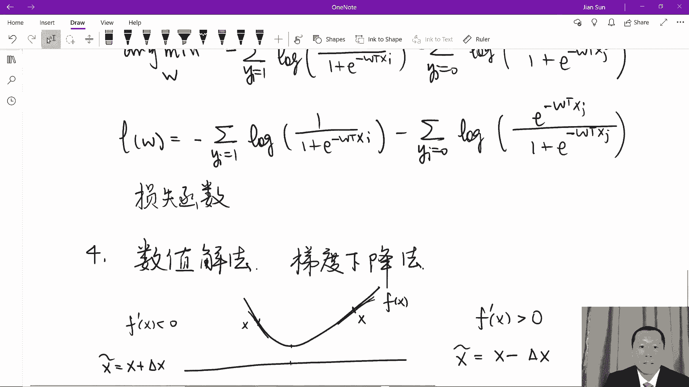

逻辑回归是非常有效的一种方法，你比如说把它应用在我们的，应用在我们的二分类上，就是如果说我们在平面上有若干点，给出来的这些黑色的点，我们上次看到可能还有一些红色的点，平面上我们试图把平面上黑色的点。

和红色点分开，找到它们之间的关系，同时对于还可以做到预测，就是对于平面上认给我一个点，我还能够去预测这个点将被分类成黑色，还是红色，对于这样的一个问题来讲，我们看到感知机，如果是完全可分的情况下。

感知机是可以做到的，完全可分，如果不完全可分，线性规划，可以做到，同时我们还可以，这次我们还讲了逻辑回归，也可以做到，甚至我们在作业中，其实还布置了这样的一个问题，我们在作业中是布置了这样的一个问题。

就是说我们定一个损失函数，这个损失函数是非常自然的一个损失函数，是什么呢，随便给我一个w，这是RK空间的一个向量，我们不是可以用线性的去区分吗，也就是说我们可以去计算，w转制乘以xi。

对于只要它区分正确的，乘以yi，我们就认为它是做对了，对于它区分错误的那些xi，就是它区分错误的那些xi，的集合，显然这个集合我们认为是被区分错误的，就是对于这个w，这个集合就是都被区分成错误的。

那么既然是错误的，我们能不能定义我们的损失函数，成为就是这个错误的集合的个数呢，而最后我们的问题就变成去，很直观的就是我们能不能做一个算法，去minimize我们的这种损失函数，在所有的w中。

Rk空间去所有的w我们去minimize，这样的一个损失函数，如果说我们把这个做到了一个，我们利用python的软件，调到一个minimizer的软件包里面去求解出来。

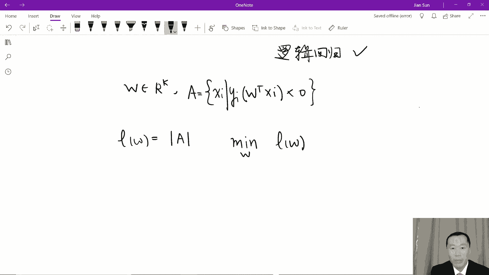

这不也是一种方法吗，而这个方法明显的不同于感知机的方法，不同于线性规划的方法，也不同于逻辑回归的方法，而这个方法看上去是似乎更自然的一个方法，我们在作业中给大家布置了这个。

但其实大家要去亲自求解的时候就会发现了，这个方法你可以去设定这样的方法可以去编程，但是它的结果是超级不稳定，就是说它或者没法给出你一个答案。

算法本身会终止，或者给出的答案是非常不稳定，就是这次给你这个答案，下次给你这个那一个答案，其原因本质，这就揭示了我们积极学习的另外一方面，就是说虽然有的时候你可以把这个问题，你把它提的非常的自然。

但是它的解法其实是不稳定的，没有一个很好的优化算法在这里，或者其优化算法先要处理的时间是大大超过，我们计算机中常说的多项式的时间，而是一个指数长度的时间，遇到这样的问题。

通常这个问题表面上你可以描述的很好，但其实仍然从实际操作来讲是不可解的问题。

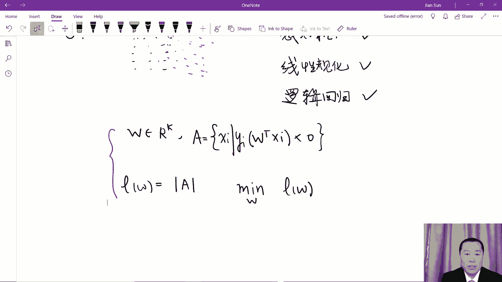

眼前的这个问题主要的问题在哪，在于离散函数，这个损失函数是一个离散的损失函数，对于一个离散的损失函数来讲，我们去优化它在全空间连续的RK空间，这样一个连续的空间，去优化一个离散的损失函数。

通常是非常难做到，所以这个问题其实是一个在有限的，这么一个多项式的时间内，是完不成的这么一个问题，所以大家可以再尝试。

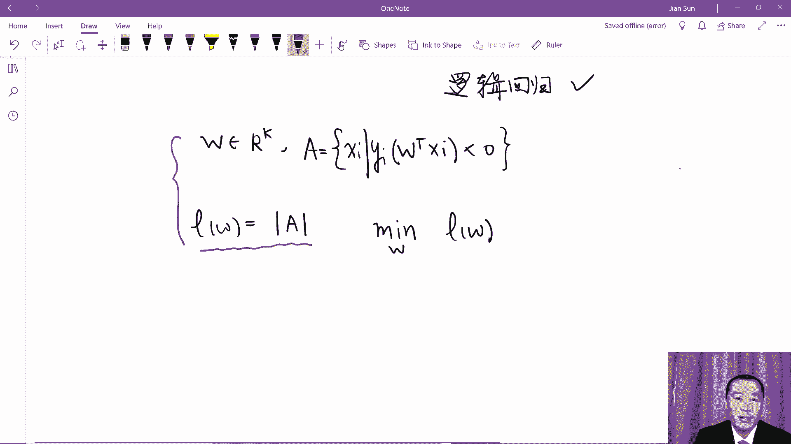

但是从真正的算法上来讲，还是要依赖感知机先进规划，逻辑回归以及我们可能以后还要讲到的，其他的一些办法，而不能从非常幼稚的，从去求解这样的一个优化问题，去着手解决平面上的二分类的问题。

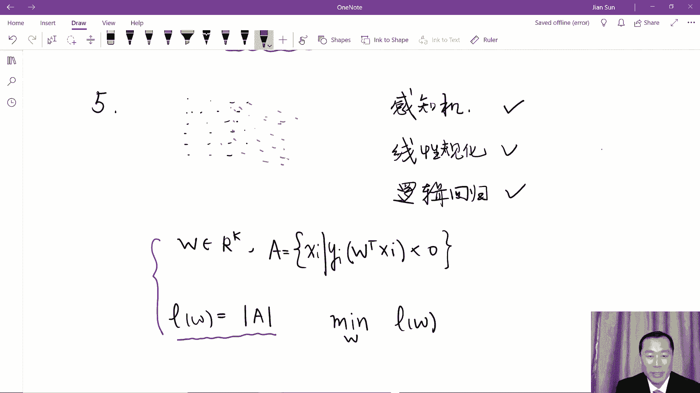

好这是我们要说的第5点，那么第6，我们在两个方面，我们要来推广我们的逻辑回归，哪两个方面，第一个方面，如果是多元分类怎么办，我们先来讲多元分类，在我们眼前是给定的这些数，XI和YI都有特点。

就是YI取两个字0或者是1，可是我们经常会处理到一些问题，比如说我们在做一种给大家布置的，手写的那些数字问题，我们一个人可以手写0123456789，这10个数字，而我们试图去识别手写的这些数字。

那么显然它的分类就不是二分类，而是一个多元的分类，在手写数字里面，我们需要做10个不同的分类，我们怎么去处理10个不同的分类的，这样一个分类问题，那就需要我们看看能不能从我们的逻辑。

回归的角度去得到一些灵感，咱们逻辑回归的角度，你看它的函数表达式是这样的，我们说Y，等于1，给定X，它的表达式是1除以1，加上1的负的W转制乘以X，当然Y等于0，给定X，它的条件概率分布就是我们说了。

就是1，除以1除以正的W转制乘以X，好，而这个等于1，我们又可以写成1加上正的W转制X，就是1的正的W转制X，好，所以我们进行二分类的时候。

我们需要去寻找一个向量W，如果我们进行三分类的时候，恐怕一个W就不管用了，我们可能就要再引入一个W，我们进行多元分类的时候，同理我们需要多个W，好，我们从眼前的表达式，这个地方，我们就可以去设想。

比如说，如果说给出的数据，是多元分类的数据，XI YI，这里YI是可以取，对0，1，M个数据，那么如果我们把0放进去，那就是YI可以取01，一直到M-1，而在这样的情况下，我们的目标。

就是我们的假设集合，也要有W1，W2，一直到WM-1，我们定义我们的条件概率，那就是给出了XI，其YI，等于，比如说K，K是介于01，一直到M-1，之间的这么一个数的时候，那么它的概率。

根据我们上面的几发，就是E的WK的转制，乘以XI，除以，一加上，一加上所有的，E的WK的转制，乘以XI，这里，K要从，E一直取到M-1，好，而K是要取E2，一直到M，这里的K取值范围是小于等于M-1。

是大于等于E，当K取于0的时候，那就是剩下的，所以说YI等于0的概率，这个条件概率，那么就跟刚才一样，分子是1，分母就是1，加上，所有的求和，好。

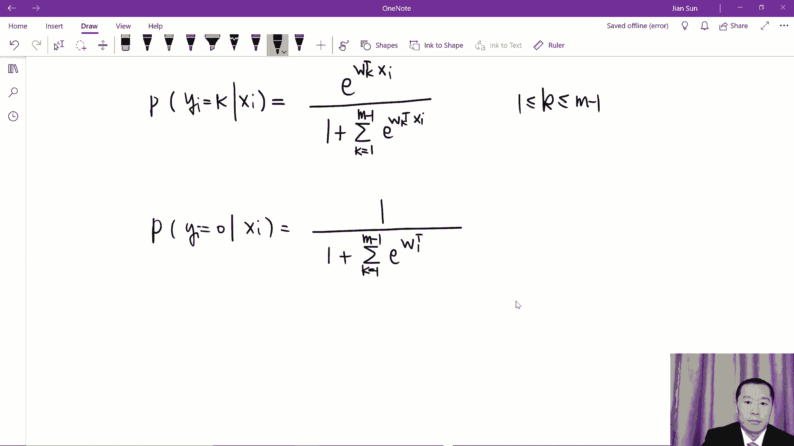

这样当我们引入了，W1 W2。

一直到WM-1，都是RK空间中的一个向量之后，我们就定义了这样的一组条件概率分布。

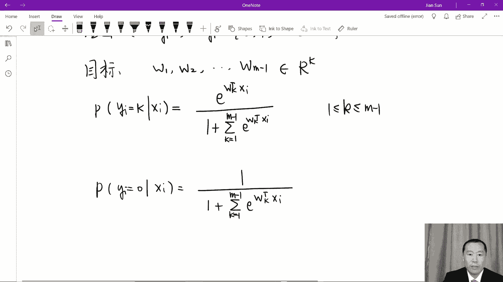

显然这一组条件概率分布满足，YI等于，比如说等于K，XI，这里的K是可以从0，一直到取得M-1的时候，其总和就是1，所以这就是一个全概率分布，这样一看，我们定义的概率分布。

其实还是比较有意义的，也就是它确实可以作为一个概率分布，因为我们在这里的定义的每一项，这里的每一项，都是大于0，小于1的一个数，而其总和是1。

好，我们做这样一个定义之后，这是我们的假设空间，我们的损失函数，还是从极大私人估计的角度，去考虑这个问题，损失函数，那就是出现的XI YI的密度函数，最后就约化成为出现了XI。

那么去判断YI的条件分布的密度函数的，成绩，那么成绩就是跟我们前面一样。

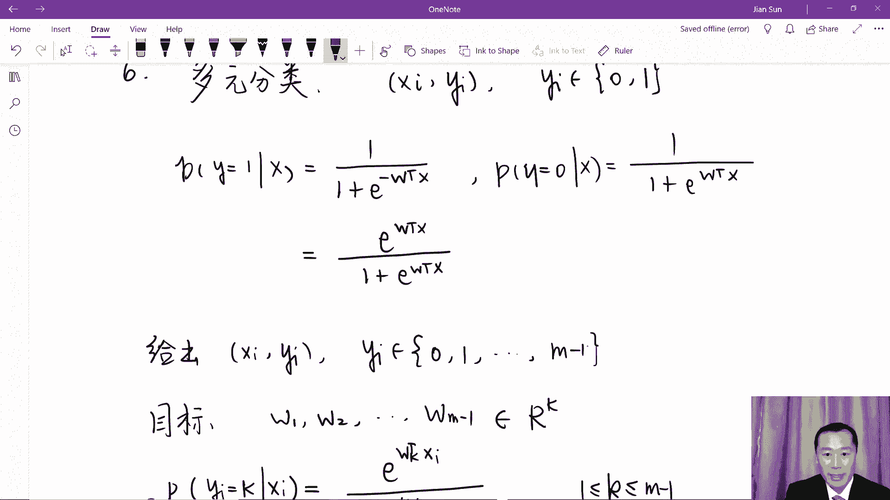

类似我这里就不写了，也就是说你把所有YI等于0的，乘在一起，所有的YI等于1的，那乘在一起，所有的YI一直到等于m-1的，成绩在一起，最后我们的算法就是利用t度下降法，去寻找所有可能的W1。

以及Wm-1，去minimize我们的损失函数，或者是说去maximize，我们的这种私人密度函数的成绩。

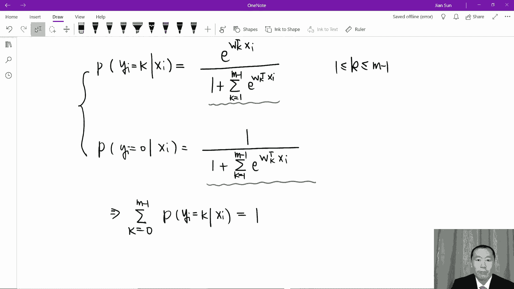

这就是多元分类，也就是说逻辑回归，它的是可以处理多元分类的，在python的软件包里，你去调logistic regression，其最后输给它的数据，可以是超过二元分类的，多元分类是可以的。

好，最后一点我们提及，另外一个方向的扩展，就是引入非线性，非线性的引入，比如说我们现在来看平面上，有一组点，这组点就有这样的特征，红色的点，这些是红色的点，黑色的点在中间，好，黑色的点在中间。

红色的点在外面，如果说我们的点击是这样的一个情况，你看我们显然这不是一个线性可分的情况，它不是线性可分的，而且更重要的是，我们如果是，随便给了一个超平面，去截它，似乎看上去也不是一个很好的解决办法。

也不是一个很自然的解决办法，相反，如果我们用一种非线性的函数去截断它，你比如说在这里有一个圆，看上去会更好，那就是圆内和圆外，其红色的点和黑色的点的这种分布，就更加的一致和协调。

但是这个是我们目前讲到的方法所没法容忍的，因为我们目前讲到的方法多半都是以线性，在空间中表现出来就是超平面来区分的，那我们如何把我们的非线性也把它引入到，加入到我们现在的现有的这些所有的这些模型中。

我们在这里就提及一下，比如说眼前的这个问题，眼前的这个问题就是如果我们在X1，X平面我们眼前的平面的两个坐标，我们用X1和X2来代表，那么显然黑色的点它似乎就代表着，X1的平方加上X2的平方。

小于等于C，C就是半径的平方，比如说C的平方，这是一组点，那么另外一组点就是X1的平方加上X2的平方，那必须大于C的平方，好 这样一来说明什么呢，说明如果说你线性的区分X1 X2是不可能的。

但是你把上面的这些点，就是这个平面上的点，你用一个非线性变换，利用就是比如说Y，我们做一个非线性变换，你比如这个非线性变换是，把每一个点都X1的平方加上X2的平方，这样我们就变到了一个实数中去。

你看黑色的点都变成什么了呢，都变成了距离圆点很近的黑色的点都会处在这，红色的点就会跑到这个之外去了，不是sorry，这里面有一个，因为这是正的，所以黑色的点都是0在小区间在这个地方。

那么红色的点都跑到这个地方去了，那么显然我们要想区分它，那么这一个点就够了，在这个点，比如这个点就是C，在C小于C的都是黑色的点，大于C的就是红色的点，这不就是一个线性区分吗，当然这种情况是我们知道了。

完全知道了，原来一个圆就是可以区分它们的方法，如果我们不知道的时候，或者说这个圆，或者它未必是个圆，它可能是个椭圆，或者是个其他的这种形状，就使得我们未必就直接能够把这个，非线性的变换能够写清楚。

从而我们就可以去采取这样的方法，也就是说本来它们是在二维平面上，现在我把它把非线性项加进去，那就是我既保留x1 x2，同时我也加上x1的平方，x2的平方，同时还要加上x1乘以x2，你看原来是在R2中。

现在它就在R5中，所以在R2中，我们利用线性方法区分不了的点，在R5中，我们就有可能去用线性的方法，来区分它们，对不起，这不是R2的平方，这就是，就有可能去区分它们，这样一来我们就不在R2中做。

而是在R5中做，在R5中仍然用线性的方法来做，但是就相当于在R2中，用非线性的方法来区分了，好，你看像这样的这种平面上，R2到高维空间的这种，变换仅此一个吗，当然不是，因为我们在这个里面。

其实仅仅是把函数的二次项引入，如果我们还要引入更高次项，比如说我们还要把三次项引入，可能就需要x1 x2，二次项，还要再加上三次项，对，那现在是多少，它就是在R9中，好，那么同理你要想加上四次项。

或者是五次项，更高次项，你还要继续去扩大，你的最后的目标。

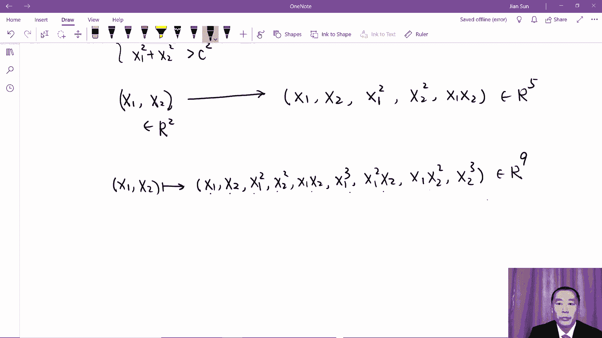

最终的空间的维数，好，虽然这种方法看上去，有点累赘。

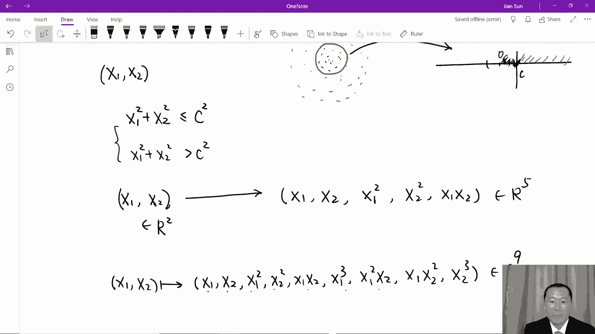

但确实是可以帮助我们，可以从把这个问题，从一个线性问题，变到一个非线性问题，我们以后还会在感知机，我们以后还会在支持向量机模型中，还会看到，更系统的办法，把一个非线性的项，引入到我们的这种分类问题中。

但至少眼前，大家在可以很简单的处理到，如果你有一些数据，我们利用感知机，线性回归，或者是线性规划，或者是逻辑回归，处理不了的问题，就可以尝试，先把从眼前的空间，扩充到一个更高位的空间，来把非线性项。

一些低次的一些多项式加入进去，试图在一个更高位的空间，我们来处理这个问题，如果处理的会更好的话，那么就成功了，如果处理的不好的话。

我们很可能就需要去考虑，用一些其他的更高级的模型，所以在这里我们给大家提醒大家，感知机，线性，规划，线性回归，和逻辑回归，都可以，引入非线性项，所以虽然你引入了非线性项，但本质上你还是在做线性的问题。

还是在利用线性的方法，只不过人为的，我们加入了这些非线性项，好。

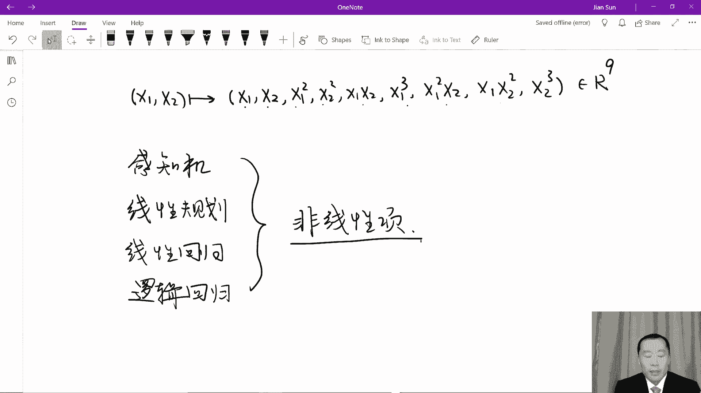

我们今天从逻辑回归的角度，就给大家讲述了什么是逻辑回归。

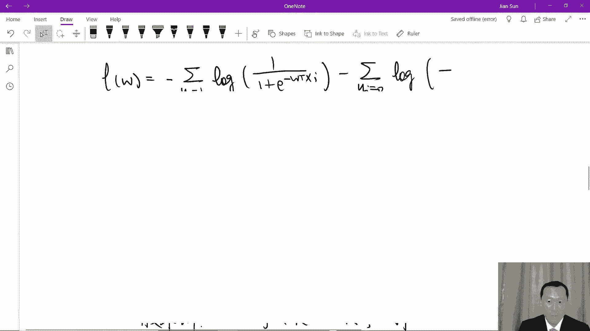

我们把概率引入到了逻辑回归的体系中，我们从极大自然，密度函数的角度，重新定义了损失函数，同时给大家简单的讲述了，梯度下降法，作为我们去求解这逻辑回归，是作为一个很主要的方法，而且我们以后也会不断的讲到。

梯度下降法，最后我们讲述了在两个方向的引申，一个是从二元分类，跨越到多元分类，一个就是我们把，刚刚讲的，我们把线性的方法，扩展到非线性的方法。

好，我们今天的课程就到这里，谢谢大家。