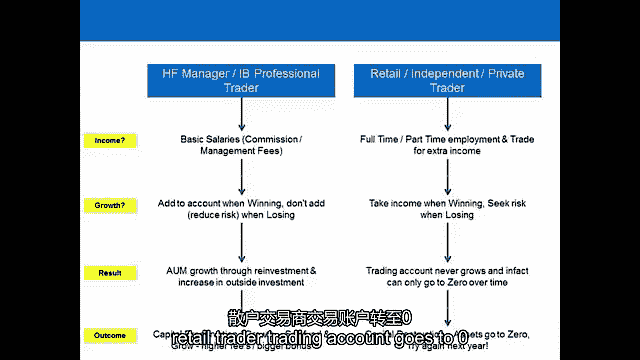

# P1：1-1.第1讲 专业人士vs零售交易员 - web3深度学习 - BV1be4y1c7ir

嗨，我们首先要讨论的是非常非常重要的，我们将讨论零售交易员和专业交易员之间的差异，但我们将从专业交易员1-0-1开始，它本质上定义了什么是专业交易员，一个成功的专业交易员现在实际上是做什么的。

这真的很重要，千万不要小看它，从专业教练的角度来看，3。我可以很明确地告诉你，专业交易员现在做什么，这导致了一个大问题，因为本质上是零售教练，他们的目标是，成功的培训师是做什么的，但现在用自己的钱做。

这是一个问题，因为它导致散户商人制造许多，很多，很多错误，走上错误的交易道路，现在，一旦你明白了什么是一个专业的交易者，一个成功的专业教练是做什么的，然后你就可以开始用自己的钱效仿了，专业交易员所做的。

所以我们现在要去舞台，我希望你能专注于你的目标，作为一个散户，你的目标是赚钱，用你自己的钱，在这个过程中模仿成功的专业教练，因此，我们将从定义什么是专业教练开始，然后我们继续下一节。

成功的专业培训师所做的，让我们到舞台那边去，我们在另一边见。

所以我们要做的第一部分是定义专业交易员的工作，问题一，投资银行的人对专业交易员来说是什么，那家伙做什么，对冲基金做的，它们是完全不同的功能，完全不同的角色，这对试图效仿他们的散户意味着什么。

以及专业贸易商与零售贸易商的区别，投资银行的专业交易员，交易员90%的时间在投资银行，实际上是花在做市商上的，他们只有10%的时间花在交易银行的钱上，并用这笔钱试图获利。

所以当你在电视上看CNBC彭博社，你看到，你看到交易大厅了吗，到处都是男人，他们的桌子上有很多屏幕，他们实际上做得好的是什么，百分之九十的时间，他们只是在市场上给客户定价，所以这就是我们作为散户所做的。

谁说是，但显然不是，我们没有任何分数，我们不在乎这里的目标，就像这位先生，已经概述的就是赚钱，用自己的钱赚钱，对做市没有兴趣，但让我们看看生意，它实际上是如何工作的，做市商实际上是银行的面包和黄油。

它分为两类，真的，这是一个代理业务，也是一个有风险的业务，好的，我们所说的代理业务是什么意思，你对客户没有风险，所以代理业务，从字面上看，一个人从养老基金或对冲基金打电话来，他们想购买一项资产。

他们命令银行代表他们购买资产，刚刚在市场上执行，收取佣金，佣金按基点收取，一百个基点就是百分之一，那么现在典型的佣金是多少呢？任何人，你觉得怎么样，在一个代理交易上，他说五个基点，是啊，是啊。

超过四五个基点，大约十年前，代理业务的行业标准约为25，所以在市场上，所有的东西都是不变的，这是银行挣扎的原因之一，这对银行来说是完全没有风险的东西，电话铃响了，售货员接单，把它放进系统里。

它通常会进入一个算法，算法以电子方式执行，所以人类的干预很少，这几乎是所有做市商的80%，那么这告诉了你什么，就投资银行交易员的时间划分而言，它告诉你号码是多少，就时间而言。

他们每年花90%的时间做市场，它80%的代理权，所以大多数时候他们实际上只是坐在电脑前，观看市场上正在执行的订单，只是监督他们，这是绝大多数专业交易员，投资银行有，挺无聊的，但人们的看法是，这完全相反。

人们认为交易缺陷是这些巨大的活动蜂巢，噪音很大，每个人都在互相大喊大叫，完全相反，现在你可以走上高盛，摩根士丹利，美国银行，梅林的交易大厅，它比这个房间安静，他们大多数时候都是这么做的。

所以有两件事首先把它从你的脑袋里拿出来，交易员的工作令人兴奋，它不是，字面上正好相反，真的真的很无聊，和，其次，如果你是个零售商人，投资银行的绝大多数人所做的，如果你想模仿他们，你不是在模仿他们的做法。

绝大多数时候，因为你的目标是用自己的钱赚钱，不通过算法执行客户的订单，百分之二十的做市商都有风险，所以不是客户打电话到办公室，养恤基金，对冲基金，并向交易者发出无风险订单，他们只是加入了一个算法。

电话铃响了，一个售货员接了起来，客户要求资产的价格，做市商对客户承担风险，他们从另一边走是什么意思，举个例子用500美元买了一千万美元的苹果股票，所以两万股，实际发生的事情，交易者在另一边做空。

所以他们以500美元的价格少了一千万美元的苹果股票，如果他们把它买回500英镑以上，他们输了，那么这到底是什么意思，它意味着交易功能的特点，在风险模型中，是银行资产负债表的守门人，因此。

交易员利用银行的资产负债表来吸引业务进入公司，所以如果他们在这方面损失了一美元，他们五点零一点把它买回来，他们损失了两万美元，现在有意义了吗，如果他们在交易，他们不是一次交易一只股票，通常。

投资银行的专业交易员，在任何时候都会交易50到100只股票，以及已知的，在业内被称为负选择投资组合，你最终在股票或你交易的资产上有50到100个头寸，你甚至不想要，你这么做的原因是把生意带到电话里。

所以你把承诺交给银行，获得佣金，这些佣金在哪里被标记，他们被贴在销售桌上，所以说，交易台上的交易员向全世界提供银行的资产负债表，作为流动性，然后养老基金和对冲基金进来利用资产负债表进行交易。

然后他们通过在风险上做大的特质来获得回报，通过下周收到美味多汁的免费代理订单来说谢谢，前一周谢谢你，为我冒险，在你知道你可能会赔钱的情况下，而做市商的能力真的是，根据他们保留佣金的能力定价。

我们称之为损失率或保留率，所以如果一年内有一亿美元，这是一个血腥的，性能好，你的保留率是百分之八十，也就是说你是个炙手可热的做市商，所以这是百分之八十的，80%的时间代理，百分之二十的风险。

但百分之九十的时间，所以只有10%的钱花在了所谓的完全相反的事情上，银行专有的与客户做生意的一切，这就是为什么它被称为自营交易，这是完全相反的，因为交易员在使用银行的资产负债表。

做与负选择投资组合相反的事情，所以他们想做的是，利用银行的资产负债表，以弥补他们做生意损失的两千万美元，所以绝大多数时间都花在监督算法上，它们通常很长，短期投资组合，所以他们想做更长的股票。

他们想做更短的股票，他们建立投资组合，他们经营它，通常是一到三个月的时间范围，这就是一个典型的男人的生意，所以说，如果你走到投资银行交易台的一个人面前，然后说，你用什么交易，伙计们。

我会把前一百名和P交易，XY Z银行500只股票，这就是生意可能会是什么样子，在一个典型的财政年度，佣金产生了五千万，留存率为70%，然后同样数额的佣金进来，粗略地说，自营交易账户中的风险敞口。

想赚20%，然后净损失率，所以你最终以50英镑的营业额获得45英镑的总收入，这是一个相当不错的表演，那是一个，那是不错的一年，然后银行给那个交易者一笔自由裁量的奖金，所以他们只是凭空拉出一个数字。

还没修好，这只是编出来的，所以当你签合同去投资银行工作时，你的合同字面上说你的奖金由银行决定，你有你的奖金会议，直到你被告知，然后你被叫进来，被告知，那是一年中每个人都期待的一天，或者恐惧。

支付基本工资，通常比你的奖金少，如果你得到的奖金低于你的基本工资，你不应该在投资银行工作，然后是间接费用，因为银行花了一百万美元让你坐在那里，所以在我的日子里，一个交易者的总利润可能看起来像这样，它是。

是双倍的。

所以真的，在模仿投资银行的专业培训师方面，我们在这里学到了什么，你根本不是真的想效仿，专业培训师作为做市商所做的，你作为零售贸易商的目标，用自己的钱赚钱更符合他们的积极选择，投资组合。

所以他们所做的90%的事情都与你的兴趣无关，除非你想去，除非你想去银行工作，成为监督电子订单的人之一，但是，最重要的是，最重要的事情之一，你会看到投资银行的交易员有基本工资，我要发表声明。

我永远不会忘记，世界上每个专业交易员都有基本工资，每一个专业交易者，如果他们不，他们被隐藏他们的公司踩在脚下，如果他们在账户中的专有培训中赚不到钱，他们没有奖金，如果他们赚钱了，他们得到奖金。

我们稍后再讨论这个问题，一点基本工资的问题，那么对冲基金的专业交易员是做什么的呢，首先要保护投资者的资本，通过在上涨和下跌的市场中赚钱，但专业教练是对冲基金，通常被称为PM的投资组合经理。

为什么很明显他们管理投资组合，他们不会在没有位置的晚上回家，第二天走进来，获得巨大的长期市场，下午三点打烊去喝酒，他们在经营投资组合，他们冒着过夜的风险，时间范围可能是一到十八个月，通常。

但通常是三个月一个三个月的时间范围，没有做市活动，它们的功能与投资银行的自营交易功能极其相似，积极选择投资组合，唯一的区别是他们经营的业务结构，本质上是，交易，那是他们做事的方式。

他们选择他们想买的东西所经历的过程，总之，都是一模一样的，这不是巧合，为什么有这么多世界顶级对冲基金，经理是前高盛，前摩根士丹利，他们过去都是投资银行的自营交易员，然后它们继续做同样的功能。

与外部投资者的资金，不是银行的钱，投资银行的人正在利用银行的资本，所以本质上股东的钱，他们是上市公司，让我们来看看对冲基金的一些基本知识，嗯，为什么叫对冲基金，因为他们使用对冲风险的策略。

这样他们就可以在市场涨跌时赚钱，但它是如何结构的，你有一个在岸管理公司和一个离岸控股公司，管理公司收取1%到2%的管理费来管理这笔钱，他们用积极选择投资组合中的资本赚的钱每年的业绩费。

但对冲基金非常有趣的是，当他们去推销时，投资者投资基金的条件之一是，在某一年的演出费，业绩费的至少一半必须再投资于基金，没有对冲基金收取业绩费，拿了钱就跑，他们至少要再投资一半。

所以让我们来看看一个典型的对冲基金结构，对冲基金例子，一年中可能发生的事情，所以说，让我们说，他们持有一亿美元的投资者资金作为管理资产，他们有50个职位，二十五分长，少二十五。

他们有一个自我强加的位置限制，所以没有，任何头寸都不能超过投资组合的百分之二，所以任何东西都不能超过200万美元，这是一个非常多样化的对冲基金，他们没有冒很大的风险，让我们说，去年。

他们在一个波动率在十几岁左右的投资组合上获得了20%的回报，那是很好的对冲基金，如果他们有那么多的多样性，他们赚20%，他们得到中等，它是在青少年中期波动，他们做得很好，他们今年过得很好。

他们根据AUU收取2%的管理费，I’我在年初，所以在岸管理公司拿走了200万美元的费用，在那种情况下有400万的表现，但这400万英镑中有200万英镑被再投资，如果他们赔钱，他们不会得到演出费。

他们得到管理费，所以首先，管理费实际上是做什么的，它是干什么用的，在岸管理费用于支付基金的所有基础设施，包括办公室每个人的基本工资，这是第一件事，所有专业交易员都有基本工资，对冲基金经理也是如此。

但是表演呢，当他们有一个糟糕的一年，他们在好的年份拿不到工资，他们是做什么的，他们把钱再投资到基金里，所以基金增长，那么散户要做什么，如果他们试图效仿成功的对冲基金经理，把他们的钱再投资。

所以当他们赚钱的时候，他们冒更多的风险，当他们赔钱的时候，他们不会增加暴露，现在很明显了，那么为什么散户会做完全相反的事情呢，是啊，是啊，所以他们把钱从交易账户里取出来，那是典型的行为，是啊，是啊。

对冲基金经理的圣杯是发展基金，让我们说，从第一年的1亿到第六年的50亿，以标准行业指标出售对冲基金，会有一个，资金会有价值，因为他们管理着50亿英镑的资产，有人知道这是什么吗。

资产管理公司和对冲基金的标准行业指标，它是管理资产的十分之一，所以他们会以5亿美元的价格出售这些基金，他们会一直在基金里有自己的钱，并一直在增加他们的持有量，所以他们从1000亿增长到50亿。

带着五亿走了，那是一个，那是一个成功的对冲基金经理，所以你真的应该从这里得到一些信息，你知道的，如果你在这里的目标是赚钱，没有人进入市场是赔钱的，我们都抱着要成为超级明星的想法，赚了很多钱。

所以这里的目标是用我们自己的钱赚钱，所以离开这里，零售商人应该记住几个真正重要的信息，对冲基金经理用自己的钱，并接受外部投资者的资金，投资银行交易员不，那么这对一个散户来说意味着什么呢。

你的目标与对冲基金的目标一致得多，经理，道具功能与对冲基金经理，他们都抱着，具有相当中期或长期的时间范围，显然这取决于你在哪家公司工作以及投资任务是什么，他们都有基本工资，那真的很重要。

所以很多散户认为交易是为了收入，它不是，人们以前一定见过，在那里你会得到凌乱的，你收到电子邮件，所以人们这么做，他们开了一个交易账户，第一个月十万，他们赚了一万，他们拿出一万元，他们花掉了，在第二个月。

他们损失了一万元，然后他们拿出一万美元，他们只剩下八十个，他们花了一万，那么他们赚钱的时候在做什么，他们从交易账户里取钱，当他们赔钱的时候，他们正在采取，他们冒了更大的风险。

他们所做的与专业交易员所做的完全相反，千万不要，永远，作为一个零售商人，从你的交易账户中提取收入，这不是收入策略。

如果你想要一个收入策略，买一堆股票，持有十年，股息率为4%，去买房子，租给一个能给你收入的人，去买一张政府债券，它会给你一张优惠券，交易不是为了收入，每个专业交易员都知道这就是他们收取管理费的原因。

这样他们就可以得到基本工资，而且这个行业非常，非常有竞争力，对冲基金行业竞争激烈，竞争太激烈了，他们都要收管理费。我们认为他们为什么要这么做因为他们知道交易不是为了收入。

他们的目标是把他们的账户扩大到尽可能大，这样他们就可以卖掉基金，所以他们不想从基金里拿钱，他们想尽可能多地再投资，因为他们想尽快找到一个尽可能大的出口，这有道理吗，因此。

对冲基金经理实际上与大多数散户交易员的做法完全相反，当你赚钱的时候，再投资，赔钱，不要增加你的风险，所以让我们来看看我们已经触及的一些主要差异，其中一些已经在专业交易员和零售交易员之间存在差异。

所以如果你要比较自己，或者努力效仿最好和最成功的专业交易员，你必须模仿他们的策略，从一个非常基本的层面上，我们已经经历了其中的一些，你必须有一份基本的薪水，一开始就做其他的事情，否则你的账户就不会增长。

因为你将被迫从你的培训账户中提取收入，一切都会结束，你会很快或慢慢地归零，但如果你这样做，你会在某个时候处于零，以及赚钱时承担更多风险的原则，当你赔钱的时候冒更少的风险，从头开始，那是很基本的东西。

但每年都有数百万人弄错，每年都要重复和冲洗，相同的方法，归零，重新开始，把一万美元存入你的交易账户，失去它，六个月后从零开始用另外一万美元重新开始，再来一次，没有人知道，但问题是。

由于行业中存在的所有错误信息和利益冲突，这就是为什么人们会那样做，我们已经碰过人了，这是非常明显的，一个专业交易员实际上是做什么的，你会在这个行业里得到大量有利益冲突的人。

向你展示或试图说服你专业交易员以一种特殊的方式处理市场，当他们实际上没有，那个告诉你的人从来都不是专业交易员，那么他们怎么知道，有很多错误信息，而错误信息是由于利益冲突，那么有什么区别呢。

方法有什么不同，所以对冲基金经理，投资银行，具有积极选择投资组合的专业交易员，长，短期投资组合一至三个月零售交易员，这种方法通常是定向日间交易，围绕二元情况，应对风险的方法是什么？多样性和风险管理。

对冲基金经理的工作，甚至投资银行的人在道具交易功能，这项工作的首要任务是保护这笔钱，然后寻求种植它，所以首先保护它，需要什么，真正的多样性和适当的风险管理，你会听到桌子上谈论的一切。

在投资银行或对冲基金，风险是什么，有什么风险，你冒着最大的风险，我们一天能赚什么，能失去什么，与散户风险极其集中，当一个专业交易员看零售交易员的交易账簿时，他是如此专注。

他们不明白为什么一个人只有两个、三个或四个职位，这是精神错乱，他们看着它，他们就是不明白为什么，所以有人可能会长S和P，五百人可能做多欧元美元头寸，做空美元日元头寸，但你也没有多样性。

你只是会上升或下降的一天，你的书失控了，你不能控制将要发生的事，所以专业交易员永远不会这么做，返回的方法是什么，专业交易员正在寻求长期一致的回报，我们知道，因为对冲基金经理的目标是管理100万资产。

没人会投资对冲基金，或者那个交易员，如果他们一个月上涨10%，下个月下降10%，他们就是赚不到钱，你希望随着时间的推移获得一致的回报，显示出良好的记录，在投资组合的顺境和逆境中。

人们认识到你做了正确的事情，在好的和坏的时候，所以你在你的记录中表现出良好的行为，所以当你赚钱的时候，你知道你在赚钱，你增加了你的风险，当你赔钱的时候，你做了正确的事情来降低风险，如果你证明了这一点。

经过几年的平稳回报，你会有一份轻松得多的工作，向某人推销一亿美元投资你的对冲基金，如果你只是到处都是，零售交易员两极相反，一个好的月份大幅上涨，糟糕的一个月损失了他们所有的钱，或者一半的钱，结果如何？

对于专业交易者来说，都是关于资本保值和增长的，出售基金或获得更高的费用或更大的奖金，50亿的百分之二是一大笔钱，对一个散户来说，结果是什么，资本破坏资产归零，明年再试一次，专业交易员，收入的方法是什么。

通过确保你有基本工资来确保你的最低生活水平，在正常的日间工作中全职兼职的零售商人，但他们用额外的收入来交易，这意味着如果你用10万美元开户，即使十年后你很好，你还有十万元，因为你拿薪水，就增长而言。

专业教练会在获胜时添加和减少，损失时降低风险，散户的情况是赢了就拿收入，输了就找风险，所以冒更多的风险，结果如何？对冲基金经理将增加管理下的资产，散户交易账户归零。

和以前一样，这是一页上的差异，预期，管理，所有的职业交易者都以慢慢致富为目标，复合回报，所以让我们做，让我们做一点复合数学，如果你每年用一万英镑开一个培训账户，一个。

你用那一万英镑来让你获得价值四万英镑的曝光率，如果你每年得到25%的回报，所以平均每月2%，随着时间的推移而平滑，会有几个月你输了，但如果你在哪一年平均每月赚2%，1。你的帐号增加到百万了吗？

有人知道吗，有人在电子表格中做过吗，把它抹去了，世界第八大奇迹，复合，爱因斯坦确实称之为世界第八大奇迹，大约是七年级的三分之二，所以你可以以平均每月2%的速度增长一万磅，到年底超过一百万，七。

如果你只是继续再投资，从不拿你的收入，但有一件事是肯定的，如果你每月收入两千英镑，你还是十岁，否则你就等于零，所以你有两个选择，你要么那样做，专业贸易，真正的方式，或者你去做，零售业消失了。

永远不会变得更富有，2。我想我们没必要再讨论这个问题了，你没有交易收入，零售培训师想拿收入，专业交易员，不要，他们确保他们的基本工资，所以他们确保他们得到最低生活水平，从基本工资，所以总结一下。

我们知道区别是什么，大多数零售商只是赔钱，因为他们所做的与所有成功的专业交易员所做的相反，在各方面，呃，那是专业交易员和零售交易员，我想我们在这里学到了什么，嗯，我想我们在这里学到的，呃。

就专业交易员实际上是什么而言，就是有一个非常大的，呃，对什么是专业培训师的误导性认识或曲解，他们实际上做了什么，嗯，我认为在零售贸易社区，我们需要澄清相当多的事情，呃，就专业交易员的目标而言，因为。

本质上就像我们告诉交易员的那样，你在用自己的钱交易，你在努力模仿成功的专业教练，试图用自己的钱赚钱，嗯，似乎我们可以忘记投资银行的人，唯一能从投资银行的人身上带走的，他们有基本工资，他们做的其他事情。

它只是和零售拖车的目标不一样，投资银行用银行的钱进行交易，当他们做自营交易时，就像在银行内部的所有业务中一样，这是与客户做生意的专有权利，绝大多数时候，我们说的是一个专业交易员1890%的时间。

在投资银行，在客户的另一边冒险，用银行的钱在另一边，零售培训师所做的任何事情都不是类似的，所以这些人每天百分之八十九十的日常活动，零售贸易商，你只是不需要去想它，他们做的唯一相似的事情是自营交易。

就是用银行的钱来弥补客户业务的损失，在他们的方法方面，呃，在道具交易方面，那正是我们感兴趣的，因为这种方法与对冲基金经理非常相似，大多数对冲基金经理最初都在投资银行工作，这绝非巧合。

船舶银行那家伙的自营交易功能，与对冲基金经理的做法非常相似，但请记住一件事，投资银行的人，他们所做的1890%对零售商人来说是无关紧要的，第二件事是他们得到基本工资，对冲基金经理的不同之处在于。

他们在基金中有自己的资金，与零售商的目标非常相似，因为对冲基金经理想创造财富，但以一种非常不同的方式做这件事，一种非常不同的方式，对着路，我们告诉教练，首先他们收取管理费，所以他们把自己的钱放在基金里。

他们接受外部投资者的资金，他们收取管理费，有些人会说，他们接受外部投资者资金的原因是，所以他们可以收取管理费，这样他们就可以得到基本工资，管理费支付办公室的所有基础设施和基本工资。

对冲基金的人通常基本工资会，呃，管理费是管理资产的1%到2%，除此之外，他们还要收演出费，通常，表演费是为外部投资者赚的钱的20%，那么我们这里有什么，我们有基本工资，它保护对冲基金经理的下行财富。

它保护了它们的缺点，所以它保护对冲基金经理不变得更穷，我们有什么好处，我们有演出费，对冲基金经理收取业绩费的地方，通常20%变得更富有，现在，他们实际上是如何变得更富有的，嗯。

他们所做的就是与外部投资者签订合同，通常，他们的外部投资者会让经理签订合同，将至少一半的管理费，回到一半的表演，道歉，一半的业绩速度回到对冲基金，回到策略中，那么这意味着什么，让我们来看一个例子。

一个对冲基金经理，U收取2%的管理费和20%的绩效费，举个例子，这是你的钱，如果你把一百个放进去一年就变成一百二十个，所以我们假设那是一亿美元，对冲基金经理一年赚了两千万美元，嗯。

如果对冲基金经理来找你说，我要收你百分之二十的演出费，四百万我要拿走所有的钱，我只是在前面不是最好的，嗯，你不会很高兴的，你不会高兴的，因为它给了你一个信息，对冲基金经理不愿意投资于他们自己的策略。

那就违背了整个目的，这里的全部目的是每个人，大家一起变得更富有，对冲基金经理的获胜策略是如此之好，外部投资者想投资它，所以如果它这么好，为什么这个人不投资于自己的策略，嗯，这没有任何意义。

所以通常会发生的是，他们将签约投资，至少一半的表演速度回到前面，所以在大约400万美元中，现在将再投资200万美元，如果对冲基金经理赚不到钱怎么办，所以一亿停留在一亿，嗯，很明显没有演出，因此。

业绩没有再投资，那么对冲基金经理所做的，他们投资于自己，增加交易账户，因为对冲基金，本质上，如果你这样看，这是一个交易账户，当他们赚钱的时候，他们投资于自己，他们不赚钱的时候就不投资。

目标显然是每年都赚钱但每年，如果他们赚钱是为了增加管理下的资产，这对散户意味着什么简单，你不从你的交易账户中提取收入，你在退休前的一生中增加你的交易账户，现在想想相反的情况，如果你是一个零售商人。

这在零售交易界是一个非常典型的情况，绝大多数散户都认为交易是，因为收入的原因，不管是他们要全职做这件事，或者大多数人做的是他们试图交易，他们试图通过从培训账户中提取每月收入来补充工资。

所以让我们再次用整数来考虑这个问题，呃，假设你在你的培训账户里放了10万美元，你有一种印象，你每月会通过交易赚一万美元，外汇市场，你每个月会有一万美元的收入，来补充你的工资，做别的事。

所以你开了你的账户，第一个月后，你就多了一万美元，你接下来要做什么，呃好吧，你需要付给自己一万美元，所以你从你的账户里取出一万美元，发生了什么，1。你的本钱又回到十万元了，如果你去花那一万美元。

你会知道更富有，所以现在没有意义了，如果你在第二个月损失一万美元，但你依赖你的交易账户，给你一万元的工资，嗯，那就意味着你要从你的账户里取出一万美元，你会从一百到八十，并保持相同的暴露水平。

你将不得不冒更多的风险，获得与以前相同的回报，你所做的一切都与专业交易员的做法相反，当他们赢了的时候，专业教练不会把钱拿出来，当他们输的时候不把钱放进去，但他们也没说更多的风险。

所以你实际上在做的是相反的，当你赚了一万美元的时候，你把它作为收入拿出来，当你当你输了，你又拿收入了，这意味着你现在要冒更大的风险来保持同样的暴露水平，如果你要投资对冲基金，我敢打赌。

如果你要把毕生的积蓄放在对冲基金里，你会希望看到回报的一致性，你会希望看到风险管理的多样性，你会希望看到他们的责任和一致性，这种一致性已经持续了很长一段时间，如果你把钱放在那个基金里。

什么可能是最重要的事情，可能最重要的是经理自己投资，当他们赢的时候，当他们真正赚钱的时候，他们不从基金中提取，他们把它放回基金里，这对你来说不太好，如果对冲基金经理收取你的业绩费，并把他们的钱拿出来。

这只是意味着你在赞助对冲基金经理变得更富有，但他们没有投资于自己的战略来变得更富有，所以这没有任何意义，它挫败了整个目的，所以这里有几件事，首先，碱液，别以为你会，因为某种原因，离开你的工作，你要，呃。

用自己的钱交易，你要从你的交易账户里拿工资，因为唯一会发生的事情，如果你每月赢的时候把钱拿出来，当你输的时候，你会冒更多的风险，随着时间的推移，唯一可能发生的事情是你的培训账户变成零，其次，方法。

方法必须是一致的，风险管理的多样性和你的钱的再投资，当你赢了，却不接受，当你亏损或不赚钱时，没有进一步的风险，现在这种归零的情况，让我们进一步讨论这个问题，如果你在这种情况下会发生什么，每次你赚钱。

你从你的交易账户里取出钱，每次你赔钱，你冒了更多的风险，嗯，随着时间的推移，你会归零，这取决于如果你利用这种情况会发生什么，所以我们现在借了一百万美元再投资于同样的策略，但我们用这十万美元作为抵押。

投资于这一战略的一百万美元，嗯，只是意味着你的十万美元，用这个抵押品来弥补损失，而百万美元将归零，更快，因为你必须支付这些债务，这就是发生在每个交易账户中的事情，我们称之为保证金账户。

保证金只是存入你培训账户的钱，它被用作抵押品，使您能够通过经纪公司借款十倍，通常在股票和指数中，四x一百次，如果你这么做了，所有将要发生的事，如果你利用这个策略，你要归零了，更快，这是唯一可能发生的事。

你赢了就把钱拿出来，当你输的时候，你会冒更多的风险，结果是终局的，你的账户倾向于零，而且更快地走向零，所以你不应该这么做，你最终会得到什么，我们叫追加保证金通知，经纪人给你一个电话，一个电话。

并给你发电子邮件，并说你必须在你的培训账户上放更多的钱，以弥补你帐户上的损失，如果你不那样做，你全军覆没了，所以我们走吧，在我们继续之前，让我们在这里总结一下，如果你要用自己的钱交易，不要抱有幻想。

专业交易员都有基本工资，你也应该有基本工资，你应该保持这个基本工资，当你擅长交易时，你应该把交易作为一种爱好，在未来的某个时候，它可能成为一个可行的选择，它成为一个职业，但就目前而言，如果你在工作。

你只有基本工资，不是专业交易员，你是个零售商人，维持你的基本工资，保护你的下行财富--这是第一件事，其次，您的帐户，你的资本，不要从你的交易账户中提取收入，当你赢的时候，当你输的时候不要冒更多的风险。

您应该将您的培训帐户本身视为一项资产，你的目标是增加资产的价值，从现在到退休的一生，甚至你死的那一天，作为一个人，资产坐在你的资产负债表上，资产的价值完全取决于你作为拖车的能力，所以如果你很好。

您增加了您帐户的价值，你可以选择把更多的钱存入你的交易账户，并不断增加您的帐户规模，如果你很坏，你不能再投资于那个策略，你只是试着变得更好，当你好起来的时候，那么你就可以选择投资更多的钱，很直接。

但是很多很多人因为市场上的错误信息而犯了这个错误，在这个糟糕的世界里，专业教练从他们的交易账户中获得收入，专业培训师风险集中，他们冒着很大的风险，他们跑来跑去，对着很多人尖叫，他们有数百个电脑屏幕。

根本不是那样工作的，事实上，你可能认为专业教练做的大部分事情，它们可能与你所期望的完全相反，在现实中，从专业交易员的角度来看，我可以告诉你，他们绝对与你所期望的相反，所以只要把这些东西带上船。

一定要认识他们，现在你知道专业教练是做什么的了，你可以继续理解成功的专业教练是做什么的，就像那些和我们有同样目标的人一样，试图变得更富有，用自己的钱当资本，这就是我们接下来要做的，现在，在第二个视频中。

