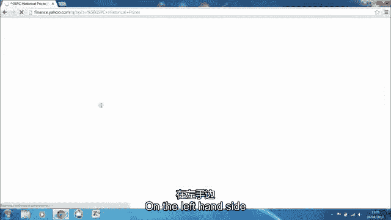
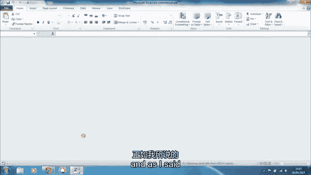

# 【高盛专业交易课】从0教你如何做交易 （中英学习全集） - P7：7-7.第7讲 波动性评估 - web3深度学习 - BV1be4y1c7ir

嗨，欢迎回来，希望你喜欢和克里斯的第六个视频，我知道这有点复杂，但是不要太在意，正如我强调的那样，呃，在第五段视频中，作为一个零售商人，你真的不知道，必须知道黑滩公式和期权的隐含波动率，作为第一步。

里面的价格，你应该做的是真正理解这对你的投资组合意味着什么，就你投资组合的风险而言，从更大的角度来看你的机会，你作为教练的机会，现在，我们将继续进行历史波动的第二个度量，我们以前称之为平均真实范围。

当我们观察回报的历史波动性时，分布与赔率计算，我们采取的价格是开盘和收盘，对于S和P 500，这可以对任何资产重复，只要能拿到数据，我们现在要看的是波动率的计算，在历史基础上，利用一天中的高潮和低谷。

实际上你可以用一个星期，一月四分之一年，任何时间范围，但我们将每天都看它，所以我们保持它与在一天的基础上寻找机会保持一致，就像我们在历史分布和赔率计算练习中看到的那样，所以我们要在这里得到什么。

现在是一个全面的升值和一套波动指标，所以我们有两个历史波动指标，历史分布和损失计算，历史平均真实范围，我们还得到了隐含波动率，哪一个是资产未来的预期波动性，一旦你有了这套波动性度量指标。

你会了解你的机会和风险，作为一个交易员要多得多，你将停止采取专业交易员的方法，这就是我们要继续的，真的在第八段视频的下一节，当我们继续如何开始构建一个过程时。

通过增加我们的时间范围来获得对我们有利的几率，看着3%的信息解释，以正确的方式很好地解释信息并将其转化为真正的硬美元，所以让我们去呃，现在我们要通过平均真实范围的阶段。

克里斯还将向你展示如何在Excel中计算，这比我们目前所做的要容易得多，在分布、赔率和隐含波动率方面，但我们现在使用的是当天的高点和低点数据，而不是开放和封闭的数据，或暗示使用期权数据，所以让我们呃。

走到舞台上，让我们来看看ATR的理论和实践，平均真实范围，然后让我们直接去找克里斯，他会在电脑屏幕上告诉你如何实际计算，以及如何使用它。

在平均真实范围之前有人听说过这个吗，在我们研究历史波动性之前，我们使用了S和P 500的开放和封闭数据，我们研究了S和P的隐含波动率，五百，我们现在回到历史波动，但我们不是在看开放和关闭的数据。

我们在看其他数据，高低，所以我们在寻找资产的平均真实范围，在一天或任何时间段内，你可以一周又一周地做，逐月，每日，每周，月平均真实幅度，你想挑什么就挑什么，什么更重要，以下是从低到高的过程真实范围。

所以在开放和关闭之间的机会，你可以用它做任何事情，库存，货币，商品，债券，那么我们实际上如何计算它，所以让我们来看看一个在五天内做一个的例子，所以才持续了五天，价格高低，在高价上减去低价。

你得到了真实的范围，得到平均真实范围，把它们加起来，除以天数，这告诉你平均，该资产在一天内的高点和低点之间的差异，很简单，我想我们这里也有一个电子表格，我怎么进去，我们开始了魔法，我们能看到上面吗。

我这里得到的是s和p的高低，500年前，与真实范围和高的百分比，低波动性，所以真实范围的百分比，在过去的五十年里，这是如何发展的，好的，那么一年有多少训练日呢，大约250，所以我们在三年里有750天。

十二块五五个，两个半，五千，五十多年来的一万二千五千个训练日，五十年以上，波动性，真实范围，一点，四，六个从高到低，它怎么了，五十多年来它发生了什么事，所以你在这里看到的是滚动平均真实范围，它沉下去了。

它下降得相当明显，在过去的二十年里，在过去的十到十年里，你可以看到一个真正的趋势，平均数，高低之差，按百分比计算的S和P，五百，下降了大约三分之二，百分之七十，是啊，是啊，所以平均来说，平均数，现在。

让我们来看看最近六十天，这是上周才做的，所以你在看，呃点，八，高低之间的百分之三，是啊，是啊，十年前，是一点四，为什么我们认为那是，我们怎么看，但是什么对不起，野兽在睡觉，是啊，是啊，它只是。

它似乎睡得更频繁了，哈哈哈，这就是为什么，这就是为什么在过去的五到十年里事情会发生这样的事情，不仅仅是在股票市场，所以用货币进行同样的计算，商品，你会得到电子表格，所以你所要做的就是去获取数据。

并将其转储到电子表格中，它会吐出所有的数字，所以你用商品来做，货币，债券，它发生的原因是这些原因，他们真的是那四个原因，首先，随着中央银行对货币市场的干预，债券和期权，它并不广为人知，有点跑题了，但是。

在过去的12个月里发生的一件事是，美联储一直在出售期权市场的波动性，以保持低波动性，所以这是市场操纵，但更广为人知的是，美联储一直在印钞，波动率下降，但在一个更大的。

结构性问题或问题是所有这些市场的市场参与者的数量，所以西方世界从拨号到宽带的转换，十五年前的地方，如果我想交易500英镑，我可能要飞去美国，开了经纪账户飞回来了，现在我可以在卧室里几秒钟内完成。

所以有一个巨大的热潮，试图在卧室里进行日间交易的市场参与者的数量，所以所有这些10-15年前可用的回报，它们会逐渐消失，他们被吃掉了，可能同样多甚至更重要，是算法交易的开始。

当我们回到投资银行的代理模式时，机构命令进入，代表对冲基金和养老基金买卖订单的市场，他们只是进入一台机器，这就是它的开始，然后发生了什么，算法开始弹出，设计来预测订单流会做什么。

如果一个订单进入市场购买，另一个算法被设计为提前购买然后再卖给它，这叫倒票，你从机器人身上剥了半便士，现在已经到了这样一个阶段，甚至有算法来预测算法，那是预测订单流，当你看到这些数字时，这告诉了你什么。

鉴于西方世界股票市场的结构性问题，它几乎说，好的，十年前你可能有机会在日间交易中赚钱，不幸的是，这些天你真的没有机会，因为你在战斗，你在和互相打架的机器人战斗，所以你必须有。

投资组合80%的时间是基于历史波动概况，以不同的方式使用历史波动率剖面ATR，首先呢，用它来计算你在长期范围内的机会，如果你在股票市场上看到。

如果你在任何市场上看到ATR在10-15-20年期间大幅下降，你知道你在与潮流作斗争，如果你要进入那个市场，试图从越来越少的机会中赚取短期资金，但是你使用它的第二种方式，那是五百美元。

你可以去做任何股票，任何商品，任何货币，只要能拿到数据，你几乎可以公开获得全球4万个资产的数据，通过谷歌搜索，你会得到的，都是免费的，但你可以把它用在股票上在不同的时间范围内锻炼。

你赚一定数量钱的机会是什么，所以我会每周做一次ATR，每月ATR，等等等等，为什么这很重要，因为这将为你的期望设定基础或参数，对于您的目标和您在该时间段内的止损，那么作为一个专业的交易者，你需要什么。

你需要这三个电子表格，你需要知道如何建造它们，如何自己动手，所以你会被发送给他们返回分布和赔率计算，市场波动率评估，即隐含波动率，如VIX，但你可以为任何事情做，那是前瞻性的，向后看信息。

玩那些电子表格，去从不同的资产获取数据，将其转储到电子表格中，把它们拉长，把它们折弯，你想怎么玩就怎么玩，如果你学会了如何使用它们，你会和专业交易员进行一些非常好的对话，嗯，知道自己做什么的专业交易员。

外面有很多人不，所以作为交易者，我们只想赚钱，去有钱的地方，如果我们被告知这些机会没有钱，我们远离它，我们用不同的方式交易它们，或者交易其他东西，我们去打猎，把盾牌里的长矛拿出来，去找那个醒着的大动物。

不在洞穴里睡觉，80%的时间会发生洞穴睡眠是80%的时间，如果你不确定机会，只要把练习跑完就行了，一旦你在头一两个月学会了怎么做，几个月后你就可以闭着眼睛做了，你就能在某一天意识到机会是什么，一周。

一个月，四分之一，一年，世界上任何资产的时间范围和任何告诉你不同的人，你只要用这三个电子表格在20分钟内计算出来，然后发邮件给他们，说你在胡说八道，或者你可能说得有道理，看看这个。

你会和男人有一些很好的对话，他们知道自己在做什么，如果你遵循所有这些东西，和，更重要的是，如果你把自己锁在房间里，关上所有的窗帘和百叶窗，我只是经历这些事情，你会有更好的机会不赔钱，实际上赚钱。

因为你不允许自己采取立场，你没有，当你不知道这些信息时，这是你做的第一件事，你得先把这些东西都检查出来，在你考虑有一个职位之前，有道理，那么下一代零售交易员是什么样子的呢？慢慢地。

但这些信息肯定会渗透到散户那里，最终他们会发现他们赚不到钱，日内交易，也许他们不会，我们正在外面谈话，我们真的想让他们发现吗，因为我们实际上需要它们来获得另一边的流动性，这样我们就可以出去了。

那么你有什么可做的，你得把你的时间范围增加一到三个月，采取以基础为主的方法，因为在一到三个月的时间里，影响资产价值的基本面因素也会影响资产，因为这是一个足够大的时间范围，所以从根本上说。

自上而下和自下而上，所以我们要从上到下，然后用自下而上的分析来覆盖它，并与技术分析和价格行动指标叠加，和一堆重要的交易者过程来定时进入你的交易，进出你的交易，一旦这些职位是真实的。

有真正的钱投入到这些职位上，这一切都是关于风险管理和控制你的心理，所以如果我们把所有这些因素结合起来，你会看到我们会给更多的机会，赚钱，不容易，从来没有人说过是，但是如果你多次经历这些过程，你会得到。

你最终会闭着眼睛做这件事，那是你想去的地方，所以你可以评估一些非常，很快就发现这不是一个机会，它被扔进垃圾箱，或者锻炼得很好，很快就有机会，做更多的工作，并计算出要花多少钱，出了问题该怎么办，好的。

克里斯现在要在电脑上给你看，你如何计算平均真实范围，ATR最初为S和P 500，但请记住，您可以将此用于任何资产，只要你能得到监控和计算你的机会的数据，稍后我们将在风险管理部分使用atr。

在计算方面如何使用它，风险管理中的止损和目标，所以让我们去找克里斯，克里斯，把它拿走。

在这个视频里，我将通过一个例子来说明你如何计算自己的平均值，给定资产的Excel中的真实范围值，所以基本上，平均，鞋的范围是一个历史波动指标，这是通过取滚动平均值来计算的，它基本上给了我们一个指标。

有什么交易机会，在股票或资产中，有哪些贸易机会，以及我们预期这些资产的波动性，他们会帮我们确定什么样的交易，或者投资组合管理风格，我们正在使用这种资产，所以在这个例子中，我们要经历，嗯，计算。

在标准普尔500的范围内滚动一天的平均值，所以如果我们从获取数据开始，所以我们会去雅虎财经，金融雅虎点，www。icj-cij。com，并在获取引号框中输入s和p，并选择S和P 500。

然后转到左手边的历史价格。

在这个例子中，我们将从使用1月3日的数据，一九六二年二月十九日。

二千零一十三，按每日频率，所以我们只需通过点击获取价格来更新这个价格数据，我们将滚动到网页的底部并单击，下载电子表格以获取此数据的电子表格，在这一点上，如果你想，您可以将电子表格保存到硬盘上。

然后从那里打开，或者就像我们要做的那样，您可以选择立即打开它，然后在文件打开后保存，所以我们只要打开这个数据，正如我所说。

我们要做的第一件事是归档，另存为另存为s，和P 500 ATR保存在桌面上，因此很容易找到它并将其保存为Excel工作簿，那很好，所以我们收到了雅虎财经给我们的价格数据，我们要做的第一件事是调整日期列。

这样我们就可以看到所有的日期，所以我们把柱子加宽，接下来我们要做的是删除所有不必要的列，在计算我们的ATR值，所以我们只需要打开，高潮和低谷，所以我们只是关闭，um列e f和g。

所以我们删除列e f和g，这是关闭音量和调整关闭，所以要快速选择那些，我只选择E列，按住Ctrl并单击f和g，选择正确的列，在选定内容中单击并转到删除，好的，所以在我的专栏中。

我们要做的是计算我们的真实范围，所以这将是一段时间交易中一天的高点，也就是一天一天的频率，我们有负号，低所以在科林细胞E一，如果我们只键入真范围，也就是高减去低，我们想把这个公式复制到洞柱式经济中。

所以如果我们点击左手边的数据，就可以快速地做到这一点，和任何列A到D按控制和向下，然后穿过E牢房，一万二千八百七十一和按下控制移位和向上，它将选择E列中的所有单元格，到二号牢房，然后按Ctrl d。

将公式复制到我们选择的所有单元格中，所以接下来我们要做的是计算一天滚动平均真实范围，所以在F列中，将用一个D在列的前面，这将告诉我们这将是我们一天滚动平均真实范围的列，所以要计算在单元格F中。

两个类型等于两个开括号，和，然后E二到E三，关闭括号，除以2，基本上是这样的，公式的这一部分只是计算了过去两天的平均值，然后除以前一天的开盘价，那就是B三，这将以百分比的形式显示平均值。

与前一天开盘价相比，做同样的事情把这个公式复制下来，所以我们将导航到电子表格的底部，f列中的单元格到f 2，然后按Ctrl d将该公式向下复制，这个选择仍然突出显示，如果我们对了。

单击选定内容并转到单元格格式，然后将数字更改为百分比，所以我们现在可以用百分比来显示所有这些，正如您在F列的最后一个单元格中所看到的，我们有一个错误，这是因为我们用来计算平均真实范围的公式。

需要前一天的价格数据，我们在最后一个牢房里显然没有，所以我们将继续通过选择它来删除该单元格，在键盘上按下删除，有趣的是，平均，这些一天的平均鞋子范围是如何随着时间的推移而变化的。

所以我们将这些一天滚动平均鞋范围的平均值，嗯在不同的时期，所以我们会做，我们现在就把这个设置好，其实，所以在，或者在H三个将键入天，两年后，我们将在五天内完成这项工作，二十天，六十天，二百五十个交易日。

相当于一年，嗯，七百五十个交易日，相当于三年，一万二千，呃，一千，二百五十个交易日，相当于五年，两千，五百交易就是十年，五千个交易日，也就是二十年，最后是一万二千五百个交易日，相当于五十年。

所以我们从这里开始计算一天的平均值，在这些时间里八十个小时，所以在单元格I中这样做，因为如果我们从五天开始，我们打字，我们选择，我们可以选择或者只键入F2到F6，那将是前五天，呃。

2007年12月31日前5天平均数，我们将继续这种方法，这里到61度是有用的，因为我们在看上次抱歉的平均值，F21，因为我们看的是最后一个的平均值，我要做的是让它更快，如果你这样复制。

如果我们进入J 4号牢房，双击它，然后我们就可以编辑公式了，如果我们只是复制，选择此文本并复制，按Ctrl c按Enter，转到下一个单元格K并按Ctrl v，然后我们就把公式编辑一下。

这比每次输入都快，所以我们只是复制了4号细胞的公式，我们要把它复制到所有这些细胞中，直到Q 4，而不是把它打出来，每次，我们就进入公式，并编辑我们将要使用的最后一个F单元格，所以六十天就六十天了。

二百五十天，就会这样，二百五十，一个，七五十天，七五一，等等，所以我想，就在我们总结和谈论这些数据之前，如果我们把这个整理一下，我们会突出这些细胞，将从H 2单元格突出到Q 2。

如果我们把它换成不同的颜色，把它放在绿色的地方，然后几天，你知道灰色，也许，这只是整理电子表格，如果我们选择从H2到Q4的所有单元格，给它们一个边框，通过转到开始选项卡中的边框选项并选择所有边框，好的。

把它整理了一下，好的，所以对此的解释很简单，基本上我们可以看到的是一天的滚动平均值，真实区间一直呈下降趋势，因此这些值，所以一天滚动ATR的五天平均值低于二十天，它比60度慢，低于250。

所以这基本上告诉我们，我们的波动性一直在下降，当我们回到五年，我们可以看到五到十个，我们可以看到波动性实际上在，从十年前到五年前，现在，这显然大大增加了波动性水平，所以这就是为什么这个特别高。

这就是为什么我们重置了波动性，慢慢地越来越低越来越低，作为过去五十年的总主题，我们可以看到波动性通过我们计算的真实范围值下降，有一天在，这只是由于短期内交易机会减少，在一天的时间框架内。

因为市场变得更有效率了，电子交易系统加快了，消除套利机会的过程，它只是降低了整体波动性，所以这基本上告诉我们我们需要扩大我们的时间框架，如果我们的八小时很短，这是一种看待波动性的方法。

我们必须扩大我们的时间框架，以便能够进入盈利机会，所以我现在就回到安东身边，他将为您提供到目前为止我们在这里讨论的内容的快速总结，你好啊，欢迎回来，现在，你只是看着，呃，克里斯。

向您展示如何以滚动百分比为基础计算ATR，对于S和P 500，现在这可以重复这个练习对世界上任何资产，只要能拿到数据，所以现在我们有一套波动性指标，我们有两个历史指标，历史分布计算和平均真实范围。

滚动ATR，我们还有更复杂的，隐含波动率指标，当你把所有这些东西放在一起，这给了你一个非常专业的方法来管理你的期望，在机会和管理风险方面，因为它给了你一个很好的指标，你在市场上的风险是什么。

以及你投资组合中的风险，现在ATR显然略有不同，因为在另一个历史上，看着把数据从开放到关闭，现在我们从高到低，所以我们不是在一天内寻找机会，我们在寻找那天的机会，很明显，高点和低点的波动性会更大。

但是当你看着滚动的ATR，在我们看到的例子中，你应该从中得到一条消息，和信息真的与滚筒ATR在S和P 500，波动性一直在下降，在过去的十年里非常积极，这种情况的发生有很多原因。

但你真正应该明白的主要信息是ATR在滚动的基础上，这对短期教练意味着什么，它只是简单地意味着短期交易机会在持续的基础上，在过去的十年里，已经退出了市场，在过去的三年里，我们看到的是短期专业交易员。

日间拖车，实际上只是失去了所有的工作，所以日内交易，日间交易商店，在西方世界，日间交易公司实际上已经关闭了，这是因为这又是有很多原因的，但其中一个主要原因是算法交易，算法交易本质上是基于计算机的训练。

定量训练，去市场剥头皮，我们所说的剥头皮是指，进入市场，抢在市场订单之前买卖，那是什么最终在市场上创造了什么，嗯，它最终创造了一个自我实现的预言，因为现在算法被用来预测其他算法会做什么。

所有的短期机会都不断出现在市场上，当你看到S和P的滚动ATR时，那里有五百，这就是你真正看到的，你会看到短期的机会现在被计算机夺走了，当你成为一个更专业的交易者，你采取一到三个月的方法，电脑不重要。

日内交易并不重要，因为在一到三个月的时间范围内，机会是存在的，他们仍然存在，他们仍然像过去一样存在，所有专业交易员都知道这一点，他们不会费心与机器或日间交易作斗争，所以回到S和P中的这些数字。

500种主要货币对，百分之八十的时间，所以百分之七十八的时间在S和P，500和世界其他主要指数，数字非常相似，和主要货币对，七十，百分之五的时间，没有短期的机会，在过去的十年里，没有短期的机会越来越少。

所以有了ATR，ATR确实证明了这一点，它展示了过去十年来市场一直在发生的事情，与几十年前相比，所以你真的应该把这当成一个信息，和总结，关于所有这些波动性指标，我们能真正说什么，我们真的用它们做两件事。

一个，它在识别市场上的机会，我们将在任何给定的时间范围内进行交易，以及这些市场的风险，因此，我们潜在投资组合或当前投资组合的风险，现在，一旦你知道这些数字，你知道如何通过这些过程。

记住作为一名零售培训师，你可能应该使用更多的历史波动性指标，比更复杂的隐含波动率指标，当你明白这些数字，你可以在肌肉记忆中经历这些过程，所以你可以很快地做，你所做的实际上是你很快意识到。

在某些资产上加仓的风险有哪些机会，和资产类别，你现在开始采取更专业的交易者方法，从我们所学到的很清楚，我们要明白，散户长期持续亏损的原因，是因为他们试图向市场发号施令，当市场应该做什么时，事实上。

市场只是做它想做的事情，散户有一种交易方式，他们从不适应自己的风格，他们从不适应市场告诉他们要适应的东西，而专业交易员则反其道而行之，所以这就是你要做的，这是未来的零售商必须尝试和效仿的。

成功的培训师和对冲基金经理实际上使用，他们用自己的钱用这个，他们用它来交易，别人的钱，投资者的钱，现在这是一个相当漫长的过程，但其实很简单，我们现在就从这个开始，在视频八，在视频八。

我们将开始从这个过程中建立，我们正在做的事情，与零售拖车相反，就像在建筑中作为一个长期管理的过程，所有资产类别的空头投资组合，股票，商品，汇率，在我们所有的职位上都有一到三个月的时间范围。

通过尽职调查和风险管理正确管理投资组合，成为持续盈利的培训师，作为一个交易者，你的工作实际上是赚钱，从现在到你退休的那一天，让我们转到第八个视频，我们在另一边见。

