# 20小时跟着大佬搞定【机器学习与量化交易项目实战】保姆级教学，建议收藏！Python机器学习／人工智能AI - P8：第08课_机器学习与量化交易项目班 - 大数据狂人 - BV1V24y1Y7eY

好。

那我们今天开始上车，关于昨天的那个作业，大家有问题没有，就是有没有做尝试，或者说大家在做的过程中，有没有关于建模方面的问题，或者说怎么发现，怎么自己所有的模型R方都是负的，这种情况，我希望是不要发生。

解压就行了，你你解压用7-ZIP解压之类的，有一个如果你是windows系统的话，有有一个叫7-ZIP，这个我感觉比WinRAR要好用一点，这个东西，嗯，看来这个小伙伴还没有在做这个数据。

那个数据质量很好啊，那个数据质量，那个数据质量我只能告诉你很好，然后大家一定要尝试着做一下，然后另外是这样，如果你是比如说是大概2000棵树左右的这个随机森林，对再说一下，随机森林。

这个这一这一类的模型有一个在SKLIN里头，有一个是叫随机森林，Random Forest，这个regressor，另外一个叫做，Extra，ExtraTrees，regressor。

这两个就这个是叫做，这就叫做完全随机树啊，就他其实是比随机森林要要出现的晚一点，随机森林大概是2001年，这个是差不多是04年还是06年，然后他他的这个随机因素呢，比随机森林还要更随机。

就是他的这个随随机森林好歹是我每次选出来了根号N个这个维度，在这根号N个维度中，我进行了一个探际算法，选择出来最优的这么一个分界面，而这个完全随机树这个叫做extremely random trees。

叫做Extra，他的这个论文引自Extremely，就是极度的，极度的这个random，Trees，那么这种极度的随机树呢，他更能够他对过拟核的这个抗击过拟核的这个能力，他会更好。

为什么他是每一次随机的选择一个维度之后，随机的选择一个点进行分，进行这个确定这个分界面，也就是说这样的话，让会他的这个树木就是长的就会特别的不一样，当你每一个树长得特别不一样的时候，你做一个集成。

你就肯定会非常的会非常的不一样了，所以说，当你的树要要干的很大的时候，我建议大家用这个SKlearn里头的这个这个extra trees regressor，他的性能，对不起。

他性能一般来说会比随机森林要稍微好那么一点点，但是也是取决于不同的任务，所以说，你没有任何理由只试验一个随机森林，而不试验这个extra trees regressor或者classifier。

具体的情况还是需要通过具体的实验来做，SKlearn都是non-PAN，我建议你用pandas进行IO，然后你在做这个在做在做机器学习的时候，再把它再从pandas的那个data frame。

data frame中选择出来，你所感兴趣的子列，他他本身也就是non-PAN，ok，random forest regressor，ok，他没有什么区别，他就是一个就就是说，根据你的这个任务来看。

你的任务是想回归一个时数，就当你的y是一个连续的一个数的时候，比如说你要连续的一个时数的时候，那么你就用这个regressor，如果你要分类01分类的话，你就要用这个classifier，就说他的这个。

对，还有什么问题吗，就是SKlearn你要是读他这个源码的话，他就要求大概每一个监督学习分类器，他要么是一个做regression的，要么做一个，做分类的，他一般名字后面都是什么regressor。

或者这个classifier，对对他做regression的时候，他就是将我这个子空间中的所有点求一个平均值，就就是他的这个做的这个regression，然后他这个分类就是说，我这个子区域中每一个点啊。

各种类别的，他他会返回一个distribution，就说我在这个子空间中啊，一类占99%，所以我就预测为一类，然后二类占1%，但是你也可以你也可以把这个叫做就是SKlearn里头每一个函数啊。

大部分的函数都会有个predict，这个predict就是你真实的，你想要的那个y的那个值，你还应该还可以干一件事，叫做predict，proba，predict probability。

就是说predict probability，就是你给我一个x，我给你一个，给你一个分布，这个分布呢，就是说零类的可能性是多少，一类的可能性多了，二类可能性多少，他是会给你这么一个类的这个分布。

你在有些问题中，其实你更需要得到一个分布啊，什么问号是什么意思，在数据上会不会加了很多feature之后，模型预测性能达到一个瓶颈上不去了，是这样，模型的预测瓶颈，模型肯定会达到一个瓶颈上不去了。

不可能他永远的能够到百分之百，但是模型到瓶颈的原因，有的时候并不是一般来说，不会是你加feature造成的加feature，一般来说是好事，不是坏事，如果你想问的是，我目前模型上不去了，怎么办。

当你非常很，什么都往里加的时候，你最好再做一种这个特征选择的这个过程，有可能会让你的模型再往上走一点，就是说不管怎么样，你不管加不加feature，你的特征选择这一步啊，最好是要做的。

但是当你选好了之后呢，你就有理由相信啊，我的这种feature再减的话，肯定是不合理的，对，而方针的复制的差不多有这么几个原因，一个原因是你忘加这个，这个常数项了这个节句项了。

另外一个是你的模型underfit，它不是特征选择的问题，也有可能你的当你的特征是一个极度随机的这么一个就是完全跟Y无关的一些数的时候，它是有可能的，还有一个可能性是你可以尝试比较一下MSE啊。

就是当你实在是不知道该怎么办的时候，你想算了啊，因为有可能你数据集中大部分就是你，你所要回归的问题，你的这些Y值它是极度不平衡的，大部分都是零，那么这样的话，你就很可能预测的不是很好。

那么在这种情况下呢，你来汇报一下这个MSE也可以，然后这个，这个SKlearn里头有一个有一个子的这个module叫做metrics，metrics，今天好像我在群里说了啊，这个SKlearn。

这个metrics里头，它给你实现了各种各样你能想到的基本上常用的所有的这个函数，包括了这个MSE这个R方值啊，这个accuracy对于分类来说的accuracy啊，等等的东西啊，他都帮你啊。

在这个里头写好，所以有的时候你不一定非要用R方值，用其他的也可以，还有问题吗，关于作业关于关于作业，我我是非常希望大家一定要做一下，因为啊，其实你，尤其是在这个，集体学习建模这件事上，你做的越多。

你这个是你能够真正掌握或者说真正进步的，我认为的唯一的途径，就是当你做过几遍之后，你再回过头来，再看啊，一些集体学习的东西的时候，或者说再回过头来，再听我讲就是之前的第二讲或者第三讲的时候。

你的感受就会非常深，而你没有做这件事的时候，我无论怎么生死历劫的强调一些事情，你也很难获得共鸣，所以说我非常希望大家一定要上手做一下，这个是应该是唯一的一个途径啊，那么最开始对于初学者。

比如说你是从金融这边，或者说是从成全这边转过来，你对于初学者来说，你把这个Pipeline走通，这个其实就是你的第一境界，然后第一境界之后呢，你就可以不断的逐渐的让你的这个模型变得复杂一些。

然后再加一些你自己的理解，然后在方方面面进行一些改进，同时当你有了比较熟练的这种建模的经验之后，就是把这条路踏踏实实的多走过几遍之后，你就会有意识的去选择一些基础学习的材料进行钻研。

否则一时看的话心里会很虚，会不知道啊，这个东西到底能在我的这个经验中，它是地位在哪，所以说大家一定要做一下深度学习，深度学习的样本是这样，取决于你的这个神经网络的结构，比如说你的结案。

你神经网络层数比较深的时候，数据肯定会多，当你只有一层浅层单一层的时候，上千个就能做，一般来说，当然我这么这样回答你大概不是很满意，我个人建议来说，在三万个点以上可以考虑深度学习。

但是比如说你只有三两两三千个数据点，然后每个点大概是一两百位的，你作为一个三层左右的神经网络也完全没有问题，百万数据是可以做的，百万数据你这样，百万数据你最好用的大概四块左右的GPU显卡。

训练时间大概会在，一周左右，差不多是，二十轮左右的迭代，Batch Size在128左右的话，每一轮迭代会耗几个小时，这样，OK在使用boost效果不好的时候，分析提升效果流程大概是什么样的，在使用。

这个问题还是比较比较宽泛的，因为就是当你一个模型出了问题之后，该怎么办，那么就是说，首先要就是说你要画出这个所谓的就是你的这个模型性能的这个就是说你的模型性能的这些相关的图表，因为性能不好。

就是幸福的幸福的模型，性能好的模型总是一样的，性能不好的模型是千奇百怪的不一样，你要你要你要学会分析这些模型的各种的分析的这些性能指标的这些图表，比如说所谓的ROC AOC什么的。

Around the curve，还有这个ROC，这个大家回去查一下就行，这个很简单，那些指标的图表怎么看，以及要分析一下你的积分类器到底是否合适，你是你积分类器，的问题还是你的boost的问题。

还是你本身的数据类别不平衡，而你的boost算法并没有考虑到，这些因素等等这些问题来来进行分析，4SV数据可以问，我也挺鼓励大家用AON的，你们就用这个RELU，这个激活单元就行，不要用SIGMOID。

SIGMOID不是很好使，就用我给你那个CURS也行，或者你实在你说老师不行，就是不就是不想用，那你就用你你就用这个MATLAB，他有一个图形界面的这么一个神经网络的一个小工具。

但是问题是MATLAB他只有单隐藏，这是第一啊，第二MATLAB他不仅只有单隐藏，同时呢，他的所有激活单元都是SIGMOID，就是已经是就是MATLAB的神经网络的这个工具箱还处在八十年代。

当然有一个这个MATCONFNET的这个这个第三方的一个库，这个库呢是别人写了一些MATLAB的一些函数啊，而这些函数呢是支持目前主流的各种深度学习的函数的实现的，但是我愿意你要费那个劲。

你还是用Python的CURS就行了，大家都走到这一步了，SKLEAR都会用的话，CURS应该问题不是很大，OK，最后一个问题，如果有的话，大家一定要做这个建模的这个作业，我才好让你给你更多的建议。

让你获得比较更进一步的这个进步，对，OK，那我们看今天的这个事情，OK，今天讲这么几件事情，第一啊，讲一个极简主义的NLP链划建模的这个课程。

我用我能花费的我时间允许的最小的时间告诉大家怎么样用这个新闻数据，跟这个矿头，把他的本质交给大家，因为毕竟在目前这个时代，你参加一些面试啊，或者你要做的一些事情，你跟别人聊的时候。

你要是不会做这个实在说不过去，毕竟大家这个来都来了，那么我这一块作为教学大纲的话，再加上很多同学给我写信的这个呼声，我觉得还是加进去吧，这第一啊，第二的话，给他会这个风控，我会分分两次课来讲，风控。

我会分两次课来讲，为什么呢，是因为这个这个代码，我课后就会给大家基于事件驱动的这么一个量化教育系统，今天我就会给大家，因为咱们今天是第八次课了，下周是第九次跟第十次，就完了，然后呢，这里头的这个代码呢。

它是最多的，是整个一个小系统，那么如果我下次课再讲这个的话，你没有时间来看了，所以我希望大家从今天我给你这，这些玩意儿之后，你把你用一周的时间把我讲这个系统，你彻底消化了，然后呢，风控的第二部分呢。

我会在第九次课，基于这个系统大家往上加这样的话呢，我认为大家的这个吸收会会好一点，所以说今天我就是决定啊，把风控拆开，然后把风控拆开之后，挤出点时间来教大家一点NLP和怎么处理NLP的各种问题。

然后最后呢，把这个量化教育系统这个设计的主要思路，因为大家在没有花一两天时间认真读代码之前，我说什么你也听不进去，我把主要思路先说一遍啊，然后你们用一周的时间看一看，然后回过头来再听我讲一讲。

就是再回过头来看一看录像，然后我们下周啊，周六周天咱们再把基于这个系统，我再多讲点深的，最后呢，再给大家我有多少时间，我就讲多少这个案例分析，差不多接下来的咱们共同度过的时光就是这么定义的，OK。

然后这个CNN，这个同学说的并不是很对，现在CNN在NLP中用处是很大的，就是说，CNN跟LSTM，LSTM，CNN跟LN的话，他如果你都在都是做这个磁线路的方法，你做分类任务的话。

这两个目前在这个ACL，ACL就是说这个自然源处理的国际顶级会议中，这两个现在基本上做的都有，然后在很多的在这个文本的分类任务上，CNN做的不比LSTM差多少，好，那么关于我今天要说的事情。

大家还有疑问吗，实在抱歉啊，这个事情我给大家加进去了，但是呢，这个这个强化学习，我实在废他不进去了，强化学习一讲开了，两个小时就没了，那么讲不了其他的了，那么这个风控的跟这个交易系统代码的本质呢。

只有不讲不行，所以说强化学习啊，对不起各位，但是NLP呢，我尽我的最大的能量跟大家说一下，这个终极版就不知道了，这个看我时间安排吧，我实在是太忙了，今天今天早上这个有一个。

AAA会议他一个rebuttal，然后再做，然后中午帮一个公司擦了个屁股，然后下午跟大家做这个事情，这个不能保证，OK，没有任务的话，咱们就就开始上车啊，好好，那么今天的话啊，对再给大家剧透一下。

今天的话，你们就能写出来一个回色系统啊，能够画出来这玩意儿啊，然后能够做各种的回色，就相当于今天你们就有自己的一个U框了啊，好好，那么现在开始先先说一下这个NLP哈，NLP是自然语言处理啊。

而自然语言处理呢，他在宣众学习之前的一个时代，他主要是什么语法术啊，什么就是分析就是比较的注重于这个领域知识，就是跟这个计算机视觉一样，他跟计算机视觉发展的速度都蛮像。

比如说计算机视觉在深度学习这个领域之前，他主要的是非常领域就是很领域专家的人，他们怎么样来提取一些什么hug，还有什么sift。

就是说他们用了各种各样的起因技巧来对一个图像进行一个feature的一种重表达，比如说你搞出一个hug特征来啊，你就牛的不得了了啊，搞一个sift啊，就更更牛啊，你基于hug你做个SVM等等一些事情。

就是说就是之前的这个计算机视觉跟之前的这个自然语言处理，他们的这些领域知识，比如说他要建立一些语法术啊，还要要运用一些，比如说这个这个这个，就是说他有很多，就是就是只有自然语言处理这个这个。

这个社区的人，他们很感兴趣的一些问题，而现在呢，由于表示的问题，就是一个文本的一个表示的问题已经不是很大的问题了，所以大家都在就直接的拿来，就是因为这些你想提取特征，这些这是只是中间步骤。

我们最后的问题归根结底还是什么啊，归根结底还是分类，或者回归什么意思呢，给你一张图片，请你告诉我他是哪一类啊，如果是车是什么车分类问题啊，对于文本来说，我给你一段话，请你告诉我，他的他应该处于什么。

他的标签应该是什么，就给你这段话，他这应该是新闻类的还是娱乐类的，或者说给你这段话，请你告诉我他是这个积极的还是消极的，或者说给你一段话，请你告诉我，他是看长的还是看跌的啊，等等。

当然自然源处理还有一个自己的一个独特的任务，就叫做所谓的sequence to sequence learning，就是说我给你段中文，你给我说一句，对应的英文啊，等等一些事情啊，那么但是呢。

就是说其实自然源处理在量化交易中，他其实归根结底是一个分类或者一个回归任务，因为我们其实只作为积极学习这个角度来讲，我们只会分类和回归啊，就是我们会的，我们会的和我们想做的啊。

中间就是一个所谓的搞积极学习应用算法的人，就是说我们把我们会什么跟我们想想做什么，设计一个情境出来啊，把它中间连起来，比如说我们会会这个SVM啊，这是纯积极学习的人发明出来的，我们想干什么事呢。

我们想对这个金融金融数据进行分类，那么专门搞量化的人呢，就从SVM中把这个模型拿来，把我们想做的事情应用上有一个比较不错的一个性能体现，这个就叫做搞应用的搞理论的是什么人呢，搞理论的是啊。

我管你应用是什么，我我来搞一个天下第一的这个模型出来，你爱爱怎么用怎么用啊，所以说啊，这个积极学习啊，积极学习是这个计算机视觉跟自然源处理的所谓的上游学科，就是说就是说上游就是说啊。

对对就是就是上游的意思，然后啊，积极学习的上游学科是什么呢，积极学习的上游学科啊，是啊，统计学，所以说，积极学习所用到的数学知识是跳不出统计学的魔掌，所以你要是真正的想做，想做积极学习的话呢，啊。

所以说所谓的统计学习啊，就是，就打招来的，就是因为我们在理论分析中用到的数学工具啊，不会在统计学之外啊，嗯，嗯，有问题没有，OK，那我们现在就讲怎么样的对一个文本进行分类。

那么我们现在的归根结底的问题就是什么呢，我们归根结底的问题是，首先啊，给你一段新闻，这个新闻你可以，一条新闻你可以给他变成一个stream，对不对，今天早上，等等，给你段新闻，我想知道这个新闻。

他对股票是看涨的还是看跌的，就这么简单的一个问题，嗯，那么大家想想这是一个什么样的一个问题啊，那么这是一个分类的问题，那么如果作为极体学习中的一个监督学习的问题的话，我们第一件事干嘛。

第一件事是要有一个好的一个表示，就是我们怎么重新表示这段新闻，这个是一个蛮关键的一个问题，对不对，那么今天先给大家先介绍一个叫做所谓的啊，普苏贝叶斯，Naive，Naive Bayes。

普苏贝叶斯的方法怎么样的对一段新闻做这个，做这个看涨还是看跌的这个这个分类问题，表示什么意思呢，就是说我怎么样呢，因为因为我你所学到的一个SVM或者你所学到的一个线性分类器，他看到的X必须得是一些数值。

必须得是numeric对不对，而我现在看到的是一个String，就String你说我把这个Unicode给他让他学，那肯定学不出来什么明白玩意儿啊，那么怎么表示这个玩意儿呢，这是第一步啊。

第二步假如说我们会一些表示第二步，我如何如何建立训练机啊，(训练机的训练时间)，而且我现在给大家提一个要求，我不想人工标注了，我你能不能自动化的建立一些啊，你想要多少就有多少的一个训练机。

我考考大家给大家一分钟的时间思考，如果你现在要干这件事情，你老板跟你说就是我现在再把任务强调一遍啊，请建立这么一个一个对啊，X是一段一个String啊，你先不管他是怎么被encoding的。

你先不管他是怎么被表示了，Y是什么呢，Y是0或者1，你怎么自己自动化的来建立这个东西，一分钟时间大家想一想，剧类是一个非监督的方法，但是你剧完类之后，你是不是还要人工干预一下，就说你还得发现。

这个剧类中心都是看涨的，这个剧类中心都是看跌的，你能不能完全的自动化，给些涨跌的workback是可以，但是我现在就假如说啊，你我现在要求你去开拓这个泰国的金融市场，你泰文不认识，找鱼库啊。

咱们先来一个全自动化的就是你，比如说你说OK，我这辈子没炒过股，我只会机器学习怎么办，不是我现在的意思是你怎么样的找出这个Y来，怎么样确定一个训练，你就是说已经标注好的这么一个结果，词品分析也不好使。

是因为你没法知道这个词品它对应的是涨还是对应的是跌，鱼库也没有，你现在只有一个to share，没有没有，仔细想啊，你们想想当时你你们的进你们的时序数据是怎么建立的训练，哎，对，这个同学说的是。

其实如果比如说你没有任何就是你就是小米加步枪的情况下，你每一个新闻，你每一个新闻这个S，他是不是对应一个时间戳了，你每一个新闻对应一个时间戳，这个时间戳，比如说是二零一一六年十月三十日。

我有这么一个关于美的公司的这么一个新闻，不要二零一六年的，比如说是二零一一五年十月三十号，我有一个美的公司的一个新闻，然后我们再看他，二零一五年，二零一五年十月，比如说啊，这个啊，今天是十月最后一天了。

那就十一月一号到十月五号，他的这个，他的这个美的新闻的美的集团的这个股票，他究竟是涨了还是跌了，那么你就能自己就能建立这么一个非常粗糙的，但是全自动化的一个训练机了，听明白了吗。

当你这个数量特别大的时候啊，这种方式就管用了，就是说，他的本质其实是什么的，本质是每一段新闻，其实他是有一个时间的，每一个时间点，我们能获得很多这个新闻，对不对，每一个时间点是有一个新闻的。

而这个时间点他对未来的一个影响啊，你如果看历史数据的话，你是能把这两方面的数据进行一个融合的，然后你就能建立这么一个新闻到股价的一个对应的关系对了，那么他的噪声肯定是有的，很有可能这个新闻他什么都。

一天正负面的新闻有多少条，有多少条是多少条啊，越多越好，因为你还没建立学习算法，因为你真正要干的事情是你今天来了，一坨新闻啊，你想知道这坨新闻中每一个新闻对。

你想计算一个指标出来放到你的这个feature中，或者建立一个纯粹基于，新闻或者公告的这么一个分类器，新闻都是孤立样本没有没有关系啊，嗯，你的标签就是你的这个tag，就是你这个他对未来股价的一个影响。

对，就是说你凡事只要是你有了这么一个对应关系，你积极学习的你你你会干的这些事跟你想干的这些事，就你会干的积极学习中的所有东西，你就都能加进去了，包括权重啊，包括各种各样的一些事情都可以都可以做进去了。

这是一大类的一个方法，是这样，这个是一般来说是关于个股的，你这样做是可以的，比如说关于，就当你的这个数据量足够大的时候，有的时候，比如说今天的这个个股，他的负面消息会很多，他负面消息会很多。

会让他的这个股价一下下去了，很可能他今天会有一个比较比较正面的一个东西，但是他并不能影响并不能影响这个，这个下行的这个这个趋势，当你这个数量足够大的时候，你今天来力拖，你就能预测出来他是好是坏了。

这是最懒的一个方法，当然，如果你，有人力物力能够进行一定量的人工标记，会大幅的提高你的这个，分类器的性能，关于这个setup大家还有问题没有，好，那么我们现在就看看一个最简单的一个最简单的一个分类器。

他是怎么玩的，而且非常有效，非常有效，等一下我看看，就是说他是这样，我把这个你们稍等一下，让他永远处于，因为我现在搞了一个这个双屏的，我让他一直在前面，这样的话，我能看到你们的这个留言会比较好，好。

那么哪一个base他是什么呢，大家有没有接触过图模型啊，如果没有的话，如果从图模型的角度来说，他是最简单的一类图模型啊，就是说他的这些每一个X，从图模型的角度来看，他就是这个玩意儿。

如果你没听说过图模型的话就没关系，你就当我什么也没说，那么他是这样，他是这样，很简单，很有效啊，很简单，很有效，OK，首先我们需要建立一个字典，就是说，比如说我们的这个，一个新闻库吧，比如说你有S1。

这是一个新闻，有个S2，这是一个新闻，他里头有什么叫我们啊，什么等等等等的一些一些词，然后一直到SN，他这是一个新闻，图示在里头已经有对不对，那么你有这个新闻之后呢，你要干的第一件事情，你要先分词。

因为尤其是中文中文的分词很麻烦，就是说你先要把这些玩意儿得得把这词得分开成一个词一个词的，那么那么这个中文的分词本身就是一个，字元元处理的一个蛮难的一个问题，但是呢，有一个，有一个这个包叫接吧。

你们就你们就你们就pipe，install，接吧就行，是一个接吧分词的一个东西，什么意思呢，就是说，这个接这个接吧，这个玩意儿他能干什么呢，你给我一个字符创啊。

我给你返回这个字符创分好词之后的一个list，看来有同学是专门吃NLP这碗饭的啊，很好，咱们组的这个背景都非常的，都非常的广泛，那么就是说我们给他分词之后，我们就会建立一个。

然后我们对对这个语聊库中所有出现的可能的词，我们是不是就会有一个字典，这个字典比比如说比如说这个字典啊，比如说就是说我们对这个语聊库中，我们发现啊，这些词大概一共有八千个啊，八千个词啊。

包括了我们包括了这个今天啊，包括了这个他们啊，当等等啊，大概有八千个词，那么我们我们怎么表示啊，怎么表示这么一个啊，表示一个新闻呢，很简单，比如说是一个啊，这个啊，八千围的一个词哈，如果是一个八千围的。

如果是八千围的一个词，那么我们就用一个one hot encoder的一个方式，那么就是他是一个八千乘以一的一个向量，如果这个今天这个词出现在这个新闻里头，那么他他对应的。

比如说今天是我们这个字典中的第啊，第两千个这个今天的ID就是今天的ID，如果是这两天，那么他第两千个元素X2000啊，就等于一啊，如果这个第1999个词在这八千个词库里头。

就是八千个词库里头的1999个没有出现，那么X1999就等于零，那么我们就会以一个非常稀疏的一个啊，一个不是dick了，一个非常稀疏的一个document来就这个document，就这个news啊。

你叫news吧，这个news，你就能给他表现成为一个八千乘以一的一个向量啊，有问题没有啊，对吧，那么但是我们要干的啊，当然你这个事情还有一个事情是什么呢，是这八千个词，你要先买一个叫所谓的停止词先去掉。

什么意思呢，就是在各种语言中什么哆哩哆呀，什么，就是是啊，就是各种的非常常见的没有任何意义的这个停止词，你就不要放到这个这个这个特征表达的这个向量里了，因为，每一个文档都会或多或少的出现这些词。

而这些词呢，对一个对你这个是否会影响股价这件事情，他是没有任何积极或者消极的作用的，所以说我们要建立一个这个这个这个文本的特征表示之前呢，我们要先把这个停停止词给他去掉，就是说把这些常用的一些词去掉。

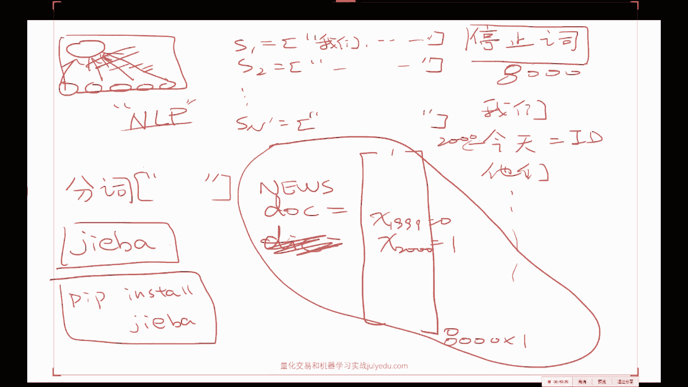

因为有一个叫做所谓的。

抱歉，因为有一个所谓的叫做这个密律定律，就是这个密律定律，他说的是什么呢，这个密律定律他说的是真正啊，你你你你一个文档真正值钱的这些词的词评是非常低的，他大致说的是这么一个事。

就说如果我们要统计统计我们的词评的话，如果我们要统计，统计一个语料库的这个词评的话，常常见的这些词基本上都是无意义的，而他出现的这个频率极高，然后一个文档就一个文档。

真正的这个新闻跟那个新闻不一样的地方都是在尾巴上的这些词评，他不一样的，而前面这些，非常高品的这些东西呢，你把它全砍了都没关系，而真正的有价值的这些东西呢，往往的就在那几句话和几个词。

而每个文档的就是在这几个词上，不一样了，造成了整个文档的意义上的不一样，OK，OK，OK，那么我们现在就会，首先我们现在会表示一个X了，对吧，这个X就是一个，的这么一个向量。

而每一个向量的这个E代表的是是否这个词是否这个word，是否这个word出现了，那么我们有了X之后呢，我们就能建立一个叫做普苏贝叶丝的一个模型了，嗯，好，那么我们现在看看这个普苏贝叶丝模型。

他说的是什么，有问题没有，嗯嗯，好好，那么比如说假如说我们的这个X是一个，那么比如说假如说我们的这个X是八千维的，没有问题吧，比如说就是就是说我们一共有八千个词，假如说我们是X是八千维的。

其实那么就是我们这个X就能表现成X1，X2，一直到X8000，每一个XI呢，他是零或者一的，对吧，这是我们刚才你就简单的做一个文本的一处理，我们就会得到这么一个八千维的这么一个项量。

而这个我们要干的事情是我们要计算一个概率，这个概率是什么呢，这个概率是，就是说我们的模型假设啊，这个叫做模型假设，刚开始学这个概率图的时候，很多人就会忘了什么是什么是什么是假设和什么是，假假怎么写，假。

模型假设是这样，我们的模型要假设这个如果给问一个Y啊，就说当我们知道了这个Y应该是看涨的啊，就说Y是我们的这个类别啊，Y是我们的类别，给问我们的Y我们的这个X的概率是是多少。

就是说如果就这个叫做所谓的生成式模型啊，就是给问一个Y就是咱们先想他的这个问题的反面的这个问题，就说给问一个Y给问一个看涨的一个文档，那么一个看涨的一个新闻啊，他这个X出现这些。

就是出现这个X1到X5千，八千啊，这些的概率他应该是多应该是多少，那么这个是我们的想求那个数，而这个模型假设他假设的是什么呢，他假设的是这这八千个变量的这个联合分布的一个联合。

一个条件基于应该叫做conditional joint probability，就是说条件的联合分布模型假设成为他们简单的这些基。

就是说X1givenY乘以probability of X2givenY，点点点就是就把这个联合分布拆开成为了成为了八千个独立分布，given Y什么意思呢，就是说嗯嗯嗯，就这个公式的意思。

也不能也不能再简单了啊，他们假设的是什么呢，假设的是X每一个XI跟这个probability of X，就是每一个probability。

XI given Y跟given Xj就等于probability of XI given Y，就是说我的XI跟Xj是条件独立的，就当你given Y的时候，如果用概率图模型来表示的话呢，就是。

就这个东西，这个是X1，这是X2，这是Xn，这个是Y，就是说当我given Y的时候，我的每一个啊，X它是互相独立的，那么这个为什么是哪一步的呢，哪一步的意思就是说，其实真实社会中并不是这个样子的。

就是说，就是说他们之间是有关，他们他们之间其实是在很多情况下他们是相关的，但是问题是在很多自然源处理的这个分类任务中，实践证明这个的分类效果就已经很好了，尤其是比如说垃圾邮件的分类器啊。

用一个naive base就会啊，就已经很好了，你就不需要再上更加复杂的一个模型了，就是说这个条件，这个条件的独立假设是我们的这个assumption，当我们相信这个事情成立的时候。

这个这个等式它就成立，而为什么我们要相信这个事情成立呢，是因为我们能够大幅减少这个模型的参数空间，立马就本来是二的八千次方减一个，因为你要把这个联合分布写出来，他他需要二的八千次方减一个参数。

而现在一下就降到了多少降到了八千个参数了，你就只需要学这八千个参数就行，什么意思呢，他意思就是如果如果这个新闻是看涨的，那么这个这个这个这个这个这个这个证监局啊，跟这个派系这两个词，他们是互相独立的。

没有问题吧，好，那么如果没有问题的话，那么我们来看一下啊，我们如果知道了这个东西，我们其实我们的终极目标是什么，我们的终极目标就是我们在做预测的时候。

我们想知道的一个东西是这个东西是我们given一个X，当我们得到了这么一个，当我们得到这么一个文本的时候，我们想知道Y等于一的概率是多少，对不对，这个是我们想知道的，我们做预测的时候做，做预测的时候。

我们是要预测这个概率的，而我们现在模型建立的是什么呢，是反过来的这个东西啊，当我们givenY等于一的时候，X的概率这个我们是能求出来的，怎么求啊，很简单啊。

你看一下probability of Y given X，那么我们就简单的在这个，在这个你的这个预料库中数一下就行了，比如说啊，对好，我来在这写一下吧。

probability of X given Y等于一，这个怎么求呢，你比如说你的预料库中一共有n条新闻，n条新闻中看涨的一共大概有，不要n了，比如说一共有一万条新闻啊，那么看涨的大概有三三千条。

那么你就你就数一下，在这三天，在这个三千个文档中，在这三千个看涨的文档中，X1这个词出现的次数是多少，比如说X1这个词出现了三百次，那么这个东西就是零点三，所以说我们就这么简单的做一个做一个数数的话。

我们这个概率是能算出来的，是能，对，就是叫做，对是零点一对是零点一，抱歉，零点一零点一口误，数学不大好，不好意思，对吧，那么就是说前面的这个概率，我们是能算出来的，就能学出来的，你数据是什么样。

我们就我就能给你一个这个东西，对不对，那么我们现在知道的是这个东西，我们是可以learn出来的，对不对，他是learnable的，我们learnable这个东西。

但是我们做预测的时候是我们拿到一个新闻数据，我们想知道他他是一的概率是多少，我们怎么办啊，就用传说中的这个Bayes定理就行啊，Bayes定理他说说的这个东西。

Bayes定理他说的是probability of A given B等于什么，等于啊，probability of，你把这两个换一下，你把这两个换一下。

就是probability of B given A，乘以probability of A，除以什么呢，除以probability of B，就用这个Bayes定理，你把这个Bayes定理进行一个使用。

你就能你把它你看你，你就你就能把这两边一交换，那么就是probability of X given Y等于1，乘以probability of，Y等于1，除以什么呢。

除以这个probability of X，而这一项是常数项是因为什么呢，当你要计算probability of Y等于0，given X的时候，他这个他这个分子也是probability of X。

所以说你要你你比如说你要计算，你来了一个新闻文看涨啊，他的概率跟来一个新闻文看跌，他这个概率你要比较一下对不对，你但是你要你，如果是多分类的话，你就要比较哪个概率更大，你就预测为哪个。

但是你不管是多分类还是单分类，这底下这个分子都都是一样的，所以你只需要计算上面这个东西就行，也就是说你只需要计算probability of X，given Y等于0。

或者probability of X，given Y等于1，然后probability，就是计算这两个项他们的值就行，而我刚才说过了，这两个项怎么计算呢，这两个项怎么计算，这个东西啊，很好计算啊。

一万个文档中三千个看涨，他就是30%啊，这个东西怎么计算，我刚才说过了啊，就是简单的这么数一下，把这八千个数乘起来就行啊，那个probability of Y等于0怎么计算，其实跟他一样。

那么其实就是1-30%就行啊，这个东西怎么计算啊，一样你再把它跑一遍啊，算一下看一下哪个高预测哪个啊，听上去很简单，简单到令人发指的这么一个模型啊，他在对新闻文本的分类数据上做的是相当不错。

尤其是如果你比较勤快一点，标注一些就是你真正的标注一些那些新闻是看涨的话，这样做的效果是非常好的，而且有几个建议，第一不要从论坛上啪论坛上的噪声太大，这第一第二的话呢。

如果是一些国家性的这些政策性的文件，对于宏观经济的这个走势的这个判断还是比较准的，关于关于奶油贝斯有什么问题没有，OK，新闻从哪爬，第一图屑里头有第二呢，什么雪球，一般来说。

如果你非要爬这个论坛上的东西的话，目前好像，据我所知，主要都在雪球网上进行爬，在其他在微博上一定不要想，因为微博上的这个噪声实在是太大了，然后图屑上我给你的那个金融金融数据上，他有一个有一些，新闻数据。

就是有一些金融方面的新闻数据，但是你如果要做一些你自己的事情的话，就可以在其他的一些，其实亚火金融跟新浪金融也都可以，因为我记者图屑上就是爬的是新浪金融，对如果没有的时候呢。

就要做一个所谓的拉普拉斯平滑，就是说，如果比如说你零除以零了怎么办啊，你硬加个一就行，或者加一个常数就行，这是一个理论上能证明他有一些好的性质，但其实是为了事后诸葛亮来解释这样做，你大胆的做吧，不会。

出门不会被雷劈了，你就这么做就行，这个是文本分类能够真正的进行商业化应用的第一个好例子，就是我们的每个邮箱的这个垃圾邮件的分类，他是垃圾的，不是垃圾的，是垃圾的，不是垃圾的。

第一个最商用的一个很成功的例子，就是基于贝叶斯，基于哪一部贝叶斯做的，在这个之前好像还不是特别特别著名的，就是，所谓的杀手级的应用还不是特别多，好像，好，那么稍微简短的再说两句深度学习怎么玩这个事。

深度学这样，就说我们首先要做要，先做word to vector，这个是非监督的学习，这个这个就比较爽了，就说你当你分词之后，当你分词之后，你对语料库中的这些词做一个非监督的学习，非监督的学习之后。

你会有这么一个embedding的这么一个一个函数，你可以把它看作一个黑箱，这黑箱能干干嘛呢，输入一个词就输入一个RXI，比如说这个词是什么输出一个三百维的一个项量，当你有这个项量之后呢。

你基于word to vector，你就能对比如说，嗯，你就能比如说对对一个新闻标题啊，对于对一个新闻标题，你就能你就能把一个新闻标题给他表达成一个矩阵，对于对一段文本吧，表达成一个矩阵。

这个矩阵的每一行是一个词，这个矩阵的维度啊，行行数一般来说，就是说比如说你可以给他固定规度，就是每一话都得是三十个词，那么就是三十乘以三百维的一个矩阵，那么如果这句话只有二十个词。

你就剩下的这些词你给他补零啊，那么那么就是说啊，你你你你现在就会有一个比较比较高级的这么一个表示的方法，这个里头是每一个词，比如说我们啊，我们是一个三百维的项量，今天这又是个三百维的一个项量啊，访问。

然后这又是一个三百维的项量，有了这个之后啊，我们对他做这个卷迹申请网络，你就可以把它看到一个图像了，然后对他做检验申请网络的一个关键就是你这个filter啊。

你这个filter的大小的这个宽度一定要是你这个词的长度，因为你如果这样做卷迹就没有意义了，因为他每一行是一个独立的一个个体，对不对，他每一行是一个独立个体，你要做卷迹的时候。

你这个filter必须得是一行一行的来，或者一两行两行的来，然后你再对这个这句话来做一个申请，你就能把模型就能做深了啊，不是大家先大家先聊这个先聊课，这个work professor大家有问题没有。

就是说就是说基于深度学习的这种标注啊，大家有问题没有，这是我要讲的第二种第二种常见的范式啊，ok，其实document to vector最简单的document to vector。

就是一种很naive的一个，一个把这些词的一个加全平均啊，比如说这个文当中出现了80个词，我把这80个词的work to vector，我求一个平均数，那么这个效果不是很好。

但是基于深度学习现在有一个比较好叫skip sort，skip sort，skip sort model，这个你可以把它看作一个黑箱模型，就是输入任何任意长度的输入任意长度的一段序列。

输出一个四千八百位的一个向量啊，这个就很酷，这个就相当于什么，这个这个就相当于一个科了药的work to vector，它其实相当于什么，它其实相当于一个sentence to vector。

那你一个sentence，你把一个document的看成一个很长的sentence，那么他就是一个document to vector，我不是很建议用document to vector。

因为它的这个性能不是很好，你就直接啊，你呃，但是你要你要你要用也行，因为，就说你可以首选这个，就是问题的，嗯，如果你要走深度学习的话，这个词评其实是，他其实考虑的，他其实是有词评的。

因为比如说这个词出现了一次，这个词在这又出现了一次，这两行他是完全一样的，嗯，他对，深度学习在这方面的优势，当你的数据量极大的时候，他的这个分类的这个准确率会高。

比如说你有一个非常棒的一个新闻的一个语聊库，你做的深度学习来做，来做这个情感或者分类分析的话，他的效果会好一些，里面的卷积好，里面的卷积怎么了，嗯，并不是建议的是用word to vector。

然后用word to vector之后，你建立这么一个矩阵，就是把一个一维的这么一，一些话建立建立起一个二维的这么一个一个矩阵，然后在这个矩阵上，你把这个矩阵就当做一个图像，你就你就走卷积就行。

是类似图像的处理模式，只有一个小trick，就是说我这个filter，我这个卷积的大小长的要是这种就是长的是必须得cover掉整个的宽度的唯一一个地方不一样，其他地方都都蛮像的。

我回头给大家上传一篇paper，就是关于怎么做这个的问题，对，不一定，这你无所谓，你可以把它你可以把一条新闻看中一句话，你把句号全去了，这没这没有问题，然后第三种加人工干预啊，我我说一下现在业界啊。

业界怎么加呢，你这样你你要维护一个列表，你维护一个看涨的一个列表，这个是你自己维护的，你自己定义一些词，你问一些老中医啊，你自己定义这么一个词，你在你在维护一个看跌的一个一个词，这个东西啊。

各家各家都不一样，你有了这么两个啊，你自己定义的这么一个两个列表之后，你来一个新的一个文档一个document，你在只只只只用你这两个列表中的出现的这些词。

对这个document的做你想做的任意的这种编码，tfidf也可以，用这个弯号的也可以啊，然后你再做这个learning的这个过程，是这样啊，一百个字结局前面五个字是这样，首先要去去，首先要去掉停止词。

就是说停止，停止词的意思就是说把那些废词全去了，今天上午，就是这这这种词你要全去了，然后呢，注意我现在说的这个其实还是蛮重要的，因为我刚才说那个是全自动化的一个东西，全自动化的肯定是没有。

你有一点人工干预的一个事情好，你们自己维护一个具有专家知识的这么一个表，你觉得哪个词你可以就是说做这个事情其实很简单，你自己挑出来一百篇新闻，就你自己挑出来一百篇新闻，你请比较好的一些分析师。

你让他来说，请你把你认为的关键词给我画出来，他就会给你画上画上个一百篇啊，你就会你就会有一个蛮丰富的一个你自己的一个列表，啊，有了之后呢，你基于你这个列表再对你这个document做一个重表示。

你再玩这个事情，给大家三分钟的时间提问啊，就关于我今天说的上半，头一个小时的问题。

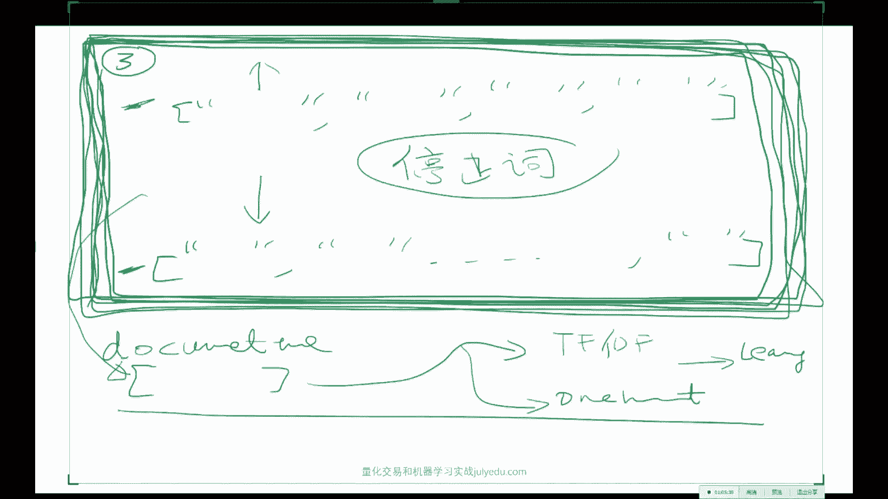

大家OK，我NLP就不讲了，就讲到这了，大家可以提问。

人工形成的词表给予更好的权，不是你只看人工形成的这个词表，就是说你把一个文，比如说你来了一个新闻，你只把这些是否出现了人工词表中的这些词摘出来，然后把其他所有词全部看作停止词，对这个会有一个这个啊。

就这个任远航同学问的这个问题，就是说他会有一个每如果用这种处理方法的话，他他的长度是变长的，变成情况下，要么就是切，就是说你你切掉些，要么是你把那些短的你加零补补补补起来，权重的不同是学出来的。

矩阵位数过大，会可以考虑成一个事，就是说会，数据维度高的时候肯定会有各种的问题，所以说你们还是可以先从简单的入手，我在最后一节课的时候会跟大家分享几个别人是怎么做的，嗯，的这个报告。

就是说我大概最后一刻会五分钟分享一个案例，分享两个小时，把所有的事情争取给大家，就是让大家多看一看各种各样，别人做的各种各样的方法，好，你问，啊，是这样。

work to vector是你最好是在一个极大的一个东西上训练好之后，你就用就行，因为你这个表示你毕竟还要再再进行二次的学习，表示只要不是太差就行，而且同时我个人不建议啊。

自己就是说在深度学习里头有这么一个话叫，don't be a hero，就是，就是你别逞强啊，最好用别人训练好work to vector的模型，他并不是就是说一般来说，你可以你在一个很大的一个数据上。

你把work to vector训练好之后，你就你就把它当做一个字典就行了，当做一个黑盒就行了，就是有一个词，我给你个相论，有一个词给你，最后肯定会推荐一些好的论文的，然后今天是也是刚才在课前按照承诺。

我上传了上周的那个一个关于预算算法的非常好的一本小书，网上没有，大家就别放到网上去了，别便宜了那帮小的，中文的有中文的，海国纳跟搜狗好像开源了，分别开源了两个他们自己的中科院的好像也开源了。

开源过这个你们查一下应该应应该会有的，好，那么我们现在看接下来的这个接下来的这个这个东西，是这样，将来大概要讲两个事情，一个事情是我们怎么样的定义一些performance，就是说OK。

你现在你是你牛逼，你预测出来明天涨还是跌了，但是OK，你明天你你你你你知道你明天要涨多少，然后呢，然后你是把你全家身当都押上去呢，还是你甚至再用一定杠杆，再借点钱，再来再来炒股呢，还是OK。

我就我就拿出我的30%的钱来炒股，这个问题怎么回答，另外就是说，你如果看涨，你你要买你买多少，这种问题呢，都属于这个所谓的策略问题，而这个问题呢，如果你不用这个这个强化学习的话，你这个这个是人工定义的。

就说如果啊，如果啊，在在考虑非在非这个reinforcement learning这个setting下，你的这些strategy，是是一个user defined的一个东西。

而这个strategy就是说，他其实啊，但但是你在做这个实现的时候，其实他是有两个事儿的，一个事儿所谓的这个model，另外一个事儿就是说，你要所谓的create一个signal。

就说这个买还是卖的这个东西，就是你的这个你的这个你的这个信号啊，跟你这个model，它是两回事情，这个事情是蛮积极学习的一个事情，而这个事情呢，是蛮金融的一个事情，而我们今天呢，先看第一部分。

就说我们要create signal，我们第一部分我们该怎么弄，然后呢，我再介绍一下，我给你的这个平台，然后呢，下一次呢，我们再基于这个平台再开发一点比较有意思的一些事情，接下来的时间我们就这么度过。

有问题没有，那么首先我们先看这个就是就是我们怎么样的度量，怎么样我们度量一个策略的好坏呢，一个一个策略策怎么写，一个策略，啊，这个其实大家都很清楚啊，你在任何的一个在线的量化交易平台中。

他都会给你返回各种的策略的度量的方式，而这个策略的度量跟我们模型的预测是两个事情啊，这个我强调过了，模型的预测会告诉你他100%多少的准确率预测对了，未来这个是模型模型的度量。

而策略的度量就会落实到前了，就就会落实到，比如说有各种各样的这个这个度量的方式吧，这个PL就说你的这个这个，这个total profit loss，还有这个就是等等的。

在我在第一在第一节课的时候给大家说了不少的这些度量的方式啊，就包括了这个这个loss win这个ratio，还有这个等等的这个啊，比如说这个average average period。

平均的这个PL的这个时间啊，等等还有最重要的一个是risk，我我们怎么样定义我们的一个投资的一个风险啊，大家一定要记住一个事情啊，在金融领域或者说在量化领域风险这个词他跟谁是同一词啊，大家想过没有。

就我们数学有一个公式专门刻画风险，OK波动性的数学，他对应的这个数学是什么，OK uncertainty，他对应的哎，对variance说的很对，风差，这两个是同一词，就是说风险就是风差，什么意思呢。

就是说因为方差你是有一个期望值了，这个这个是你的期望值，期望值他的这个方差就是说我我就你承诺你能给我一百块钱，但是你的方差很大的话，就是你有时候给我一百五有时候只给我五十，那么这种情况下呢。

就叫做风险大，风险小是什么呢，我说给你一百，我一定不会给你一百零一块，我也一定不会给你九十九块，我一直都在很小的一个区间啊，在做这个事情，那么这个方差呢，刻画的就是说，如果用比较文科的一个词。

他叫他叫风险，如果用一个比较理科的一个词，他就叫方差，而而大部分的这个就是说，而而而对于就是说对于方差的这个分析呢，其实是我们这个做这个做做这个，就是说做这个，风险管理里头一个非常关键的一个指标。

各种各样的其他技巧其实都是在研究方差上做文章啊，就是利用方差做一些一些调整，比如说你说你的这个回报是，百分之十五，但是我要通过你的这个return的这些方差来进行一个调整。

来重新建立我对你的这个return的一种一种信念，我不认为这样做是这样定义是好的，咱们慢慢慢慢来看吧，慢慢来看吧，那么比如说你不考虑，你不考虑这个风险，就是你并没有，你并没有考虑到风险。

你风险的一种关于回报的定义return，他应该是什么呢，就是return of t，就是说你还就是说就你在t时，在t时刻，你的这个回报的这个定义。

其实那么就是你的这个portfolio的这个资产减去你这个刚开始的时候的这个价值，然后你除以刚开始的这个价值乘以百分之百，这个就是你的return，这个就是他基金经理A告诉你啊，他的回报率是15%。

那么就是这么计算的，那么一个所谓的这个acute curve，他画的其实就这玩意儿啊，就这个叫做，就一般来说都是往上走的啊，突然这样，那么如果只看这个所谓的这个叫做acute curve，啊。

横周时间啊，那么这个东西呢，他的这个其实大家都大差不差，都是往上走的，但是你只看这个图呢，很难比较不同的这个策略的这个表现，是因为他在微宽尺度上，他长得是很不一样的，但是你看这个趋势。

一般来说都是往上走的，那么就需要有另外一种方式来评价你不同的这个策略的这个这个性能，那么一个最经典的一个，一个评价指标就是所谓的这个，叫sharp ratio，他什么意思呢，他比如说你策略A。

他是15%的回报啊，但是你的方差，但是你的方差是比如说，0。5，这B的话大概是12%的回报啊，但是他的方差大概是比如0。2，那么我们应该选哪个呢，怎么回答这个问题，为什么呢。

就是你怎么样的用一个公式来算这个事呢，就很简单了啊，就用这个所谓的这个，return of i减去return of risk free，除以这个virus。

return of i减去这个return of risk free，他的这个号什么意思呢，就是说，首先我们这个期望值，我们要不要投他，你们要先跟一个无风险的一个一个产品的这个回报，你先求个差，比如说。

就说，比如说国债的这个收益率，你的这个收益率跟国债的差不多，那我肯定不，我傻呀，我肯定我就把钱啊，我就存预额保里了，对吧，就就说你要首先要定义一个无风险的一个产品的一个回报，然后呢，你的这个回报呢。

减去无风险的这个产品回报这个平均值，如果你不考虑风险的话，你就只看这一列，你就能得出一个结论，挑高的来就行，但是呢，我们要除以他他的这个方差就相当于，就相当于调整一下。

就是调整一下我们的这个对对这个收益的这么一个一个期望，这个值呢，是能够更加，就是说考虑了风险之后更加合理的一种评价指标，有问题没有，然后如果你要做这个年化的下谱率，他干的事。

你就除以N就你前面再再乘以这个N的根号就行，比如说这个是SHAP1，那么就是SE就行，这个是我们在下一次真正要讲这个怎么应用风控中，要干的要要要要熟练掌握的第一个公式。

第二个公式是第二个公式回答的是这个问题，第二个公式回答的是什么问题呢，就说比如说OK好，比如说我们现在知道你一个产品，他的这个SHAPRATIO，他是大概是比如说，百分之不比如说是一点二。

然后你知道你的信心大概是百分之这个信心呢，就是说你，你认为他的这个信心大概是比如说百分之七十，你打算把比如说你你有一万块钱啊，你打算放多少钱放到这个产品里头，有一种计算方式是这样。

有些方式就是叫做BP-Q除以B，就是啊，这B呢，就是说你的这个赔率啊，这个P呢就是说你对这个产品的这个信心啊，Q呢，他就是一减P啊，这个B呢，就是你这个赔率，对，这个是凯利公式的第一种用法。

第二种用法是，你的这个资音的这个allocate这两个事等价呢，他这个allocation就是说我这个I除以他这个SIGMA的这个I，就说，我的这个收益率啊。

除以他的这个收益率这个方差是比如说我对一个资产组合的这个Portfolio的这个策略，我所需要给他配的这个权重，这么算就行，然后我们所要所要用到的这个。

就是我们预期的这个预期的这个收益就应该等于R加上S平方除以这个R，R就是说这个这个Risk，Free的这么一个，的一个interest rate，然后这个S是年化的这个年化的这个，Shop ratio。

这个算算出来的这个值呢，这个算出来这个值就是我们对，你整个这个策略的收益的这么一个期望，这个F是strategy，allocate就是说他的这个，资产配比，这些事情是我们下次做这个，做这个。

这个这个真正的这个计算，风控中的这个公式的基石啊，因为下次我就，就假设你们这些基础知识就都知道了，然后你们回去需要看的就是一些关于凯利公式的一些定义和Shop率的具体的一些计算。

这两个你们就就差不多就是我们下次课，我们就假设这些知识，大家都会了，下次会有，啊，啊，这个G就是说我们这个就是说，就是说我们这个期望谁的期望呢，是这个你的这个你的这个profile。

你的这个profile的这个，这个增长率，一个profile，那么其实你是用这个事情是来算档稿的啊，如果对吧，这个其实你是用来算杠杆的，就比如说如果他是22%的话。

那么我们就期望一年之后这个东西应该给我22%的这个收益，具体怎么算这个资产组合管理，这个是我们下节课的任务，而我们这节课呢，是因为我们现在如果你没有一个系统的话，你这个算你也塞不进去。

所以说我觉得还是先先现在开始给大家，把这个台子先搭起来，要不然再写一堆函数，到时候你都不知道你都不知道怎么塞塞到哪去，好，那么接下来我们终于讲到了一个，一个比较马龙的一个事情啊。

就说我怎么样写一个叫所谓的event，driving，的这么一个，这个engine，怎么写一个基于事件驱动的这个整个的交易系统，先说motivation，先说我们为什么要搞这么一个所谓的事件。

先说我们为什么要搞一个基于事件驱动的这么一个引擎，因为如果大家都做了之前我给大家留的这些作业了的话，你们就会发现自己有时候写的这些东西有点乱，就是说就是代码很难重复利用。

而且你的这个项目也没有一个比较好的一个管理系统，或者说也不是很好扩展，或者说你写的时候也很容易出现bug，因为如果你不是事件驱动的话，你很容易不小心把未来的一些，就是你把未来的数据就是发生在未来的事件。

你放到此时此刻进行了，那么就会有各种各样的问题，那么基于事件驱动的这个引擎的是目前大家想做量化交易回测也好，这个实盘也好，大家发现用这种思路来打造你的这个建模平台是一个大家的共识。

无论是这个国外的这个Quantopian还是这个这个国内的各种各样的这些在线的平台，他们都是遵循着这个设计逻辑跟这个范式来进行开发的，就是他们的核心的这个股价其实是一样的，一些关键函数。

也许是关键函数名不一样，或者说他比他多了三个函数，但是呢，整个的这个实现逻辑呢，其实是一样的，因为大家都都现在的共识是如果要做这个量化实验的话，你把它放到基于事件驱动的这个角度来写的话。

你不管是在做实验还是在做维护都会非常爽，OK，那我今天就给大家一个极简主义的，这么一个五脏俱全的这么一个平台，因为肯定是系统越复杂，你越难看明白，我给大家一个能跑起来的最简单的一个东西，但是你能往上能。

如果你之前的作业都做的话，你就会非常开心，是因为你就知道怎么样扩展成你想要扩展的那个样子，因为每一个个体和单位他们的需求都是不一样的，相当于给你个curl，你往上面自己加你的这些东西好。

那么先说什么叫做event driving，event driving，其实他就是，他就是一个处循环，就是说，如果你是while true，while true那么，一个无限的一个循环。

那么他会有一个这个有一个，new event，我先说一个伪代码，然后咱下接下来就要看代码了，啊，就说你先get一个event，这个这个事件有各种各样的事件，待会我会说有什么样的事件，然后呢。

你就会比如说，你就会有有些逻辑，if这个new event，这个新的这个事件等于等于什么，那么我们要做do something，然后当我们把这个，这个事件对列全部清空之后呢。

这个这轮循环就算结就算结结束了，我们就走到下一个循环，比如说我在这个事件对列里已经空了，那么我们就就我们就take，比如说，这个这个时间就相当于我们等上500毫秒，这个这个在量化里头。

他有个词叫心跳heartbeat，然后这样的话，我们就就相当于永不停息的有有这么一个有有有这么一个处循环，然后不断的处理这个任务对联中的这些任务处理完之后，我们走下一个，嗯，有问题没有。

就比如说你要玩一个游戏的话，这永远是一个处循环啊，那么他就监听着你鼠标的行为啊，如果鼠标点哪我们就干嘛，如果鼠标点哪我们就干嘛，就是把这个很多的这些关于这个event全处理完了，那么我们就走下一个循环。

有问题没有，完全可以，嗯，这这无所谓，这个tag的这个时间是取决于你要在什么尺度上做交易，或者要在什么尺度，你的这个是取决于你的策略的，你的策略是需要在什么尺度上做的，然后你每过一个tag。

你就要你的这个数据处理程序就要进行更新啊，你是想每每一个小时把你的数据库更新一下，还是你是想每500毫秒把你的数据更更新一下，这个是有你自己的这个，不是跳出vail，就是说就进入就相当于你等。

就是说相当于你又等了，就是不要让他立马进入下一轮，他不会跳出去，这块巨片后端，这块就是说，如果今天你没今天东西，我给你个代码，你没跑明白的话，你就你就你就你就你就用框头变这些U框吧，嗯，啊，啊，你呃。

其实是可以的，如果你的频率不是太高的话，啊，python，好，我现在先说一下，这个主要的这个主要的这个逻辑是什么好吧，这个接口其实有很多现成的这个什么，这个其实很多现成的交易系统，他都给你提供了API。

你直接跟他接过去就行，比如说这个跟IB是你就无缝，你就接了，但是跟国内的那就不好说，然后怎么这个有个同学，这个Q号比较奇特哈，80000是是匿名吗，还是什么不大清楚，为什么要匿名呢，好。

那么我们现在就就就说哈，其实他就是大概是这么几个事情啊，我操原来是真的QQ号啊，牛逼啊，久仰久仰啊，这是因为讲一个讲一个系统是最最麻烦的一个事情啊，我尝试着来把这个能讲清楚好吧，然后待会咱们再看看代码。

你这不是你这是有一个数据库的，这是你的DB，你这个DB跟你的这个东西要要要跟你的这个，我先说说这个上层的逻辑哈，比如说你在开发之前，你你你需要干的事情，然后再把这样的话。

大家在下周在读这个代码过程中就会不会太痛苦，反正，你是有个database的，对吧，你这边不管是Circle还是一堆CSV没有关系啊，那么你要干的事情呢，就是说你是需要有这么一个叫做。

data handler的一个东西，这是一个，这是一个这个类是一个ABC的一个类啊，就是，就是抽象的这个机类，他是要干嘛呢，他是要实现你要从数据库中提取数据中。

为给你为给任何需要数据交互的这些类的所有的函数都要实现，包括了你，就是说咱们之前的各种的特征提取的那些函数，就是只要涉及到了跟数据库相相交互的这个东西，我们是需要有一个data handler，OK。

然后我们还需要有一个什么呢，我们还需要有一个这个叫做有了这个data handler，他是他一般是会给谁呢，他会有一个叫strategy，这个类这个类干两件事情，一个一类事情是建模model。

建这个就是，一类事情是生成一个signal，这个signal是买或者卖啊，或者hold，就是说他会生成这个一些这个signal，生成这些啊，一系列的这个signal，然后呢，他给谁呢。

这strategy他不干事啊，他给一个最大的一个类叫做portfolio，这个类就相当于这个事情相当于你的管家类啊，他干所有的就是他接收到啊，就是他接收到这个买或者卖的这些单之后。

他来决定是否要进行这个，backtest，或者是否直接进进行这个通过这个execution handler，execution handler进行实盘的交易，还是我们直接触发这个这个回测。

那么而且同时呢，我要更新我啊，就相当于记账一样，我要更新我的所有的资产，我要计算我的share ratio，我要我要进做我的分控，就是我这个相当于一个中控平台，基本上其实他这个整个的逻辑啊。

其实就这么简单啊，然后同时呢，我们要再做一个整个的一个把把他全部，封装起来的这么一套东西啊，把它叫做backtest，back，回测啊，b a c k，而我刚才说的这个基于事件驱动的这个这个这个循环。

他在哪呢，他就在这个backtest的这个类的实现里头，你就会看到有一个，有一个永远为真的这么一个循环，他是在这个里头的，然后当我们这个写好之后，这个写好之后，这基本上就不动了，我们平时建模呢。

其实就是在这个里头，我们要实现一个strategy，做的就是extend的一个，一个strategy这个类，然后生成每个人不同的这个模型，然后料给profile，然后进行回测。

比较那么其实我们的那些看到的那个什么优矿啊，什么他其实就是让你在网页中实现了一个新的strategy这个类，然后他其他的这些他都帮你写好了，就是说其实你能看到的就你用户需要反复写的呢。

就是你不断的extend的这个类就行，先说哲学上的这种安排啊，然后再看代码，目前大家有问题没有，没有没有好，没有我来，那我现在就把这个我就把这个我给他打开，我给大家看一下。

然后待会就给他发到发到咱们这个咱们这个群里，稍等。

能看到吗，心跳监控放到backtest里头，他的他的这个想法就是说，他的这个想法就是说我们要等一段的时间来来，就比如说因为你做交易的时候，他他总是有一个最小的时间间隔的，好。

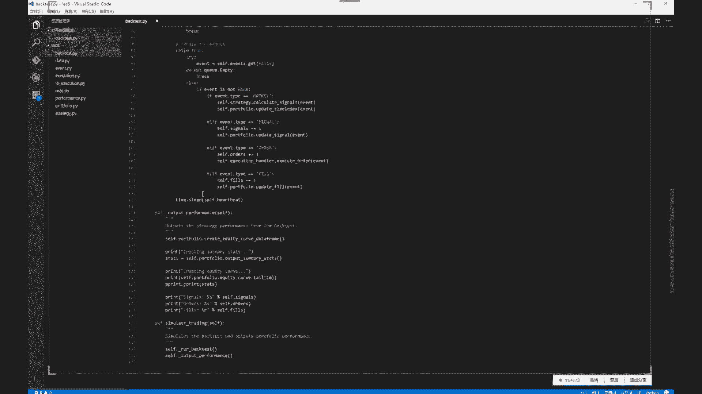

来，别急，怎么样。

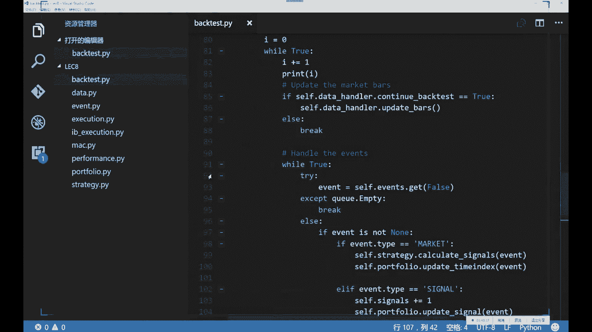

可还行，先看这个最高的上面封着先不看这个。

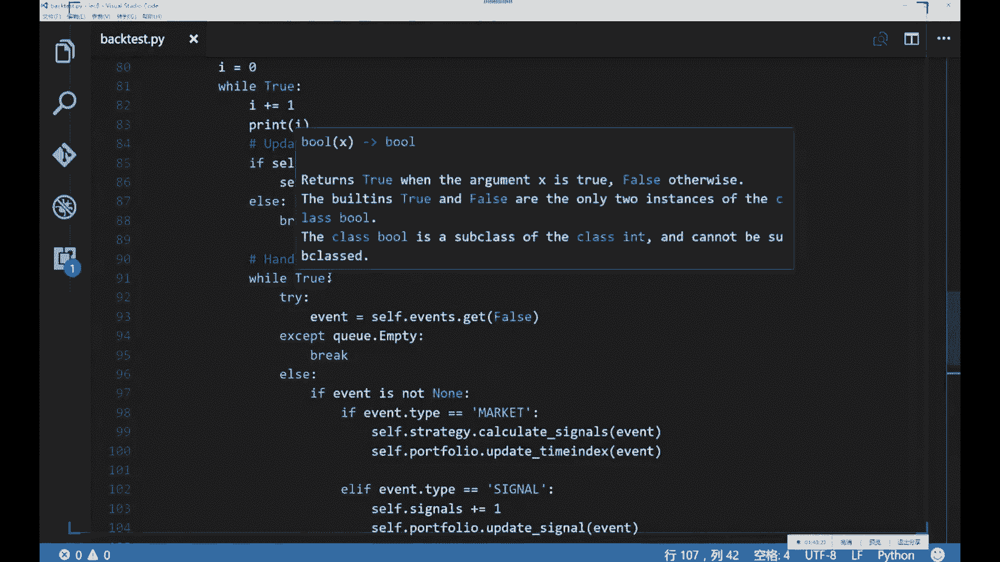

我给大家先看怎么用对一定要讲一个东西。

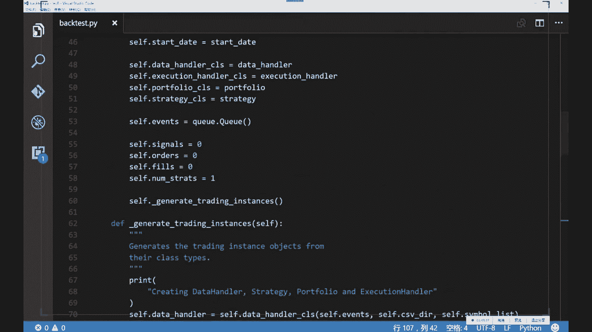

你要学会造轮子之前你要先学会用轮子对吧，假如说我刚才那个系统已经写好了，就是说我这个回测系统已经写好了，没有问题吧，回测系统写好了，我们平时怎么用呢，其实是这么用的，你有了这个回测系统。

这块其实就是那个优矿网他们后台所跑的地方，优矿网前台他料给你的呢，这个是一个基于最简单的一MovieAverage的这个一个，Strategy他是实现了这个Strategy这个ABC。

那么你就需要写的呢。

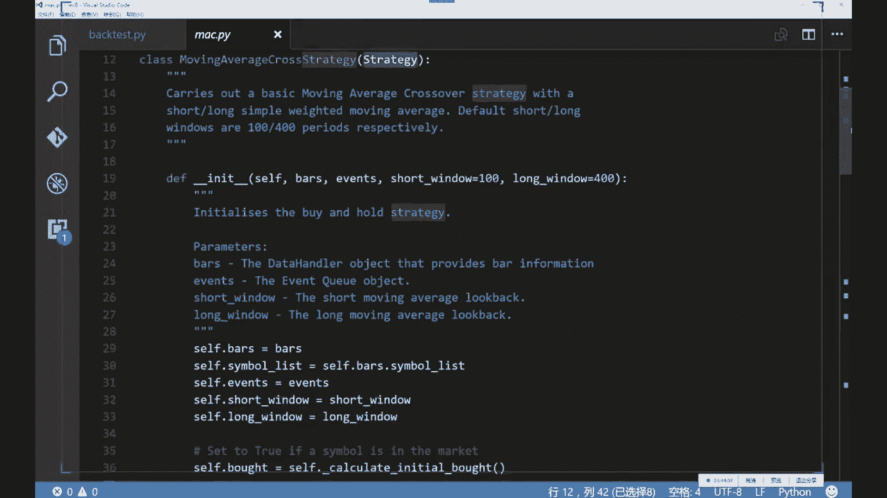

其实就是啊，你需要这个比如说，这个函数是一定要有的Calculate的一个Signal。

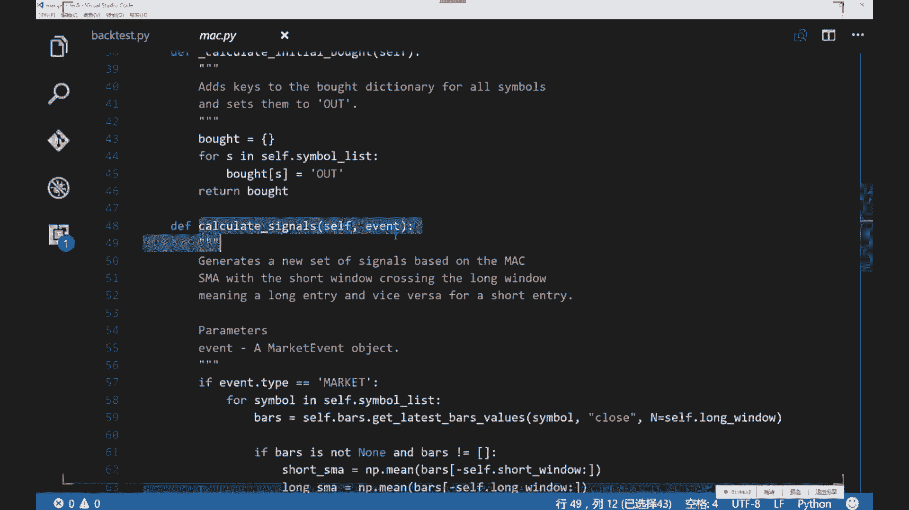

就是说你在什么情况下你要买什么情况下你要卖啊。

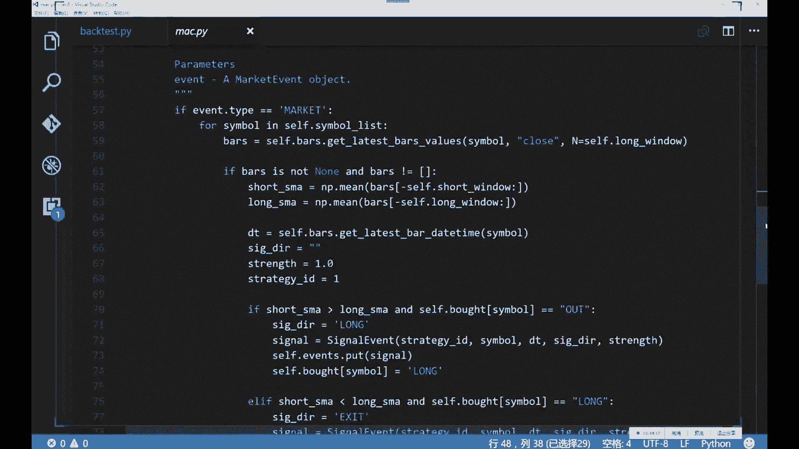

然后另外呢，因为，因为这个这个MovieAverage的Strategy，他并不并不并并不涉及基于历史数据的机器学习，所以他他并并不需要有一个这个Build Model的这个函数。

但是我们以后要做比较严肃的这个Build Model的这个东西呢，是你对你自己的，比如说这个另外一个Random Forest的Strategy里头的一个函数是Build Model。

就是你的所有的Learn就是你的电脑一下跟死了一样，停了有半分钟或者停了有一个小时的那些函数，都是在这个类就是你要实现的这个新类里头，你要你要不断的实现的，当你只需要实现完Strategy这个类之后。

你就直接把这个Strategy料到这个回责平台里头，他就会产出啊。

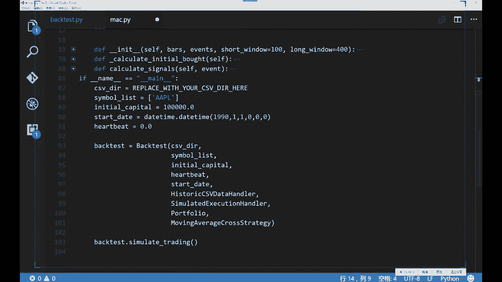

你所期待的这个啊，你所期待的这个这个结果呢。

咱们看这个咱们还是看这个代码，这个这个大家一定回去要仔细的看一下我。

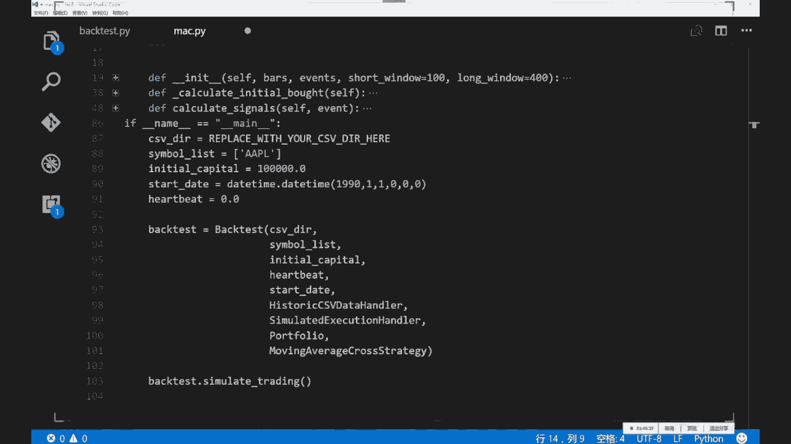

我今天进我的这个能能就是说。

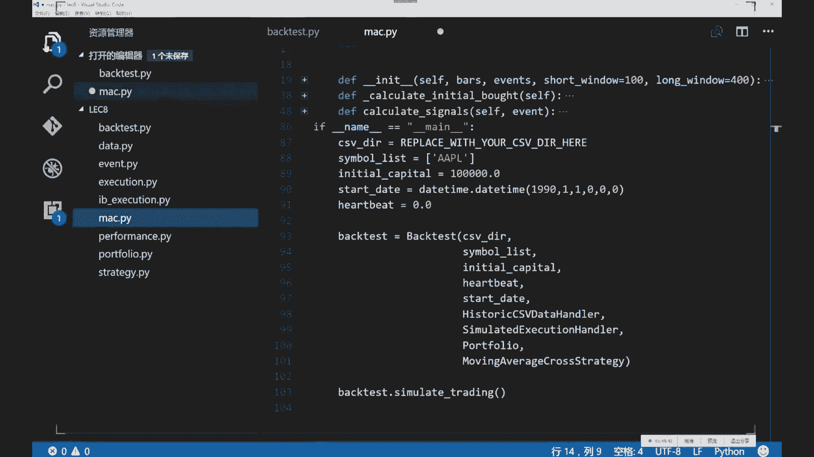

就是首先这个最顶层是这个所谓的这个Backtest层。

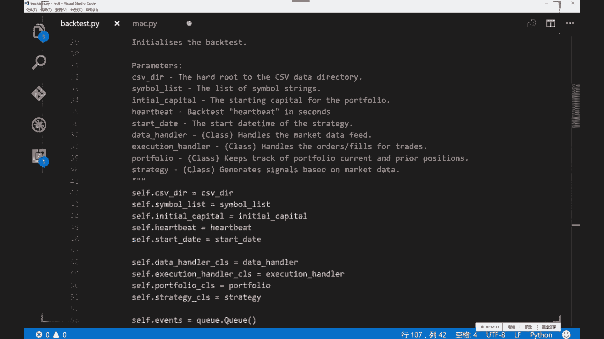

这个Backtest里头，他的这个Run Backtest，他就他就已经是有这么一个处循环啊，只要是真的时候，他就不断的，他就，他就不断的把这个事件来退入到这个Event这个这个对链对链里头去。

当这个对链为空的时候，我们就可以走到下一个循环里头，那么我们这个这个对链的这个这个Event的type差不多有这么几种一种市场行为啊，市场给你的新的数据。

或者是你你的这个Strategy给了一个这个Signal是买还是卖，然后或者是你啊，你的这个Portfolio是有一个下单啊，然后还有这个这个Fill Order。

或者这个就是说你怎么样的更新你自己的这个你的这个记账的这个系统啊，因为你这个你这个Event的事件，其实就就都能归结为这四类，就所谓的Market Signal Order跟Fill。

然后你把这些事件对链里的事件都清空之后呢，你就Time Sleep就行，你这个Heartbeat是你自己定义的，OK。

没有问题吧，那么这个，有问题吗，对这个大家回去一定看一下，因为你回去对你你你跑一下跑一下就行，然后你这个这个这个这个这个Portfolio是最最麻烦的一个事情。

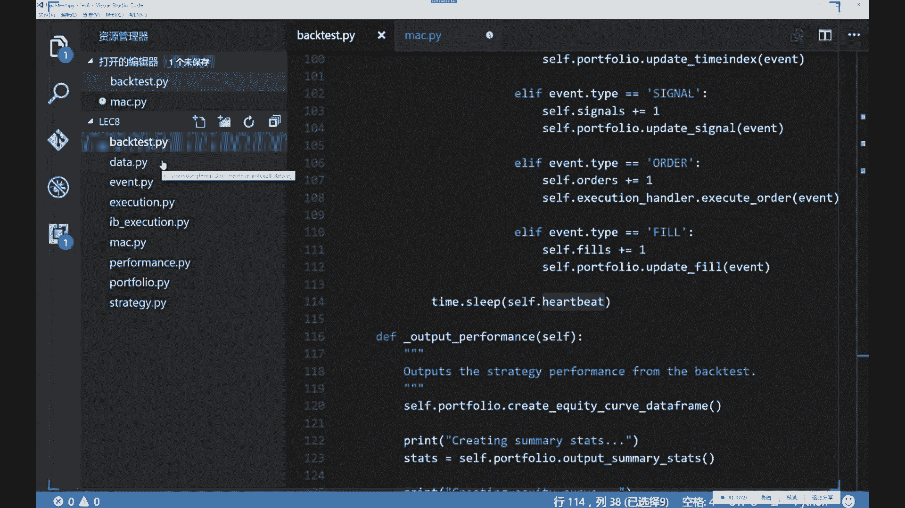

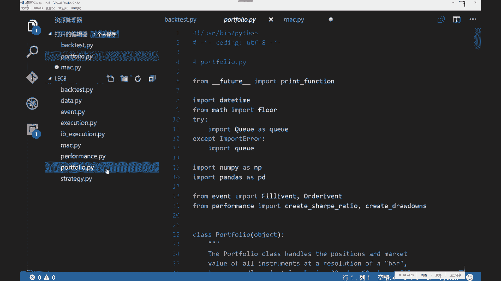

会当然会。

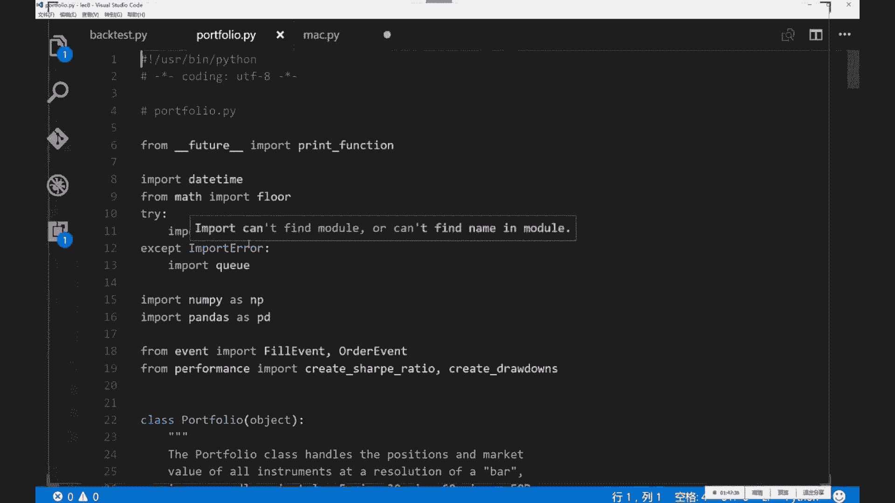

我不可能只只只去看不许摸啊，那咱们不干这事。

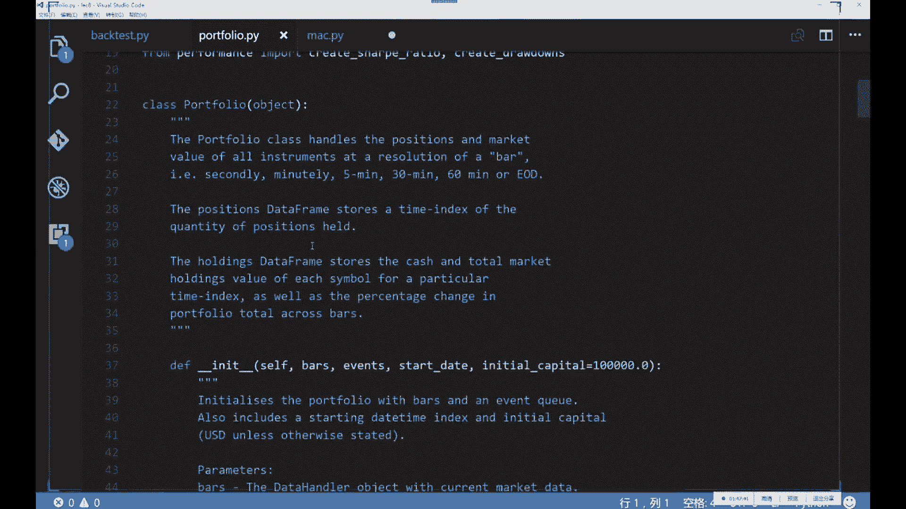

然后这个Portfolio其实，如果同时几个事件过来，这个就比较麻烦了，那就是，你只要你就说，细节太多了。

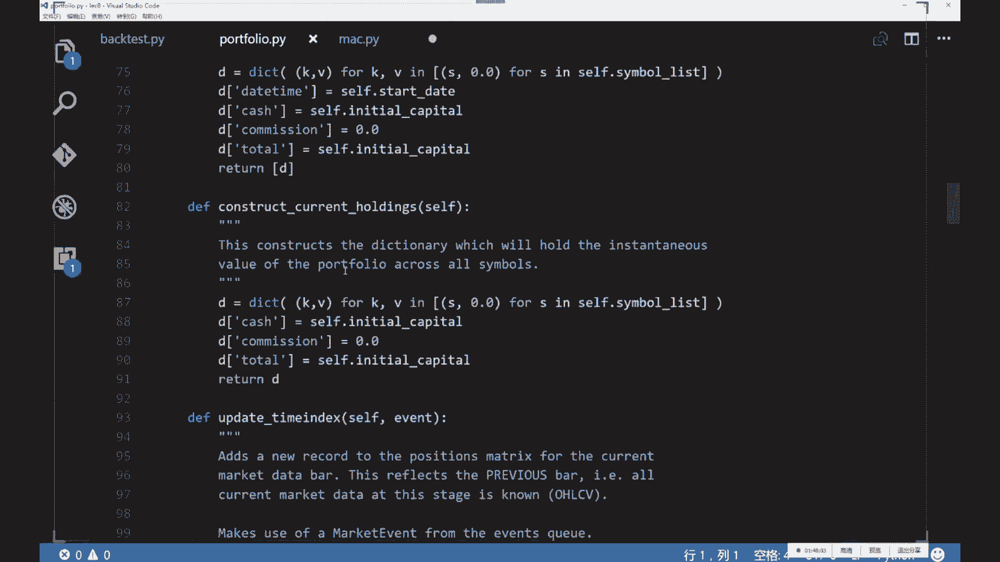

然后你这Portfolio是最麻烦的一个一个类，因为你需要对你的这个，就是你需要更新你自己的这个你的这个资产，同时你你这个Portfolio要实现你的这个分控管理来决定是否。

对你的这个对你的这个资产进行一个资产组合，同时呢，你这个Portfolio的输入是什么，Portfolio的输入是你的Strategy，就是啊，是啊，就是你这个Strategy是买还是卖。

然后你这Portfolio根据你Strategy买跟卖这个信号，再结合你自己的分控逻辑来决定是否要下单，如果下多少，就是都在Portfolio里头进行一定程度的这个更新啊，这个里头的就是这个函数是大家。

要要做的比较多的一个一个事情，然后呢，还有一个类就是还有一个类，还有一个比较重要的一个类就是event，就是所有的event都在这个里头定义，啊，啊，不是Strategy不是训练好的，啊。

Strategy要包含训练好的模型，Strategy是你需要不断开发的一个事情，这个event的这个类就是你定义了我刚才说的那四种event。

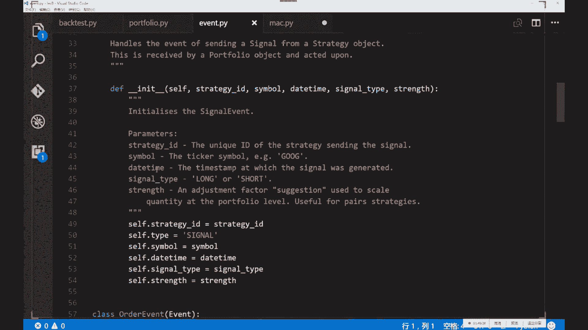

你都需要有有你自己的一个定义啊。

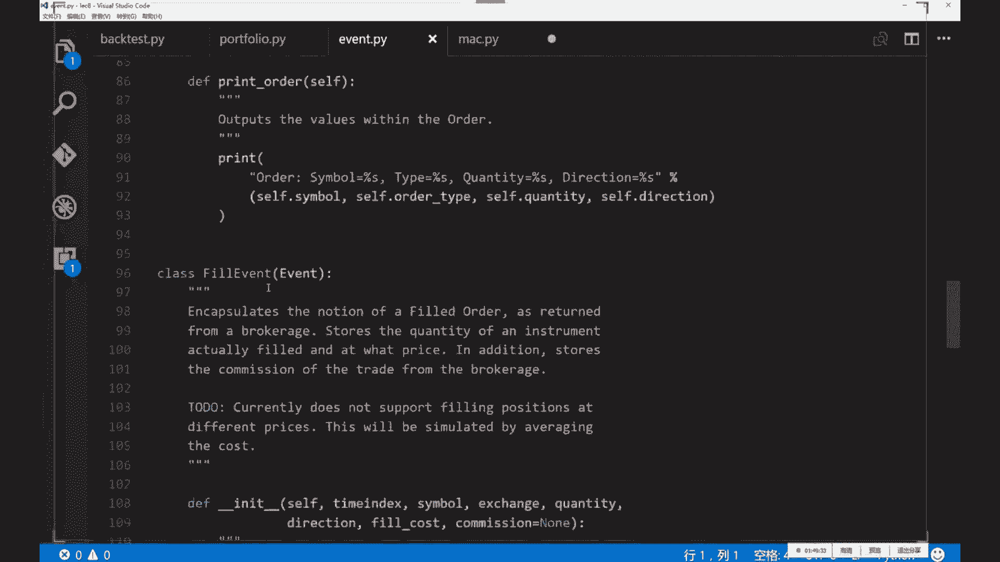

那么今天的一个作业就是基于我给你这个平台，然后你你你需要把你之前写的，那些个函数就是计算feature那些函数，选择一种合适的方式，放到这个Data Handler的这个库里头。

其他的不动就改写这个类就开源，你可以没有问题，因为现在有很多人拿了一些奇奇怪怪的一些东西，就就就就出去，就就不知道要干嘛，啊，嗯，对就是说当你有了这个当当你有了这个东西之后。

你只需要只需要写Strategy，其他的都不用写，当然你要跟你的这个数据做好对接之后，所以今天的作业就是请基于这套系统跟你自己的数据库对接好，然后呢，成功的抛弃这个回测模型来，这样的话。

就就就相当于把你之前的这些代码，以一种比较好的一个方式进行一种管理，今天作业听明白了吗，就是说假如说你在没有风控的这个前提下，就是以最简单的这个下单的策略，就是如果要买我就买，如果要卖我就我就卖。

这种策略这Strategy传来的这种策略的前提下，我们能够跑出一个风控模型出来。

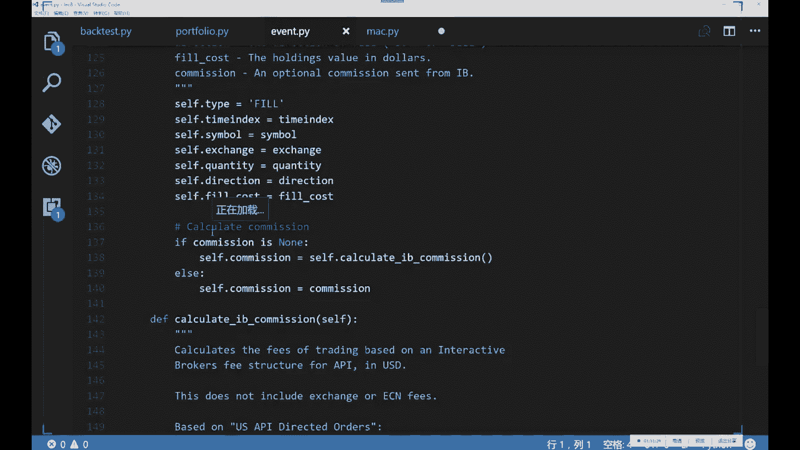

你需要参考的这个。

参考的这个就是这个Mac，就是MovieAverageCrossing这个函数，你你你只需要把这个主函数改成你相应的你自己的，比如说，某一只中国的这个呼人300中的某一只股票，同时呢。

你要实现的你自己的这个机器学习的这个训练模型，然后我强烈建议呢，你把DataHandler，这个函数可以进行部分的扩充，能够更加的自如的来适应你自己的建模过程。

也可以是把这个特征提取的这个东西放到你的Strategy这个里头去，这也没问题，时时这个是分尺度的，如果你尺度在几分钟的话，没有什么问题，我这不是爱的意义，我这给你们讲课。

我专门装了个Windows昨天，我，这个是VS Studio，code叫VS Code只能用来看，我自己的这个个人的偏好并不能影响大家，你们就用自己顺手的吧，我就我就不影响你们了，啊。

Anaconda Python不是IDE，不过Anaconda Python，里头好像有一个什么Spider的这么一个东西，你能够当做IDE，风控不需要有单独类。

风控直接放到这个Portfolio这个类里头去，你也可以给他写大，你这玩意你没个头的，当你的需求越来越大的时候，你这玩意肯定，我这个其实是给大家的一个。

极简的一个一个为了理解整个系统逻辑的这么一个小项目，而你真正的要放到一个非常高频的一个环境中去，那是肯定不不合适了，但是如果我们上来就学一个，非常工业化优化好的一个东西的话呢，也不现实。

所以说从简单的学习吧，Strategy的model一般你可以有任何多个，比如今天我想做个随意森林，明天我想做个就是说，这个Strategy里的model是你每天要做实验的各种各样的东西，这个取决于港。

因为在一个机构里头来说的话，你并不需要是一个全站工程师，你只需要干你分内的事情就行，那么如果你是一个量化的一个这个researcher的话，一个quant researcher的话。

一般的工作语言主要是Python，那么如果你是这个，这个technology或者这个IT内那个部门的话，你主要是要实现极其高效的这个下单跟这个订单管理系统，那么你一般来说是用C++的，就取这这港不一样。

那么如果你是一个就是我自己炒骨炒着玩啊，那无所谓，每天不是每天都改model，每天都会在model上做一些新的实验来验证你的一些想法，这个系统的入口是不是这个Mac，这个Python相当于一个一个测试。

就是说相当于对这个系统的一个展示，就是说它是一个，它是有闷函数的，啊，会想因为我们在下次课的时候，因为因为你想如果我下次课本来计划的是下次课把这个代码给大家，但如果下次课给大家的话。

大家没有时间消化就课程结束了，这样的话，我怕大家吸收的不够好，所以说这次课给大家，下次课咱再接着再讲点，还有什么问题吗，今天的作业是部署代码，昨天的作业不要忘了，昨天作业是干到零点零几来着，请回答。

应该是零点零七，好好，今天给代码，你只要稍微调一下，你把你的这个只要你跟数据对接上，你你如果非常懒的话，你直接跟这个图示对接他的online的数据，如果你不是很懒的话，你跟你本地的数据进行对接。

接下来就能跑，啊，应该是可以的，我给大家一个一个样例，一个html的一个文件，因为这个平台它相当于一个就是任何一个交易系统所必备的一个东西，你能往上接着往上涨任何事情，如果你要交易的话。

你会额外写很多很多额外的一些代码，因为跟你这个是跟你要跟谁接有关的，这个跟机构的差异在于这个是用作教学用的，而机构的所有函数都会自己以非常高效的方式重写。

比如说首先需要计算密集型的所有函数用Cython，就是一个Cython，大家应该听过哈，就是，同时呢，对就是把它往高效写吧，同时能够，就是徐孝天同学拼出来的这个东西，就是说。

那么这个就是纯高性能计算的一个事情了，这个，主要就是说怎么样的让我们的系统分析它的这个瓶颈的热点，让它越来越快，同时能够处理高并发，同时呢，还要满足各种各样的交易的需求，那么这个东西就能无限的。

丰富下去，现在这个系统最后的输出，我代码给你了，你跑一下你就知道了，就是他这个输出就会print出来，我今天讲课。

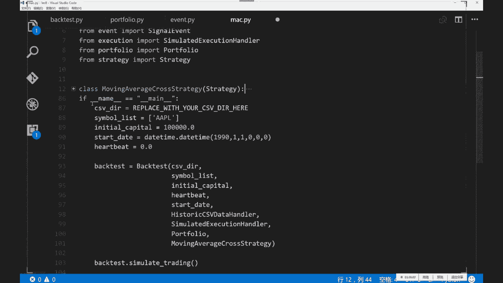

前面的这个东西，给大家看一下，就会输出这些个玩意儿，就是如果我们对这个苹果股票用这个移动平均，的这个策略来跑的话，他就自动会告诉你，爸爸爸爸，就跟你就跟你要输出那个什么是一模一样的。

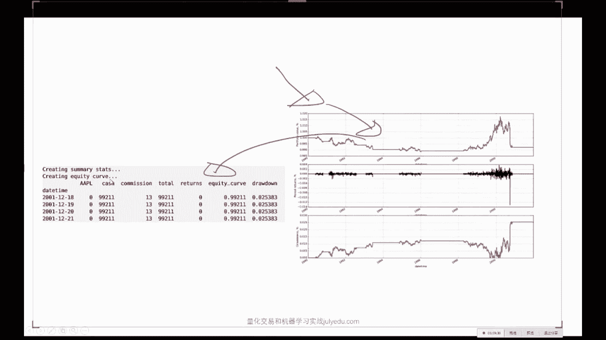

就是就跟你要你要你在玩这个U框网的那个输出是一模一样的，对是，咱们这个课就剩最后一周了，非常希望大家，不要放弃，用最后一周的时间，好好的把这个再过一遍，因为我力求的是是循序渐进，同时呢。

让大家在最后一次能够把这前十讲的东西全部能搂起来，所以希望大家在未来的一周把握好这个时间，然后我争取在最后的两次课，我尽我的能力给大家加上，四个小时之内越就是尽可能丰富的这个内容，取决于我的语速。

那么今天咱们就，最后再留一个一个最后再留一分钟，看看有什么最其他的问题，是十四个今天是第八次，所以还剩两次，但是两次会在一周时间内就连续两天内搞定，这样的话呢，嗯，怕大家来，比如下次。

下次留的作业我就不会改了，是没有界面，但是其实你要就是如果你要图形化的界面的话，对对确实是，其实也不是很需要，而那个比如说现在现行比较时髦的这些，在线的做矿的这个平台。

他其实就是他把这个backtest的这个结果用这个js给你进行了一个渲染的交互，预之前那块好这个问题，我回答一下这个问题啊，之前那块预测分出来分类结果信心那块是怎么算的呢，信心是这样。

如果你是贝叶思学派的人的话，如果你做这个，如果你用的是比如说所谓的高斯过程回归啊，他这个他每一个预测点，他都会给你一个分布，这是第一啊，如果你是就是比如说我跑这个随心林的话，你一个比较合理的方法就是你。

你做一个K折K折的这个交叉验证，然后汇报一下K折交代证上他的这个平均准确率，这个就应该是你认为你能做对的一个信心的一个表示，对，我会给你一个跟IB接口，但是跟其他的这个其实啊，你们自己，自己接就是了。

或者对于尤其是如果对于初学者，我强烈建议，如果你是说OK老师，我就是在家炒股炒着玩，我编程特别强，我计学也不错，对于这种的学员呢，我强烈建议你手动下单，你别整这些，频率放低一点，你手动下吧。

一点也不丢人啊，你每天晚上你下班回来，你跑一下，把这结果你自己定一下，然后第二天你做就行，刚开始的时候强烈建议不要，不要玩火，因为这里头涉及到的一些工程量实在太大了。

尤其是对于你一个人在家做这个事情的话，频率肯定也上不去，所以说你还是你还是自己来，比如说我现在认识不少这个他们是，就是自己用一个就是用这个量化交易的这个模型，计学机的算法，而算法是什么。

我都知道他收益率还相当不错，因为那些模型是找我弄的，然后他们干的事情就是每天晚上回来，然后把算法跑一遍，选出来一些股票，然后，对资产组合计算一下，第二天早上起来拿手机下单，不丢人，所以说。

如果你们以后如果有一些建模的问题可以可以找我，但是你不要，不要找我帮你debug什么的，这种这种问题，啊，再跟大家说点能说的，我这门课上说的都是能说的，不能说的我不，我都不说，能说的是我，给大家点信心。

就是有人纯用这个，自然源的方法模型，我也知道，因为也是我给他在做一个选股的一个事情做的还不错，至少没亏，行好能说的都说了，那么今天抱歉啊，拖长了二十多分钟，是因为这个咱们今天晚开的有点晚。

那么今天我们就先到这儿，大家晚安，我会在后半夜把这个代码传给大家，你们早上起来早上起来就有了，因为我还有些事情我得赶紧，好。

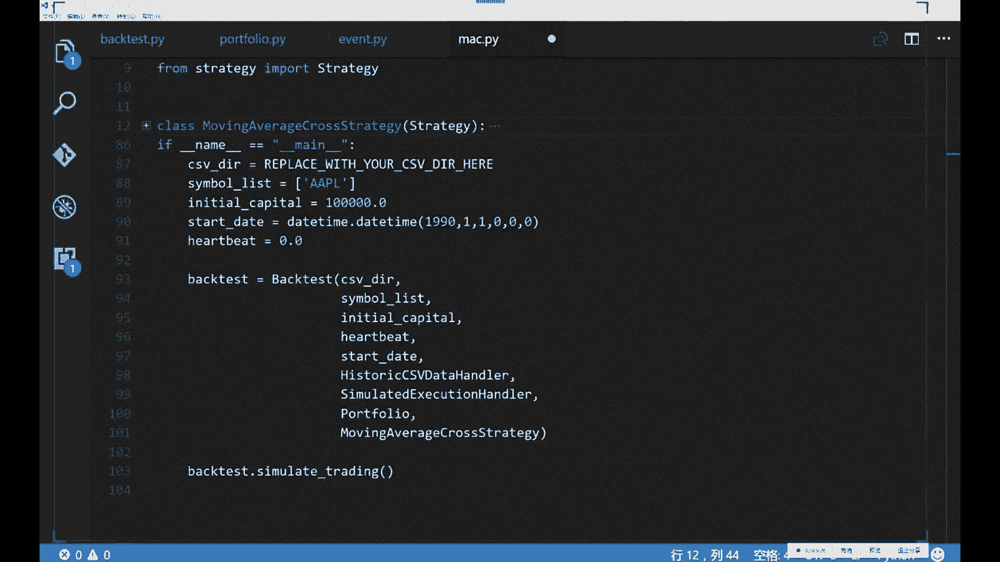

咱们今天就先到这里，我们再见，字幕君寶貴。

