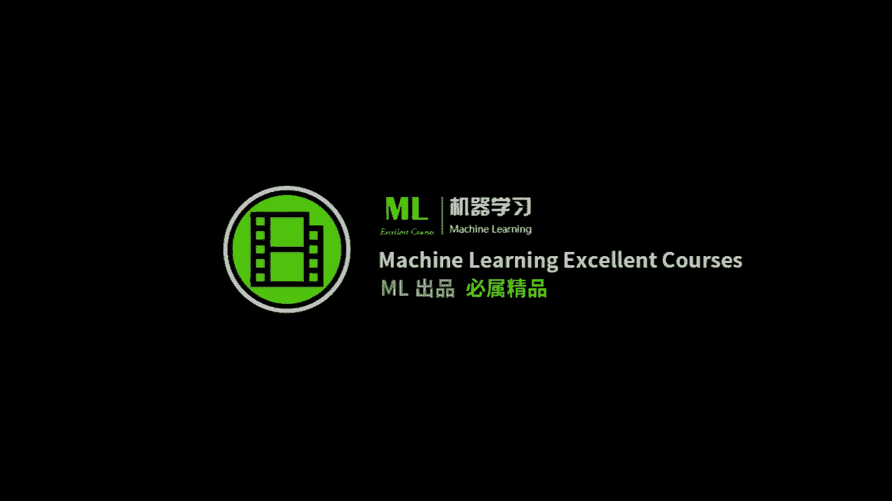

#  - P1：第01课_机器学习与量化交易项目班 - 大数据狂人 - BV1V24y1Y7eY

我们是这个啊50啊，8。8点钟准时开始好吧，嗯屏幕马上就马上就来，这个录像是有的，我们应该是嗯在下周吧，下周一还是周几，你就能在官网上看这个课程回放了，然后实时直播的理由是嗯。

如果你是选择实时的在看的话，嗯有一些问题可以当场的进行一些交互，但是其实不影响，因为我们课后也会有一些答疑，所以不一定非要嗯看直播，看重播也行，现在呢是因为我这个这这个电脑。

它它有它有点这个这个这个这个这个风扇，那能因为因为就是说我们要用到一些这个，手写的一些东西，所以所以这就好，那那我们八点到了，我们上车吧，好吧，这个咱们就不等了哈，嗯好，那么今天是呃这个楚大爷。

他请我过来给大家做这个啊，这个这个课程大概是一共是14，然后教给大家怎么样将这个机器学习的知识，应用在量化交易上，以及一个比较偏项目的事情，就是说怎么样的去implement。

怎么样的去去实现一个这个量化交易的，一个系统，或怎么样的运用一些现有的这些平台来做，来做这些事情，嗯那么我们，那么这个先先说一下我们这个课程吧，我们这个课程呢就是说其实是分三个事情。

我们这课程分的是一个是一个是机器学习，OK一个是量化交易，还有一个是项目实战，这三个事情其实是三个五，怎么说，就是说你分别学这三个事情都足够讲一门课，但是呢这三个事情呢联系的又如此的紧密。

就需要我们嗯设置这么一门课程，就是如果你纯学机器学习，他他不告诉你怎么在量化交易中应用，如果你做量化交易的话，他假设你机器学习这些东西已经会了，如果你要做项目实战的话，那是一个纯码农的一个课程。

就教你怎么样搭建一个平台，那么这门课的目的呢，就是说尝试把这把这三件事呢有机地结合起来，让大家得到一个所谓的big picture呃，原因是什么呢，原因是这样，因为如果你要做。

比如说先先针对于有一些这个嗯，就是你自己想做这个量化交易的呃，呃小型的这个团队跟个人，那么现在其实网上呢已经已经有很多这个，一些平台了，比如说是嗯on top或者说优化啊什么的。

那么如果你要用别人写好的这个系统呢，就行你你你不需要管实战，但是呢如果你是你你们的这个单位，需要自己实现一个，比较高效的这么一个平台的话呢，你是需要一些实战的，总而言之，就是说这个事情。

如果你要做一个很严肃的，量化交易的一个事情的话，你是需要一个团队合作的，但是作为每一个团队成员，你是需要知道其他的，就这些角色分别是干什么以及怎么干的，这样你才有可能对这个事情，有一个更深入的了解。

所以说我们这门课呢就这三个方面都会涉及，而且不会纸上谈兵的涉及，就是说我们交到的每一个东西呢啊，都会让你从代码级别的能够看到它具体在哪用，就是说嗯就是说比如说也有人会觉得。

这个我们为什么要重复造一个轮子，并不是并不是这个意思，就比如说你们嗯如果学过机器学习的话，你们知道有一个叫做嗯嗯所谓的back propagation，叫做是一种训练算法，那么你在学这个算法的时候。

每个人在初学的时候都需要从零开始撸一遍的，当你撸完这个算法之后，你在调用别人的API的时候呢，你才有非常大的信心啊，他用对了，那么我们这个课这个实战角度的这个目的呢，和自己手写一个BP其实是一样的。

就是说你需要自己从零写一个小的，五脏俱全的一个系统，你才更有可能非常高效的去用别人的平台，这是原因之一，就是说我们为什么要搭建自己的这个啊，这个我们为什么要搭建自己的交易系统。

这是原因1OK原因是什么呢，原因是目前现有的这些平台，比如说co编啊，比如说铀矿啊，比如说等等，其实他们都是互相抄了，就是说他们用的都是嗯一个机制，那么你们在用这些网网络的这些云平台的时候。

有一个非常重要的一个问题，就是说他这个计算力跟数据不够，就是说比比如说我要做一个模型，它需要用到深度学习的知识，或者说需要用到啊，比较强大的计算力来支持的时候，那么很多云平台就就不够了。

或者说它它需要一些额外的数据呃，你有而平台没有这个这个问题下怎么办呢，你就不得已需要搭建自己，当一个数据库和你的交易平台，在这种条件下呢，你就必须得学会自己，怎么样的来发现你自己的平台，而不是依赖别人。

OK有问题没有，那么关于我们这门课的这个啊，general的这个嗯嗯嗯，Big picture，大家有有没有问题，好没有问题，那么就是说再回顾一下，我们大概是讲这么三件事。

一个事情是交易系统的开发与摄影，另外一个是跟这个量化交易，就包括了这个时间序列的分析，以及机器学习在时间序列上怎么应用，还有怎么样的去开发你的一个model，或者一个strategy，然什么样的回撤。

然后怎么样做风险管理，这是一大块，而这块是一个比较大的一个重点，因为大部分的人你都你都可以用铀矿，但是具体怎么样用一个好的策略，怎么样的用一个科学的方法做回测，这个是大部分人所缺乏的一个知识。

最后呢是一个比较偏项目的一个视频，就是说怎么样的来设计，你的这个交易系统的逻辑和怎么样的去实现啊，一个可扩展的你的这个自动交易的平台，OK我们大概就是讲这三件事情好，那么就是说我们的这个这个大的方向。

差不多就是这这三件事，一个是机器学习啊，是来嗯指导你开发策略的，一个主要的手段和工具，当然它也有更fancy的名字，叫做所谓的人工智能，再古老一点的叫做统计分析或者统计学习，但是他其实是一个事情。

第二就是一些金融知识，这个是必备的一些嗯，跟交易有关的一些金融知识，这个其实是最简单的这一部分，其实啊文科生都能学会啊，那么这个编程知识呢是驱动我们这两件事情，我要干的一个根基，这个也很重要。

所以说我们会在这三个方面都会有侧重，而一个比较现实的一个挑战，就是这三个事情，他们都很就都是一个非常自成体系，一个非常大的一个事情，我每节课会有不同的，这个我每节课会有不同的侧重点，什么意思呢。

就是这节课有可能侧重机器学习，这节课有可能侧重金融，而某一些课呢我会格外的侧重怎样编程，就说我每节课，但是但是我每节课会保证这三个方面都会有，因为我知道这个咱们一共有100来个同学。

每个同学的背景不一样，和你想上这门课的目的也不一样，那么为了照顾到每一个人呢，我我需要保证每一节课你听完之后，不管你出于什么样的动机和目的，你这节课都都会学有所成，都会有一些收获。

同时呢听别的你不感兴趣的话题的时候，你也会觉得啊不是那么枯燥和不是那么没有用，所以说我每节课会选择一个合适的balance，就是说很合适的一个知识组合，争取在14课之内呢。

我们把这个非常纷繁复杂的这么一个啊，复杂的这么一个系统给大家讲明白了，那么学习一个系统啊，一个很复杂的系统，就是说需要用不同的角度来来来来看这个问题，而且反复的看，就是从不同的角度来反复的研究和展现。

这个问题，你才有可能在啊啊短时间内掌握，所以我希望大家每周大概花课后，花呃呃呃4~8个小时的时间进行这个嗯，嗯就是说课后的一些练习，这样的话才有可能在这未来的五周之内呢，那么把这个事情被掌握了。

OK那么我们的这个我的这个office3，我就说我我集中的就是你平时能够，你一下能找到我的时间呢，一般是每周二的跟周四的晚上八点到十点，我会集中的回答email，就是在这个时间段，你给我发个email。

我很可能是秒回的，你给我留的言，我也很可能是秒回，但是在其他时间呢，我会大概有这么一到两天的一个一个delay，但是这两天的时间是嗯，就在在课程结束之前，我会每周抽出啊。

这两个的时间点来给大家做一些这个答疑活动，那么我们课后的一些内容有这些，就第一个是我会给大家推送每周的一些建议，大家读的一些课外阅读资料，为什么呢，是因为其实现在有所谓的一些量化的嗯，教材也好。

新闻也好，教程也好，但是他们就是说怎么怎么说呢，就是侧重点都不大一样，而且很难，就是它并不是一个自成体系的一个东西，所以说我每周会给大家推荐来读一些嗯，比较适合大家，就嗯适合大家。

并且有价值的一些课外的辅助材料，肯定你只听这一门课，听完，这就把这门啊手艺学明白，这是不可能的，需要有一种积极的态度嗯，就跟你泡妞一样，就是说你无所不用其极吧，各个方面各个手段。

从任何角度的啊来找这些学习资料，那么我也会给大家做一些推送，另外就是说我们会有一些啊比较重，这个比较重，就是说啊一些呃呃一些作业，需要大家啊在限定的时间内完成，OK那么第三个呢是就是说。

因为咱们这个群里头的人，其实呃就是说你的这个技能啊是比较分散的，有的是啊从程序员这边过来，就是大概不大总结一学习也不大懂这个金融，但是编程能力非常强啊，也有的大概是做量化的，编程不大好啊。

机器学习嗯听说过，但是嗯很神秘的样子，不知道啊，就是说我们每每每一个嗯嗯同学呢啊啊，这这个这个这个强项也不一样，所以我会设计一些所谓的额外的这个小作业，我希望大家嗯组队也好啊，一个人你要全能干了。

也可以来来做一些额外的工作，这样的话呢在这个气氛中啊，我们争取在五六之内做出一点有意思的事情，嗯也是一个对自己一个很好的一个提升，Ok，然后其他的一些学员关于找工作的一些问题呢。

这些事情我们可以通过邮件的形式来做沟通，OK那么今天是第一次，所以说我会这个就讲一遍哈，就那么我会把咱们的这个课程的这么一个啊，big picture啊，给大家做一个介绍，有问题没有没有问题好。

那么我们看这个看今天的这个综述哈，综述就是这个算法交易，不装逼的算法交易，这这这是我起的名字啊，Without bushit，就是说现在你在网上看帖子也好，教程也好，书也好啊。

把这个事情形容的高深莫测的嗯，要么是一上来给你雇一堆鬼也看不懂的公式，要么是开始给你谈玄学啊，就是说嗯让人看的，就是说我觉得很气愤的一个事情，就说是嗯这个东西其实一点也不神秘，一点也不难。

它只不过是嗯讲的人肯讲的人不是很多，嗯我也不知道什么原因啊，那么我我我的目的就是说，争取以最简单的方式征集语，最简单的方式给大家，把这个这个事情的这个综述给大家介绍明白了，不需要知道什么啊啊啊。

具体的术语，具体我们在课后，就是在接下来的课中，会有非常多的金融术语跟机器学习的术语，跟编程的术语，但第一次课我争取一个也没有让大家，就假如说你是零基础的话，你也应该能听明白。

OK这个是我今天的一个目的，好吧，OK嗯好，那我们现在开始上车，OK嗯，那就是说这个算法交易，其实是一个非常general的一个一个概念，就是它是什么呢，就是说只要是利用自动化的平台执行预先设计。

是执行预先设置的一系列规则完成的交易行为，就叫做算法交易或者自动化交易，什么意思呢，就是说你以前是人工下单的，我现在变成自动下单了，而我自动下单的这个原因背后是有一定规则的。

就是假如说啊什么什么if怎么怎么样了，我就下单呃，如果怎么怎么样了，我就撤单啊等等的，如果这些事情全部由机器来完成的话，都可以算作算法交易，什么意思呢，就是说比如说你嗯就是他跟量化交易，其实是算法交易。

是这么大的一个概念，量化交易大概在这个里头，就是说比如说我基于这个技术分析的，自动化交易算不算法交易呢，完全可以，就比如说你以前你自己总结了很多，老中医式的一些啊规则啊，就是技术分析内奸啊。

如果这个啊MOV2位置五，从下面往上面穿过去了，那么我就买，如果从上面往下面穿过去了，我就买也没有问题，只要你把它写成了自动化一系列规则，并且能够用一个平台自动化的进行这些交易，那么他都算算法交易。

但是这些东西不是我们这门课的目标，我们这门课的目标呢是所谓的量化交易，就是说啊所谓的这个框内推的trading，就是说我们的这个交易的行为，背后的原因是由数学模型来决定的。

而不是嗯太就是一些老中医式的东西，比如说你网上大大大把大把的民科哈，利用周易啊，嗯用阴阳五行啊等等的，这些我们不教啊，这个你们不要想啊，我也不会，我也不信这玩意儿啊，那么大部分的这些嗯嗯玄之又玄的方法。

它最大的问题就在于他没有做科学的回撤啊，对对死都不知道怎么死的，这个我们是不教的，我们主要教的是这个怎么样的，建立这个数学模型来指导你的交易行为，就是说我们的这个规则是通过数据学出来的。

我们这个规则是放贝塔，这个是让量化交易，跟其他其他东西都不一样的一个地方，OK那么我们看一下这个算法交易，在这个在我们这门课里头算法交易啊，我会跟量化交易炮的炮就仅仅限这门课哈，你要在外面跟别人聊天呢。

大概他们这个范畴是不一样的，OK但是在这门课里头，我我说的算法交易呢主要指的是呃量化交易，OK它的优势也是比较比较明显的，就是说首先我们会有大量的历史数据来support，你的这个建模过程，这个是跟啊。

这个传统在这些技术分析所不一样的地方，技术分析上根据我多年的临床经验啊，我看盘我看了20年啊，我认为他就是应该是这样的啊，有个什么尖头啊什么的，这这这这个没有，我我们用的都是啊啊历史数据用用数据来说话。

而且动辄数据点可以上上千万啊，那么就是说我们背后的模型是基于数据驱动的，这是第一，第二呢算法交易就是说它的执行比较高效啊，就是说只要满足了，就是因为它是基于事件驱动的。

只要满足了一定的这个嗯你所预先设定的规则，它它就会自动的下单，就是说它的这个效率，是会比人工操作要好很多的，另外一个就是无主观停预输入，这个我已经说过了，嗯就是说嗯他的好，这也是它的好处之一了。

就说我的所有策略是基于一个数来决定的，而不是我今天的心情，或者说啊我感觉怎么怎么样，那么在基于这个规则的前提下，如果你的这个策略呃，这个胜率比较高的话，只要他的你的这个交易频次比较高的时候。

你总是会挣钱的啊，举一个简单的例子，如果你知道你扔硬币，你有55%的情况，你是能猜对的，你猜1000次你肯定会盈利的，嗯也许有45%的情况，你会输啊，但是这没关系啊，那么另外就是说可度量的评价。

这个很重要，就是说你说你的策略好啊，怎么好，好了多少啊，这个事情是嗯，如果要要从科学的手段来评估一个视频的话，那么这个是一个非常重要的一个一个标准，就是说拿拿拿你的这个数据说话。

而不是说拿一些其他的什么东西，而这个数据呢经常会有一些偏差，就是说有有一个所谓的待会儿会讲，叫做乐观主义偏差，你在一些特殊的数据集上做一些特殊的实验，你的性能会很好啊，但是这个是错误的回测方法。

那么今天我主要跟大家讲怎么，什么叫错误的回答方法，今后呢我会教大家，什么是正确的回测的一些方法，最后就是交交易频率的问题，因为毕竟你计算机最重要的贡献，就是说能够让大量重复性的工作，能够以极高速的。

极高频的这个形式来进行自动化，那么这个也是机器比人类要啊厉害的地方，那么这个是算法交易的优势，OK算法交易的劣势呢，就是说嗯主要是嗯主要是两个，一个成本，一个技巧，成本。

指的是你所需要投入的时间成本跟金钱成本，因为你有很多需要算法交易干的事情，嗯我会问我老师，我要5000块钱，我能不能做，嗯怎么说呢，也可以做，但是呢它并不能体现出它的，非常潜在的优势出来。

这就是成本方面，技巧呢，就是说，我们需要有这个比较强的数学背景和编程背景，这两个有在国内90%左右的散户，就很难达到，但是嗯我看了一下大家给我写的email，就是我感觉嗯咱们这个班里的同学在技巧方面。

至少你的基础是底子是可以的，如果用这接下来的几个月时间肯吃苦的话，这些技巧都不是问题，另外我的目的也是为了教给大家，这个算法交易所需要的技巧，尽我最大的能力教给大家，你能够以最高的效率学到。

要不然的话如果自己看的话会比较痛苦，而且所需要的时间也会比较长，OK关于现在有问题没有啊，好成本就是说你要你要执行一个算法交易的话，你需要投入的金钱成本是比较高的啊，比如说你要做期货啊，你要做股指期货。

你1万块钱是做不了的啊，那么这个算法交易的流程是这样，这字数有点小，抱歉啊，下次我把字调大一点，算法交易的流程是大，前提是要基于某种平台，这平台可以是你自己搭的嗯，这也是我们这这门课的目的。

也可以是你用现成的没有问题啊，也可以是你比如说你用优矿，你用优矿做完这个交易策略了，它实时提醒你说请下单嗯，然后你你在你在哪怕你手点也行，因为你要做这个做这个不是高频的这个交易，这种行为也是被允许的。

而且也大量的有人在用这做，这这样做并不丢人哈，就是看你的不同的应用场景，那么基于某种这个交易平台的话，你要干的事情就算法交易建模的流程是，提出假设，提出假设，建立模型，回测验证跟执行交易什么意思。

就是比如说提出假设，就是说嗯比如说我的一个讲，你可以听任何的假设，就是你你你你你嗯，一个简单的就是比如说嗯啊平台我后面会说，比如说一个简单的假设，就是说OK如果我的啊这个移动平均数的五。

大于了移动平均数的十，是不是股票就要涨，那么这就是一个合理的假设，你关于这个假设，那么你提出一个假设，你要做科学的合理的验证，你那么你基于这个假设，你会建立一个模型，那么你根据这个模型。

你在历史数据上进行一些回撤啊，回测完了之后告诉你，哎你这个你你的这个策略应该是对的，然后呢你在基于这个策略，在实时的数据上进行交易，那么基本上大差不差都是这四件事情，不同的人会提出不同的假设啊。

不同的人跟基，基于同样的角色会建立不同的模型啊，简单的积规则的也有啊，所谓的用什么神经网络呀，SVM呀，大家肯定都会能听到时间序列分析啊等等的，各种模型都会有不同的机构啊，倾向于不同的模型啊。

包括你的这个计算成本啊，比如说你要没有GPU的话，你做深度学习模型基本上不可能嗯，那么你要是做简单的基于规则的话，你坐在云端上做一个模型的验证也可以，那么这个不同的人会有不同的模型啊。

这门课我就会教给你常用的啊，非常就是经过历史验证的模型主要都有哪些，怎么用，这个是我们的主要授课内容之一啊，回测验证也是非常重要的一个授课内容之一，就是你怎么回测，就比如说我已经有了一个模型了。

有了一个model了啊，这个model说的就是说啊if怎么怎么样啊，就是一些infant那些规则，那么别人就问你敢不敢拿命压你，这个事是对的啊，那你在回答这个问题之前，你好歹得在历史书上看看挣不挣钱呀。

但是呢很多人就死在回撤上了，就在历史数据上验证你这个模型是否挣钱，这件事上是需要极其大的小心的，而且是需要科学的来做的，而不是简单的在任何一个股票上你跑一遍，你说他挣了，因为大部分的模型。

你只要就是说你你要想出去骗人哈，你只要把这个你只要你只要精心设计一种回撤，你这个收益率能高的吓人啊，但是你在实盘交易上很可能赔的一个大户，所以说回溯这个非常重要的一个事情。

最后呢当你这三件事情都差不多了啊，你就就你就真正的评价一个人，对自己模型的信心的标准，就是你敢不敢拿你自己的钱放你啊，如果你敢的话，你就你就你就执行交易就行了啊，你要不敢啊，外交领说啊。

关于这个算法交易的流程，大家有没有问题没有问题好，那么我们大概在一个小时的时候，会有5分钟的休息，在那个时间大家在目前刚才之前的问题，有问题可以可以留言，那么交易策略其实是一个非常重要的一个事情。

所谓的这个策略呢就叫做你，因为我建议大家大部分的交易的这些资料，还是看英文的好一些，因为中国的实在是反正我不知道哪有好的，你们要找着了，你们告诉我哈，这个策略就是strategy。

Trading strategy，就是说是就是说我们的这个交易策略怎么来，当然来来源有别人告你的啊，张三告我的，李四告诉我的，王五的老婆告诉我的啊，这个这个是一个非常重要的一个来源啊，那么这是第一啊。

第二是一些教科书，就是说我们有各种各样的一些关于量化交易的，教科书，会教你一些，比如说me reverting，或者基于这个momentum的一些交易策略啊，这个是一个是教科书，另外就是一些网站博客啊。

各种的平台论坛比较专业的都会有，但是最重要的是什么呢，最重要的是当你听完别人给你的策略之后，你要在你自己的数据上进行验证，就是说你的交易策略一般来说来源有四，有三个哈，一个是所谓的市场微观结构。

什么意思呢，就是一般来说就是说啊，这个啊一般一般是基于这个所谓的这个limit，Order，Books，就是说是什么，就是说这个我待会会马上跟大家介绍一下。

就是说基于这些嗯所谓的这个limit order books呢，我们来就是市场，就是基于一些市场深度的一些一些信息，来对这个在市场的微观结构上，对短时间内短尺度的这个啊啊呃。

这个金融衍生品的价格进行一个预测，那么玩这些事情的呢，一般来说是比较高端的哈，就是说一般要做这个高频交易的人，他们是需要做这个事情的，就在微观尺度上来对一个一个产品的价格，进行预测。

比如我就预测他们两秒后的，或者说是十秒后的一些事情，这个就需要把市场深度信息来考虑，就是就是说他这个数据噪音很大，但说我研究的结构是啊微观尺度的，另外第二个呢就是说关于基金结构的套利，这个是什么呢。

就是说一些大型机构，他们的交易交易是有是有一些pattern的，因为比如说，他们要做就是说他们要被自己的，就是避免避免别人说他们做事，就是他们在做一些大宗买卖的时候呢，他们会有一些固定的行为模式。

当这是一个其实是一个博弈的过程，当我们知道对方是以某种行为模式，来做交易的时候，我们就能设计出来一些比较复杂的算法，来从中套利，第一第二呢其实是大部分小型的投资者啊。

所能够接触到的和所能够进行盈利的方法，就是基于啊大量的这个历史数据，来，通过机器学习或者人工智能的方式，来建立你的模型来指导你的交易啊，那么这个呢是大部分人目前在用的，尤其是国内啊，关于这三个事情。

大家有问题没有啊，好，那么我们就来讲一下对微观结构其实是什么呢，就是说咱们先说一下这个无所谓的这个order吧，就是说不知道大家能上这门课之前，你们你们都炒过股没有啊，没有炒的，说一声。

就是说你你你你没没有进行过交易的，有没有嗯应该都没有吧，嗯嗯好，那么就说明大家都是啊都是交交易过的人，就是说嗯是这样，那么我们每一次下单的时候呢，我们每次下单的时候，不就是就是就是会给你。

会给你的这个经纪人发出这么几个几个事情嘛，就是说要么是马，要要么是卖，就是要么是背的，因为要么是ask，就是要么是买，要么是卖对吧，然后具体买的是哪只股票，symbol对吧，然后还有就是这个数量。

然后还有就是说你是，是limit go呢，还是market，就是说你是按照市场价来买卖呢，还是说你这个东西你不能高于三块五啊，不能低于五块八，就是说你你你你你有有一个呃，就是做了一个这个limit。

还有一个就是说你所设定的这个propose对吧，这个没有问题，那么对我，我因为我照顾到一些零基础的，我在这一讲，我强迫自己不用术语，OK那么那么你所要的这个单呢，就会到了交易所啊。

交易所呢它就会建立一个非常大的一个表，建立一个非常大的表，叫做所谓的这个order book，这个表示公众可见的每个人散户也能看到啊，券商也能看到啊，所有的这个大机构也能看到，那么这个表呢他就记录了。

就是记录了你的就是说所谓的市场深度了对吧，那么就是说我有这个买一买二，卖一卖二等等，一直往下一直往下，那么买买一卖一呢，就就比如说是嗯嗯举个例子吧，比如说我买一就是买一，现在是99块九毛五。

我有一百一百股，然后买买二呢就是99块，九十九九十九块九吧啊50，然后满三的就是98块钱对吧，我们50，然后卖一呢是一版啊，有大家有没1500啊，然后慢慢的就是120平五，比如说有500股，什么意思呢。

就是说目前市场上有人以100块钱的价格啊，大概要卖这个1000股，跌了不卖哈，有人已，然后再就是说这个卖一卖二，就是根据我卖的这个价格从低往高排而买的，这个价格呢是从高往低排。

如果你是以市场价买入或者市场价卖出呢，你的券商必须得以目前现有的卖价的最低，跟买价的最高来进行交易啊，这个都是最简单的一些事情，那么市场的微观结构套利就是什么呢，就是我们根据这个微微观结构的这张表。

我们来预测下一个tick或者下两三个take，这个市场的这个price是什么，就是说我们其实基于大量历史的这个order book，我们就能预测出来，这个price有可能是往上走还是往下走呢。

给大家出一个问题，就根据这个就根据我目前写的这个表，我考考大家，你们觉得，他的这个谱，就假如说你是一个作文，现在怎么样，现在怎么样好，我再问一遍啊，再再再再问一遍，就是说。

就是说所谓的市场微观角度的这个分析呢，就是说在这种的，就是说我们拿市场深度的这些信息，来对价格的这个呃走势进行一个预测，Tag，就是说在在下一个在下下一个，就是在下一个pose被撮合的那个。

就是下下一个价格被撮合的这个价格，你觉得是嗯是是是是是什么样子的啊，对大家说的是对的，是要往下行走，更有可能往下走，为什么呢，就是说首先你要是不知道这个，你就说比如说你要交易的比较经验丰富的话。

你就会看到这个麦的量比较大，他他这个麦的这个下行压力较大，那当然这个是一个非常不科学的，一个老中医式的一个说法，怎么样能算出来呢，这样算出来价格是怎么来的啊，这个是关键，就是说比如说我们现在市场上。

我们有一个比如说我们下一单吧，下一单，下单是这样的，我们如果以市场价市场价卖出的话，如果我们下一单的人是市场价卖出了1000股呃，一呃100股吧，比如说在这个在这个时间点上，突然来了一个人。

他说我以市场价卖出150，那么以市场价卖出100股，就必须得以买一的这个价格进行撮合，对不对，那么这个价格就往下走了，反过来呢比市场价，99块九毛五如果以市场价买的话，必须就以99块九毛五来买，对不对。

但是目前来说没有人以99块九毛五来买，这个价格又会继续挂单的，所以说这个价格是不会变的，这个价格会往下走的，所以更有可能价格price更有可能是往下走的，听明白了吗啊，另外呢如果你有足够多的数据。

你也可以进行一种回测来验证，我刚才说的这件事有问题吗，嗯嗯好，我们接着往下走，那么我们现在看一下机器学习啊，不quest的定义是quest的定义是撮合，撮合之后的价格。

但是如果下一单是要求你的这个经纪人，以目前市场价的买的话，你如果以市场价来买的话，你必须跟最低的那个卖单所撮合好吧，那么现在就看我们看这个机器学习流程啊，这个是嗯一个非常重要的一个一个概念啊。

之前从来没有接触过机器学习的人，有没有就是啊没有用过机器学习，或者说你没有用过机器学习啊，任何情况下你没有做过一个，比如线性回归模型，你也没做过的，有没有要跑，很好啊，那你今天就来来着了啊。

咱们15分钟来搞定机器学习啊，当然今后我会专门花两到三讲的精力，来专门做这个事情好，那么我们现在现在来看什么是机器学习哈，机器学习非常简单，你把它想成一个黑箱的一个函数，它是一个函数。

这个函数里头呢是有很多参数的，你可以把它想象成为比如说一个箱子，这这是一个所谓的black box，这black box它输出一个输入，比如说是一个X这个X可以是五维的一个向量，X1X200点到X5。

他这个这个X呢是51的一个向量，没有问题吧，输出是什么呢，输出可以是就是说呃可以是比如说零或者一零，就代表涨，跌，代表跌没有问题，这是一类输出，也可以输出是一个price的一个价格。

就是到底是100块钱呢，还是九九十八块钱，那么这个机器学习这个函数就是别人已经学好，假如说机器学习已经学出来的一个函数呢，这个模型也叫模型，它把X当输出，把Y就能当当输出，你给我一个X，我给你一个Y。

你给我一个X，就比如说此时此刻的时间点跟一些关键的指标，我告诉你下一时刻的涨还是跌，或者说另外一个模型是你给我一个X，我告诉你他下一个时刻的价格是多少，或者说你给我一个M4。

我告诉你下一个时刻你应该买的还是应该慢，就是说嗯不同的函数有不同的输出，但是机器学习呢，它都是会产生这么一个所谓的一个黑箱模型。

比如说你的朋友已经给你写好了，他给你提供一个API啊。

你直接调用这个API，你输入输入你的X，它就会返回你的Y，就比如说这个是你的这个model，然后作为你来说呢，你就你给他一个X，他就给你一个完，这个X是你来定的，这个Y呢也是你来定的。

而这个模型会告诉你他输出接受什么样的X，返回什么样的Y，这个是啊一个啊啊，最简单的一个机器学习的一个描述，关于这个描述大家有问题没有，好，那么现在其实关键的问题就是，这个函数怎么来啊，这个是一切的关键。

O那么机器学习的流程是什么样子的呢，我根据很多的历史数据就是什么意思呢，是这样，这个函数内部是有很多的参数的，比如说他这个就是你把参数看，可以看出一些旋钮，就是一些比如说你的一个收音机上的一些旋钮。

这些旋钮呢比如说它可以以一个向量化的形式，它可以是W1和W2，那么这些参数决定了一个函数长什么样子，比如说这个参数为0。5跟0。8的时候，这个函它的输出是呃X的，它输出输出是一种Y，那么当这个参数为1。

2跟2。6的时候呢，那么它的输出就是另外一种输出了，比如说当它的参数为这个的时候，我输出的是长，当他输出输输出为这个时候，我有可能输输出就是跌了，那么一切的核心就在于我这个W怎么出来。

就是说张三告诉你啊，这个W应该是0。5和0。8，李四告诉你说不对不对，这个函数应该是1。2到2。6，那你听谁的呢，啊这个是机器学习的关键，那么呢所谓的学习算法，就是说我根据很多的历史数据，我来判断。

我来学习出来一个合适的W，能让在历史数据上表现最好，当我选定了，当我固定了这个模型的时候，就机器学习学出来的是一组参数W，当我有了这个W的时候，我把我学出来的这个W给到这个模型里头。

我们在具体做预测的时候，具体在做预测的时候，我们来了一个新的X，我们就能有新的输出了，而这些历史数据呢就叫做所谓的训练training，村里，就这些历史数据是什么呢，就是一些一些X跟一些玩。

就是说我有一个X1个Y再告诉他一个X，一个Y，再告诉他一个X1个Y，然后当告诉他足够多的时候，就教会他了，有用某一种学习算法，他就会告他就会学会来一个新X的时候，我的Y应该是什么。

而这个学习算法和模型就有很多了，就包括了大家经常听说word所谓的SVM呀，或者说这个啊deep learning dn啊，或者说这个random forest啊等等啊，或者说这个是什么。

哪有贝叶斯啊啊，还有这啊各种有成千上万的模型，这个都是学术界啊，不同的这个数据输入啊，就会有不同适合的模型，那么我们这门课的一个关键所在的，也就在教给你有哪些常见的，适合金融数据的模型来做实验。

这个是我们的这个啊一个嗯嗯目标爱吧，没问题没有，没有问题，举个例子，最简单的例子，最简单的例子是这样，比如说我们平面上也有一些点，比如说这个X是一个二维向量21的，就是说它是X1和X2的。

我的历史数据是什么呢，我的历史数据就是说我有一件这是P1，这是X2，我有一些X，它是正向的，比如说当我X1和X2取这种组合的时候，我认为它是长，当我X1和X2取这种组合的时候，它就是跌。

这些数据哪来的呢，我从历史数据中的，比如说这个X可以是price啊，T减一啊，举个最简单的意思啊，肯定是错的，比如这个X2呢，比如说可以是嗯嗯啊，这个你的这个moving average对吧。

就是说我的一个另外一个指标吧，那么我对于这些指标来说呢，我然后那么它所对应的下一时刻的涨或者跌，我是可以建立一个训练集的，没有问题吧，那么呢我们当我们训练集历史数据，比如说我们给它画出来之后。

长的是这个样子，那么我们一个这是我们的输出，我们给一个学习算法之后，这个学习算法就会学出来一个决策边界，他就会学出来一个决策边界，比如说这个决策边界是这样的，比如说是一个线性的一个分类器。

那么我们当来一个新的数据，我们在具体做具体在做交易的时候，我们来了一个新的数据，这个新的数据，比如说他在他在这块，那么我们这个策略就会把它预测为零类，就是说会跌。

这个就是这个就是一个classification，而且是一个非常常见的啊，一个一个应用场景，而机器学习的核心就在于，怎么样学出这个分类器，这是核心之一，更重要的一个核心，就是说会会用分类器的人啊很多。

但是呢我们往下看好吧，接下来其实还有一个关键，就是说我这个X怎么定义，就说我怎么样选择这些features，这是一个很关键的一个一个地方，这个我待会儿会讲到好吧，就说我我这个X怎么选啊。

这这这个里头是比较有门道的啊，那么这个机器学习其实有差不多四个流派，大家都会都会或多或少的这个听说过哈，因为今天咱们是讲的一个，就是所谓的这个big picture，就是说我每个面都会都会点一下。

具体这里头的每一张slide，我们在接下来的课中大概就长成一门课，那么这个机器学习呢他大概分这么几类，一类所谓的廉洁主义啊，就是这个就是所谓的什么神经网络呀，什么都算这个连接主义。

就是说我们的这个对于这些变量之间的关系，是一种连接的形式，就是说以连接加权，然后非线性变换，连接加权，非线性变换等等的是连接主义来玩的，另外一种呢是所谓的这个符号主义，比如说比如说我学出了一些规规则。

说的有利弗奥斯啊等等，或者说一个角色数啊，这两派是掐的很厉害的，就是说这两派呢他们是从就是说建立模型的啊，模型的本质的指导思想是不一样的，目前来说呢这个神经网络这一派赢得比较厉害。

就是大家经常在嗯各行各业都会听说到的，所谓的深度学习啊等等的，那么都是啊这个嗯连接主义，以他们这帮人所发明出来的模型，而这个符号主义的一些模型呢，其实在金融金融界也是会用到的，是因为什么呢。

是因为符号主义取得出来的规则，是能够清晰的可表达的，而不是一个黑箱，就他能够明确的告诉你啊，如果怎么怎么样，我们就买，如果怎么怎么样，我们就卖，而这个如果怎么怎么样，并不是像这个神经网络学出来的。

一个不可解释的一个东西，那么这个符号主义重要的是它的可解释性，这个比较重要，然后另外就是说另外有两派，就是所谓的频率主义跟这个贝叶斯学派，这是另外掐的这两派，他们之间其实这三个是一伙。

然后他们是独立的一伙，所谓的贝叶斯学派，那么这个是嗯嗯在接下来的课中，我会提到的一些事情啊，大家只要只需要知道啊，你你你你的一个模型，你要知道他是嗯就是川菜啊，是鲁菜啊。

你倒是都知道差不多分这么四种菜系啊就行，我们接下来的时间呢会详细的做一个，做一个介绍，那么这个神经网络或者说这个人工智能，他也是经历了一些这个呃比较曲折的历史，一分钟过一下哈。

就是他差不多58年到69年，神经网络，还有基于逻辑主义的这些东西都出来了啊，就包括了决策树啊，神经网络呀啊等等等的各种各样的，大家嗯比较经典的这些分类器，在58年到69年就都出来了。

然后在70年代的时候呢，所谓的这个人工智能的寒冬，就是说他因为他们做了很多非常宏伟的承诺，但是由于当时的数据有限，计算力有限，没干出来，比如在50年代，他们就认为人类是可以围棋下赢过计算机。

围棋是能下下赢人类的，但是直到2016年，这个车在干掉啊，那么70年代基本上啊你要是搞人工智能的，你出门都不好意思跟别人打招呼，因为大家不信这玩意了，然后到80年代到95年的时候。

神经网络一统天下的时间，因为这个东西效果特别好，但神经网络的一个最大的问题是，它是一个黑盒模型，就说你好，你也不知道怎么好的，没有任何数学理论的支持和保障，就是啊我也不知道为什么，反正模型复杂度这么高。

就就就这玩意儿就就好使了啊，具体为什么我也不知道，那么这个问题呢就在95年的时候，就95年左右吧，这个统计学派的人提出来一个所谓的，非常重要的一个模型叫SBM，这个是基于一个非常结实的数理背景。

提出来的一个啊，这个这个这个这个嗯统计学习的这么一类的，这种模型，一下子就因为它有可解释性，就是说我我敢拍着胸脯说我好，我为什么好，我换我为什么换啊，这个事情是很重要的一个事情。

因为当你知道为什么的时候，你才敢去拿这个事情测去，去去实际的去去做一些啊交易啊，或者说是一些其他的一些具有高风险的，一些一些事情，能到到到到了这个从06年开始，06年是一个里程碑，然后到11年。

06年是第一个深度学习模型，所谓的deep belief network，这个是基于涂模型的啊，然后11年是所谓的所谓的alex smith，就是说基基于这个卷积神经网络啊。

在这个image net上做了一个世界级的大新闻，嗯应该是一年出来的，12年发的发的NP，然后大概13年大家统一的在用啊，差不多是差不多就这么一个时间吧，如果我没记错的话，呃，那么从这个时间呢到现在呢。

就是呃就是说所谓的这个神经网络的，又是比较火的嗯一个事情，但是嗯大家不要迷信神经网络，最牛的地方在于特征的表示，而接下来的课程你就会发现，金融数据的特征，其实是不需要太多的重新学习的。

就是说神经网络在计算机，在图像上表现性能很好，是因为人类不知道怎么样的好呢，进行表示一个图像，而人类非常知道怎么样好的表示一个金融术语，所以说神经网络在这个方面呢，并不会像嗯他在计算机视觉那样。

一统天下的一个地位，但是他只是一个很强大的一个模型，大家每个人需要知道的啊，这个嗯这个不该放还是放一下吧，待会我会删掉，这是我跟机器学习鼻祖赵顺，清廷的学生ROSS在一个会议上，我们做了一个工作。

然后这个这哥们儿是谁呢，他是图灵的徒孙哈，图灵的图层他是做的是人工智能的，就是嗯嗯嗯统计学院不是逻辑学派的，这个做的是这个连接学派的，就是这两派是死敌哈，反正挺有意思的，摆在这还是挺酷的一件事情。

不是他是HINTON的学生，然后这哥们是图灵的学生的学生，但是他主要做的是，现在大家都在比较怀疑的这个基于逻辑的，就是他数学背景很强大，基于数理逻辑推出了一系列东西，但是吃不进去大数据啊。

我先这个是我嗯嗯嗯好，就是跟大家就这两张图像，都这俩人从来不会见面吗，嗯哼那就是说机器学习是什么呢，机器学习是这样，机器学习是嗯就是三步走啊，机器学习三步走一定要有数据，没有数据是干不成事。

你的你的训练集没有，你没有办法做做机器学习，给定数据之后，我建立一个模型，建立一个模型之后，我怎么样评价我这个模型的好坏呢，用一个所谓的这个objective function，就是说我给你个模型。

我基于这个模型算一个数，然后我这个数的放到这个评价指标的，这个函数里头，我要争取让这个函数最小化，我就能学出来，这个模型就最优了，比如说我们要有一个数据，有一个模型，再有一个优化优化的方法。

这个优化方法，其实就是说寻找一个函数的极值点，其实就是寻找，一个函数的极值，神经网络，神经网络没有任何统计学的背景，就是说它是一个嗯，就是他跟SVM的统计学的背景，是一点都不一样的。

就是这两派是非常嗯嗯统计学和概率论的关系，嗯是这样，统计，统计可以催生的这个统计学习，就统统计跟这个SATISTICAL，就是统计是统计学习的一个，可以说是一个上上游学科啊。

而统计跟概率这是两个完全不一样的一个事情，嗯这个问题蛮好嗯，三言两语，我不知道怎么样的能够比较好的进行一个总结，这么说吧啊你做概念的不需要任何数据，也不需要跑任何程序，坐标率的是基于这个测度论。

我所提出的一些theory，一些理论，这个是概率论要干的事情，而统计呢是指统计学的数学工具，只有一个就是大数定理，根据大数定律，我就能推出来统计学的所有公式和定理，而统计学要干的事情是根据一些数据。

我来建立一些啊预测性的模型，而概率论呢是统计学所背后的一些啊，更没有用的一些，这个不能说更没有用的，就是说更更更更更数学的一些啊，证明的理论的基础，而统计学跟机器学习的区别在哪。

统计学跟机器学习的区别在于统计学，它就是说目前来说我们所理解的统计学，他大概十个点，20个点他就能做一个model出来，而机器学习肯定不行，机器学习啊，2万个点啊，那我们大概才开始热身啊。

统计学是就是说我在我只他妈有十个点，我还想建立一个模型，而这个模型呢还能数学呢，还能证明它不是太差，就是说统计学它更强调的是，就是说机器学习可以看作一个数据驱动的，统计学，对这么说是比较好的一个方法。

股票怎么用机器学习，我接下来会说啊，跟大家想的不大一样，唉现在到九点了，大家啊给大家5分钟的时间消化一下啊，不要5分钟了，3分钟的时间消化一下，然后我会选择3~5个问题，在这儿做一个回答啊。

大家可以问问好啊，3分钟大家休息一下啊，量化交易适合A股啊，就是框架这个岗啊啊count researcher，或者说是这个，就是说现在你要在比如在一些私募做这个量化。

一般来说有两种的比较大的这个一个区分，一种是纯码农，就是你来写非常高效的这个交易系统，下单要快啊，那你大概要把很多数学函数库进行重写，最后的快，另外一种岗就是他妈这种岗主要是做这个，主要是做编程的。

你可以一点，你一点的这个机器学习数学知识没有，你只要编程好，你就能干，这是一稿，第二类岗就是说所谓的这个框，就是说我需要来做大量的实验，来开发一个策略，然后我的程序可以不是很好。

只要足够支持我做research就行啊，大概是这么两个极端啊，啊这个求极值并不是说求一个股票的机制，是求你这个机器学习模型里，这个objective function的机制啊，啊股票期货都可以啊。

因为这个我们教的是一个这个是一个嗯嗯，我并不很想让这门课变得一个非常专一，和一个就只能干一件事情，就是希望能够给大家对这门行业都有所了解，你通过学这门课的方法和方法论之后。

你可以在其他的领域做进一步的这个研究啊，啊这个是一个大家都量化了，这个没有任何问题，美国的交易市场，70%的交易都是计算机来做的啊，就看你的所谓的这个赢者全拿windows pk，就是你的策略好就行。

你要这么讲，多量化没有问题，因为现在你看大部分号称做量化的，全他妈都他妈一帮老中医，国内什么专业会涉及量化，嗯嗯不会啊，这个这个学科跨的有点猛，野生的啊，好的程序员装好的量化都是野生的。

散户量化的收益可以散户可以量化散户，而且我我嗯，我非常建议作为一个散户，也应该使用量化交易，至少你来指导你的这个交易的，你的这个工具包里应该有一些量化的工具，比如说你说啊，单位的扫地大妈告诉我。

一个内幕交易的一个东西，应该买A股，买某A股票，但是我的这个量化的策略告诉我，当年买B股票好一点，至少给你更多一个选择啊，这是你的底线哈，国内有大家都在闷声发大，他有的，对社会的贡献这个问题很好。

有人专门问过这个文艺复兴基金会的头啊，这个人是一个很跨界，他是一个非常著名的数学家陈景春的老师，他说量化交易的好处是在于，提高了货币的流动性啊，西蒙斯提高流动性的意思。

就是说嗯由于我交易的频率比较高了之后呢，我股票，比如说嗯，就能够很快地恢复到它所应有的一个价值啊，对学生不好意思，是的是的，但是这个说法也是挺臭不要脸的哈，就是说他你要真说他跟嗯啊。

这个这个话题咱还是不讨论的吧，比较哲学啊，电流声变小了，是因为我现在这机器不发胖了，我我目前唯一的一个能手写的东西，是一个叫surface的，一个微软出的一个破烂玩意儿，这这这surface我接了。

现在接两个屏幕来看，然后他就会功率比较大，然后他就一热起来，这风扇就转，他他妈一一转呗，对对对对对，量化资源，我在每周都会给大家推荐一些好的一些呃，一些东西，当然最重要的是要来听课，要做作业。

同时呢我假假假设大家是零基础，在就说一定不要说是让别人喂着你吃，我争取在这14课之内，教给大家一种系统的去自学，网上资源的一个方法，是因为现在网上的资源太太乱太杂了，而且良莠不齐。

首先你要建立一个好的品位，一看就知道这个是好东西，那个是坏东西，这是第一，就是说你要建立一个寻找资料的一个品味问题，这是第一，第二呢就是说你要自己要先要有一个知识储备，就是你先得有一个框架在哪。

你才知道拿到一个知识，让你知道这个东西，在这个量化交易整个流程里头，它的地位在哪，就相当于你现有一个地图，你你你先有一个收纳袋，你拿来支持之后，你就好放了，要不然的话你东西拿出七七放出来。

你越看心里越慌，所以说我们这门课就是说，教给大家一个地图式的一个一个目录，你以后看东西你都知道往哪放了，这样的话你的雪球会越滚越大，需要能编程，就是你我刚才说的这些你都需要能编程实现，这个是一个底线。

不需要专业的数学水平，WW这个以后会专门说，今天就给大家心里知道有一个嗯一个事情好，那我们接着上车哈，好好我们接着看，可以不用GPU，大部分我们这门课，基本上我争取不让大家用DP了。

因为我不想给大家想攒机的理由，很多人打着做深度学习的旗号，买了一台电脑去玩去了，哈哈哈哈啊，好我们言归正传好，大概可以分成主要就是分这么四类吧，第一类就是我刚才说过的，这个根据市场微观结构来进行建模。

就是说用这个limiter book来进行model，那么这个的尺度就比较小了，这尺度就是说我们所做的预测大概是在秒级啊，或者是嗯就是说啊，高频或者四高频的一些事情啊，我们用这个来做会好一些啊。

有很多的人在做这方面的事情啊，但是他这个是要求的功率是最高的，因为它的数据噪声非常大，比如说某一时刻这价格突然上涨了，但是它其实是一个只有那么几百股，或者说一点点很小的一些。

就是说就简而言之就是数据噪声很大，怎么处理这个问题，这个是一个关于这个领域研究的，一个要面临的一个很大的一个问题，然后第二个呢是大家用的比较多的一个，就是说基于价格的分类模型。

就是说就是说我的这个输入呢，就是输入基本上都是一些根据市场的价格，大数据及其衍生的一些指标，比如说我ma5啊，MACD啊，或者是这个rolling average，或者说我上一时刻跟上上一时刻之间的。

这个价格的差等等，就是说我的这个input的X基本上是基于价格的，然后我这个output呢基本上是做分类的，就是说基于价格的一些分类模型，我这个分类可以，你可以是分成五档啊，大涨啊，大大跌啊。

不涨不跌啊等等，也可以，也可以是一个行动的一个分类，我是买还是卖还是持有啊，就是说嗯这是一大类，而且用的也比较多啊，第三个是什么，第三个是基于文本的，这个是目前嗯主要是近几年来大家用的比较。

就就就是说不是大家用的比较多吧，大家都在尝试的一种建模方法，就是说我基于一些文本，尤其是基于一些新闻，或者基于一些比较高质量的，社交网络的一些数据，比如说用twitter，或者说用一些比较专业的股票。

评论网站的一些评论，通过自然语言处理的方式来进行一些啊，选股的一些行为，OK或者说是什么呢，嗯就是说比如说我爬取了今，今天在新浪财经上的所有的财经新闻，我在这些财经新闻的文本数据上，我建立一个模型。

我输出是这些所有的文本，我输出是最有可能涨的五只股票啊，就是很多人在做，没有问题啊，这个也是目前很多券商都在尝试的一个事情，也会教给大家好，第四个呢是所谓的这个强化学习。

强化学习是一个完全不一样的一个setting，跟刚才的监督学习是不一样的，就是说强化学习我待会讲这个是另外一种啊，就是说他的这个模型长得就不一样了，但是网络操作用的就是强化学习哈。

就嗯嗯就是说他的你你可以想象都会下棋了，他应该会炒股吧，答案是肯定的啊，对这个文本这个再再多说几遍啊，目前你能看到的大部分都在胡作，但是你要是仔细做的话，选出来五只股票，这这是不难的，大部分是噱头。

大部分做的是错的，主要还是基于文本的问题，还是在于他这个他的这个噪声会比较大，就是说基于文本的话，它这个噪声，就是说你你你，比如说你要从微博上爬这些数据的话，基本上是就他的这个信噪比实在是太可怕了。

就是大部分的都是些没有用的，或者说是一些嗯，要么是就是嗯就是说你没挣钱的那瞎嚷嚷的，或者说是一些假的，或者说就是说你这个文本的数据来源的质量，是一个非常重要的一个事情，什么怎么做，可以是可以就是文本。

这个是可以坐在风风风控这个领域，就是说嗯，比如说把我这个文本全部是一些作为一些嗯，比较官方的一些新闻，因为些比如说在这个去年这个股灾之前，官方关于很多的这个其实已经有暗示了。

他的这个就是一些关键字的词频明显的会上去，但是如果你做的这个有这个文本的模型的话，你就会在这个嗯，股灾之前做一定的这个风险的预警，这个是没有问题的，那就是说你可以不用来炒股，但是你可以用来做风控啊。

这是有问题，会讲数据先机很重要的一个事情嗯，都会讲，大家以后不要问我会讲什么，不会讲什么，你要问的基本上都会讲泡妞，不会讲，其他都会讲，那么就是说这个再看一下哈，对机器学习其实要成功的话。

差不多需要就一个一个一个，为什么，就是说我想回答的是，为什么近几年来，所有的量化交易都是在往机器学习这转，它就是因为现在机器学习已经到了，他的成熟的点了，成熟点有四个点都需要啊，都需要这个都需要达到。

达到之后呢，他就它就会有这么一个所谓的这个这个tip point，它就它就有一个转折点了，你要一个好的机器学习成功过，首先你要有一个好的模型，跟一个有效的训练的一个算法，比如说我模模型很好。

但是我不知道怎么学出来这个W，那你这就没有办法深度学习，牛就牛在了，他在06年才才找到了一个有效的训练方法，06年之前，你分分钟都可以造出一个，非常深层的一个神经网络，但是你不知道怎么找这些W。

OK那么这个有效的训练算法跟好的一个模型，这个是重要的，而这个事情是搞机器学习的人，他们吃就是吃这碗饭的，这个纯机器学习视频，那时间到了视频，那么第二个就是说你要有一个好的硬件来支持。

你的这个训练的算法，比如说深度学习要有GPPO啊，一个好好一点体面点的一个学习平台，你的CPU也不能太差，要不然你算不完对吧，也要有这个嗯一控盘啊，内存啊，这个你要做分布式的话等等的。

是你要有你的这个硬硬硬件的东西，第三呢是要有高质量的，这个在量化交易中极其重要，要有高质量大数据，对数据噪声不要太大，而且你的数据对这个可解释性要比较高，所谓的有一个机器学习界著名的话。

叫垃圾进垃圾出垃圾进垃圾片，垃do，什么意思呢，如果你的训练数据本身就有这个能力的话，你学出来这个模型也不可能教你，你可能让你挣钱的，什么意思呢，就是说就比如说我的这个X能玩。

我的X是今天早上吃了几碗饭，今天早上吃了几碗米，我的股票明天会不会涨，我可以给你一个非常好的这么一张表，我学出来一个模型，然后今天我吃了三碗，你告诉我明天正好还是对的，就是说我这个X的质量不高的话。

我去这个百分百的模型就是，我们，所以说我们这门课也会提醒大家，怎么样做一个比较好的那个嗯嗯对数据，一个一个平台，对机械的平台，唯一就是说我们要有Python这个语言，然后这个是主要是做这个。

做这个其他的各种机器学习的模型呢，这些包你都你都得要有，那要不然你要你干什么事情都重新写，就会很累，这也是我强烈的要求大家这门课强制性买的，因为我是讲师啊，所以说我能够有这个自由，我能够要求我老师。

你家，啊啊那嗯等一下啊，稍微等一下，现在能听到吗，嗯那好了好好好，我们接上，他说，所以说你的这个量化交易跟机器学习建模，如虎添翼，就是说你不要把很多东西重写，你比如说你干什么事情，你干这个事情。

你要重写100SZM累死对，就是说你要有一个非常好的一个平台，而Python是目前这个大数据科学里头的，可以这么说，是唯一的一个，最好用的一个平台，所以我要求大家来用这个啊。

Python这个语言有问题没有，而且有人在用，但是嗯嗯但是我作为一个讲师来说，我要求大家用Python哈哈嗯，Mac就对，Python d l d l mate lab。

第三现在有很多券商甚至还在用mate lab，无可厚非，是因为他们技术不行啊，但是好一点的券商的话，还有好一点的私募是不会有人用，这个最重要的一点是，我看大家给我写信，有很多人想用什么优矿啊。

还是说什么这种平台人都用的是Python，而且你机器学习大部分的模型想拿来就用的嗯，只有Python，而且Python能够嗯各种数据都能做，是一个五脏俱全的一个视频，你要用其他语言的话。

你经常会嗯讲就是这语言用用，那就跨跨平台的厉害，这个不是很好，那么咱们再稍微的多讲一点点的，这个这个东西哈，就深度学习呢，那深是什么意思，就是说是这是深度学习，是就是说一个嗯。

只要我的神经网络的隐藏中超过两层啊，都可以叫做深深度学习，而深度学习里有两类非常重要的模型，一类叫卷积神经网络，虽然一类叫LSTM是RN的一种，今天第一节课你只需要知道4N是对于空间上。

就是当我们的这个数据依赖，比如这个X1X2X三，它有某它有一些空间结构的一些事情，比如说嗯，比如你你可以你也可以把它看，看作是就是说比如说呃X1跟X2跟X3，它在它在空间上有一定的先后顺序。

在这种情况下，一般用CN会很好，然后如果是实际上是什么意思呢，比如说这个是X1，它是一个三维向量，这个是X2，它是另外一个三维向量，X1发生在X2之前，就当这个X这些X它是有一定持续关系的。

那么我们就会用这个LSTM他会做的比较好，如果大家数学背景比较好的话，或者说你们听说过一个模型，叫做马尔可夫模型的话，kin Mark wallow的话，你就记住一句话就行。

能用hmm的LSTM都可以做，而且一般来说做的会更好，因为银马可夫模型它的时间复杂度比较高，就是他没法吃进去比较大的这个数据，而这个LOSTM的话呢，嗯就是说嗯就是比较适合比较比较大的，这个数据支持。

就能比较吃进去比较大数据，OK嗯就是说如果你没听说过什么是HM，当我刚才没说，但是对于咱们群里，那30%都是有数学背景的同学呢，你记住这句话就行，我们以后会哎就嗯今天第一次课，咱们就差不多。

你知道一个有这么个名儿就行好吧，然后第二个第二个要呃讲跑偏的，就是说强化学习，强化学习，强化学习是这样强化学习，他的setting跟之前的那个监督学习，是一点都不一样的。

强化学习他他的假设是我有一个environment，就是这个是一个环境，然后我有一个agent，这个agent就是你，他要干的是什么事呢，是我每次agent从我的一个策略库里头选一个action。

就是我会有一个policy，就policy就是策略，就是说比如说在什么什么情况下我就买，什么什么情况下我就卖，或者说我往前走或者往后走，对于围棋来说呢，就是说我在天元下个省。

我在比如说我在是八六处下个省啊，你有很多action，每一次agent给这个环境一个action，给环境一个一个一个一个一个行为，这个环境呢会给这位agent一个reward一个奖赏。

然后你就不断的玩这个游戏，就是说我这个人给环境一个动作，这个环境还返回我一个奖赏，我再给环境一个动作，环境再返回我一个警上，我机器学习学的是什么呢，强化学习学的就是说我要选择一个好的这个policy。

选择一个抛考的policy，让我在有限的时间内，我的reward能够最大不是正反馈，大家不要造成啊，是这样，就是说嗯嗯你可以这么理解吧，嗯好，那么就是说是嗯，那么我们这个在股市中的这个在在在在。

在这个金融市场中的这个嗯，强化学习的也很明显，诶，这个AJ就是你你的action，就是买卖或者持有伪ward，就是说你这个action可以给你带来的这个行为，所带来的收益。

这个是一个非常自然的一个强化学习的背景，OK啊，这个需要非常就是这个是需要，这个是需要高阶机器学习技巧的，目前用用这个人不是很多啊，但是他是一个非常有效的一个建模方法嗯，在线学习不是这个事儿啊。

好那比如说强化学习用来玩游戏的话，它就是嗯嗯就是嗯这个是这个是cs231N，这个四S23UN上课的这个一个smile，他就教你怎么样的用一个嗯强化学习的方法，你来玩这个乒乓球啊。

你每一次你觉得action就是往上up或者down或者up，或者down或者up或者down，然后你这局赢了，然后你就对这个策略网络你走一个back propagation，就是你把这个这个这个一个点。

这个点的就是你这个模型，你这个模型的输入就是此时此刻的局面输出，就是一个行为，然后你每玩一把就相当于你做了一个一次，那个嗯就这个模模拟，当你自己跟自己，就是当你自己跟自己玩上几百万把的时候。

你就会玩这个游戏了，放到炒股这个里头，就你在历史数据上自己炒，你自己在历史数据上交一个上千万次，你在石盘上就能炒的大差不差了，有问题没有，这个很酷，这超酷，这个巨库，这个无敌库我再说一遍哈。

就是说它是什么呢，他是你在历史数据上你训练出一个policy出来，怎么训练呢，你就自己跟自己，你就你就写一个程序，你让他自己考古，在T1时刻买T20分卖T30克，买T40克卖。

然后你就能你每一个时刻的买卖，不会给你一个反馈吗，你就说你这个时候买了，你明天肯定会赔钱或肯定会挣钱，要挣挣多少，要赔赔多少，你自己在这个数据上跑上个几千万次，你就会学出来一个合理的一个policy。

然后你在示范上你就能你就你就能玩了，OK嗯好嗯，get到这个强化学习的非mod就行了，有很多人都在偷偷的做，挣的钱都不告诉你好，那么自然的语言处理是这样啊，非常有特征，那么这个自然语言处理是这样。

就是说自然语言处理在近年来最重要的一个，就是你现在能用自然语言处理来做这个，这变化的一个根本原因在于什么，在于有一个技术叫做，叫做word to vector，这个技术什么意思呢，你们记不记得。

当时我们刚才说到，要做一个机器学习的一个模型，我们要输入一个X进来，都放到一个模型里头，你们输出一个来，比如说我们输入一个新闻，这个新闻是一个文文本，我们要输出这个新闻，对于我们的，比如说沪深300。

股指是有正面影响还是负面影响，正面影响还是负面影响，没有问题吧，但现在最大的问题是什么呢，是我们怎么样表示一个新闻，就是说现在是一些文本哈，昨晚等等等等等，它是一个文本，我怎么样呢。

把这个文本进行一种一种representation，我怎么样的对这个文本进行一个表示，能不能让他用一个向量来把文本变成一个向量，这是最重要的一个数字，如果你的文本变得这个向量。

那质质质量均有某种语义的话呢，那我这个分类就会非常容易了，举个例子，最近的这个word to vector，这个技术，就能够对每一个词有一个非常好的一个编码，它能好到什么程度呢，看好了。

它能好到我们这个king的这个编码减去男人，就是国王的对应的编码，减去男人对应的编码，纯粹的向量减法，加上女人这个向量算出来的这个值，我在我的这个字典里头，我找他的最近邻居，然就是王后，不是四个人预算。

就是说嗯嗯嗯就是说它能够具有语义的，就可以可以在这个上面做语义操作了，那么当我的表示的质量有这么高的时候，我就可以建立一个训练集，这个训练集的X就是我这个文本，这个document to vector。

我把一个整个文本进行一个编码，编码成为一个定程的，比如说300位的一个向量，我这个300元的向量我标记一个一，另外一个300维的向量，我标记一个零，就是说我自己人工标注上很多的啊。

我自己人工该注上很多个这个新闻，然后就能学出来一个模型，来一个新的一个新闻，我先新闻先把这个新闻进行一个编码，然后再把这个编码放到我训练好的模型里面，然后这个模型就不用，反而会涨到一点。

所以说它的根基在于自然语言处理啊，work to vector技术，基于这个有很多，就是基于这个就衍生出来了，各种各样的一些方法啊，强化学习不是干这个事的呃，神经网络是干这个事的，嗯再说一遍哈。

就是说是它是对一个文本，对一个文本，我先用一个叫做编码器的东西，Encoder，编码成为一个X，然后再把这个X放到一个分类器里头，M我在做预测，这个东西有人需要机器学习，这个东西也需要机器学习啊。

当我们有了数据的时候，我们就能干这个事情，而这个中间层这个表达至关重要，所以说我们量化交易里头的一个关键的问题，量化交易注意啊，这是量化交易的关键是这个问题，我们的输入怎么定义，中文能做到活动网络。

中文的worker vector嗯，哈工大做的是最好的，就是你同样的模型，你他是个无监督性的，你只要给他足够多的中文的语料库，它就能自动的学出来，最牛逼的地方是这个编码是自动出来了，你输入一个维基百科。

输出就是每一个词对应的一个向量，这就是人工智能牛的地方，这不是手写，这不是人工定义的，你人工定义不不牛，不重要，重要的是，你只需要输入他一个没有标注过的一个，足够大的中文文档。

我不能对每一个词进行一个编码，好提问吧，大家有什么问题，写文章是另外一回事，你会编码，当然你会生成就会都会不一样，编码的编码的依据是这样，编码的依据是一个非常非常嗯啊，这个叫讲真的，编码的依据就是编码。

真的从哲学上讲，Word to vector，从哲学上讲，Word to vector，它的核心思想是一个词的意义，是根据他的上下文所定义的。

用英文它的原文是you shall know a word by the company，It keeps，就是说一个词语的内在的意思，是根据它的上下稳定义的，那么这个模型其实是一个浅层的神经网络。

只有一层隐藏输出，一个词输出它的词周围的所有词，当你输出量足够大的时候，这件事是能做的，然后我们把这个模型训练完之后，我们把这个引这个词所代表的引擎拿出来，就是他的这个所谓的嗯嗯。

这个这个这个词的这个嵌入啊啊这个表示，所以说他是一个非监督学习的方法，你只要给他足够大量的文本，他自己学着学着就发现了这个词，它周围老出现这个词，所以呢这这两个大概意思比较近啊，等等他就会就学出来了。

有这样的Python库，而且有现成的，有现成的这个傻瓜式的API，直接调用就行，就说你输出一个词，它给你一个向量，输出一个词，给你一个向量，有的呃叫做军事，那我回头发给大家，对这个这个这个的应用场景。

就是利用文本信息，来做一些金融市场的预测行为，你可以预测股市，也可以预测很多事情可以选股，LT这个不能用啊，不要问好，那么那么我们再再举一个例子吧，再举一个常见的一个例子，看好了啊。

首先比如说第二个例子，就跟这个就跟这个跟这个股票就有关系了，比如说我们这个T这个时刻，比如说这个是0001时刻，这个是0002十克，这个是0003时刻，我们每一个时刻我们会定义一些指标。

比如说我们用这个X，比如说这个X是某一只股票的，比如说是苹果的吧，苹果股票在每一个时刻，我可以提取出来很多很多的指标，这个指标是由你来定义的，它比如说是一个八维的向量。

一般来说八维肯定不够哈啊八维的向量，那么在每一个时刻，我这个X会有一个八维的向量，那么我们就建立了这个X这个数据库，这个数据越多越好，然后我们对应的比如说时刻一，我们我们还有一个另外一个表示什么呢。

另外一个表示这是T这是YT的，在00001的时候，它的Y值，比如说Y值不可以，就是你的这个price对吧，Y支持多少多少钱，002的时候我的Y值多少多少钱，003的时候，我的Y值是多少多少钱。

就不说它的价格吧，我只能253，368啊等等等等等等这些数，那么我们的训练集怎么构建呢，最经典的方法就是说我在T001时刻的时候，我们在T001时刻的时候，我在T001时刻的时候。

我的X是这个X8维向量，我的Y那就可以，比如说我往后走一个002值，就是用的这个Y值，我在002时候的这个X，我对应的是003时候的这个Y值，那么我们就建立了很多的这种X和Y的，这些组合。

当我们有了足够多的这个X和Y的组合，的时候呢，我们都会训练一个分类器了，这个时候呢我们来了一个在新的时刻，在具体你在这个做预测的时候，我来一个新的这个X我放到这个模型里面，我就会给你一个Y的预测。

这个是这个是机器学习所谓的quest based model，最常见的一个经典的一个背景，有问题没有，不是这个是建立，你就是说在机器中，你怎么样利用机器学习来做任何，对你的这个策略的问题，没有问题吧。

啊这个是一个最经典的一个问题，但是这个问题里头有几个非常常见的一个错误，第一个你这个X里头一定不能含有，比如说啊T001之后的一些信息，比如说有人把这个X的你放成了price003。

那么这种情况是非常常见的一个错误，就是说你相当于是做了时间旅行了，你把未来的信息放进去了，你你做这个模型，你你你你你在回撤的时候会很好，但是这是一个作弊行为，就是说他就会让你死的很惨。

这是第一个容错的地方，就是你这个X值得选择，不要时间旅行，第二我这个X怎么定义，这个也有这个讲究，我们专门会有一讲来教给大家怎么样选择X，就说我这个X值在这个时刻，我所提出来的东西。

只能看这个时刻跟他之前的东西，你不能提取他之后的东西，因为你在历史数据上，你很容易定义掉之后的东西没有问题吧，所以一个关键的问题就是我怎么样定义这些X，定义这些X呢，一个方法就是所谓的这个特征工程。

特征工程就是说我怎么样的嗯，根据多年的经验来选择一组这个所谓的指标，就是说我认为这些东西经过大量的实践，大家也认为这些指标很有意义，我就都给他放进，这没有问题吗，比如说我觉得ma5A5很重要。

那我就放进去呗，我觉得什么很重要，我也就放进去，放进去之后呢，这个是一种非常常见的特征工程的方法，就是说我有什么放什么，往里头放了两三百个，然后这个东西要重要，叫做feature selection。

feature selection的意思就是说，就是就是就是说我我我选出来的200个feature了，我怎么样呢，从这200个feature里头，我选出来一些比较有意义的飞车。

或者这些某些feature的一些组合，我觉得这样会比较好，就是说这样的话是一个非常重要的一个环节，而怎么样做才能选择，是专门机器学习的一个课题，在这门课上我也会给大家介绍好，另外这个登月同学。

我建议你提的问题不要太有延迟性，因为我已经讲到这了，你这样的话会比较打断我们的思路啊，你你有问题的话，我们课课后再联系啊，而且在群里头我也不大建议大家聊啊，太太太太发散的一些问题。

这样会打断我的这个课程啊，好，另外我们这个交易策略的评估，也是一个很重要的一个一个事情，就说我有了一个模型了，比如说这个模型是基于SVM的一个，股票价格的一个预测，比如说我这个模型呢是呃是干这个事情的。

那么我们怎么样来评价你这个交易策略，这表现呢，就是说假如我跑了一些回撤了，我有哪些指标来说你这个东西啊可以上马，或者说你这东西不行，拉几，本来你这东西挺有意思，可以说继续接着做，就是说这个评估。

这个评价准则是一个蛮重要的话题，但是它不难，它非常简单，但这个是纯这个纯金融的一些事情，就是首先有一些，首先你要考虑的是这个策略的基本假设，就是说你这个模型是基于什么思想呢，如果基于周易的话呢。

那我听也不要听了，怎么就不要聊了啊，你的基本假设如果是基于这个啊，均均值回归的，或者基于这个momentum，或者是基于统计学习的一些方法呢，那么我就会问你这个模型的复杂度大概有多少。

如果这个复杂度很高，你的训练级比较少的话，那我也会比较怀疑你这个策略的有效性，这个就是跟策略本身的一些性质有关的，那么接下来这些所有东西都是金融界常见的，评估策略的一些指标，比如什么夏普率啊。

这个微软lows啊，这个MAXIMU呃，DRA账啊，还有这个奔驰marking啊，这个我们在明天的课上会嗯，很详细的跟大家介绍，这个不难，这个是最，这个是user top，这就你知道就知道。

不知道就不知道，而且他就只是一个数，而这个数是有固定的一个公式的，而且大部分的稍微有一点这种嗯，辅助的语言或者平台都会帮你，这些东西都会帮你算好啊，所以这个是大家最不用关心的一个点啊。

这个策略的复杂度就是模型复杂度，比如说你说你用了一个50层的神经网络，它的复杂度跟一个线性模型的复杂度，是不一样的，你说我只用了一个线性分类器，跟一个用神经网络那么多层的，或者用了一个非常复杂的SM的。

它的模型就是说它能吃进去，数据的这个能力是不一样的，如果你只拿了十个数据训练一个深度神经网络，那咱俩也不要聊了啊，基本上，再看今天要讲的倒数第二个问题，模型复杂度简单点好，还这个不一定。

你如果有能力把模型一个复杂的模型很大，数据做好，这个也蛮好的，但是在很多情况下，其实数据比较大的时候，简单模型也挺热的，就并不能以模型的简单和复杂来评判一个东西，就是说我一听你这个模型复杂度之后。

我会问一些follow up的一些问题，来验证你这个事情是否合理啊，这些事情其实都是就是说一个策略的评估，就是说它只是一个某一个指标，就是你这个指标很好，这个指标可能不是大好。

就是它是你得综合的来评评判，比如说你评判一个国家是否健康，你用GDP可以判断，但是GDP只是一个仅仅一个方面，你光GDP好的不可能好，但是你GD不好肯定是有问题的，比如说你最好从多方面多角度的来评判。

不复杂度，不用这个那个是算法复杂度啊，模型复杂度是啊，这个你老师这个这个太理论叫做VC为，这个叫呢，这这个你这个大家大概这辈子都不会遇到，这个是纯纯理论的人，所以需要意见分析数据，你就你就这么想吧。

你你你你一个最最简单的一个方法，就是说你这个模型里这个W的数目是多是少，你线性模型，你W数目是等于X的数目加一的对吧，一个线性模型，但是一个神经网络的模型，复杂度动辄就上千万个W，你上千万的达到。

你只有几百个X，你怎么样吧，怎么样决定一个上千万的W，那不可能的事情啊，好嗯嗯，就是说你你你如果没听说过，这个机器学习的模型复杂度的话，你就可以把它看作说这个模型里的参数的数目。

但是你出去一定不要跟别人说说，冯老师告诉我参数的数目就是模型复杂度，这两个还是有一点不一样的，但是你只要有这么一个印象就行啊，别人如果问你说这玩意儿谁教你，你不要说我就行了。

如果你心里偷偷的给自己这么说，就可以是VC为啊，这个嗯嗯是两个人名，就是也是搞SVM的那俩哥们发明的，一个刻画模型的复杂度的一个，统计学的一个方式啊，没有什么特别大的指导意义，比较偏理论好，红色。

回溯是这样回错，就是说将交易策略在历史数据中进行，合理验证的过程，听上去非常简单，你们在优矿里头你还会帮你做get test，但是你如果依赖于优矿，他们给你做的回撤，你肯定是死的。

因为回撤是最死在细节上的一个事情，科学的回测十分重要，就是说是什么呢，就是说你可以让你你可以选，就你再烂的模型，你都能你都能选择一种回复，让你这个模型的表现很好，再好的模型，如果你选择了回撤不合理的话。

你发现不了吗，这个是一个问题，我们有专门的课来教大家怎么做科学的回测，回溯的意义就是策略筛选，策略优化跟策略验证，策略筛选的意思就是比如说我们有十个策略，我们同时在这个过深300股指期货上嗯，跑一下嗯。

回撤好的，留下来示范交易就是一种，第二种是策略优化，就是说我的一些参数，是需要在回测过程中进行学习的啊，一些超参数，那么我们就在回测这个数据上做，最后就是策略验证，就是说我这这模型不错。

我在真正把钱放进去之前，我好歹回测得差不多吧，别回测水样，那就有问题，就是说筛选优化跟验证都离不开回撤，这个跟机器学习中的testing有一点点不一样啊，那么我们看看这个错误的维修方法。

错误的回回测方法呢，就是说嗯有这么几种吗，就是说是一个是乐观主义偏差，就是说我专门选定一种一个特殊的一个时间段，而这个测验书的时间段，对于我这个策略非常有用啊，不是这个时间段呢就很没用啊。

那这明明明显是一个不科学的一个展现方式，也有人拿这个出去骗钱啊，你看我在这个也不是骗钱了，一些很多基于五行八卦炒股的人会经常给你说，你看我这个鼓啊，在这一段这一段诶，他就是对的。

但是问题是他这奎特是人工选择了，那么一段精心选择过的这个时间区间，那这个视频嗯，不要信你在任何时间段上，任何事情都可能发生，第二个就是时间旅行，什么意思呢，就是我刚才说到的，当你的X取得不好的时候。

你有可能你这个X就是你此时此刻的时间，已经包含了接下来的一些，就是未来要发生的一些数据了，而你在历史数据上跑的这个时候呢，你很容易把这个这相当于一个bug吧，你很容易写写出来这种这种问题。

就是说你替T50克的X，它其实包含了T80克的一些信息，这个是你太容易犯的一个错误，那么在这种情况下，你做的一些预测就非常容易，你会发现卧槽每次都预测的挺准，那么不是你的策略牛逼，是你写的写坏了。

另外就是说所谓的你一定要分好这个训练集，跟这个验证机，还有测试题，就是说这个接下来会讲，甚至于国内某本我就不指名道姓了啊，国内某本量化交易的书，量化的说它仅仅的是只有一个训练集。

然后他就在训练集上汇报了一下它的误差，这个是明显的，要么是对机器学习一无所知，或者说对机器学习完全学的是错的，要么是有意的在误导读者，我们在训练一个模型的时候，我们这个训练的这个模模型。

就是我给I啊M训练的这个模型，我在做测试的时候，一定要是新的X我再给他做，不可以分，不可以在训练集上这个错误差汇报，因为这个误差是所谓的OVERFIT了，就是就是说你这个上面你可以误差为零。

你可以误差为任意精度，但是你在新数据上，你的这个五杀很可能就不是零了，所以说我们一定要把你现有的历史数据分成，至少分成两块，一块做训练学习模型，另一块做测试，你刚刚汇报的时候。

测试集上在你这个模型上的午餐，国内某本非常著名的包含MATLAB关键字的量化的书，居然输出汇报的是训练误差，实在是令人想骂街啊，好咱就不说了，那么第三个就是所谓的这个幸存者误差，什么意思呢。

就是说我们比如说我们在这个嗯，就是说我们看历史数据，如果就是说嗯比如说在某一个时间点，我们发生了一个股股灾了，发生股灾之后，有很多股票，有很多这个公司倒闭了，然后这个古代之后呢，有很多公司还活的很好。

在古代之前有非常多的公司，股灾之后，大概只有一少部分的公司，那么当我们选择这个，我们在选择这个，我们在选择这个历史训练数据的时候，如果我们只选择这些表现比较好的，从古代中活下来的这些股票呢。

那么这个就是所谓的幸存者误差，就是你没有真正的把这个规律学出来，你学出来的这帮人已经是就已经是survive了，一个某一些环境的一些考验的，那么你在这种条件下拟合出来的模型是，它的泛化能力是有限的。

Ok，这个是一个问题对，那么训练误差跟呃，测试误差中间的一个非常重要的一个，机器学习里的一个你会经常听到的一个问题，就是所谓的biovirus trad，不是你怎么样保证让自己在训练集上不要太差。

但是又有同时有很好的泛化能力，这个是非常有讲究的，嗯我也会给大家在机器学习内集讲中提到，我们接着看最后一件事情，就是说我们的工具和语言，我们的工具啊我来定啊，要用Python，Python。

主要是要用这个sk learn，pandas和其他更多的这些各种包，就是说你只要就因为因为什么呢，因为作为一个，我假设大家大部分的目的是，自己能用这个量化交易的方法搭搭平台，自己玩玩看。

如果你是基于这个目的的话，你只需要用Python就能把所有视频全解决了，而且非常高效的解决算法，在接下来的课程可以给大家详细的介绍，然后那么从这个工程的角度，OK如果你是如果在座的学员。

你是想有野心自己搭一个五脏俱全的系统，并且基于这个系统再往下做的话，我今天只需要跟你说一件事情，不能一定要用pandas，至少你这门课程我建议大家学一学，你要非不用的话，我也不拦着你。

但是我不觉得你不学潘大师的理由是什么，如果是因为没时间的话，我觉得还是需要改变一下你的概念，那么这个工程的角度，我今天只需要说一件事情，就是说我们的所有系统叫做事件驱动型。

所谓的event driving什么意思呢，就是说我们现在的所有的你能看到的，所谓的这个on coding嗯，你能看到的这个优矿，你能看到的这个各种乱七八糟的开源品牌，其实他们抄的都是一份代码。

它的核心就就这一个函数，就是所谓的事件驱动，两句话跟大家讲明白哈，事件驱动是什么呢，就是它是这个系统一开着，它会有一个无限的循环，while true循环就是这个循环会一直走，一直走一直走一直走。

他怎么走呢，他每一次循环他就会监听一个事件，然后把这个事件放到一个事件队列里头去，然后把然后把这些事件队列里都处理完了之后，就到下一个循环，而这个pk的这个时间就是你做交易的这个。

你监听这个你做交易的这个频率，你做高频的这个tag就就会比较快，你做低频的这个tag就会比较慢，就可以说以天级别或者半天级别或者小时级别，我们要在每一个循环里头要完成，就是新的这个event来了。

这个new event是如果这个new event是什么，我们就做什么事，如果这个new event是什么，这个你看这个英语问题，就是说我在这个畜循环里头，拿得到一些新的这个这个事件啊。

如果这个事件是什么事儿的话呢，你要干什么，如果这个事件是什么事儿的话呢，我们就干干什么，而这个循环里头主要是大概这么几个模块，所以说我们要建立一个事件，要建立一个事件队列。

我们要建立一个处理数据的一个啊handle，我们要建立一个处理策略的，还有一个PROFAL，还有一个下单的这么一个一个看懂了，最后要有一个回测，我们在一个这个出循环里头，我们不断的做这个事情。

就是我们的教育系统的核心思想，其实作为一个如果作为一个多年的码农，听这两页就能搞出来不少东西了，嗯我们会这门课我们会一点一点的讲，在最后的两个最后的两个lecture，我们会着重的讲这个东西。

或者说我们在前八节课，会对这个量化交易的每一个方方面面，都会有编程的训练，然后在最后两点钟把它所有放出来，作为你不是码农的人，你也要学这个的原因是什么呢，当你了解了这个工程角度的量化交易的。

这个事件驱动的这个系统，你就会非常自如的去使用那些什么铀矿啊，什么的那些东西，要不然的话，你就是你不，你不真正至少看一下，最简单的这个教育系统的原理，你很难有效地利用这些教育系统，这也是那些不带呃。

这也是那些就是，并不打算做系统开发的同学，我所希望你学到的知识，OK那么在下一节课的时候呢，我们大概就会讲这么两个事情，一个是一些金融的嗯，跟交易有关的基本的这个金融知识，以及Python的入门。

和你需要掌握Python的，能需要用Python语言做的大部分的事情，因为我们这是第一周，一定要在最短期的时间内把你这个卡嗯拿走，那么还有什么问嗯，那个啊python2。7就行。

好我们的教学数据是真实的，我会教大家，首先会教大家，怎么样从网络上查这些公开的金融数据，来做你的做交易跟回撤的金融知识储备库，就是你的数据库，这是第一个数据，第二个数据是我们会在作业里头提供一些。

真实的这些交易数据，我们来做一些实验嗯，主要是这两方面的数据啊，最后给大家留啊5分钟的这个答疑时间啊，放在这个这门课的时候，我们主要就是用MYSQL就行，我再看一下前面的一些这个问题。

我们的教学数据回答过了啊，这个资料是这样，我会因为这是第一次，我们会每周我都会定期的给大家嗯推荐啊，学习资料也好啊，关于其他方面的资料也好，这个大概我在刚开课的时候说到，有啥作业吗，有作业的。

我们会每就是在明天的时候，你就会收到你的第一份homework one，金融知识，你上课听就行了，你不用再学了，对这个其实也是我比较嗯不放心，国内平台的这么一点，就是说当你很好的策略时候。

因为国内的平台有两个问题，就是说它的计算力太小了，它的这个计算力比较小，但他建立比较小的时候，你的一些比较复杂的模型就很难跑完了，所以说这个东西更适合于一个玩具，而很难做一些严肃的一些嗯科研。

所以说自己搭档的话，这门课还是蛮有用的啊，那个蛮好，那个要预习的算法呃，不需要预习，每节课提前一天看我发出来的PPT就可以，足够金融知识，更不需要学习这个文科生都能看明白的视频，我上课讲一遍就会再看。

作业是这样，作业我会我们分两种作用，一种是大家，就是我建议就是每一个背景的人都做了，这个叫homework，然后另外一个叫做叫做叫special project，这个是我设置一些开放性的问题。

大家可以在群里头自行组队来做这个事情，然后这个homework是每每每每周我会放到群里，说明你的输入输出和作业所需要的数据支持，然后第二周的时候，我会把答案的代码放到群里面去，金融工程师。

其实嗯他的名字应该叫做炼化炼化呃，矿水search，我不知道你这个金融工程师具体指的岗位，因为其实在这个领域嗯，能力是比较重要的，就是并不一定非需要一个什么样的学历，这个无所谓啊。

最后再给大家留三个问题，好幸存者误差是这样，就是说我们在建立训练集的时候，当我们在建立训练集的时候，我们的有的时候我们会选择，会不可避免的选择一些股票，当做我们的历史数据。

而这个历史数据很有可能是有有偏的，就说他比如说他经历了一些呃，比较重大的一些事件，它活它是活下来的一些股票，那么在这种情况下，我们的这个训练集的这个每一个X拍的，这个分布和真实分布是有一个误差的。

那么这种误差就会造成我们的模型的这个BIOS，比较高，在新的实盘交易中的这个表现不是很好，书籍这个我说过了，我也就嗯，我每周会给大家，由浅及深的推荐各种书籍和网站，这个。

他order book是一个公开的数据，这个我在第三次课程就会告诉大家从哪里爬，这个视频啊，一般怎么判断，这个是根据你的风控策略来判断的，嗯这个是根据你的风控策略来判断的，好久轮回是这样。

那个我刚才在B3分钟的时候说到了，我的每周的office hour，是每周二和每周四的晚上八点到十点，今天是开课第一天，开课之后，你每周二和每周四的八点到十点是能找到我的，这是我的QQ邮箱就好。

那么最后再总结一下，就是今天我们这门课我主要说了一下，我们未来这一个月，我们要干的方方面面的每一件事情，我今天说的每一张片子，在今后大家就会整成，一门课的大部分的时间，我就是今天收到的每个知识点。

到时候都会具体落实到代码中的每一行，并且告诉大家具体在量化交易中怎样用，这是怎么样的进行这个用，那么今天是一个相当于一个一个对课程的一个，地图式的一个一个介绍啊，如果有一些支持，大家觉得嗯比较陌生。

这个没有关系，因为我们今后会天天的反复的来看这个趋势啊，第一次嗯如果有遗漏的话，这个没有关系，因为在你听了嗯20个小时的课程之后，你肯定对他的印象是比较深刻的，嗯今天就主要跟大家说了一下。

基于机器学习的量化交易的系统，它背后所需要的这些知识知识点都在哪，如果你需要寻找这些知识点，你至少知道从哪问，这个是我们今天今天要达到的一个，主要的一个目标，然后从明天开始呢，我们就开始正式的来嗯。

把今天说到的这些知识点往细里，然后我争取每一个知识点会讲两遍，就是从不同的角度在不同的地方出现，这样的话大家就不会听一遍之后，再也不遇到的话，就会就会就就就不是很好吗，那么如果没有什么其他问题的话。

我们今天就先做到这里嗯。

