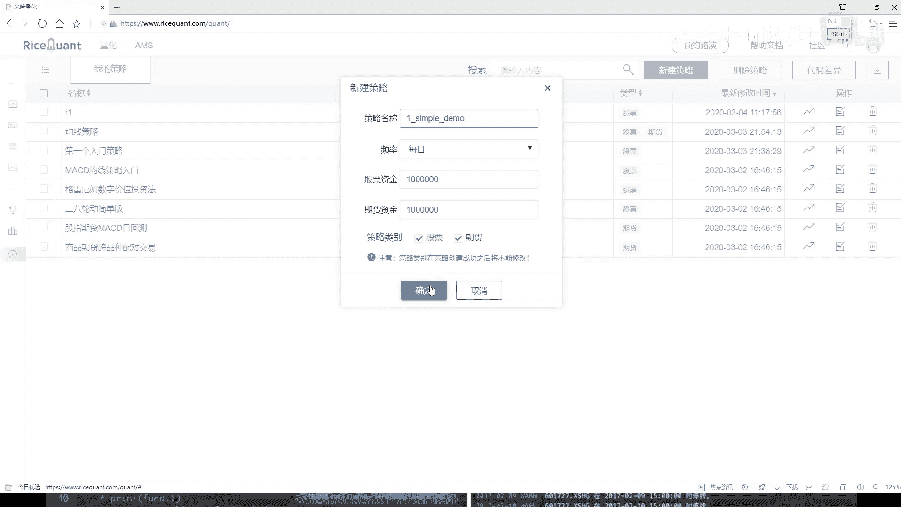

# P24：1-策略任务分析 - 人工智能博士 - BV1aP411z7sz

这节课咱们就给大家演示一下怎么样用这个交易平台做一个简单小策略，并且呢把这些API让大家先都给它熟悉起来，首先第一步你看这块它有一个新建策略咱们点一下，新建策略当中你去写一个名字。

比如说这是咱们第一个例子它是一个Simple，然后它是一个简单的小例子Simple Demo就可以了，然后我们对股票玩就行，好了点完确定之后这块它会弹出来一个可编译的界面。

就是咱们写代码都在这里来去写了，之前是给大家说了有几个模块，我们的注入化模块然后before trading，然后还有handlebar模块这些都是需要咱们自己来完成的吧，这是咱们一会要做的工作。

然后这样我先给大家说一下我们的一个任务的需求，然后呢基于我们这个需求咱们来做，我说这样咱现在要做这样一个策略，我说现在有好多股票比如说这个沪深300当中吧。

咱们拿这个举例子在这个沪深300当中那你说这么多股票，我可能一个个去研究吗？好像不太可能吧，那我说这样吧在这个股票池当中啊，哎呀这里边300个那对我来说太多了，我说我这样我说我能不能啊。

在每次我想交易的过程当中比如说这300个，选择什么我说每次啊或者说每一天我都看一看，或者每个月我都看一看，有哪十只股票是表现的更好的，然后呢我买进这十只股票可不可以啊，像这样一件事啊就是我的手里。

哎始终比如说这是我这个手里吧，我手里啊始终就保持哎我就有十张就就咱们十个股票吧，但是这十个股票那可能是每天发生变化的，因为股票可能今天这个股票我看的走势挺好的。

我买了然后这个股票呢我看通过他的其他指标观察，哎呀他喜欢不好那我就卖掉行可以吧，也就是说现在我的手里我这个任务哎就是说，始终咱就保证有这么十只股票行吧，那大家来想一想哎那你说这个任务我该怎么去做呀。

那是不是得哎我一开始我先把这个300个股票池给他获取到，然后呢接下来哎我说在这300个股票当中，我说我做一些判断吧，查询一下这300个股票当中，比如说啊在一会会用到哪些特征。

一些财务方面特征啊经营面特征啊，或者是一些哎或者更多的吧其他方面特征，咱们可能一会只选择某一个啊，咱不举那么太多的例子，那选择一个特征我看这个特征啊，比如说我说看一下吧，当前每股票然后他的一些财务数据。

财务数据当中呢比如说有一个盈利吧，我说这300个股票每一个的盈利我都拿出来，然后说按照道具来去排看看哪些盈利最多的，然后我只买盈利最多的那前十个可以吧，那你想随着咱这个每天这个变化啊。

这300只股票他的一个盈利情况是不是也在变化呀，那我每一次哎我是不是都需要去，把他的盈利数据拿出来，然后对盈利数据做什么做一个排序，看谁排前十个了，排前十个股票我拿到手，然后我去去买这前十个呀。

是要做这样一件事啊，好了这是咱们基本的一个目标啊，那你想有这个基本目标之后，那我们实际做该怎么做呀，在这里这是哎咱们就在这里写吧，我就随便先给大家说一说，第一个就是我们的一个构造函数。

在这个或者出转函数，在出转函数当中我们要做这样一件事，比如说现在，或者说呀咱们你看这里啊，他这个咱们就拿他这个例子来说啊，他默认会给你生成一个就是简单的小例子，咱们一会要去改挺个东西啊。

那你看啊这里哎人家选的是某一个股票，那可能我们不是要去做的，我们要选什么，咱们现在在这个指数当中，把这个沪深300全拿到手吧，这是咱们第一步啊，在这个构造函数当中，我们要把这个沪深300全拿到手。

哎这有300只股票了，然后呢接下来，有这股票值之后啊，你看这块有一个before trading，就是在我们做交易之前，在我们做交易之前要干什么呢，那咱们刚才说的，哎你是不是得把这300只股票。

他所有的一些财务数据想拿到手啊，这里哎我说我们就要去干什么，拿他的一个啊，我们的一个财务的一些数据吧，那可能指标太多了啊，这些哎这里就是300股票，然后这里我要看他的一个财务数据。

然后呢我说再做一个排序吧，排序那就是一个order是吧，然后呢我说再只取这么10个行吧，这是我们的一个任务，这些任务都在哪去做的，都不是我们实际的一个交易吧，所以说啊，所有的哎就是但凡跟实际的一个交易。

是不挂钩的，就是每天都需要去做的一些查询啊，处理的操作啊，咱全放到啊这个before trading当中，我们来去执行，那这里啊咱们再来想一想，我现在执行完了这个before trading之后。

我是不是手里有什么了，哎我就知道了，你看这个函数，咱之前讲的时候，是不是说他每天都会执行啊，那我是不是都有每天的什么呀，我们最终可能就要这样一个值，每天的10个数据，或者说每天10个股票。

他的一个呃代码是不是就行了，我只需要这个东西吧，好了接下来，在这个handlebar当中啊，就是我实际哎要去做些事情了，这里要干什么，咱再想一想这块，我是不是得先去做一些逻辑的判断啊，比如说现在。

呃咱们有处理资金，比如说有10万块钱吧，处理资金是10万块钱，然后我说呢，在这个10万块钱当中啊，我第一步我是不是先看一看，我手里有什么东西，我手里有哪些股票，并且呢，我这些股票是不是什么，比如这里。

咱们现在这个10个股票都是时时进行更新的吧，那每一天我都要判断一下，当前我手里这个股票，这10个股票啊，比如当前我手里拿到这10个股票吧，跟之前哎，不是跟咱们刚才判断的哎，最好那10个是不是一样的吧。

如果是一样呢，是一样的，我就接着持有呗，那不是呢，不是的情况下，我就给他卖掉，然后再买什么，再买新的新的什么新的最好的，这10个当中我还没有的吧，所以说啊，在这个handlebar当中啊。

我们要做一些呃业务的处理了啊，在这块我们要先去哎，判断一下当前，我们有哪些个股票，然后呢，有的跟财务，刚才咱们经常玩那个好的结果是一样的，我就继续去买，然后不是一样的，我就给他卖掉，是不是行了啊。

这个就是在咱们这个handlebar当中，我们要去做的一件事，先大家就是从整体上啊，我们概述了一下咱们要干的一件事啊，其实说的挺复杂啊，但是看起来挺简单的，就是会论在百当中，我去始终选10个最好的。

然后我让我手里有的一直都是这10个最好的，我看一看，我说我设计这样一个策略啊，比如出那个70资金，我给你10万块钱，看你经过了比如一年吧，你咱们能赚多少钱啊，我们要做这样一件事方法啊。

就是听起来挺简单的吧，行，然后来看一下咱们该怎么样去做这样一个事。

