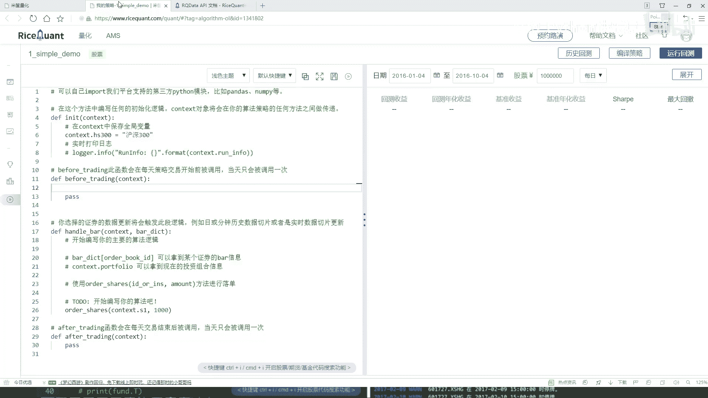

# P25：2-股票池筛选 - 人工智能博士 - BV1aP411z7sz

然后这里就是这个日期，咱后续都能调，在这块刚开始咱们就不调了，就是你的一个七日资金，然后一个，咱就按这个每日每分钟就不说了，这些咱后续都能调，我就不管了，咱们先来写这个代码，好，首先第一步，在什么。

在我们的一个勾搭函数当中，我们要写什么呢，我说我现在不是这个S1了，再要什么，这个互认300是不是，互认300，直接用名字来写行，你用代码写也行，把互认300给它写进来，这个是我们当前要的一个池子。

好了，然后这打印信息我不需要了，在这个池子当中，接下来我们来写这个预处理，写这个预处理，就是咱们刚才说了，要获取他每天的一些财务的数据，这些东西怎么去做，来看这里，这有个帮助文档，大家用的时候。

把帮助文档全打开，所有咱们，不是这个，所有咱们的一些指标，都在那，都是在这些帮助文档当中，咱来去看的，其实说白了，所有你要获取的一些结果，不是我列的，也不是谁说的，都是在这个文档当中。

人家会给你详细的去写，咱们怎么样去查询，怎么样得到结果，来看，我们去刚才说什么，刚才是不是说，咱们要去查询一些指标，比如好比说，你要查询一些什么，你看这里有好多，查询什么财务数据，各种各样指标都有。

所以我说这像什么，咱最开始就说了，电话交易这个东西，说白了，就是一个数据挖掘，里边涉及到的数据太多了，各个指标都有，是不是，所以说能做的事还蛮多的，咱们今天这个小例子，就给大家举一个例子。

咱们不用太多指标，咱直接看这个，就是查询一下，它的一个财务数据，然后大家用的时候，一定这样，就是你先读一读，人家这个东西，它是怎么样去写的，你看这一块，他说了，当前已经在这个海洋当中，你得第一个参数。

给我传进来快轨，就是一个查询，查询什么意思，就在这块，他说了，他说快轨当中，你可以去填写，你要查询的指标，并且可以用filter，去过滤一些条件，跟咱们的需求来说，是不是挺像的，所以这样，我直接把函数。

直接复制过来，复制到咱们这个测试当中，我在这里首先第一步，我说我要去做一个查询，然后后面这个东西，咱先把这个东西都去掉，先写这个query，query这个什么，现在你要查询哪些个东西了，好了，快轨当中。

我说写一下，在我们单一快轨当中，我要去查了，查什么，我刚才说了，查我的一个财务的，他的一个收入情况，比如说我现在想看财务的收入，情况，怎么看，在这里我们来点一下，点开看一下。

这里还有他的一些具体财务的文档，就是点开之后，他会告诉你，咱们的数据当中，你都有哪些个字段可选，这个就不给大家一个去看了，但是大家想看各种各样字段，然后比如技术财务数据当中，我们可能要的，就是。

他的一个营业的总收入，咱们用这个指标，加指标，咱们就暂时不看了，这里咱们来直接写一下，好了，在我们的查询当中，首先第一个，要查他的一下，查他的一个，基础的一个营收的指标，然后找一下，就是在这里。

他的一个营收的指标，好了，这里营收的指标，我们来想一想，就是对于他的一个营收指标，现在好比说我查到手了，查完之后干什么，查完之后还没完，咱该说什么，是不是说我要去过滤一下，过滤什么。

首先你现在去查的东西，好像有点多是吧，你要查的东西，你告诉我了，查谁的，你说还没指定，好了，咱们这块指定一下，你在哪些个股票当中，执行这样一个查的操作，所以说这里我要写一个filter。

filter当中相当于，你自己要去做一些判断了，好了，首先我们来判断一下，就是当前我们查的这个东西，挖他给他复制过来，当前我们要查的结果，他怎么样，是不是在我们的一个股票市场当中，好了，对他做一个判断。

那就是说现在我们找到了，然后以及再找到他的一个代码，我看看应该是一个扣代码，看一下他的扣代码是否是在，应该是一个印，我看看，应该是一个印就可以了，然后，对就这个印，印就可以了，然后看一下他的一个。

股票代码，是不是在我们的一个股票市场当中，股票市场，咱刚才是不是已经设定好了，就是一个互联三百是吧，好了，直接的复制过来，这就行了，然后现在我们做了一个判断，判断完之后，我们要干什么。

现在只是做了一个判断，我说接下来，我们还要干什么，做一个排序，可能判断完之后，我们现在拿到多少个，300个，300个不如想要的，我要做一个order，我看一下，order一下排个序，不是order。

我看这个名字好像变了，应该是一个order by，order by一下，order by什么，你是不是得告诉我，现在你是按照一个声序，还是按照一个降序，来玩这个东西，好了，我说现在按照这个东西，按照谁。

按照这个就是它的一个营收，然后按照营收的一个降序，咱是选什么，选最好的，所以说此时我说给它指定成一个，降序，是不是可以，现在order by做完了，还差什么，我说这里降序完之后，可能有这么多。

你不一定全用，好了，我说咱们来限制一下，limit一下，我们选多少个，你选10个，是不是可以，相当于在这里，我说只选10个，我最想要的一个股票，是不是就完事了，这个给大家看了一下。

就是我们第一步先写了一下，在before trading之前，我们先做了一个，基本的一个筛选，并且给它排序好了，拿到了10个我想要的，这里咱给它起个名字，就叫做它这个dataframe，因为它返回时。

也是给我一个dataframe，然后把这个东西加入到context当中，一会咱还要再去用的，行了，这里这样，我先给大家打印一下，看一看它能不能把当前，我们这个结果给它做出来，print一下。

然后其他的咱们暂时先不用，不用的我暂时给它先pass掉，然后运行一下，先看一看，能不能把这个结果给我打印出来，这个打印出来的结果，应该就是每一天，它会都去打印，因为你看before trading。

这个东西，它是每一天都要执行，这样一个操作，所以说这块有点小问题，它怎么没有打印出来，来看一看，打印日志当中，它都是打印个空的，我再往下拉一拉，看是不是都是空的，都是空的，没有打印出来，行。

咱们检查一下，函数当中没有什么问题，首先第一步，我们把函数写出来了，然后写了一个query当中，然后我说去查哪个指标，就查它的一个财务的营收的指标，没问题，然后指定个filter，filter当中。

我说我去判断一下，当前这个股票，是否是在我的一个互联300当中，然后如果说是，然后就是把互联300当中，所有股票都拿出来，然后接下来，我说做了一个排序，检查也没有什么小问题，打印为空的。

说明在互联300当中，应该没找到，这块，咱们刚才怎么想的，怎么样了，这块是不是写互联300不行，你是该指数当中去找，所以这块我们之前少写一个，index当中，我看一看，它的名字。

如果大家把它的一个名字忘了，没关系，你都可以在一篇文章当中，给它找到，你看，这是股票债券，然后找咱们找指数，这儿，把指数拿到手，然后给它复制过来，好了，这是在指数当中，然后写一下。

我这个名字就要互联300，这就行了，然后重新的咱们再来运行回测，看看这回的结果，这回没什么问题了，刚才我们的一个股票池子，没指定出来，这回咱们重新来看一下，看一下它是输出日志，你看这日志当中输久了。

第一天，然后从2010年1月4号，咱没改时间，这是默认时间，然后有哪个，你看第一次有这个，后几次，这个看起来，其实不是特别好看，它给出来这个结果是，这种情况就是，横着是一个股票的一个名字。

然后下面它是一个，就是每个股票它的一个指标。

跟我们的一个想法不太一样。