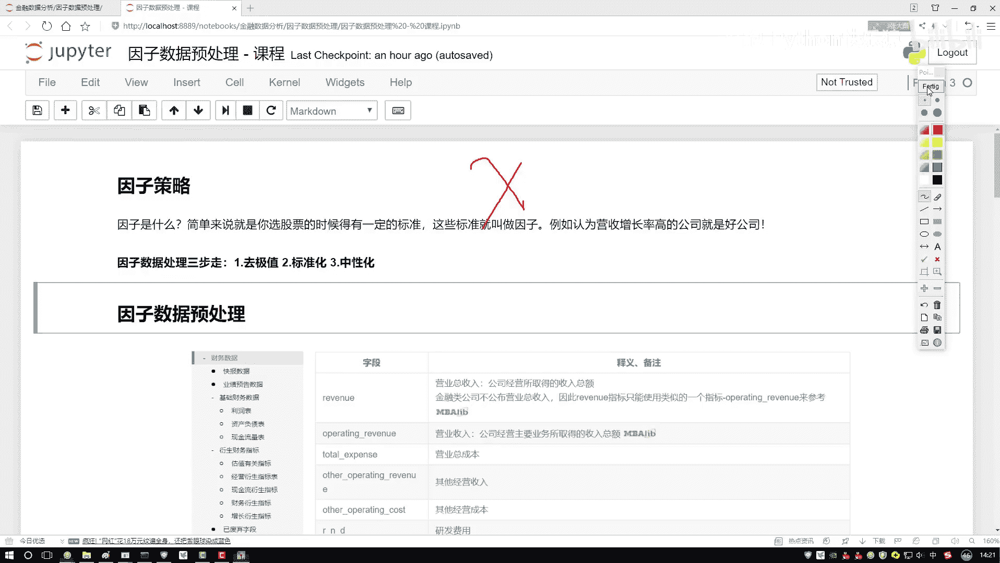

# P28：1-百分位去极值方法 - 人工智能博士 - BV1aP411z7sz

这节课咱们来说一说该怎么样对因子数据做预处理操作，好了第一个词来了，因子数据，什么叫做一个因子，好比这么说吧，我说你现在要去买股票了，在买股票过程当中，你肯定不是大摇捞真的，我随便买一个。

那你自己心里是有些想法的，按照我某种想法，按照我某个标准，我说我去选一选，筛一筛，符合我标准的，我买下来，是不是咱们经常有这样一个操作，好了，刚才我们提到一个词叫做一个标准。

这个标准就是我们现在所说的一个因子，比如现在这样，我说大家在买股票的时候，可能都知道一个常识，就是对于市净率来说，低的相对来说买起来比较合适，因为市净率低的指，它的一个涨幅空间，相对来说比较大。

对我来说我的收益可能也比较高，再比如说我说财务当中的信息也可以，比如说我现在这样，一个公司当中，如果说它的营收增长率比较高，那我认为这个公司，那可能是好公司，那我就买他们的股票，我可能去赚钱。

其实因子理解很简单，对于你最终结果，有影响的这些个指标，就是咱们要来今天讨论的这个因子，行因子咱们今天说到了，当我们拿到这个因子数据之后，该怎么样去处理这笔数据呢，给我们讲就像这样。

现在有一个要立个大方程，我说最终我的一个收益，可能是一个Y是吧，好了，那我说我现在因子，因子来说，比如说是我的输入，我说这因子有挺多，X1 X2 X3 X4，一堆是吧，我们现在要干什么。

好像是做一个数据挖掘问题，看一看每个因子，对最终结果有产生什么样的影响，我该怎么样，在这些个因子当中，去做一个选择，好了，这节课讲完之后，会给大家举个例子，就是，怎么在因子策略当中，选择我们合适的股票。

使得咱们收益能够更高一些，现在我们要做的事是这样，先想一想，因子数据，我们该怎么样去处理，比如这样，咱先不说多因子，咱就说咱现在一个，比如现在拿到一个因子之后，它是什么，它是一个数据，拿到数据之后。

咱直接的做一些建模吗，直接的拿出去去用吗，好像不一定，我们得对数据做一些预处理操作，好了，今天咱们主要来说一说，预处理操作当中，我们都有哪几个做法，这里列出来三个叫做第一步，你看这里我写了一个三步走。

第一步咱们就是去极值，第二步叫标准化，第三步叫做中性化，如果说大家以前对机器学习，还有数据挖掘比较熟悉的话，前两个是不是一打眼就明白了，去极值，有一些可能离群点，有一些异常点，我给它规范一点，标准化。

数据在各维度当中，可能它的一个数值，取值范围是不同的，比如说咱们的一些，有些指标取值范围是0~10的，有些指标取值范围是0~1万的，你看他们取值范围是不同，好像数值对结果有很大的一个差异。

咱尽可能让不同的数值，在相同的一个浮动范围区间，比如说都是-1~1，都是0~1，这个东西就叫做一个标准化，这两个都是数据挖掘当中，常见的一个概念，然后第三个叫中性化，可能这个词大家以前没用过。

因为一般数据挖掘任务当中，还用不到中性化这个东西，但是在我们的因子策略当中，咱得来说一说了，中性化它做了一件什么事，接下来咱们就这样，按照我们的三步走策略，先说极值怎么处理，再说怎么标准化。

最后来说中性化，咱们该怎么样去做，这个是我们讲的一个顺序，然后大家如果想看，有什么样的因子，在米矿平台当中，它有各种各样的指标，你就去扫一遍，所有的指标当中，字段多了去了，可能每一个字段。

都会对我结果产生影响，好了，今天一会咱们来分析失竞率，拿失竞率来举例子，因为这个相对来说会更直观一些，大家可能对它会更了解一些，第一步咱们跟之前一样，还是先导进来，我们所需要的这些工具包，工具包都没变。

然后这里能给大家先举例子，一会咱们再去平台上，我们自己写个策略，我现在这里把咱们的一些处理方法，以及咱们的一些知识点讲完了，咱们再去写策略，在这个诺波当中，我们先说知识点，一会咱们再来玩一个策略，好了。

读数据，这个数据大家很熟悉了，都已经不用我解释了，一会咱就拿苹果股价，当做一个举例子了，大家可能说苹果股价，它也不是一个因子，拿它举例子可以吗，因为这样，我现在不是在本地去写的，没有连人家平台。

所以说获取数据稍微麻烦一些，一会咱在平台当中，咱们去获取实际你要做的，比如说一些市净率，市值这些指标，在这里咱们就随便拿一个数值，给大家举例子，主要讲一讲咱们的这些操作，该怎么去做。

一会咱们拿实际因子去做，好了，第一步就是集值的一个处理，集值处理方法其实有蛮多的，我们大家最常见一件事，你说现在一个数据当中，比如这是一个数据，绝大多数的数据点，可能都浮动在中间范围当中了，是不是。

有少部分怎么样，你看有个黑点，在这里，有两个集值，左边右边，你说对集值怎么办，大家可能第一个想法，可能离群点我就不要了，这些数据我就全扔了，好，是一种想法，或者说咱们扔了稍微可惜，我们能不能给它劝一劝。

让它迷途知返一点，我说哥们在这，我说你劝一劝，我告诉你，我说你越界了，然后哥们问我说你界在哪，我给他画了一下，我说我界在这，比如这个值它是一个-10，然后的界线是一个-5，我说行，咱界线是-5。

我把它拉回来，当前这个数值它越界了，我不给它丢掉，我把它的数值改成什么，改成我的一个下界，还有上界当中，自己指定，可以自己指定一个上界和下界，把-10改成-5，它是不是就没越界了。

相当于我们要做这样一件事，不是直接去删除了，而是把它，大于我界线的给它拉回来，让它成为我的临界点的一个数值，这就行了，这个是咱们的一个做法，不是给它丢了，怎么去做，给大家说几种，先来说第一个叫分位数。

分位数这个东西，其实挺直接的，先说一下分位数，如果大家不太了解，中位数总了解吧，大家可能说，你说中位数，为什么不说均值，因为均值这个东西怎么样，均值这个东西不好用，尤其是在我们的数据挖掘任务当中。

你说当你去，填充一些缺失值的时候，经常用什么，中位数而不用均值，有什么问题，咱们我前几天看，好长时间好几个月前，我看腾讯，然后他们微博说，腾讯员工月工资达到了7万多，大家想这工资。

怎么可能月工资达到7万多，后来大家一看，是把这些高管的工资，把这些人上层的，人家股东的工资，可能都算进去了，一算个平均，可能是7万多，但是你说平均，它有代表性吗，好像没有什么代表性。

因为里边它的一个分布，可能有一些头重脚轻，这样有感觉是吧，行了，这是一个均值，然后说完均值之后，咱来说中位数，你说中位数怎么样，中间那个是怎么样，我用中间去看一看整体，感觉是不是更靠谱一些。

所以说咱们来看一下，我们的一个分位数，分位数就是这样，这里你可以把整个的数据，分成几个位置，你看这里中位数，咱刚才说过了，中位数挺好解释的，就是中间那个位置，它的一个值，7个人来说，7个人中间位置是谁。

这是123，这是456，中间谁，这是不是中间这块是567，中间谁，中间就是4，如果说这块8个数，8个数中间是4和5，你可以4和5加一起，除以个2，是不是就行了，这个就是我们的一个中位数，然后你看这里。

我们不光列了一个中位数，还列什么，四分位，两个四分位，相当于Q1和Q3，你就当做这块是1/4的，这块是一半的，1/2的，这块是1/3的，是不是就可以了，这个咱们现在列了一下，我们的一个分位数当中。

有三个指标，Q1 Q2 Q3，他们都表示在我整个数据当中哪个部分。

