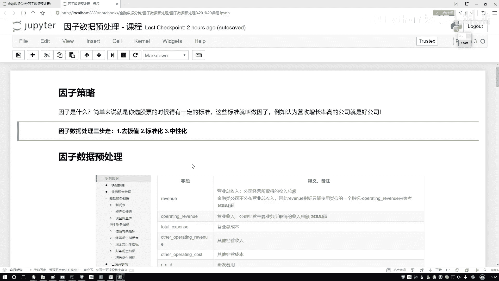

# P32：5-标准化处理方法 - 人工智能博士 - BV1aP411z7sz

接下来咱们来说这个标准化的操作，其实标准化方法和原理也都是非常简单的，咱们先来看这个图，我给大家解释解释，在标准化当中咱们完成了一件什么事，这张图，对就这张图就行了，我们来看一下吧，这里有这样一件事。

那好比说我现在有一个数据，这个数据当中有不同的一些指标，你看这里我画了一个X轴，还有一个Y轴，这一块我说是一个X轴，然后我说这一块它是一个Y轴，我们的数据，那好这样一件事，别说XY了。

就说一个X1 X2吧，我这X1这X2，那大家来看，你说这个X1和X2取值范围一样吗，取值范围是一样吗，感觉来说肯定不是吧，X1它的取值范围稍大一点吧，它能从这里取到一个这里吧，但是你再看X2呢。

它是从这儿取到一个这儿的，感觉什么，我们的取值范围可能不同吧，所以说做标准化，我们有这样一个出发点，为了使得我们的一些因子吧，或者说为了使得咱们一些指标，在各个维度上取值范围尽可能相同。

我用同样的眼光去观察它们，别在数值层面上产生一些差异，对结果造成一些影响吧，所以我们要做这个标准化，标准化怎么做呢，我先给大家写下公式，公式就是一个X，减去一个μ，比上我当前的。

这什么比上一个标准X就行了，大家可能会问这个公式什么意思，给大家解释解释是这样，你看我们的数据，一开始的数据，肯定不是以原点为中心对称的吧，如果咱们执行一个去均值操作，能够使得我们数据怎么样。

你看这块写了，以0为中心进行对称吧，好了，这个是我们把标准化公式分解完了，第一步叫做一个去均值，目的是让我们数据，在各个维度上，都是以0为中心，有这样一个对称的，好了，这是一个对称。

但是你看对称完之后还没完，我的两个坐标轴，它的取值范围怎么样了，还是不一样，我去了一个均值，只能它以0为原点做对称，但是没有改变，各个维度取值范围不同，这样一个问题，那咋办，我们再来一件事。

你说取值范围大的数据，什么叫取值范围大，我说这样，我说列两个小组，列两个小组，我说这是第一组，然后这是第二组，对于第一组来说，第一组来说，有些人就是我，就是我说我去写我，我然后还有我的一个同学A。

还有我的一个同学B，还有我的一个同学C，那感觉都是我同学，你说以后咱们几个工资来说，你说我们差异性会很大吗，就不会很大，好了，你说差异性不会很大，前提下，我们算它的一个标准差，或者说咱说算方差。

方差或者标准差，会比较大，还是比较小，会比较小，就是说这样一件事，我们的取值范围都比较小，都是一两万左右的，大于这样一个数值，所以说我们算出来一个标准差，也会比较小，如果是第二组，第二组还有我。

然后我说不是我ABC三个同学了，我说有几个比较牛的人，我说把马云，还有把马化腾，他们几个都放一起，你说把我们仨放一起，大家可能觉得把我放有点多余，是不是，如果说把我们仨放一起了，我这可能是个1万的。

然后这是个2000亿的，这是个2000亿的，然后这个东西它是个3000亿的，你说我们现在在一起，什么会比较大，我们的标准差怎么样，会非常大，因为我们的数值取值范围，从1万到300亿，这里取值范围。

可能只是从1万到2万，我是1万，只有2万的，其他都在中间，可以吧，咱们来看这样一件事，取值范围小的，如果说我除上一个小的标准差，可以吧，取值范围大的，我要除上一个什么，大的标准差，什么意思。

取值范围本来就大了，再除上一个比较大的标准差，能让它的取值范围，稍微小一点，取值范围本来比较小的，再除了小的标准差，是不是这样，指的我们近似的一个取值范围，能怎么样，做一个近似，你看这里我做这样一件事。

去完均值之后，各个维度，注意点各个维度，X1这个维度，X2这个维度，分别计算它的标准差，然后做一个除标准差的操作，这样使得我们的数据，计算完之后怎么样了，你看它的取值范围，就近乎的相同了。

这样有这样一个事，叫做一个我们的标准化，标准化在数据挖掘，或者是一些集取问题当中，咱用的是非常多的，基本上拿到一个数据来了，你都什么都不用想，你都可以去执行，这样一个标准化的操作，写一下。

写一下我们的一个，标准化的一个操作，标准化的操作，然后对于我的一个Ceres传进去，这里也不用什么参数了，首先要计算两个值什么，图当中给你画出来了，一个mean一个std，来写一下，这里不用写了。

咱之前上一门是不是有，这把复制过来得了，一样的，也是需要一个均值和一个，标准差，然后我说对我的一个数据怎么样，对我的数据，做一个去均值，那就是减return一下，return这里，然后减去一个均值。

再比上谁，再比上当前这个std数据完事了，代码数非常简单，咱就可以去做，其实今天就是给大家，说这种方法，大家可能觉得，这些方法，有没有一些直接的函数，一行都帮我调用，其实也有，这个当中有一些工具包。

像是sklearn当中，一些机器学习工具包里边，它都会有一些数据预处理模块，数据预处理模块当中，你直接把人家API调进来，一行代码也能解决，如果大家想sklearn去做，你就是上sklearn官网。

然后你在API当中搜一下，搜一下standard这个东西，它就有一行代码，能帮你去完成这样一个事，行咱写完了，写完之后，这个不给大家画图了，这个也画不出来什么图，咱们来试一试，对于我们当前的data。

我先看原始数据，这是原始数据，你看有30多的，20多的，100多的，范围，取值范围比较大的，好了，然后我们再来看一下，做完咱们这个数据操作之后的，那就是把它传进来，然后我看下这个结果，你看怎么样。

都是变成了数值取值范围，相对在较小的一个区间当中的，一个数值了吧，这个就是一个标准化的操作，方法还是挺简单的，就是确均值，在笔上标准叉，让数据第一点以0为中心做对称，第二点使得我们数据。

各个维度取值范围，都在一个较小的区间当中。

这是标准化。