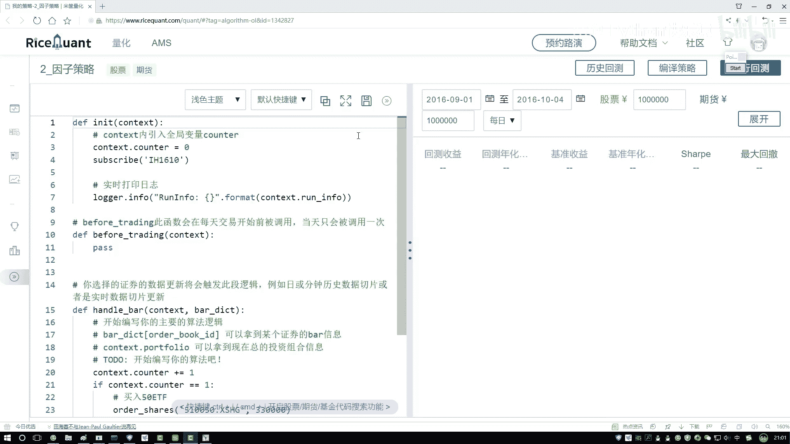

# P35：1-股票数据获取 - 人工智能博士 - BV1aP411z7sz

接下来我们就来看一下刚才咱们说的一个因子选股的策略，先把我们的一个因子拿过来做一些预处理，我要去积值，我还要去做标准化，还有中性化操作，做完这些基本操作之后，咱们来看一看，基于因子，我设计个策略。

比如说像他们说的，因子当中选择某些指标，然后我们来衡量一下哪些股票好，这样在股票时当中，咱把这批数据，咱把这批股票拿过来，我去买，然后我们的因子会随着时间的变化，每天都会发生变化吧，其实像是这样一件事。

我过一段时间，我要做一个调仓，就是说，股票时当中可能就是我买这么10只或者买20只，但是一定得是符合我的一个因子选股策略的吧，咱们就要来完成这样一个任务，好了，咱们来看一下怎么去写，第一步。

在这里我是新建了一个我们的文件，叫做2-因子策略，在这里一开始它有些注入信息都删掉了，没什么用，咱们把我们一会儿会用到的一些工具包先导进来，在这里它也是支持你的一些额外的工具包，像是咱们常用的。

这个NanPi，Pandas，这些东西都是只能导进来的，然后第二个就是一个Pandas，然后S一个PD，接下来还有一个，还有一个就是，一会儿我们肯定要做一个回忆方程吧，因为当我们在做这个中性化的时候。

你要求解一个回忆方程，所以说咱们得把回忆方程这个东西导进来，有两个可选的工具包，一个叫SKlearn，非常经典的一个Python集训工具包，还有一个就是统计分析当中也会比较常用的。

叫State Models，对比一下，还是觉得State Models用起来更简单一点，基本上咱们两行代码就能把这个事做出来，所以这里咱们把State Models给它导进来。

在咱们当前的模式当中我们导入一下，其实只需要导入它的一个回归模块就可以了，其他的咱们暂时还用不上，这个是我们要用的几个工具包，一会儿看看吧，一会儿看看咱们还能不能用上其他的，用什么咱们现导也行。

然后咱们就按照这个顺序一步来举起吧，首先第一步，咱们的一个初始化模块，在这个初始化模块当中我们要设计，设计什么，一会儿我们要肯定要做的一件事，大家想一想，你看一会儿我会选择一个时间。

比如说这个时间我改一改，从2016年的1月1号，到这么2017年的一个1月1号吧，咱们就这么一年时间，一会儿咱们是这样，我说现在我去选了一个策略，然后在这个策略当中我选了一个股票，咱们有大池子。

在这个池子当中可能我每个月都要做一个调仓，每个月我都要选一选，看哪些不符合我策略了，我给它卖掉，哪些符合我策略，我给它买进来，是不是这样一件事啊，那这个就是当我们设计的时候咱们得想好，你是按月来执行呢。

还是按天来执行啊，按天你说是不是有点太平反了，没必要吧，一般情况下咱们还是按月来执行，所以说这里，在我们这个圈内当中咱们得写一下，因为我们的定时器需要写到我们的一个构造函数当中，咱写一下。

咱们之前是不是说过有一个模式叫什么，叫做一个，就是这个，我们这个定时器吧，指定好咱们的定时器，定时器当中你可以去指定，你看我这块点软，它是不是出来了，你是按天呢，还是按月呢，还是按这个周呢。

咱们按月是不行了，好了，我们指定一个按月，指定按月的时候，然后你需要去指定，交易日不管了，然后你需要去指定一个值，就是按月啊，你在做的过程当中，咱们该怎么样去调吧，好了，那我们写一下吧。

咱们写一个rebalance，一会儿呢，我们要定义这样一个函数啊，相当于在这个函数当中，我们就去执行一下，实际咱们的一个池子该怎么去选，这样一件事，好了，然后把这个复制一下，名字稍微改一下就行，在这里。

名字我也复制过来，rebalance，这里啊，咱们来想一想，我们都要做什么，是不是说一开始的时候，哎呀，我得去看一下，不是一开始的时候，我得去先找一批股票出来，然后在这些股票当中我去选哪个是我要的。

哪个是我不要的吧，我们有这样一件事吧，那这个，咱们该怎么去做啊，是不是说第一步，我先得把咱们的所有的股票数据，哎，我说都得给它读进来，然后呢，接下来，咱们在这池子当中一个去选吧。

先把我们的数据给它读进来，数据读啊，其实有很多种方法，这里咱们就暂时先选所有的一个股票数据了，你看，它这API，咱们点进去啊，点进去的时候，不用点进去，就是你鼠标放到这的时候，它就会给你解释啊。

当前你用的函数它是什么意思，它说这样啊，往上一点，它说了，现在呢，我们要去，哦，这个，这个，再往下点吧，要看不清，好了，它说啊，现在，哎，你要获得某个国家市场啊，然后一些所有科学信息了，在这里。

我们就玩股票就行了，所以说，一会儿我们会传进一个type值，等于CS，咱们找到这批股票，找到所有的股票啊，咱们现在写一下，在这里呢，咱们该说了，看到有一个参数，type叫什么，叫做一个CS吧，好了。

我把这个CS传进去，这样，它会把我的一个股票给拿到手，拿出股票之后啊，然后，我们还得对股票做什么，其实一会儿啊，咱还得对股票做一个操，就是做一个过滤的事儿吧，因为这些现在是所有的，咱一会儿呢。

可能不会用到这么多个股票啊，一会儿我们可能只会用其中一部分，所以这里，我们把这些股票的ID怎么样，把这些股票的ID啊，我要做一个筛选了，看看有些怎么样，它是不符合的，那我们在前面它得写。

我得写一个筛选的函数。

