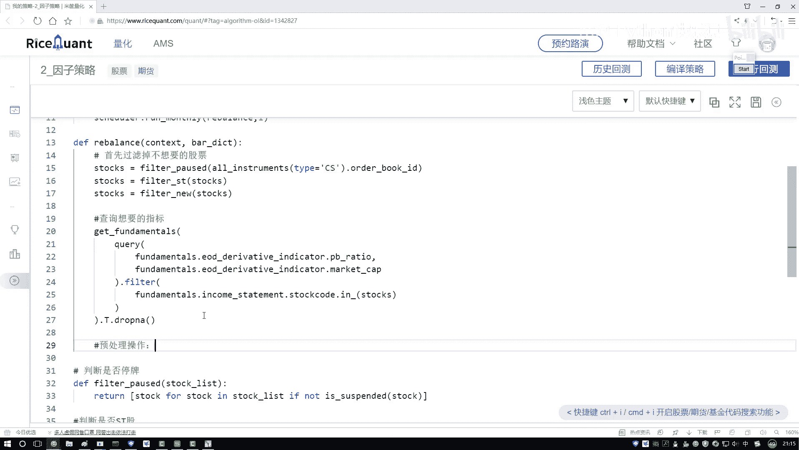

# P37：3-因子数据预处理 - 人工智能博士 - BV1aP411z7sz

然后接下来，指标查询完了之后，那师父说我们得做这个预处理操作了，预处理操作，在这个预处理操作当中啊，咱是不是，就是之前给大家说了，咱们三步走，第一步要去极值，第二步标准化，第三步中性化。

好了咱们写完第一步，我们要做一个去极值，去极值方案挺多，咱们简单点就用这个3Sigma，这个比较好用，然后呢第二步，第二步啊我说我要做一个什么，做一个标准化，就是一个standard。

做一个standard的操作，然后呢第三步，第三步咱们说要做一个中性化的一个操作，咱们写下，完成我们当前的一个中性化的操作，行了，就这三步就可以了，这里这样吧，咱们先把三个函数我们写完。

然后呢写完三个函数之后啊，咱们再来去在这里直接去调啊，相当于离群值你要自己写函数，然后标准化自己写，然后中性化也自己写，不要麻烦，先写第一个，第一个就是一个去极值，咱们写一下filter，这是什么呢。

filter一个3Sigma就行了，在这里咱们来想一想我传入是什么，那是不是传入一个指标啊，然后呢咱之前说了是不是一个3Sigma，n等于什么，n等于3吧，好了接下来咱们写第一步，在3Sigma当中。

你是不是得说我得算出来均值和标准差啊，好了写一下啊我们的一个均值和标准差，在这里我们的一个均值，比较简单，跟咱们之前写的都是一模一样的，在这里就是一个。min，然后std就是他的一个。std就行了。

接下来就是一个max，还有这样一个min，咱们都分别指定一下，我的一个上限还有一个下限，range这也是一个range，等于什么就等于我当前的一个均值，然后加上或者是减去多少倍的一个，就是加上一个n倍。

这里就是3Sigma，3乘上我当前的一个std，所以行了，然后这一块下面都是一样的，只不过说他就是一个减号，咱就完事了，这样咱就完成了第一个，这还没完成还得return一个值。

return在你的安排当中，我得把这些值不是真正的去掉，而是把它做一个规范，在这里，series给它传进去，然后我们两个参数，两个界限再指定好，这就行，第一个界限，然后还有我们的第二个界限，好了。

这是一个我们的，写一下吧，这里这步操作，我们的一个去离群点吧，或者是去极值吧，去极值操作，好了，接下来我们再写，还有什么，接下来就是我们第二个，第二个当中要去做这样一个标准化，我们来写标准化操作，好了。

写一下，我们重新创建一个函数，在这个函数当中，咱们来写标准化操作，其实挺简单的，需要我们干什么，其实方法都是一样的，都是需要咱们去计算出来，standard，t-a-n-d。

都是需要我们去计算出来一些指标吧，好了，然后咱们一个standard，就叫standard得了，在这里我们来执行一下，标准化操作当中，咱们要做这样一件事，首先还是这两个值。

这样的值我都可以直接复制过来了，这样直接复制过来，然后我的一个参数也是直接复制过来，然后这块他直接return一个结果，return一下，咱的一个series，然后减去一个mini，然后在这。

再比上这样一个标准叉行，再比上一个std，这完事了，这是个标准化操作吧，好了，咱们也下一个，下一个咱之前是不是没写过，叫中性化操作，中性化是这样，我们在中性化当中，咱之前说了，我们要干什么，是不是。

我说要去做一个回归方程，在这个回归方程当中，我们都要干什么，是不是说第一步，我得把这个回归方程给他怎么样，给他求解出来吧，求解完出来之后，做一个natural得了，求解出来之后，我说咱们要用一个真实值。

减预测值，减完之后相当于，我这个因子，他自身应该自身的一个价值是等于多少，但是咱们来想一想，这里有需要几个参数，这里咱们需要几个参数，咱们之前是不是说了，我看下这个失竞率，跟我事实之间的关系。

那其实对于我们的一个失竞率来说，它是啥，它是我们的一个因子，就是我们的一个factor，然后我们要拿这个factor跟谁做对比，是不是跟刚才咱们拿出来的这个指标，我直接复制过来了，直接复制过来。

拿我们的失竞率，给我们这个市值做一些事了，好了，把它拿过来，在这里咱们说一下，就是谁是x谁是y，y是谁，其实这里不用写y，咱们直接用这个参数写，但是让大家看的更明显一点，再强调一遍，y是谁。

试试看我的一个市值，对这个factor影响有多大，那谁是y，y就是我这个因，就是咱们这个因子，好了，y是因子，x呢，x是我当前的一个市值吧，这没问题吧，好了。

接下来咱们之前是不是导进来一个state models，这块咱们指定一下，这块我得把它的API再导进来一下，import一下，在这个state models当中，然后。API，然后一个smsm吧。

这里我们要用最小二乘法来做一个求解，所以说我得把这个state models拿到手，在这个state models当中，在这个models当中，咱们求解什么，线性回馈方程吧，说白了，往简单说。

我们要做一个最小二乘法，ORS，在这个ORS当中，我们要传递两个参数，第一个就是一个y值，第二个就是一个x值，咱们先写y，然后最后要求就是，得是一个flow类型，最好给它转成一个flow类型。

s type一下，s type成咱们的一个flow类型，然后这是一个y，然后接下来是x，x也是一样的，传进来我们的一个标签，还有我们的一个数据，这就行了，然后呢，它会把这个模型给我返回回来。

我写一个result吧，这就是我的模型，在我的模型当中，你说其实，哎，我想要的是谁啊，我想要return什么，是不是我要return，我的一个真实值，和我的一个预测值之间的一个差异啊，好了。

在这个state models当中啊，咱有个简单方法，你直接return什么，result当中，它有一个方法，叫做我们的一个残差，来找一下，哦，这个叫做我们的残差，但是不是这个，把dl去掉。

这样咱们现在返回什么，就是你去除掉了啊，在这个线回放的方式当中，你把这个wi+b给去掉了，相当于把咱们市值影响啊，它的一个因素去掉了，那这个factor相当于是比较纯的了。

咱现在就完成了一个提纯的操作啊，方法是不是比较简单啊，咱们用这个state models，它这个数据啊，直接帮我们自动的算一个差异值了，大家感兴趣，你可以自己上一期API版本当中看一下啊。

这个属性直接自动的帮你做了咱们的一个差异值。

