# P43：4-获取给定区间全部数据 - 人工智能博士 - BV1aP411z7sz

咱来写一写啊，是不是说现在哎你的一个日期，它是一个序列，然后你会查其中一天，那你会查其中一天，那每一天，那说白了咱写个复循环呗，For i in ranch，一下乱是什么。

咱们当前就看一看一共我是有多少天。

是不行了好了，你这个序列你不是有综合天吗，看你这个日期呢。

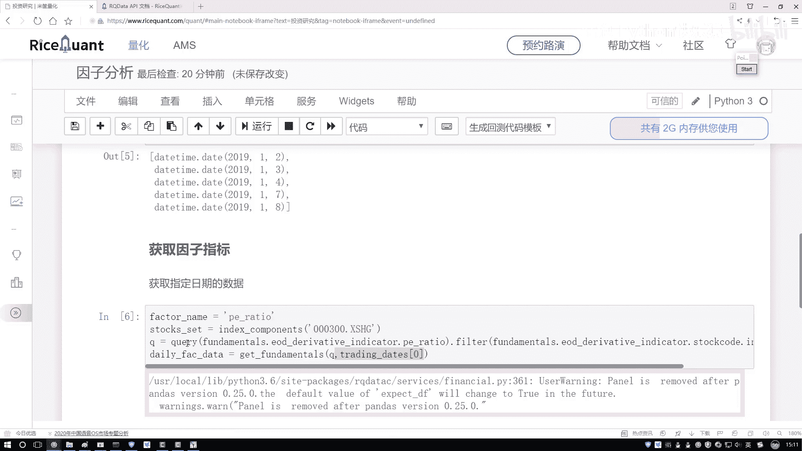

日期在上面看一下日期一共多长，那相当于是有多少天吧，便利其中呢我的每一天数据，然后呢对我每天说句好听，我都要干什么。

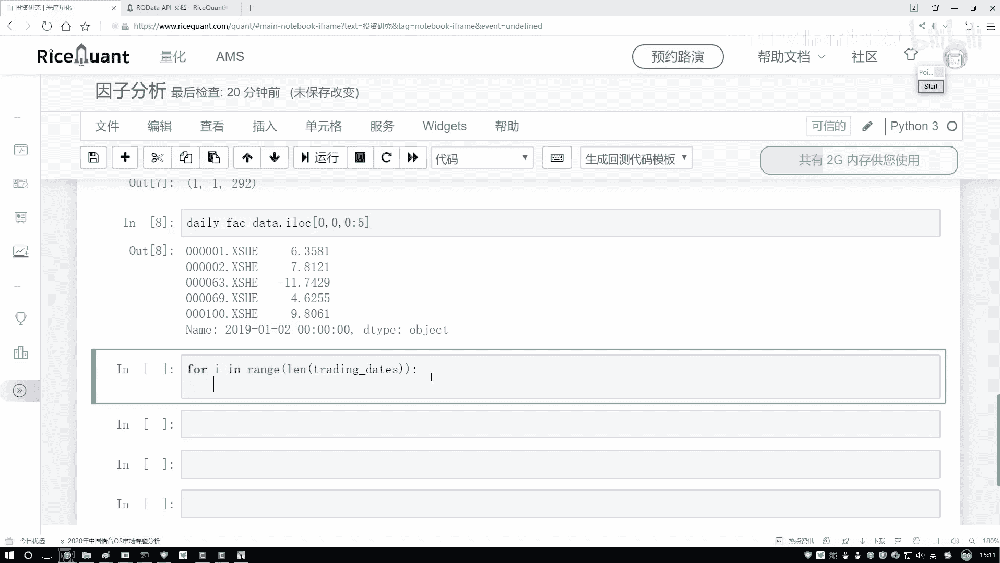

都要去获取一下当前它的一个值吧，好了，我这边直接复制就行，对于每一天数据我都要获取它的一个值哦。

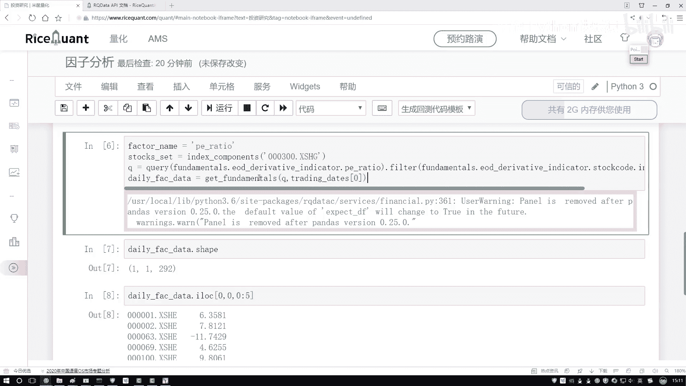

只不过这回这回这里边他就是不是传一个零了，而是传什么，应该不是啊，应该是传一个I是吧，或许他DIT实际的一个值，然后他对值来说，它返回的是一个三维的，我不需要还是IOC一下IOC当中啊。

第一个指标就是一个零二，然后第二个也是零二，然后第三个指标去全部啊，因为有用的全在第三个指标当中吧，刚才这个税不值，所以大家打印来看了，这样我就能取到当前诶，他的就是每一天他的一个数据了，那行了。

那取完每一天的数据之后，那我最后啊你不能只把每一天的告诉我，你是不是要做一个汇总啊，我希望你能这样，我做一个数据啊，是这样啊，第一个维度它是一个日期啊，代表它是哪一天，比2019年3月8号。

然后第二指标，第二指标可能是它的一个股票的一个名字是吧，然后第三个指标可能是它的一个实际指标值，一个value到底是等于多少，那我是不是说我得构建一个新的大点data frame。

然后呢我这里读完每一天数据之后，把每一天数据，把每一天数据拼接到哪啊，拼接到我当前组成的一个整体的一个data frame，当中吧，Fighters，然后呃fetters的一个data吧。

等一下呃新建一个data frame，一会儿呢咱拿这个data frame往里去传数据啊，我说先构建一个这个就是总的啊，就是一个总表吧啊然后这个就是一个每天的啊，每天的数据好了。

那现在我们已经有了一个每天数据。

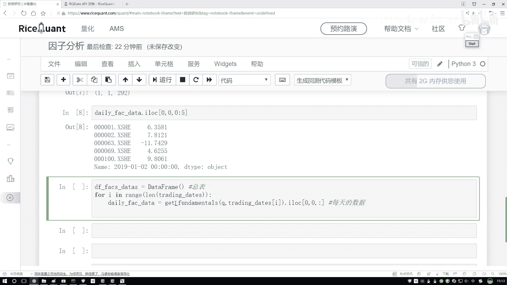

然后呢在这里我们先给他指定一个列名吧，在这里，我说我现在也是重新的去创建一个data frame，然后一会儿对data frame进行一个拼接操作好了，我说当前我的一个data啊。

等于一个新建一个data frame，新建一个framework，然后在我当前的当中。

我看一看当前pandas当中哦，panda当中我直接把导进来了吧。

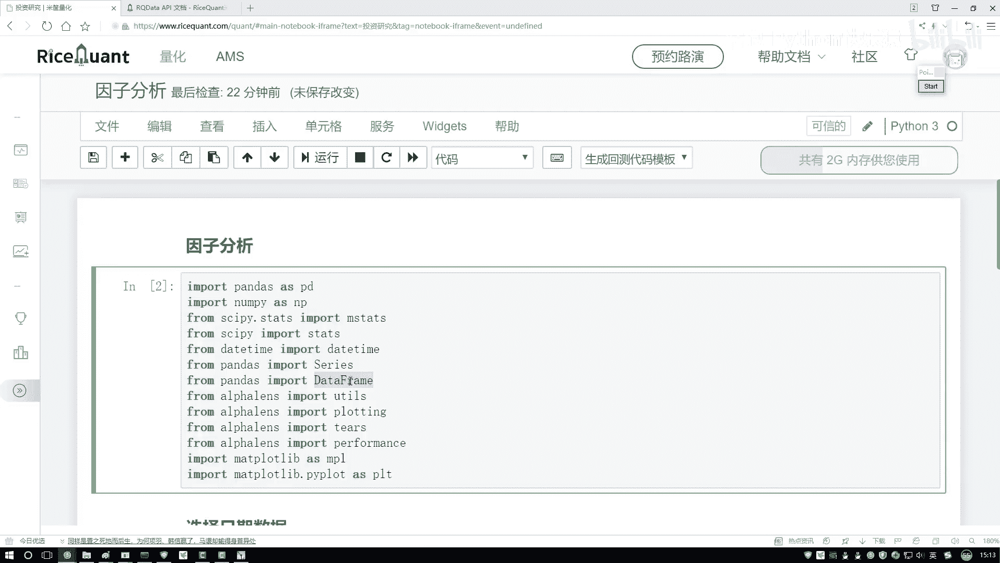

所以说在这里可以直接去用哦，再创建一个新的data frame，然后呢我就把实际它的一个值诶，给它传进去就行了，然后这个给它起个名字吧，它就是一个DFM了，不是这么一列数了啊行了，咱们现在有了一列值了。

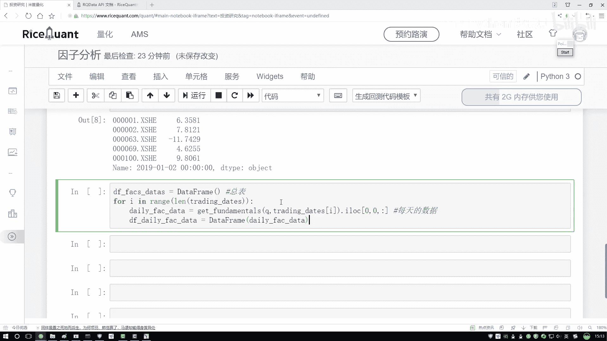

有一点纸还没完，还有什么，咱得给它起个名字，这个列啊，你得告诉我他叫什么名字是吧，咱们自己来起一个啊，呃起出名都行，我们来起一个等于啊它的一个名字传进去，它就是哎这个factor。

它的一个实际指标值等于多少吧，好了，这样我们现在创建data frame当中只有一列数据诶，我们还给它起了一列名字，那我们刚才说啊，就是在这个data frame当中啊，哎呀你不光丢个值。

你是不是还得有一些日期的一些信息啊，好了，我说这样你再新加一列吧，新加一列，我说指定名字就是一个日期，日期等于什么，在这里诶，你说我们现在有没有它是哪一天啊，是不是当前遍历到第二天了。

我把第二天数据加进去数就行了，这样我现在构建了一个哎，就是每一次选项当中，我都会构建一个data frame，这个data frame有两列，一列呢就是我的一个日期，一列就是它的一个value值啊。

咱们现在有了吧，好了，那我说我现在啊哎呀有了做的操作了，那我那我是不是该怎么样，把这些个数据做一个拼接操作。

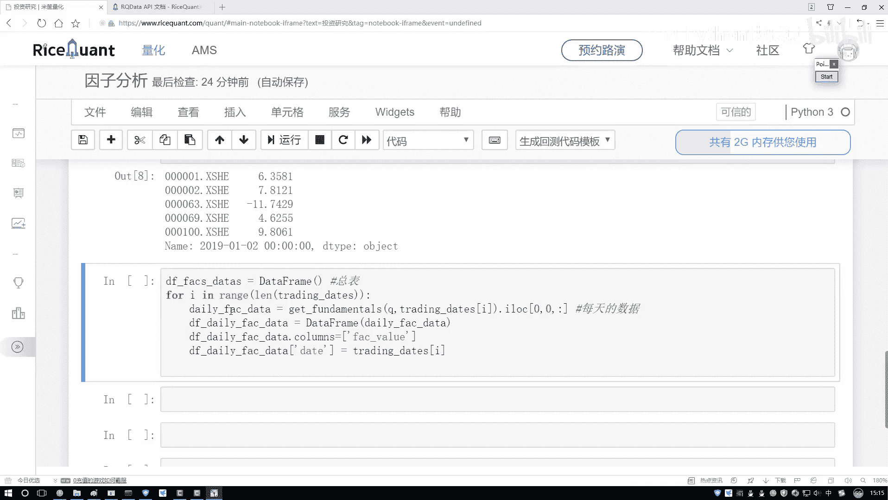

怎么拼接，你for循环每一次都得到一个新的data frame。

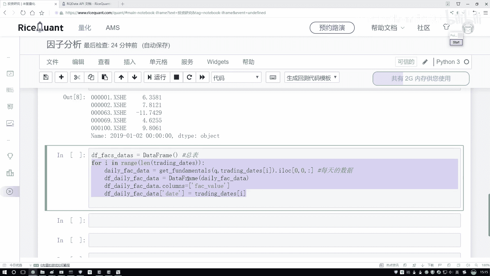

你是不是把每个data frame放到这个总表当中啊，最后我要的是什么，就是这样一个总表吧，好了再来执行拼接操作判断，第二慷慨一下呃，拼接拼接当中你需要传加参数，谁跟谁拼呢，好啦。

先把咱们呃最开始我说我构建的一个data啊，拼到我这个总表当中，把谁拼上去呢，咱刚才是不是自己哎，我构建了一个data framework，把咱们当下这个data framework给购进去。

我说拼接成啊，拼接到总表中吧行了，这就是执行一个拼接操作呃，我们先执行一下，看有没有什么问题啊，这一块的速度啊肯定会比较慢哦。

因为这里他是咱们先指定什么，我们是指定了一个呃，时间间隔是有这么一年吧，19年1月1号到这个20年1月1号。

时间间隔会比较久，所以说它的速度相对来说会比较慢啊，到时候大家自己玩的时候啊，要不就没有刷完就行了，没有后话了，大家自己玩的时候也不用了，也不用再改小了，一年的时间挺快的，很快就出来了，好了，说完之后。

咱打印一下当前HD，看看跟我想要的是不是一样的啊，哎呦这个DFM当中总体来说还有点问题，咱来检查一下这一块拼接完哎，拼接完之后咱疏忽了一点什么，这个表时间是啥也没有，我这个拼接完就是光拼了，怎么样。

没赋值吧，咱们是不是重新赋值啊，要不然相当于这个表始终没东西吧，这不行，咱再来再重新执行一下啊，这位通讯执行完之后，咱再点害得看一看当前啊，我们的一个表当中是不是按照我的一个想要的，有我的一个日期。

然后有它实际指标的一个值，然后还你还你还得有什么，还有这个差得有当前这个股票它是什么吧。

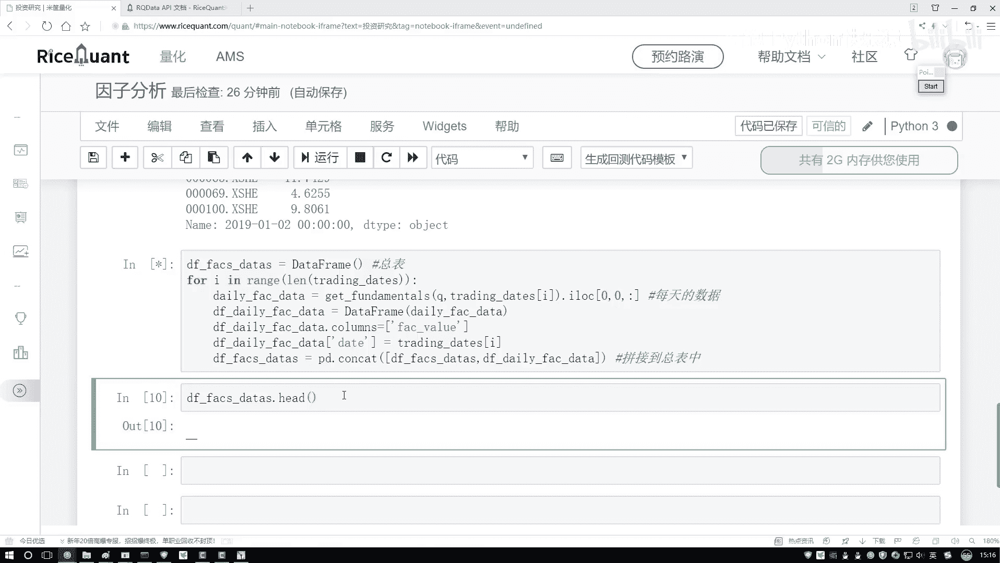

我们需要这几个指标来看一看呃，稍微再等几秒啊。

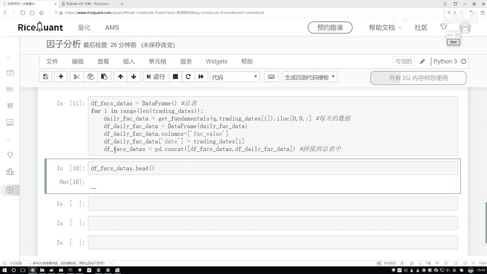

咱们就哎来执行一下好啦，你看一下这些是不是我们想要的股票啊，他是具具体是什么，不管了，它的一个值是不是也有了它的一个日期是有了，这样是咱们现在完成第一步哎。

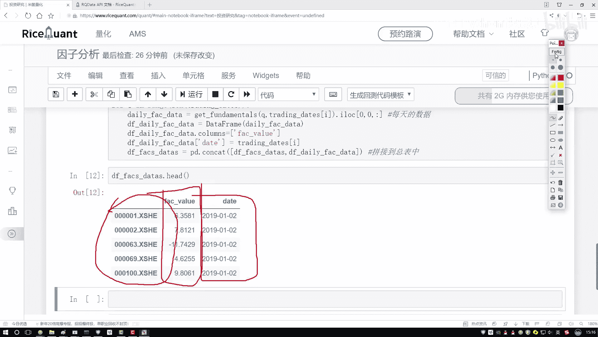

把我们的数据啊全部给它取出来了，取的过程当中啊，其实挺麻烦的，但是也没什么好办法，你不能就是有个憨豆瓣自动一天天给你执行。

所以说咱必须得自己完成这样一个操作。

