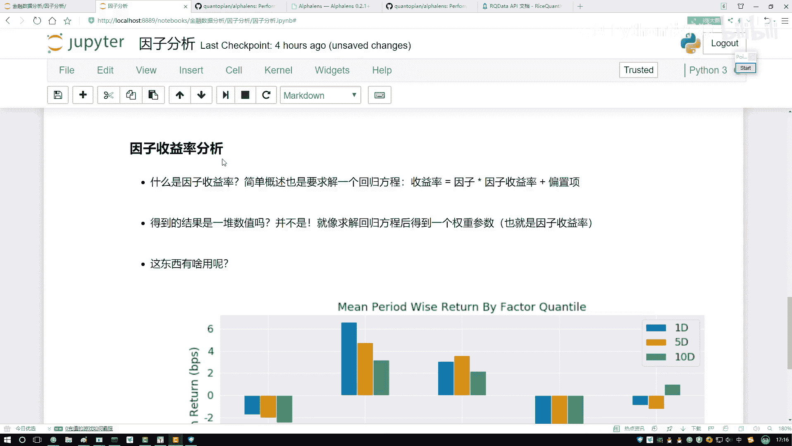

# 吹爆！2023B站公认最系统的Python金融分析与量化交易实战教程，3小时入门AI量化交易，看完还学不会你来打我！人工智能｜机器学习｜时间序列｜股票预测 - P47：8-因子收益率简介 - 人工智能博士 - BV1aP411z7sz

接下来咱们再来看一下这个因子收益率啊该怎么样进行分析，先来解释一下吧什么叫做一个因子收益率，这里啊咱们得来区分看一看，来先回顾一下之前咱们讲那个叫什么，叫做一个IC值吧。

IC值感觉好像也是因子和收益率之间的关系啊，但是啊注意点，在IC值当中我们计算的是，因子和收益率之间的一个相关性吧，计算的是它们的相关性，现在我们要算什么，来注意点咱们名字的区别啊。

我们现在要算的是因子收益率啊是一个值，而不是什么两个之间的它们的关系而是一个值啊，那现在解释一下，这个因子收益率啊这个值它怎么体现出来呢，咱们来看这个公式啊这个公式给大家列出来了。

公式怎么列的收益率大概解释了吧，大概这一天减前一天的比上前一天的一个结果，说盘架当中这是一个收益率，收益率啊我说它等于这样，等于一个因子乘上因子收益率再加偏置项。

给我们的感觉啊大家去看看先问这样一个事啊，我说现在有个恢复方程有个目标值Y，这个目标值Y啊跟我的一个输入跟这个因子之间有一些关系，我说因子就是X，然后呢因子啊怎么样能跟这个收益率成关系呢。

它就乘上一个权重参数再加上这样一个偏置项吧，咱们现在所说的叫什么，因子收益率说的是谁啊，就是现在我框起来的这个W啊，它是因子收益率，所以说啊最终，你说我求出来结果应该是什么，是不是应该是一个值啊。

而不应该是一堆烂把锹的东西吧，注意点现在我们要做这样一件事，比如说啊好多因子拿回来了，咱们有一百两百个不说了，每个因子我是不是都能去算它的一个收益率啊，那好了因子收益率拿来之后，我每一个因子算收益率了。

我是不是可以看一看哪些因子收益率高啊，咱们可以求解这样一个指标吧，这个叫做一个因子收益率啊，然后这都有什么用呢，你看它描述什么，咱们直接来看这个图吧，这个图就是咱们一会儿会去画的非常简单。

在这个图当中啊这里你看它写了一个12345，是这样一件事，把咱们的因子它的一个区间吧，做了这样的一个划分啊，就像咱们刚才说的有0-0。2，0。2-0。24，0。24-0。26，0。26-0。28。

还有0。28-0。20吧，好了可以把我因子作为划分，对每一段上的因子我都会看什么，都会看一看当前这一段的一个因子能给我带来什么，我们的一个收益是有多大的吧，那这里我们来看，哎你说这个图当中啊。

哪块的区间我觉得是比较好的，应该是二号这个区间吧，因为此时咱们怎么样，给我带来的一个平均收益怎么样，通过这个因子它使得给我带来的收益会比较大吧，这个就是我们要去观察的一个结果，第一点我们也看一下。

哪些个因子或者说这个因子在什么样的一个段上，能够使得咱们的结果，或者说使得我们的收益能够更大一些，这个是从可视化角来说，对每个因子分析一下，哎呦它的一个取值大于什么时候合适，这是第一点，第二点呢。

我们是不是确实能把这个因子收益率给它实际的算出来啊，算出来之后，这是不是我们的一个筛选的指标啊，比如说任务来了五把因子，我让你就选三十个，咱们是不是可以参考因子收益率来去选啊。

但是我们选的过程当中肯定不是单独考虑的收益率，还要考虑什么，上面咱们不是说有IC值吗，IC值，哎，它是不是也是一个指标啊，并且IC值当中还有一个什么，一个mean，还有一个STD。

mean比STD等于什么，信息比率吧，信息比率表示它的稳定性吧，是不是好多评估指标，咱都可以综合去看啊，那最终我们可能要去就是评比一个成绩，看一看综合来看，综合好多指标来看，哪些因子能够更胜出一些啊。

这是另外一个支点叫因子收益率，知道一点就行了，就是因子收益率，哎，它是这样的一个像权重参数的实际是这么去算的啊，来去把因子跟收益率啊结合在一起，我就看一下当前这个权重参数它得多少。

求出来的就叫做因子收益率了啊，在待会儿当中给大家看一下吧，这个比较简单，呃，直接把这个API复制过来了，因为没有什么数据可处理了，也不需要去做啥了，直接咱们来执行就可以了，执行过程当中啊，呃。

它会帮你去把这个图全部的给画出来，这里啊，咱们再稍微等一会儿，一会儿它就能帮我把这个图画出来了，然后一会儿画完图之后，再大家看一看，呃，怎么样去计算，咱最终的一个结果啊，这一些警告都不用去管啊。

这平台可能有一些工具包版本不匹配之间的一个原因，这个咱不用管，刚才啊，在这个Numerous book当中给大家画出来的图，其实就是电脑人间API直接得到的一个结果，看一看吧。

看出不出来这个结果还没出来，再稍微等个几秒，估计这个结果就有了，好了，这里结果已经给大家展示出来了，就是我刚才哎，就是跟我刚才给大家画这个图，哎，它是个一模一样的，这一块给你算什么，是它的一个平均啊。

当然你可以不，你也可以不看平均啊，你直接看什么，你直接看它的一个分布，哎，是不是也可以啊，在这里，然后下面还有它的一个，不看这个走势情况，来直接看后面几个吧，后面几个当中还有它的一些对比，比如说，呃。

五组嘛，你看一共五个线条，每组它的一个情况，给你做了一个啊，受益率，它的一个对比，然后这一块就有一些对比结果，跟之前咱们结果有些都是类似的，这里就给大家提了一点就行，其实我们就要算这样一个值。

来看我现在计算值吧，计算值啊，这些不看了，就看这个ED的吧，就是啊，这个一期的在这一期当中啊，哎呀，这块其实还不对，咱没算完，咱们之前不是说了，哎，现在我们要算出来是一个值吗。

但是此时你看我传进来的是有不同的天吧，那每天可能都有这样一个结果，最终啊，咱们要算这个点命一下，哇，这个结果说点命一下，我们来看吧，点命完这个结果，你看是不是说我当前这个因子，哎，我的一个结果就有了呀。

那一会儿你说有300个因子，我们可以做评比吧，看一看哪个因子的指标高，或者哪个因子指标哎，怎么样，这是一种评估方法吧，相当于啊，我们又提出来了，哎，另外一种方法叫做一个因子收益率啊，这个不是特别重要。

也是比较简单的东西，在这里不给大家强调了，简单调也行，哎，有一个指标叫因子收益率啊，了解就可以行了，那这个就是我们在因子分析当中，给大家去介绍的，其实主要想说的就是这个AlphaLearns啊。

就这样一个工具包，这个工具包当中啊，有很多比较方便的函数啊，可以帮我们啊，去画图啊，去做预处理啊，去做展示啊，这个是我们重点啊，给大家说了一下，AlphaLearns，哎，这个东西比较好用，以后呢。

大家如果想做一些，更细致的因子分析，哎，可以考虑AlphaLearns，今天啊，咱们只给大家举例子，它的一些基本的做法，基本数据处理啊，我们一个流程。

怎么样去做啊。

