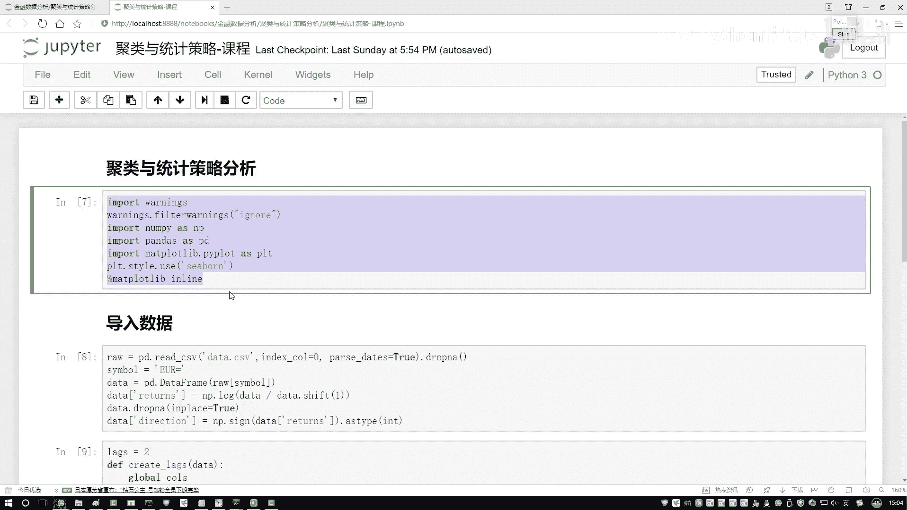

# 吹爆！2023B站公认最系统的Python金融分析与量化交易实战教程，3小时入门AI量化交易，看完还学不会你来打我！人工智能｜机器学习｜时间序列｜股票预测 - P55：1-聚类分析实例 - 人工智能博士 - BV1aP411z7sz

好这节课咱们来看一下剧类还有统计的策略方法，我们在排练当中咱们该怎么样去做，首先还是第一步先把咱们这些工具包全部的给导进来，跟咱们之前一样工具包是没有发生任何变化的。

然后第二步就是导入咱们现在要用的这份数据，上节课咱们是不是跟大家说过了，对于这个数据我们要提取出来一些特征吧，这块我们选了两个特征就是前一天它的一个指标，还有前两天它的一个指标。

这两个信息是一会我们要建模的时候用到的两个具体的指标，然后接下来有了指标之后我们就可以做一些建模的事情了吧，这次咱们做的任务跟之前不太一样，之前我们是用一些回归的方法去做，这回咱们拿剧类的方法来去做。

首先第一步咱们在这个SKlearn当中，之前咱们说了做一些建模方法最好用的包就是这个SKlearn了，然后这回我们选的模块跟之前不太一样，之前是回归这回我们用剧类，剧类当中有一个算法叫做K-Means。

咱们之前给大家讲了K-Means建模的一个基本方法，好了这第一步先把我的一个模块给导进来，然后上面执行，重新都执行一下导进一下我的模块，然后接下来我执行这样一个K-Means的操作。

在这里我说建立一个模型这个模型就是K-Means，然后这里边需要我们指定个参数，就是我们要建立有这么多少个簇一个cluster，cluster这里我们需要自己指定一下也就是一个K值。

咱们这个任务当中比较简单，我是不是说我想去判断一下什么时候涨了什么时候跌了，那也就是说两个结果一个-1一个1说就行了，好了我说指定个2去构成这么两个簇就行了，然后咱们执行一下。

我看这里ncluster我看这里少一个s是吧，再执行一下这样咱完成了一个建模操作，不是建模就是一个模型实例化操作，然后对我的model我说。fit一下，把咱们的实际数据传进去。

实际数据之前我说这里有一个data我们的数据，data当中我们要选择其中的某些列，这列名咱之前是不是也做好了，好了把这些列传进去我们进行一个模型建立就完事了。

这里显示出来了就是当我们建模的时候会用到的一些参数，这些参数当中都有一些处置值，比如说我的一个就是两个类别中心点处置化的一个方法，然后最大的一个点的次数，然后要聚成几个对。

然后就是我这个模型会重复的执行多少次，重复执行多少次是这样，就是之前给大家演示k-means当中不是每一次结果都是不一样吗，所以说当我们用聚类建模的时候，它不是建模一次就给你返回结果，它是建模的十次。

看这十次整体的一个结果把你返回每一个点，它的一个到底属于哪个处这样一个归属，这个就是有些参数大家如果说想详细看，在SKlearn当中官方文档里边都会有这样一个详细的介绍的。

然后接下来我说对我这个模型我建完之后，然后我要去预测一下当前咱们这批数据点，它都是预测结果都是什么，或者说得到一个0还是一个1代表着它属于哪一个处，在这一块电压当中我说指定一个新的电明。

就叫做当前我这个错它的一个归属就行了，flutter，行了然后我们来执行一下看一下当前的一个效果，执行完之后我们的处理当中已经有了这个错，这也这样我把这个结果再稍微改一改，因为你看就是当前我点开了之后。

这里边它是一个01，可能咱们要的并不是一个01而是什么，而是一个1和一个-1，所以这里我说我给它稍微改一改，安排点位置一下，数据当中就传入我们当前的一个预测结果，对预测结果做一个判断。

如果说它是1的时候，然后我说把1这个堆然后当做一个-1，然后把0那个堆当做一个1，相当于判断了两个堆，这里我们对数据稍微改一改，名字不用去变了还是这个名字就行，然后来执行一下。

这一回数据当中就是我们想要的一个结果了，比如这里你可以去给大家打开来看一看，你看这里边是什么，就是一个1还有-1了，这个结果我们现在已经有了吧，好了有了一个1还有一个-1之后。

接下来我是不是说可以对我的一个数据，给大家画个图吧，看一看咱剧里面都是长什么样子吧，画一个三点图，在这个三点图当中咱们来指定一下，第一个就是我的一个data，我先把这个数据给它传进去。

这个是我们当前的一个数据，这个数据当中我三点图里边，得指定这个x轴还有个y轴，我得重新画一下，先画这个x轴数据吧，然后取所有的数据样本点，冒号取所有吧，然后第一个维度当做一个x轴行了。

然后第二维度我当做一个y轴，这是第一个维度，然后这里我说改成第二个维度，是不是就行了，然后我说用不同的颜色吧，然后来表示这不同的一个错，我说指定一个c，c当中它是什么呢，c是这个，就是我们刚才创建好的。

它的一个到底它是一个1还是一个-1，来进行一个展示，然后接下来我说选择一个颜色就行，选择一个颜色那就是从浅到深的吧，从浅到深其实说白了，就是一个红色和一个蓝色，看一下吧，这里他就把这个图画出来了。

其中蓝色是一个粗，这个红色它是另外一个粗，这里咱们两个类别是不是已经划分好了，其实大家可以来看一下，在这个错当中，你看如果说它是一些负值的时候，就是昨天也跌前天也跌，那可能大概率今天也跌吧。

可能是有这样一个趋势，这个是我们拿了两个错，但是现在问题来了，那你说现在你做这样一件事，那它能靠谱吗，你看这里你就说这个东西一个是一个1，一个是一个-1，你直接这么说它能靠谱吗。

其实这个策略我从这个剧类角来说，用的不是特别多，因为剧类它没有一个指导思想，所以说今天这个任务，大家只需要简单熟悉一下，剧类咱们是怎么去做的，以及在这个剧类当中，咱们得到什么样的一个结果就行了。

实际当中可能剧类效果，它的一个效果来说，并不是会特别好，试一下在咱们这个任务当中，然后returns，然后之前呈上我们的一个，我看是不是returns，名字是没写错，returns给拿过来。

看一下咱这个剧类能使得咱们赚多少钱，这里算了一下咱们能挣多少钱，然后指定一下，我们得到了一个新的列名，这个列名就叫做我们的一个clutter，然后它的一个returns，然后我们来看一下，执行一下。

执行完之后咱就可以，这个数据还没还原，咱得把这个数据之前不是做了个对数吗，现在我们给它还原一下，重新的还原一下，把这个列还原回去，要对比哪两个指标来着，第一个是一个returns原始的。

第二个就是一个咱们剧类得到的一个结果，对于它然后我说。sum一下，sum完之后我说。apply一下，咱们的一个。num。exp数就行了，这回我们做一个还原，还原回去之后，再来看结果吧。

看起来这个效果不是特别好，你看第一次就是当前，人家就是啥都不做，你是亏了一点，做完剧类之后，怎么好像亏的更多了呢，这也这样可能就由于剧类当中有一些随机性，导致这样一个问题。

这样我说我把这个东西给它restart一下，咱重新再执行一次，每次结果可能会不同，因为剧类当中有一些随机性，这个当中还是一个链下6G，看起来效果反而不如之前了，是不是，效果稍微的有这么一点点的一个下降。

刚才忽略了一个问题，就是在这个剧类当中，我们刷算它的一个归属的时候，这两个点可能写的稍微有点反，应该是应该是一个1和一个-1，感觉会更靠谱一点，这样咱来重新执行一下，因为剧类来说，这个结果不是特别可控。

所以说咱们得到结果得多做一些尝试，你看刚才我是不是写反了，刚才这边写了一个-1和1，那正常情况下应该是1和-1，所以说现在当我们算完之后，我们的一个剧类，它的一个收益效果看起来还不错，是不是。

这个只给大家举个例子，在这个例子当中，看起来收益还不错，但是实际当中像我该说的，剧类这个东西毕竟它是不靠谱的，并且当我们去评估去分析的时候，剧类很难去分析很难评估，因为我没有标签没法做什么。

没法像是一些传统技术问题，做一些分析，还有评估，还有看一看最终结果怎么样，这个是一个剧类，给大家讲剧类的原因，就是一旦给你逼到实在没招的时候，咱采用剧类，一般情况下。

我们并不使用剧类这种方法。

只需要大家了解就可以了。