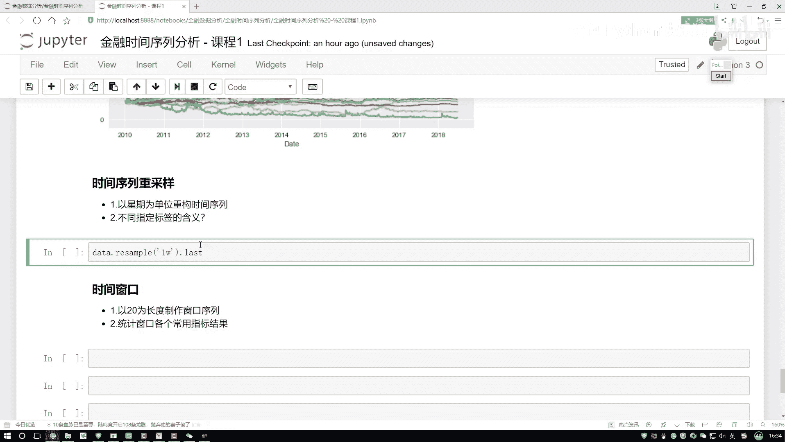

# 吹爆！2023B站公认最系统的Python金融分析与量化交易实战教程，3小时入门AI量化交易，看完还学不会你来打我！人工智能｜机器学习｜时间序列｜股票预测 - P8：2-时间序列重采样操作 - 人工智能博士 - BV1aP411z7sz

接下来咱们再来看这个重采样还有时间创口操作，重采样咱们之前说过了，就是正常数据它是按照以天为单位的，或者是以其他为单位的，现在我们想把这个单位做一个调整，比如说之前你是按天统计的，那我现在我换一个吧。

我说我换照以周为统计的，以年为统计的，以月为统计的，是不是也可以，直接对咱们这个data做什么，对一个resimple操作，resimple完之后，咱们就相当于得到了这个重采样的结果，重采样的过程当中。

你需要给我指定最少一个参数，就是你告诉我，以什么为单位是吧，那好了，以周为单位，一周为单位，两周为单位，是不是都行，以周为单位的时候，那你说显示的时候，你是显示个均值呢，还是第一个值，还是中位数呢。

还是什么指标呢，自己来指定，什么指标都行，指定指标之后，然后来指定一个head，然后咱看一下结果，你看这里，你看这块，它是直接1月10号了，咱看一下为什么是1月10号，因为原始数据当中。

这一块前面都没有，所以说我做了一个重采样，相当于一周是这样一个窗口，我看看一二三，大概是这样一个窗口，把这个窗口做完之后，咱得到了当前的一个结果，这是我们现在做了一个，以周为重采样之后，得到的一份结果。

其实就是不光，就是以周七天七天往上涨，其实我们不光能以周的，那还可以以什么，再换一下，比如说我现在不以周，然后我以月，一个月行吧，是不是也能得到一个结果，但是这里大家需要注意一点，你看这块我第二点说了。

咱可以用什么，不同的一个标签，什么叫不同的一个标签，给大家来看一看，就拿第二个事来说，这里我们还可以，再加进来一个参数，比如说这里，我这块写的是，这么一个月是吧，然后我在这个label当中。

label里边，我说给它加上一变换，加什么，你可以把这个标签，放到一个左边，或者说我给它放到一个右边，什么叫左边，还有右边，咱们来看一下，这个label当中，你看就是，如果说我指定成一个left。

咱默认是一个right，咱指定个left，咱来看一看，你看这个结果什么，原来第一个数据，是1月31号，但是现在这个数据是12月31号，看起来数值，不是那个统计，怎么多统计一个月，这里是1月31号。

但是你看数值，你看这里1月31号这个数值，和这里12月31号这个数值，大家来对比一下，你说是不是一模一样了，是不是一模一样的东西，他们之间什么意思呢，他说这样一件事，就是，现在你虽然说，这是一个月数据。

统计完之后，你要以哪一天为命名，left，就是第一天，right，就是最后一天，用哪一天来当做当前这个数据，它的一个命名，或者当做它的一个所以名字，或者叫做一个日期名字，这里就根据你不同任务来去选了。

比如说现在你觉着，用前面的可是，你就自己指定一个left，你觉得right合适，你就指定这个right，是不是可以了，不要忘记这块还有一个指标，叫做一个不同的标签，一般就是left和right。

你自己选，看一看什么值合适，我估计大部分情况下，还都是一个right的，因为你看，当你指定成一个，一左边的时候，数据当中都没有31号，你还出现一个31号，这是不太靠谱的，这样一个意思，下面这个值。

下面这个值1月31号，它其实描述是什么，描述是从它开始，2月份的一个情况，所以说你最好指定成一个，就是right的形式，是符合咱们观察的一个逻辑，当然可能不同任务，大家做法的需求可能不太一样。

这个就是一个时间序列的中产样，也是比较简单的，直接咱就可以把这个数据，按照你想要的结果，做很多重采样的方法，好接下来，接下来就是我现在，不光要做重采样，不是做重采样，我要做一个窗口，什么叫窗口。

我是这样，现在我说这是有一批数据行吧，好了，在我这批数据当中这样，我说现在我这个数据当中，我要做很多序列出来，这个序列可能不是，不是一天，那什么意思呢，这里面有一百天数据行吧，好了，我说我去结。

我说结的第一个窗口是这样，我说我结了，10天可能话有点大了，我说这是10天数据行吧，结完这10天之后，我说下我再结10天，我说这个是一个一号数据，是这10天的，然后我说我再结个二号数据，二号数据。

它可能是从第二天到第11天的，可以吧，然后我说我再结个三号数据，三号数据可能是不光到11天，到第三天，到第12天，可以吧，我可以10天时间去结，每一个10天往后，像是滑动窗口似的，移了一个单位，可以吧。

这个东西你叫做滑动窗口，或者叫时间窗口都行，我们要做这样一件事，行了，咋做这个东西，给大家看一下，咱们现在怎么样去做这件事，首先第一步还是，把我们的数据拿过来，然后你可以指定这样的一个window。

就是我们的一个窗口，比如说咱这个窗口是等于10的，可以吧，然后接下来对我的数据执行，这样一个操作窗口是10，data当中数据，数据当中我选一列，就选这一列得了，数据当中咱选择某一列指标。

然后对这个指标指什么样，我做一个rowing的操作，就该说的，你要做好多窗口做滑动了，然后这里边有个参数，就是一个window，window当中你自己指定，它的window得多少，这块我自己指定了。

就等于我这个window得了，这个window等于我单一的window，可以吧，然后统计完之后，你看统计完之后，它现在这个结果，展示的不是特别舒服，因为现在它是好多个序列，咱可能展示的不是特别好看。

这样我给这个序列，我算每个序列当中，它的一个最小值可以吧，相当于我第一个窗口的最小值，第二个窗口的最小值，第三个窗口当中最小值，可以吧，这就能展示出来了，做一下，前几个都是NN值，因为这里边。

它是我们得有10个，才能做当前这样的一个展示，好了，这里边就是我当前画出来的一份，结果，这个结果不太好，这个结果比较闹心，因为数据当中，但凡一个窗口当中，存在这个NN值，这很多东西都展示不出来，这样。

咱先得先对我数据做预处理，这块大家倒是做出加一步，得先对我数据做预处理，你得先把这个缺失值，给它剔除掉，要不然不行，在这里，得把这个data，重新的构建一下，我说我的data，等于我当前的。

DataFrame当中，我去Job一下，Job一个NA，就是我去做一个缺失值，然后我写个data2，data2等于data。JobNA，然后我把这个东西，都拿做data2来去做，行了，这回咱就有了。

你看这回咱下面的，都不是空值了吧，因为上面就是空值正常的，因为窗口还没到那个长度，是不是，然后下面，你看之前咱算有AN值，现在怎么样，就都没有了，这样我就得到了，这是第几个，我都不数了。

这是第多少个窗口，然后它的一个最小值，第多少窗口，它的一个最小值，咱是不是能把数据结果，全部的给它算出来，这块，咱把这个结果得到手了，如果说你想对好多个窗口，都执行这样一些统计的操作，那怎么办呢。

咱可以把序列都可以加一加，我来这边写一写，我说现在，重新的我构建一个data，我说data当中，我加上一些列，data2当中，我加上一些列，加上一些什么列，我说这块，它是一个最小值，是吧，好了。

我指定一个，这是一个最小值，然后等于它的一个最小值，然后可以再加，这块不管有最小值，我还可以统计，它的一个最大值，然后这就是一个最大值，然后再写几个，再写一个均值和一个ST得了，命值。

然后这块一个STD，这块也是点命一下，然后这里是点STD一下就行了，然后指定完之后，我把这个数据，还是给大家打印来看一下，点hide一下，行了，看后面几个指标，这块怎么样，是不是，点hide不行。

这么对吧，你点tile一下，点tile当中，是不是这个结果，咱就给它算出来了，这块就是咱当前的一份结果，不光我们把前绝指标写出来了，还有什么，基于当前这个窗口当中，最小值，最大值，还有它符合它序列。

符合它窗口当中，所有的一些统计值，咱是不是全部给它画出来了，基于窗口来去画的，相当于是以这样一个范围，来去统计当前的我的一些结果，这就是我们的一个实验窗口，或者是实验序列怎么去做。

以及我们可以对实验序列，执行的一些操作，不要忘记一点，就是你对这些窗口，在做操作的时候，先做一个预处理，你得把这些，确实值给去掉，因为刚才给大家演示的时候，我刚才就忘了，如果你没去掉确实值。

它这块怎么样，会出现好多AN，所以说第一步，咱得先把数据做好预处理，这可能是很多数据分析任务当中，我们第一步。

先做我们的一个预处理的操作。

